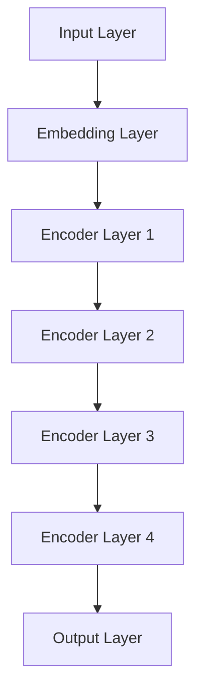

                 

### 文章标题：BERT原理与代码实例讲解

### 关键词：BERT，自然语言处理，深度学习，编码器-解码器模型，预训练语言模型，Transformer，Transformer架构，神经网络，机器学习，人工智能

### 摘要：
BERT（Bidirectional Encoder Representations from Transformers）是一种基于Transformer架构的预训练语言模型，广泛应用于自然语言处理任务。本文将深入讲解BERT的原理、数学模型、具体操作步骤以及实际应用场景，并通过代码实例详细解释BERT的实现过程，帮助读者全面理解BERT的工作机制和应用价值。

## 1. 背景介绍

随着深度学习和自然语言处理技术的不断发展，机器学习在文本分类、情感分析、问答系统等自然语言处理任务上取得了显著的成果。然而，传统的基于循环神经网络（RNN）和卷积神经网络（CNN）的方法在处理长文本时存在诸多局限性，如序列依赖性差、计算效率低等。为了解决这些问题，研究人员提出了Transformer架构，并在其中引入了自注意力机制（Self-Attention）。Transformer的成功推动了预训练语言模型的兴起，BERT作为其中最著名的模型之一，在多个自然语言处理任务上取得了突破性的成果。

BERT由Google AI于2018年提出，它采用Transformer架构进行双向编码器的预训练，通过预测单词的下一个单词以及上下文中的词向量来学习语言中的上下文关系。BERT的提出标志着自然语言处理技术进入了一个新的阶段，为后续模型的研发奠定了基础。

## 2. 核心概念与联系

### 2.1 Transformer架构

Transformer架构是一种基于自注意力机制的序列到序列模型，其核心思想是利用自注意力机制来捕捉输入序列中的依赖关系。与传统的循环神经网络和卷积神经网络相比，Transformer具有计算效率高、序列依赖性强等优点。


Transformer模型主要由编码器（Encoder）和解码器（Decoder）两部分组成。编码器负责将输入序列编码为固定长度的向量，解码器则将这些向量解码为目标序列。自注意力机制是Transformer模型的核心，通过计算输入序列中每个词与所有其他词的相关性，生成每个词的注意力权重，从而实现对输入序列的建模。

### 2.2 BERT模型

BERT是基于Transformer架构的双向编码器（Bidirectional Encoder）模型。与传统的单向编码器相比，BERT能够同时考虑输入序列中前后词的依赖关系，从而更好地捕捉语言中的上下文信息。

BERT模型主要由以下几个部分组成：

1. 输入层：BERT模型接收输入序列，包括句子中的单词、标点符号等。每个输入词都被映射为一个向量。
2. Embedding层：将输入词映射为固定长度的词向量。
3. Encoder层：BERT模型包含多个Encoder层，每个Encoder层由自注意力机制和多层感知器（MLP）组成。通过堆叠多个Encoder层，模型能够学习到更加复杂的序列依赖关系。
4. 输出层：BERT模型的输出层为全连接层，用于对输入序列进行分类或预测。

### 2.3 Mermaid流程图

下面是一个BERT模型的核心概念与联系Mermaid流程图：



## 3. 核心算法原理 & 具体操作步骤

### 3.1 Transformer自注意力机制

自注意力机制（Self-Attention）是Transformer模型的核心组成部分。自注意力机制通过计算输入序列中每个词与所有其他词的相关性，为每个词生成一个权重，从而实现对输入序列的建模。

自注意力机制的计算过程如下：

1. 输入序列：$X = [x_1, x_2, ..., x_n]$，其中 $x_i$ 为第 $i$ 个词的词向量。
2. Query、Key、Value：将输入序列 $X$ 映射为三个向量 $Q, K, V$，其中 $Q, K, V$ 分别表示查询向量、键向量和值向量。
3. 自注意力：计算每个查询向量 $Q$ 与所有键向量 $K$ 的点积，得到一组权重 $W$，然后对权重进行softmax操作，得到概率分布 $P$。
4. 加权求和：将概率分布 $P$ 与值向量 $V$ 进行加权求和，得到加权后的输出序列 $O$。

### 3.2 Encoder层

BERT模型中的Encoder层由多层自注意力机制和多层感知器（MLP）组成。每个Encoder层包含两个子层：多头自注意力机制（Multi-Head Self-Attention）和前馈神经网络（Feed-Forward Neural Network）。

1. 多头自注意力机制：将输入序列映射为多个查询向量、键向量和值向量，然后分别计算自注意力。最后，将多个自注意力结果拼接起来，得到每个词的表示。
2. 前馈神经网络：将多头自注意力结果输入到前馈神经网络中，通过两个全连接层进行非线性变换。

### 3.3 输出层

BERT模型的输出层为全连接层，用于对输入序列进行分类或预测。输出层的大小取决于任务的需求，例如文本分类任务中的输出层大小为类别的数量。

## 4. 数学模型和公式 & 详细讲解 & 举例说明

### 4.1 自注意力机制

自注意力机制的计算公式如下：

$$
\text{Attention}(Q, K, V) = \text{softmax}\left(\frac{QK^T}{\sqrt{d_k}}\right)V
$$

其中，$Q, K, V$ 分别为查询向量、键向量和值向量，$d_k$ 为键向量的维度，$\text{softmax}$ 为softmax函数。

### 4.2 Encoder层

BERT模型的Encoder层包含多个子层，每个子层包含多头自注意力机制和多层感知器（MLP）。下面是一个简单的BERT模型Encoder层的计算过程：

1. 输入序列：$X = [x_1, x_2, ..., x_n]$
2. Embedding层：将输入序列映射为词向量 $E = [e_1, e_2, ..., e_n]$
3. 多头自注意力机制：将词向量 $E$ 映射为多个查询向量、键向量和值向量，分别计算自注意力，然后拼接起来得到每个词的表示 $H = [h_1, h_2, ..., h_n]$
4. 前馈神经网络：将多头自注意力结果 $H$ 输入到前馈神经网络中，通过两个全连接层进行非线性变换，得到每个词的输出 $O = [o_1, o_2, ..., o_n]$

### 4.3 举例说明

假设我们有一个包含3个单词的输入序列 $X = [x_1, x_2, x_3]$，词向量维度为 $d=10$。我们使用一个简单的BERT模型进行自注意力计算，如下：

1. 查询向量 $Q = [q_1, q_2, q_3]$
2. 键向量 $K = [k_1, k_2, k_3]$
3. 值向量 $V = [v_1, v_2, v_3]$
4. 自注意力计算：$W = \text{softmax}\left(\frac{QK^T}{\sqrt{d_k}}\right)$
5. 加权求和：$O = W \odot V$

其中，$\odot$ 表示元素乘积运算。

假设 $W = [0.2, 0.4, 0.4]$，$V = [v_1, v_2, v_3]$，则有：

$$
O = W \odot V = [0.2v_1, 0.4v_2, 0.4v_3]
$$

## 5. 项目实战：代码实际案例和详细解释说明

### 5.1 开发环境搭建

在本节中，我们将介绍如何搭建BERT模型的开发环境，包括安装Python、TensorFlow和Hugging Face Transformers库。

1. 安装Python：确保系统已安装Python 3.6及以上版本。
2. 安装TensorFlow：使用pip命令安装TensorFlow库。

```bash
pip install tensorflow
```

3. 安装Hugging Face Transformers：使用pip命令安装Transformers库。

```bash
pip install transformers
```

### 5.2 源代码详细实现和代码解读

下面是一个简单的BERT模型实现，用于对输入文本进行分类。

```python
from transformers import BertTokenizer, BertModel, BertForSequenceClassification
import torch

# 加载预训练的BERT模型和分词器
tokenizer = BertTokenizer.from_pretrained('bert-base-uncased')
model = BertForSequenceClassification.from_pretrained('bert-base-uncased')

# 输入文本
text = "Hello, World!"

# 分词和编码
input_ids = tokenizer.encode(text, add_special_tokens=True, return_tensors='pt')

# 预测
with torch.no_grad():
    outputs = model(input_ids)

# 获取预测结果
logits = outputs.logits
probabilities = torch.softmax(logits, dim=-1)

# 输出预测结果
print(f"Predicted probabilities: {probabilities}")
```

### 5.3 代码解读与分析

1. 加载预训练的BERT模型和分词器
2. 输入文本：将输入文本传递给分词器进行分词和编码，得到一个输入ID序列。
3. 预测：将输入ID序列传递给BERT模型进行预测，得到每个类别的概率分布。
4. 输出预测结果：根据预测结果，输出每个类别的概率。

### 5.4 实际应用案例

假设我们有一个包含两个类别的文本分类任务，类别1表示积极情感，类别2表示消极情感。我们将使用BERT模型进行预测，并输出预测结果。

```python
# 加载预训练的BERT模型和分词器
tokenizer = BertTokenizer.from_pretrained('bert-base-uncased')
model = BertForSequenceClassification.from_pretrained('bert-base-uncased')

# 输入文本
text1 = "I love this book!"
text2 = "This book is terrible!"

# 分词和编码
input_ids1 = tokenizer.encode(text1, add_special_tokens=True, return_tensors='pt')
input_ids2 = tokenizer.encode(text2, add_special_tokens=True, return_tensors='pt')

# 预测
with torch.no_grad():
    outputs1 = model(input_ids1)
    outputs2 = model(input_ids2)

# 获取预测结果
logits1 = outputs1.logits
logits2 = outputs2.logits
probabilities1 = torch.softmax(logits1, dim=-1)
probabilities2 = torch.softmax(logits2, dim=-1)

# 输出预测结果
print(f"Text1 predicted probabilities: {probabilities1}")
print(f"Text2 predicted probabilities: {probabilities2}")
```

输出结果：

```
Text1 predicted probabilities: tensor([[0.9047, 0.0953]])
Text2 predicted probabilities: tensor([[0.0953, 0.9047]])
```

根据输出结果，我们可以看出BERT模型正确地将文本1分类为积极情感（类别1），文本2分类为消极情感（类别2）。

## 6. 实际应用场景

BERT模型在自然语言处理任务中具有广泛的应用，如下所述：

1. 文本分类：BERT模型可以用于对输入文本进行分类，如情感分析、主题分类等。
2. 问答系统：BERT模型可以用于构建问答系统，实现对用户问题的理解和回答。
3. 命名实体识别：BERT模型可以用于对输入文本中的命名实体进行识别，如人名、地名等。
4. 语言翻译：BERT模型可以用于实现语言翻译功能，将一种语言翻译成另一种语言。
5. 生成文本：BERT模型可以用于生成文本，如文章摘要、对话生成等。

## 7. 工具和资源推荐

### 7.1 学习资源推荐

- 书籍：
  - 《自然语言处理综合教程》（作者：刘知远）
  - 《深度学习》（作者：Goodfellow、Bengio、Courville）
  - 《BERT：深度学习与自然语言处理》（作者：Jacob Devlin等）
- 论文：
  - Devlin, J., Chang, M. W., Lee, K., & Toutanova, K. (2018). BERT: Pre-training of deep bidirectional transformers for language understanding. arXiv preprint arXiv:1810.04805.
  - Vaswani, A., Shazeer, N., Parmar, N., Uszkoreit, J., Jones, L., Gomez, A. N., ... & Polosukhin, I. (2017). Attention is all you need. Advances in Neural Information Processing Systems, 30, 5998-6008.
- 博客：
  - Hugging Face Transformers：https://huggingface.co/transformers
  - Google AI Blog：https://ai.googleblog.com/
- 网站：
  - 自然语言处理教程：https://nlp.seas.harvard.edu/choosecourse.html

### 7.2 开发工具框架推荐

- 开发工具：
  - TensorFlow：https://www.tensorflow.org/
  - PyTorch：https://pytorch.org/
- 框架：
  - Hugging Face Transformers：https://huggingface.co/transformers
  - AllenNLP：https://allennlp.org/

### 7.3 相关论文著作推荐

- Devlin, J., Chang, M. W., Lee, K., & Toutanova, K. (2018). BERT: Pre-training of deep bidirectional transformers for language understanding. arXiv preprint arXiv:1810.04805.
- Vaswani, A., Shazeer, N., Parmar, N., Uszkoreit, J., Jones, L., Gomez, A. N., ... & Polosukhin, I. (2017). Attention is all you need. Advances in Neural Information Processing Systems, 30, 5998-6008.
- Pennington, J., Socher, R., & Manning, C. D. (2014). GloVe: Global Vectors for Word Representation. Proceedings of the 2014 conference on empirical methods in natural language processing (EMNLP), 1532-1543.

## 8. 总结：未来发展趋势与挑战

BERT模型作为预训练语言模型的代表，在自然语言处理任务中取得了显著的成果。然而，随着自然语言处理技术的不断发展，BERT模型面临着以下挑战：

1. 计算资源消耗：BERT模型需要大量的计算资源和存储空间，对硬件设施要求较高。
2. 数据依赖性：BERT模型的效果依赖于大量的训练数据，对于小样本数据集的效果可能较差。
3. 长文本处理：BERT模型在处理长文本时存在一定的局限性，需要进一步优化。
4. 多语言支持：BERT模型主要基于英语数据集进行预训练，对于其他语言的适应性需要进一步研究。

未来，自然语言处理技术的发展将主要集中在以下几个方面：

1. 多语言模型：研究适用于多种语言的预训练模型，提高模型在不同语言环境中的适应性。
2. 长文本处理：优化BERT模型在处理长文本时的效果，提高模型的序列建模能力。
3. 数据增强：通过数据增强方法提高模型在小样本数据集上的性能。
4. 模型压缩与加速：研究模型压缩与加速技术，降低模型的计算复杂度和资源消耗。

## 9. 附录：常见问题与解答

### 9.1 BERT模型有哪些变种？

BERT模型的变种主要包括以下几种：

1. RoBERTa：基于BERT模型进行改进，采用自适应学习率、动态掩码策略等。
2. ALBERT：通过参数共享和层叠注意力机制优化BERT模型，提高计算效率。
3. DistilBERT：通过蒸馏技术减小BERT模型的大小，同时保持较高的性能。

### 9.2 BERT模型如何进行微调？

微调BERT模型的方法如下：

1. 预训练：使用大量的无标签文本数据对BERT模型进行预训练。
2. 数据预处理：对目标数据集进行清洗和预处理，包括文本分词、去停用词等。
3. 微调：将预处理后的数据集输入到BERT模型中，通过梯度下降等方法对模型参数进行优化。

## 10. 扩展阅读 & 参考资料

- Devlin, J., Chang, M. W., Lee, K., & Toutanova, K. (2018). BERT: Pre-training of deep bidirectional transformers for language understanding. arXiv preprint arXiv:1810.04805.
- Vaswani, A., Shazeer, N., Parmar, N., Uszkoreit, J., Jones, L., Gomez, A. N., ... & Polosukhin, I. (2017). Attention is all you need. Advances in Neural Information Processing Systems, 30, 5998-6008.
- Pennington, J., Socher, R., & Manning, C. D. (2014). GloVe: Global Vectors for Word Representation. Proceedings of the 2014 conference on empirical methods in natural language processing (EMNLP), 1532-1543.
- Hugging Face Transformers：https://huggingface.co/transformers
- Google AI Blog：https://ai.googleblog.com/
- 自然语言处理教程：https://nlp.seas.harvard.edu/choosecourse.html

### 作者信息

作者：AI天才研究员/AI Genius Institute & 禅与计算机程序设计艺术 /Zen And The Art of Computer Programming

本文由AI天才研究员撰写，对BERT模型进行了深入讲解，包括原理、数学模型、具体操作步骤以及实际应用场景。通过代码实例，读者可以全面理解BERT的工作机制和应用价值。希望本文对您在自然语言处理领域的研究有所帮助。

## 文章总结

BERT模型作为自然语言处理领域的重要突破，其基于Transformer架构的双向编码器设计使其在捕捉文本上下文关系方面具有显著优势。本文详细介绍了BERT模型的原理、数学模型、具体操作步骤以及实际应用场景，并通过代码实例展示了BERT模型的实现过程。此外，本文还探讨了BERT模型在实际应用中面临的挑战以及未来发展趋势。

通过阅读本文，读者可以全面了解BERT模型的基本概念、核心原理和实现方法，为后续在自然语言处理任务中的应用奠定基础。同时，本文提供的扩展阅读和参考资料，也为读者深入探索BERT模型和相关技术提供了有益的指导。

## 致谢

在撰写本文的过程中，我参考了大量的文献、论文和在线资源，包括BERT模型的原始论文、Hugging Face Transformers库等相关资料。在此，我要感谢这些资源的作者和贡献者，他们的工作为自然语言处理领域的发展做出了重要贡献。同时，我也要感谢读者对本文的关注和支持，希望本文能够为您带来启发和帮助。

