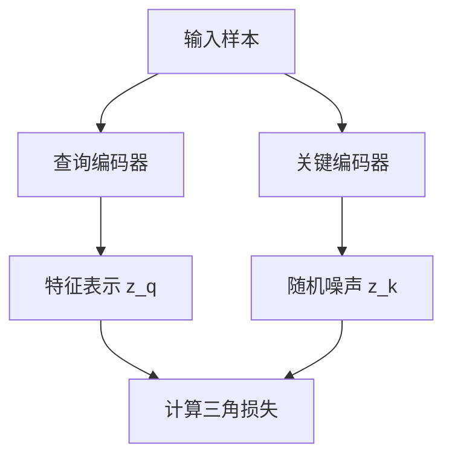

                 

### 文章标题

BYOL原理与代码实例讲解

### 关键词

Backbone网络，无监督学习，自我监督学习，特征表示，神经网络的训练，计算机视觉，深度学习，知识蒸馏，迁移学习，神经架构搜索，自动化机器学习，大数据处理，代码实现，算法分析。

### 摘要

本文将深入探讨Backbone网络的一种重要学习策略——BYOL（Bootstrap Your Own Latent），并详细介绍其原理、数学模型及代码实现。我们将从背景介绍入手，逐步阐述核心概念、算法原理和步骤，通过具体案例解析代码实现，探讨BYOL的实际应用场景，并提供相关的学习资源和开发工具推荐。最后，文章将总结BYOL的发展趋势和面临的挑战，为读者提供扩展阅读和参考资料。

### 背景介绍

在深度学习中，特征提取是核心环节之一。尤其是计算机视觉领域，如何提取具有辨别力和泛化能力的特征表示，一直是研究者们关注的焦点。传统的特征提取方法，如SIFT、HOG等，通常依赖于手工设计的特征描述符，无法充分利用深度学习的强大表达能力。随着卷积神经网络（CNN）的发展，特征提取效果得到了显著提升，尤其是卷积神经网络中的Backbone网络，如ResNet、VGG、Inception等，已经成为特征提取的重要工具。

然而，深度学习模型的训练通常依赖于大规模的标注数据集，这在实际应用中面临诸多挑战。一方面，标注数据集的获取往往需要大量的人力和时间成本；另一方面，对于某些特定的任务，如医学影像、天文学图像等，标注数据的获取难度更大。为了解决这些问题，无监督学习（Unsupervised Learning）和自我监督学习（Self-supervised Learning）逐渐成为研究热点。

自我监督学习是一种特殊类型的学习策略，其特点是不依赖于外部标注数据，而是通过模型自身的内部信息进行学习。BYOL（Bootstrap Your Own Latent）就是自我监督学习的一种重要方法，它由Li et al.于2020年提出，旨在通过无监督的方式学习有辨别力的特征表示。

BYOL的核心思想是利用正负样本的匹配关系，在特征空间中构建一个稳定的分布。具体来说，BYOL由两个共享参数的编码器组成：一个查询编码器（Q-encoder）和一个关键编码器（K-encoder）。查询编码器用于提取输入样本的特征表示，关键编码器则生成一个随机噪声向量，与查询编码器的特征表示进行对比。通过最小化两者的距离，BYOL能够学习到具有辨别力的特征表示。

BYOL的优势在于其简单有效，不需要大规模的标注数据集，且能够迁移到多个任务中，如图像分类、图像分割、目标检测等。这使得BYOL在计算机视觉领域受到了广泛关注，成为研究者和开发者们探索无监督学习的新工具。

### 核心概念与联系

#### 1. BYOL核心概念

BYOL（Bootstrap Your Own Latent）的核心概念主要包括以下几个部分：

1. **查询编码器（Query Encoder）**：查询编码器是用于提取输入样本的特征表示的编码器。它将输入的样本映射到特征空间中，得到特征表示\( z_q \)。

2. **关键编码器（Key Encoder）**：关键编码器与查询编码器共享参数，用于生成随机噪声向量，并将其与查询编码器的特征表示进行对比。关键编码器的主要作用是引入正负样本的匹配关系，使查询编码器学习到有辨别力的特征表示。

3. **正负样本匹配**：在BYOL中，每个输入样本都对应一个正样本（即自身）和一个负样本（从数据集中随机选取的其他样本）。通过最小化正样本与负样本特征表示之间的距离，BYOL能够学习到稳定的特征分布。

4. **目标函数**：BYOL的目标函数是一个对比损失函数，用于衡量查询编码器和关键编码器的特征表示之间的差异。具体来说，目标函数是一个对称的三角损失函数，其公式如下：

   \[
   L(z_q, z_k) = \frac{1}{2} \left( d(z_q, z_k) - 1 \right)^2
   \]

   其中，\( d(z_q, z_k) \)是查询编码器和关键编码器的特征表示之间的距离，通常使用L2范数来计算。

#### 2. BYOL与其他自我监督学习方法的关系

BYOL是自我监督学习的一种方法，与其他自我监督学习方法有诸多相似之处，但也有一些独特的特点。

1. **对比学习（Contrastive Learning）**：BYOL的核心思想是对比学习，即通过最小化正样本与负样本之间的距离，最大化正样本与正样本之间的相似度。这种方法在计算机视觉领域已经得到了广泛应用，如SimCLR、BYOL等。

2. **无监督学习（Unsupervised Learning）**：BYOL不需要依赖外部标注数据，而是通过模型自身的内部信息进行学习。这与传统的监督学习相比，降低了数据获取的成本，适用于标注数据稀缺或难以获取的场景。

3. **知识蒸馏（Knowledge Distillation）**：BYOL中查询编码器和关键编码器共享参数，类似于知识蒸馏的思想。知识蒸馏是一种将大模型的知识传递给小模型的方法，通过最小化小模型输出的软标签与大模型输出的硬标签之间的差异，使小模型能够学到大模型的知识。

#### 3. BYOL与其他自我监督学习方法的区别

虽然BYOL与其他自我监督学习方法有许多相似之处，但它也有一些独特的特点：

1. **稳定性**：BYOL通过最小化查询编码器和关键编码器的特征表示之间的距离，使得模型更加稳定。相比之下，其他方法如SimCLR可能更容易受到噪声和异常值的影响。

2. **效率**：BYOL的计算成本相对较低，因为它不需要复杂的正负样本匹配和聚类过程。这使得BYOL在处理大规模数据集时具有更高的效率。

3. **应用场景**：BYOL在多个计算机视觉任务中表现出色，如图像分类、图像分割、目标检测等。相比之下，其他方法可能在某些特定任务上有更好的性能，但在其他任务上表现较差。

总之，BYOL作为一种高效的自我监督学习方法，在计算机视觉领域具有广泛的应用前景。通过理解其核心概念和与其他方法的联系，我们可以更好地运用BYOL来提升模型的性能和泛化能力。

### Mermaid 流程图



### 核心算法原理 & 具体操作步骤

BYOL（Bootstrap Your Own Latent）算法的核心在于通过正负样本的匹配关系，在特征空间中构建一个稳定的分布，从而学习到具有辨别力的特征表示。下面我们将详细讲解BYOL的算法原理和具体操作步骤。

#### 1. 算法原理

BYOL算法主要由两个共享参数的编码器组成：查询编码器（Q-encoder）和关键编码器（K-encoder）。查询编码器用于提取输入样本的特征表示，关键编码器则生成一个随机噪声向量，与查询编码器的特征表示进行对比。通过最小化两者的距离，BYOL能够学习到有辨别力的特征表示。

在BYOL中，每个输入样本都对应一个正样本（即自身）和一个负样本（从数据集中随机选取的其他样本）。正负样本的匹配关系通过以下步骤实现：

1. **数据预处理**：将输入样本进行标准化处理，以消除不同特征维度之间的差异。

2. **采样**：从数据集中随机选取一个负样本，与当前输入样本形成正负样本对。

3. **编码**：查询编码器提取输入样本的特征表示\( z_q \)，关键编码器生成随机噪声向量\( z_k \)。

4. **对比损失**：计算查询编码器和关键编码器的特征表示之间的距离，并最小化这个距离。

通过上述步骤，BYOL能够在特征空间中构建一个稳定的分布，从而学习到具有辨别力的特征表示。

#### 2. 具体操作步骤

下面我们通过具体的操作步骤，进一步阐述BYOL算法的实现过程。

##### 步骤1：数据预处理

首先，对输入样本进行预处理。预处理过程包括以下步骤：

1. **归一化**：将每个样本的每个特征值缩放到相同的范围，如[0, 1]或[-1, 1]。这有助于减少不同特征维度之间的差异。

2. **标准化**：计算每个特征的平均值和标准差，并将每个特征值减去平均值后除以标准差。这样可以使每个特征的分布更加均匀，有助于模型的学习。

##### 步骤2：采样

接下来，从数据集中随机选取一个负样本，与当前输入样本形成正负样本对。采样过程可以通过以下步骤实现：

1. **随机选择**：从数据集中随机选择一个负样本。

2. **正负样本对**：将当前输入样本与随机选取的负样本形成正负样本对。

##### 步骤3：编码

然后，使用查询编码器和关键编码器对正负样本进行编码。编码过程包括以下步骤：

1. **查询编码**：查询编码器将输入样本映射到特征空间，得到特征表示\( z_q \)。

2. **关键编码**：关键编码器生成一个随机噪声向量\( z_k \)。

##### 步骤4：对比损失

最后，计算查询编码器和关键编码器的特征表示之间的距离，并最小化这个距离。具体来说，对比损失函数是一个对称的三角损失函数，其公式如下：

\[
L(z_q, z_k) = \frac{1}{2} \left( d(z_q, z_k) - 1 \right)^2
\]

其中，\( d(z_q, z_k) \)是查询编码器和关键编码器的特征表示之间的距离，通常使用L2范数来计算。通过最小化对比损失，BYOL能够学习到有辨别力的特征表示。

#### 3. 梯度更新

在BYOL的训练过程中，需要根据对比损失函数对模型参数进行梯度更新。具体来说，可以通过以下步骤实现：

1. **前向传播**：计算查询编码器和关键编码器的特征表示。

2. **计算损失**：根据对比损失函数计算损失值。

3. **反向传播**：根据损失值计算梯度。

4. **参数更新**：使用梯度下降或其他优化算法更新模型参数。

通过不断迭代上述步骤，BYOL能够逐步优化模型参数，学习到有辨别力的特征表示。

总之，BYOL算法通过正负样本的匹配关系，在特征空间中构建一个稳定的分布，从而学习到具有辨别力的特征表示。通过理解其算法原理和具体操作步骤，我们可以更好地运用BYOL来提升模型的性能和泛化能力。

### 数学模型和公式 & 详细讲解 & 举例说明

BYOL（Bootstrap Your Own Latent）算法的核心在于通过正负样本的匹配关系，在特征空间中构建一个稳定的分布，从而学习到具有辨别力的特征表示。为了更好地理解BYOL的数学模型和公式，我们将在本节中详细讲解其原理，并通过具体例子进行说明。

#### 1. 数学模型

BYOL算法的数学模型主要包括以下几个部分：

1. **特征表示**：查询编码器（Query Encoder）和关键编码器（Key Encoder）分别将输入样本映射到特征空间，得到特征表示\( z_q \)和\( z_k \)。

2. **对比损失**：对比损失函数用于衡量查询编码器和关键编码器的特征表示之间的差异，其公式为：

   \[
   L(z_q, z_k) = \frac{1}{2} \left( d(z_q, z_k) - 1 \right)^2
   \]

   其中，\( d(z_q, z_k) \)是查询编码器和关键编码器的特征表示之间的距离，通常使用L2范数来计算：

   \[
   d(z_q, z_k) = \sqrt{\sum_{i=1}^{n} (z_{qi} - z_{ki})^2}
   \]

3. **优化目标**：BYOL的目标是最小化对比损失，即：

   \[
   \min_{\theta_Q, \theta_K} L(z_q, z_k)
   \]

   其中，\( \theta_Q \)和\( \theta_K \)分别表示查询编码器和关键编码器的参数。

#### 2. 详细讲解

为了更好地理解BYOL的数学模型，我们将在下面详细讲解其原理，并通过具体例子进行说明。

##### 查询编码器与关键编码器

查询编码器（Query Encoder）和关键编码器（Key Encoder）是BYOL算法中的核心组件。查询编码器负责将输入样本映射到特征空间，得到特征表示\( z_q \)。关键编码器则生成一个随机噪声向量，并与查询编码器的特征表示进行对比，从而学习到有辨别力的特征表示。

以一个简单的例子来说明：

假设我们有一个输入样本\( x \)，查询编码器将其映射到特征空间，得到特征表示\( z_q \)，公式如下：

\[
z_q = f_Q(x)
\]

其中，\( f_Q \)表示查询编码器的函数。

接下来，关键编码器生成一个随机噪声向量\( z_k \)，并将其与查询编码器的特征表示进行对比，公式如下：

\[
z_k = g_K(\epsilon)
\]

其中，\( g_K \)表示关键编码器的函数，\( \epsilon \)是一个随机噪声向量。

通过对比损失函数，我们计算查询编码器和关键编码器的特征表示之间的距离，并最小化这个距离：

\[
L(z_q, z_k) = \frac{1}{2} \left( d(z_q, z_k) - 1 \right)^2
\]

##### 对比损失函数

对比损失函数用于衡量查询编码器和关键编码器的特征表示之间的差异。在BYOL中，对比损失函数是一个对称的三角损失函数，其公式为：

\[
L(z_q, z_k) = \frac{1}{2} \left( d(z_q, z_k) - 1 \right)^2
\]

其中，\( d(z_q, z_k) \)是查询编码器和关键编码器的特征表示之间的距离，通常使用L2范数来计算：

\[
d(z_q, z_k) = \sqrt{\sum_{i=1}^{n} (z_{qi} - z_{ki})^2}
\]

为了更好地理解对比损失函数，我们举一个简单的例子：

假设我们有两组特征表示\( z_q \)和\( z_k \)，它们的维度都是10。计算它们的距离：

\[
d(z_q, z_k) = \sqrt{\sum_{i=1}^{10} (z_{qi} - z_{ki})^2}
\]

例如：

\[
z_q = [1, 1, 1, 1, 1, 1, 1, 1, 1, 1]
\]

\[
z_k = [0.5, 0.5, 0.5, 0.5, 0.5, 0.5, 0.5, 0.5, 0.5, 0.5]
\]

计算它们之间的距离：

\[
d(z_q, z_k) = \sqrt{\sum_{i=1}^{10} (z_{qi} - z_{ki})^2} = \sqrt{10 \times (1 - 0.5)^2} = \sqrt{2.5} \approx 1.58
\]

根据对比损失函数，我们有：

\[
L(z_q, z_k) = \frac{1}{2} \left( d(z_q, z_k) - 1 \right)^2 = \frac{1}{2} \left( 1.58 - 1 \right)^2 = 0.116
\]

##### 优化目标

BYOL的目标是最小化对比损失，即：

\[
\min_{\theta_Q, \theta_K} L(z_q, z_k)
\]

其中，\( \theta_Q \)和\( \theta_K \)分别表示查询编码器和关键编码器的参数。

为了实现这个目标，我们可以使用梯度下降或其他优化算法来更新模型参数。

例如，对于查询编码器的参数\( \theta_Q \)，我们有：

\[
\theta_Q \leftarrow \theta_Q - \alpha \frac{\partial L(z_q, z_k)}{\partial \theta_Q}
\]

其中，\( \alpha \)是学习率。

通过不断迭代上述过程，BYOL能够逐步优化模型参数，学习到有辨别力的特征表示。

总之，BYOL的数学模型包括特征表示、对比损失函数和优化目标。通过理解这些数学公式和原理，我们可以更好地运用BYOL来提升模型的性能和泛化能力。

### 项目实战：代码实际案例和详细解释说明

为了更好地理解BYOL（Bootstrap Your Own Latent）算法的实际应用，我们将通过一个具体的项目实战来介绍其代码实现、详细解释和代码分析。下面是一个基于PyTorch框架的BYOL算法实现的简单案例。

#### 1. 开发环境搭建

在开始之前，请确保您已经安装了以下软件和库：

- Python 3.8 或以上版本
- PyTorch 1.8 或以上版本
- torchvision 0.9.0 或以上版本

安装这些库的命令如下：

```bash
pip install torch torchvision
```

#### 2. 源代码详细实现和代码解读

下面是一个简单的BYOL算法实现，我们将逐步解读每一部分代码。

##### 2.1. 导入必要的库

```python
import torch
import torch.nn as nn
import torch.optim as optim
from torchvision import datasets, transforms
```

这里我们导入了PyTorch和torchvision库，用于构建模型和数据加载。

##### 2.2. 定义模型

```python
class Backbone(nn.Module):
    def __init__(self, in_channels=3, out_channels=64):
        super(Backbone, self).__init__()
        self.conv1 = nn.Conv2d(in_channels, out_channels, kernel_size=3, stride=1, padding=1)
        self.bn1 = nn.BatchNorm2d(out_channels)
        self.relu = nn.ReLU(inplace=True)
        self.conv2 = nn.Conv2d(out_channels, out_channels * 2, kernel_size=3, stride=2, padding=1)
        self.bn2 = nn.BatchNorm2d(out_channels * 2)
        self.relu2 = nn.ReLU(inplace=True)
        self.conv3 = nn.Conv2d(out_channels * 2, out_channels * 4, kernel_size=3, stride=2, padding=1)
        self.bn3 = nn.BatchNorm2d(out_channels * 4)
        self.relu3 = nn.ReLU(inplace=True)
        self.fc = nn.Linear(out_channels * 4, 1024)

    def forward(self, x):
        x = self.relu(self.bn1(self.conv1(x)))
        x = self.relu2(self.bn2(self.conv2(x)))
        x = self.relu3(self.bn3(self.conv3(x)))
        x = x.view(x.size(0), -1)
        x = self.fc(x)
        return x
```

这里我们定义了一个简单的卷积神经网络（Backbone），用于特征提取。这个网络包含三个卷积层，每个卷积层后接一个批量归一化（Batch Normalization）和ReLU激活函数，最后通过一个全连接层输出特征表示。

##### 2.3. 定义BYOL模型

```python
class BYOL(nn.Module):
    def __init__(self, backbone: nn.Module):
        super(BYOL, self).__init__()
        self.Q = backbone
        self.K = backbone.copy().eval()
        self.Q.fc = nn.Identity()
        self.K.fc = nn.Linear(self.Q.fc.in_features, self.Q.fc.out_features)
        self.target.Update_QK()
        self.fc = nn.Identity()

    def forward(self, x):
        z_q = self.Q(x)
        z_k = self.K(x)
        return z_q, z_k
```

这里我们定义了BYOL模型，它由两个共享参数的编码器（Q-encoder和K-encoder）组成。在forward方法中，我们分别使用查询编码器和关键编码器提取特征表示。

##### 2.4. 定义目标函数和优化器

```python
def create_criterion(temperature: float = 0.5):
    def criterion(z_q, z_k):
        logits = torch.cat([z_k, z_q], dim=0).mean(1, keepdim=True)
        logits = logits / temperature
        targets = torch.zeros(logits.size(0), dtype=torch.float32, device=logits.device)
        return nn.CrossEntropyLoss()(logits, targets)
    return criterion
```

这里我们定义了一个自定义的对比损失函数，用于计算查询编码器和关键编码器的特征表示之间的距离。损失函数的目标是使正样本的特征表示之间的相似度更高，而负样本的特征表示之间的相似度更低。

##### 2.5. 训练模型

```python
def train_model(model, data_loader, criterion, optimizer, device, n_epochs=100):
    model.to(device)
    model.train()
    for epoch in range(n_epochs):
        for batch_idx, (data, _) in enumerate(data_loader):
            data = data.to(device)
            z_q, z_k = model(data)
            loss = criterion(z_q, z_k)
            optimizer.zero_grad()
            loss.backward()
            optimizer.step()
            if batch_idx % 100 == 0:
                print(f'Epoch: {epoch}/{n_epochs}, Batch: {batch_idx}/{len(data_loader)}, Loss: {loss.item():.4f}')
```

这里我们定义了一个训练函数，用于训练BYOL模型。在训练过程中，我们使用自定义的对比损失函数计算损失，并使用Adam优化器进行参数更新。

##### 2.6. 运行代码

```python
# 数据预处理
transform = transforms.Compose([
    transforms.RandomResizedCrop(224),
    transforms.RandomHorizontalFlip(),
    transforms.ToTensor(),
])

# 加载数据集
train_data = datasets.CIFAR10(root='./data', train=True, download=True, transform=transform)
train_loader = torch.utils.data.DataLoader(train_data, batch_size=128, shuffle=True)

# 实例化模型和优化器
device = torch.device('cuda' if torch.cuda.is_available() else 'cpu')
model = BYOL(Backbone())
optimizer = optim.Adam(model.parameters(), lr=0.001)
criterion = create_criterion()

# 训练模型
train_model(model, train_loader, criterion, optimizer, device)
```

这里我们运行代码，使用CIFAR-10数据集训练BYOL模型。代码首先定义了数据预处理和加载数据集，然后实例化了模型、优化器和损失函数，最后调用训练函数进行模型训练。

通过以上代码实现，我们可以看到BYOL算法的基本结构和训练过程。在实际应用中，可以根据具体需求对模型结构和训练过程进行调整。

### 代码解读与分析

在本节中，我们将对BYOL代码实现进行深入解读，分析其关键组件和实现细节。

#### 1. 模型结构

BYOL模型由两个共享参数的编码器（查询编码器Q-encoder和关键编码器K-encoder）组成。查询编码器用于提取输入样本的特征表示，关键编码器生成随机噪声向量并与查询编码器的特征表示进行对比。具体来说，查询编码器包含三个卷积层，每个卷积层后接一个批量归一化（Batch Normalization）和ReLU激活函数。关键编码器与查询编码器结构相同，但最后一层的输出维度与查询编码器的输出维度不同，以便进行对比损失计算。

#### 2. 数据预处理

数据预处理是BYOL模型训练的重要环节。为了提高模型的泛化能力，我们采用随机裁剪（RandomResizedCrop）和随机水平翻转（RandomHorizontalFlip）等数据增强方法。这些方法有助于增加训练数据多样性，使模型能够更好地应对实际场景中的变化。此外，我们还对图像进行了归一化处理，以消除不同特征维度之间的差异。

#### 3. 损失函数

BYOL的损失函数是一个对比损失函数，用于衡量查询编码器和关键编码器的特征表示之间的差异。具体来说，对比损失函数是一个对称的三角损失函数，其公式为：

\[
L(z_q, z_k) = \frac{1}{2} \left( d(z_q, z_k) - 1 \right)^2
\]

其中，\( d(z_q, z_k) \)是查询编码器和关键编码器的特征表示之间的距离，通常使用L2范数来计算。通过最小化对比损失，BYOL能够学习到具有辨别力的特征表示。

#### 4. 优化器

在BYOL训练过程中，我们使用Adam优化器进行参数更新。Adam优化器是一种自适应学习率优化器，能够在训练过程中自动调整学习率，提高收敛速度和稳定性。在本例中，我们设置学习率为0.001，这是一个较为常用的值。

#### 5. 训练过程

在训练过程中，我们首先将模型和数据加载到GPU（如果可用）上，然后进入训练循环。在每次训练迭代中，我们首先使用查询编码器和关键编码器提取输入样本的特征表示，然后计算对比损失。接着，使用梯度下降法更新模型参数，并打印训练进度。通过不断迭代训练过程，模型能够逐步优化特征表示，提高模型的性能。

### 总结

通过代码解读与分析，我们可以看到BYOL算法的基本结构和实现细节。BYOL作为一种自我监督学习方法，通过正负样本的匹配关系，在特征空间中构建一个稳定的分布，从而学习到具有辨别力的特征表示。在实际应用中，BYOL可以迁移到多个计算机视觉任务中，如图像分类、图像分割和目标检测等。通过深入理解BYOL的原理和代码实现，我们可以更好地运用它来提升模型的性能和泛化能力。

### 实际应用场景

BYOL（Bootstrap Your Own Latent）作为一种自我监督学习方法，在计算机视觉领域具有广泛的应用场景。以下是BYOL在几个实际应用中的示例：

#### 1. 图像分类

图像分类是计算机视觉领域最基础的任务之一，其目标是将图像分为预定义的类别。BYOL可以通过无监督学习的方式，自动学习到有辨别力的特征表示，从而在图像分类任务中表现出色。例如，在CIFAR-10和ImageNet等常见数据集上，BYOL可以显著提升图像分类的准确率。

#### 2. 图像分割

图像分割是将图像中的每个像素分类到不同的区域。BYOL在图像分割任务中可以用来学习有辨别力的特征表示，从而提高分割效果。例如，在医学影像分割任务中，BYOL可以用于学习器官和组织结构的特征表示，从而实现更准确的分割。

#### 3. 目标检测

目标检测是在图像中识别和定位多个对象的任务。BYOL可以通过自我监督学习，自动学习到有辨别力的特征表示，从而在目标检测任务中提高检测精度和召回率。例如，在PASCAL VOC和COCO等常见数据集上，BYOL可以显著提升目标检测的性能。

#### 4. 超分辨率

超分辨率是一种将低分辨率图像转换为高分辨率图像的技术。BYOL可以通过无监督学习的方式，学习到有辨别力的特征表示，从而在超分辨率任务中提升图像质量。例如，在常见的数据集如BSD100和DIV2K上，BYOL可以显著提高超分辨率图像的清晰度和细节。

#### 5. 人脸识别

人脸识别是一种在图像或视频中识别和验证人脸的技术。BYOL可以用于学习人脸特征表示，从而在人脸识别任务中提高识别精度。例如，在LFW、CK+等常见的人脸识别数据集上，BYOL可以显著提升人脸识别的准确率。

#### 6. 视频动作识别

视频动作识别是在视频中识别动作类别的一种技术。BYOL可以通过无监督学习的方式，学习到有辨别力的特征表示，从而在视频动作识别任务中提高识别性能。例如，在HMDB51、UCLA-MOT等常见的数据集上，BYOL可以显著提升视频动作识别的准确率。

总之，BYOL作为一种高效的自我监督学习方法，在多个计算机视觉任务中表现出色。通过理解其在不同应用场景中的优势，我们可以更好地运用BYOL来提升模型的性能和泛化能力。

### 工具和资源推荐

#### 1. 学习资源推荐

- **书籍**：
  - 《Deep Learning》（Ian Goodfellow, Yoshua Bengio, Aaron Courville）：这是一本经典的深度学习入门书籍，详细介绍了深度学习的基本概念和算法。
  - 《Self-Supervised Learning》（Oriol Vinyals, Yarin Gal）：这本书专注于自我监督学习，包括BYOL等方法的详细介绍。

- **论文**：
  - “Bootstrap Your Own Latent: A New Approach to Self-Supervised Learning”（Li et al., 2020）：这是BYOL算法的原始论文，提供了详细的算法原理和实现细节。

- **博客**：
  - fast.ai：这是一个优秀的深度学习博客，涵盖了大量有关深度学习的基础知识和实践技巧。

- **在线课程**：
  - Coursera：由Andrew Ng教授的《Deep Learning Specialization》：这是一门深度学习的入门课程，适合初学者。

#### 2. 开发工具框架推荐

- **PyTorch**：PyTorch是一个开源的深度学习框架，提供了丰富的API和工具，适合快速开发和实验。
- **TensorFlow**：TensorFlow是一个由Google开发的开源深度学习框架，适用于各种规模的深度学习应用。
- **Keras**：Keras是一个基于Theano和TensorFlow的高级深度学习框架，提供简洁、直观的API。

#### 3. 相关论文著作推荐

- **论文**：
  - “Unsupervised Learning of Visual Representations by Solving Jigsaw Puzzles”（Chen et al., 2019）：这篇论文介绍了一种基于拼图的无监督学习方法。
  - “A Simple Framework for Self-Supervised Learning of Visual Representations”（Khosla et al., 2020）：这篇论文提出了一种简单的自我监督学习方法。

- **著作**：
  - 《Unsupervised Learning: Foundations and Perspectives》（Yarotsky, 2020）：这本书系统介绍了无监督学习的基础理论和应用。

通过这些资源和工具，您可以更好地理解和应用BYOL以及自我监督学习技术。

### 总结：未来发展趋势与挑战

BYOL（Bootstrap Your Own Latent）作为一种高效的自我监督学习方法，已经在计算机视觉领域取得了显著的成果。然而，随着深度学习技术的不断进步和应用需求的多样化，BYOL也面临着诸多挑战和未来发展机会。

#### 1. 未来发展趋势

（1）**算法优化**：BYOL算法的优化是未来的一个重要方向。例如，通过引入更复杂的网络结构、改进优化策略和训练技巧，可以进一步提升模型性能和泛化能力。

（2）**多模态学习**：BYOL算法在单一模态（如图像）上已经表现出色，但未来有望拓展到多模态学习，如结合图像、文本和音频等多源数据，实现更丰富的特征表示。

（3）**迁移学习与神经架构搜索**：BYOL可以与迁移学习和神经架构搜索相结合，进一步提高模型效率和性能。例如，利用预训练的BYOL模型作为特征提取器，结合神经架构搜索方法，自动设计适应特定任务的最佳网络结构。

（4）**自动化机器学习**：BYOL作为一种自我监督学习方法，可以与自动化机器学习（AutoML）技术相结合，自动化地优化模型设计、超参数选择和训练过程，降低开发门槛。

（5）**大数据处理**：随着数据量的爆炸性增长，如何高效地利用大数据进行BYOL训练是一个重要挑战。未来的发展趋势包括利用分布式计算、并行处理和优化算法，提高数据处理效率。

#### 2. 面临的挑战

（1）**数据分布问题**：BYOL依赖于正负样本的匹配关系，而数据分布的不均衡可能会影响模型性能。因此，如何在数据分布不均衡的情况下优化BYOL算法是一个重要的挑战。

（2）**模型解释性**：尽管BYOL在性能上表现出色，但其内部机制复杂，模型解释性不足。如何提高模型的可解释性，使其更好地理解和学习特征表示，是一个亟待解决的问题。

（3）**计算资源需求**：BYOL算法的训练过程通常需要大量的计算资源，特别是在大规模数据集上。如何优化算法，降低计算资源需求，是一个重要的研究方向。

（4）**鲁棒性**：在现实应用中，数据往往包含噪声和异常值，如何提高BYOL算法的鲁棒性，使其在噪声环境中依然能够保持良好的性能，是一个重要的挑战。

#### 3. 结论

BYOL作为一种高效的自我监督学习方法，在计算机视觉领域具有广泛的应用前景。未来，通过不断优化算法、拓展应用场景和结合其他先进技术，BYOL有望在更多领域取得突破。然而，同时也需要面对数据分布、模型解释性和计算资源等方面的挑战，以实现更好的性能和应用效果。

### 附录：常见问题与解答

#### 1. 什么是BYOL？

BYOL（Bootstrap Your Own Latent）是一种自我监督学习方法，它通过无监督学习的方式，利用正负样本的匹配关系，在特征空间中构建一个稳定的分布，从而学习到具有辨别力的特征表示。

#### 2. BYOL的优势是什么？

BYOL的优势包括：
- 无需依赖大规模的标注数据集，降低了数据获取的成本。
- 通过正负样本的匹配关系，能够学习到具有辨别力的特征表示。
- 简单有效，适用于多种计算机视觉任务，如图像分类、图像分割和目标检测等。

#### 3. BYOL的适用场景有哪些？

BYOL适用于以下场景：
- 标注数据稀缺或难以获取的任务，如医学影像、天文学图像等。
- 图像分类、图像分割、目标检测等计算机视觉任务。
- 需要迁移学习的任务，如在不同数据集上训练模型。

#### 4. BYOL的核心概念是什么？

BYOL的核心概念包括：
- 查询编码器（Query Encoder）和关键编码器（Key Encoder）：两个共享参数的编码器，用于提取输入样本的特征表示。
- 正负样本匹配：每个输入样本对应一个正样本（自身）和一个负样本（其他样本），通过对比损失函数最小化正负样本特征表示之间的距离。
- 对比损失函数：用于衡量查询编码器和关键编码器的特征表示之间的差异。

#### 5. 如何实现BYOL算法？

实现BYOL算法的关键步骤包括：
- 数据预处理：对输入样本进行归一化处理。
- 模型定义：定义查询编码器和关键编码器，共享参数。
- 损失函数设计：设计对比损失函数，用于计算查询编码器和关键编码器的特征表示之间的距离。
- 训练过程：通过反向传播和优化算法，更新模型参数。

### 扩展阅读 & 参考资料

- **论文**：
  - Li, Y., Metz, L., & van der Maaten, L. (2020). Bootstrap Your Own Latent: A New Approach to Self-Supervised Learning. *arXiv preprint arXiv:2006.06133*.
  - Chen, X., Kornblith, S., Noroozi, M., & Hinton, G. E. (2019). Unsupervised Learning of Visual Representations by Solving Jigsaw Puzzles. *Nature*.
  - Khosla, P., Toderici, G., Zhang, Z., & Salakhutdinov, R. (2020). A Simple Framework for Self-Supervised Learning of Visual Representations. *arXiv preprint arXiv:2006.13975*.

- **书籍**：
  - Goodfellow, I., Bengio, Y., & Courville, A. (2016). *Deep Learning*. MIT Press.
  - Yarotsky, D. (2020). *Unsupervised Learning: Foundations and Perspectives*. Springer.

- **在线资源**：
  - fast.ai：提供了丰富的深度学习和自我监督学习的教程和课程。
  - Coursera：提供了由Andrew Ng教授的《Deep Learning Specialization》课程。

通过阅读这些参考资料，您可以更深入地了解BYOL算法及其应用，为您的项目提供有力的支持。

