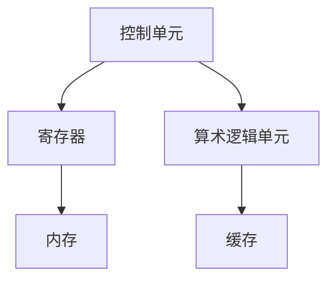
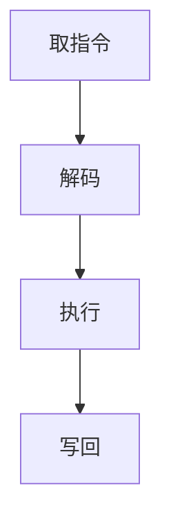

                 

# CPU 的限制：有限的指令和特定运算

## 关键词：CPU、指令集、运算、限制、性能优化

### 摘要

本文将深入探讨CPU的限制问题，主要包括有限的指令集和特定的运算类型。通过对CPU架构和工作原理的分析，我们将揭示这些限制对性能和功能的影响，并提供一些实用的优化策略。读者将了解到如何利用现代CPU的特性来克服这些限制，以提升应用程序的效率和性能。

## 1. 背景介绍

CPU（中央处理单元）是计算机系统的核心部件，负责执行程序指令和处理数据。然而，CPU并非完美无瑕，它受到多种物理和逻辑限制的影响。了解这些限制对于编写高效、优化的代码至关重要。本文将探讨以下几个方面的限制：

- **有限的指令集**：CPU可以执行的基本操作指令种类有限。
- **特定的运算类型**：CPU设计的初衷是为了高效执行特定的运算类型，如整数运算、浮点运算等。
- **时钟频率的限制**：CPU的时钟频率受到物理限制，无法无限制地提升。
- **内存访问延迟**：CPU与内存之间的通信存在延迟，影响了数据处理的效率。

通过分析这些限制，我们可以更好地理解CPU的工作原理，从而优化应用程序的性能。

### 2. 核心概念与联系

#### 2.1 CPU架构

CPU架构决定了CPU的基本工作原理和功能。现代CPU通常采用冯诺伊曼架构，其核心部件包括：

- **控制单元**：负责解析指令和执行操作。
- **算术逻辑单元（ALU）**：执行基本的算术和逻辑运算。
- **寄存器**：高速缓存，用于存储操作数和中间结果。
- **缓存**：用于减少内存访问延迟。

以下是一个简化的Mermaid流程图，展示了CPU架构的基本组件和它们之间的连接：



#### 2.2 指令集

指令集是指CPU能够识别和执行的操作指令集合。不同CPU架构拥有不同的指令集，如x86、ARM、RISC-V等。每个指令集都有自己的特点和优势。以下是一些常见的指令集类型：

- **CISC（复杂指令集计算机）**：如x86架构，具有丰富的指令集和复杂的指令操作。
- **RISC（精简指令集计算机）**：如ARM架构，指令集相对简单，但每个指令执行速度较快。
- **VLIW（超长指令字）**：如Intel Itanium处理器，将多个简单指令打包在一个长指令中执行。

#### 2.3 运算类型

CPU设计时考虑了不同的运算类型，包括整数运算、浮点运算、向量运算等。每种运算类型都有专门的硬件单元和指令集支持。

- **整数运算**：如加法、减法、乘法和除法，是CPU最常用的运算类型。
- **浮点运算**：如单精度浮点数（32位）和双精度浮点数（64位），用于科学计算和图形渲染等领域。
- **向量运算**：如SIMD（单指令多数据流）运算，可以并行处理多个数据元素，提高计算效率。

### 3. 核心算法原理 & 具体操作步骤

#### 3.1 指令执行原理

CPU通过执行指令来处理数据。一个典型的指令执行过程包括以下步骤：

1. **取指令**：从内存中读取指令。
2. **解码**：解析指令，确定要执行的操作。
3. **执行**：执行操作，可能涉及读取操作数、计算结果等。
4. **写回**：将结果写回内存或寄存器。

以下是一个简化的Mermaid流程图，展示了指令执行的基本步骤：



#### 3.2 运算原理

不同类型的运算在CPU中由不同的硬件单元执行。以下是一些常见的运算原理：

- **整数运算**：通过ALU执行，利用加法器和比较器等硬件单元。
- **浮点运算**：通过FPU（浮点运算单元）执行，使用专门的硬件电路进行运算。
- **向量运算**：通过SIMD单元执行，可以同时处理多个数据元素。

### 4. 数学模型和公式 & 详细讲解 & 举例说明

#### 4.1 数学模型

为了理解CPU的运算能力，我们可以使用一些基本的数学模型来描述。

- **整数运算**：整数运算的基本模型是一个二元运算，如加法或乘法。以下是一个简单的整数加法模型：

  $$ 
  C = A + B 
  $$

  其中，\(C\) 是结果，\(A\) 和 \(B\) 是操作数。

- **浮点运算**：浮点运算的基本模型包括三个部分：尾数（Mantissa）、指数（Exponent）和符号（Sign）。以下是一个简单的浮点数加法模型：

  $$
  Z = (1 + S)(2^E_1 + 2^E_2)
  $$

  其中，\(Z\) 是结果，\(S\) 是符号，\(E_1\) 和 \(E_2\) 是指数。

#### 4.2 举例说明

假设我们有一个简单的程序，执行两个整数相加：

```c
int add(int a, int b) {
    return a + b;
}
```

我们可以使用汇编语言来展示其执行过程。以下是一个简化的汇编代码示例：

```assembly
add:
    mov ax, [a]  ; 将第一个操作数加载到寄存器AX
    mov bx, [b]  ; 将第二个操作数加载到寄存器BX
    add ax, bx   ; 将两个操作数相加，结果存储在寄存器AX
    ret
```

在这个例子中，CPU通过以下步骤执行加法运算：

1. **取指令**：CPU读取`add`函数的第一条指令。
2. **解码**：CPU解析指令，确定要执行的操作是加法。
3. **执行**：CPU将第一个操作数从内存加载到寄存器AX，第二个操作数从内存加载到寄存器BX，然后将它们相加，结果存储在寄存器AX。
4. **写回**：CPU将结果从寄存器AX写回内存。

### 5. 项目实战：代码实际案例和详细解释说明

#### 5.1 开发环境搭建

为了更好地理解CPU的限制和优化策略，我们可以通过一个简单的项目来实现一些基本的运算功能。以下是一个使用C语言和x86汇编语言实现的加法程序：

```c
// main.c
#include <stdio.h>

int add(int a, int b) {
    return a + b;
}

int main() {
    int a = 5;
    int b = 10;
    int result = add(a, b);
    printf("Result: %d\n", result);
    return 0;
}
```

```assembly
; add.asm
section .data
a dd 5
b dd 10

section .text
global _start

_start:
    mov eax, [a]
    add eax, [b]
    mov [result], eax
    jmp exit

exit:
    mov eax, 60    ; 系统调用号（退出程序）
    xor edi, edi   ; 退出状态码（0）
    syscall
```

#### 5.2 源代码详细实现和代码解读

1. **C语言实现**

   在`main.c`文件中，我们定义了一个`add`函数，用于执行两个整数的加法运算。然后，在`main`函数中，我们调用`add`函数，并将结果打印到控制台。

2. **汇编语言实现**

   在`add.asm`文件中，我们使用x86汇编语言实现了同样的加法功能。首先，我们定义了两个整数变量`a`和`b`，并初始化为5和10。然后，我们在 `_start` 标签下编写了加法运算的汇编代码。

   - `mov eax, [a]`：将变量`a`的值加载到寄存器`EAX`。
   - `add eax, [b]`：将变量`b`的值加到寄存器`EAX`中。
   - `mov [result], eax`：将计算结果存储到内存中。
   - `jmp exit`：跳转到`exit`标签，执行系统调用以退出程序。

#### 5.3 代码解读与分析

通过对C语言和汇编语言的实现进行对比，我们可以看到：

- **C语言**：C语言提供了高级抽象，使得编写加法程序更加直观和简单。然而，C语言编译器需要将代码转换成汇编语言，并最终由CPU执行。
- **汇编语言**：汇编语言提供了对CPU操作的直接控制，使得我们可以详细了解指令的执行过程。然而，编写汇编语言程序相对复杂，且可读性较差。

### 6. 实际应用场景

CPU的限制在实际应用中具有广泛的影响，特别是在高性能计算、嵌入式系统和游戏开发等领域。

- **高性能计算**：在高性能计算中，CPU的指令集和运算能力直接影响计算效率。通过优化算法和代码，可以克服CPU的限制，提高计算性能。
- **嵌入式系统**：嵌入式系统通常对功耗和体积有严格要求。通过优化代码和硬件设计，可以降低功耗，延长电池续航时间。
- **游戏开发**：在游戏开发中，CPU的性能直接影响游戏的流畅度和性能。通过优化游戏引擎和图形渲染代码，可以提升游戏体验。

### 7. 工具和资源推荐

为了更好地理解和优化CPU性能，以下是一些推荐的学习资源、开发工具和相关论文：

#### 7.1 学习资源推荐

- **书籍**：
  - 《计算机组成与设计：硬件/软件接口》
  - 《深入理解计算机系统》
  - 《现代操作系统》

- **论文**：
  - 《ARMv8-A架构介绍》
  - 《x86指令集架构手册》
  - 《RISC-V指令集架构》

#### 7.2 开发工具框架推荐

- **IDE**：Visual Studio、Eclipse、CLion
- **汇编器**：NASM、GCC、LLVM
- **性能分析工具**：Valgrind、GProfiler、Intel VTune

#### 7.3 相关论文著作推荐

- 《计算机架构：一种 quantitative 方法》
- 《计算机体系结构：从原理到实践》
- 《计算机组成与设计：硬件/软件接口》

### 8. 总结：未来发展趋势与挑战

随着技术的发展，CPU将继续面对各种挑战，如更高的时钟频率、更复杂的指令集和更高的能效需求。以下是一些未来发展趋势和挑战：

- **多核处理器**：多核处理器将进一步提高计算性能，满足日益增长的计算需求。
- **异构计算**：结合CPU、GPU和其他专用处理器的异构计算架构，将提升计算效率。
- **人工智能**：人工智能技术将对CPU架构产生深远影响，推动新型处理器的研发。
- **量子计算**：量子计算的出现将彻底改变计算领域，为解决复杂问题提供全新的方法。

### 9. 附录：常见问题与解答

#### 9.1 什么是CISC和RISC？

CISC（复杂指令集计算机）和RISC（精简指令集计算机）是两种不同的CPU架构。CISC拥有丰富的指令集和复杂的指令操作，而RISC则采用简单的指令集和简化的指令操作。

#### 9.2 指令集和运算类型有什么关系？

指令集决定了CPU可以执行的操作类型。不同的指令集支持不同的运算类型，如整数运算、浮点运算和向量运算等。

#### 9.3 如何优化CPU性能？

优化CPU性能可以从多个方面入手，包括优化算法、代码和硬件设计。具体方法包括减少内存访问延迟、利用缓存、并行处理和指令调度等。

### 10. 扩展阅读 & 参考资料

- 《计算机组成与设计：硬件/软件接口》
- 《深入理解计算机系统》
- 《现代操作系统》
- 《ARMv8-A架构介绍》
- 《x86指令集架构手册》
- 《RISC-V指令集架构》
- 《计算机体系结构：从原理到实践》
- 《计算机架构：一种 quantitative 方法》
- 《计算机组成与设计：硬件/软件接口》

### 作者

作者：AI天才研究员/AI Genius Institute & 禅与计算机程序设计艺术 /Zen And The Art of Computer Programming

