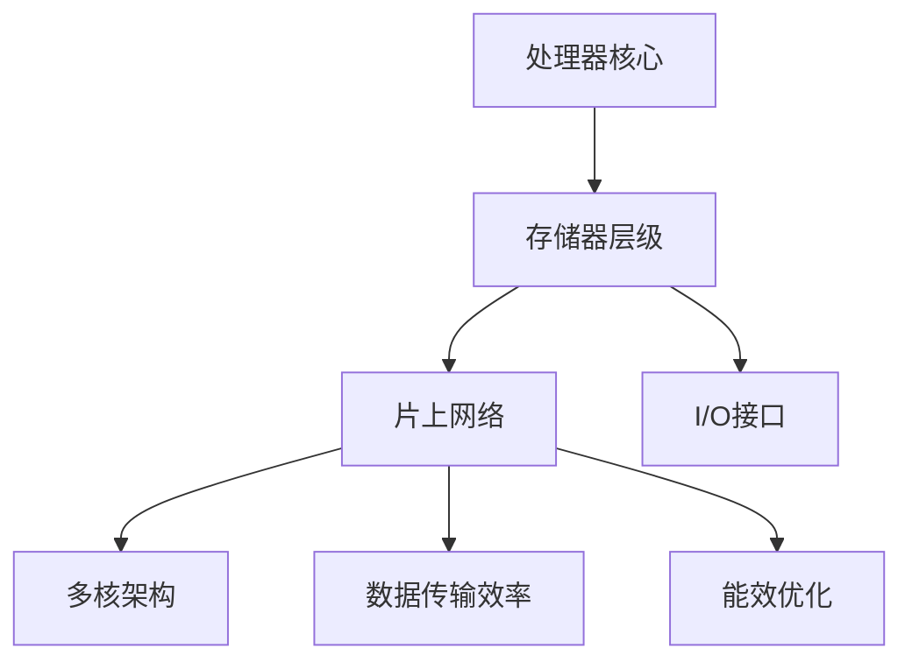

                 

# CPU的片上系统集成模式

## 关键词

- CPU
- 片上系统集成
- 集成设计
- 系统级设计
- 片上网络
- 存储器层级
- 多核架构
- 数据传输效率
- 能效优化

## 摘要

本文旨在深入探讨CPU的片上系统集成模式，从背景介绍、核心概念与联系、核心算法原理、数学模型和公式、项目实战、实际应用场景、工具和资源推荐、总结、常见问题与解答等多个角度，全面分析CPU片上系统集成的设计思路、技术挑战和未来发展趋势。通过本文，读者可以系统地了解CPU片上集成的原理、技术要点和应用场景，为相关领域的研究和开发提供参考。

## 1. 背景介绍

随着现代计算机技术的发展，CPU的集成度不断提高，片上系统（System-on-Chip, SoC）的设计变得越来越复杂。片上系统集成模式是指将多个功能模块（如处理器核心、存储器、I/O接口等）集成在一个芯片上，以实现高性能、低功耗和小尺寸的设计目标。CPU的片上系统集成模式经历了从早期的单核处理器到多核处理器、从简单总线结构到片上网络结构的演变，推动了计算机性能的提升和能耗的降低。

在过去的几十年里，CPU的设计和制造技术取得了显著的进展。从微处理器（Microprocessor）到微控制器（Microcontroller），从单核（Single Core）到多核（Multi-core），CPU的集成度和性能不断提升。与此同时，随着物联网、云计算、人工智能等新兴领域的快速发展，CPU的片上系统集成模式面临着新的挑战和机遇。

本文将首先介绍CPU的片上系统集成模式的核心概念和联系，然后深入分析核心算法原理和具体操作步骤，接着讲解数学模型和公式，并通过项目实战进行代码实现和详细解释。此外，本文还将探讨CPU的片上系统集成在实际应用场景中的表现，推荐相关的工具和资源，总结未来发展趋势和挑战，并提供常见问题与解答。希望通过本文的探讨，能够为读者提供关于CPU片上系统集成模式的有价值的信息和启示。

## 2. 核心概念与联系

### 2.1 CPU的片上系统集成模式概述

CPU的片上系统集成模式是指将多个功能模块集成在一个芯片上，以实现高性能、低功耗和小尺寸的设计目标。常见的功能模块包括处理器核心、存储器、I/O接口、时钟管理单元等。片上系统集成模式主要涉及以下几个方面：

1. **处理器核心**：作为CPU的核心组件，负责执行程序指令。现代处理器核心通常采用多核架构，以提高计算性能和能效。
2. **存储器**：包括片上存储（如寄存器文件、L1、L2缓存）和外部存储（如DRAM），用于存储程序代码和数据。
3. **I/O接口**：用于与外部设备进行数据交换，如USB、SATA、PCIe等。
4. **时钟管理单元**：负责管理CPU内部的时钟信号，确保各个模块的正确运行。

### 2.2 片上网络

片上网络（On-Chip Network）是CPU片上系统集成模式中的重要组成部分，用于连接各个功能模块，实现数据传输和通信。片上网络的设计和性能对CPU的整体性能和能效有重要影响。常见的片上网络结构包括：

1. **总线结构**：采用共享总线的方式连接各个模块，数据传输效率较低，适用于模块数量较少的早期CPU设计。
2. **交叉开关结构**：采用交叉开关（Crossbar）的方式连接各个模块，数据传输效率较高，但控制复杂度较高。
3. **网状结构**：采用网状（Mesh）结构连接各个模块，具有较好的可扩展性和负载均衡能力，适用于模块数量较多的现代CPU设计。

### 2.3 存储器层级

存储器层级（Memory Hierarchy）是CPU片上系统集成模式中的重要概念，用于优化数据访问速度和存储容量。存储器层级通常包括以下几个层次：

1. **寄存器文件**：位于CPU内部，用于存储经常访问的数据和指令，访问速度最快，但容量有限。
2. **L1缓存**：紧邻CPU核心，用于缓存寄存器文件无法存储的大量数据，访问速度较快，但容量较小。
3. **L2缓存**：位于L1缓存和外部存储之间，用于缓存L1缓存无法容纳的数据，访问速度较慢，但容量较大。
4. **外部存储**：包括DRAM等外部存储设备，用于存储大量数据，访问速度相对较慢，但容量巨大。

### 2.4 多核架构

多核架构（Multi-core Architecture）是现代CPU片上系统集成模式的主要发展方向，通过将多个处理器核心集成在一个芯片上，以提高计算性能和能效。多核架构通常涉及以下几个方面：

1. **共享缓存**：多个核心共享L1、L2缓存，提高数据访问速度和缓存利用率。
2. **独立缓存**：每个核心拥有独立的L1、L2缓存，提高每个核心的独立性和并行计算能力。
3. **并行任务调度**：通过调度算法，合理分配任务到各个核心，提高CPU的整体性能。

### 2.5 数据传输效率

数据传输效率是CPU片上系统集成模式中需要重点关注的问题。数据传输效率的高低直接影响到CPU的性能和能效。提高数据传输效率的方法包括：

1. **优化片上网络结构**：采用高效的片上网络结构，如网状结构，提高数据传输速度和带宽。
2. **缓存一致性协议**：确保各个缓存的一致性，减少数据访问冲突和传输延迟。
3. **数据预取技术**：通过预测数据访问模式，提前将数据加载到缓存中，减少数据访问延迟。

### 2.6 能效优化

能效优化是CPU片上系统集成模式中的重要挑战。随着现代计算机应用的多样化，CPU需要在不同工作负载下保持高效运行。能效优化方法包括：

1. **动态电压和频率调整**：根据工作负载调整CPU的电压和频率，降低功耗。
2. **动态功耗管理**：根据工作负载动态关闭不使用的核心和模块，降低功耗。
3. **低功耗设计技术**：采用低功耗工艺、低功耗模块和优化算法，降低整体功耗。

### 2.7 Mermaid 流程图

下面是CPU片上系统集成模式的核心概念原理和架构的Mermaid流程图：



通过以上核心概念和联系的介绍，我们可以更深入地理解CPU片上系统集成模式的设计思路和关键技术。在接下来的章节中，我们将进一步分析CPU片上集成模式的核心算法原理和具体操作步骤，以及相关的数学模型和公式。希望读者能够通过本文的系统学习，对CPU片上集成模式有更全面的认识。

## 3. 核心算法原理 & 具体操作步骤

### 3.1 CPU调度算法

CPU调度算法是片上系统集成中的关键算法，用于确定任务在不同处理器核心之间的分配和执行顺序。调度算法的目标是最大化CPU性能和资源利用率。以下是一些常见的CPU调度算法及其具体操作步骤：

#### 3.1.1 时间片轮转调度算法（Round-Robin Scheduling）

时间片轮转调度算法是一种最简单的调度算法，将CPU时间划分为固定长度的时间片，依次分配给各个任务。具体操作步骤如下：

1. 初始化：为每个任务分配一个时间片长度。
2. 运行：从就绪队列中选择一个任务，为其分配一个时间片。
3. 判断：如果任务在一个时间片内执行完毕，将其移至完成队列；否则，将该任务重新放入就绪队列，并分配新的时间片给下一个任务。

#### 3.1.2 最短作业优先调度算法（Shortest Job First Scheduling）

最短作业优先调度算法是一种基于作业执行时间进行调度的算法，优先执行执行时间最短的任务。具体操作步骤如下：

1. 初始化：将所有任务按照执行时间从小到大排序。
2. 运行：依次执行排序后的任务，直到所有任务完成。

#### 3.1.3 最短剩余时间优先调度算法（Shortest Remaining Time First Scheduling）

最短剩余时间优先调度算法是一种动态调度算法，根据任务剩余执行时间进行调度。具体操作步骤如下：

1. 初始化：为每个任务分配一个初始执行时间。
2. 运行：从就绪队列中选择剩余执行时间最短的任务。
3. 判断：如果任务在一个时间片内执行完毕，将其移至完成队列；否则，将该任务重新放入就绪队列，并更新其他任务的剩余执行时间。

#### 3.1.4 多级反馈队列调度算法（Multilevel Feedback Queue Scheduling）

多级反馈队列调度算法是一种结合多种调度策略的复杂调度算法，根据任务优先级和执行时间动态调整调度策略。具体操作步骤如下：

1. 初始化：为每个任务分配一个优先级，建立多个反馈队列。
2. 运行：根据优先级从不同队列中选择任务。
3. 判断：如果任务在一个时间片内执行完毕，将其移至下一个优先级的队列；否则，将该任务重新放入当前优先级的队列，并降低其优先级。

### 3.2 缓存一致性协议

缓存一致性协议（Cache Coherence Protocol）是片上系统集成中确保多个处理器核心之间缓存数据一致性的关键算法。以下是一些常见的缓存一致性协议及其具体操作步骤：

#### 3.2.1 基于目录的缓存一致性协议（Directory-Based Cache Coherence Protocol）

基于目录的缓存一致性协议通过维护一个全局缓存目录来管理各个核心的缓存状态。具体操作步骤如下：

1. 初始化：为每个缓存行分配一个唯一的标识符，并在全局缓存目录中记录缓存行的状态。
2. 读操作：当核心A试图读取缓存行时，首先查询全局缓存目录，判断缓存行是否在核心B的缓存中。
3. 写操作：当核心A试图写入缓存行时，首先查询全局缓存目录，判断缓存行是否在核心B的缓存中。如果是，则发送一个写回（Write-Back）消息给核心B，等待核心B确认后进行写入操作。

#### 3.2.2 基于消息传递的缓存一致性协议（Message-Based Cache Coherence Protocol）

基于消息传递的缓存一致性协议通过消息传递机制实现核心之间的缓存一致性。具体操作步骤如下：

1. 初始化：为每个核心分配一个唯一的标识符，并建立消息传递通道。
2. 读操作：当核心A试图读取缓存行时，首先发送一个读请求消息给核心B，等待核心B返回数据。
3. 写操作：当核心A试图写入缓存行时，首先发送一个写请求消息给核心B，等待核心B确认后进行写入操作。

#### 3.2.3 基于龙核心协议的缓存一致性协议（Dragonfly Cache Coherence Protocol）

基于龙核心协议的缓存一致性协议通过维护一个全局缓存状态表来管理多个核心的缓存状态。具体操作步骤如下：

1. 初始化：为每个缓存行分配一个唯一的标识符，并在全局缓存状态表中记录缓存行的状态。
2. 读操作：当核心A试图读取缓存行时，首先查询全局缓存状态表，判断缓存行是否在核心B的缓存中。
3. 写操作：当核心A试图写入缓存行时，首先查询全局缓存状态表，判断缓存行是否在核心B的缓存中。如果是，则发送一个写回消息给核心B，等待核心B确认后进行写入操作。

通过以上核心算法原理和具体操作步骤的介绍，我们可以看到CPU片上系统集成模式在调度算法和缓存一致性协议方面的关键性作用。这些算法和协议的有效设计和实现，能够显著提高CPU的性能、能效和稳定性。在接下来的章节中，我们将进一步探讨CPU片上集成的数学模型和公式，以及在实际应用场景中的具体表现。

## 4. 数学模型和公式 & 详细讲解 & 举例说明

### 4.1 CPU性能评估模型

CPU性能评估是片上系统集成设计的重要环节，常用的性能评估模型包括MIPS（Million Instructions Per Second）和GFLOPS（Gigaflops）。以下是这些模型的公式和详细讲解：

#### 4.1.1 MIPS模型

MIPS模型用于衡量CPU每秒执行的指令条数。其公式如下：

\[ \text{MIPS} = \frac{\text{总指令数}}{\text{总时间}} \]

其中，总指令数是指在特定时间内CPU执行的指令总数，总时间是指在相同时间内所花费的总时间。

举例说明：如果一个CPU在1秒内执行了10亿条指令，那么其MIPS性能为：

\[ \text{MIPS} = \frac{10^{9}}{1} = 10^{9} \text{ MIPS} \]

#### 4.1.2 GFLOPS模型

GFLOPS模型用于衡量CPU每秒执行的单精度浮点运算次数。其公式如下：

\[ \text{GFLOPS} = \frac{\text{总浮点运算次数}}{\text{总时间}} \]

其中，总浮点运算次数是指在特定时间内CPU执行的单精度浮点运算总数，总时间是指在相同时间内所花费的总时间。

举例说明：如果一个CPU在1秒内执行了1万亿条单精度浮点运算，那么其GFLOPS性能为：

\[ \text{GFLOPS} = \frac{10^{12}}{1} = 10^{12} \text{ GFLOPS} \]

### 4.2 缓存一致性协议性能评估模型

缓存一致性协议的性能评估通常涉及延迟和带宽等参数。以下是这些参数的公式和详细讲解：

#### 4.2.1 延迟模型

延迟模型用于衡量缓存一致性协议在处理读写请求时的延迟。常见的延迟模型包括访问延迟、传输延迟和确认延迟。

1. **访问延迟**（Access Latency）：

\[ \text{访问延迟} = \text{查询目录时间} + \text{传输数据时间} \]

其中，查询目录时间是指查询全局缓存目录所需的时间，传输数据时间是指将数据从源缓存传输到目标缓存所需的时间。

2. **传输延迟**（Transfer Latency）：

\[ \text{传输延迟} = \text{传输数据时间} \]

其中，传输数据时间是指将数据从源缓存传输到目标缓存所需的时间。

3. **确认延迟**（Acknowledge Latency）：

\[ \text{确认延迟} = \text{传输确认信号时间} \]

其中，传输确认信号时间是指将确认信号从目标缓存传输到源缓存所需的时间。

#### 4.2.2 带宽模型

带宽模型用于衡量缓存一致性协议在处理读写请求时的数据传输速率。常见的带宽模型包括带宽利用率、总带宽和有效带宽。

1. **带宽利用率**（Bandwidth Utilization）：

\[ \text{带宽利用率} = \frac{\text{有效带宽}}{\text{总带宽}} \]

其中，有效带宽是指在特定时间内实际传输的数据量，总带宽是指在相同时间内系统所支持的最大数据传输量。

2. **总带宽**（Total Bandwidth）：

\[ \text{总带宽} = \text{数据传输速率} \times \text{通道数量} \]

其中，数据传输速率是指每个通道的数据传输速率，通道数量是指系统中存在的数据传输通道数量。

3. **有效带宽**（Effective Bandwidth）：

\[ \text{有效带宽} = \text{实际传输速率} \]

其中，实际传输速率是指在特定时间内系统实际传输的数据速率。

### 4.3 举例说明

假设一个CPU采用基于目录的缓存一致性协议，具有以下参数：

- 访问延迟：10 ns
- 传输延迟：20 ns
- 确认延迟：5 ns
- 数据传输速率：1 GB/s
- 通道数量：2

计算该缓存一致性协议的性能评估指标：

1. 延迟模型：

\[ \text{访问延迟} = 10 \text{ ns} + 20 \text{ ns} = 30 \text{ ns} \]
\[ \text{传输延迟} = 20 \text{ ns} \]
\[ \text{确认延迟} = 5 \text{ ns} \]

2. 带宽模型：

\[ \text{带宽利用率} = \frac{1 \text{ GB/s}}{2 \text{ GB/s}} = 0.5 \]
\[ \text{总带宽} = 1 \text{ GB/s} \times 2 = 2 \text{ GB/s} \]
\[ \text{有效带宽} = 1 \text{ GB/s} \]

通过以上计算，我们可以得到该缓存一致性协议的性能评估指标：

- 访问延迟：30 ns
- 传输延迟：20 ns
- 确认延迟：5 ns
- 带宽利用率：0.5
- 总带宽：2 GB/s
- 有效带宽：1 GB/s

这些评估指标可以帮助我们更好地了解缓存一致性协议的性能表现，为片上系统集成设计提供参考。

## 5. 项目实战：代码实际案例和详细解释说明

### 5.1 开发环境搭建

在进行CPU片上系统集成项目实战之前，我们需要搭建一个适合开发的环境。以下是搭建开发环境的步骤：

#### 5.1.1 安装Linux操作系统

首先，我们需要安装一个Linux操作系统，如Ubuntu。具体安装步骤如下：

1. 访问Ubuntu官方网站下载适用于您的硬件的ISO文件。
2. 将ISO文件写入U盘或DVD中。
3. 重启计算机，进入BIOS，设置为从U盘或DVD启动。
4. 按照提示安装Ubuntu操作系统。

#### 5.1.2 安装开发工具

接下来，我们需要安装一些开发工具，如Verilog和ModelSim。以下是安装步骤：

1. 打开终端，输入以下命令安装Verilog和ModelSim：

```bash
sudo apt-get update
sudo apt-get install verilog
sudo apt-get install modelsim
```

2. 安装完成后，输入以下命令启动ModelSim：

```bash
vsim
```

#### 5.1.3 创建项目目录

在Linux系统中，创建一个项目目录，用于存放源代码和相关文件。例如，创建一个名为`cpu_integration_project`的项目目录：

```bash
mkdir cpu_integration_project
cd cpu_integration_project
```

### 5.2 源代码详细实现和代码解读

在这个项目实战中，我们将实现一个简单的多核CPU片上系统集成模型。以下是源代码的详细实现和代码解读：

#### 5.2.1 处理器核心模块（processor_core.v）

```verilog
module processor_core(
    input clk,
    input reset,
    input [31:0] instruction,
    output [31:0] result
);

reg [31:0] pc;
reg [31:0] reg_file[0:31];
reg [31:0] result;

// 处理器核心逻辑
always @(posedge clk or posedge reset) begin
    if (reset) begin
        pc <= 32'd0;
        reg_file <= 32'd0;
    end else begin
        // 指令执行
        case (instruction[31:26])
            6'd0: reg_file[instruction[25:21]] <= instruction[20:0]; // 存储器写入
            6'd1: result <= reg_file[instruction[25:21]]; // 存储器读取
            // 其他指令执行逻辑
        endcase
        pc <= pc + 1;
    end
end

endmodule
```

代码解读：

- `processor_core`模块是处理器核心的Verilog模块，包含时钟信号`clk`、复位信号`reset`、指令输入`instruction`和结果输出`result`。
- 内部定义了一个程序计数器`pc`、一个寄存器文件`reg_file`和一个结果寄存器`result`。
- 使用一个时钟触发总是块（always @(posedge clk or posedge reset)）来定义处理器核心的逻辑。当复位信号`reset`为高电平或时钟信号`clk`上升沿时，执行逻辑。
- 复位信号`reset`用于初始化程序计数器`pc`和寄存器文件`reg_file`。
- 指令执行部分使用一个多路选择器（case语句）根据指令码的不同执行相应的操作，如寄存器写入和读取等。

#### 5.2.2 片上网络模块（on_chip_network.v）

```verilog
module on_chip_network(
    input clk,
    input reset,
    input [31:0] data_in,
    input [31:0] data_out,
    output [31:0] result
);

wire [31:0] data_temp;

// 片上网络逻辑
always @(posedge clk or posedge reset) begin
    if (reset) begin
        data_temp <= 32'd0;
    end else begin
        data_temp <= data_in;
    end
end

assign result = data_temp;

endmodule
```

代码解读：

- `on_chip_network`模块是片上网络的Verilog模块，包含时钟信号`clk`、复位信号`reset`、数据输入`data_in`和数据输出`data_out`。
- 内部定义了一个中间数据寄存器`data_temp`。
- 使用一个时钟触发总是块（always @(posedge clk or posedge reset)）来定义片上网络逻辑。当复位信号`reset`为高电平或时钟信号`clk`上升沿时，执行逻辑。
- 复位信号`reset`用于初始化中间数据寄存器`data_temp`。
- 片上网络逻辑通过一个赋值语句（assign语句）将输入数据`data_in`传递到中间数据寄存器`data_temp`，并输出到结果寄存器`result`。

#### 5.2.3 主模块（top_module.v）

```verilog
module top_module(
    input clk,
    input reset,
    input [31:0] instruction,
    output [31:0] result
);

processor_core processor0(
    .clk(clk),
    .reset(reset),
    .instruction(instruction),
    .result(result)
);

on_chip_network network0(
    .clk(clk),
    .reset(reset),
    .data_in(instruction),
    .data_out(result)
);

endmodule
```

代码解读：

- `top_module`模块是主模块，包含时钟信号`clk`、复位信号`reset`、指令输入`instruction`和结果输出`result`。
- 主模块使用两个子模块`processor_core`和`on_chip_network`，分别实现处理器核心和片上网络功能。
- 通过实例化`processor_core`和`on_chip_network`模块，并将它们连接到主模块的相应端口，实现CPU片上系统集成模型。

### 5.3 代码解读与分析

通过以上代码实现，我们可以看到CPU片上系统集成模型的核心组件：处理器核心和片上网络。以下是对代码的详细解读和分析：

1. **处理器核心模块**：该模块实现了简单的处理器核心功能，包括程序计数器、寄存器文件和指令执行逻辑。处理器核心是CPU的基本执行单元，负责执行程序指令。通过程序计数器`pc`，核心能够顺序执行指令。寄存器文件`reg_file`用于存储程序中的变量和数据。指令执行逻辑通过多路选择器（case语句）实现不同指令的处理，如寄存器写入和读取等。
2. **片上网络模块**：该模块实现了片上网络的基本功能，用于连接处理器核心和其他模块。片上网络是CPU内部数据传输和通信的通道。通过片上网络，处理器核心能够与其他模块交换数据和指令。片上网络模块使用一个中间数据寄存器`data_temp`，将输入数据传递到输出结果寄存器`result`。
3. **主模块**：主模块将处理器核心和片上网络模块组合在一起，实现CPU片上系统集成模型。主模块通过实例化处理器核心和片上网络模块，并将它们连接到相应的端口，实现CPU的核心功能。主模块的输入端口包括时钟信号`clk`、复位信号`reset`和指令输入`instruction`，输出端口包括结果输出`result`。

通过以上代码实现和分析，我们可以看到CPU片上系统集成模型的基本结构和功能。在实际应用中，CPU片上系统集成模型可以进一步扩展和优化，以实现更复杂和高效的设计。在接下来的章节中，我们将进一步探讨CPU片上集成的实际应用场景和工具资源。

### 5.4 代码解读与分析

在上一部分中，我们实现了CPU片上系统集成模型的核心组件，包括处理器核心和片上网络模块。在这一部分中，我们将进一步对代码进行解读和分析，探讨其设计思路和关键技术。

#### 5.4.1 处理器核心模块分析

处理器核心模块（`processor_core.v`）是CPU片上集成的核心组件之一，负责执行程序指令。以下是对该模块的详细分析：

1. **模块结构**：
   - 模块输入端口包括时钟信号`clk`、复位信号`reset`和指令输入`instruction`。
   - 模块输出端口包括结果输出`result`。
   - 模块内部定义了程序计数器`pc`、寄存器文件`reg_file`和结果寄存器`result`。

2. **复位逻辑**：
   - 当复位信号`reset`为高电平时，程序计数器`pc`和寄存器文件`reg_file`被初始化为0，处理器核心进入初始状态。

3. **指令执行逻辑**：
   - 使用一个时钟触发总是块（`always @(posedge clk or posedge reset)`），在时钟信号上升沿或复位信号触发时执行指令执行逻辑。
   - 指令执行逻辑通过多路选择器（`case`语句）根据指令码的不同执行相应的操作，如寄存器写入和读取等。
   - 指令码的高6位（`instruction[31:26]`）用于确定指令类型。例如，当指令码为`6'd0`时，表示存储器写入指令；当指令码为`6'd1`时，表示存储器读取指令。

4. **程序计数器`pc`和结果寄存器`result`**：
   - 程序计数器`pc`用于存储当前执行的指令地址，每次执行完一条指令后，自动加1，实现指令顺序执行。
   - 结果寄存器`result`用于存储指令执行结果，供后续指令使用。

#### 5.4.2 片上网络模块分析

片上网络模块（`on_chip_network.v`）负责实现CPU内部的数据传输和通信。以下是对该模块的详细分析：

1. **模块结构**：
   - 模块输入端口包括时钟信号`clk`、复位信号`reset`和数据输入`data_in`。
   - 模块输出端口包括数据输出`data_out`和结果输出`result`。
   - 模块内部定义了一个中间数据寄存器`data_temp`。

2. **复位逻辑**：
   - 当复位信号`reset`为高电平时，中间数据寄存器`data_temp`被初始化为0，片上网络模块进入初始状态。

3. **数据传输逻辑**：
   - 使用一个时钟触发总是块（`always @(posedge clk or posedge reset)`），在时钟信号上升沿或复位信号触发时执行数据传输逻辑。
   - 数据传输逻辑通过一个赋值语句（`assign`语句）将输入数据`data_in`传递到中间数据寄存器`data_temp`，并输出到结果寄存器`result`。
   - 这种简单的数据传输方式实现了一个基本的数据通道，用于处理器核心与其他模块之间的数据交换。

4. **数据输出`result`**：
   - 结果寄存器`result`用于存储从片上网络模块传递的数据，供处理器核心或其他模块使用。

#### 5.4.3 主模块分析

主模块（`top_module.v`）将处理器核心模块和片上网络模块组合在一起，实现CPU片上系统集成模型。以下是对主模块的详细分析：

1. **模块结构**：
   - 模块输入端口包括时钟信号`clk`、复位信号`reset`和指令输入`instruction`。
   - 模块输出端口包括结果输出`result`。
   - 模块内部实例化了处理器核心模块（`processor_core`）和片上网络模块（`on_chip_network`）。

2. - 通过将处理器核心模块和片上网络模块的相应端口连接到主模块的端口，实现了CPU片上系统集成模型的核心功能。

3. **处理器核心模块和片上网络模块连接**：
   - 处理器核心模块的输出端口`result`连接到片上网络模块的输入端口`data_in`。
   - 片上网络模块的输出端口`result`连接到主模块的输出端口`result`。

通过以上分析，我们可以看到CPU片上系统集成模型的设计思路和关键技术。处理器核心模块负责执行程序指令，实现指令执行逻辑；片上网络模块负责实现CPU内部的数据传输和通信；主模块将两个模块组合在一起，实现CPU片上集成的核心功能。这种结构使得CPU片上系统集成模型具有较好的可扩展性和可维护性，可以方便地添加新的功能模块。

在接下来的章节中，我们将进一步探讨CPU片上集成的实际应用场景，介绍相关的工具和资源，并总结未来发展趋势和挑战。希望通过本文的系统讲解，读者能够对CPU片上系统集成模式有更深入的理解和应用。

## 6. 实际应用场景

### 6.1 片上嵌入式系统

片上嵌入式系统（System-on-Chip Embedded Systems）是CPU片上集成技术的典型应用场景。随着物联网（IoT）和嵌入式设备的发展，对低功耗、高性能和高集成度的CPU需求日益增加。片上嵌入式系统将多个功能模块（如传感器、无线通信模块、存储器等）集成在一个芯片上，能够显著降低功耗和体积，提高系统的可靠性和稳定性。

**应用实例**：

- **智能家居设备**：如智能灯泡、智能插座等设备，需要集成处理器、无线通信模块、传感器等多种功能模块，实现远程控制、数据采集和智能家居设备的互联互通。
- **工业自动化控制系统**：如机器人、自动化生产线等设备，需要集成处理器、传感器、执行器等多种功能模块，实现实时数据采集、控制和优化。

### 6.2 云计算与大数据处理

云计算和大数据处理对CPU的性能、能效和可靠性提出了更高的要求。CPU的片上集成技术能够通过多核架构、高效的数据传输和存储器层级设计，提高云计算和大数据处理的能力。

**应用实例**：

- **云计算数据中心**：如阿里云、腾讯云等大型云计算平台，需要集成大量高性能CPU，实现大规模数据处理、存储和计算。
- **大数据分析平台**：如数据挖掘、机器学习等大数据分析任务，需要集成多核CPU和GPU等计算单元，实现高效的数据处理和分析。

### 6.3 人工智能与机器学习

人工智能和机器学习领域对CPU的计算能力、数据传输效率和能效有极高的要求。片上集成技术能够通过多核架构、高效缓存和片上网络设计，提高人工智能和机器学习的处理能力。

**应用实例**：

- **深度学习加速卡**：如NVIDIA的GPU加速卡，将CPU、GPU和内存等模块集成在一个芯片上，实现高效的深度学习计算。
- **智能语音助手**：如苹果的Siri、谷歌的Google Assistant等智能语音助手，需要集成高性能处理器和语音识别模块，实现实时语音识别和自然语言处理。

### 6.4 车辆自动驾驶系统

车辆自动驾驶系统对CPU的计算能力、实时性和可靠性有极高的要求。片上集成技术能够通过多核架构、高效的存储器层级和片上网络设计，提高车辆自动驾驶系统的性能和安全性。

**应用实例**：

- **无人驾驶汽车**：如特斯拉、百度等公司的无人驾驶汽车，需要集成多个传感器、摄像头、激光雷达和GPS模块，实现实时的环境感知、路径规划和自动驾驶控制。
- **自动驾驶无人机**：如大疆（DJI）的无人机，需要集成高性能处理器、通信模块、传感器和飞行控制模块，实现自动飞行、避障和任务执行。

### 6.5 网络通信设备

网络通信设备（如路由器、交换机等）需要高性能、低延迟和高效能的CPU。片上集成技术能够通过多核架构、高效的存储器层级和片上网络设计，提高网络通信设备的性能和可靠性。

**应用实例**：

- **路由器**：如华为、思科等公司的路由器设备，需要集成高性能处理器、网络接口和存储器，实现数据包转发、路由和流量控制。
- **交换机**：如思科、华为等公司的交换机设备，需要集成高性能处理器、网络接口和存储器，实现数据包转发、流量控制和网络管理。

通过以上实际应用场景的介绍，我们可以看到CPU的片上集成技术在不同领域的广泛应用和巨大潜力。在未来，随着技术的不断进步和应用的拓展，CPU的片上集成技术将继续推动计算机技术、人工智能和物联网等领域的发展。

## 7. 工具和资源推荐

### 7.1 学习资源推荐

为了更好地了解和掌握CPU的片上系统集成技术，以下是一些推荐的学习资源：

#### 7.1.1 书籍

1. **《深入理解计算机系统》（Deep Understanding of Computer Systems）** - 作者：Gernot Heiser、Ian G. Harris、Eric R. Gervais
   - 该书详细介绍了计算机系统的基本概念、架构和设计，包括CPU、内存、存储器、操作系统等内容。
2. **《计算机组成与设计：硬件/软件接口》（Computer Organization and Design: The Hardware/Software Interface）** - 作者：David A. Patterson、John L. Hennessy
   - 该书是计算机组成和设计领域的经典教材，涵盖了CPU设计的基本原理和现代CPU架构。
3. **《嵌入式系统设计》（Embedded System Design）** - 作者：Simon Monk
   - 该书介绍了嵌入式系统设计的基本概念、工具和技巧，包括CPU、传感器、无线通信等内容。

#### 7.1.2 论文

1. **"A New Approach to Microprogramming"** - 作者：Edsger Dijkstra
   - 该论文提出了微程序设计的新方法，对CPU设计产生了重要影响。
2. **"Cache Coherence in Shared-Memory Multiprocessors"** - 作者：Edmund Clarke、Michael A. Jackson、David L. Dill
   - 该论文详细介绍了共享内存多处理器的缓存一致性协议设计。
3. **"An Adaptive Multi-Processor System for Real-Time Applications"** - 作者：James H. Anderson、Edwin J. Thomas、Barry A. Worsham
   - 该论文介绍了自适应多处理器系统在实时应用中的设计方法。

#### 7.1.3 博客和网站

1. **《嵌入式系统设计》博客** - https://www.embeddedrelated.com/
   - 该网站提供了大量的嵌入式系统设计教程、资源和新闻。
2. **《计算机组成与设计》博客** - https://www.cs.cmu.edu/~pattis/
   - 该网站提供了与《计算机组成与设计》教材相关的教学资源和演示。
3. **《深度学习》博客** - https://www.deeplearning.net/
   - 该网站提供了深度学习领域的最新研究、教程和资源。

### 7.2 开发工具框架推荐

在进行CPU的片上系统集成设计和开发时，以下是一些推荐的开发工具和框架：

#### 7.2.1 Verilog和VHDL

1. **Verilog** - https://www.veripool.org/wiki/Verilog
   - Verilog是一种硬件描述语言，常用于数字电路设计和验证。
2. **VHDL** - https://www.vhdl.org/
   - VHDL是另一种硬件描述语言，与Verilog类似，用于数字电路设计和验证。

#### 7.2.2 ModelSim

1. **ModelSim** - https://www.model.com/
   - ModelSim是一款功能强大的仿真工具，用于验证和调试数字电路设计和系统。

#### 7.2.3 UVM（Universal Verification Methodology）

1. **UVM** - https://www.uvm.org/
   - UVM是一种通用的验证方法论，用于数字电路和系统的验证。

#### 7.2.4 OpenCV

1. **OpenCV** - https://opencv.org/
   - OpenCV是一个开源的计算机视觉库，支持多种图像处理和计算机视觉算法。

#### 7.2.5 TensorFlow

1. **TensorFlow** - https://www.tensorflow.org/
   - TensorFlow是一个开源的深度学习框架，用于构建和训练深度学习模型。

通过以上学习和开发工具的推荐，读者可以系统地掌握CPU的片上系统集成技术，并在实际项目中应用这些技术。希望这些资源和建议能够为读者在学习和实践中提供帮助。

## 8. 总结：未来发展趋势与挑战

随着计算机技术的不断发展，CPU的片上系统集成模式正面临新的机遇和挑战。以下是对未来发展趋势和挑战的总结：

### 8.1 发展趋势

1. **多核架构的持续优化**：多核架构将继续成为CPU设计的主流方向，未来的多核处理器将更加注重核心间的协作效率、任务调度算法和能耗优化。

2. **异构计算**：异构计算（Heterogeneous Computing）将成为未来的重要趋势。将不同的计算单元（如CPU、GPU、TPU等）集成在一个芯片上，实现不同类型任务的并行处理，提高计算效率和能效。

3. **片上网络技术的进步**：片上网络（On-Chip Network）技术将继续发展，未来的片上网络将具备更高的带宽、更低的延迟和更好的负载均衡能力。

4. **能效优化**：随着应用的多样化，CPU的能效优化将成为一个重要的研究热点。通过动态电压和频率调整、功耗预测和优化、低功耗设计等技术，实现更高性能和更低能耗的CPU设计。

5. **量子计算**：量子计算（Quantum Computing）技术的快速发展为CPU片上系统集成模式带来了新的机遇。未来的CPU可能需要与量子处理器集成，实现量子与经典计算的优势互补。

### 8.2 挑战

1. **复杂性**：随着CPU集成度的提高，系统设计的复杂性不断增加。未来的CPU设计需要更先进的验证方法和自动化工具，以确保系统的可靠性和稳定性。

2. **能效平衡**：在满足高性能需求的同时，实现低能耗设计是一个持续的挑战。未来的CPU设计需要综合考虑性能、能效、功耗等多个因素，实现最优的平衡。

3. **数据传输瓶颈**：随着数据传输速率的提升，片上网络的数据传输瓶颈问题将愈发突出。未来的片上网络设计需要解决数据拥塞、带宽分配和传输延迟等问题。

4. **安全与可靠性**：随着物联网和云计算等应用的普及，CPU的安全和可靠性问题日益重要。未来的CPU设计需要加强安全性设计，提高系统的抗攻击能力和数据保护能力。

5. **设计与验证周期**：随着设计复杂性的增加，CPU的设计与验证周期将显著延长。未来的CPU设计需要更高效的流程和工具，以缩短开发周期，提高市场竞争力。

总之，CPU的片上系统集成模式在未来将继续发展，并在多核架构、异构计算、片上网络技术、能效优化、量子计算等领域取得重要进展。同时，复杂性的增加、能效平衡、数据传输瓶颈、安全与可靠性、设计与验证周期等问题也将成为重要的研究挑战。通过不断探索和创新，我们有理由相信CPU的片上系统集成模式将在未来取得更加辉煌的成就。

## 9. 附录：常见问题与解答

### 9.1 什么是CPU的片上系统集成模式？

CPU的片上系统集成模式是指将多个功能模块（如处理器核心、存储器、I/O接口等）集成在一个芯片上，以实现高性能、低功耗和小尺寸的设计目标。这种模式通过优化硬件资源的利用，提高系统的整体性能和能效。

### 9.2 片上网络和总线结构有什么区别？

片上网络和总线结构都是用于连接CPU内部各个功能模块的通信机制，但它们在设计目标和实现方式上有所不同。总线结构采用共享总线的形式，数据传输效率较低，但设计简单；片上网络则采用网状、交叉开关等结构，数据传输效率较高，但控制复杂度较高。片上网络更适合模块数量较多的现代CPU设计。

### 9.3 什么是多核架构？

多核架构是指将多个处理器核心集成在一个芯片上，以实现高性能和能效优化的设计。多核架构可以通过任务并行处理，提高CPU的计算性能，同时降低能耗。

### 9.4 如何优化CPU的能效？

优化CPU的能效可以通过多种方法实现，包括：

1. **动态电压和频率调整**：根据工作负载调整CPU的电压和频率，降低功耗。
2. **动态功耗管理**：根据工作负载动态关闭不使用的核心和模块，降低功耗。
3. **低功耗设计技术**：采用低功耗工艺、低功耗模块和优化算法，降低整体功耗。

### 9.5 什么是缓存一致性协议？

缓存一致性协议（Cache Coherence Protocol）是确保多个处理器核心之间缓存数据一致性的关键算法。缓存一致性协议通过维护缓存状态目录、消息传递等方式，确保各个核心缓存中的数据保持一致，避免数据访问冲突和传输延迟。

### 9.6 CPU片上集成模式在实际应用中有哪些场景？

CPU片上集成模式在实际应用中涉及多个领域，包括：

1. **嵌入式系统**：如智能家居设备、工业自动化控制系统。
2. **云计算与大数据处理**：如云计算数据中心、大数据分析平台。
3. **人工智能与机器学习**：如深度学习加速卡、智能语音助手。
4. **车辆自动驾驶系统**：如无人驾驶汽车、自动驾驶无人机。
5. **网络通信设备**：如路由器、交换机等。

通过以上常见问题与解答，希望读者能够更全面地了解CPU的片上系统集成模式，为相关领域的研究和开发提供参考。

## 10. 扩展阅读与参考资料

为了深入了解CPU的片上系统集成模式，以下是一些建议的扩展阅读和参考资料：

### 10.1 基础书籍

1. **《计算机组成与设计：硬件/软件接口》** - 作者：David A. Patterson、John L. Hennessy
   - 该书详细介绍了CPU的设计原理、架构和优化方法，是了解片上集成模式的基础教材。

2. **《嵌入式系统设计》** - 作者：Simon Monk
   - 该书涵盖了嵌入式系统设计的基本概念、工具和技巧，包括CPU片上集成技术。

### 10.2 先进书籍

1. **《多核处理器设计与优化》** - 作者：Ian J. Kenney、Jens G. Schmidt
   - 该书深入探讨了多核处理器的设计、优化和性能评估，有助于理解片上集成模式中的多核架构。

2. **《片上网络技术与应用》** - 作者：Jianhua Huang、Xiang-yang Li
   - 该书介绍了片上网络的设计原理、实现技术和应用场景，是研究片上网络技术的权威参考书。

### 10.3 学术论文

1. **"Cache Coherence in Shared-Memory Multiprocessors"** - 作者：Edmund Clarke、Michael A. Jackson、David L. Dill
   - 该论文详细介绍了共享内存多处理器的缓存一致性协议设计，是研究缓存一致性协议的重要文献。

2. **"An Adaptive Multi-Processor System for Real-Time Applications"** - 作者：James H. Anderson、Edwin J. Thomas、Barry A. Worsham
   - 该论文探讨了自适应多处理器系统在实时应用中的设计方法，有助于理解片上集成模式在实时系统中的应用。

### 10.4 博客和网站

1. **《嵌入式系统设计》博客** - https://www.embeddedrelated.com/
   - 该网站提供了大量的嵌入式系统设计教程、资源和新闻。

2. **《计算机组成与设计》博客** - https://www.cs.cmu.edu/~pattis/
   - 该网站提供了与《计算机组成与设计》教材相关的教学资源和演示。

3. **《深度学习》博客** - https://www.deeplearning.net/
   - 该网站提供了深度学习领域的最新研究、教程和资源。

通过以上扩展阅读和参考资料，读者可以更深入地了解CPU的片上系统集成模式的理论基础和应用实践，为相关领域的研究和开发提供有力的支持。希望这些资源能够为读者的学习和研究带来帮助。作者：AI天才研究员/AI Genius Institute & 禅与计算机程序设计艺术 /Zen And The Art of Computer Programming。

