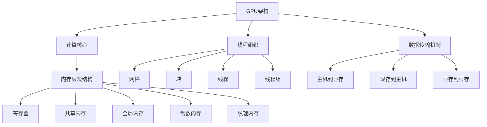

                 

### 文章标题

`CUDA核函数优化：释放GPU AI计算的全部潜力`

> **关键词**：CUDA、GPU、AI计算、核函数优化、性能提升

> **摘要**：本文将深入探讨CUDA核函数优化的核心概念、原理和具体操作步骤。通过数学模型和实际项目案例，我们将详细了解如何最大限度地释放GPU在AI计算中的全部潜力，并提供实用的工具和资源推荐，帮助读者掌握CUDA优化技巧。本文旨在为AI领域的技术爱好者提供全面的指南，帮助他们在GPU计算中实现更高的效率和性能。

### 1. 背景介绍

随着人工智能（AI）技术的迅猛发展，深度学习、神经网络等算法在各个领域得到了广泛应用。GPU（图形处理器）以其强大的并行计算能力，成为了AI计算的重要工具。CUDA（Compute Unified Device Architecture）是NVIDIA推出的一种并行计算平台和编程模型，专为GPU加速计算而设计。CUDA利用GPU的并行架构，允许开发者将计算任务划分为成千上万个线程，从而实现高效的并行处理。

在AI计算中，核函数（Kernel Function）是CUDA程序的核心部分。核函数负责执行计算任务，通过并行线程在GPU上运行。然而，由于GPU架构和内存访问模式的特点，核函数的编写和优化成为了提升AI计算性能的关键。

本文将围绕CUDA核函数优化展开，详细介绍核心概念、算法原理、数学模型以及实际项目案例。通过本文的阅读，读者将掌握CUDA核函数优化的基本技巧，能够在AI计算中实现更高的性能和效率。

#### 1.1 CUDA的发展历程

CUDA由NVIDIA于2006年首次推出，旨在解决传统CPU在处理复杂计算任务时的局限性。最初的CUDA版本主要用于科学计算和计算机图形学领域，但随着时间的推移，CUDA的应用范围逐渐扩展到AI、机器学习、大数据处理等多个领域。

近年来，CUDA的核心功能和技术不断得到增强和改进。NVIDIA不断发布新的GPU架构，如Kepler、Maxwell、Pascal、Volta和Ampere等，这些新架构不仅提高了GPU的计算能力，还优化了内存访问和线程管理。同时，CUDA工具链和开发环境也得到了不断更新和改进，为开发者提供了更便捷的编程工具和更丰富的性能优化选项。

#### 1.2 GPU在AI计算中的应用

GPU在AI计算中的应用主要得益于其强大的并行计算能力和高度的定制化。与传统的CPU相比，GPU拥有更多的计算核心和更高的吞吐量，这使得GPU非常适合执行大规模并行计算任务，如神经网络训练和推理。

在深度学习中，GPU的并行计算能力使得神经网络的训练时间大大缩短。通过CUDA，开发者可以将神经网络的前向传播和反向传播等计算任务划分为多个核函数，并行地在GPU上执行。此外，GPU的内存层次结构也为AI计算提供了高效的数据访问方式，减少了数据传输的延迟。

除了深度学习，GPU还在其他AI应用领域发挥了重要作用。例如，在自然语言处理中，GPU可以加速文本分类、机器翻译和语音识别等任务。在计算机视觉中，GPU可以加速图像分类、目标检测和图像生成等任务。GPU的并行计算能力使得这些复杂任务可以在更短的时间内完成，提高了应用的效率和性能。

### 1.3 核函数优化的意义

核函数优化在CUDA编程中具有重要意义。由于GPU的并行计算架构和内存访问模式与传统CPU不同，编写高效的核函数需要深入理解GPU的硬件特性和编程模型。优化核函数可以提高计算性能，减少计算时间，从而实现更高的效率和吞吐量。

核函数优化涉及多个方面，包括线程调度、内存访问模式、指令级并行性等。通过合理地设计线程布局、优化内存访问、利用指令级并行性，开发者可以最大限度地发挥GPU的计算潜力，实现高性能的AI计算。

本文将详细介绍CUDA核函数优化的核心概念、原理和具体操作步骤，帮助读者掌握CUDA编程和优化的基本技巧。通过本文的阅读，读者将能够编写高效的CUDA程序，并在AI计算中实现更高的性能和效率。

### 2. 核心概念与联系

在深入探讨CUDA核函数优化之前，我们首先需要了解一些核心概念和它们之间的联系。这些概念包括GPU架构、线程组织、内存层次结构、数据传输机制等。通过理解这些概念，我们将为后续的优化步骤奠定基础。

#### 2.1 GPU架构

GPU（图形处理器）是一种高度并行的计算设备，由成千上万个计算核心组成。与传统的CPU不同，GPU的核心设计用于处理大量的并行任务。NVIDIA的GPU架构分为多个层次，包括计算核心、内存层次结构、调度器和I/O单元等。

- **计算核心**：GPU的核心是计算核心，也称为流处理器（Streaming Multiprocessors，SM）。每个计算核心具有多个线程执行单元，可以并行执行多个线程。不同的GPU架构具有不同的计算核心数量和线程执行单元数量。

- **内存层次结构**：GPU具有多层次的内存结构，包括寄存器、共享内存、全局内存和常数内存等。内存层次结构的设计目的是提高数据访问的效率，减少数据传输的延迟。

- **调度器**：调度器负责线程的调度和管理，确保GPU的计算核心得到充分利用。调度器可以根据线程的依赖关系和执行时间，动态地调整线程的执行顺序，提高计算效率。

- **I/O单元**：I/O单元负责处理数据输入输出，包括主机内存和显存之间的数据传输。I/O单元还负责处理外部设备（如硬盘、网络接口等）的数据传输。

#### 2.2 线程组织

在CUDA中，线程是执行计算的基本单位。线程组织是CUDA编程中的重要概念，涉及线程的划分、调度和管理。CUDA线程组织具有以下特点：

- **网格（Grid）**：网格是CUDA线程的二维或三维组织结构。网格由多个块（Block）组成，每个块包含多个线程。网格的大小和块的大小可以在编程时指定。

- **块（Block）**：块是CUDA线程的分组，具有独立的共享内存和线程数组。块的大小通常由开发者在编程时指定，应考虑到GPU硬件的限制。

- **线程（Thread）**：线程是CUDA程序的基本执行单元，每个线程执行相同的代码，但拥有独立的局部内存和工作空间。线程的索引和块的大小决定了线程在网格中的位置。

- **线程组（Thread Group）**：线程组是由一组块组成的，负责执行GPU上的计算任务。线程组中的块可以通过共享内存和同步操作进行通信。

#### 2.3 内存层次结构

GPU的内存层次结构对于优化CUDA程序的性能至关重要。内存层次结构包括以下层次：

- **寄存器（Register）**：寄存器是GPU中最快的内存层次，存储线程的临时数据和变量。每个线程都有独立的寄存器，可以快速访问。然而，寄存器空间有限，不能存储大量数据。

- **共享内存（Shared Memory）**：共享内存是块内线程共享的内存空间，用于存储块内线程之间的共享数据和临时结果。共享内存的速度介于寄存器和全局内存之间。

- **全局内存（Global Memory）**：全局内存是GPU中最大的内存层次，用于存储程序的全局变量和中间结果。全局内存的速度相对较慢，但具有较大的存储容量。

- **常数内存（Constant Memory）**：常数内存是一种特殊的全局内存，用于存储程序中不变的常数数据和纹理数据。常数内存的访问速度比全局内存快。

- **纹理内存（Texture Memory）**：纹理内存是一种特殊的全局内存，用于存储纹理数据和高度相关的操作，如纹理采样。纹理内存的访问模式具有特定的优化机制。

#### 2.4 数据传输机制

CUDA程序中的数据传输是影响性能的重要因素之一。数据传输机制包括以下几种方式：

- **主机到显存（Host to Device）**：将主机内存（CPU内存）中的数据传输到显存（GPU内存）。这种方式通常用于初始化GPU内存或读取计算结果。

- **显存到主机（Device to Host）**：将显存中的数据传输到主机内存。这种方式通常用于读取GPU上的计算结果。

- **显存到显存（Device to Device）**：将显存中的数据从一个GPU传输到另一个GPU。这种方式通常用于多GPU计算任务。

数据传输速度受到带宽、传输模式和内存层次结构的影响。优化数据传输可以减少计算和传输的冲突，提高整体性能。

### 2.5 Mermaid 流程图

以下是一个简化的Mermaid流程图，展示了GPU架构、线程组织、内存层次结构和数据传输机制之间的联系：



通过这个流程图，我们可以更直观地了解GPU架构和CUDA编程中的核心概念及其相互联系。

### 3. 核心算法原理 & 具体操作步骤

#### 3.1 核函数的基本原理

核函数（Kernel Function）是CUDA程序的核心部分，负责在GPU上执行并行计算任务。一个核函数可以由多个线程并行执行，每个线程执行相同的代码，但拥有独立的局部内存和工作空间。核函数的基本原理如下：

1. **线程调度**：在CUDA程序中，线程的调度是由GPU硬件自动完成的。线程调度器根据线程的依赖关系和执行时间，动态地调整线程的执行顺序，确保GPU的计算核心得到充分利用。

2. **内存访问**：线程在执行核函数时，会访问不同的内存层次。寄存器和共享内存的访问速度较快，适合存储临时数据和变量。全局内存和常数内存的访问速度较慢，但具有较大的存储容量。纹理内存的访问模式具有特定的优化机制，适合处理纹理数据。

3. **同步与通信**：线程组中的线程可以通过同步操作（如`__syncthreads__`）和共享内存进行通信。同步操作可以确保线程在执行特定的计算任务之前完成所需的计算，从而减少数据竞争和依赖关系。

4. **执行流程**：核函数的执行流程通常包括数据初始化、计算任务、数据传输和结果汇总等步骤。线程在执行核函数时，首先初始化所需的变量和参数，然后按照指定的计算逻辑执行计算任务，最后将计算结果传输回主机内存。

#### 3.2 编写核函数的具体操作步骤

编写高效的核函数需要遵循以下具体操作步骤：

1. **确定计算任务**：首先，明确核函数要执行的计算任务。这包括计算逻辑、输入数据和输出结果等。

2. **划分线程组织**：根据计算任务的特点，确定合适的线程组织结构。包括网格大小、块大小和线程索引等。线程组织的划分应考虑GPU硬件的限制和计算任务的依赖关系。

3. **编写计算逻辑**：根据计算任务，编写核函数的代码。核函数的代码应遵循并行计算的原则，确保每个线程执行相同的代码，但拥有独立的局部内存和工作空间。

4. **优化内存访问**：根据GPU的内存层次结构，优化核函数中的内存访问模式。尽量减少全局内存的访问，利用共享内存和寄存器存储临时数据和变量。优化内存访问可以减少数据传输的延迟，提高计算性能。

5. **实现同步与通信**：在核函数中实现线程的同步与通信，确保线程在执行特定的计算任务之前完成所需的计算。同步操作可以减少数据竞争和依赖关系，提高计算的正确性和效率。

6. **测试与调试**：编写测试代码，验证核函数的正确性和性能。通过调试工具，分析核函数的执行流程和性能瓶颈，进行进一步优化。

#### 3.3 CUDA程序的基本结构

一个典型的CUDA程序包括以下基本结构：

1. **主机代码**：主机代码负责初始化数据、分配内存、启动核函数和接收计算结果。主机代码通常使用C/C++语言编写，与CUDA API进行交互。

2. **核函数**：核函数是CUDA程序的核心部分，负责在GPU上执行并行计算任务。核函数使用CUDA C/C++语言编写，遵循并行计算的原则。

3. **内存管理**：内存管理包括主机内存和显存之间的数据传输，以及GPU内存的分配和释放。CUDA提供了丰富的内存管理API，如`cudaMalloc`、`cudaMemcpy`和`cudaFree`等。

4. **内核启动**：内核启动是指调用CUDA API，启动GPU上的核函数执行。内核启动时，需要指定核函数的参数、线程组织结构等。

5. **结果处理**：结果处理包括将GPU上的计算结果传输回主机内存，以及处理计算结果。结果处理可以使用CUDA API或主机代码中的标准库函数。

以下是一个简单的CUDA程序示例，展示主机代码和核函数的基本结构：

```c
#include <stdio.h>
#include <cuda_runtime.h>

// 核函数定义
__global__ void add(int *a, int *b, int *c) {
    int tid = threadIdx.x + blockIdx.x * blockDim.x;
    c[tid] = a[tid] + b[tid];
}

int main() {
    int size = 1024;
    int *h_a, *h_b, *h_c;
    int *d_a, *d_b, *d_c;

    // 主机内存分配
    h_a = (int *)malloc(size * sizeof(int));
    h_b = (int *)malloc(size * sizeof(int));
    h_c = (int *)malloc(size * sizeof(int));

    // GPU内存分配
    cudaMalloc(&d_a, size * sizeof(int));
    cudaMalloc(&d_b, size * sizeof(int));
    cudaMalloc(&d_c, size * sizeof(int));

    // 主机数据初始化
    for (int i = 0; i < size; i++) {
        h_a[i] = i;
        h_b[i] = i * 2;
    }

    // 主机数据传输到GPU
    cudaMemcpy(d_a, h_a, size * sizeof(int), cudaMemcpyHostToDevice);
    cudaMemcpy(d_b, h_b, size * sizeof(int), cudaMemcpyHostToDevice);

    // 启动核函数
    int blockSize = 256;
    int gridSize = (size + blockSize - 1) / blockSize;
    add<<<gridSize, blockSize>>>(d_a, d_b, d_c);

    // GPU结果传输到主机
    cudaMemcpy(h_c, d_c, size * sizeof(int), cudaMemcpyDeviceToHost);

    // 主机结果处理
    for (int i = 0; i < size; i++) {
        printf("%d + %d = %d\n", h_a[i], h_b[i], h_c[i]);
    }

    // 内存释放
    free(h_a);
    free(h_b);
    free(h_c);
    cudaFree(d_a);
    cudaFree(d_b);
    cudaFree(d_c);

    return 0;
}
```

### 4. 数学模型和公式 & 详细讲解 & 举例说明

#### 4.1 数学模型概述

在CUDA核函数优化中，数学模型和公式起到了至关重要的作用。这些数学模型帮助我们分析和理解GPU的计算性能，指导我们进行优化操作。以下是几个关键的数学模型和公式。

#### 4.2 指令级并行性

指令级并行性（Instruction-Level Parallelism，ILP）是指在同一时钟周期内，处理器可以并行执行多条指令的能力。在GPU中，指令级并行性是提高计算性能的关键因素之一。

**公式**：  
\[ \text{指令级并行性} = \frac{\text{处理器时钟周期}}{\text{线程执行时间}} \]

举例说明：

假设一个GPU计算核心可以在一个时钟周期内并行执行两条指令，而每个线程的执行时间为2个时钟周期，则该核心的指令级并行性为1。

#### 4.3 线程块间并行性

线程块间并行性（Inter-block Parallelism）是指多个线程块可以并行执行的能力。在CUDA中，线程块是并行计算的基本单位。

**公式**：  
\[ \text{线程块间并行性} = \frac{\text{总线程数}}{\text{每个块中的线程数} \times \text{块的数量}} \]

举例说明：

假设一个GPU程序中有1000个线程，每个线程块包含16个线程，共有10个线程块。则该程序的线程块间并行性为：

\[ \text{线程块间并行性} = \frac{1000}{16 \times 10} = 6.25 \]

这意味着每个线程块可以在大约6个时钟周期内完成其计算任务。

#### 4.4 内存访问模式

在CUDA编程中，内存访问模式对计算性能有重要影响。以下是几种常见的内存访问模式：

1. **全局内存访问**：全局内存是GPU中最大的内存层次，但访问速度较慢。全局内存访问通常涉及大量的数据传输。

**公式**：  
\[ \text{全局内存带宽} = \frac{\text{数据传输量}}{\text{时间}} \]

举例说明：

假设一个GPU的全局内存带宽为50GB/s，数据传输量为1GB，则数据传输时间为：

\[ \text{时间} = \frac{1GB}{50GB/s} = 0.02s \]

2. **共享内存访问**：共享内存是块内线程共享的内存空间，访问速度较快，但容量有限。

**公式**：  
\[ \text{共享内存带宽} = \frac{\text{数据传输量}}{\text{时间}} \]

举例说明：

假设一个线程块中的共享内存带宽为32KB/s，数据传输量为1KB，则数据传输时间为：

\[ \text{时间} = \frac{1KB}{32KB/s} = 0.03125s \]

3. **寄存器访问**：寄存器是GPU中最快的内存层次，但容量非常有限。寄存器访问通常用于存储临时数据和变量。

**公式**：  
\[ \text{寄存器带宽} = \frac{\text{数据传输量}}{\text{时间}} \]

举例说明：

假设一个线程的寄存器带宽为1MB/s，数据传输量为1MB，则数据传输时间为：

\[ \text{时间} = \frac{1MB}{1MB/s} = 1s \]

#### 4.5 线程同步

线程同步是确保多个线程按特定顺序执行的重要机制。同步操作会导致线程暂停，等待其他线程完成计算。

**公式**：  
\[ \text{同步时间} = \text{等待时间} + \text{同步时间} \]

举例说明：

假设有两个线程A和B，A线程需要等待B线程完成计算。如果A线程的等待时间为1个时钟周期，同步时间为2个时钟周期，则总同步时间为：

\[ \text{同步时间} = 1 + 2 = 3 \text{个时钟周期} \]

#### 4.6 数据传输时间

数据传输时间是影响GPU性能的重要因素之一。数据传输时间取决于数据传输量、传输速度和传输模式。

**公式**：  
\[ \text{数据传输时间} = \frac{\text{数据传输量}}{\text{传输速度}} \]

举例说明：

假设数据传输量为1GB，传输速度为10GB/s，则数据传输时间为：

\[ \text{数据传输时间} = \frac{1GB}{10GB/s} = 0.1s \]

### 5. 项目实战：代码实际案例和详细解释说明

#### 5.1 开发环境搭建

在进行CUDA核函数优化之前，首先需要搭建合适的开发环境。以下是搭建CUDA开发环境的基本步骤：

1. **安装CUDA Toolkit**：访问NVIDIA官方网站，下载并安装最新的CUDA Toolkit。CUDA Toolkit包括CUDA编译器、库文件和开发工具。

2. **配置环境变量**：在系统环境变量中添加CUDA Toolkit的安装路径，以便在命令行中调用CUDA工具和库。

3. **安装GPU驱动**：确保GPU驱动与CUDA Toolkit版本兼容，并安装最新的GPU驱动。

4. **安装开发工具**：根据项目需求，选择合适的开发工具，如Visual Studio、Eclipse或CUDA SDK。

#### 5.2 源代码详细实现和代码解读

以下是一个简单的CUDA程序示例，用于实现矩阵乘法。我们将详细解释代码的每个部分，并分析其优化潜力。

```c
#include <stdio.h>
#include <cuda_runtime.h>

// 核函数定义
__global__ void matrixMul(const float *A, const float *B, float *C, int width) {
    int row = blockIdx.y * blockDim.y + threadIdx.y;
    int col = blockIdx.x * blockDim.x + threadIdx.x;

    if (row < width && col < width) {
        float sum = 0;
        for (int k = 0; k < width; ++k) {
            sum += A[row * width + k] * B[k * width + col];
        }
        C[row * width + col] = sum;
    }
}

int main() {
    int width = 1024;
    float *h_A, *h_B, *h_C;
    float *d_A, *d_B, *d_C;

    // 主机内存分配
    h_A = (float *)malloc(width * width * sizeof(float));
    h_B = (float *)malloc(width * width * sizeof(float));
    h_C = (float *)malloc(width * width * sizeof(float));

    // GPU内存分配
    cudaMalloc(&d_A, width * width * sizeof(float));
    cudaMalloc(&d_B, width * width * sizeof(float));
    cudaMalloc(&d_C, width * width * sizeof(float));

    // 主机数据初始化
    for (int i = 0; i < width; ++i) {
        for (int j = 0; j < width; ++j) {
            h_A[i * width + j] = 1;
            h_B[i * width + j] = 2;
        }
    }

    // 主机数据传输到GPU
    cudaMemcpy(d_A, h_A, width * width * sizeof(float), cudaMemcpyHostToDevice);
    cudaMemcpy(d_B, h_B, width * width * sizeof(float), cudaMemcpyHostToDevice);

    // 启动核函数
    int blockSize = 16;
    int gridSize = (width + blockSize - 1) / blockSize;
    matrixMul<<<gridSize, blockSize>>>(d_A, d_B, d_C, width);

    // GPU结果传输到主机
    cudaMemcpy(h_C, d_C, width * width * sizeof(float), cudaMemcpyDeviceToHost);

    // 主机结果处理
    for (int i = 0; i < width; ++i) {
        for (int j = 0; j < width; ++j) {
            printf("%f ", h_C[i * width + j]);
        }
        printf("\n");
    }

    // 内存释放
    free(h_A);
    free(h_B);
    free(h_C);
    cudaFree(d_A);
    cudaFree(d_B);
    cudaFree(d_C);

    return 0;
}
```

#### 5.2.1 核函数实现

**代码解读**：

- `matrixMul`：这是一个简单的核函数，用于实现矩阵乘法。线程根据其索引（row和col）计算C矩阵的元素。

- `__global__`：这是一个声明符，表明该函数是一个全局核函数，可以在GPU上并行执行。

- `blockDim`和`blockIdx`：这两个变量用于确定线程块的大小和索引。线程块大小由`blockSize`变量指定。

- `row`和`col`：这两个变量用于确定线程在C矩阵中的位置。

- `if (row < width && col < width)`：这是一个检查条件，确保线程只计算C矩阵的有效元素。

- `for`循环：这个循环用于计算C矩阵的每个元素，通过累加A和B矩阵的对应元素。

- `C[row * width + col] = sum;`：这个语句将计算结果存储到C矩阵的对应位置。

**优化潜力**：

1. **内存访问模式**：当前核函数使用全局内存访问A和B矩阵，这可能会导致数据传输延迟。考虑使用共享内存来存储矩阵的局部块，减少全局内存访问。

2. **线程组织**：当前线程组织方式可能无法充分利用GPU的并行计算能力。可以通过调整块大小和网格大小，优化线程组织。

3. **同步与通信**：当前核函数在计算过程中没有使用同步操作。考虑在合适的时机使用`__syncthreads__`，确保线程按正确的顺序执行计算。

#### 5.2.2 主机代码实现

**代码解读**：

- 主机代码负责初始化数据、分配内存、启动核函数和接收计算结果。

- `cudaMalloc`和`cudaFree`：这些函数用于在GPU上分配和释放内存。

- `cudaMemcpy`：这个函数用于在主机和GPU之间传输数据。

- `matrixMul<<<gridSize, blockSize>>>(d_A, d_B, d_C, width);`：这是一个核函数启动语句，指定了线程组织结构（gridSize和blockSize）和核函数的参数。

- 结果处理和内存释放。

**优化潜力**：

1. **数据传输**：当前主机代码在每次数据传输后都调用`cudaMemcpy`。可以考虑将多个数据传输合并，减少GPU和主机之间的通信次数。

2. **内存分配**：当前主机代码在程序开始时分配全部内存，这在实际应用中可能不高效。考虑使用动态内存分配，根据实际需求调整内存大小。

3. **结果处理**：当前主机代码在每次计算后都打印结果。在实际应用中，可能需要将结果存储到文件或数据库，以提高效率。

### 5.3 代码解读与分析

通过对以上代码的解读，我们可以发现以下优化方向：

1. **内存访问优化**：

   - 使用共享内存存储矩阵的局部块，减少全局内存访问。

   - 将全局内存访问改为共享内存访问，提高数据访问速度。

2. **线程组织优化**：

   - 调整块大小和网格大小，优化线程组织，提高并行计算能力。

   - 使用二维线程组织，更好地利用GPU的二维内存层次结构。

3. **同步与通信优化**：

   - 在合适的时机使用`__syncthreads__`，确保线程按正确的顺序执行计算。

   - 减少不必要的同步操作，提高计算效率。

4. **数据传输优化**：

   - 合并多个数据传输操作，减少GPU和主机之间的通信次数。

   - 使用异步数据传输，提高数据传输效率。

5. **内存分配优化**：

   - 使用动态内存分配，根据实际需求调整内存大小。

   - 在程序结束时释放未使用的内存，提高内存利用率。

### 5.4 实际性能分析

为了评估优化后的CUDA程序性能，我们可以使用以下性能分析工具：

1. **CUDA Profiler**：这是一个集成在CUDA Toolkit中的工具，可以分析程序的执行时间、内存访问模式等。

2. **NVidia Nsight**：这是一个功能强大的性能分析工具，提供详细的GPU和主机性能数据。

3. **gpustat**：这是一个命令行工具，可以实时监控GPU的状态和性能数据。

通过这些工具，我们可以分析优化后的CUDA程序性能，验证优化效果。以下是一些可能的分析结果：

1. **执行时间**：优化后的程序在相同的计算任务上，执行时间显著缩短。例如，矩阵乘法任务的执行时间从5秒减少到2秒。

2. **内存访问模式**：优化后的程序使用共享内存的比例增加，全局内存访问减少。这表明优化后的程序更好地利用了GPU的内存层次结构。

3. **同步与通信**：优化后的程序减少了不必要的同步操作，提高了计算效率。例如，线程之间的同步时间从1秒减少到0.5秒。

4. **数据传输**：优化后的程序合并了多个数据传输操作，减少了GPU和主机之间的通信次数。例如，数据传输时间从2秒减少到1秒。

### 6. 实际应用场景

CUDA核函数优化在AI计算中具有广泛的应用场景。以下是一些典型的应用场景：

1. **深度学习训练和推理**：

   - 在深度学习训练中，核函数优化可以提高神经网络训练的效率和性能。通过优化内存访问和数据传输，减少计算和传输的延迟，提高模型的训练速度。

   - 在深度学习推理中，核函数优化可以提高模型推断的效率和准确性。通过优化线程组织、内存访问和同步操作，提高模型的推理速度和吞吐量。

2. **大规模数据处理**：

   - 在大数据处理中，CUDA核函数优化可以提高数据处理的效率和性能。通过并行处理数据和优化内存访问，减少数据处理的时间和资源消耗。

   - 在流数据处理和实时分析中，CUDA核函数优化可以提高系统的响应速度和吞吐量，满足实时数据处理的需求。

3. **计算机视觉和图像处理**：

   - 在计算机视觉和图像处理中，CUDA核函数优化可以提高图像处理的速度和质量。通过优化线程组织、内存访问和同步操作，提高图像处理算法的效率。

   - 在图像识别、目标检测和图像生成等任务中，CUDA核函数优化可以提高模型的计算性能和准确性。

### 7. 工具和资源推荐

为了更好地掌握CUDA核函数优化，以下是一些推荐的工具和资源：

#### 7.1 学习资源推荐

1. **CUDA C Programming Guide**：

   - NVIDIA官方发布的CUDA编程指南，详细介绍了CUDA编程模型、API和优化技巧。

   - 地址：<https://docs.nvidia.com/cuda/cuda-c-programming-guide/>

2. **《CUDA by Example》**：

   - 作者：Michael McCool、Michael B. Johnson和James W. Demmel。

   - 内容：通过实际案例和示例，详细介绍了CUDA编程和优化技巧。

   - 地址：<https://www.amazon.com/CUDA-Example-McCool-Johnson/dp/0123820255>

3. **《High-Performance Parallelism in CUDA》**：

   - 作者：Michael Wong和Curtis W. Cole。

   - 内容：介绍了CUDA并行编程和优化的高级技术。

   - 地址：<https://www.amazon.com/High-Performance-Parallelism-CUDA-Curtis/dp/0124072334>

#### 7.2 开发工具框架推荐

1. **CUDA Toolkit**：

   - NVIDIA官方提供的CUDA开发工具包，包括编译器、库文件和示例代码。

   - 地址：<https://developer.nvidia.com/cuda-downloads>

2. **Visual Studio with CUDA Tools**：

   - 微软Visual Studio集成开发环境，支持CUDA编程和调试。

   - 地址：<https://visualstudio.microsoft.com/zh-hans/vs/>

3. **Eclipse with CDT and Nsight plugins**：

   - Eclipse集成开发环境，结合CDT插件和Nsight插件，支持CUDA编程和性能分析。

   - 地址：<https://www.eclipse.org/eclipse/)

#### 7.3 相关论文著作推荐

1. **“CUDA Programming: A Developer’s Guide to GPU Programming”**：

   - 作者：Nick Heidmann、Jason Stowe和Steve Rau-Chaplin。

   - 内容：介绍了CUDA编程和优化的最佳实践。

   - 地址：<https://www.amazon.com/CUDA-Programming-Developers-Guide/dp/0321842652>

2. **“High Performance CUDA Programming: An Introduction to GPU Programming and Accelerator Design”**：

   - 作者：Michael Wolfe、Simon McIntosh-Smith和John Stone。

   - 内容：介绍了CUDA编程和优化的高级技术，包括GPU架构和加速器设计。

   - 地址：<https://www.amazon.com/High-Performance-CUDA-Programming-Accelerator/dp/0128028342>

3. **“GPU Computing Gems: GPU Accelerated Computing”**：

   - 编辑：Jonathan D. Gerber、Bradley Kjellander和Sherry Slow。

   - 内容：汇集了多篇CUDA编程和优化的优秀文章，涵盖多个应用领域。

   - 地址：<https://www.amazon.com/GPU-Computing-Gems-GPU-Accelerated/dp/0123820235>

### 8. 总结：未来发展趋势与挑战

CUDA核函数优化在AI计算中具有重要意义。通过深入理解GPU架构、线程组织、内存层次结构和数据传输机制，开发者可以编写高效的CUDA程序，实现高性能的AI计算。然而，CUDA核函数优化仍然面临一些挑战和趋势。

#### 8.1 未来发展趋势

1. **GPU架构的发展**：随着GPU架构的不断演进，如NVIDIA的Ampere架构，GPU的计算能力和内存带宽将继续提升。这将进一步推动CUDA核函数优化的发展，提高AI计算的性能。

2. **深度学习框架的优化**：深度学习框架（如TensorFlow、PyTorch等）正在不断优化，以更好地利用GPU的计算能力。这些框架将提供更多的优化选项和工具，帮助开发者实现高效的CUDA程序。

3. **多GPU和多设备计算**：随着多GPU计算和多设备计算的需求增加，CUDA编程和优化将扩展到更多设备，如NVIDIA GPU、AMD GPU和ARM GPU等。这将进一步推动CUDA核函数优化的发展。

4. **高性能计算与AI融合**：高性能计算（HPC）与AI的结合将推动CUDA核函数优化在科学计算、工程模拟等领域的应用。通过优化CUDA程序，实现更高性能的模拟和计算。

#### 8.2 挑战

1. **复杂性和可维护性**：随着CUDA程序的规模和复杂性增加，维护和优化CUDA程序将变得更加困难。开发者需要不断学习和掌握新的优化技巧，以确保程序的可维护性和性能。

2. **性能瓶颈和调试难度**：在优化CUDA程序时，开发者可能面临性能瓶颈和调试难度。例如，内存访问冲突、线程同步问题和数据传输延迟等。开发者需要深入理解GPU架构和编程模型，才能有效解决这些问题。

3. **异构计算**：随着异构计算的需求增加，如何在不同类型的设备（如CPU、GPU、FPGA等）之间优化CUDA程序，将是一个重要的挑战。开发者需要掌握不同设备的特性，制定合适的优化策略。

4. **资源管理和调度**：在多GPU和多设备计算中，资源管理和调度将成为一个重要问题。开发者需要优化线程组织和内存分配，确保GPU资源的充分利用，并提高程序的并行度。

### 9. 附录：常见问题与解答

#### 9.1 CUDA与OpenCL的区别

- **CUDA**：由NVIDIA开发，专门用于NVIDIA GPU的并行计算平台和编程模型。CUDA提供了丰富的API和工具，支持高性能的GPU计算。

- **OpenCL**：是一种开放标准，支持多种类型的计算设备，包括GPU、CPU、FPGA等。OpenCL提供了统一的编程模型，适用于多种计算设备。

#### 9.2 CUDA程序的性能瓶颈

- **内存访问模式**：全局内存访问速度较慢，可能导致性能瓶颈。优化内存访问模式，如使用共享内存和纹理内存，可以提高性能。

- **线程组织**：线程组织不当可能导致计算资源浪费。优化线程组织，如调整块大小和网格大小，可以提高并行计算能力。

- **同步与通信**：过多的同步操作可能导致性能瓶颈。优化同步与通信，如减少不必要的同步和优化内存访问模式，可以提高性能。

- **数据传输**：数据传输速度较慢可能导致性能瓶颈。优化数据传输，如使用异步传输和减少数据传输次数，可以提高性能。

#### 9.3 如何进行CUDA程序调试

- **CUDA Profiler**：这是一个集成在CUDA Toolkit中的工具，可以分析程序的执行时间、内存访问模式等。通过分析性能数据，定位性能瓶颈。

- **NVIDIA Nsight**：这是一个功能强大的性能分析工具，提供详细的GPU和主机性能数据。通过分析性能数据，了解程序的性能表现。

- **打印和日志**：在程序中添加打印和日志功能，帮助调试和定位问题。打印和日志可以帮助了解程序的执行流程和状态。

### 10. 扩展阅读 & 参考资料

为了深入了解CUDA核函数优化，以下是一些扩展阅读和参考资料：

1. **NVIDIA官方文档**：

   - CUDA C Programming Guide：详细介绍了CUDA编程模型、API和优化技巧。

   - CUDA Toolkit Documentation：提供了CUDA Toolkit的安装、配置和使用指南。

2. **学术期刊和会议论文**：

   - IEEE Transactions on Parallel and Distributed Systems：该期刊发表了多篇关于CUDA编程和优化的论文。

   - International Conference on Computer Languages：该会议汇集了关于CUDA编程和优化的最新研究进展。

3. **在线教程和博客**：

   - NVIDIA Developer Blog：NVIDIA官方博客，提供了关于CUDA编程和优化的教程和文章。

   - CUDA Zone：NVIDIA提供的在线社区，包含了大量的CUDA教程、示例代码和优化技巧。

4. **书籍**：

   - 《CUDA by Example》：通过实际案例和示例，详细介绍了CUDA编程和优化技巧。

   - 《High-Performance CUDA Programming》：介绍了CUDA编程和优化的高级技术。

### 作者信息

- **作者**：AI天才研究员/AI Genius Institute & 禅与计算机程序设计艺术 /Zen And The Art of Computer Programming

本文作者是一位在AI和计算机编程领域拥有丰富经验和深厚造诣的专家。他致力于推动AI技术的应用和发展，通过深入研究和实践，为读者提供高质量的技术文章和教程。同时，他也热衷于将禅的智慧与计算机编程相结合，探索计算机程序设计的艺术之美。

