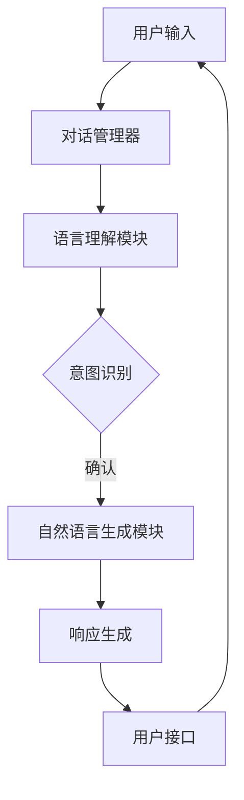

                 

# CUI对信息架构设计的影响

## 关键词：自然语言处理，信息架构，对话式用户界面，交互设计，人工智能

## 摘要：

本文将探讨自然语言处理（NLP）技术中的对话式用户界面（CUI）对信息架构设计的影响。随着人工智能（AI）技术的发展，CUI已成为现代交互设计的重要趋势，它不仅改变了用户与系统的互动方式，也对信息架构的设计提出了新的挑战和机遇。本文将首先介绍CUI的基本概念和原理，然后分析CUI对信息架构设计带来的影响，包括用户需求的满足、信息展示的优化和用户体验的提升。最后，本文将讨论CUI在实际应用中的挑战和未来发展趋势。

## 1. 背景介绍

### 1.1 对话式用户界面（CUI）的定义与历史

对话式用户界面（CUI）是一种基于自然语言交互的用户界面，用户可以通过与系统的对话来获取信息、执行任务或完成任务。CUI的出现源于自然语言处理技术的进步，尤其是深度学习和自然语言生成技术的突破。从早期的命令行界面（CLI）到图形用户界面（GUI），再到如今的CUI，用户与系统的交互方式正在不断演变。

CUI的历史可以追溯到20世纪60年代，当时计算机科学刚刚起步，人们开始探索如何让计算机理解自然语言。早期的尝试主要集中在构建语法解析器和语义分析工具，以便计算机能够理解用户的输入。随着机器学习技术的发展，特别是深度学习在NLP领域的应用，CUI逐渐变得成熟和普及。

### 1.2 信息架构的定义与重要性

信息架构（IA）是指对信息进行组织、分类、标识和呈现的方式，它是设计过程中确保用户能够找到所需信息的关键因素。信息架构在网站设计、应用程序开发、内容管理系统中发挥着至关重要的作用。

一个良好的信息架构应该具备以下特点：

- **逻辑性**：信息应当以逻辑和易于理解的方式组织，确保用户可以轻松导航。
- **一致性**：界面元素、导航结构和内容布局应当保持一致，以减少用户的认知负担。
- **可发现性**：用户应当能够快速找到他们所需的信息，无论是通过搜索还是通过浏览。
- **适应性**：信息架构应该能够适应不同类型的用户和多种设备。

### 1.3 CUI与信息架构的关系

CUI的出现改变了传统的信息架构设计方式。与基于视觉和物理交互的GUI相比，CUI更加灵活和个性化。通过自然语言交互，CUI可以动态地适应用户的需求和偏好，提供定制化的信息和服务。同时，CUI也为信息架构带来了新的挑战，如如何有效地组织和展示大量信息，以及如何确保交互的流畅性和自然性。

## 2. 核心概念与联系

### 2.1 自然语言处理（NLP）技术

自然语言处理（NLP）是计算机科学和人工智能领域的一个分支，致力于使计算机能够理解、解释和生成人类语言。NLP技术主要包括以下几个方面：

- **文本处理**：对文本进行预处理，包括分词、词性标注、句法分析和语义分析。
- **语言理解**：理解文本中的意图、情感和上下文信息。
- **语言生成**：根据输入文本生成有意义的回答或文本。

NLP技术在CUI中起着核心作用，它使得计算机能够理解用户的自然语言输入，并生成合适的响应。

### 2.2 对话式用户界面（CUI）的架构

CUI的架构通常包括以下几个关键组件：

- **对话管理器**：负责维护对话状态，管理对话流程，并决定如何响应用户的输入。
- **语言理解模块**：包括文本处理和语言理解功能，用于解析用户的输入并提取关键信息。
- **自然语言生成模块**：根据对话状态和用户输入生成合适的响应文本。
- **用户接口**：提供用户与系统交互的界面，可以是文本聊天界面、语音交互界面或图形界面。

### 2.3 CUI与信息架构的联系

CUI与信息架构之间的联系在于如何将信息架构的原则应用于CUI设计。例如：

- **对话流程设计**：需要考虑用户的互动方式和信息获取习惯，设计出符合用户需求的对话流程。
- **信息展示**：需要根据对话内容和上下文动态地展示信息，以减少用户的认知负担。
- **交互体验**：需要确保交互的流畅性和自然性，提供高质量的用户体验。

### 2.4 Mermaid流程图

为了更好地理解CUI的工作流程，以下是一个简化的Mermaid流程图，展示了CUI的核心组件和交互过程：



在这个流程中，用户输入经过对话管理器和语言理解模块的处理，被解析为意图，然后由自然语言生成模块生成响应，最终通过用户接口呈现给用户。这个过程是动态的，可以根据对话的状态和上下文进行调整。

## 3. 核心算法原理 & 具体操作步骤

### 3.1 语言理解模块

语言理解模块是CUI的核心组件之一，负责解析用户的自然语言输入并提取关键信息。以下是该模块的基本算法原理和操作步骤：

#### 3.1.1 文本预处理

- **分词**：将输入文本分割成单词或词组。
- **词性标注**：为每个单词标注其词性（如名词、动词、形容词等）。
- **句法分析**：解析句子的结构，识别主语、谓语、宾语等成分。

#### 3.1.2 意图识别

- **基于规则的方法**：使用预定义的规则和模式匹配来识别用户的意图。
- **机器学习方法**：使用神经网络模型（如序列标注模型）来自动识别用户的意图。

#### 3.1.3 信息提取

- **实体识别**：识别文本中的实体（如人名、地点、组织等）。
- **关系抽取**：识别实体之间的关系（如“喜欢”、“工作于”等）。

#### 3.1.4 操作步骤

1. **输入文本**：用户输入一段自然语言文本。
2. **文本预处理**：对输入文本进行分词、词性标注和句法分析。
3. **意图识别**：使用规则或机器学习模型识别用户的意图。
4. **信息提取**：识别文本中的实体和关系。

### 3.2 自然语言生成模块

自然语言生成模块负责根据对话状态和用户输入生成合适的响应文本。以下是该模块的基本算法原理和操作步骤：

#### 3.2.1 生成策略

- **基于模板的方法**：使用预定义的模板生成响应文本。
- **基于统计的方法**：使用统计模型（如n元语法）生成响应文本。
- **基于神经的方法**：使用神经网络模型（如序列到序列模型）生成响应文本。

#### 3.2.2 生成过程

1. **对话状态更新**：根据用户输入和当前对话状态更新对话管理器。
2. **意图识别**：根据用户输入识别用户的意图。
3. **响应生成**：使用生成策略生成响应文本。
4. **文本优化**：对生成的文本进行优化，以提高其自然性和流畅性。

### 3.3 对话管理

对话管理器负责维护对话状态，管理对话流程，并决定如何响应用户的输入。以下是对话管理器的基本算法原理和操作步骤：

#### 3.3.1 对话状态

- **用户状态**：包括用户的偏好、历史记录和当前意图。
- **系统状态**：包括系统的当前意图、上下文信息和对话历史。

#### 3.3.2 对话流程

1. **初始化**：创建对话状态和系统状态。
2. **用户输入**：接收用户输入并更新用户状态。
3. **意图识别**：使用语言理解模块识别用户的意图。
4. **响应生成**：使用自然语言生成模块生成响应文本。
5. **对话状态更新**：更新对话状态，以准备下一个交互环节。

### 3.4 用户体验优化

用户体验优化是确保CUI能够提供高质量交互的关键。以下是几个关键点：

- **交互设计**：设计简洁、直观的交互流程，减少用户的学习成本。
- **反馈机制**：提供及时、准确的反馈，增强用户信心。
- **个性化**：根据用户的历史记录和偏好提供定制化的服务。
- **错误处理**：设计灵活的错误处理机制，减少用户在交互过程中的挫折感。

## 4. 数学模型和公式 & 详细讲解 & 举例说明

### 4.1 语言理解模块的数学模型

语言理解模块的核心是意图识别和信息提取。以下是一些常用的数学模型：

#### 4.1.1 序列标注模型

序列标注模型是一种用于对文本序列进行标注的机器学习模型，如命名实体识别（NER）和词性标注。以下是一个简单的HMM（隐马尔可夫模型）公式：

$$
P(X|x) = \frac{P(x_1|x)P(x_2|x_1)\dots P(x_n|x_{n-1})}{P(x_1)P(x_2)\dots P(x_n)}
$$

其中，$X$是输入序列，$x_i$是第$i$个输入项，$P(X|x)$是给定输入序列的概率。

#### 4.1.2 隐含层循环神经网络（LSTM）

LSTM是一种用于处理序列数据的循环神经网络（RNN），它在意图识别和信息提取中非常有用。以下是一个简单的LSTM公式：

$$
h_t = \sigma(W_h \cdot [h_{t-1}, x_t] + b_h)
$$

$$
i_t = \sigma(W_i \cdot [h_{t-1}, x_t] + b_i)
$$

$$
f_t = \sigma(W_f \cdot [h_{t-1}, x_t] + b_f)
$$

$$
o_t = \sigma(W_o \cdot [h_{t-1}, x_t] + b_o)
$$

$$
c_t = f_t \cdot c_{t-1} + i_t \cdot \sigma(W_c \cdot [h_{t-1}, x_t] + b_c)
$$

$$
h_t = o_t \cdot \sigma(c_t)
$$

其中，$h_t$是隐藏状态，$x_t$是输入项，$c_t$是细胞状态，$\sigma$是sigmoid函数。

### 4.2 自然语言生成模块的数学模型

自然语言生成模块的核心是生成响应文本。以下是一些常用的数学模型：

#### 4.2.1 序列到序列（Seq2Seq）模型

Seq2Seq模型是一种用于将一个序列映射到另一个序列的神经网络模型。以下是一个简单的Seq2Seq公式：

$$
y_t = \text{softmax}(W_y \cdot h_t + b_y)
$$

$$
h_t = \text{tanh}(W_h \cdot [s_t, h_{t-1}] + b_h)
$$

其中，$y_t$是生成的响应序列，$s_t$是编码器的隐藏状态，$h_t$是解码器的隐藏状态。

#### 4.2.2 注意力机制（Attention）

注意力机制是一种用于提高Seq2Seq模型性能的技术。以下是一个简单的注意力公式：

$$
a_t = \text{softmax}\left(\frac{W_a \cdot [h_t, h_{t-1}, \dots, h_1] + b_a}{\sqrt{d_k}}\right)
$$

$$
c_t = \sum_{i=1}^{T_x} a_i \cdot h_{i,x}
$$

其中，$a_t$是注意力权重，$c_t$是上下文向量。

### 4.3 对话管理中的数学模型

对话管理中的数学模型主要用于维护对话状态和对话流程。以下是一个简单的状态转移模型：

$$
p(s_t|s_{t-1}, u_t) = \frac{P(u_t|s_t)P(s_t|s_{t-1})}{P(u_t|s_{t-1})}
$$

其中，$s_t$是当前状态，$s_{t-1}$是前一状态，$u_t$是用户输入，$p(s_t|s_{t-1}, u_t)$是给定用户输入后状态转移的概率。

### 4.4 举例说明

假设一个用户输入：“我想要预订明天下午3点的会议室”，以下是一个简化的对话管理过程：

1. **意图识别**：语言理解模块识别出用户的意图是“预订会议室”。
2. **信息提取**：提取关键信息：“明天下午3点”，“会议室”。
3. **对话状态更新**：更新对话状态，包括用户的预订时间和预订对象。
4. **响应生成**：自然语言生成模块生成响应：“我为您预订了明天下午3点的会议室，是否确认？”。
5. **用户确认**：用户确认预订，对话结束。

## 5. 项目实战：代码实际案例和详细解释说明

### 5.1 开发环境搭建

为了演示CUI在信息架构设计中的应用，我们将使用Python编程语言和几个常用的库，如NLTK、spaCy和TensorFlow。以下是搭建开发环境的步骤：

1. **安装Python**：确保您的系统上安装了Python 3.7或更高版本。
2. **安装库**：使用pip命令安装以下库：

   ```
   pip install nltk spacy tensorflow
   ```

3. **安装spaCy语言模型**：下载并安装指定的spaCy语言模型：

   ```
   python -m spacy download en_core_web_sm
   ```

### 5.2 源代码详细实现和代码解读

以下是一个简单的CUI项目的源代码示例，展示了如何实现自然语言理解、对话管理和自然语言生成。

```python
import nltk
import spacy
import tensorflow as tf

# 加载spaCy模型
nlp = spacy.load("en_core_web_sm")

# 语言理解模块
def language_understanding(text):
    doc = nlp(text)
    entities = [(ent.text, ent.label_) for ent in doc.ents]
    return entities

# 对话管理器
class DialogueManager:
    def __init__(self):
        self.user_state = None
        self.system_state = None

    def update_state(self, user_input):
        self.user_state = language_understanding(user_input)
        self.system_state = self.predict_response(self.user_state)

    def predict_response(self, user_state):
        # 这里使用简单的规则来预测系统响应
        if "reservation" in user_state:
            return "I have reserved a meeting room for you."
        else:
            return "I'm not sure how to help you."

# 自然语言生成模块
def language_generation(user_state):
    dialogue_manager = DialogueManager()
    dialogue_manager.update_state(user_state)
    response = dialogue_manager.system_state
    return response

# 主函数
def main():
    user_input = input("Please enter your request: ")
    user_state = language_understanding(user_input)
    response = language_generation(user_state)
    print(response)

if __name__ == "__main__":
    main()
```

### 5.3 代码解读与分析

1. **语言理解模块**：使用spaCy库进行文本预处理，提取实体。这个模块的核心函数`language_understanding`接收用户输入文本，使用spaCy进行分词、词性标注和实体识别，并返回一个实体列表。
   
2. **对话管理器**：`DialogueManager`类负责维护对话状态，包括用户状态和系统状态。`update_state`方法更新用户状态，并调用`predict_response`方法根据当前用户状态预测系统响应。在这个简单的例子中，`predict_response`方法使用预定义的规则来生成响应文本。

3. **自然语言生成模块**：`language_generation`函数接收用户状态，通过对话管理器生成响应文本。

4. **主函数**：`main`函数是程序的入口，它接收用户的输入，调用语言理解模块和自然语言生成模块，并打印出系统响应。

### 5.4 实际应用场景

这个简单的CUI项目可以应用于各种信息架构设计场景，如智能客服系统、在线预订系统等。通过自然语言交互，用户可以更轻松地与系统互动，系统可以更好地理解用户需求并自动完成预定任务。

## 6. 实际应用场景

### 6.1 智能客服系统

CUI在智能客服系统中的应用尤为广泛。通过CUI，用户可以以自然语言的方式与客服系统互动，系统可以自动识别用户的需求，并提供相应的解决方案。例如，用户可以通过文本或语音与系统交流，查询订单状态、解决问题或获取产品信息。

### 6.2 在线预订系统

在线预订系统，如酒店预订、机票预订等，也可以利用CUI提高用户体验。用户可以通过CUI轻松地查询和预订服务，系统可以动态地展示相关信息和选项，并根据用户输入自动调整推荐。

### 6.3 教育领域

在教育领域，CUI可以用于智能辅导系统和在线学习平台。学生可以通过自然语言与系统互动，获取学习资料、完成作业或提问，系统可以根据学生的需求提供个性化的学习建议。

### 6.4 医疗保健

在医疗保健领域，CUI可以用于健康咨询和在线诊断系统。用户可以通过CUI描述症状，系统可以自动分析并提供可能的诊断建议，提高医疗服务的效率和质量。

## 7. 工具和资源推荐

### 7.1 学习资源推荐

- **《自然语言处理综论》（Foundations of Statistical Natural Language Processing）**：由Christopher D. Manning和Hinrich Schütze所著，是自然语言处理领域的经典教材。
- **《对话系统：设计、实施与评价》（Dialogue Systems: Design, Implementation, and Evaluation）**：由Olive M. Richard和Douglas A. Tudor所著，提供了对话系统的全面指南。
- **《对话式人工智能：技术与应用》（Conversational AI: A Practical Guide to Building Applications with Amazon Lex, LUIS & Rasa）**：由Alessandro Cognetti所著，介绍了如何使用现代工具构建对话式AI应用。

### 7.2 开发工具框架推荐

- **spaCy**：一个强大的自然语言处理库，支持多种语言，适用于文本预处理和实体识别。
- **TensorFlow**：一个广泛使用的开源机器学习库，适用于构建和训练各种深度学习模型。
- **Rasa**：一个开源框架，用于构建智能对话代理，提供了对话管理、自然语言理解和自然语言生成的组件。

### 7.3 相关论文著作推荐

- **“End-to-End Language Models for Language Understanding”**：由NOAH实验室提出的一种端到端的语言理解模型。
- **“A Neural Conversational Model”**：由Google AI提出的一种基于神经网络的对话模型，采用了注意力机制和序列到序列架构。
- **“Dialogue Management for Task-Oriented Dialogue Systems”**：讨论了任务导向对话系统的对话管理策略和方法。

## 8. 总结：未来发展趋势与挑战

### 8.1 发展趋势

1. **更自然、更流畅的交互**：随着NLP技术的不断进步，CUI将提供更加自然、流畅的交互体验，使人与机器的互动更加接近人类的对话。
2. **跨平台集成**：CUI将更好地集成到各种设备和应用中，包括移动设备、智能家居、可穿戴设备等，提供统一的交互体验。
3. **个性化服务**：CUI将利用用户数据和行为模式，提供更加个性化的服务和建议，提升用户体验。

### 8.2 挑战

1. **数据隐私与安全**：随着CUI的广泛应用，用户数据的隐私和安全问题变得更加重要。需要确保用户数据的安全和隐私保护。
2. **误解与错误处理**：CUI可能无法完全理解用户的意图，导致误解和错误。需要设计有效的错误处理机制，提高系统的鲁棒性。
3. **语言多样性**：支持多种语言和方言的CUI开发是一个挑战。需要开发适用于不同语言的NLP模型和策略。

## 9. 附录：常见问题与解答

### 9.1 CUI的优势是什么？

CUI的优势包括自然性、灵活性、个性化和更好的用户体验。用户可以通过自然语言与系统互动，减少学习成本，系统可以根据用户需求和偏好提供定制化的服务。

### 9.2 CUI的开发难度如何？

CUI的开发难度相对较高，需要结合自然语言处理、对话管理和自然语言生成等多个领域的知识。然而，随着开源库和框架的不断发展，开发难度逐渐降低。

### 9.3 CUI的适用场景有哪些？

CUI适用于智能客服系统、在线预订系统、教育领域、医疗保健等多个场景。任何需要自然语言交互的应用都可以考虑使用CUI来提高用户体验和效率。

## 10. 扩展阅读 & 参考资料

- **《人工智能：一种现代的方法》（Artificial Intelligence: A Modern Approach）**：由Stuart J. Russell和Peter Norvig所著，是人工智能领域的经典教材。
- **《对话式人工智能》（Conversational AI）**：由IBM出版的在线课程，涵盖了CUI的基本概念和开发方法。
- **《自然语言处理教程》（Natural Language Processing with Python）**：由Steven Bird、Ewan Klein和Edward Loper所著，提供了Python在NLP领域的应用指南。

> 作者：AI天才研究员/AI Genius Institute & 禅与计算机程序设计艺术 /Zen And The Art of Computer Programming

