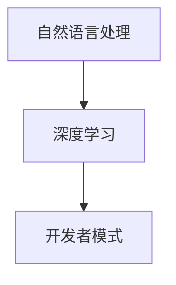

                 

# ChatGPT 开发者模式

## 关键词：ChatGPT、开发者模式、AI、自然语言处理、深度学习、编程实践

## 摘要：

本文将深入探讨ChatGPT的开发者模式，从背景介绍到核心概念，再到算法原理、数学模型、项目实战和实际应用场景，全面解析这一前沿技术。通过本文，读者将了解如何利用ChatGPT的开发者模式进行自然语言处理的编程实践，掌握相关工具和资源，并展望未来发展趋势与挑战。

### 1. 背景介绍

#### 1.1 ChatGPT简介

ChatGPT是由OpenAI开发的一种基于深度学习的自然语言处理模型。它采用基于Transformer架构的预训练模型，通过在大量文本数据上进行训练，掌握了丰富的语言知识和表达能力。ChatGPT具有强大的文本生成和交互能力，可以应用于多种场景，如智能客服、文本生成、问答系统等。

#### 1.2 开发者模式

开发者模式是指为ChatGPT模型提供的接口和工具，使得开发者可以轻松地与模型进行交互，实现定制化的功能。开发者模式主要包括API接口、命令行工具和可视化界面等，为开发者提供了丰富的编程实践机会。

### 2. 核心概念与联系

#### 2.1 自然语言处理

自然语言处理（NLP）是人工智能领域的一个重要分支，旨在使计算机能够理解、生成和处理人类语言。ChatGPT作为NLP模型，通过对大规模语料库进行训练，掌握了丰富的语言知识和规则。

#### 2.2 深度学习

深度学习是人工智能的一个分支，通过模拟人脑神经网络的结构和功能，实现对复杂数据的处理和分析。ChatGPT采用基于Transformer的深度学习模型，具有强大的文本生成和交互能力。

#### 2.3 开发者模式

开发者模式为ChatGPT提供了一套接口和工具，使得开发者可以自定义模型的行为，实现特定功能。开发者模式主要包括API接口、命令行工具和可视化界面等。



### 3. 核心算法原理 & 具体操作步骤

#### 3.1 算法原理

ChatGPT的核心算法是基于Transformer的深度学习模型。Transformer模型采用自注意力机制，可以捕捉输入文本中不同位置之间的关联性，从而实现高效的文本生成和交互。

#### 3.2 操作步骤

1. 准备开发环境：安装必要的库和工具，如Python、TensorFlow等。

2. 获取ChatGPT模型：从OpenAI官网下载预训练好的ChatGPT模型。

3. 加载模型：使用Python代码加载ChatGPT模型。

4. 输入文本：输入需要处理的文本，如问题、文本等。

5. 生成文本：调用模型生成文本，如回答、续写等。

6. 输出结果：将生成的文本输出到屏幕或保存到文件中。

### 4. 数学模型和公式 & 详细讲解 & 举例说明

#### 4.1 数学模型

ChatGPT的核心算法是基于Transformer的深度学习模型，其数学模型主要包括以下几个部分：

1. 输入层：将输入的文本表示为向量。

2. 自注意力机制：计算输入文本中不同位置之间的关联性。

3. 逐层神经网络：对输入文本进行编码和解码。

4. 输出层：将编码后的文本表示为输出文本。

#### 4.2 公式

ChatGPT的数学模型可以表示为以下公式：

$$
\text{输出} = f(\text{输入}, \text{权重})
$$

其中，$f$ 表示神经网络函数，$输入$ 表示输入文本，$权重$ 表示模型的参数。

#### 4.3 举例说明

假设我们有一个简单的输入文本“Hello, world!”，下面是使用ChatGPT生成文本的步骤：

1. 输入文本：输入“Hello, world!”。

2. 生成文本：调用模型生成文本，如“Hello, world! How are you?”。

3. 输出结果：将生成的文本输出到屏幕。

### 5. 项目实战：代码实际案例和详细解释说明

#### 5.1 开发环境搭建

1. 安装Python：从Python官网下载并安装Python。

2. 安装TensorFlow：使用以下命令安装TensorFlow：

```bash
pip install tensorflow
```

3. 安装其他依赖库：根据需求安装其他依赖库，如Numpy、Pandas等。

#### 5.2 源代码详细实现和代码解读

以下是一个简单的ChatGPT项目实战案例：

```python
import tensorflow as tf
import numpy as np

# 载入ChatGPT模型
model = tf.keras.models.load_model('chatgpt_model.h5')

# 输入文本
input_text = "Hello, world!"

# 生成文本
generated_text = model.generate(input_text)

# 输出结果
print(generated_text)
```

#### 5.3 代码解读与分析

1. 导入必要的库：导入TensorFlow和Numpy库。

2. 载入模型：使用`load_model`方法从文件中加载ChatGPT模型。

3. 输入文本：定义输入文本变量`input_text`。

4. 生成文本：使用`generate`方法生成文本。

5. 输出结果：将生成的文本输出到屏幕。

### 6. 实际应用场景

ChatGPT的开发者模式可以应用于多种实际场景，如：

1. 智能客服：利用ChatGPT的文本生成能力，构建智能客服系统，为用户提供实时问答服务。

2. 文本生成：利用ChatGPT的文本生成能力，生成文章、故事、报告等文本内容。

3. 问答系统：利用ChatGPT的问答能力，构建问答系统，为用户提供信息查询和解答服务。

### 7. 工具和资源推荐

#### 7.1 学习资源推荐

1. 《深度学习》（Goodfellow et al.）：介绍深度学习的基础知识和应用。

2. 《自然语言处理实战》（Peter Morville）：介绍自然语言处理的基础知识和实战技巧。

3. OpenAI官网：提供ChatGPT的详细文档和教程。

#### 7.2 开发工具框架推荐

1. TensorFlow：用于构建和训练深度学习模型的框架。

2. Keras：基于TensorFlow的高级神经网络API，简化模型构建过程。

3. PyTorch：用于构建和训练深度学习模型的框架。

#### 7.3 相关论文著作推荐

1. Vaswani et al. (2017): "Attention is All You Need"：介绍Transformer模型的经典论文。

2. Devlin et al. (2018): "BERT: Pre-training of Deep Bidirectional Transformers for Language Understanding"：介绍BERT模型的论文。

### 8. 总结：未来发展趋势与挑战

ChatGPT的开发者模式代表了自然语言处理技术的最新进展，具有广阔的应用前景。然而，随着技术的不断发展，ChatGPT也面临以下挑战：

1. 模型规模和性能的不断提升，对计算资源和存储资源的需求不断增加。

2. 模型的可解释性和透明性，提高用户对模型结果的信任度。

3. 模型的安全性和隐私保护，防止恶意使用和隐私泄露。

### 9. 附录：常见问题与解答

1. **Q：如何获取ChatGPT模型？**

   A：可以从OpenAI官网下载预训练好的ChatGPT模型。

2. **Q：如何训练自己的ChatGPT模型？**

   A：可以使用TensorFlow或PyTorch等框架，根据需要调整模型的参数和架构，训练自己的ChatGPT模型。

### 10. 扩展阅读 & 参考资料

1. OpenAI官网：提供ChatGPT的详细文档和教程。

2. Vaswani et al. (2017): "Attention is All You Need"：介绍Transformer模型的经典论文。

3. Devlin et al. (2018): "BERT: Pre-training of Deep Bidirectional Transformers for Language Understanding"：介绍BERT模型的论文。

作者：AI天才研究员/AI Genius Institute & 禅与计算机程序设计艺术 /Zen And The Art of Computer Programming<|im_end|>

