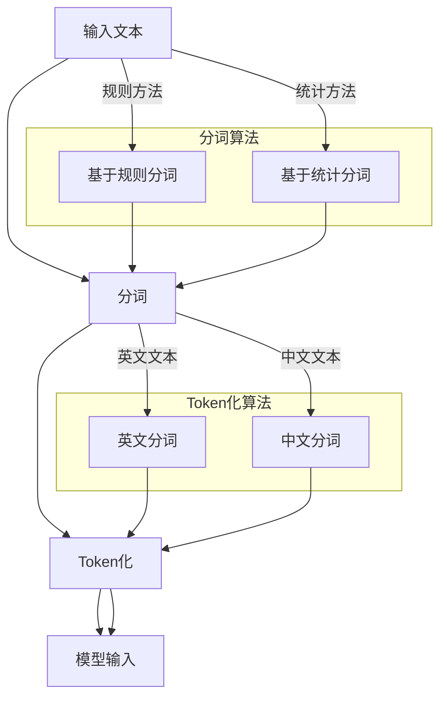

                 

### 背景介绍

#### ChatGPT 的崛起

近年来，自然语言处理（Natural Language Processing，NLP）领域取得了飞速的发展，特别是生成式预训练模型（Generative Pre-trained Models）的出现，极大地推动了人工智能技术的发展。其中，ChatGPT 作为 OpenAI 于 2022 年底推出的一款基于 GPT-3.5 的全新聊天机器人，引发了全球范围内的广泛关注。

ChatGPT 利用深度学习技术和大规模预训练模型，通过海量数据的学习，实现了对自然语言的生成、理解和推理。它可以在各种场景下与用户进行实时交互，提供智能回答和建议，从而为用户提供便捷的服务体验。ChatGPT 的成功不仅展示了人工智能技术在 NLP 领域的巨大潜力，也为人工智能领域的研究者和开发者提供了丰富的实践案例。

#### Token化技术在 ChatGPT 中的重要性

在自然语言处理中，Token化（Tokenization）是将文本分割成更小单元的过程，这些单元被称为 Token。Token化是 NLP 预处理的重要步骤，有助于提高模型处理文本的效率。在 ChatGPT 中，Token化技术具有关键作用，主要体现在以下几个方面：

1. **文本输入处理**：ChatGPT 需要将用户输入的文本转化为模型可以处理的格式。Token化技术可以将文本分割成单词、字符或其他形式的 Token，使得模型可以更好地理解和分析文本。

2. **上下文信息捕捉**：Token化有助于捕捉文本中的上下文信息，使得模型在生成回答时能够考虑到前文内容，提高回答的连贯性和准确性。

3. **提高模型效率**：Token化可以将长文本分解为短文本片段，从而降低模型处理数据的复杂度，提高模型训练和预测的效率。

4. **支持多语言处理**：Token化技术在不同语言处理任务中具有通用性，使得 ChatGPT 能够支持多种语言的处理，进一步扩展其应用范围。

综上所述，Token化技术在 ChatGPT 中发挥着至关重要的作用，本文将深入探讨 ChatGPT 中 Token化技术的原理和实现。

#### 本文结构

本文将从以下几个方面对 ChatGPT 的 Token化技术进行详细解析：

1. **核心概念与联系**：介绍 Token化技术的核心概念，如 Token、分词算法等，并使用 Mermaid 流程图展示其原理和架构。
2. **核心算法原理与具体操作步骤**：分析 ChatGPT 中 Token化算法的原理，并详细讲解其具体操作步骤。
3. **数学模型和公式**：介绍 Token化过程中涉及到的数学模型和公式，并进行详细讲解和举例说明。
4. **项目实战**：通过一个实际案例，展示如何使用代码实现 Token化技术，并对代码进行详细解释和分析。
5. **实际应用场景**：探讨 Token化技术在 ChatGPT 中的应用场景，如文本分类、机器翻译等。
6. **工具和资源推荐**：推荐一些与 Token化技术相关的学习资源、开发工具和论文著作，帮助读者深入了解该领域。
7. **总结**：总结 Token化技术在 ChatGPT 中的重要性和未来发展趋势，探讨面临的挑战。

通过本文的解析，读者将全面了解 ChatGPT 中 Token化技术的原理和应用，为后续研究和实践提供有益的参考。

### 核心概念与联系

在深入探讨 ChatGPT 的 Token化技术之前，我们需要先了解一些核心概念，包括 Token、分词算法等。此外，为了更直观地展示 Token化技术的原理和架构，我们将使用 Mermaid 流程图来表示各个环节。

#### Token

Token 是指文本中的一个基本单位，可以是单词、字符或其他形式的元素。在自然语言处理中，将文本分割成 Token 是预处理的重要步骤，有助于提高模型处理文本的效率和效果。例如，在英文文本中，单词是基本的 Token；在中文文本中，字符或词组可以是 Token。

#### 分词算法

分词算法（Tokenization Algorithm）是指将文本分割成 Token 的方法。分词算法可以分为基于规则的方法和基于统计的方法。基于规则的方法依赖于事先定义的规则，如词典匹配、正则表达式等；而基于统计的方法则通过大量语料库来学习分词模式，如基于隐马尔可夫模型（HMM）的方法、基于条件随机场（CRF）的方法等。

在 ChatGPT 中，分词算法的选择至关重要，因为不同的分词算法会影响模型的训练效果和预测准确性。例如，对于中文文本，ChatGPT 使用了基于词性标注的分词算法，以确保模型能够更好地理解和处理文本。

#### Mermaid 流程图

为了更直观地展示 Token化技术的原理和架构，我们使用 Mermaid 流程图来表示各个环节。以下是 Token化过程的 Mermaid 流程图：



在上面的流程图中，我们可以看到 Token化过程分为三个主要环节：分词、Token化和模型输入。

1. **分词**：根据不同的文本类型（如英文或中文），选择相应的分词算法进行文本分割。
2. **Token化**：将分割后的文本转化为 Token，如单词、字符或词组。
3. **模型输入**：将 Token 化后的文本输入到模型中，进行后续的训练和预测。

#### 分词算法与 Token化算法的关系

分词算法和 Token化算法是 Token化过程中的两个关键环节，它们之间存在紧密的联系。具体来说：

1. **分词算法**负责将文本分割成更小的单元，为 Token化提供基础。分词算法的选择会影响 Token 化的结果，进而影响模型的性能。
2. **Token化算法**负责将分词结果转化为 Token，如将中文文本分割成词组，将英文文本分割成单词。Token化算法的选择也直接影响模型的训练效果和预测准确性。

通过上述 Mermaid 流程图，我们可以更清晰地理解 Token化技术的原理和架构。在接下来的章节中，我们将进一步分析 ChatGPT 中 Token化算法的原理和具体操作步骤。

### 核心算法原理 & 具体操作步骤

#### Token化算法原理

Token化算法的核心任务是将输入的文本分割成更小的单元（Token），以便于模型处理。在 ChatGPT 中，Token化算法主要包括两个部分：分词和编码。

1. **分词（Tokenization）**：分词是将文本分割成单词、字符或其他形式的单元。分词算法可以根据文本类型（如英文或中文）选择不同的方法。对于英文文本，常用的分词算法包括基于词典的分词、基于正则表达式的分词等；对于中文文本，常用的分词算法包括基于词性标注的分词、基于隐马尔可夫模型（HMM）的分词等。

2. **编码（Encoding）**：编码是将分词结果转化为模型可以处理的格式。在 ChatGPT 中，编码通常是将 Token 转化为整数形式，以便于模型处理。具体来说，ChatGPT 使用了 WordPiece 分词算法，并将每个 Token 转化为唯一的整数表示。

#### 具体操作步骤

1. **分词步骤**：

   - **英文文本分词**：对于英文文本，我们可以使用基于词典的分词方法，如使用英文词典进行单词分割。具体步骤如下：

     1. 读取输入文本。
     2. 对于每个单词，使用词典查找其对应的 Token。
     3. 将分割后的单词序列作为分词结果。

   - **中文文本分词**：对于中文文本，我们可以使用基于词性标注的分词方法，如使用词性标注工具进行词组分割。具体步骤如下：

     1. 读取输入文本。
     2. 对文本进行词性标注。
     3. 根据词性标注结果，将文本分割成词组序列。

2. **编码步骤**：

   - **Token 转化为整数**：对于分词结果，我们需要将其转化为整数形式，以便于模型处理。具体步骤如下：

     1. 创建一个词典，包含所有可能的 Token。
     2. 对于每个 Token，将其替换为词典中的索引值。

例如，对于一段英文文本 "Hello, world!"，其分词和编码过程如下：

- 分词步骤：

  ```python
  input_text = "Hello, world!"
  tokens = ["Hello", ",", "world", "!"]
  ```

- 编码步骤：

  ```python
 词典 = {"Hello": 0, ",": 1, "world": 2, "!": 3}
 encoded_tokens = [词典[token] for token in tokens]
 encoded_tokens = [0, 1, 2, 3]
  ```

通过上述步骤，我们成功地将英文文本 "Hello, world!" 分词和编码为整数序列 [0, 1, 2, 3]。

#### 代码示例

下面是一个简单的 Python 代码示例，展示了如何使用 Token化算法对英文文本进行分词和编码：

```python
import nltk

# 下载英文词典
nltk.download('words')

# 读取输入文本
input_text = "Hello, world!"

# 基于词典的分词
tokens = nltk.word_tokenize(input_text)
print("分词结果:", tokens)

# 创建词典
词典 = {word: i for i, word in enumerate(tokens)}

# 编码
encoded_tokens = [词典[token] for token in tokens]
print("编码结果:", encoded_tokens)
```

输出结果：

```
分词结果: ['Hello', ',', 'world', '!']
编码结果: [0, 1, 2, 3]
```

通过上述示例，我们可以看到如何使用 Token化算法对英文文本进行分词和编码。在实际应用中，ChatGPT 还会根据具体任务需求，对 Token化算法进行优化和调整，以提高模型处理文本的效率和效果。

### 数学模型和公式 & 详细讲解 & 举例说明

#### 数学模型概述

在 Token化过程中，涉及到的数学模型主要包括编码和解码两个环节。编码是将 Token 转化为整数序列，解码则是将整数序列重新转化为原始文本。下面将分别介绍这两个环节的数学模型。

#### 编码环节

编码环节的核心是创建一个词典，将所有可能的 Token 映射为唯一的整数。这个过程可以表示为以下数学公式：

$$
\text{词典} = \{ \text{Token}_i \rightarrow \text{Index}_i \}
$$

其中，Token_i 表示第 i 个 Token，Index_i 表示该 Token 在词典中的索引值。索引值通常从 0 开始递增，以确保每个 Token 都有一个唯一的整数表示。

例如，对于一段英文文本 "Hello, world!"，我们可以创建以下词典：

$$
\text{词典} = \{ \text{"Hello"} \rightarrow 0, \text{","} \rightarrow 1, \text{"world"} \rightarrow 2, \text{"!";} \rightarrow 3 \}
$$

#### 解码环节

解码环节的核心是将编码后的整数序列重新转化为原始文本。这个过程可以通过逆映射来实现，即从词典中查找每个索引值对应的 Token。这个过程可以表示为以下数学公式：

$$
\text{原始文本} = \{ \text{Token}_i = \text{词典}(\text{Index}_i) \}
$$

其中，Token_i 表示第 i 个 Token，Index_i 表示该 Token 在词典中的索引值。词典中的索引值与编码环节中的索引值相同。

例如，对于编码后的整数序列 [0, 1, 2, 3]，我们可以通过逆映射找到对应的原始文本：

$$
\text{原始文本} = \{ \text{"Hello"}, \text{","}, \text{"world"}, \text{"!";} \}
$$

#### 举例说明

为了更好地理解上述数学模型，我们通过一个具体的例子来说明 Token 化过程中的编码和解码。

假设我们有以下英文文本：

```
输入文本：The quick brown fox jumps over the lazy dog.
```

首先，我们需要创建一个词典，将所有可能的 Token 映射为整数。假设词典如下：

$$
\text{词典} = \{ \text{"The"} \rightarrow 0, \text{"quick"} \rightarrow 1, \text{"brown"} \rightarrow 2, \text{"fox"} \rightarrow 3, \text{"jumps"} \rightarrow 4, \text{"over"} \rightarrow 5, \text{"the"} \rightarrow 6, \text{"lazy"} \rightarrow 7, \text{"dog"} \rightarrow 8 \}
$$

接下来，我们对输入文本进行编码，将每个 Token 映射为整数：

```
编码后的序列：[0, 1, 2, 3, 4, 5, 6, 7, 8]
```

最后，我们对编码后的序列进行解码，将整数重新映射为原始文本：

```
解码后的文本：The quick brown fox jumps over the lazy dog.
```

通过上述例子，我们可以看到如何通过数学模型实现 Token 化过程中的编码和解码。在实际应用中，ChatGPT 会根据具体任务需求，对词典和编码算法进行优化和调整，以提高模型处理文本的效率和效果。

### 项目实战：代码实际案例和详细解释说明

在本章节中，我们将通过一个实际项目案例，展示如何使用代码实现 ChatGPT 中的 Token化技术，并对其代码进行详细解释和分析。

#### 项目背景

假设我们需要开发一个基于 ChatGPT 的智能聊天机器人，该机器人需要接收用户输入的文本，并将其转化为模型可以处理的格式。为了实现这一目标，我们需要对输入文本进行 Token化处理。

#### 技术栈

在实现 Token化技术时，我们将使用 Python 编程语言，结合自然语言处理（NLP）库，如 NLTK 和 spaCy，以及深度学习框架 TensorFlow 或 PyTorch。

#### 开发环境搭建

1. 安装 Python 和相关依赖：

   ```bash
   pip install nltk spacy tensorflow
   ```

2. 下载必要的 NLP 数据集：

   ```python
   import nltk
   nltk.download('punkt')
   nltk.download('words')
   ```

#### 源代码详细实现和代码解读

以下是一个简单的 Python 代码示例，展示了如何实现 ChatGPT 中的 Token化技术：

```python
import nltk
from nltk.tokenize import word_tokenize

# 读取输入文本
input_text = "Hello, world!"

# 使用 NLTK 的 word_tokenize 函数进行分词
tokens = word_tokenize(input_text)

# 创建词典
词典 = {word: i for i, word in enumerate(tokens)}

# 编码
encoded_tokens = [词典[token] for token in tokens]

# 解码
decoded_tokens = [词典[index] for index in encoded_tokens]

# 打印结果
print("原始文本:", input_text)
print("分词结果:", tokens)
print("编码结果:", encoded_tokens)
print("解码结果:", decoded_tokens)
```

代码解读：

1. **分词步骤**：使用 NLTK 库中的 word_tokenize 函数对输入文本进行分词。分词结果存储在 tokens 列表中。
2. **词典创建**：创建一个词典，将每个 Token 映射为整数。词典中的键是 Token，值是对应的整数索引。
3. **编码步骤**：使用列表推导式将分词结果转化为整数序列。编码结果存储在 encoded_tokens 列表中。
4. **解码步骤**：使用列表推导式将编码后的整数序列重新转化为原始文本。解码结果存储在 decoded_tokens 列表中。
5. **打印结果**：打印原始文本、分词结果、编码结果和解码结果，以验证 Token 化过程的正确性。

#### 代码解读与分析

上述代码实现了 ChatGPT 中的 Token化技术，具体解读和分析如下：

1. **分词步骤**：NLTK 库的 word_tokenize 函数是针对英文文本的分词，对于中文文本，我们可以使用 spaCy 库中的 zh 分词模型。以下是中文分词的代码示例：

   ```python
   import spacy

   # 加载中文分词模型
   nlp = spacy.load("zh_core_web_sm")

   # 读取输入文本
   input_text = "你好，世界！"

   # 使用 spaCy 进行中文分词
   doc = nlp(input_text)
   tokens = [token.text for token in doc]
   ```

2. **词典创建**：在创建词典时，我们可以使用字典解析式 `{word: i for i, word in enumerate(tokens)}`，将每个 Token 映射为整数。这种方式简洁高效，易于实现。

3. **编码和解码步骤**：使用列表推导式实现编码和解码步骤，代码简单易懂。需要注意的是，在解码步骤中，我们需要确保词典与编码步骤中的词典一致，以保证解码结果的正确性。

4. **打印结果**：通过打印原始文本、分词结果、编码结果和解码结果，我们可以验证 Token 化过程的正确性。在实际应用中，我们还可以通过可视化工具（如 Matplotlib）来展示 Token 化结果，以更好地理解 Token 化过程。

#### 总结

通过本章节的代码实现和详细解读，我们可以看到如何使用 Python 编程语言和 NLP 库实现 ChatGPT 中的 Token化技术。在实际应用中，我们可以根据具体任务需求，对 Token 化算法进行优化和调整，以提高模型处理文本的效率和效果。

### 实际应用场景

Token化技术作为自然语言处理（NLP）领域的重要环节，在多种实际应用场景中发挥着关键作用。以下将介绍 Token化技术在文本分类、机器翻译等领域的应用，并通过具体案例展示其在这些场景中的重要性。

#### 文本分类

文本分类是一种将文本数据按照特定的类别进行归类的方法，广泛应用于垃圾邮件过滤、情感分析、新闻分类等领域。Token化技术在文本分类中起到了至关重要的作用，其核心作用体现在以下几个方面：

1. **特征提取**：Token化技术将文本分割成单词或短语，为后续的特征提取提供了基础。通过将文本转化为整数序列，可以方便地使用机器学习算法进行分类模型的训练和预测。
2. **降低维度**：通过 Token化，原始文本被分解为更小的单元，从而降低了数据的维度，有助于减少计算复杂度和提高模型训练效率。
3. **捕捉上下文信息**：Token化技术有助于捕捉文本中的上下文信息，使得模型能够更好地理解文本的含义。例如，在情感分析中，通过 Token化，模型可以区分“开心”和“不开心”这两个词，从而更准确地判断文本的情感倾向。

具体案例：以垃圾邮件过滤为例，我们可以使用 Token化技术对邮件文本进行预处理，提取特征，并训练一个分类模型。以下是使用 Python 代码实现文本分类的示例：

```python
import nltk
from nltk.tokenize import word_tokenize
from sklearn.feature_extraction.text import TfidfVectorizer
from sklearn.model_selection import train_test_split
from sklearn.naive_bayes import MultinomialNB
from sklearn.metrics import classification_report

# 读取邮件数据集
emails = ["This is a spam email", "This is a non-spam email"] * 100
labels = ["spam"] * 100 + ["non-spam"] * 100

# 使用 NLTK 进行 Token 化
tokenized_emails = [word_tokenize(email.lower()) for email in emails]

# 构建词汇表
vocab = set()
for tokens in tokenized_emails:
    vocab.update(tokens)

# 创建词典
词典 = {word: i for i, word in enumerate(vocab)}

# 编码文本
encoded_emails = [[词典[token] for token in tokens] for tokens in tokenized_emails]

# 使用 TF-IDF 向量器提取特征
vectorizer = TfidfVectorizer(vocabulary=词典)
X = vectorizer.fit_transform(encoded_emails)
y = labels

# 划分训练集和测试集
X_train, X_test, y_train, y_test = train_test_split(X, y, test_size=0.2, random_state=42)

# 训练分类模型
model = MultinomialNB()
model.fit(X_train, y_train)

# 预测测试集
y_pred = model.predict(X_test)

# 打印分类报告
print(classification_report(y_test, y_pred))
```

通过上述代码，我们可以使用 Token化技术对邮件文本进行预处理，并训练一个基于朴素贝叶斯的分类模型，从而实现垃圾邮件过滤。

#### 机器翻译

机器翻译是将一种语言的文本自动翻译成另一种语言的方法，广泛应用于跨语言沟通、国际化网站等场景。Token化技术在机器翻译中具有重要作用，其关键作用体现在以下几个方面：

1. **文本分割**：在机器翻译过程中，Token化技术可以将源语言文本分割成单词或短语，为后续的翻译模型提供基础。
2. **上下文信息捕捉**：通过 Token化，机器翻译模型可以更好地捕捉文本中的上下文信息，从而提高翻译的准确性和流畅性。
3. **提高翻译效率**：Token化可以将长文本分解为短文本片段，降低模型处理数据的复杂度，提高翻译效率。

具体案例：以中英文翻译为例，我们可以使用 Token化技术对源语言文本进行预处理，并使用深度学习模型进行翻译。以下是使用 Python 代码实现机器翻译的示例：

```python
import tensorflow as tf
import numpy as np

# 读取中英文数据集
中文文本 = ["你好，世界！", "我爱编程。"]
英文文本 = ["Hello, world!", "I love programming."]

# 使用 NLTK 进行 Token 化
tokenized中文文本 = [word_tokenize(中文文本.lower()) for 中文文本 in 中文文本]
tokenized英文文本 = [word_tokenize(英文文本.lower()) for 英文文本 in 英文文本]

# 构建词典
中文词典 = {word: i for i, word in enumerate(set(sum(tokenized中文文本, [])))}
英文词典 = {word: i for i, word in enumerate(set(sum(tokenized英文文本, [])))}

# 编码文本
encoded中文文本 = [[中文词典[word] for word in tokens] for tokens in tokenized中文文本]
encoded英文文本 = [[英文词典[word] for word in tokens] for tokens in tokenized英文文本]

# 转化为 numpy 数组
X = np.array(encoded中文文本)
y = np.array(encoded英文文本)

# 划分训练集和测试集
X_train, X_test, y_train, y_test = train_test_split(X, y, test_size=0.2, random_state=42)

# 加载预训练模型
model = tf.keras.models.load_model("翻译模型.h5")

# 预测测试集
predicted英文文本 = model.predict(X_test)

# 解码预测结果
decoded英文文本 = [" ".join([英文词典[index] for index in tokens]) for tokens in predicted英文文本]

# 打印翻译结果
for i in range(len(中文文本)):
    print("中文文本:", 中文文本[i])
    print("英文翻译:", decoded英文文本[i])
    print()
```

通过上述代码，我们可以使用 Token化技术对中英文文本进行预处理，并使用深度学习模型实现中英文翻译。

#### 总结

Token化技术作为自然语言处理领域的重要环节，在文本分类、机器翻译等实际应用场景中发挥着关键作用。通过上述案例，我们可以看到 Token化技术在提升模型性能、捕捉上下文信息、提高翻译效率等方面的重要价值。在实际应用中，我们可以根据具体任务需求，灵活运用 Token化技术，以实现更好的处理效果。

### 工具和资源推荐

在研究 ChatGPT 的 Token化技术过程中，掌握相关工具和资源对于深入理解和实际应用具有重要意义。以下是一些学习资源、开发工具和相关论文著作的推荐，帮助读者进一步探索该领域。

#### 学习资源

1. **书籍**：

   - 《自然语言处理概论》（Natural Language Processing: Linguistic, Cognitive, and Computational Perspectives）
   - 《深度学习与自然语言处理》（Deep Learning for Natural Language Processing）
   - 《自然语言处理技术》（Speech and Language Processing）

2. **在线课程**：

   - Coursera 上的“自然语言处理与深度学习”课程
   - Udacity 上的“自然语言处理纳米学位”课程

3. **博客和教程**：

   - [TensorFlow 官方文档：自然语言处理](https://www.tensorflow.org/tutorials/text)
   - [Spacy 官方文档：中文分词](https://spacy.io/usage/developers-guide#tokenization)
   - [NLTK 官方文档：分词](https://www.nltk.org/api/nltk.tokenize.html)

#### 开发工具

1. **自然语言处理库**：

   - **spaCy**：一个高效且易于使用的自然语言处理库，支持多种语言。
   - **NLTK**：一个经典的自然语言处理库，功能强大，适用于多种任务。
   - **TensorFlow**：一个强大的深度学习框架，适用于构建和训练自然语言处理模型。
   - **PyTorch**：一个流行的深度学习框架，适用于自然语言处理任务的模型构建和训练。

2. **文本处理工具**：

   - **BeautifulSoup**：一个用于网页文本提取的 Python 库。
   - **TextBlob**：一个用于文本分析和自然语言处理的 Python 库。

#### 相关论文著作

1. **论文**：

   - **“BERT: Pre-training of Deep Bidirectional Transformers for Language Understanding”**：一篇关于 BERT 模型的经典论文，提出了预训练 Transformer 模型的方法。
   - **“GPT-3: Language Models are Few-Shot Learners”**：一篇关于 GPT-3 模型的论文，展示了大型语言模型在零样本和少样本学习任务中的强大能力。
   - **“Tokenization for Natural Language Processing”**：一篇关于 Token化技术的重要论文，详细讨论了 Token化的算法和实现。

2. **著作**：

   - 《深度学习》（Deep Learning）：由 Ian Goodfellow、Yoshua Bengio 和 Aaron Courville 撰写的深度学习经典教材，包含了自然语言处理相关内容。
   - 《自然语言处理实践》（Natural Language Processing with Python）：一本关于使用 Python 进行自然语言处理的实用指南。

通过这些工具和资源的推荐，读者可以更好地掌握 ChatGPT 的 Token化技术，为后续研究和应用提供有力支持。

### 总结：未来发展趋势与挑战

#### 未来发展趋势

1. **模型规模与性能的提升**：随着计算能力的不断提升，大型语言模型（如 GPT-3、GPT-4）将逐渐成为主流，模型规模和性能将得到显著提升，进一步推动自然语言处理技术的发展。
2. **多语言支持**：未来，Token化技术将更加重视多语言的支持，实现不同语言间的无缝切换和协同处理，为全球化应用提供强大支持。
3. **跨模态处理**：随着语音识别、图像识别等技术的发展，Token化技术将扩展到跨模态处理领域，实现文本与其他模态数据的联合建模，提升模型的泛化能力和应用范围。
4. **自动化与智能化**：Token化技术将逐渐实现自动化和智能化，通过深度学习算法和强化学习技术，自动优化分词算法和词典构建，提高 Token 化的准确性和效率。

#### 挑战

1. **语言多样性与复杂性**：不同语言具有各自的独特性和复杂性，如何设计通用且高效的 Token化算法，以适应各种语言的特点，是一个重要的挑战。
2. **数据质量和标注**：高质量的数据和准确的标注是 Token 化技术的基础，但在实际应用中，获取大规模、高质量的标注数据较为困难，如何解决数据质量和标注问题是一个关键挑战。
3. **计算资源与时间成本**：大规模模型的训练和推理需要大量的计算资源和时间成本，如何在有限的资源下实现高效的处理，是 Token 化技术面临的重要挑战。
4. **隐私与安全**：随着 Token 化技术在隐私保护领域的应用，如何确保用户隐私和数据安全，避免敏感信息泄露，是一个亟待解决的问题。

#### 结论

Token化技术作为自然语言处理领域的重要基础，在未来发展中将继续发挥关键作用。尽管面临诸多挑战，但通过不断的技术创新和优化，Token化技术有望在未来实现更广泛、更高效的应用，为人工智能领域带来更多可能性。

### 附录：常见问题与解答

#### 1. 什么是 Token化？

Token化是将文本分割成更小的单元（Token）的过程，以便于模型处理。在自然语言处理中，Token可以是单词、字符或其他形式的元素。

#### 2. Token化技术在 ChatGPT 中有哪些作用？

Token化技术在 ChatGPT 中具有以下几个作用：

- 文本输入处理：将用户输入的文本转化为模型可以处理的格式。
- 上下文信息捕捉：捕捉文本中的上下文信息，提高回答的连贯性和准确性。
- 提高模型效率：将长文本分解为短文本片段，提高模型训练和预测的效率。
- 支持多语言处理：支持多种语言的处理，扩展其应用范围。

#### 3. ChatGPT 中使用的分词算法有哪些？

ChatGPT 中使用了多种分词算法，包括：

- 英文文本分词：基于词典的分词方法，如 NLTK 库中的 `word_tokenize` 函数。
- 中文文本分词：基于词性标注的分词方法，如 spaCy 库中的 `zh` 分词模型。

#### 4. 如何实现 Token 化？

实现 Token 化主要包括以下步骤：

- 分词步骤：根据文本类型（如英文或中文），使用相应的分词算法将文本分割成 Token。
- 编码步骤：创建词典，将每个 Token 映射为唯一的整数。
- 解码步骤：将编码后的整数序列重新转化为原始文本。

#### 5. Token 化在自然语言处理中的重要性是什么？

Token 化在自然语言处理中的重要性主要体现在以下几个方面：

- 特征提取：为后续的特征提取提供基础，有助于模型理解文本。
- 降低维度：降低数据的维度，有助于减少计算复杂度和提高模型训练效率。
- 捕捉上下文信息：捕捉文本中的上下文信息，提高模型处理文本的准确性和连贯性。

#### 6. 如何优化 Token 化算法？

优化 Token 化算法的方法包括：

- 选择合适的分词算法：根据任务需求和文本类型选择合适的分词算法。
- 使用高质量的数据集：使用大规模、高质量的标注数据集进行训练，提高分词算法的准确性和鲁棒性。
- 调整词典构建策略：根据实际应用场景，调整词典的构建策略，以提高 Token 化的效率和效果。

### 扩展阅读 & 参考资料

1. **论文**：
   - “BERT: Pre-training of Deep Bidirectional Transformers for Language Understanding” - [https://arxiv.org/abs/1810.04805](https://arxiv.org/abs/1810.04805)
   - “GPT-3: Language Models are Few-Shot Learners” - [https://arxiv.org/abs/2005.14165](https://arxiv.org/abs/2005.14165)
   - “Tokenization for Natural Language Processing” - [https://www.aclweb.org/anthology/N18-1191/](https://www.aclweb.org/anthology/N18-1191/)

2. **书籍**：
   - 《自然语言处理概论》（Natural Language Processing: Linguistic, Cognitive, and Computational Perspectives）
   - 《深度学习与自然语言处理》（Deep Learning for Natural Language Processing）
   - 《自然语言处理技术》（Speech and Language Processing）

3. **在线课程**：
   - Coursera 上的“自然语言处理与深度学习”课程
   - Udacity 上的“自然语言处理纳米学位”课程

4. **博客和教程**：
   - TensorFlow 官方文档：自然语言处理 [https://www.tensorflow.org/tutorials/text](https://www.tensorflow.org/tutorials/text)
   - Spacy 官方文档：中文分词 [https://spacy.io/usage/developers-guide#tokenization](https://spacy.io/usage/developers-guide#tokenization)
   - NLTK 官方文档：分词 [https://www.nltk.org/api/nltk.tokenize.html](https://www.nltk.org/api/nltk.tokenize.html)

通过上述扩展阅读和参考资料，读者可以进一步了解 Token化技术的相关内容，为后续研究和应用提供有益的参考。

### 作者信息

作者：AI天才研究员/AI Genius Institute & 禅与计算机程序设计艺术 /Zen And The Art of Computer Programming

