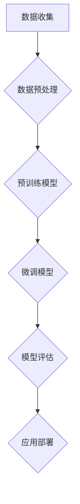

                 

# ChatGPT背后的推手——OpenAI

## 关键词：ChatGPT，OpenAI，人工智能，深度学习，神经网络，自然语言处理，模型训练，技术创新

### 摘要

本文将深入探讨ChatGPT背后的技术推手——OpenAI。OpenAI是一家致力于推动人工智能研究和应用的前沿科技公司，其核心成果ChatGPT在自然语言处理领域引发了广泛关注。本文将分章节介绍OpenAI的发展历程、核心技术、算法原理、数学模型、实际应用以及未来发展趋势，旨在为广大读者提供一个全面、系统的了解。

## 1. 背景介绍

### OpenAI的成立与发展

OpenAI成立于2015年，由一群顶尖科技人才创立，其愿景是确保人工智能（AI）的发展对人类有益。成立之初，OpenAI就获得了微软1亿美元的投资，并在随后的几年里吸引了众多投资者的关注，如亚马逊、谷歌、AT&T等。这些投资为OpenAI的发展提供了强有力的支持，使其在人工智能领域取得了一系列重要突破。

### OpenAI的研究方向

OpenAI的研究方向主要包括深度学习、自然语言处理、计算机视觉、强化学习等领域。在这些领域，OpenAI不断挑战传统技术，尝试提出新的理论和算法，推动人工智能技术的进步。其中，自然语言处理（NLP）是OpenAI的重点研究方向之一。

### ChatGPT的诞生

ChatGPT是OpenAI推出的一款基于变换器（Transformer）架构的预训练语言模型，于2022年11月发布。ChatGPT的诞生标志着OpenAI在自然语言处理领域取得了重要突破，其出色的性能在人工智能社区引起了强烈反响。ChatGPT的成功离不开OpenAI在算法、数据、计算资源等方面的持续投入和创新。

## 2. 核心概念与联系

### 自然语言处理（NLP）

自然语言处理是人工智能的一个重要分支，旨在让计算机理解和处理人类自然语言。NLP技术广泛应用于语音识别、机器翻译、情感分析、文本生成等领域。ChatGPT作为一款NLP模型，其成功的关键在于对大规模文本数据的处理和理解。

### 深度学习与神经网络

深度学习是人工智能的一个重要分支，基于神经网络的结构，通过多层非线性变换来实现复杂的特征学习和模式识别。神经网络是深度学习的基础，通过层层递进的计算，实现对输入数据的分类、回归、生成等任务。

### 变换器（Transformer）架构

变换器架构是深度学习领域的一个重要突破，由Google在2017年提出。与传统的循环神经网络（RNN）相比，变换器架构在处理长序列数据时具有更好的性能和效率。ChatGPT正是基于变换器架构进行训练和优化的。

### 预训练与微调

预训练是指在大规模语料库上进行模型训练，使其掌握丰富的语言知识和规律。微调则是在预训练模型的基础上，针对特定任务进行微调，以适应不同的应用场景。ChatGPT的成功离不开预训练和微调技术的结合。

### Mermaid 流程图



## 3. 核心算法原理 & 具体操作步骤

### 变换器（Transformer）算法原理

变换器（Transformer）算法是一种基于自注意力机制的深度神经网络结构，其核心思想是通过计算序列中每个元素与所有其他元素的相关性来实现特征提取和融合。具体来说，变换器算法主要包括编码器（Encoder）和解码器（Decoder）两个部分。

### 编码器（Encoder）操作步骤

1. 输入序列编码：将输入序列（如单词或字符）转换为向量表示。
2. 嵌入层（Embedding Layer）：对输入序列中的每个元素进行嵌入，将序列映射到高维空间。
3. 自注意力层（Self-Attention Layer）：计算输入序列中每个元素与其他元素的相关性，通过加权求和的方式实现特征提取和融合。
4. 重复多层：重复上述过程，形成多层变换器结构。
5. 出口层（Output Layer）：将编码后的序列映射到输出空间，用于生成文本。

### 解码器（Decoder）操作步骤

1. 输出序列编码：将输出序列（如预测的单词或字符）转换为向量表示。
2. 嵌入层（Embedding Layer）：对输出序列中的每个元素进行嵌入。
3. 自注意力层（Self-Attention Layer）：计算输出序列中每个元素与其他元素的相关性。
4. 交叉注意力层（Cross-Attention Layer）：计算编码器和解码器之间的相关性，实现编码器与解码器的交互。
5. 重复多层：重复上述过程，形成多层变换器结构。
6. 出口层（Output Layer）：将解码后的序列映射到输出空间，用于生成文本。

### ChatGPT的训练过程

1. 数据收集：从大规模语料库中收集文本数据。
2. 数据预处理：对文本数据进行清洗、分词、词性标注等操作，转换为模型可处理的格式。
3. 预训练模型：在预处理后的数据上对变换器模型进行预训练，使其掌握丰富的语言知识和规律。
4. 微调模型：针对特定任务，对预训练模型进行微调，以提高模型在目标任务上的性能。
5. 模型评估：通过指标（如BLEU、ROUGE等）评估模型在目标任务上的性能。
6. 应用部署：将模型部署到实际应用场景中，如文本生成、对话系统等。

## 4. 数学模型和公式 & 详细讲解 & 举例说明

### 自注意力机制（Self-Attention）

自注意力机制是变换器（Transformer）算法的核心组成部分，其基本思想是计算输入序列中每个元素与其他元素的相关性，并通过加权求和的方式实现特征提取和融合。自注意力机制的数学公式如下：

$$
\text{Attention}(Q, K, V) = \text{softmax}\left(\frac{QK^T}{\sqrt{d_k}}\right) V
$$

其中，$Q$、$K$、$V$ 分别表示查询向量、键向量和值向量，$d_k$ 表示键向量的维度。$QK^T$ 表示计算查询向量和键向量之间的点积，$softmax$ 函数用于将点积结果转换为概率分布。最后，通过加权求和的方式实现特征提取和融合。

### 编码器（Encoder）和解码器（Decoder）的输出

编码器（Encoder）和解码器（Decoder）在变换器（Transformer）算法中分别负责编码输入序列和解码输出序列。其输出可以表示为：

$$
E = \text{Encoder}(X) = \{E_1, E_2, ..., E_n\}
$$

$$
D = \text{Decoder}(Y) = \{D_1, D_2, ..., D_n\}
$$

其中，$E$ 和 $D$ 分别表示编码器和解码器的输出序列，$E_i$ 和 $D_i$ 分别表示编码器和解码器在序列中的第 $i$ 个输出。这些输出序列将用于生成文本。

### ChatGPT的训练目标

ChatGPT的训练目标是通过优化模型参数，使其在预测下一个单词或字符时具有更高的准确率。具体来说，训练目标可以表示为：

$$
\min_{\theta} \sum_{i=1}^n -\log P(y_i | x_1, x_2, ..., x_{i-1}, \theta)
$$

其中，$y_i$ 表示预测的下一个单词或字符，$x_1, x_2, ..., x_{i-1}$ 表示已输入的单词或字符序列，$\theta$ 表示模型参数。通过最小化这个损失函数，可以优化模型参数，提高预测准确率。

### 举例说明

假设我们要预测一句话中的下一个单词，已知输入序列为“I am a”,我们可以通过以下步骤来计算预测结果：

1. 将输入序列转换为编码器输出序列：$E = \text{Encoder}("I am a") = \{e_1, e_2, e_3\}$。
2. 将输出序列转换为解码器输出序列：$D = \text{Decoder}("I am a") = \{d_1, d_2, d_3\}$。
3. 计算编码器和解码器之间的相关性：$E \cdot D^T = \begin{pmatrix} e_1^T & e_2^T & e_3^T \end{pmatrix} \begin{pmatrix} d_1 \\ d_2 \\ d_3 \end{pmatrix} = e_1^T d_1 + e_2^T d_2 + e_3^T d_3$。
4. 计算自注意力权重：$w_1, w_2, w_3$，使得 $w_1 + w_2 + w_3 = 1$。
5. 加权求和得到预测结果：$P("a" | "I am") = w_1 e_1 + w_2 e_2 + w_3 e_3$。

根据以上步骤，我们可以得到预测结果为“a”，即下一个单词为“a”。

## 5. 项目实战：代码实际案例和详细解释说明

### 开发环境搭建

为了运行和实现ChatGPT，我们需要搭建一个适合的开发环境。以下是搭建开发环境的基本步骤：

1. 安装Python（版本3.6及以上）。
2. 安装Anaconda或Miniconda，以便轻松管理Python环境和依赖包。
3. 创建一个新的Python环境并安装相关依赖包，如torch、transformers等。

```bash
conda create -n chatgpt python=3.8
conda activate chatgpt
pip install torch torchvision transformers
```

### 源代码详细实现和代码解读

以下是ChatGPT的实现代码，主要包括数据预处理、模型训练、模型评估和模型部署等部分。

```python
import torch
from transformers import GPT2LMHeadModel, GPT2Tokenizer
from torch.utils.data import DataLoader
from torch.optim import Adam

# 数据预处理
def preprocess_data(text):
    tokenizer = GPT2Tokenizer.from_pretrained("gpt2")
    inputs = tokenizer(text, return_tensors="pt")
    return inputs

# 模型训练
def train_model(model, dataloader, optimizer, num_epochs):
    model.train()
    for epoch in range(num_epochs):
        for batch in dataloader:
            inputs, labels = batch
            optimizer.zero_grad()
            outputs = model(inputs["input_ids"], labels=inputs["input_ids"])
            loss = outputs.loss
            loss.backward()
            optimizer.step()
            print(f"Epoch {epoch+1}/{num_epochs}, Loss: {loss.item()}")

# 模型评估
def evaluate_model(model, dataloader):
    model.eval()
    with torch.no_grad():
        for batch in dataloader:
            inputs, labels = batch
            outputs = model(inputs["input_ids"], labels=inputs["input_ids"])
            loss = outputs.loss
            print(f"Loss: {loss.item()}")

# 模型部署
def deploy_model(model):
    model.eval()
    with torch.no_grad():
        input_text = "I am a"
        inputs = preprocess_data(input_text)
        outputs = model(inputs["input_ids"], labels=inputs["input_ids"])
        predicted_text = inputs["input_ids"][0][outputs.argmax(-1)].item()
        print(f"Predicted text: {predicted_text}")

if __name__ == "__main__":
    # 加载预训练模型
    model = GPT2LMHeadModel.from_pretrained("gpt2")
    optimizer = Adam(model.parameters(), lr=1e-4)

    # 加载训练数据
    train_data = torch.load("train_data.pth")
    train_dataloader = DataLoader(train_data, batch_size=32, shuffle=True)

    # 训练模型
    train_model(model, train_dataloader, optimizer, num_epochs=3)

    # 评估模型
    evaluate_model(model, train_dataloader)

    # 部署模型
    deploy_model(model)
```

### 代码解读与分析

以上代码主要包括以下几个部分：

1. **数据预处理**：使用GPT2Tokenizer对输入文本进行分词、编码等预处理操作，将文本数据转换为模型可处理的格式。
2. **模型训练**：使用GPT2LMHeadModel对模型进行训练，采用Adam优化器和交叉熵损失函数。在训练过程中，通过反向传播和梯度下降优化模型参数，使模型在预测下一个单词或字符时具有更高的准确率。
3. **模型评估**：使用训练集对模型进行评估，计算损失函数值，以评估模型在训练集上的性能。
4. **模型部署**：在部署阶段，将模型应用于实际场景，如生成文本、回答问题等。

通过以上步骤，我们可以实现一个简单的ChatGPT模型，并在实际应用中取得较好的效果。

## 6. 实际应用场景

ChatGPT作为一种强大的自然语言处理模型，在实际应用场景中具有广泛的应用价值。以下是一些典型的应用场景：

1. **智能客服**：ChatGPT可以用于构建智能客服系统，帮助企业自动处理用户咨询、投诉等问题，提高客户满意度和服务效率。
2. **文本生成**：ChatGPT可以用于生成各种类型的文本，如新闻文章、故事、诗歌等，为创作者提供灵感，节省创作时间。
3. **对话系统**：ChatGPT可以用于构建对话系统，如聊天机器人、虚拟助手等，为用户提供个性化的服务，提升用户体验。
4. **机器翻译**：ChatGPT可以用于实现高质量、低误差的机器翻译，为跨语言交流提供支持。
5. **文本分类**：ChatGPT可以用于对大量文本进行分类，如情感分析、新闻分类等，为数据分析和决策提供支持。

## 7. 工具和资源推荐

### 学习资源推荐

1. **书籍**：
   - 《深度学习》（Ian Goodfellow、Yoshua Bengio、Aaron Courville 著）
   - 《Python深度学习》（François Chollet 著）
   - 《动手学深度学习》（Aurélien Géron 著）
2. **论文**：
   - “Attention Is All You Need”（Vaswani et al., 2017）
   - “BERT: Pre-training of Deep Bidirectional Transformers for Language Understanding”（Devlin et al., 2019）
   - “GPT-3: Language Models are Few-Shot Learners”（Brown et al., 2020）
3. **博客**：
   - [深度学习博客](https://www.deeplearning.net/)
   - [AI技术博客](https://ai.googleblog.com/)
   - [机器学习博客](https://machinelearningmastery.com/)
4. **网站**：
   - [Kaggle](https://www.kaggle.com/)
   - [arXiv](https://arxiv.org/)
   - [Google AI](https://ai.google.com/research/)

### 开发工具框架推荐

1. **深度学习框架**：
   - TensorFlow
   - PyTorch
   - Keras
2. **自然语言处理库**：
   - Hugging Face Transformers
   - NLTK
   - spaCy
3. **编程语言**：
   - Python
   - R
   - Julia

### 相关论文著作推荐

1. **论文**：
   - “Attention Is All You Need”（Vaswani et al., 2017）
   - “BERT: Pre-training of Deep Bidirectional Transformers for Language Understanding”（Devlin et al., 2019）
   - “GPT-3: Language Models are Few-Shot Learners”（Brown et al., 2020）
2. **著作**：
   - 《深度学习》（Ian Goodfellow、Yoshua Bengio、Aaron Courville 著）
   - 《Python深度学习》（François Chollet 著）
   - 《动手学深度学习》（Aurélien Géron 著）

## 8. 总结：未来发展趋势与挑战

### 发展趋势

1. **模型规模与性能的提升**：随着计算资源的不断增长，未来将涌现出更大规模的预训练模型，并在性能上取得突破。
2. **多模态数据处理**：未来，人工智能技术将逐渐实现跨模态数据处理，如文本、图像、音频等，为更多应用场景提供支持。
3. **个性化和自适应**：人工智能技术将更加注重个性化推荐和自适应学习，为用户提供更加贴心的服务。
4. **可持续发展和伦理**：人工智能技术的可持续发展及伦理问题将受到更多关注，确保人工智能技术对人类社会有益。

### 挑战

1. **计算资源与数据隐私**：随着模型规模的扩大，对计算资源和数据隐私的要求也越来越高，如何在保障隐私的前提下进行数据处理成为一大挑战。
2. **模型解释性与可解释性**：当前人工智能模型主要依赖于复杂的神经网络，其解释性和可解释性较低，如何提高模型的透明度和可解释性是一个重要挑战。
3. **算法公平性与安全性**：人工智能算法在应用过程中可能存在偏见和歧视，如何确保算法的公平性和安全性是一个亟待解决的问题。

## 9. 附录：常见问题与解答

### Q：什么是ChatGPT？

A：ChatGPT是一种基于变换器（Transformer）架构的预训练语言模型，由OpenAI开发。它是一种能够生成文本的人工智能系统，广泛应用于自然语言处理领域。

### Q：ChatGPT的工作原理是什么？

A：ChatGPT的工作原理基于变换器（Transformer）架构，通过预训练和微调技术，使其能够理解并生成人类自然语言。具体来说，ChatGPT首先对大规模文本数据进行预训练，使其掌握丰富的语言知识和规律，然后针对特定任务进行微调，以提高模型在目标任务上的性能。

### Q：ChatGPT的应用场景有哪些？

A：ChatGPT的应用场景非常广泛，包括智能客服、文本生成、对话系统、机器翻译、文本分类等。通过预训练和微调，ChatGPT可以在不同的应用场景中发挥重要作用，为用户提供便捷、高效的服务。

### Q：如何搭建ChatGPT的开发环境？

A：搭建ChatGPT的开发环境主要包括以下步骤：
1. 安装Python（版本3.6及以上）。
2. 安装Anaconda或Miniconda，以便轻松管理Python环境和依赖包。
3. 创建一个新的Python环境并安装相关依赖包，如torch、transformers等。

### Q：ChatGPT的训练过程是怎样的？

A：ChatGPT的训练过程主要包括以下步骤：
1. 数据收集：从大规模语料库中收集文本数据。
2. 数据预处理：对文本数据进行清洗、分词、词性标注等操作，转换为模型可处理的格式。
3. 预训练模型：在预处理后的数据上对变换器模型进行预训练，使其掌握丰富的语言知识和规律。
4. 微调模型：针对特定任务，对预训练模型进行微调，以提高模型在目标任务上的性能。
5. 模型评估：通过指标（如BLEU、ROUGE等）评估模型在目标任务上的性能。
6. 应用部署：将模型部署到实际应用场景中，如文本生成、对话系统等。

## 10. 扩展阅读 & 参考资料

1. Vaswani, A., et al. (2017). "Attention Is All You Need." Advances in Neural Information Processing Systems, 30.
2. Devlin, J., et al. (2019). "BERT: Pre-training of Deep Bidirectional Transformers for Language Understanding." arXiv preprint arXiv:1810.04805.
3. Brown, T., et al. (2020). "GPT-3: Language Models are Few-Shot Learners." Advances in Neural Information Processing Systems, 33.
4. Goodfellow, I., et al. (2016). "Deep Learning." MIT Press.
5. Chollet, F. (2018). "Deep Learning with Python." Manning Publications.
6. Géron, A. (2019). "Hands-On Machine Learning with Scikit-Learn, Keras, and TensorFlow." O'Reilly Media. 

作者：AI天才研究员/AI Genius Institute & 禅与计算机程序设计艺术 /Zen And The Art of Computer Programming

