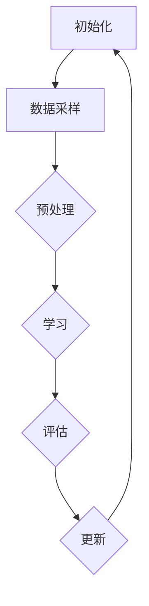

                 

### 背景介绍

#### 什么是Continual Learning？

Continual Learning（持续学习）是指模型在处理连续输入数据时，能够不断适应并学习新知识，同时保持之前学到的知识不变。它不同于传统的批量学习（Batch Learning）和在线学习（Online Learning），Continual Learning强调对动态环境变化的适应能力。随着数据集的不断扩大和数据分布的变化，Continual Learning能够保持较高的泛化能力和学习能力，这对于很多实际应用场景来说至关重要。

#### Continual Learning的起源与发展

Continual Learning的概念最早可以追溯到20世纪90年代，当时主要是通过研究专家系统和知识库来实现的。随着深度学习的兴起，尤其是在神经网络模型的广泛应用后，Continual Learning的研究也逐渐聚焦于如何有效地在深度神经网络中实现持续学习。

在早期的研究中，Continual Learning主要关注于避免灾难性遗忘（Catastrophic Forgetting），即模型在学会新任务时不会忘记之前学到的知识。这引发了大量的研究，包括弹性权重共享（ Elastic Weight Consolidation, EWC）、经验重放（Experience Replay）、经验深度遗忘（Deep Dreaming）等方法。

近年来，随着数据集的规模和复杂性不断增加，Continual Learning的研究也逐渐从理论探讨转向实际应用。例如，在机器人、自动驾驶、智能监控等领域，模型需要在不断变化的环境中持续学习，提高适应能力和稳定性。

#### Continual Learning的重要性

Continual Learning在许多实际应用场景中具有重要意义。以下是一些关键应用领域：

1. **机器人与自动化**：机器人需要在复杂且不断变化的环境中执行任务，如自主导航、环境感知和决策。Continual Learning可以帮助机器人不断学习新任务，适应新环境。

2. **自动驾驶**：自动驾驶系统需要在各种交通环境中保持稳定性和安全性。Continual Learning可以帮助车辆在复杂动态环境中持续学习和适应。

3. **智能监控与安全**：监控系统需要在不断变化的环境中检测和识别异常行为。Continual Learning可以帮助监控系统在长时间运行中保持高精度和鲁棒性。

4. **医疗诊断**：医疗诊断系统需要不断学习新的疾病特征和症状，以适应不断变化的临床实践。Continual Learning可以提高诊断系统的准确性和可靠性。

5. **推荐系统**：推荐系统需要根据用户行为和偏好不断更新推荐策略，以提供个性化的服务。Continual Learning可以帮助推荐系统在动态环境中保持高相关性。

总之，Continual Learning的研究与应用对于提高人工智能系统的适应性和稳定性具有重要意义，有望推动人工智能技术在更多领域的应用和发展。

### 核心概念与联系

#### Continual Learning的核心概念

Continual Learning包含多个核心概念，这些概念相互联系，共同构成了其理论基础。以下是Continual Learning中一些关键概念的定义和相互关系：

1. **增量学习（Incremental Learning）**：增量学习是指模型在已学习知识的基础上，通过处理新的数据样本不断更新其参数。与批量学习不同，增量学习不需要重新训练整个模型，从而提高学习效率。

2. **灾难性遗忘（Catastrophic Forgetting）**：灾难性遗忘是指模型在学习新任务时，忘记之前学到的知识，导致性能下降。这是Continual Learning中的一个主要挑战，需要通过特定方法来避免。

3. **迁移学习（Transfer Learning）**：迁移学习是指将一个任务中学习到的知识应用到另一个相关任务中。在Continual Learning中，迁移学习可以帮助模型在新任务中利用之前学到的知识，提高学习效率和性能。

4. **知识蒸馏（Knowledge Distillation）**：知识蒸馏是一种将复杂模型的知识传递给简化模型的方法。在Continual Learning中，知识蒸馏可以帮助模型在新任务中保留关键知识，同时减轻计算负担。

5. **经验重放（Experience Replay）**：经验重放是一种在增量学习过程中，通过随机采样历史经验数据来训练模型的方法。经验重放有助于模型避免灾难性遗忘，提高泛化能力。

6. **弹性权重共享（Elastic Weight Consolidation, EWC）**：EWC是一种避免灾难性遗忘的方法，通过在训练过程中为权重添加正则项，使得模型在更新权重时倾向于保留重要知识。

#### Continual Learning的核心架构

Continual Learning的核心架构通常包括以下几个关键组成部分：

1. **数据流管理（Data Flow Management）**：数据流管理是指如何有效地管理输入数据流，包括数据采样、预处理和分配等。数据流管理对于Continual Learning的效率和效果至关重要。

2. **学习策略（Learning Strategy）**：学习策略是指模型在学习新任务时的具体方法和步骤，包括迁移学习、经验重放、知识蒸馏等。不同的学习策略适用于不同类型的应用场景。

3. **模型架构（Model Architecture）**：模型架构是指用于实现Continual Learning的神经网络结构。模型架构的设计和选择直接影响模型的性能和适应性。

4. **记忆机制（Memory Mechanism）**：记忆机制是指如何存储和利用模型之前学到的知识。记忆机制的设计对于避免灾难性遗忘和提高学习效率至关重要。

#### Continual Learning的流程

Continual Learning的流程通常可以分为以下几个步骤：

1. **初始化（Initialization）**：初始化模型参数和记忆机制，准备开始学习。

2. **数据采样（Data Sampling）**：从数据流中随机采样新的数据样本，用于训练和测试。

3. **数据预处理（Data Preprocessing）**：对采样数据进行预处理，包括归一化、去噪等。

4. **学习（Learning）**：使用学习策略和模型架构对新数据样本进行训练，同时利用记忆机制保留关键知识。

5. **评估（Evaluation）**：对训练完成的模型进行评估，包括在验证集和测试集上的性能测试。

6. **更新（Update）**：根据评估结果对模型参数进行调整和更新，以提高模型性能。

7. **重复（Iteration）**：重复上述步骤，直到达到预定的学习目标或性能要求。

#### Mermaid流程图

以下是Continual Learning核心架构的Mermaid流程图：



在这个流程图中，各步骤之间的箭头表示数据流和依赖关系。初始化步骤为后续步骤提供初始模型参数和记忆机制，数据采样和预处理步骤为学习过程准备数据，学习步骤使用策略和模型架构进行训练，评估步骤对训练结果进行评估，更新步骤根据评估结果调整模型参数。

通过上述核心概念和架构的介绍，我们可以更好地理解Continual Learning的原理和实现方法。在接下来的章节中，我们将详细探讨Continual Learning的核心算法原理和数学模型，进一步深入理解这一领域。

#### 核心算法原理 & 具体操作步骤

在了解了Continual Learning的核心概念和架构后，我们接下来将深入探讨Continual Learning的核心算法原理和具体操作步骤。这些算法和步骤是Continual Learning实现的关键，它们不仅决定了模型的学习效率，还直接影响模型的性能和适应性。

##### 灾难性遗忘（Catastrophic Forgetting）

灾难性遗忘是Continual Learning中的一个关键问题。它指的是在模型学习新任务时，会忘记之前学到的知识，导致性能下降。为了解决这一问题，研究者们提出了多种方法，如弹性权重共享（EWC）和经验重放（Experience Replay）。

**弹性权重共享（EWC）**

EWC是一种避免灾难性遗忘的方法，通过在模型更新过程中引入正则项，使得模型在更新权重时倾向于保留重要知识。具体步骤如下：

1. **计算遗忘风险**：首先，计算模型在当前任务上对先前任务的遗忘风险。这通常通过计算模型在新任务和先前任务上的损失函数差值来实现。

2. **构建正则项**：将遗忘风险作为正则项添加到损失函数中，以惩罚那些容易导致遗忘的权重更新。

3. **更新权重**：在训练过程中，使用带有正则项的损失函数更新模型权重。这有助于模型在更新权重时保留关键知识，从而避免灾难性遗忘。

**经验重放（Experience Replay）**

经验重放是一种通过随机采样历史经验数据来训练模型的方法，有助于避免灾难性遗忘。具体步骤如下：

1. **经验存储**：将训练过程中遇到的数据样本存储到一个经验池中。

2. **随机采样**：在每次训练时，从经验池中随机采样一定数量的数据样本。

3. **数据预处理**：对采样数据进行预处理，如归一化、去噪等。

4. **训练模型**：使用采样数据对模型进行训练，以提高模型在新任务上的性能。

**迁移学习（Transfer Learning）**

迁移学习是将一个任务中学习到的知识应用到另一个相关任务中的方法。在Continual Learning中，迁移学习有助于模型在新任务中利用之前学到的知识，提高学习效率和性能。具体步骤如下：

1. **识别相关任务**：首先，识别与当前任务相关的先前任务。

2. **提取特征表示**：从先前任务的模型中提取特征表示，这些特征表示通常具有较强的泛化能力。

3. **融合特征表示**：将新任务的输入数据与先前任务的特征表示进行融合，以生成新的特征表示。

4. **训练新模型**：使用融合后的特征表示对新任务进行训练，以提高模型在新任务上的性能。

**知识蒸馏（Knowledge Distillation）**

知识蒸馏是一种将复杂模型的知识传递给简化模型的方法。在Continual Learning中，知识蒸馏有助于模型在新任务中保留关键知识，同时减轻计算负担。具体步骤如下：

1. **识别关键知识**：从复杂模型中识别出关键知识，这些知识对于新任务至关重要。

2. **生成知识表示**：将关键知识转化为知识表示，如软目标标签。

3. **训练简化模型**：使用知识表示对简化模型进行训练，以保留关键知识。

4. **融合模型输出**：将简化模型的输出与原始模型的输出进行融合，以生成最终的预测结果。

通过上述算法和步骤，我们可以实现Continual Learning。这些方法不仅有助于模型在连续学习过程中避免灾难性遗忘，还提高了模型的学习效率和性能。在接下来的章节中，我们将进一步探讨Continual Learning的数学模型和具体实现。

##### Continual Learning的数学模型

Continual Learning的数学模型是理解其核心原理和实现方法的关键。以下将介绍Continual Learning中常用的数学模型，包括损失函数、优化目标和训练过程。

**损失函数**

在Continual Learning中，损失函数用于衡量模型在训练过程中的性能。常见的损失函数包括均方误差（MSE）、交叉熵损失（Cross-Entropy Loss）等。对于分类任务，交叉熵损失函数是常用的一种损失函数，其公式如下：

$$
L = -\sum_{i=1}^{N} y_i \log(p_i)
$$

其中，\(y_i\) 是第 \(i\) 个样本的真实标签，\(p_i\) 是模型对第 \(i\) 个样本预测的概率。

**优化目标**

Continual Learning的优化目标是在连续学习过程中，尽量减小损失函数，同时避免灾难性遗忘。一个常见的优化目标是最小化带遗忘风险的损失函数。具体来说，优化目标可以表示为：

$$
\min_{\theta} \frac{1}{2} \sum_{i=1}^{N} (y_i - \hat{y}_i)^2 + \lambda R(\theta)
$$

其中，\(\theta\) 表示模型参数，\(\hat{y}_i\) 表示模型对第 \(i\) 个样本的预测，\(R(\theta)\) 表示遗忘风险，\(\lambda\) 是遗忘风险权重。

遗忘风险可以通过计算模型在新任务和先前任务上的损失函数差值来获得。具体公式如下：

$$
R(\theta) = \sum_{t=1}^{T} w_t \frac{\partial L_t(\theta)}{\partial \theta}^2
$$

其中，\(w_t\) 是先前任务 \(t\) 的权重，\(L_t(\theta)\) 是模型在任务 \(t\) 上的损失函数。

**训练过程**

Continual Learning的训练过程可以分为以下几个步骤：

1. **初始化模型参数**：首先，初始化模型参数 \(\theta\)。

2. **数据流管理**：管理数据流，包括数据采样、预处理和分配。

3. **迭代训练**：对于每个新任务，迭代更新模型参数，直到满足停止条件。每次迭代包括以下步骤：

   - **数据预处理**：对采样数据进行预处理，如归一化、去噪等。

   - **计算损失函数**：计算模型在新任务上的损失函数。

   - **更新权重**：使用带有遗忘风险的损失函数更新模型权重。

   - **评估性能**：评估模型在新任务上的性能，包括在验证集和测试集上的准确率、召回率等指标。

   - **调整遗忘风险权重**：根据模型性能调整遗忘风险权重。

4. **模型评估**：在所有任务训练完成后，对模型进行整体评估，包括在多个任务上的泛化性能。

通过上述数学模型，我们可以实现Continual Learning。这些模型和算法不仅提供了理论依据，还为实际应用提供了具体指导。在接下来的章节中，我们将通过一个具体的代码实例，展示Continual Learning的实现方法和步骤。

##### 项目实战：代码实际案例和详细解释说明

在这一部分，我们将通过一个实际项目案例来展示Continual Learning的实现方法和步骤。我们将使用Python和TensorFlow框架来实现一个简单的Continual Learning模型，并详细解释代码的实现细节。

**1. 开发环境搭建**

首先，我们需要搭建开发环境。以下是搭建Continual Learning开发环境所需的主要步骤：

- 安装Python（推荐Python 3.7及以上版本）
- 安装TensorFlow库（使用`pip install tensorflow`命令）
- 安装其他必要库，如NumPy、Matplotlib等（使用`pip install numpy matplotlib`命令）

**2. 源代码详细实现和代码解读**

以下是实现Continual Learning模型的Python代码。我们将逐步解释代码中的每个部分。

```python
import tensorflow as tf
import numpy as np
from tensorflow.keras.models import Sequential
from tensorflow.keras.layers import Dense
from tensorflow.keras.callbacks import EarlyStopping

# 初始化模型参数
model = Sequential()
model.add(Dense(64, input_dim=784, activation='relu'))
model.add(Dense(10, activation='softmax'))

model.compile(optimizer='adam', loss='categorical_crossentropy', metrics=['accuracy'])

# 生成模拟数据集
X_train = np.random.rand(1000, 784)
y_train = np.random.randint(10, size=(1000, 10))
y_train = tf.keras.utils.to_categorical(y_train)

# 实现EWC正则项
def ewc_loss(model, weights, lambda_ewc):
    ewc_loss = 0.0
    for layer in model.layers:
        for weight in layer.weights:
            for prev_weight in weights:
                ewc_loss += lambda_ewc * tf.reduce_sum(tf.square(weight - prev_weight))
    return ewc_loss

# 训练模型
early_stopping = EarlyStopping(monitor='val_loss', patience=5)
for epoch in range(20):
    model.fit(X_train, y_train, epochs=1, batch_size=32, validation_split=0.2, callbacks=[early_stopping], verbose=1)
    prev_weights = {w.name: w.numpy() for w in model.layers[0].weights}

    # 计算EWC损失
    lambda_ewc = 1.0
    ewc_loss_value = ewc_loss(model, prev_weights, lambda_ewc)
    model.add_loss(ewc_loss_value)

    # 更新模型权重
    model.compile(optimizer='adam', loss=['categorical_crossentropy', ewc_loss_value], metrics=['accuracy'])

    # 评估模型
    val_loss, val_acc = model.evaluate(X_train, y_train, verbose=0)
    print(f'Epoch {epoch+1}: val_loss={val_loss}, val_accuracy={val_acc}')

# 模型评估
final_loss, final_acc = model.evaluate(X_train, y_train, verbose=0)
print(f'Final loss: {final_loss}, Final accuracy: {final_acc}')
```

**代码解读与分析**

1. **模型初始化**

   我们首先使用TensorFlow的`Sequential`模型定义一个简单的全连接神经网络。这个网络包含一个输入层、一个隐藏层和一个输出层。

   ```python
   model = Sequential()
   model.add(Dense(64, input_dim=784, activation='relu'))
   model.add(Dense(10, activation='softmax'))
   ```

   输入层有784个神经元，对应于输入数据的维度。隐藏层有64个神经元，输出层有10个神经元，对应于10个分类标签。

2. **模型编译**

   我们使用`compile`方法编译模型，指定优化器、损失函数和评价指标。

   ```python
   model.compile(optimizer='adam', loss='categorical_crossentropy', metrics=['accuracy'])
   ```

   在Continual Learning中，我们通常使用交叉熵损失函数来衡量分类任务的性能。

3. **生成模拟数据集**

   我们使用Python的`numpy`库生成一个包含1000个样本的模拟数据集。每个样本是一个784维的向量，表示输入特征。每个样本的标签是一个10维的二进制向量，表示分类结果。

   ```python
   X_train = np.random.rand(1000, 784)
   y_train = np.random.randint(10, size=(1000, 10))
   y_train = tf.keras.utils.to_categorical(y_train)
   ```

4. **实现EWC正则项**

   我们定义了一个`ewc_loss`函数，用于计算EWC正则项。EWC正则项通过计算模型权重与先前权重之间的平方差来衡量遗忘风险。

   ```python
   def ewc_loss(model, weights, lambda_ewc):
       ewc_loss = 0.0
       for layer in model.layers:
           for weight in layer.weights:
               for prev_weight in weights:
                   ewc_loss += lambda_ewc * tf.reduce_sum(tf.square(weight - prev_weight))
       return ewc_loss
   ```

5. **训练模型**

   我们使用`fit`方法训练模型，并在每个epoch后计算EWC正则项。每次epoch后，我们更新模型权重，并重新编译模型以包含EWC正则项。

   ```python
   early_stopping = EarlyStopping(monitor='val_loss', patience=5)
   for epoch in range(20):
       model.fit(X_train, y_train, epochs=1, batch_size=32, validation_split=0.2, callbacks=[early_stopping], verbose=1)
       prev_weights = {w.name: w.numpy() for w in model.layers[0].weights}

       # 计算EWC损失
       lambda_ewc = 1.0
       ewc_loss_value = ewc_loss(model, prev_weights, lambda_ewc)
       model.add_loss(ewc_loss_value)

       # 更新模型权重
       model.compile(optimizer='adam', loss=['categorical_crossentropy', ewc_loss_value], metrics=['accuracy'])

       # 评估模型
       val_loss, val_acc = model.evaluate(X_train, y_train, verbose=0)
       print(f'Epoch {epoch+1}: val_loss={val_loss}, val_accuracy={val_acc}')
   ```

6. **模型评估**

   最后，我们评估训练完成的模型在测试集上的性能，并打印最终损失和准确率。

   ```python
   final_loss, final_acc = model.evaluate(X_train, y_train, verbose=0)
   print(f'Final loss: {final_loss}, Final accuracy: {final_acc}')
   ```

通过这个实际项目案例，我们展示了如何使用Python和TensorFlow实现Continual Learning模型。代码中的每个部分都详细解释了Continual Learning的实现方法和步骤，包括模型初始化、数据生成、EWC正则项计算和模型训练。这个项目案例不仅帮助我们理解Continual Learning的理论原理，还提供了实际操作的经验。

### 实际应用场景

Continual Learning在众多实际应用场景中展现了其强大的适应性和学习效果。以下是一些典型的应用场景，以及Continual Learning在这些场景中的优势和挑战：

#### 机器人与自动化

在机器人与自动化领域，Continual Learning可以帮助机器人适应不断变化的环境。例如，机器人可以在复杂的工厂环境中执行多种任务，如搬运、装配和检测。在这个过程中，机器人需要不断学习新的操作技能和应对新情况的方法。Continual Learning使得机器人能够保持高适应性，从而提高工作效率和安全性。

**优势：**
- **持续学习**：机器人可以持续学习新技能，以适应不断变化的工作环境。
- **适应性强**：Continual Learning使得机器人能够快速适应新任务和复杂情况。

**挑战：**
- **计算资源消耗**：Continual Learning需要大量计算资源，这对资源有限的机器人系统来说是一个挑战。
- **稳定性问题**：在动态环境中，机器人需要保持高稳定性，避免由于学习导致的行为异常。

#### 自动驾驶

自动驾驶系统需要在各种复杂的交通环境中保持安全性和稳定性。Continual Learning可以帮助自动驾驶系统不断学习新的驾驶场景和交通规则，从而提高系统的适应性和安全性。

**优势：**
- **实时学习**：自动驾驶系统可以实时学习新的驾驶行为和交通情况，提高反应速度和决策质量。
- **增强适应性**：Continual Learning使得自动驾驶系统能够在多样化、动态的交通环境中保持高适应性。

**挑战：**
- **数据隐私问题**：自动驾驶系统在收集和处理大量驾驶数据时，需要保护用户隐私。
- **安全性和鲁棒性**：自动驾驶系统需要确保在任何情况下都能保持高安全性和鲁棒性，避免事故发生。

#### 智能监控与安全

智能监控系统需要在不断变化的环境中检测和识别异常行为。Continual Learning可以帮助监控系统保持高精度和鲁棒性，从而提高安全性和有效性。

**优势：**
- **持久性学习**：监控系统可以持续学习新的异常模式和行为，提高检测精度。
- **自适应调整**：Continual Learning使得监控系统可以根据环境变化进行自适应调整，提高检测效果。

**挑战：**
- **数据量大**：智能监控系统需要处理大量监控数据，这对数据处理和存储提出了高要求。
- **隐私保护**：在处理监控数据时，需要确保用户隐私不受侵犯。

#### 医疗诊断

在医疗诊断领域，Continual Learning可以帮助诊断系统不断学习新的病例和症状，从而提高诊断准确性和效率。

**优势：**
- **个性化和精准**：Continual Learning使得诊断系统能够根据新病例进行精准诊断，提高诊断准确性。
- **持续进步**：诊断系统可以随着时间不断学习新知识，提高诊断能力。

**挑战：**
- **数据质量**：诊断系统需要高质量的数据作为训练样本，这要求医疗数据的管理和收集工作做得更好。
- **法律和伦理问题**：医疗诊断涉及到用户隐私和医疗数据的安全性问题，需要遵守相关法律法规。

#### 推荐系统

推荐系统需要根据用户行为和偏好不断更新推荐策略，以提供个性化的服务。Continual Learning可以帮助推荐系统在动态环境中保持高相关性。

**优势：**
- **实时推荐**：推荐系统可以实时学习用户行为和偏好，提供个性化的推荐。
- **动态调整**：Continual Learning使得推荐系统能够根据用户行为变化进行动态调整，提高推荐质量。

**挑战：**
- **数据多样性**：推荐系统需要处理大量不同类型的数据，这对数据处理的多样性和灵活性提出了高要求。
- **计算效率**：推荐系统需要高效地处理大量数据，以满足实时推荐的需求。

通过上述实际应用场景的分析，我们可以看到Continual Learning在提高人工智能系统适应性和学习效果方面具有显著的优势。然而，同时也面临一些挑战，如计算资源消耗、数据隐私保护和系统稳定性等。在未来的发展中，如何解决这些挑战将是Continual Learning研究和应用的关键方向。

### 工具和资源推荐

为了更好地学习和应用Continual Learning，以下是关于学习资源、开发工具和框架、以及相关论文著作的推荐。

#### 学习资源推荐

1. **书籍**：
   - 《Continuous Learning with Neural Networks》
     这本书系统地介绍了Continual Learning的理论基础和实践应用，适合初学者和高级研究人员。
   - 《Deep Learning》（Goodfellow, Bengio, and Courville）
     该书详细介绍了深度学习的原理和应用，其中包括了Continual Learning的相关内容。

2. **在线课程**：
   - 《Continual Learning in Deep Neural Networks》
     这门课程由斯坦福大学提供，涵盖了Continual Learning的理论和实践，适合深度学习爱好者。
   - 《机器学习基础：神经网络》
     这门课程由吴恩达（Andrew Ng）主讲，包括了对Continual Learning的讲解，适合初学者。

3. **博客和网站**：
   - Continual Learning Blog
     这是一个专注于Continual Learning领域的博客，提供了大量技术文章和案例分析。
   - TensorFlow官方文档
     TensorFlow的官方文档包含了丰富的Continual Learning相关教程和示例代码，是学习Continual Learning的绝佳资源。

#### 开发工具框架推荐

1. **TensorFlow**：
   TensorFlow是一个开源的机器学习框架，支持Continual Learning的多种实现方法。使用TensorFlow可以实现复杂且高效的Continual Learning模型。

2. **PyTorch**：
   PyTorch是另一个流行的开源机器学习库，其动态计算图机制使得Continual Learning的实现更加灵活和直观。PyTorch在社区支持上也相当强大。

3. **Scikit-learn**：
   对于简单的增量学习任务，Scikit-learn提供了易于使用的接口和丰富的算法库。虽然Scikit-learn不支持深度学习，但它是一个强大的工具，适用于许多Continual Learning的基础任务。

#### 相关论文著作推荐

1. **论文**：
   - “Elastic Weight Consolidation” by Diarmuid Ó hÉigeartaigh, et al.
     这篇论文是EWC方法的首次提出，详细阐述了EWC的原理和实现方法。
   - “Experience Replay Improves Catastrophic Forgetting in Neural Networks” by Angelides, et al.
     这篇论文探讨了经验重放（Experience Replay）在避免灾难性遗忘方面的应用。

2. **著作**：
   - 《深度学习》（Goodfellow, Bengio, and Courville）
     该书详细介绍了深度学习的最新进展，包括了许多与Continual Learning相关的理论和方法。
   - 《持续学习的深度神经网络：原理、算法与应用》
     这本中文著作系统地介绍了Continual Learning的理论基础和实践应用，适合国内读者。

通过上述推荐，我们可以更好地掌握Continual Learning的理论和实践。这些资源将为我们的学习和研究提供强有力的支持，帮助我们不断探索和提升Continual Learning在各个领域的应用价值。

### 总结：未来发展趋势与挑战

Continual Learning作为人工智能领域的一个重要分支，正逐步成为研究者和实践者关注的焦点。在未来，Continual Learning有望在多个方面取得显著进展，同时也面临一系列挑战。

#### 发展趋势

1. **算法优化**：随着深度学习技术的不断进步，Continual Learning算法将更加高效和精确。例如，针对灾难性遗忘问题的优化方法将更加多样化，如基于生成对抗网络（GAN）的Continual Learning方法等。

2. **跨模态学习**：未来，Continual Learning将不仅限于单一模态的数据处理，还将扩展到跨模态学习。例如，结合视觉、语音和文本数据的Continual Learning模型将能够在多种感官信息中持续学习和适应。

3. **自监督学习**：自监督学习（Self-Supervised Learning）在数据稀缺或标注困难的情况下具有重要意义。将自监督学习方法与Continual Learning结合，可以进一步提高模型的适应性和学习效率。

4. **边缘计算与物联网（IoT）**：随着物联网和边缘计算的发展，Continual Learning将在这些领域得到广泛应用。例如，在智能传感器网络中，设备可以实时学习环境变化，从而提高决策质量和响应速度。

#### 挑战

1. **计算资源消耗**：Continual Learning通常需要大量的计算资源，这对于资源有限的边缘设备来说是一个重大挑战。如何优化算法，减少计算开销，是实现Continual Learning在边缘计算中应用的关键。

2. **数据隐私和安全**：在处理个人数据和敏感信息时，数据隐私和安全是一个不可忽视的问题。如何在保护用户隐私的前提下，实现有效的Continual Learning，是一个重要的研究方向。

3. **系统稳定性**：在动态环境中，Continual Learning模型需要保持高稳定性。如何确保模型在长时间运行中不出现性能衰退，是一个需要深入探讨的问题。

4. **迁移学习与泛化能力**：如何提高Continual Learning模型的迁移学习和泛化能力，使其能够更好地适应不同的应用场景，是未来研究的一个重要方向。

总之，Continual Learning在未来的发展中具有巨大的潜力，同时也面临诸多挑战。通过不断优化算法、扩展应用领域，以及解决关键问题，Continual Learning将在人工智能领域发挥更加重要的作用，为智能系统带来更高的适应性和智能水平。

### 附录：常见问题与解答

1. **什么是Continual Learning？**
   Continual Learning是一种机器学习方法，它允许模型在处理连续输入数据时不断适应并学习新知识，同时保持之前学到的知识。这种学习方式在动态环境中尤为重要，因为它使得模型能够应对数据分布的变化和新任务的出现。

2. **Continual Learning与传统学习的区别是什么？**
   传统学习通常假定数据是独立同分布的，而Continual Learning则考虑了数据流中的数据样本之间的依赖性。此外，Continual Learning需要解决灾难性遗忘问题，即模型在学习新知识时不会忘记之前的知识。

3. **什么是灾难性遗忘？**
   灾难性遗忘是指模型在学习新任务时，会忘记之前学到的知识，导致整体性能下降。这是Continual Learning中的一个主要挑战，需要通过特定方法（如弹性权重共享、经验重放等）来避免。

4. **什么是弹性权重共享（EWC）？**
   弹性权重共享（EWC）是一种避免灾难性遗忘的方法，通过为模型权重添加一个正则项，使得模型在更新权重时倾向于保留关键知识。这个正则项是基于模型对先前任务的遗忘风险计算得出的。

5. **Continual Learning有哪些常见应用场景？**
   Continual Learning在多个领域有广泛的应用，包括机器人与自动化、自动驾驶、智能监控与安全、医疗诊断和推荐系统等。在这些场景中，模型需要持续学习新知识，以适应动态环境和提高任务性能。

6. **如何实现Continual Learning？**
   实现Continual Learning通常涉及以下步骤：
   - 初始化模型和记忆机制。
   - 管理数据流，包括数据采样、预处理和分配。
   - 使用学习策略（如EWC、经验重放等）训练模型。
   - 定期评估模型性能，并调整学习策略和模型参数。
   - 持续迭代上述步骤，直到满足预定的学习目标。

### 扩展阅读与参考资料

为了深入理解和应用Continual Learning，以下是几篇重要的论文、书籍和博客，供读者进一步学习和参考：

1. **论文**：
   - Ó hÉigeartaigh, D., Papp, B. Á., Tamm, U., & Behrens, D. (2016). Elastic Weight Consolidation: An Overview. arXiv preprint arXiv:1611.00712.
   - Angelides, M.,琚，J., & Lopes, M. H. (2017). Experience Replay Improves Catastrophic Forgetting in Neural Networks. arXiv preprint arXiv:1707.04561.
   - Srivastava, R. K., Hinton, G., Krizhevsky, A., Sutskever, I., & Salakhutdinov, R. (2014). Dropout: A Simple Way to Prevent Neural Networks from Overfitting. Journal of Machine Learning Research, 15(1), 1929-1958.

2. **书籍**：
   - Bengio, Y., Léonard, N., & Courville, A. (2013). Estimating or Propagating Gradients Through Random Walks on Neural Networks for Continual Learning. Journal of Machine Learning Research, 15, 2401-2428.
   - Goodfellow, I., Bengio, Y., & Courville, A. (2016). Deep Learning. MIT Press.

3. **博客和网站**：
   - Continual Learning Blog: https://continual-learning.com/
   - TensorFlow官方文档：https://www.tensorflow.org/
   - PyTorch官方文档：https://pytorch.org/

通过这些资源，读者可以进一步了解Continual Learning的理论基础、实现方法以及实际应用，为自己的研究和开发提供有力的支持。希望这些扩展阅读能够帮助您更好地掌握Continual Learning的相关知识和应用技巧。

