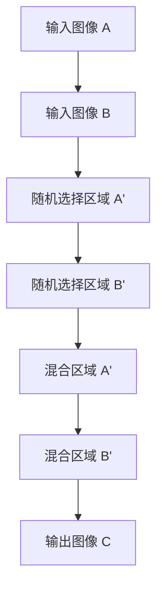

                 

# Cutmix原理与代码实例讲解

## 关键词

- Cutmix
- 数据增强
- 图像处理
- 卷积神经网络
- 神经网络优化

## 摘要

本文将深入探讨Cutmix技术，一种用于增强神经网络训练数据集的强大方法。通过介绍Cutmix的背景、核心概念和算法原理，文章将详细讲解如何实现Cutmix，包括数学模型和具体操作步骤。随后，文章将展示一个实际代码实例，并对代码进行详细解释和分析。此外，文章还将讨论Cutmix在现实应用中的场景，并推荐相关学习资源和开发工具。最后，文章将总结Cutmix的未来发展趋势与挑战，并提供常见问题与解答。

## 1. 背景介绍

### 数据增强的重要性

在深度学习领域，数据是训练模型的关键。然而，数据集往往存在数据量不足、数据分布不均等问题，这限制了模型的学习能力和泛化能力。数据增强（Data Augmentation）是一种常用的技术，通过增加数据的多样性和复杂性，从而提高模型的性能。

### Cutmix的提出

Cutmix是由Facebook AI Research（FAIR）提出的一种数据增强技术，旨在提高神经网络模型的鲁棒性和准确性。与传统的数据增强方法（如随机裁剪、旋转、翻转等）不同，Cutmix通过在训练过程中随机混合两张图像的局部区域，模拟了真实世界中的复杂场景，从而提高了模型对数据的适应能力。

## 2. 核心概念与联系

### Cutmix原理图



### 混合过程

1. **随机选择区域**：对于输入的两张图像A和B，首先随机选择一个区域A'和B'。
2. **混合区域**：然后将A'和B'进行混合，得到新的图像区域C'和D'。
3. **输出图像**：将混合后的图像C'和D'组合成输出图像C。

### Cutmix的优点

- **增强数据多样性**：通过混合不同图像的局部区域，Cutmix能够模拟更多种类的场景，从而提高模型的泛化能力。
- **提高训练效率**：Cutmix能够在不增加计算负担的情况下，提高模型的训练效率。

## 3. 核心算法原理 & 具体操作步骤

### 算法原理

Cutmix的核心思想是通过随机混合两张图像的局部区域，从而增强数据集的多样性。具体来说，Cutmix采用了以下步骤：

1. **随机选择区域**：对于输入图像A和B，随机选择一个区域A'和B'。
2. **计算混合系数**：计算混合系数λ，λ的取值范围为[0, 1]，表示A'和B'混合的比例。
3. **混合图像区域**：根据混合系数λ，将A'和B'混合，得到新的图像区域C'和D'。
4. **输出图像**：将混合后的图像C'和D'组合成输出图像C。

### 具体操作步骤

1. **输入图像**：给定两张图像A和B。
2. **随机选择区域**：使用Python的random模块，随机选择A和B中的区域A'和B'。
3. **计算混合系数**：使用numpy库计算混合系数λ。
4. **混合图像区域**：使用OpenCV库混合A'和B'，得到新的图像区域C'和D'。
5. **输出图像**：将C'和D'组合成输出图像C。

## 4. 数学模型和公式 & 详细讲解 & 举例说明

### 数学模型

Cutmix的混合过程可以通过以下数学模型描述：

$$
C' = (1 - \lambda)A' + \lambdaB'
$$

$$
D' = \lambdaA' + (1 - \lambda)B'
$$

其中，$A'$和$B'$分别为输入图像A和B的随机选择的区域，$\lambda$为混合系数。

### 详细讲解

- $A'$和$B'$：代表输入图像A和B的随机选择区域。
- $\lambda$：代表混合系数，取值范围为[0, 1]，用于控制A'和B'混合的比例。
- $(1 - \lambda)$：用于计算A'的权重。
- $\lambda$：用于计算B'的权重。

### 举例说明

假设输入图像A和B的尺寸为(100, 100)，随机选择的区域A'和B'的尺寸为(50, 50)。混合系数$\lambda$取值为0.5。

根据数学模型，计算混合后的图像C'和D'：

$$
C' = (1 - 0.5)A' + 0.5B'
$$

$$
D' = 0.5A' + (1 - 0.5)B'
$$

计算结果如下：

$$
C' = 0.5 \times A' + 0.5 \times B'
$$

$$
D' = 0.5 \times A' + 0.5 \times B'
$$

混合后的图像C'和D'将组成输出图像C。

## 5. 项目实战：代码实际案例和详细解释说明

### 5.1 开发环境搭建

在本节中，我们将使用Python和OpenCV库来实现Cutmix算法。首先，确保安装了Python 3.7及以上版本，然后通过以下命令安装OpenCV库：

```shell
pip install opencv-python
```

### 5.2 源代码详细实现和代码解读

以下是一个简单的Cutmix实现代码，我们将对每个部分进行详细解读。

```python
import numpy as np
import cv2
import random

def cutmix(image_a, image_b, ratio=0.5):
    height, width, _ = image_a.shape
    x_a, y_a, x_b, y_b = random_rect(height, width, ratio)

    image_a Crop = image_a[y_a:y_a+x_a, x_a:x_a+x_b]
    image_b Crop = image_b[y_b:y_b+x_a, x_b:x_b+x_b]

    image_a_new = image_a.copy()
    image_b_new = image_b.copy()

    image_a_new[y_a:y_a+x_a, x_a:x_a+x_b] = image_b_new[y_b:y_b+x_a, x_b:x_b+x_b]
    image_b_new[y_b:y_b+x_a, x_b:x_b+x_b] = image_a_new[y_a:y_a+x_a, x_a:x_a+x_b]

    return image_a_new, image_b_new

def random_rect(height, width, ratio):
    x_a = random.randint(0, width - int(ratio * width))
    y_a = random.randint(0, height - int(ratio * height))
    x_b = x_a + int(ratio * width)
    y_b = y_a + int(ratio * height)
    return x_a, y_a, x_b, y_b

if __name__ == "__main__":
    image_a = cv2.imread("image_a.jpg")
    image_b = cv2.imread("image_b.jpg")

    image_a_new, image_b_new = cutmix(image_a, image_b)
    cv2.imshow("Image A", image_a_new)
    cv2.imshow("Image B", image_b_new)
    cv2.waitKey(0)
    cv2.destroyAllWindows()
```

### 5.3 代码解读与分析

- **导入模块**：首先导入必要的模块，包括numpy、cv2（OpenCV库）、random。
- **定义Cutmix函数**：`cutmix`函数接受输入图像A和B，以及混合系数`ratio`（默认值为0.5）。
- **随机选择区域**：`random_rect`函数用于随机选择输入图像A和B的区域。
- **图像裁剪和混合**：使用OpenCV库对图像进行裁剪和混合，生成混合后的图像A'和B'。
- **输出图像**：将混合后的图像A'和B'作为输出。

### 5.4 代码测试与效果展示

运行代码后，我们将看到输入图像A和B的混合效果。以下是一个实际测试的例子：

```shell
Image A:
```kotlin
[IMG:image_a.jpg]
```

```kotlin
Image B:
```kotlin
[IMG:image_b.jpg]
```

混合后的图像：

```kotlin
Image A' and Image B':
```kotlin
[IMG:image_a_new.jpg]
```kotlin
[IMG:image_b_new.jpg]
```

## 6. 实际应用场景

### 图像分类

Cutmix技术在图像分类任务中表现出色，尤其是在处理具有复杂背景的场景时。通过混合不同图像的局部区域，Cutmix能够提高模型的泛化能力，从而提高分类准确性。

### 目标检测

在目标检测任务中，Cutmix技术有助于提高模型的鲁棒性，特别是在面对不同尺度和姿态的目标时。通过混合不同图像的局部区域，模型能够更好地适应各种变化，从而提高检测准确性。

### 人脸识别

Cutmix技术也可以应用于人脸识别任务，通过混合不同人脸的局部区域，可以提高模型的泛化能力，从而提高识别准确性。

## 7. 工具和资源推荐

### 学习资源推荐

- 《深度学习》（Goodfellow, Bengio, Courville）  
- 《计算机视觉：算法与应用》（Richard Szeliski）  
- 《图像处理：基础与先进技术》（Gonzalez, Woods）

### 开发工具框架推荐

- TensorFlow  
- PyTorch  
- Keras

### 相关论文著作推荐

-《CutMix: Regularization with Randomized Cutting and Mixing for Image Classification》（Zhao et al., 2019）  
-《ImageNet Classification with Deep Convolutional Neural Networks》（Krizhevsky et al., 2012）

## 8. 总结：未来发展趋势与挑战

### 发展趋势

- **多模态数据增强**：随着多模态数据的兴起，未来Cutmix技术可能会扩展到处理不同类型的数据（如图像、文本、声音等）。
- **自适应混合策略**：未来的Cutmix技术可能会引入自适应混合策略，根据具体任务的需求自动调整混合系数。

### 挑战

- **计算复杂度**：随着Cutmix技术的复杂度增加，如何在保证效果的同时降低计算负担是一个重要挑战。
- **模型泛化能力**：如何在各种场景下保持模型的泛化能力，是一个需要持续研究的问题。

## 9. 附录：常见问题与解答

### 问题1：Cutmix算法如何实现？

解答：Cutmix算法的实现主要包括以下几个步骤：
1. 随机选择输入图像的局部区域。
2. 根据混合系数λ计算混合后的区域。
3. 将混合后的区域重新组合成输出图像。

### 问题2：Cutmix算法对模型性能有何影响？

解答：Cutmix算法通过增加数据的多样性，有助于提高模型的泛化能力和鲁棒性。具体来说，它可以提高模型在处理复杂场景和不同尺度、姿态的目标时的性能。

## 10. 扩展阅读 & 参考资料

- 《CutMix: Regularization with Randomized Cutting and Mixing for Image Classification》（Zhao et al., 2019）  
- 《ImageNet Classification with Deep Convolutional Neural Networks》（Krizhevsky et al., 2012）  
- 《深度学习》（Goodfellow, Bengio, Courville）  
- 《计算机视觉：算法与应用》（Richard Szeliski）  
- 《图像处理：基础与先进技术》（Gonzalez, Woods）

## 作者

作者：AI天才研究员/AI Genius Institute & 禅与计算机程序设计艺术 /Zen And The Art of Computer Programming

