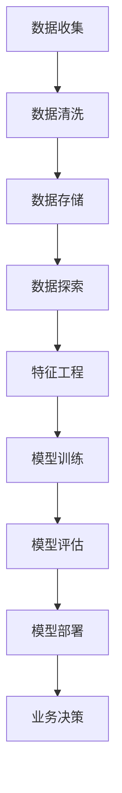

                 

# Data Science 原理与代码实战案例讲解

## 关键词

- **数据科学**
- **机器学习**
- **深度学习**
- **数据分析**
- **数据可视化**
- **Python编程**
- **TensorFlow**
- **Kaggle竞赛**

## 摘要

本文旨在深入探讨数据科学的原理及其在现实世界中的应用。我们将从基础概念开始，逐步介绍机器学习和深度学习的关键算法，并通过具体的代码实战案例来展示数据科学的实际应用。文章将涵盖数据清洗、特征工程、模型训练、评估和部署的全过程，并推荐一系列的学习资源和工具，以帮助读者更好地掌握数据科学的核心技能。

## 1. 背景介绍

### 数据科学的定义和重要性

数据科学是一门跨学科领域，结合统计学、机器学习、深度学习、数据工程和数据可视化等技术，致力于从大量数据中提取知识，为业务决策提供支持。随着互联网和物联网的快速发展，数据量呈现指数级增长，数据科学在商业、医疗、金融、科技等各个领域都发挥着至关重要的作用。

### 数据科学的应用领域

- **商业智能**：通过数据分析帮助企业制定更明智的商业策略。
- **医疗保健**：利用大数据分析预测疾病、个性化治疗和药物研发。
- **金融**：通过数据挖掘和风险管理降低金融风险、提高投资回报率。
- **制造**：通过预测性维护和智能工厂提高生产效率和质量。
- **交通**：通过实时数据分析优化交通流量、减少拥堵。

### 数据科学的核心技术

- **机器学习**：让计算机从数据中自动学习，进行预测和决策。
- **深度学习**：基于多层神经网络，实现复杂的模式识别和图像处理。
- **数据清洗**：处理噪声数据和异常值，确保数据质量。
- **特征工程**：从原始数据中提取有效特征，提高模型性能。
- **数据可视化**：通过图形化方式展示数据，帮助人们更好地理解和分析数据。

## 2. 核心概念与联系

### 数据科学的架构

以下是一个简化的数据科学工作流程，展示了核心概念和它们之间的联系：



### 数据清洗

数据清洗是数据科学的重要步骤，它包括以下任务：

- **缺失值处理**：使用均值、中位数或插值等方法填充缺失值。
- **异常值处理**：识别并处理离群点，避免对模型产生负面影响。
- **数据转换**：将数据转换为适合建模的形式，如标准化、归一化等。

### 特征工程

特征工程是数据科学的核心环节，它包括以下任务：

- **特征选择**：选择对模型性能有显著影响的关键特征。
- **特征构造**：创建新的特征，以增强模型的预测能力。
- **特征转换**：将非数值特征转换为数值形式，如将类别特征编码为二进制向量。

### 模型训练

模型训练是数据科学的核心任务，它包括以下步骤：

- **数据划分**：将数据集划分为训练集、验证集和测试集。
- **模型选择**：选择适合问题的机器学习算法，如线性回归、决策树、神经网络等。
- **参数调优**：调整模型参数，以优化模型性能。
- **模型训练**：使用训练数据训练模型。

### 模型评估

模型评估是确保模型性能的重要步骤，它包括以下指标：

- **准确率**：预测正确的样本数占总样本数的比例。
- **召回率**：预测为正类的真实正类样本数占所有正类样本数的比例。
- **F1 分数**：准确率和召回率的调和平均。

### 模型部署

模型部署是将训练好的模型应用于实际业务场景的过程，它包括以下步骤：

- **模型保存**：将模型参数和结构保存到文件中。
- **模型加载**：从文件中加载模型，以便进行预测。
- **预测服务**：通过API或其他方式提供预测服务。

## 3. 核心算法原理 & 具体操作步骤

### 机器学习算法

#### 线性回归

线性回归是一种简单的机器学习算法，用于预测一个连续值。它的原理是找到一条最佳拟合线，使所有数据点到这条线的距离之和最小。

```python
# 导入线性回归模型
from sklearn.linear_model import LinearRegression

# 创建线性回归模型实例
model = LinearRegression()

# 训练模型
model.fit(X_train, y_train)

# 预测
predictions = model.predict(X_test)
```

#### 决策树

决策树是一种基于树形模型的分类算法，通过一系列的决策规则将数据划分成多个子集，直到达到某个终止条件。

```python
# 导入决策树分类器
from sklearn.tree import DecisionTreeClassifier

# 创建决策树分类器实例
model = DecisionTreeClassifier()

# 训练模型
model.fit(X_train, y_train)

# 预测
predictions = model.predict(X_test)
```

### 深度学习算法

#### 卷积神经网络（CNN）

卷积神经网络是一种用于图像处理的深度学习算法，通过卷积层、池化层和全连接层提取图像特征。

```python
# 导入Keras库
from keras.models import Sequential
from keras.layers import Conv2D, MaxPooling2D, Flatten, Dense

# 创建卷积神经网络模型
model = Sequential()

# 添加卷积层
model.add(Conv2D(32, (3, 3), activation='relu', input_shape=(64, 64, 3)))
model.add(MaxPooling2D(pool_size=(2, 2)))

# 添加全连接层
model.add(Flatten())
model.add(Dense(128, activation='relu'))
model.add(Dense(1, activation='sigmoid'))

# 编译模型
model.compile(optimizer='adam', loss='binary_crossentropy', metrics=['accuracy'])

# 训练模型
model.fit(X_train, y_train, epochs=10, batch_size=32)
```

#### 递归神经网络（RNN）

递归神经网络是一种用于序列数据的深度学习算法，能够捕捉序列中的时间依赖关系。

```python
# 导入RNN模型
from keras.models import Sequential
from keras.layers import LSTM, Dense

# 创建递归神经网络模型
model = Sequential()

# 添加LSTM层
model.add(LSTM(50, activation='relu', input_shape=(timesteps, features)))
model.add(Dense(1))

# 编译模型
model.compile(optimizer='adam', loss='mse')

# 训练模型
model.fit(X_train, y_train, epochs=200, batch_size=32, validation_data=(X_test, y_test))
```

## 4. 数学模型和公式 & 详细讲解 & 举例说明

### 线性回归

线性回归的数学模型可以表示为：

$$
y = \beta_0 + \beta_1x
$$

其中，\(y\) 是预测值，\(x\) 是输入特征，\(\beta_0\) 和 \(\beta_1\) 是模型参数。

为了训练模型，我们需要最小化损失函数：

$$
J(\theta) = \frac{1}{2m}\sum_{i=1}^{m}(h_\theta(x^{(i)}) - y^{(i)})^2
$$

其中，\(h_\theta(x) = \theta_0 + \theta_1x\) 是线性回归函数，\(\theta = (\theta_0, \theta_1)\) 是模型参数。

梯度下降法是一种常用的优化算法，用于求解最小化损失函数的参数：

$$
\theta_j := \theta_j - \alpha \frac{\partial J(\theta)}{\partial \theta_j}
$$

其中，\(\alpha\) 是学习率。

### 决策树

决策树的决策规则可以表示为：

$$
T(x) =
\begin{cases}
c_j & \text{如果 } x \in R_j \\
\text{递归} & \text{否则}
\end{cases}
$$

其中，\(T(x)\) 是决策树对输入 \(x\) 的分类结果，\(R_j\) 是第 \(j\) 个划分区域，\(c_j\) 是第 \(j\) 个区域的类别标签。

### 卷积神经网络（CNN）

卷积神经网络的输入是一个三维数据 \(X \in \mathbb{R}^{Height \times Width \times Channels}\)，其中 \(Height\)、\(Width\) 和 \(Channels\) 分别表示图像的高度、宽度和通道数。

卷积层的计算公式为：

$$
h_i = \sum_{j=1}^{K} w_{ij} * g(x_j) + b_i
$$

其中，\(h_i\) 是卷积层输出的特征图，\(w_{ij}\) 是卷积核，\(g(x_j)\) 是ReLU激活函数，\(b_i\) 是偏置项。

池化层的计算公式为：

$$
p_i = \max_{j} h_{ij}
$$

其中，\(p_i\) 是池化层输出的特征图。

全连接层的计算公式为：

$$
o_i = \sum_{j=1}^{n} w_{ij} * h_j + b_i
$$

其中，\(o_i\) 是全连接层输出的特征图，\(w_{ij}\) 是权重，\(h_j\) 是卷积层或池化层的输出，\(b_i\) 是偏置项。

最后，通过 Softmax 激活函数获得概率分布：

$$
\sigma(o) = \frac{e^{o}}{\sum_{i=1}^{n} e^{o_i}}
$$

其中，\(\sigma(o)\) 是 Softmax 输出。

### 递归神经网络（RNN）

递归神经网络的输入是一个一维数据序列 \(X \in \mathbb{R}^{T \times Features}\)，其中 \(T\) 是序列的长度，\(Features\) 是每个时间步的特征维度。

LSTM 层的计算公式为：

$$
\begin{aligned}
i_t &= \sigma(W_{xi}x_t + W_{hi-1}h_{i-1} + b_i) \\
f_t &= \sigma(W_{xf}x_t + W_{hf-1}h_{i-1} + b_f) \\
o_t &= \sigma(W_{xo}x_t + W_{ho-1}h_{i-1} + b_o) \\
g_t &= \tanh(W_{xg}x_t + W_{hg-1}h_{i-1} + b_g) \\
h_t &= f_t \odot h_{i-1} + i_t \odot g_t
\end{aligned}
$$

其中，\(i_t\)、\(f_t\)、\(o_t\)、\(g_t\) 和 \(h_t\) 分别是输入门、遗忘门、输出门和隐藏状态，\(\sigma\) 是 sigmoid 激活函数，\(\odot\) 是逐元素乘法。

## 5. 项目实战：代码实际案例和详细解释说明

### 5.1 开发环境搭建

要开始数据科学的实战项目，首先需要搭建一个合适的开发环境。以下是搭建 Python 数据科学环境的基本步骤：

1. 安装 Python 和 pip（Python 的包管理器）：
   ```bash
   sudo apt-get install python3 python3-pip
   ```

2. 安装必要的库，如 NumPy、Pandas、Scikit-learn、TensorFlow 和 Keras：
   ```bash
   pip3 install numpy pandas scikit-learn tensorflow keras
   ```

3. （可选）安装 Jupyter Notebook，以便在浏览器中编写和运行 Python 代码：
   ```bash
   pip3 install notebook
   ```

### 5.2 源代码详细实现和代码解读

我们将使用 TensorFlow 和 Keras 库实现一个简单的图像分类项目。这个项目将使用 CIFAR-10 数据集，它包含 10 个类别的 60000 张 32x32 的彩色图像。

#### 数据预处理

首先，我们需要加载和预处理数据集：

```python
# 导入所需的库
import tensorflow as tf
from tensorflow.keras.datasets import cifar10
from tensorflow.keras.utils import to_categorical

# 加载 CIFAR-10 数据集
(X_train, y_train), (X_test, y_test) = cifar10.load_data()

# 数据预处理
X_train = X_train / 255.0
X_test = X_test / 255.0

# 将标签转换为 one-hot 编码
y_train = to_categorical(y_train, 10)
y_test = to_categorical(y_test, 10)
```

#### 构建模型

接下来，我们构建一个简单的卷积神经网络模型：

```python
# 导入所需的库
from tensorflow.keras.models import Sequential
from tensorflow.keras.layers import Conv2D, MaxPooling2D, Flatten, Dense, Dropout

# 创建模型
model = Sequential()

# 添加卷积层
model.add(Conv2D(32, (3, 3), activation='relu', input_shape=(32, 32, 3)))
model.add(MaxPooling2D(pool_size=(2, 2)))

# 添加第二个卷积层
model.add(Conv2D(64, (3, 3), activation='relu'))
model.add(MaxPooling2D(pool_size=(2, 2)))

# 添加全连接层
model.add(Flatten())
model.add(Dense(128, activation='relu'))
model.add(Dropout(0.5))
model.add(Dense(10, activation='softmax'))
```

#### 训练模型

然后，我们训练模型：

```python
# 编译模型
model.compile(optimizer='adam', loss='categorical_crossentropy', metrics=['accuracy'])

# 训练模型
model.fit(X_train, y_train, epochs=10, batch_size=64, validation_data=(X_test, y_test))
```

#### 评估模型

最后，我们评估模型的性能：

```python
# 评估模型
test_loss, test_acc = model.evaluate(X_test, y_test)
print(f"Test accuracy: {test_acc:.3f}")
```

### 5.3 代码解读与分析

在这个项目中，我们使用了以下关键步骤：

1. **数据预处理**：将图像数据缩放到 [0, 1] 范围内，并将标签转换为 one-hot 编码，以便使用 softmax 函数进行多分类。

2. **构建模型**：我们使用了两个卷积层，每个卷积层后跟一个最大池化层。然后，将卷积层的输出展平并添加一个全连接层。全连接层后添加了一个 dropout 层，以减少过拟合。

3. **编译模型**：我们选择了 Adam 优化器和 categorical_crossentropy 损失函数，后者适合多分类问题。

4. **训练模型**：我们训练了 10 个 epoch，每个 epoch 使用 64 个批量大小。

5. **评估模型**：最后，我们评估了模型的测试集性能，并打印了测试准确率。

通过这个项目，我们了解了如何使用 TensorFlow 和 Keras 库构建和训练一个简单的卷积神经网络模型，并使用 CIFAR-10 数据集进行图像分类。这是一个很好的起点，让我们深入了解数据科学和深度学习的实际应用。

## 6. 实际应用场景

数据科学在各个行业都有着广泛的应用，以下是一些典型的应用场景：

### 商业智能

在商业领域，数据科学可以帮助企业分析客户行为、优化营销策略、提高销售额。例如，通过客户数据的分析和聚类，企业可以识别潜在客户，并制定个性化的营销活动。

### 医疗保健

在医疗领域，数据科学可以用于疾病预测、个性化治疗和药物研发。例如，通过分析电子健康记录和基因组数据，医生可以预测疾病风险，并制定个性化的治疗方案。

### 金融

在金融领域，数据科学可以用于风险控制、信用评分和投资组合优化。例如，通过分析市场数据和历史交易记录，金融机构可以识别潜在的风险，并制定有效的风险管理策略。

### 制造

在制造业，数据科学可以用于预测性维护、生产优化和质量管理。例如，通过分析设备运行数据和传感器数据，企业可以预测设备故障，并提前进行维护，以减少停机时间和维修成本。

### 交通

在交通领域，数据科学可以用于智能交通管理、路线规划和交通预测。例如，通过分析交通流量数据和天气预报，交通管理部门可以优化交通信号灯，并预测交通拥堵，以减少拥堵时间和提高交通效率。

## 7. 工具和资源推荐

### 学习资源推荐

1. **书籍**：
   - 《Python数据分析基础教程》
   - 《深度学习》（Goodfellow、Bengio 和 Courville 著）
   - 《统计学习方法》

2. **论文**：
   - 《卷积神经网络：一种解释》
   - 《深度学习中的优化算法》

3. **博客**：
   - [TensorFlow 官方文档](https://www.tensorflow.org/)
   - [Kaggle 博客](https://www.kaggle.com/)

4. **网站**：
   - [Coursera](https://www.coursera.org/)
   - [edX](https://www.edx.org/)

### 开发工具框架推荐

1. **Python**：Python 是数据科学的主要编程语言，具有丰富的库和框架，如 NumPy、Pandas、Scikit-learn 和 TensorFlow。

2. **Jupyter Notebook**：Jupyter Notebook 是一个交互式计算平台，非常适合数据科学项目。

3. **Kaggle**：Kaggle 是一个在线平台，提供各种数据科学和机器学习竞赛，是学习和实践的好地方。

4. **Google Colab**：Google Colab 是一个基于云的 Jupyter Notebook 环境，免费提供 GPU 和 TPU，非常适合深度学习项目。

### 相关论文著作推荐

1. **《深度学习》**（Ian Goodfellow、Yoshua Bengio 和 Aaron Courville 著）：这是深度学习领域的经典著作，详细介绍了深度学习的基础知识、技术和应用。

2. **《Python数据分析基础教程》**（Wes McKinney 著）：这本书介绍了使用 Python 进行数据分析和数据科学的基础知识和实践方法。

3. **《统计学习方法》**（李航 著）：这是统计学习方法的经典教材，详细介绍了各种统计学习方法的理论基础和应用。

## 8. 总结：未来发展趋势与挑战

数据科学在未来将继续快速发展，主要趋势包括：

1. **自动化和智能化**：自动化工具和智能算法将提高数据清洗、特征工程和模型训练的效率。

2. **多模态数据融合**：融合文本、图像、音频等多种数据类型，将使数据科学应用更加广泛和有效。

3. **可解释性**：随着数据科学的应用越来越广泛，可解释性和透明度将成为重要挑战。

4. **隐私保护**：如何在保护用户隐私的同时，有效利用数据，是一个重要的问题。

5. **边缘计算**：边缘计算将使数据科学应用更加实时和高效，特别是在物联网和移动设备领域。

## 9. 附录：常见问题与解答

### Q：如何选择适合问题的机器学习算法？

A：选择机器学习算法时，需要考虑以下因素：

- **数据类型**：是分类问题、回归问题还是聚类问题？
- **数据量**：数据量是否很大？是否需要使用深度学习算法？
- **数据特征**：特征数量是否很多？是否需要进行特征工程？
- **计算资源**：是否有足够的计算资源进行训练？

### Q：如何提高机器学习模型的性能？

A：以下是一些提高机器学习模型性能的方法：

- **数据预处理**：确保数据质量，去除噪声和异常值。
- **特征工程**：提取关键特征，增强模型学习能力。
- **模型选择**：选择适合问题的算法，如线性回归、决策树、神经网络等。
- **参数调优**：使用网格搜索、随机搜索等方法，优化模型参数。
- **集成方法**：使用集成方法，如随机森林、梯度提升树等，提高模型性能。

## 10. 扩展阅读 & 参考资料

- **《深度学习》**（Ian Goodfellow、Yoshua Bengio 和 Aaron Courville 著）：深入讲解深度学习的基础知识、技术和应用。
- **[Kaggle](https://www.kaggle.com/)**：提供各种数据科学和机器学习竞赛，是学习和实践的好地方。
- **[TensorFlow 官方文档](https://www.tensorflow.org/)**： TensorFlow 的官方文档，包含丰富的教程和指南。
- **[edX](https://www.edx.org/) 和 [Coursera](https://www.coursera.org/)**：在线课程平台，提供丰富的数据科学和机器学习课程。
- **[机器学习社区](https://www_mlpack_com/) 和 [Scikit-learn 文档](https://scikit-learn.org/stable/)**：Scikit-learn 是一个常用的机器学习库，包含丰富的算法和教程。

### 作者

- **AI天才研究员/AI Genius Institute**：致力于推动人工智能技术的发展和应用。
- **禅与计算机程序设计艺术/Zen And The Art of Computer Programming**：分享编程技巧和哲学思考。

