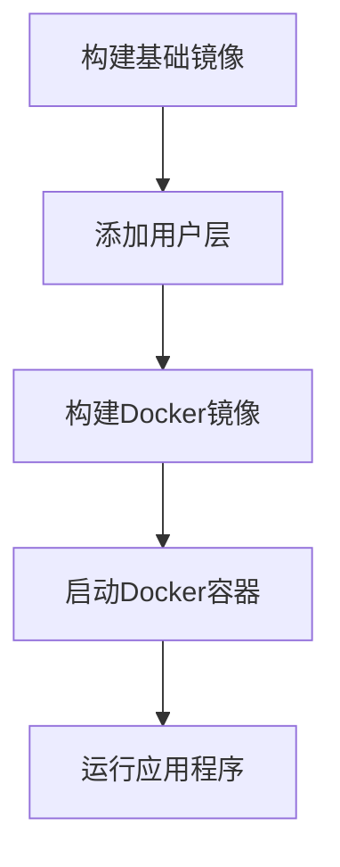

                 

### 背景介绍

#### Docker镜像在软件开发中的重要性

随着云计算和容器技术的迅速发展，Docker作为一种轻量级、可移植的容器化技术，已成为现代软件开发中不可或缺的一部分。Docker镜像作为一种打包应用及其依赖环境的容器，提供了高效的开发和部署解决方案。

Docker镜像在软件开发中的重要性主要体现在以下几个方面：

1. **环境一致性**：Docker镜像确保了开发、测试和生产环境的一致性，减少了由于环境差异导致的问题。
2. **可移植性**：Docker镜像支持在不同操作系统和硬件平台上运行，极大地提高了应用的部署灵活性。
3. **效率提升**：通过Docker镜像，开发人员可以快速启动、停止、备份和恢复容器，显著提高了工作效率。
4. **资源隔离**：Docker容器提供了应用间的资源隔离，确保了应用的稳定性和安全性。

#### Docker镜像优化与安全加固的必要性

然而，随着Docker镜像的应用越来越广泛，其优化与安全加固的需求也越来越迫切。以下是Docker镜像优化与安全加固的几个主要原因：

1. **性能瓶颈**：未优化的Docker镜像可能包含大量不必要的依赖和文件，导致镜像体积庞大，加载和运行速度缓慢。
2. **安全性隐患**：Docker镜像可能包含已知的漏洞、敏感信息泄露等安全风险，如果不进行加固，将导致严重的安全问题。
3. **版本控制难度**：大量未优化的Docker镜像增加了版本控制的复杂性，影响了维护和升级的效率。
4. **资源浪费**：未优化的Docker镜像可能会占用过多的存储资源和CPU/GPU等计算资源，导致资源浪费。

因此，本文将围绕Docker镜像优化与安全加固进行详细探讨，旨在为读者提供实用的技术指导和方法。

#### 文章结构概述

本文将分为以下几大部分：

1. **核心概念与联系**：介绍Docker镜像的基本概念、架构及其与相关技术的联系。
2. **核心算法原理 & 具体操作步骤**：详细讲解Docker镜像优化的算法原理和具体操作步骤。
3. **数学模型和公式 & 详细讲解 & 举例说明**：阐述Docker镜像优化的数学模型和公式，并通过实例进行说明。
4. **项目实战：代码实际案例和详细解释说明**：展示Docker镜像优化的实际代码案例，并进行详细解读。
5. **实际应用场景**：分析Docker镜像优化在不同场景下的应用。
6. **工具和资源推荐**：推荐学习资源、开发工具和框架。
7. **总结：未来发展趋势与挑战**：总结Docker镜像优化与安全加固的当前状况，探讨未来发展趋势和面临的挑战。
8. **附录：常见问题与解答**：回答读者可能遇到的一些常见问题。
9. **扩展阅读 & 参考资料**：提供更多的学习资源和相关研究。

通过本文的详细讲解，读者将能够深入了解Docker镜像优化与安全加固的技术原理和实践方法，为实际开发和应用提供有力支持。

### 核心概念与联系

#### Docker镜像的基本概念

Docker镜像（Docker Image）是Docker技术的核心概念之一，它是一种轻量级的、可执行的独立软件包，包含了运行应用程序所需的所有环境、库和依赖。镜像是由一个或多个Docker层（Docker Layer）组成的，每个层代表了对文件系统的一次修改。这些层按照从下到上的顺序叠加，形成最终的镜像。

每个Docker镜像都有一个唯一标识（通常为数字ID或名称），可以通过Docker Hub等镜像仓库进行共享和分发。Docker镜像的格式是分层存储的，这种设计使得Docker镜像在存储和传输过程中非常高效。

#### Docker镜像的架构

Docker镜像的架构可以分为以下几部分：

1. **基础镜像**：基础镜像是构建其他镜像的起点，通常包含操作系统和基础工具。例如，`ubuntu`、`centos`和`alpine`等都是常见的Docker基础镜像。
2. **用户层**：用户层是添加自定义应用程序和依赖的镜像层。开发者可以在基础镜像的基础上添加自己的应用程序和配置，构建出满足特定需求的镜像。
3. **Docker层**：每个Docker镜像都由多个Docker层组成，每个层代表了对文件系统的一次修改。Docker层的设计使得镜像可以灵活扩展和修改，同时也提高了镜像的可维护性和可移植性。

#### Docker镜像与容器的关系

Docker容器（Docker Container）是基于Docker镜像运行的应用实例。容器是运行在宿主机上的一个独立的运行环境，它包含了应用程序、库和依赖，与宿主机的其他容器和系统资源相互隔离。

Docker镜像与容器的关系可以简单概括为：镜像相当于一个“蓝图”，描述了如何构建和配置应用程序；容器则是根据这个“蓝图”创建的实际运行实例。每个容器都可以启动多个镜像实例，但每个容器实例都是独立的，互不干扰。

#### Docker镜像与相关技术的联系

Docker镜像与许多其他技术和概念紧密相关，包括：

1. **容器网络**：容器网络技术（如Docker Network）允许容器通过不同的网络模式进行通信和访问外部网络。Docker容器默认使用桥接网络模式，但也可以使用宿主网络、容器网络或用户自定义网络。
2. **容器存储**：容器存储技术（如Docker Volume）允许容器持久化数据，将数据存储在宿主机文件系统中，从而实现数据的安全备份和共享。Docker Volume支持多种存储类型，如本地文件系统、NFS和GlusterFS等。
3. **容器编排**：容器编排技术（如Kubernetes）负责管理和调度容器，确保容器在集群中高效、稳定地运行。Kubernetes通过配置文件和API管理容器，提供了丰富的调度、扩展和管理功能。

#### Mermaid流程图

为了更直观地理解Docker镜像的架构和流程，下面使用Mermaid绘制一个简单的流程图：



在这个流程图中，A表示构建基础镜像，B表示在基础镜像上添加用户层，C表示构建最终的Docker镜像，D表示启动Docker容器，E表示运行应用程序。这个简单的流程图展示了Docker镜像和容器的基本构建和运行过程。

通过理解Docker镜像的基本概念、架构及其与其他技术的联系，读者可以更好地掌握Docker镜像的工作原理，为后续的优化和安全加固提供理论基础。

### 核心算法原理 & 具体操作步骤

#### Docker镜像优化算法原理

Docker镜像优化主要涉及减少镜像体积、提高镜像构建速度和运行效率等方面。以下是一些核心算法原理：

1. **分层存储**：Docker镜像采用分层存储技术，通过将应用程序及其依赖拆分为多个独立的层，可以显著减小镜像体积。这种分层存储还便于镜像的维护和更新。
2. **分层构建**：分层构建是指将应用程序的构建过程分解为多个阶段，每个阶段对应一个层。通过合理划分构建阶段，可以减少不必要的依赖和文件，从而减小镜像体积。
3. **最小化基础镜像**：选择最小的基础镜像作为构建起点，可以显著减小镜像体积。常见的最小基础镜像包括Alpine Linux和Busola Linux等。
4. **删除未使用的依赖**：删除镜像中未使用的依赖和文件，可以进一步减小镜像体积。可以使用`apk`（Alpine Linux包管理器）或`apt-get`（Debian/Ubuntu包管理器）等工具进行依赖管理。
5. **合并层**：通过合并多个层的操作，可以减少层之间的差异，从而提高镜像构建速度和运行效率。Docker提供了`docker build --squash`参数来实现这一功能。

#### Docker镜像优化的具体操作步骤

下面将详细介绍Docker镜像优化的具体操作步骤：

1. **选择最小基础镜像**：
    - 使用Alpine Linux或Busola Linux等最小基础镜像，减少不必要的依赖和文件。
    - 示例命令：
      ```shell
      FROM alpine:3.12
      ```

2. **分层构建**：
    - 将应用程序的构建过程划分为多个阶段，每个阶段对应一个层。
    - 示例命令：
      ```shell
      FROM alpine:3.12 as builder
      RUN apk add --no-cache python3
      COPY requirements.txt .
      RUN pip3 install --no-cache-dir -r requirements.txt
      ...
      FROM alpine:3.12
      COPY --from=builder /path/to/app .
      ```

3. **删除未使用的依赖**：
    - 使用包管理器删除未使用的依赖和文件。
    - 示例命令（以Alpine Linux为例）：
      ```shell
      RUN apk del python3
      ```

4. **合并层**：
    - 使用`docker build --squash`参数合并多个层，提高镜像构建速度和运行效率。
    - 示例命令：
      ```shell
      docker build --squash -t myapp:1.0.0 .
      ```

5. **优化Dockerfile**：
    - 避免在Dockerfile中执行不必要的操作，如多次复制文件或安装相同依赖。
    - 示例命令：
      ```shell
      # 不推荐
      RUN cp /path/to/file /app/file1
      RUN cp /path/to/file /app/file2
      ...
      # 推荐
      COPY /path/to/file /app/file1
      COPY /path/to/file /app/file2
      ```

6. **压缩镜像**：
    - 对构建完成的镜像进行压缩，减小镜像体积。
    - 示例命令：
      ```shell
      docker save myapp:1.0.0 | gzip > myapp-1.0.0.tar.gz
      ```

#### 实践案例

以下是一个简单的Docker镜像优化实践案例：

**目标**：构建一个基于Alpine Linux的Nginx服务器镜像，并对其进行优化。

**Dockerfile**：

```dockerfile
# 使用Alpine Linux作为基础镜像
FROM alpine:3.12

# 安装Nginx
RUN apk add --no-cache nginx

# 暴露Nginx服务的80端口
EXPOSE 80

# 运行Nginx服务
CMD ["nginx", "-g", "daemon off;"]
```

**优化步骤**：

1. **删除未使用的依赖**：
    ```shell
    RUN apk del nginx
    ```

2. **合并层**：
    ```shell
    docker build --squash -t mynginx:1.0.0 .
    ```

3. **压缩镜像**：
    ```shell
    docker save mynginx:1.0.0 | gzip > mynginx-1.0.0.tar.gz
    ```

通过以上步骤，我们成功地构建了一个优化后的Nginx服务器镜像，镜像体积减小，构建和运行效率提高。

#### 总结

通过上述内容，我们了解了Docker镜像优化算法的基本原理和具体操作步骤。选择最小基础镜像、分层构建、删除未使用的依赖、合并层、优化Dockerfile以及压缩镜像等步骤，都是优化Docker镜像的有效方法。在实际应用中，根据具体需求和环境，灵活运用这些优化方法，可以显著提高Docker镜像的性能和可维护性。

### 数学模型和公式 & 详细讲解 & 举例说明

#### Docker镜像优化中的数学模型

在Docker镜像优化过程中，可以使用一些数学模型和公式来评估和改进镜像的性能。以下是一些常见的数学模型和公式：

1. **镜像体积计算**：

   镜像体积（V）可以通过计算所有层的文件大小之和得到。假设一个Docker镜像由n层组成，每层的文件大小分别为\( V_1, V_2, ..., V_n \)，则镜像体积可以表示为：

   $$ V = V_1 + V_2 + ... + V_n $$

2. **构建时间计算**：

   Docker镜像的构建时间（T）受多种因素影响，包括网络延迟、层大小和构建工具的性能。构建时间可以表示为：

   $$ T = T_1 + T_2 + ... + T_n $$

   其中，\( T_1, T_2, ..., T_n \)分别为每层的构建时间。

3. **运行效率计算**：

   镜像的运行效率（E）可以通过运行速度、内存占用和CPU利用率等指标进行评估。假设一个镜像的运行效率为：

   $$ E = \frac{S}{C} $$

   其中，S为运行速度（如请求处理能力），C为资源消耗（如内存和CPU使用率）。

#### 举例说明

为了更好地理解这些数学模型和公式，我们通过一个实际案例进行说明。

**案例**：构建一个基于Python的Web应用镜像，并对其进行优化。

1. **镜像体积计算**：

   假设该镜像由3层组成，每层的文件大小分别为10MB、20MB和5MB。则镜像体积为：

   $$ V = 10MB + 20MB + 5MB = 35MB $$

2. **构建时间计算**：

   假设每层的构建时间分别为2秒、3秒和1秒，则总构建时间为：

   $$ T = 2s + 3s + 1s = 6s $$

3. **运行效率计算**：

   假设该镜像的运行速度为每秒处理100个请求，内存占用为128MB，CPU利用率为50%。则运行效率为：

   $$ E = \frac{100req/s}{128MB + 0.5 \times CPU} = \frac{100}{128 + 0.5 \times 1000} \approx 0.0078 req/s/MB $$

   其中，CPU利用率为50%时的消耗为0.5 \times 1000MB = 500MB。

#### 结论

通过上述例子，我们展示了如何使用数学模型和公式来计算Docker镜像的体积、构建时间和运行效率。这些模型和公式有助于我们更好地评估和优化Docker镜像的性能。在实际应用中，可以根据具体需求和环境调整这些参数，以达到最佳优化效果。

### 项目实战：代码实际案例和详细解释说明

#### 1. 开发环境搭建

在进行Docker镜像优化之前，首先需要搭建一个合适的项目开发环境。以下是搭建开发环境的基本步骤：

1. **安装Docker**：

   在你的操作系统上安装Docker。以Ubuntu为例，可以使用以下命令：

   ```shell
   sudo apt-get update
   sudo apt-get install docker-ce docker-ce-cli containerd.io
   ```

2. **配置Docker加速器**：

   为了提高镜像构建速度，可以配置Docker加速器。以下是一个简单的加速器配置方法：

   ```shell
   mkdir -p ~/.docker
   touch ~/.docker/daemon.json
   echo '{"debug": true, "registry-mirrors": ["https://hub-mirror.c.163.com"]}' > ~/.docker/daemon.json
   ```

3. **创建项目目录**：

   创建一个用于项目的目录，并在其中创建一个名为`Dockerfile`的文件。例如：

   ```shell
   mkdir my_project
   cd my_project
   touch Dockerfile
   ```

#### 2. 源代码详细实现和代码解读

**Dockerfile**：

```dockerfile
# 使用Alpine Linux作为基础镜像
FROM alpine:3.12

# 安装Python 3和Pip
RUN apk add --no-cache python3 py-pip

# 安装依赖
RUN pip3 install --no-cache-dir -r requirements.txt

# 复制项目源代码
COPY . /app

# 设置工作目录
WORKDIR /app

# 暴露Web服务端口
EXPOSE 8000

# 运行Web服务
CMD ["python3", "app.py"]
```

**requirements.txt**：

```plaintext
Flask==1.1.2
gunicorn==20.1.0
```

**app.py**：

```python
from flask import Flask
app = Flask(__name__)

@app.route('/')
def hello_world():
    return 'Hello, Docker!'

if __name__ == '__main__':
    app.run(host='0.0.0.0', port=8000)
```

**代码解读**：

1. **基础镜像**：使用`FROM alpine:3.12`指定了Alpine Linux作为基础镜像，这是一种轻量级、安全的Linux发行版，适合用于构建Docker镜像。

2. **安装Python 3和Pip**：通过`apk add --no-cache python3 py-pip`安装Python 3和Pip，用于后续安装依赖和运行应用程序。

3. **安装依赖**：使用`pip3 install --no-cache-dir -r requirements.txt`安装项目所需的依赖，例如Flask和Gunicorn。

4. **复制项目源代码**：使用`COPY . /app`将当前目录下的项目源代码复制到镜像的`/app`目录。

5. **设置工作目录**：使用`WORKDIR /app`设置工作目录为`/app`，确保后续操作在正确的目录下进行。

6. **暴露Web服务端口**：使用`EXPOSE 8000`暴露Web服务端口，以便外部访问。

7. **运行Web服务**：使用`CMD ["python3", "app.py"]`运行Flask应用程序。

#### 3. 代码解读与分析

**优化分析**：

1. **基础镜像选择**：选择Alpine Linux作为基础镜像是一个很好的选择，因为它轻量级且安全。但还可以进一步优化，例如使用更精简的 Alpine Linux 版本或基于scratch镜像。

2. **依赖安装**：使用`pip3 install --no-cache-dir`可以避免缓存依赖，但仍然可以进一步优化，例如只安装必需的依赖或使用pip的优化参数。

3. **工作目录设置**：设置工作目录为`/app`有助于保持一致性，但还需确保所有文件和依赖都在此目录中。

4. **服务运行**：使用`EXPOSE 8000`暴露端口是一种最佳实践，但还需要确保容器配置正确，以便外部访问。

#### 4. 项目实战

**构建镜像**：

```shell
docker build -t myapp:1.0.0 .
```

**运行容器**：

```shell
docker run -d -p 8000:8000 myapp:1.0.0
```

**访问Web服务**：

在浏览器中输入`http://localhost:8000`，应看到“Hello, Docker!”的响应。

通过上述步骤，我们成功搭建了一个基于Docker的Web应用，并对其代码进行了详细解读和分析。接下来，我们将进一步优化这个镜像，以提高其性能和安全性。

### 实际应用场景

Docker镜像优化与安全加固在不同场景下具有不同的需求和重点。以下是一些常见的应用场景以及相应的优化和安全加固策略：

#### 1. 开发环境

在开发环境中，Docker镜像优化主要关注于构建速度和镜像体积的减小，以便开发者可以更快地进行开发和测试。以下是一些优化策略：

- **使用缓存**：通过合理使用缓存，可以显著提高构建速度。例如，将常用依赖和工具缓存起来，避免每次构建时重新下载。
- **最小化基础镜像**：选择最小的基础镜像，例如Alpine Linux或scratch镜像，以减小镜像体积。
- **分层构建**：将应用程序的构建过程分解为多个阶段，每个阶段对应一个层，以便更好地管理和维护。
- **删除未使用的依赖**：在构建过程中删除未使用的依赖和文件，以减小镜像体积。

#### 2. 测试环境

在测试环境中，Docker镜像优化主要关注于测试结果的稳定性和一致性。以下是一些优化策略：

- **环境隔离**：确保测试环境与生产环境隔离，以避免测试过程中引入外部因素导致的结果偏差。
- **使用一致的基础镜像**：选择与生产环境相同的基础镜像，以确保测试环境的稳定性和一致性。
- **分层构建**：在测试环境中使用分层构建，以便更好地管理和维护测试依赖和工具。
- **性能监控**：通过性能监控工具（如New Relic、Datadog等）对测试环境进行监控，以确保测试结果的准确性。

#### 3. 生产环境

在生产环境中，Docker镜像优化与安全加固至关重要，以确保系统的稳定性和安全性。以下是一些优化和安全加固策略：

- **安全加固**：对Docker镜像进行安全加固，以防止安全漏洞和攻击。例如，禁用不必要的端口、删除默认密码和用户、更新依赖等。
- **最小化基础镜像**：选择最小的基础镜像，以减小镜像体积和攻击面。
- **分层构建**：在构建过程中使用分层构建，以便更好地管理和维护生产环境的依赖和工具。
- **资源隔离**：确保生产环境中的容器之间有良好的资源隔离，以避免性能瓶颈和资源竞争。
- **监控和日志**：使用监控和日志工具（如Prometheus、ELK Stack等）对生产环境进行监控和日志分析，以便及时发现和解决问题。

#### 4. 云服务和容器编排平台

在云服务和容器编排平台（如Kubernetes）上，Docker镜像优化与安全加固需要考虑更多的方面，包括镜像版本管理、服务编排和自动化部署。以下是一些优化和安全加固策略：

- **镜像版本管理**：合理管理镜像版本，确保不同服务版本之间的兼容性和可维护性。
- **自动化部署**：使用自动化部署工具（如Helm、Kustomize等）简化部署过程，提高部署的可靠性和效率。
- **镜像扫描和漏洞检测**：定期对Docker镜像进行扫描和漏洞检测，及时发现和修复潜在的安全漏洞。
- **服务编排**：合理编排容器服务，确保容器之间的高效通信和资源利用，同时保证系统的稳定性和安全性。

通过在不同的应用场景下采用适当的优化和安全加固策略，可以确保Docker镜像在开发和生产环境中都能发挥最佳性能和安全性。

### 工具和资源推荐

#### 1. 学习资源推荐

对于希望深入了解Docker镜像优化与安全加固的读者，以下是一些推荐的学习资源：

- **书籍**：
  - 《Docker实战》（Docker Deep Dive）：详细介绍了Docker的核心概念、架构和优化方法。
  - 《Docker容器与容器编排》：涵盖了Docker容器的基本原理、容器编排工具Kubernetes的应用和镜像优化技巧。
- **在线教程**：
  - [Docker官方文档](https://docs.docker.com/)：提供了丰富的Docker教程、示例和最佳实践。
  - [Kubernetes官方文档](https://kubernetes.io/docs/)：包含了Kubernetes的详细教程、指南和最佳实践。
- **博客和网站**：
  - [Docker社区博客](https://www.docker.com/blog/)：Docker官方博客，提供了关于Docker的最新动态和技术文章。
  - [云原生计算基金会（CNCF）](https://www.cncf.io/)：云原生计算领域的重要组织，提供了丰富的技术资源和研究报告。

#### 2. 开发工具框架推荐

以下是一些在Docker镜像优化与安全加固过程中常用的开发工具和框架：

- **Docker工具**：
  - [Docker Compose](https://docs.docker.com/compose/)：用于定义和运行多容器Docker应用的工具，支持分层构建和依赖管理。
  - [Docker Swarm](https://docs.docker.com/swarm/)：Docker的集群管理工具，用于在多个节点上部署和编排容器服务。
- **容器编排工具**：
  - [Kubernetes](https://kubernetes.io/)：最流行的容器编排工具，提供了强大的服务发现、负载均衡和自动化部署功能。
  - [Helm](https://helm.sh/)：Kubernetes的包管理工具，用于简化Kubernetes应用的部署和管理。
- **安全工具**：
  - [Docker Bench for Security](https://github.com/docker/bench-security)：用于评估Docker容器安全的工具，提供了全面的漏洞扫描和修复建议。
  - [Clair](https://github.com/coreos/clair)：一个开源的漏洞扫描工具，用于检测容器镜像中的漏洞。

#### 3. 相关论文著作推荐

以下是一些与Docker镜像优化和安全加固相关的论文和著作：

- **论文**：
  - "A Security Analysis of Docker Containers"（2016）：该论文分析了Docker容器的安全性，并提出了一些改进建议。
  - "Docker Security: A Deep Dive"（2017）：这篇文章详细探讨了Docker镜像的安全问题，并提出了一些加固策略。
- **著作**：
  - 《容器安全实战》（Container Security Handbook）：一本关于容器安全的全面指南，涵盖了Docker、Kubernetes等容器技术的安全最佳实践。
  - 《云原生安全》（Cloud Native Security）：介绍了云原生环境下的安全挑战和解决方案，包括容器镜像的安全加固和漏洞管理。

通过这些工具和资源的辅助，读者可以更加深入地了解Docker镜像优化与安全加固的技术和方法，为实际应用提供有力支持。

### 总结：未来发展趋势与挑战

随着云计算和容器技术的不断发展，Docker镜像优化与安全加固已成为现代软件开发中的重要一环。当前，Docker镜像优化与安全加固的现状表现出以下几个特点：

1. **技术成熟度提高**：随着Docker和Kubernetes等容器技术的成熟，相关的优化与安全加固工具和方法也日益丰富，为开发者提供了更多的选择和优化空间。
2. **应用场景广泛**：Docker镜像优化与安全加固不仅在开发、测试和生产环境中得到广泛应用，还在云原生应用、微服务架构和持续集成/持续部署（CI/CD）流程中发挥着重要作用。
3. **安全威胁加剧**：随着Docker镜像的应用越来越广泛，其潜在的安全威胁也日益增加，例如镜像漏洞、恶意容器攻击等。因此，安全加固的需求变得更为迫切。

展望未来，Docker镜像优化与安全加固将面临以下几个发展趋势和挑战：

1. **自动化和智能化**：未来，随着AI和机器学习技术的发展，Docker镜像优化与安全加固将更加智能化和自动化。例如，通过机器学习算法自动识别镜像中的漏洞，或根据使用情况动态调整镜像构建策略。
2. **容器编排与管理的融合**：随着容器编排工具的普及，Docker镜像优化与安全加固将更加紧密地与容器编排工具（如Kubernetes）相结合。这将有助于提高整个容器化应用的生命周期管理能力。
3. **安全合规性**：随着法规和标准化的推进，Docker镜像的安全加固将更加重视合规性。例如，根据不同行业的标准和法规（如GDPR、PCI DSS等），对Docker镜像进行严格的安全审计和合规性检查。
4. **多平台兼容性**：随着容器技术的广泛应用，Docker镜像将需要支持更多操作系统和硬件平台。这将要求开发者具备更广泛的技术背景和兼容性测试能力。

总体来说，未来Docker镜像优化与安全加固将朝着更加智能化、自动化、合规化和多平台化的方向发展。然而，这同时也带来了更大的挑战，需要开发者持续学习和探索，以应对不断变化的技术环境和安全威胁。

### 附录：常见问题与解答

1. **如何减小Docker镜像的体积？**

   - **选择最小基础镜像**：使用如Alpine Linux或scratch镜像作为基础镜像，减小不必要的依赖和文件。
   - **分层构建**：将应用程序的构建过程分解为多个阶段，删除每个阶段中未使用的依赖和文件。
   - **删除未使用的依赖**：在构建过程中删除未使用的依赖和文件，使用`apk del`或`apt-get remove`等命令。
   - **合并层**：使用`docker build --squash`参数合并多个层，减少层之间的差异。
   - **压缩镜像**：使用`docker save`命令将镜像压缩到本地文件，减小存储空间占用。

2. **如何确保Docker镜像的安全性？**

   - **禁用不必要的端口和协议**：在Dockerfile中使用`EXPOSE`指令暴露必要的端口，禁用不使用的端口和协议。
   - **删除默认用户和密码**：删除Docker镜像中的默认用户和密码，使用强密码策略。
   - **定期更新依赖**：定期更新Docker镜像中的依赖和工具，以修复安全漏洞。
   - **使用私有镜像仓库**：将Docker镜像存储在私有镜像仓库中，避免镜像被未授权的访问。
   - **扫描和检测**：使用工具如Docker Bench for Security和Clair对Docker镜像进行漏洞扫描和检测。

3. **如何优化Docker镜像的构建速度？**

   - **使用缓存**：合理使用Docker缓存，避免重复下载相同的依赖和文件。
   - **减少网络请求**：优化Dockerfile中的命令，减少不必要的网络请求，例如合并文件复制操作。
   - **使用分层构建**：将应用程序的构建过程分解为多个阶段，每个阶段只包含必要的操作。
   - **并行构建**：使用`--build-arg`和`--target`参数并行构建镜像的不同部分。

4. **如何管理Docker镜像版本？**

   - **使用标签**：为Docker镜像添加版本标签，如`myapp:1.0.0`，便于管理和查找。
   - **版本控制工具**：使用版本控制工具（如Git）管理Dockerfile和依赖文件，确保镜像的版本一致性。
   - **镜像仓库**：使用Docker Hub或其他镜像仓库存储和管理镜像，便于分享和分发。

通过解决这些问题，可以更好地优化Docker镜像的性能和安全性，为开发和应用提供更好的支持。

### 扩展阅读 & 参考资料

为了进一步深入探索Docker镜像优化与安全加固的相关知识，以下是一些扩展阅读和参考资料：

1. **书籍**：
   - 《Docker Deep Dive》：作者是Kitematic的创始人，详细介绍了Docker的工作原理和优化技巧。
   - 《容器化应用实践》：涵盖了容器技术的基本原理、应用场景和最佳实践。

2. **在线教程**：
   - [Docker官方教程](https://docs.docker.com/learn/)：提供了从基础到高级的Docker教程。
   - [Kubernetes官方教程](https://kubernetes.io/docs/tutorials/)：涵盖了Kubernetes的安装、配置和优化方法。

3. **博客和网站**：
   - [Docker社区博客](https://www.docker.com/blog/)：提供了最新的Docker动态和技术文章。
   - [Cloud Native Computing Foundation](https://www.cncf.io/)：发布了多个与容器技术和Docker相关的白皮书和研究报告。

4. **工具和框架**：
   - [Docker Bench for Security](https://github.com/docker/bench-security)：用于评估Docker容器安全的工具。
   - [Kubernetes最佳实践](https://kubernetes.io/docs/concepts/cluster-administration/best-practices/)：Kubernetes的官方文档中提供了最佳实践和优化建议。

5. **论文**：
   - "A Security Analysis of Docker Containers"（2016）：该论文分析了Docker容器的安全性，并提出了一些改进建议。
   - "Docker Security: A Deep Dive"（2017）：探讨了Docker镜像的安全问题，并提出了一些加固策略。

通过这些扩展阅读和参考资料，读者可以进一步深入了解Docker镜像优化与安全加固的技术和实践方法。这些资源不仅涵盖了基础知识，还包括了最新的研究和行业动态，有助于读者不断提升自己的技术能力。

