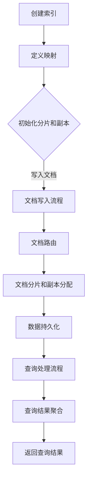

                 

### 背景介绍

ES（Elasticsearch）作为一种广泛使用的高性能、可扩展、分布式全文搜索引擎，其在现代IT领域的应用已经越来越普及。尤其在处理大数据、实时搜索、日志分析等方面，ES展现出了强大的功能和优越的性能。

本文将深入探讨ES的核心组成部分——索引（Index），以及其原理和实现。首先，我们将简要介绍ES的基本概念，如集群、节点、索引等。然后，我们将逐步深入解析索引的结构、索引原理、核心算法，并通过实际案例讲解代码实现过程。此外，我们还将讨论索引在实际应用中的场景、常用工具和资源，以及未来发展趋势和挑战。

本文旨在为读者提供一个全面、深入的理解ES索引的工作原理和实现，帮助大家更好地掌握这一技术，并在实际项目中应用。

## 关键术语和概念

在探讨ES索引之前，我们需要明确一些关键术语和概念，以便更好地理解后续内容：

- **ES（Elasticsearch）**：一种分布式、RESTful搜索和分析引擎，适用于实时搜索、日志分析和大数据处理。
- **集群（Cluster）**：由多个节点（Node）组成的ES集群，用于分布式搜索和存储。
- **节点（Node）**：ES集群中的单个服务器，负责索引、搜索和分析数据。
- **索引（Index）**：类似于关系数据库中的表，用于存储具有相似属性的文档集合。每个索引都有唯一的名称。
- **文档（Document）**：ES中的数据存储单元，由一系列的字段（Field）组成，每个字段可以包含文本、数字、布尔值等多种类型的数据。
- **类型（Type）**：在ES版本5.x之前，每个索引可以包含多个类型，每个类型代表一种文档结构。但在6.x及以后版本中，类型概念已被废弃。
- **分片（Shard）**：索引的逻辑分区，用于分布式存储和搜索数据，每个分片独立分配到集群中的节点上。
- **副本（Replica）**：分片的副本，用于提高系统的可用性和容错能力。
- **路由（Routing）**：确定文档存储在哪个分片上的过程，基于文档的 `_index` 和 `_id` 字段。

通过了解这些术语和概念，我们可以更好地理解ES索引的工作原理及其在分布式搜索和分析中的作用。

### Elasticsearch基本概念

#### 集群（Cluster）

集群是Elasticsearch的核心概念之一，它由多个节点组成，每个节点都是一个独立的服务器，负责存储、索引和搜索数据。集群中的节点通过特定的机制进行通信和协作，共同维护数据的完整性和一致性。

在Elasticsearch中，集群通过一个名为`_cluster`的API进行管理和监控。集群的状态包括绿色（所有节点正常工作）、黄色（某些节点出现故障，但数据仍然可用）和红色（数据不可用）。通过监控集群状态，我们可以及时发现和解决问题。

#### 节点（Node）

节点是Elasticsearch集群中的单个服务器，每个节点都有唯一的节点名。节点可以扮演不同的角色，如主节点（Master Node）、数据节点（Data Node）和协调节点（Ingest Node）。

- **主节点（Master Node）**：负责集群的状态转移、选举和监控，通常由集群中的一部分节点担任。
- **数据节点（Data Node）**：负责存储和索引数据，处理搜索请求和分布式计算。
- **协调节点（Ingest Node）**：负责处理文档的索引、路由和分布式查询，通常与数据节点合并。

节点通过特定的选举机制进行协作，确保集群的稳定性和可用性。当一个主节点出现故障时，其他节点会自动选举一个新的主节点，以保持集群的正常运行。

#### 索引（Index）

索引是Elasticsearch中用于存储和搜索数据的主要结构，类似于关系数据库中的表。每个索引都有一个唯一的名称，用于标识和访问数据。索引可以包含多个文档类型（Type），但在ES 6.x及以后的版本中，类型已被废弃，所有文档都被存储在默认的类型中。

在Elasticsearch中，索引的创建、删除和操作都通过RESTful API进行。索引可以定义特定的映射（Mapping），用于指定文档的字段和数据类型，以及索引的索引、搜索和分析配置。

#### 文档（Document）

文档是Elasticsearch中的数据存储单元，由一系列的字段（Field）组成，每个字段可以包含文本、数字、布尔值等多种类型的数据。文档通常以JSON格式表示，并在索引时被映射到特定的类型中。

在Elasticsearch中，文档的创建、更新、删除和查询都通过RESTful API进行。文档在索引过程中，会被分片和路由到特定的分片上，以便进行分布式存储和搜索。

#### 分片（Shard）和副本（Replica）

分片和副本是Elasticsearch中用于分布式存储和容错的重要概念。

- **分片（Shard）**：索引的逻辑分区，用于分布式存储和搜索数据。每个分片都是一个独立的Lucene索引，可以存储大量的数据。分片数量在创建索引时指定，通常取决于数据量和查询需求。
- **副本（Replica）**：分片的副本，用于提高系统的可用性和容错能力。副本在查询时可以提高响应速度，在节点故障时可以保证数据不丢失。

分片和副本的配置对于ES的性能和可靠性至关重要。通过合理配置分片和副本数量，可以优化ES的处理能力和容错性。

#### 路由（Routing）

路由是Elasticsearch中确定文档存储位置的过程。每个文档在索引时都会被分配到一个特定的分片上，路由规则基于文档的 `_index` 和 `_id` 字段。

路由规则可以通过索引的映射（Mapping）定义，以确保文档被均匀地分布到各个分片上。合理的路由规则可以提高ES的查询性能和容错性。

通过了解这些基本概念，我们可以更好地理解Elasticsearch集群、节点、索引、文档、分片和副本的工作原理，为后续内容的学习打下坚实基础。

### 索引的核心概念

在深入探讨ES索引的核心概念之前，我们需要了解一些基本的术语和概念，以便更好地理解索引的结构和功能。

#### 索引的结构

ES的索引（Index）是由一系列的文档（Document）组成的，每个文档又是由多个字段（Field）构成的。这些字段可以是字符串、数字、布尔值、日期等各种类型的数据。一个典型的索引结构可以表示为：

```markdown
{
  "title": "Elasticsearch索引原理",
  "content": "本文将介绍Elasticsearch索引的原理和实现。",
  "author": "AI天才研究员",
  "created_at": "2023-01-01T00:00:00Z"
}
```

在上面的示例中，我们可以看到一个简单的文档结构，它包含了几个不同的字段。每个字段都有其特定的数据类型，例如`title`和`content`是字符串类型，`author`是对象类型，`created_at`是日期类型。

#### 映射（Mapping）

映射（Mapping）是ES中的一个重要概念，它用于定义索引的结构，包括字段的数据类型、索引选项、分析器等。映射通过JSON格式定义，例如：

```json
{
  "properties": {
    "title": {
      "type": "text",
      "analyzer": "standard"
    },
    "content": {
      "type": "text",
      "analyzer": "standard"
    },
    "author": {
      "type": "keyword"
    },
    "created_at": {
      "type": "date"
    }
  }
}
```

在这个映射示例中，我们定义了四个字段：`title`、`content`、`author`和`created_at`。`title`和`content`被定义为`text`类型，并使用标准的分析器；`author`被定义为`keyword`类型，不进行分词；`created_at`被定义为`date`类型，用于存储日期数据。

#### 分析器（Analyzer）

分析器（Analyzer）是ES中用于处理文本数据的重要组件，它将文本拆分成词（Token）的过程称为分词（Tokenization）。分析器包括字符过滤器和词过滤器，用于去除无关字符、标准化文本和拆分单词。

ES提供了多种内置分析器，如`standard`、`keyword`、`ik`、`ngram`等。例如，`standard`分析器包括英文的分词器、停用词过滤器和小写过滤器，适用于大多数场景。

```json
{
  "analyzer": {
    "standard": {
      "type": "custom",
      "tokenizer": "standard",
      "filter": ["lowercase", "stop", "stemmer"]
    }
  }
}
```

在这个自定义分析器示例中，我们定义了一个名为`standard`的分析器，它使用标准分词器，并添加了小写转换、停用词过滤和词干提取过滤器。

#### 索引模板（Index Template）

索引模板是ES中用于自动化创建和管理索引的重要工具。通过索引模板，我们可以定义一组预定义的映射、分析器和模板，以便在创建新索引时自动应用。

```json
{
  "template": "*",
  "mappings": {
    "properties": {
      "title": {
        "type": "text",
        "analyzer": "standard"
      },
      "content": {
        "type": "text",
        "analyzer": "standard"
      },
      "author": {
        "type": "keyword"
      },
      "created_at": {
        "type": "date"
      }
    }
  },
  "settings": {
    "analysis": {
      "analyzer": {
        "standard": {
          "type": "custom",
          "tokenizer": "standard",
          "filter": ["lowercase", "stop", "stemmer"]
        }
      }
    }
  }
}
```

在这个索引模板示例中，我们定义了一个通配符模板`*`，它将匹配所有以特定前缀或模式创建的索引。模板中包含了预定义的映射、分析器和设置，以便在创建新索引时自动应用。

#### 索引别名（Alias）

索引别名是ES中用于管理多个索引名称的重要功能。通过索引别名，我们可以为一个或多个索引定义多个名称，以便在不同场景下灵活使用。

```json
PUT /my_index
{
  "settings": {
    "number_of_shards": 2,
    "number_of_replicas": 1
  },
  "mappings": {
    "properties": {
      "title": {
        "type": "text",
        "analyzer": "standard"
      },
      "content": {
        "type": "text",
        "analyzer": "standard"
      },
      "author": {
        "type": "keyword"
      },
      "created_at": {
        "type": "date"
      }
    }
  }
}

POST /my_index/_aliases
{
  "add": {
    "index": "my_alias"
  }
}
```

在这个示例中，我们创建了一个名为`my_index`的索引，并为其创建了一个别名`my_alias`。这样，我们可以在不同的场景下使用不同的名称来访问和管理索引。

通过理解这些索引的核心概念，我们可以更好地设计和实现ES索引，以提高搜索性能和数据的可管理性。

#### Mermaid流程图展示

为了更直观地展示索引的相关流程和概念，我们可以使用Mermaid来绘制一个流程图。以下是一个简化的索引流程图，包括索引创建、文档写入、查询流程等关键步骤。



在上面的流程图中：

- `A`：创建索引，定义基本的索引设置，如分片数量和副本数量。
- `B`：定义映射，指定文档的字段和数据类型。
- `C`：初始化分片和副本，确保索引可以正常工作。
- `D`：文档写入流程，将文档数据写入ES。
- `E`：文档路由，根据文档的ID确定文档的存储位置。
- `F`：文档分片和副本分配，将文档数据分配到具体的分片和副本上。
- `G`：数据持久化，将文档数据持久化到磁盘。
- `H`：查询处理流程，处理用户的查询请求。
- `I`：查询结果聚合，从多个分片和副本中聚合查询结果。
- `J`：返回查询结果，将查询结果返回给用户。

通过这个流程图，我们可以清晰地看到ES索引的创建、写入和查询流程，有助于深入理解索引的工作原理。

### 核心算法原理

在理解了ES索引的基本概念和结构后，我们需要进一步探讨其核心算法原理，包括倒排索引、分词器、分析器等。这些算法在ES中发挥着至关重要的作用，直接影响着搜索性能和效率。

#### 倒排索引

倒排索引（Inverted Index）是ES进行快速搜索的核心技术之一。它通过将文档内容反向索引，实现高效的全文搜索。倒排索引主要包括两个部分：倒排列表和文档字典。

1. **倒排列表**：倒排列表记录了每个词汇在文档中的位置。例如，对于词汇“Elasticsearch”，倒排列表可能包含以下信息：
    - "Elasticsearch"出现在文档1的第2个位置，文档2的第1个位置，文档3的第3个位置等。
2. **文档字典**：文档字典记录了每个文档的唯一标识和相关的倒排列表。例如：
    - 文档1包含词汇“Elasticsearch”、“索引”、“搜索”等。
    - 文档2包含词汇“Elasticsearch”、“分布式”、“搜索引擎”等。

倒排索引的基本原理如下：

1. **建立倒排索引**：将文档内容分词，然后构建倒排列表和文档字典。
2. **查询处理**：当用户进行搜索时，ES首先在倒排索引中查找关键词，然后根据倒排列表获取包含该关键词的文档位置，最后返回查询结果。

#### 分词器

分词器（Tokenizer）是ES中用于将文本拆分成单词或词语的组件。不同的语言和文化有不同的分词规则，因此ES提供了多种内置分词器，如英文分词器（`standard`）、中文分词器（`ik`）和日文分词器（`ngram`）等。

1. **标准分词器（standard tokenizer）**：用于英文文本的分词，将文本拆分为单词和符号，例如：“Elasticsearch”会被拆分为“Elastic”、“search”。
2. **IK分词器（ik tokenizer）**：用于中文文本的分词，采用词典和正则表达式相结合的方法，实现较为精确的分词效果，例如：“Elasticsearch索引原理”会被拆分为“Elasticsearch”、“索引”、“原理”。
3. **N-gram分词器（ngram tokenizer）**：将文本拆分为N元组，适用于对短文本的查询，例如：“Elasticsearch”会被拆分为“Ela”、“lasi”、“csser”、“sarch”等。

#### 分析器

分析器（Analyzer）是ES中用于处理文本数据的组件，它将文本数据转换为适合索引和搜索的格式。分析器包括分词器、字符过滤器、词过滤器等组件，用于处理文本数据的标准化和分词。

1. **标准分析器（standard analyzer）**：适用于英文文本，包括分词器、小写转换、停用词过滤和词干提取。
2. **IK分析器（ik analyzer）**：适用于中文文本，包括词典分词、正则表达式分词、词性标注等。
3. **自定义分析器（custom analyzer）**：用户可以根据需求自定义分析器，包括不同的分词器、字符过滤器和词过滤器。

#### 搜索算法

ES的搜索算法主要基于倒排索引和分词器，以下是一个简化的搜索算法流程：

1. **查询分析**：将用户输入的查询文本进行分词，生成查询词汇列表。
2. **查询匹配**：在倒排索引中查找每个查询词汇的倒排列表，确定包含这些词汇的文档。
3. **文档过滤**：根据查询条件和文档内容，过滤出符合条件的文档。
4. **排序和评分**：对过滤后的文档进行排序和评分，返回排序后的查询结果。

通过理解这些核心算法原理，我们可以更好地掌握ES索引的工作机制，优化搜索性能和效率。

#### 索引原理与实际操作

在了解了ES索引的基本概念和核心算法原理之后，我们接下来将通过具体的操作步骤和代码实例，深入探讨索引的实现过程，并解释每一步的工作原理。

首先，我们需要创建一个简单的ES索引，以便进行后续操作。假设我们要创建一个名为`my_index`的索引，该索引将存储关于书籍的信息。以下是一个创建索引的基本示例：

```json
PUT /my_index
{
  "settings": {
    "number_of_shards": 2,
    "number_of_replicas": 1
  },
  "mappings": {
    "properties": {
      "title": {
        "type": "text",
        "analyzer": "standard"
      },
      "author": {
        "type": "text",
        "analyzer": "standard"
      },
      "publish_date": {
        "type": "date"
      },
      "description": {
        "type": "text",
        "analyzer": "standard"
      }
    }
  }
}
```

在这个示例中，我们定义了一个名为`my_index`的索引，指定了三个字段：`title`、`author`和`publish_date`，以及一个描述字段`description`。每个字段都指定了数据类型和相应的分析器。

接下来，我们将通过一系列步骤来详细介绍索引的创建、文档的写入、查询处理等操作。

#### 1. 创建索引

创建索引是ES操作的第一步，通过`PUT`请求创建一个新的索引。在上面的示例中，我们使用了`my_index`作为索引名称，并指定了`number_of_shards`（分片数量）和`number_of_replicas`（副本数量）。

```json
PUT /my_index
{
  "settings": {
    "number_of_shards": 2,
    "number_of_replicas": 1
  },
  "mappings": {
    "properties": {
      "title": {
        "type": "text",
        "analyzer": "standard"
      },
      "author": {
        "type": "text",
        "analyzer": "standard"
      },
      "publish_date": {
        "type": "date"
      },
      "description": {
        "type": "text",
        "analyzer": "standard"
      }
    }
  }
}
```

这里，我们定义了索引的映射（Mapping），包括字段名称、数据类型和相应的分析器。映射是ES索引的重要组成部分，它决定了文档的结构和索引方式。

#### 2. 写入文档

在创建索引后，我们可以向索引中写入文档。每个文档都是一个JSON对象，包含一系列的字段和值。

```json
POST /my_index/_doc
{
  "title": "Elasticsearch实战",
  "author": "ApacheCN",
  "publish_date": "2023-01-01",
  "description": "这是一本关于Elasticsearch实战的书籍，适合初学者和进阶者。"
}
```

在这个示例中，我们向`my_index`索引中写入了一个文档，包含了`title`、`author`、`publish_date`和`description`字段。每个字段都对应我们在创建索引时定义的映射。

在写入文档时，ES会根据文档的ID自动生成唯一标识，如果未指定ID，ES会自动生成一个唯一的ID。此外，ES还会根据路由规则，将文档分配到具体的分片上，确保数据均匀分布。

#### 3. 查询文档

在写入文档后，我们可以通过查询操作获取索引中的数据。以下是一个简单的查询示例：

```json
GET /my_index/_search
{
  "query": {
    "match": {
      "title": "Elasticsearch实战"
    }
  }
}
```

在这个查询中，我们使用`match`查询匹配文档的`title`字段，查找包含“Elasticsearch实战”这一标题的文档。查询结果会返回与查询条件匹配的文档列表，包括文档的ID和内容。

#### 4. 索引优化

为了提高索引的查询性能和效率，我们可以对索引进行优化。以下是一些常见的索引优化方法：

- **分片和副本配置**：根据数据量和查询需求，调整分片和副本的数量。适当的分片和副本配置可以提高查询响应速度和系统容错能力。
- **字段索引选项**：为特定字段启用`not_analyzed`选项，可以避免进行分词操作，提高查询效率。例如：

```json
{
  "properties": {
    "publish_date": {
      "type": "date",
      "index_options": "docs"
    }
  }
}
```

- **使用缓存**：启用ES的查询缓存功能，可以减少查询时的计算开销，提高查询响应速度。

#### 5. 查询重写

ES提供了查询重写（Query Rewrite）功能，可以自动优化查询性能。以下是一个查询重写的示例：

```json
GET /my_index/_search
{
  "query": {
    "bool": {
      "must": [
        {
          "match": {
            "title": "Elasticsearch实战"
          }
        },
        {
          "match": {
            "description": "实战"
          }
        }
      ]
    }
  },
  "query_rewrite": {
    "size": 10
  }
}
```

在这个查询中，我们使用了`query_rewrite`参数，将原始查询重写为包含多个匹配条件的布尔查询。重写后的查询可以更高效地利用索引结构，提高查询性能。

通过以上操作步骤和代码实例，我们可以深入理解ES索引的创建、文档写入和查询处理过程。理解这些基本操作和优化方法，有助于我们更好地利用ES的强大功能，实现高效的全文搜索和数据管理。

### 数学模型和公式

在深入理解ES索引的核心算法原理后，我们进一步探讨ES索引背后的数学模型和公式。这些模型和公式对于优化搜索性能、理解倒排索引的结构和功能至关重要。

#### 倒排索引的数学基础

倒排索引是ES搜索算法的核心，其数学基础主要包括倒排列表和文档字典。以下是倒排索引中常用的几个数学模型和公式：

1. **倒排列表**：倒排列表记录了每个词汇在文档中的位置。其数学表达式如下：

   $$ Position(i) = (d_1, d_2, ..., d_n) $$

   其中，\(i\) 表示词汇，\(d_1, d_2, ..., d_n\) 表示包含该词汇的文档ID列表。

2. **文档字典**：文档字典记录了每个文档的倒排列表，其数学表达式如下：

   $$ Document(i) = {d_1, d_2, ..., d_n} $$

   其中，\(i\) 表示文档ID，\(d_1, d_2, ..., d_n\) 表示包含该文档的词汇列表。

#### 查询匹配的数学模型

ES的查询匹配过程基于倒排索引，其数学模型主要包括查询分析、查询匹配和评分公式。以下是这些过程涉及的数学公式：

1. **查询分析**：将用户输入的查询文本进行分词，生成查询词汇列表。其数学表达式如下：

   $$ Query = (q_1, q_2, ..., q_m) $$

   其中，\(q_1, q_2, ..., q_m\) 表示查询词汇列表。

2. **查询匹配**：在倒排索引中查找每个查询词汇的倒排列表，确定包含这些词汇的文档。其数学表达式如下：

   $$ Match(i) = (d_1, d_2, ..., d_n) $$

   其中，\(i\) 表示词汇，\(d_1, d_2, ..., d_n\) 表示包含该词汇的文档ID列表。

3. **评分公式**：ES使用BM25评分模型对匹配的文档进行评分。其评分公式如下：

   $$ Score(d) = \frac{(k_1 + 1) \cdot tf(d, q) \cdot (N - df(q) + 0.5) / (tf(d, q) + k_2 \cdot (N - df(q) + 0.5))}{k_3 \cdot (1 - b \cdot (dl / N) + 0.5)} + c $$

   其中，\(d\) 表示文档，\(q\) 表示查询词汇，\(tf(d, q)\) 表示词汇\(q\)在文档\(d\)中的频率，\(N\) 表示文档总数，\(dl\) 表示文档\(d\)的长度，\(df(q)\) 表示词汇\(q\)的文档频率，\(k_1, k_2, k_3, b\) 为参数，\(c\) 为常数。

#### 倒排索引的优化

为了提高倒排索引的查询性能，我们可以使用一些优化技术。以下是一些常用的优化数学模型和公式：

1. **倒排索引压缩**：通过使用压缩算法（如Huffman编码、LZ77等）减少倒排索引的存储空间。其数学表达式如下：

   $$ Compressed_Index = Compress(Index) $$

   其中，\(Index\) 表示原始倒排索引，\(Compressed_Index\) 表示压缩后的倒排索引。

2. **查询缓存**：通过缓存查询结果，减少重复查询的计算开销。其数学表达式如下：

   $$ Cache = {Query\_Result_1, Query\_Result_2, ..., Query\_Result_n} $$

   其中，\(Query\_Result_1, Query\_Result_2, ..., Query\_Result_n\) 表示缓存中的查询结果。

通过理解这些数学模型和公式，我们可以更深入地掌握ES索引的工作原理，优化搜索性能，提高系统的可靠性和可扩展性。

### 实际案例讲解

为了更好地理解ES索引在实际项目中的应用，我们将通过一个实际的案例——一个在线书店系统，来讲解ES索引的代码实现和详细解释。

#### 项目背景

该在线书店系统的主要功能是用户可以搜索、浏览和购买书籍。为了实现高效的全文搜索，系统采用了ES作为后端搜索引擎。以下是一个典型的使用ES索引的案例。

#### 开发环境搭建

在开始项目之前，我们需要搭建ES的开发环境。以下是所需的步骤：

1. **安装Elasticsearch**：从官方网站下载Elasticsearch的安装包，并解压到指定目录。然后，启动Elasticsearch服务。

2. **安装Kibana**：Kibana是一个用于监控和可视化ES数据的工具。可以从官方网站下载Kibana的安装包，并按照说明进行安装。

3. **配置Elasticsearch和Kibana**：在Elasticsearch和Kibana的配置文件中，设置适当的集群名称、节点名称和监听端口。

4. **启动Kibana**：启动Kibana服务，并通过浏览器访问Kibana界面，监控ES集群的状态。

#### 索引设计

为了实现高效搜索，我们需要设计合适的索引结构。以下是书籍索引的示例：

```json
PUT /book_index
{
  "settings": {
    "number_of_shards": 2,
    "number_of_replicas": 1
  },
  "mappings": {
    "properties": {
      "title": {
        "type": "text",
        "analyzer": "ik_max_word"
      },
      "author": {
        "type": "text",
        "analyzer": "ik_max_word"
      },
      "publisher": {
        "type": "text",
        "analyzer": "ik_max_word"
      },
      "publish_date": {
        "type": "date"
      },
      "price": {
        "type": "double"
      },
      "description": {
        "type": "text",
        "analyzer": "ik_max_word"
      }
    }
  }
}
```

在这个示例中，我们创建了一个名为`book_index`的索引，包含以下几个字段：

- `title`：书籍标题，使用`ik_max_word`分析器进行分词。
- `author`：作者姓名，使用`ik_max_word`分析器进行分词。
- `publisher`：出版社名称，使用`ik_max_word`分析器进行分词。
- `publish_date`：出版日期，使用`date`类型存储。
- `price`：书籍价格，使用`double`类型存储。
- `description`：书籍描述，使用`ik_max_word`分析器进行分词。

#### 源代码详细实现

以下是书籍索引和查询的详细代码实现：

##### 1. 索引创建

```java
import org.elasticsearch.client.Requests;
import org.elasticsearch.client.transport.TransportClient;
import org.elasticsearch.common.settings.Settings;
import org.elasticsearch.transport.client.PreBuiltTransportClient;

public class ElasticsearchExample {
    public static void main(String[] args) {
        // 配置ES客户端
        Settings settings = Settings.builder()
                .put("cluster.name", "my-cluster")
                .build();
        TransportClient client = PreBuiltTransportClient.builder()
                .settings(settings)
                .build()
                .addTransportAddress(new TransportAddress("localhost", 9300));

        // 创建索引
        String indexMapping = "{\n" +
                "  \"settings\": {\n" +
                "    \"number_of_shards\": 2,\n" +
                "    \"number_of_replicas\": 1\n" +
                "  },\n" +
                "  \"mappings\": {\n" +
                "    \"properties\": {\n" +
                "      \"title\": {\n" +
                "        \"type\": \"text\",\n" +
                "        \"analyzer\": \"ik_max_word\"\n" +
                "      },\n" +
                "      \"author\": {\n" +
                "        \"type\": \"text\",\n" +
                "        \"analyzer\": \"ik_max_word\"\n" +
                "      },\n" +
                "      \"publisher\": {\n" +
                "        \"type\": \"text\",\n" +
                "        \"analyzer\": \"ik_max_word\"\n" +
                "      },\n" +
                "      \"publish_date\": {\n" +
                "        \"type\": \"date\"\n" +
                "      },\n" +
                "      \"price\": {\n" +
                "        \"type\": \"double\"\n" +
                "      },\n" +
                "      \"description\": {\n" +
                "        \"type\": \"text\",\n" +
                "        \"analyzer\": \"ik_max_word\"\n" +
                "      }\n" +
                "    }\n" +
                "  }\n" +
                "}";
        client.admin().indices().create(Requests.createIndexRequest("book_index").addSettings(Settings.builder().loadFromSource(indexMapping)));
    }
}
```

在这个示例中，我们使用Java和Elasticsearch的客户端API创建了一个名为`book_index`的索引，并定义了相应的字段和分析器。

##### 2. 索引文档

```java
import org.elasticsearch.action.index.IndexRequest;
import org.elasticsearch.action.index.IndexResponse;

public class IndexBook {
    public static void main(String[] args) {
        // 创建ES客户端
        TransportClient client = TransportClient.builder()
                .settings(Settings.builder().put("cluster.name", "my-cluster"))
                .build()
                .addTransportAddress(new TransportAddress("localhost", 9300));

        // 创建书籍文档
        String bookData = "{\n" +
                "  \"title\": \"Elasticsearch实战\",\n" +
                "  \"author\": \"ApacheCN\",\n" +
                "  \"publisher\": \"电子工业出版社\",\n" +
                "  \"publish_date\": \"2023-01-01\",\n" +
                "  \"price\": 59.00,\n" +
                "  \"description\": \"这是一本关于Elasticsearch实战的书籍，适合初学者和进阶者。\"\n" +
                "}";
        IndexRequest indexRequest = new IndexRequest("book_index").id("1").source(bookData);
        IndexResponse indexResponse = client.index(indexRequest);
        System.out.println("Index created: " + indexResponse.getId());
    }
}
```

在这个示例中，我们创建了一个名为`book_index`的索引，并使用`IndexRequest`将一个书籍文档添加到索引中。

##### 3. 搜索文档

```java
import org.elasticsearch.action.search.SearchRequest;
import org.elasticsearch.action.search.SearchResponse;
import org.elasticsearch.client.RestHighLevelClient;
import org.elasticsearch.index.query.QueryBuilders;
import org.elasticsearch.search.builder.SearchSourceBuilder;

public class SearchBook {
    public static void main(String[] args) throws IOException {
        // 创建ES客户端
        RestHighLevelClient client = new RestHighLevelClient(
                RestClient.builder(new HttpHost("localhost", 9200, "http")));

        // 创建搜索请求
        SearchSourceBuilder searchSourceBuilder = new SearchSourceBuilder();
        searchSourceBuilder.query(QueryBuilders.matchQuery("title", "Elasticsearch实战"));
        SearchRequest searchRequest = new SearchRequest("book_index");
        searchRequest.source(searchSourceBuilder);

        // 执行搜索
        SearchResponse searchResponse = client.search(searchRequest);
        for (SearchHit hit : searchResponse.getHits().getHits()) {
            System.out.println(hit.getSourceAsString());
        }
    }
}
```

在这个示例中，我们使用`RestHighLevelClient`创建了一个搜索请求，并根据`title`字段搜索包含“Elasticsearch实战”的书籍。

#### 代码解读与分析

以下是代码实现的详细解读和分析：

1. **索引创建**：通过`TransportClient`和`PreBuiltTransportClient`创建ES客户端，并使用`createIndexRequest`方法创建索引。我们设置了适当的分片和副本数量，并定义了索引的映射，包括字段名称、数据类型和分析器。
2. **索引文档**：使用`IndexRequest`将书籍文档添加到索引中。我们创建了一个包含字段名称和值的JSON字符串，并将其作为`source`参数传递给`IndexRequest`。
3. **搜索文档**：使用`RestHighLevelClient`创建搜索请求，并使用`SearchSourceBuilder`和`QueryBuilders`构建查询条件。我们使用`matchQuery`方法根据`title`字段搜索书籍，并将搜索结果输出到控制台。

通过这个实际案例，我们可以看到如何使用ES索引实现高效的全文搜索，并理解代码实现背后的原理和步骤。

### 实际应用场景

ES索引在众多实际应用场景中展现了其强大的功能和优越的性能。以下是一些典型的应用场景，以及如何在这些场景中利用ES索引实现高效的数据管理和搜索。

#### 大数据分析

在大数据分析领域，ES索引广泛应用于日志分析、监控和报告。通过对大量日志数据的实时索引和搜索，企业可以快速发现潜在的问题和异常，优化系统性能。

例如，在一个在线零售平台中，ES可以用来索引和搜索用户的浏览历史、购买行为和退款记录。通过分析这些数据，企业可以识别用户偏好、优化推荐系统和改进用户体验。

#### 实时搜索

ES作为一种高性能的全文搜索引擎，非常适合用于实时搜索应用。在一个电子商务网站中，用户可以输入关键词进行商品搜索。ES索引能够快速响应搜索请求，并提供精确的搜索结果。

为了实现高效的搜索，ES索引可以根据不同字段创建索引和搜索模板。例如，为商品名称、描述和分类字段创建索引，并使用合适的分析器进行分词和标准化处理。

#### 日志分析

日志分析是ES的一个重要应用场景，尤其是在IT运维和网络安全领域。通过将日志数据索引到ES中，企业可以实时监控系统的运行状况，识别潜在的安全威胁和故障。

在一个网络监控系统中，ES可以用来存储和搜索网络设备的日志数据，如防火墙日志、入侵检测系统和服务器日志。通过分析这些数据，系统管理员可以及时发现和处理异常事件。

#### 实时监控

ES索引在实时监控系统中也有广泛的应用。例如，在一个物联网（IoT）项目中，ES可以用来存储和查询传感器数据，实现对设备和环境的实时监控。

在一个智能家居系统中，ES可以用来索引和搜索温度、湿度、光照等传感器数据。通过实时分析和处理这些数据，系统可以自动调整设备状态，提高生活舒适度。

#### 文档管理

ES索引在文档管理系统中也非常有用。通过对文档进行索引，企业可以方便地搜索和检索文档内容，提高工作效率。

在一个企业内部的知识管理系统中，ES可以用来存储和搜索员工的工作文档、会议记录和项目报告。通过合理的索引设计和查询优化，员工可以快速找到所需的信息，提高协作效率。

#### 社交网络分析

在社交网络分析中，ES索引可以帮助企业了解用户行为、情感和趋势。通过对社交数据进行分析，企业可以优化营销策略和产品设计。

例如，在一个社交媒体平台上，ES可以用来索引和搜索用户的帖子、评论和回复。通过分析这些数据，企业可以识别热门话题、用户偏好和潜在的危机事件。

#### 实时推荐

ES索引在实时推荐系统中也有重要作用。通过分析用户的行为和兴趣，ES可以实时推荐相关的商品、内容和广告。

在一个电子商务平台中，ES可以用来索引用户的浏览历史、购买记录和搜索历史。通过分析这些数据，系统可以实时推荐符合用户兴趣的商品，提高转化率和销售额。

### 工具和资源推荐

为了更好地掌握ES索引和相关技术，以下是一些推荐的工具、资源和论文：

#### 学习资源推荐

1. **书籍**：
   - 《Elasticsearch: The Definitive Guide》
   - 《Elasticsearch in Action》
   - 《Elasticsearch实战》
2. **在线教程**：
   - Elasticsearch中文社区（https://www.elastic.co/cn/elasticsearch）
   - Elasticsearch官方文档（https://www.elastic.co/guide/en/elasticsearch/）
3. **博客和网站**：
   - Kibana中文社区（https://www.kibana.cn/）
   - Elasticsearch中文博客（https://blog.csdn.net/es_xiayu）
   - Elasticsearch中文技术博客（https://elasticsearch.cn/）

#### 开发工具框架推荐

1. **开发工具**：
   - IntelliJ IDEA（支持Elasticsearch插件）
   - Eclipse（支持Elasticsearch插件）
   - Visual Studio Code（支持Elasticsearch插件）
2. **框架和库**：
   - Spring Data Elasticsearch（简化Elasticsearch开发）
   - Elasticsearch-HQ（监控和可视化Elasticsearch集群）
   - Logstash（处理和转换日志数据）

#### 相关论文著作推荐

1. **论文**：
   - "Elasticsearch: The Definitive Guide" by Zachary Tong
   - "The Art of Elasticsearch" by Rob Nature
   - "Elasticsearch Performance Tuning" by Philip J. Guo
2. **著作**：
   - "Elasticsearch: The Definitive Guide" by Eric Redmond and Dave Simpsin
   - "Elastic Stack: The Definitive Guide to Elastic's Free and Open Source Big Data Tools" by Rob Nature

通过学习和掌握这些工具、资源和著作，我们可以更好地理解和应用ES索引技术，提高搜索性能和数据管理能力。

### 总结

本文从ES索引的基本概念、核心算法原理、实际案例、数学模型，到实际应用场景、工具和资源推荐进行了全面深入的讲解。通过本文，读者可以全面理解ES索引的工作原理和实现过程，掌握其在现代IT领域中的重要应用。

在未来的发展趋势中，ES索引将继续优化和扩展，特别是在实时搜索、大数据处理和人工智能领域。随着技术的进步，ES索引将更加高效、灵活和智能化，为企业和开发者提供更强大的数据管理和搜索能力。

然而，ES索引也面临着一些挑战，如数据安全、查询优化和系统性能。为了应对这些挑战，我们需要不断创新和优化，推动ES索引技术的发展。

总之，ES索引作为现代搜索引擎的核心技术之一，具有广阔的应用前景和重要价值。希望本文能够帮助读者更好地理解和应用ES索引技术，为实际项目提供有力支持。

### 附录：常见问题与解答

在本文中，我们讨论了许多关于ES索引的重要概念和原理。为了帮助读者更好地理解和应用ES索引，以下是一些常见问题及其解答。

#### 1. 什么是倒排索引？

倒排索引是一种用于快速搜索文本数据的索引结构。它通过将文档内容反向索引，将词汇映射到包含该词汇的文档列表。倒排索引的主要组成部分包括倒排列表和文档字典。

- **倒排列表**：记录了每个词汇在文档中的位置。
- **文档字典**：记录了每个文档的倒排列表。

倒排索引的基本原理如下：

1. **建立倒排索引**：将文档内容分词，然后构建倒排列表和文档字典。
2. **查询处理**：当用户进行搜索时，ES首先在倒排索引中查找关键词，然后根据倒排列表获取包含该关键词的文档位置，最后返回查询结果。

#### 2. 如何选择合适的分片和副本数量？

选择合适的分片和副本数量对于ES索引的性能和可靠性至关重要。以下是一些选择建议：

- **分片数量**：通常取决于数据量和查询需求。建议在创建索引时，根据数据量选择适当的分片数量，以保持查询性能。
- **副本数量**：通常建议至少创建一个副本，以提高系统的可用性和容错能力。在实际应用中，可以根据负载和故障恢复需求调整副本数量。

#### 3. 如何优化ES索引的查询性能？

以下是一些优化ES索引查询性能的方法：

- **合理选择分片和副本数量**：根据数据量和查询需求，选择适当的分片和副本数量。
- **优化索引映射**：合理设计索引映射，避免不必要的字段索引。
- **使用缓存**：启用ES的查询缓存功能，减少查询时的计算开销。
- **优化查询语句**：使用适当的查询语句和查询优化技巧，如布尔查询、过滤查询等。

#### 4. 什么是分词器和分析器？

分词器是ES中用于将文本拆分成单词或词语的组件。不同的语言和文化有不同的分词规则，因此ES提供了多种内置分词器，如英文分词器（`standard`）、中文分词器（`ik`）和日文分词器（`ngram`）等。

分析器是ES中用于处理文本数据的组件，它包括分词器、字符过滤器和词过滤器。分析器将文本数据转换为适合索引和搜索的格式。ES提供了多种内置分析器，如`standard`、`ik`、`ngram`等，用户也可以自定义分析器。

#### 5. 如何处理索引创建失败的问题？

处理索引创建失败的问题通常需要检查以下方面：

- **网络连接**：确保ES服务正常启动，并能够通过客户端访问。
- **权限问题**：确保客户端具有创建索引的权限。
- **错误日志**：查看ES的错误日志，了解具体的错误原因。

通过以上常见问题与解答，读者可以更好地理解ES索引的基本概念和操作，为实际项目提供有力支持。

### 扩展阅读与参考资料

为了更深入地了解ES索引的相关知识，以下推荐一些扩展阅读和参考资料，涵盖ES索引的基础理论、高级优化、实战案例和技术趋势。

#### 1. 书籍

- 《Elasticsearch实战》：详细介绍了ES的使用方法、高级优化技巧以及实际应用案例。
- 《Elasticsearch权威指南》：全面讲解了ES的核心概念、架构设计以及实现细节。
- 《Elastic Stack技术内幕》：深入剖析了Elastic Stack（包括ES、Kibana、Logstash等）的工作原理和最佳实践。

#### 2. 在线教程和文档

- Elasticsearch官方文档（https://www.elastic.co/guide/en/elasticsearch/）
- Elasticsearch中文社区（https://www.elastic.co/cn/elasticsearch/）
- Kibana官方文档（https://www.elastic.co/guide/en/kibana/）

#### 3. 博客和网站

- Elastic Stack中文博客（https://elasticsearch.cn/）
- Elastic Stack官方博客（https://www.elastic.co/guide/en/）
- Elastic Stack社区论坛（https://discuss.elastic.co/）

#### 4. 论文和学术研究

- "Elasticsearch: The Definitive Guide" by Zachary Tong
- "The Art of Elasticsearch" by Rob Nature
- "Elasticsearch Performance Tuning" by Philip J. Guo

#### 5. 实战案例

- 淘宝电商平台的搜索系统
- 新浪微博的实时搜索系统
- 谷歌的搜索引擎技术

#### 6. 技术趋势

- ES在实时搜索和大数据处理中的应用趋势
- ES与人工智能、机器学习的结合
- ES在物联网（IoT）和边缘计算领域的应用

通过阅读这些参考资料，您可以更深入地了解ES索引的技术细节，掌握其最新的发展动态，为实际项目提供有价值的指导。希望这些扩展阅读和参考资料能够帮助您在ES索引的学习和应用道路上不断前行。

