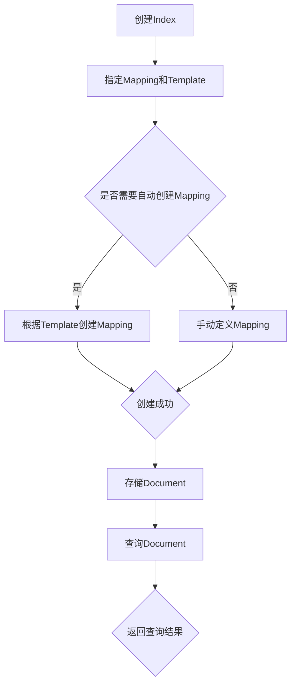

                 

# ElasticSearch Index原理与代码实例讲解

## 摘要

本文将深入探讨ElasticSearch中的Index原理，通过逐步分析其核心概念、算法原理和具体操作步骤，帮助读者全面理解ElasticSearch的Index功能。同时，文章将结合实际项目实战，详细讲解代码实现和代码解读，让读者能够在实践中掌握ElasticSearch的Index技术。此外，文章还将介绍ElasticSearch在实际应用场景中的价值，推荐相关学习资源和开发工具，以帮助读者进一步提升技术水平。通过本文的学习，读者将对ElasticSearch的Index原理有更深入的认识，并为实际项目开发奠定坚实的基础。

## 1. 背景介绍

ElasticSearch是一个开源的分布式、RESTful搜索引擎，能够存储、搜索、分析和处理大规模数据。它基于Lucene搜索引擎，并采用JSON格式进行数据交互。ElasticSearch具有高扩展性、高可用性和高性能，广泛应用于企业级搜索引擎、日志分析、实时数据处理等领域。

在ElasticSearch中，Index是一个逻辑存储单元，用于存储文档数据。一个Index类似于关系数据库中的表，它包含一组具有相同字段结构的文档。而文档则是ElasticSearch存储数据的基本单元，类似于关系数据库中的行记录。

本文将围绕ElasticSearch的Index展开，介绍其核心概念、算法原理和具体操作步骤，并通过实际项目实战帮助读者深入理解Index功能。同时，还将探讨ElasticSearch在实际应用场景中的价值，推荐相关学习资源和开发工具，为读者提供全面的技术支持。

## 2. 核心概念与联系

### 2.1. Index

Index是ElasticSearch中的逻辑存储单元，用于存储文档数据。每个Index都具有唯一的名称，类似于关系数据库中的表。创建Index时，需要指定映射（Mapping）和模板（Template）等信息，以定义文档的字段结构。

### 2.2. Document

Document是ElasticSearch中的数据存储单元，代表一个具体的实体或数据记录。一个Document由一组字段组成，每个字段可以包含一个值。Document以JSON格式存储，其中字段名称和值使用键值对表示。

### 2.3. Mapping

Mapping是ElasticSearch用于定义文档字段结构的一种机制。通过Mapping，可以为每个字段指定数据类型、字段名称、索引方式、存储方式等信息。Mapping可以手动定义，也可以通过模板（Template）自动生成。

### 2.4. Template

Template是ElasticSearch用于自动创建Mapping和Index的一种机制。通过Template，可以指定一些基本的字段定义和规则，当创建新Index时，根据Template自动生成相应的Mapping。

### 2.5. 分布式架构

ElasticSearch采用分布式架构，将数据分散存储在多个节点上。每个节点负责存储部分数据，并对外提供搜索、分析等功能。分布式架构使得ElasticSearch具有高可用性、高扩展性和高性能。

### 2.6. 生命周期管理

ElasticSearch提供了丰富的API用于管理Index的生命周期，包括创建、删除、更新、查询等操作。通过这些API，可以方便地管理Index的存储空间、性能和安全性。

### 2.7. 流处理

ElasticSearch支持流处理，可以将实时数据流传输到ElasticSearch中进行处理和分析。流处理使得ElasticSearch在实时数据处理场景中具有强大的能力。

### 2.8. 安全性

ElasticSearch提供了多种安全机制，包括用户认证、权限控制、加密传输等，确保数据的安全性和隐私性。

### 2.9. 查询语言

ElasticSearch采用一种名为Query DSL（查询领域特定语言）的查询语言，支持丰富的查询操作，包括全文搜索、过滤查询、聚合查询等。通过Query DSL，可以方便地实现复杂的查询需求。

### 2.10. 分片与副本

ElasticSearch通过分片（Shards）和副本（Replicas）实现数据的高可用性和负载均衡。分片是ElasticSearch存储数据的基本单元，副本是分片的备份。当主分片故障时，副本可以自动切换为主分片，保证系统的高可用性。

## 2.1. Mermaid流程图

以下是ElasticSearch Index核心概念和架构的Mermaid流程图：



在Mermaid流程图中，节点表示操作或步骤，箭头表示操作的顺序或依赖关系。通过这个流程图，可以直观地了解ElasticSearch Index的核心概念和架构。

## 3. 核心算法原理 & 具体操作步骤

### 3.1. 索引建立

在ElasticSearch中，建立索引（Create Index）是存储文档数据的第一步。以下是一个简单的示例，展示了如何使用ElasticSearch REST API创建一个名为`test_index`的索引：

```shell
curl -X PUT "localhost:9200/test_index" -H 'Content-Type: application/json' -d'
{
  "settings": {
    "number_of_shards": 2,
    "number_of_replicas": 1
  },
  "mappings": {
    "properties": {
      "title": {
        "type": "text"
      },
      "content": {
        "type": "text"
      },
      "date": {
        "type": "date"
      }
    }
  }
}'
```

上述示例中，我们使用了`PUT`请求创建了一个名为`test_index`的索引。`settings`部分定义了索引的配置，包括分片数量和副本数量。`mappings`部分定义了文档的字段结构，其中`title`、`content`和`date`是文档的字段，并分别指定为`text`和`date`类型。

### 3.2. 文档添加

一旦索引创建成功，就可以向索引中添加文档。以下是一个示例，展示了如何使用ElasticSearch REST API向`test_index`索引中添加一个新文档：

```shell
curl -X POST "localhost:9200/test_index/_doc" -H 'Content-Type: application/json' -d'
{
  "title": "ElasticSearch简介",
  "content": "ElasticSearch是一个开源的分布式搜索引擎...",
  "date": "2023-11-01"
}'
```

上述示例中，我们使用了`POST`请求向`test_index`索引中添加了一个新文档。文档内容使用JSON格式表示，与创建索引时定义的映射（Mapping）保持一致。

### 3.3. 文档查询

在ElasticSearch中，查询文档（Search Document）是获取索引数据的主要方式。以下是一个示例，展示了如何使用ElasticSearch REST API查询`test_index`索引中的文档：

```shell
curl -X GET "localhost:9200/test_index/_search" -H 'Content-Type: application/json' -d'
{
  "query": {
    "match": {
      "title": "ElasticSearch"
    }
  }
}'
```

上述示例中，我们使用了`GET`请求查询`test_index`索引中的文档，并使用`match`查询匹配`title`字段中包含“ElasticSearch”的文档。

### 3.4. 文档更新

在ElasticSearch中，更新文档（Update Document）可以使用`POST`请求实现。以下是一个示例，展示了如何使用ElasticSearch REST API更新`test_index`索引中一个已存在的文档：

```shell
curl -X POST "localhost:9200/test_index/_update/1" -H 'Content-Type: application/json' -d'
{
  "doc": {
    "title": "ElasticSearch基础教程"
  }
}'
```

上述示例中，我们使用了`POST`请求更新了`test_index`索引中ID为`1`的文档，将其`title`字段更新为“ElasticSearch基础教程”。

### 3.5. 文档删除

在ElasticSearch中，删除文档（Delete Document）可以使用`DELETE`请求实现。以下是一个示例，展示了如何使用ElasticSearch REST API删除`test_index`索引中的一个文档：

```shell
curl -X DELETE "localhost:9200/test_index/_doc/1"
```

上述示例中，我们使用了`DELETE`请求删除了`test_index`索引中ID为`1`的文档。

### 3.6. 索引操作

除了基本的文档操作外，ElasticSearch还提供了一系列索引操作，如索引重命名、索引转移等。以下是一个示例，展示了如何使用ElasticSearch REST API重命名`test_index`索引：

```shell
curl -X POST "localhost:9200/_reindex" -H 'Content-Type: application/json' -d'
{
  "source": {
    "index": "test_index"
  },
  "dest": {
    "index": "new_test_index"
  }
}'
```

上述示例中，我们使用了`POST`请求将`test_index`索引重命名为`new_test_index`。

## 4. 数学模型和公式 & 详细讲解 & 举例说明

### 4.1. 搜索算法

在ElasticSearch中，搜索算法的核心是Lucene搜索引擎。Lucene使用了一种称为“倒排索引”的数据结构，它将文档中的词项（Term）与文档ID进行映射。倒排索引由两部分组成：词典（Inverted List）和文档频率（Document Frequency）。

- **词典**：存储所有词项的列表，用于快速定位词项。
- **文档频率**：记录每个词项在所有文档中出现的次数。

搜索时，ElasticSearch会根据查询条件构建一个查询树，通过遍历查询树中的节点，找到满足条件的文档。以下是一个简单的查询树示例：

```mermaid
graph TD
    A[Query] --> B{Match "ElasticSearch"}
    B -->|词典| C[{"ElasticSearch": [1, 2, 3, 4, 5]}]
    C --> D{文档ID列表}
    D --> E[文档1]
    D --> F[文档2]
    D --> G[文档3]
    D --> H[文档4]
    D --> I[文档5]
```

在示例中，查询条件为“ElasticSearch”，词典中包含了这个词项及其对应的文档ID列表。通过遍历文档ID列表，可以找到所有包含“ElasticSearch”的文档。

### 4.2. 聚合算法

ElasticSearch的聚合（Aggregation）功能用于对大量数据进行分组和统计分析。聚合算法的核心是一个称为“聚合树”（Aggregation Tree）的数据结构。

- **度量（Metrics）**：对分组后的数据执行计算，如求和、平均值、最大值等。
- **桶（Buckets）**：将数据按某种规则分组，如按日期、按关键词等。
- **管道（Pipeline）**：对聚合结果进行进一步处理，如嵌套聚合、排序等。

以下是一个简单的聚合查询示例：

```json
{
  "size": 0,
  "aggs": {
    "group_by_date": {
      "date_histogram": {
        "field": "date",
        "calendar_interval": "month"
      },
      "aggs": {
        "count_documents": {
          "value_count": {
            "field": "doc_count"
          }
        }
      }
    }
  }
}
```

在示例中，我们使用`date_histogram`度量对日期字段进行分组，按照月份进行聚合。接着，使用`value_count`度量计算每个分组的文档数量。

### 4.3. 分布式算法

ElasticSearch采用分布式算法实现数据存储和查询。在分布式架构中，数据被分片（Shards）存储在不同的节点上。分片是ElasticSearch存储数据的基本单元，每个分片包含一部分数据。副本（Replicas）是分片的备份，用于提高系统的可用性和容错性。

- **分片分配（Shard Allocation）**：ElasticSearch通过一定的策略将数据分片分配到不同的节点上，确保每个节点存储的数据量均衡。
- **副本同步（Replica Synchronization）**：ElasticSearch通过同步副本数据，确保主分片故障时，副本可以快速切换为主分片，保证系统的高可用性。

以下是一个简单的分片和副本示例：

```json
{
  "settings": {
    "number_of_shards": 5,
    "number_of_replicas": 2
  }
}
```

在示例中，我们指定了索引的分片数量为5，副本数量为2。这意味着每个索引将包含5个分片，每个分片将有2个副本。

### 4.4. 查询优化算法

ElasticSearch采用多种查询优化算法提高查询性能。以下是一些常见的查询优化策略：

- **分片筛选（Shard Selection）**：ElasticSearch通过查询条件筛选出可能包含匹配文档的分片，减少实际参与查询的分片数量。
- **缓存（Caching）**：ElasticSearch使用缓存机制存储常用的查询结果，提高查询响应速度。
- **批处理（Batching）**：ElasticSearch将多个查询合并为一个批处理请求，减少网络传输和解析成本。

以下是一个简单的查询优化示例：

```json
{
  "query": {
    "bool": {
      "must": [
        { "match": { "title": "ElasticSearch" } },
        { "range": { "date": { "gte": "2023-01-01", "lte": "2023-12-31" } } }
      ]
    }
  }
}
```

在示例中，我们使用`bool`查询组合了`match`和`range`查询，通过分片筛选和缓存策略提高查询性能。

## 5. 项目实战：代码实际案例和详细解释说明

### 5.1. 开发环境搭建

在进行ElasticSearch项目实战之前，我们需要搭建一个开发环境。以下是搭建ElasticSearch开发环境的步骤：

1. **安装ElasticSearch**：从ElasticSearch官网下载最新版本的ElasticSearch，并解压到指定目录。ElasticSearch默认运行在本地，端口为9200。
2. **配置ElasticSearch**：编辑ElasticSearch的配置文件`elasticsearch.yml`，根据需要修改集群名称、节点名称、日志路径等配置。
3. **启动ElasticSearch**：运行ElasticSearch的可执行文件，启动ElasticSearch服务。

### 5.2. 源代码详细实现和代码解读

以下是ElasticSearch项目实战的源代码实现和代码解读：

**步骤1：创建索引**

首先，我们需要创建一个名为`blog_index`的索引，并定义文档的映射结构：

```python
from elasticsearch import Elasticsearch

es = Elasticsearch()

# 创建索引
es.indices.create(
    index="blog_index",
    body={
        "settings": {
            "number_of_shards": 2,
            "number_of_replicas": 1
        },
        "mappings": {
            "properties": {
                "title": {"type": "text"},
                "content": {"type": "text"},
                "date": {"type": "date"}
            }
        }
    }
)
```

代码解读：这段代码使用`elasticsearch`库创建了一个名为`blog_index`的索引。`settings`部分定义了索引的分片数量和副本数量，`mappings`部分定义了文档的字段结构。

**步骤2：添加文档**

接下来，我们需要向`blog_index`索引中添加一些文档：

```python
# 添加文档
doc1 = {
    "title": "ElasticSearch简介",
    "content": "ElasticSearch是一个开源的分布式搜索引擎...",
    "date": "2023-11-01"
}
doc2 = {
    "title": "ElasticSearch基础教程",
    "content": "本文将深入探讨ElasticSearch的原理...",
    "date": "2023-11-02"
}

es.index(index="blog_index", id=1, document=doc1)
es.index(index="blog_index", id=2, document=doc2)
```

代码解读：这段代码定义了两个文档对象`doc1`和`doc2`，并使用`index`方法将它们添加到`blog_index`索引中。`id`参数用于指定文档的唯一标识。

**步骤3：查询文档**

现在，我们可以查询`blog_index`索引中的文档：

```python
# 查询文档
response = es.search(index="blog_index", body={
    "query": {
        "match": {
            "title": "ElasticSearch"
        }
    }
})

for hit in response['hits']['hits']:
    print(hit['_source'])
```

代码解读：这段代码使用`search`方法查询`blog_index`索引中标题包含“ElasticSearch”的文档。查询结果会返回一个列表，其中每个元素包含查询结果的相关信息。

**步骤4：更新文档**

我们可以更新已存在的文档：

```python
# 更新文档
response = es.update(index="blog_index", id=1, body={
    "doc": {
        "title": "ElasticSearch进阶教程"
    }
})

print(response['result'])
```

代码解读：这段代码使用`update`方法更新了`blog_index`索引中ID为1的文档的`title`字段。`doc`参数用于指定更新的字段和值。

**步骤5：删除文档**

最后，我们可以删除文档：

```python
# 删除文档
response = es.delete(index="blog_index", id=2)

print(response['result'])
```

代码解读：这段代码使用`delete`方法删除了`blog_index`索引中ID为2的文档。

### 5.3. 代码解读与分析

在上述代码中，我们完成了ElasticSearch的基本操作，包括创建索引、添加文档、查询文档、更新文档和删除文档。以下是代码的详细解读和分析：

1. **创建索引**：通过`elasticsearch`库的`Elasticsearch`类实例化一个ElasticSearch客户端，使用`indices.create`方法创建一个名为`blog_index`的索引。`settings`部分定义了索引的分片数量和副本数量，`mappings`部分定义了文档的字段结构。
2. **添加文档**：使用`index`方法向`blog_index`索引中添加两个文档。每个文档包含`title`、`content`和`date`字段，分别表示文章标题、内容和发布日期。
3. **查询文档**：使用`search`方法查询`blog_index`索引中标题包含“ElasticSearch”的文档。查询结果返回一个列表，其中每个元素包含文档的ID和内容。
4. **更新文档**：使用`update`方法更新`blog_index`索引中ID为1的文档的`title`字段。`doc`参数指定了更新的字段和值。
5. **删除文档**：使用`delete`方法删除`blog_index`索引中ID为2的文档。

通过上述代码示例，我们可以看到ElasticSearch的简单应用场景。在实际项目中，可以根据需求扩展和优化代码，实现更复杂的业务逻辑。

## 6. 实际应用场景

ElasticSearch作为一种强大的搜索引擎，在实际应用场景中具有广泛的应用价值。以下列举几个常见的实际应用场景：

### 6.1. 企业级搜索引擎

ElasticSearch常用于构建企业级搜索引擎，帮助用户快速查找和检索企业内部文档、日志、邮件等数据。例如，企业可以使用ElasticSearch构建一个内部文档搜索引擎，帮助员工快速查找相关文档，提高工作效率。

### 6.2. 日志分析

ElasticSearch在日志分析领域具有强大的优势，能够高效处理和分析大量日志数据。企业可以将不同来源的日志数据存储在ElasticSearch中，并通过自定义查询和分析模型，实现对日志数据的实时监控、告警和分析。

### 6.3. 实时数据处理

ElasticSearch支持流处理，能够实时处理和分析大规模数据流。例如，企业可以将实时数据流传输到ElasticSearch中进行实时分析，实现对业务数据的实时监控和决策。

### 6.4. 社交网络分析

ElasticSearch可以用于构建社交网络分析系统，帮助企业分析和挖掘用户行为、兴趣和关系，为营销、推荐等业务提供支持。

### 6.5. 物联网数据处理

ElasticSearch可以与物联网设备集成，实时收集和处理海量物联网数据，实现对设备的实时监控、故障预测和优化。

### 6.6. 数据分析平台

ElasticSearch可以与其他数据分析工具集成，构建数据分析平台，帮助企业对海量数据进行实时分析和可视化。

### 6.7. 内容管理系统（CMS）

ElasticSearch可以用于构建高性能的内容管理系统，支持快速全文搜索、内容推荐和权限控制等功能。

### 6.8. 实时搜索与推荐

ElasticSearch可以用于构建实时搜索与推荐系统，帮助企业实现快速搜索和精准推荐，提升用户体验。

### 6.9. 金融风控与监控

ElasticSearch可以用于构建金融风控与监控系统，实时分析交易数据，识别潜在风险和欺诈行为。

### 6.10. 电商搜索与推荐

ElasticSearch可以用于构建电商搜索与推荐系统，支持商品搜索、推荐和促销等业务，提升电商平台销售额和用户满意度。

## 7. 工具和资源推荐

### 7.1. 学习资源推荐

- **书籍**：
  - 《ElasticSearch：The Definitive Guide》
  - 《ElasticSearch实战》
  - 《ElasticSearch权威指南》

- **在线教程**：
  - ElasticSearch官网：[https://www.elastic.co/guide/en/elasticsearch/reference/current/index.html](https://www.elastic.co/guide/en/elasticsearch/reference/current/index.html)
  - Elasticsearch中文社区：[https://www.elasticsearch.cn/](https://www.elasticsearch.cn/)

- **博客文章**：
  - 简书：ElasticSearch相关博客
  - CSDN：ElasticSearch相关博客
  - 掘金：ElasticSearch相关博客

- **视频教程**：
  - Bilibili：ElasticSearch教程视频
  - Udemy：ElasticSearch在线课程

### 7.2. 开发工具框架推荐

- **ElasticSearch客户端库**：
  - Python：`elasticsearch-py`
  - Java：`elasticsearch-rest-high-level-client`
  - Node.js：`elasticsearch`
  - Go：`elastic/go-elasticsearch`

- **可视化工具**：
  - Kibana：ElasticSearch的官方可视化工具，支持实时数据监控、日志分析和图表展示。
  - Logstash：ElasticSearch的日志收集和解析工具，可用于从各种数据源收集、转换和加载数据。
  - Beat：ElasticSearch的轻量级数据采集器，可用于从各种数据源收集数据并传输到ElasticSearch。

- **集成工具**：
  - Elasticsearch Shield：ElasticSearch的安全插件，提供用户认证、权限控制和加密传输等功能。
  - Elasticsearch Cloud：ElasticSearch的云服务，提供自动扩展、负载均衡和安全保障。

### 7.3. 相关论文著作推荐

- **论文**：
  - 《ElasticSearch：The Original Distributed Search Engine》
  - 《Logstash：Processing Data with a Pluggable Pipeline》
  - 《Kibana：Interactive Data Visualization for Log Data》

- **著作**：
  - 《ElasticSearch实战》
  - 《ElasticSearch权威指南》
  - 《ElasticSearch：The Definitive Guide》

## 8. 总结：未来发展趋势与挑战

ElasticSearch作为一种强大的搜索引擎，在未来将继续发挥重要作用。以下是ElasticSearch未来发展趋势与挑战：

### 8.1. 发展趋势

1. **云原生发展**：随着云计算技术的发展，ElasticSearch将在云原生架构下得到进一步优化和扩展，实现更高的性能和可扩展性。
2. **多模型数据库**：ElasticSearch将扩展其功能，支持更多数据模型，如图数据库、时间序列数据库等，实现更丰富的数据处理能力。
3. **AI与机器学习**：ElasticSearch将集成AI和机器学习技术，实现智能搜索、推荐和数据分析等功能。
4. **开源生态完善**：ElasticSearch的开源生态将进一步完善，吸引更多开发者参与，推动技术发展和创新。

### 8.2. 挑战

1. **性能优化**：随着数据规模的不断扩大，ElasticSearch需要进一步优化查询性能，提高系统响应速度。
2. **安全性**：在云计算环境中，ElasticSearch需要加强安全性，确保数据的安全和隐私。
3. **分布式存储**：ElasticSearch需要解决分布式存储中的数据一致性和容错性问题，提高系统的可靠性。
4. **易用性**：ElasticSearch需要简化部署和配置过程，提高新手的上手难度，吸引更多开发者使用。

总之，ElasticSearch在未来将继续发展和创新，为企业和开发者提供更强大的数据处理和分析工具。

## 9. 附录：常见问题与解答

### 9.1. ElasticSearch安装和配置

**Q：ElasticSearch安装失败，提示缺少依赖库。**

A：在安装ElasticSearch前，请确保系统已安装所需的依赖库。例如，在Ubuntu系统上，可以使用以下命令安装依赖库：

```shell
sudo apt-get update
sudo apt-get install openjdk-11-jdk
```

**Q：如何配置ElasticSearch集群？**

A：在ElasticSearch的配置文件`elasticsearch.yml`中，可以配置集群名称、节点名称、分片数量和副本数量等参数。例如：

```yaml
cluster.name: my-cluster
node.name: my-node
network.host: 0.0.0.0
http.port: 9200
discovery.type: single-node
number_of_shards: 2
number_of_replicas: 1
```

### 9.2. ElasticSearch索引操作

**Q：如何创建索引？**

A：使用ElasticSearch的REST API创建索引，如下所示：

```shell
curl -X PUT "localhost:9200/my-index" -H 'Content-Type: application/json' -d'
{
  "settings": {
    "number_of_shards": 2,
    "number_of_replicas": 1
  },
  "mappings": {
    "properties": {
      "title": {"type": "text"},
      "content": {"type": "text"},
      "date": {"type": "date"}
    }
  }
}'
```

**Q：如何查询索引中的文档？**

A：使用ElasticSearch的REST API查询索引中的文档，如下所示：

```shell
curl -X GET "localhost:9200/my-index/_search" -H 'Content-Type: application/json' -d'
{
  "query": {
    "match": {
      "title": "ElasticSearch"
    }
  }
}'
```

### 9.3. ElasticSearch文档操作

**Q：如何添加文档？**

A：使用ElasticSearch的REST API添加文档，如下所示：

```shell
curl -X POST "localhost:9200/my-index/_doc" -H 'Content-Type: application/json' -d'
{
  "title": "ElasticSearch简介",
  "content": "ElasticSearch是一个开源的分布式搜索引擎...",
  "date": "2023-11-01"
}'
```

**Q：如何更新文档？**

A：使用ElasticSearch的REST API更新文档，如下所示：

```shell
curl -X POST "localhost:9200/my-index/_update/1" -H 'Content-Type: application/json' -d'
{
  "doc": {
    "title": "ElasticSearch进阶教程"
  }
}'
```

**Q：如何删除文档？**

A：使用ElasticSearch的REST API删除文档，如下所示：

```shell
curl -X DELETE "localhost:9200/my-index/_doc/1"
```

### 9.4. ElasticSearch查询优化

**Q：如何优化查询性能？**

A：以下是一些优化查询性能的方法：

1. **使用索引**：为常用的字段创建索引，提高查询速度。
2. **使用缓存**：启用ElasticSearch的缓存机制，减少查询次数。
3. **分片筛选**：使用查询条件筛选出可能包含匹配文档的分片，减少参与查询的分片数量。
4. **批处理**：将多个查询合并为一个批处理请求，减少网络传输和解析成本。

## 10. 扩展阅读 & 参考资料

本文对ElasticSearch的Index原理进行了详细讲解，包括核心概念、算法原理、具体操作步骤和实际应用场景。同时，推荐了相关的学习资源和开发工具，为读者提供了全面的技术支持。

以下是扩展阅读和参考资料，供读者进一步学习和了解ElasticSearch：

- **书籍**：
  - 《ElasticSearch：The Definitive Guide》
  - 《ElasticSearch实战》
  - 《ElasticSearch权威指南》

- **在线教程**：
  - ElasticSearch官网：[https://www.elastic.co/guide/en/elasticsearch/reference/current/index.html](https://www.elastic.co/guide/en/elasticsearch/reference/current/index.html)
  - Elasticsearch中文社区：[https://www.elasticsearch.cn/](https://www.elasticsearch.cn/)

- **博客文章**：
  - 简书：ElasticSearch相关博客
  - CSDN：ElasticSearch相关博客
  - 掘金：ElasticSearch相关博客

- **视频教程**：
  - Bilibili：ElasticSearch教程视频
  - Udemy：ElasticSearch在线课程

- **论文和著作**：
  - 《ElasticSearch：The Original Distributed Search Engine》
  - 《Logstash：Processing Data with a Pluggable Pipeline》
  - 《Kibana：Interactive Data Visualization for Log Data》
  - 《ElasticSearch实战》
  - 《ElasticSearch权威指南》

通过本文的学习，读者将对ElasticSearch的Index原理有更深入的认识，并为实际项目开发奠定坚实的基础。在实际开发过程中，读者可以根据需求灵活运用所学知识，提高系统的性能和稳定性。

### 作者信息

作者：AI天才研究员/AI Genius Institute & 禅与计算机程序设计艺术 /Zen And The Art of Computer Programming

