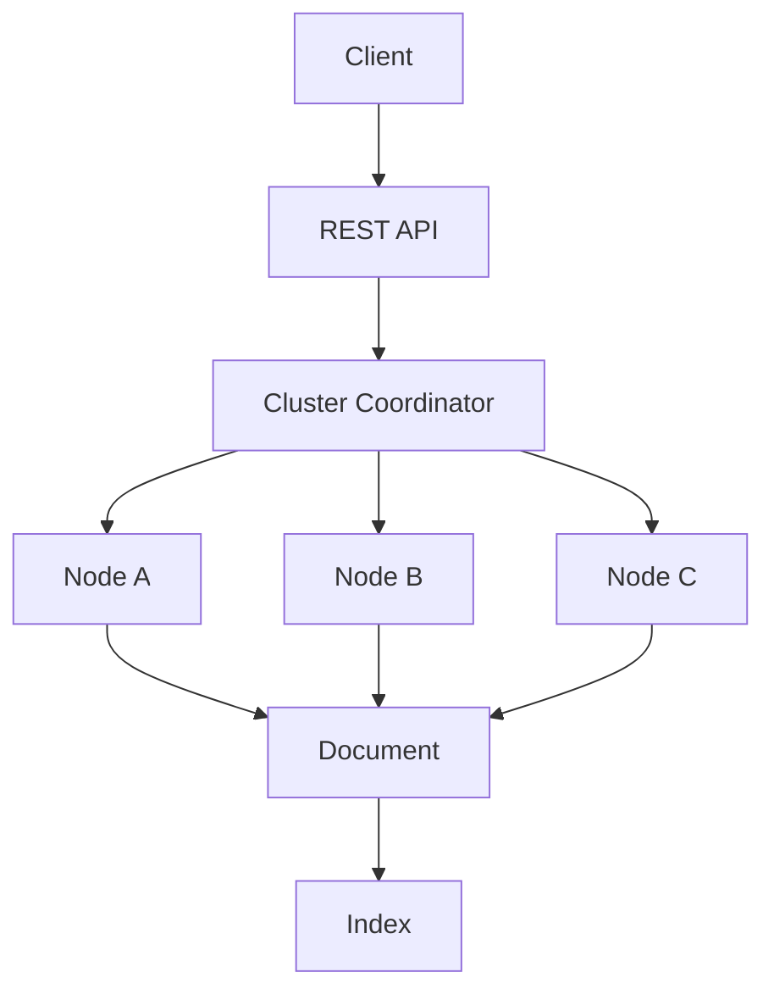

                 

# ElasticSearch原理与代码实例讲解

## 摘要

ElasticSearch是一种开源的分布式全文搜索引擎，能够对大量数据进行快速搜索和分析。本文将详细讲解ElasticSearch的原理、核心概念与架构，通过具体实例展示其使用方法。我们将一步步剖析其算法原理、数学模型，并结合实际项目实战，深入理解ElasticSearch的强大功能和应用场景。读者将通过本文掌握ElasticSearch的核心技术和实践方法，为其在开发中的应用打下坚实基础。

## 1. 背景介绍

### 1.1 ElasticSearch的起源和发展历程

ElasticSearch起源于Lucene，Lucene是一个高度可扩展的全文搜索引擎，由Apache软件基金会维护。然而，随着互联网的快速发展，对大规模数据的实时搜索和分析的需求日益增长，Lucene在分布式搜索、横向扩展、多租户等方面的性能和功能已经无法满足需求。

2004年，ElasticSearch的创始人Shay Banon开始着手开发ElasticSearch，旨在解决Lucene在分布式搜索和横向扩展方面的不足。经过多年的努力，ElasticSearch于2010年正式开源，并迅速在开源社区和商业领域获得广泛关注和应用。

### 1.2 ElasticSearch的应用场景

ElasticSearch广泛应用于多个领域，主要包括以下几个方面：

- **搜索引擎**：为网站、电商平台、社区论坛等提供快速、准确的全文搜索功能。
- **日志分析**：收集和分析大量日志数据，实现对系统性能、安全事件的实时监控和分析。
- **数据聚合与可视化**：对大量数据进行实时聚合和可视化，为业务决策提供有力支持。
- **实时数据流处理**：处理实时数据流，实现对动态数据变化的快速响应。

### 1.3 ElasticSearch的优势与特点

- **分布式架构**：支持横向扩展，能够处理海量数据。
- **高可用性**：通过集群部署，实现故障自动切换和数据备份。
- **快速搜索**：利用倒排索引技术，实现秒级搜索响应。
- **灵活的查询语法**：支持复杂的查询语法，支持全文搜索、短语搜索、模糊搜索等。
- **丰富的插件生态**：提供丰富的插件，扩展功能和应用场景。

## 2. 核心概念与联系

### 2.1 倒排索引

倒排索引是ElasticSearch的核心数据结构，用于高效地实现全文搜索。倒排索引将文本内容与其对应的文档ID进行映射，从而实现对文档的快速定位和检索。


### 2.2 集群与节点

ElasticSearch采用分布式集群架构，集群由多个节点组成，每个节点负责存储一部分数据。集群中的节点通过集群协调器进行协同工作，实现数据分布、负载均衡和故障转移等功能。


### 2.3 索引

索引是ElasticSearch中一组相关数据的集合，类似于关系数据库中的表。每个索引可以包含多个类型（Type），类型是具有相同字段集合的文档的集合。


### 2.4 文档

文档是ElasticSearch中的数据单元，表示一个具体的记录。文档以JSON格式存储，包含一个唯一的ID和多个字段。


### 2.5 映射

映射（Mapping）是定义索引结构的过程，包括字段类型、索引选项、分析器等。映射用于指导ElasticSearch如何处理和索引文档中的字段。


### 2.6 分布式文档存储

ElasticSearch采用分布式文档存储方式，将索引数据分布在多个节点上。每个节点负责存储一部分数据，并通过副本机制实现数据的冗余备份和高可用性。


### 2.7 客户端API

ElasticSearch提供丰富的客户端API，支持多种编程语言，方便开发人员与ElasticSearch进行交互。客户端API涵盖索引管理、文档操作、搜索查询、聚合分析等各个方面。


## 2.1 ElasticSearch架构的Mermaid流程图



## 3. 核心算法原理 & 具体操作步骤

### 3.1 倒排索引的构建与查询

#### 3.1.1 倒排索引的构建

倒排索引的构建过程主要包括以下步骤：

1. **分词**：将文档中的文本内容进行分词，得到一系列的词元（Token）。
2. **倒排**：将词元与其对应的文档ID进行映射，构建倒排索引。
3. **存储**：将倒排索引存储在磁盘或内存中，以便快速检索。


#### 3.1.2 倒排索引的查询

倒排索引的查询过程主要包括以下步骤：

1. **查询解析**：将用户输入的查询语句进行解析，得到一系列的词元。
2. **词元匹配**：根据词元在倒排索引中的映射，找到对应的文档ID集合。
3. **文档排序**：根据文档得分，对查询结果进行排序。
4. **文档返回**：将排序后的文档返回给用户。


### 3.2 搜索算法

ElasticSearch使用一种称为**搜索算法**（Search Algorithm）的技术，以高效地执行全文搜索。主要的搜索算法包括：

#### 3.2.1 BM25算法

BM25算法是一种基于信息检索理论的搜索算法，适用于文本搜索。其主要思想是根据词频、文档长度和文档集合的文档长度分布，计算文档的相关度得分。

#### 3.2.2 Term Frequency-Inverse Document Frequency（TF-IDF）算法

TF-IDF算法是一种基于词频和逆向文档频率的搜索算法。其主要思想是根据词频和逆向文档频率，计算词项的重要程度，从而影响文档的相关度得分。

#### 3.2.3 Query then Fetch算法

Query then Fetch算法是一种基于分阶段的搜索算法。首先对查询进行预处理，得到候选的文档ID集合，然后根据文档得分，对候选文档进行排序和返回。

### 3.3 更新与刷新

ElasticSearch支持实时更新和刷新机制，以确保数据的实时性和一致性。主要的更新与刷新过程包括：

1. **文档更新**：向索引中添加、更新或删除文档。
2. **索引刷新**：将更新后的索引数据刷新到内存中，以便快速查询。
3. **索引合并**：将多个分片的数据合并，提高查询性能。

## 4. 数学模型和公式 & 详细讲解 & 举例说明

### 4.1 BM25算法

BM25算法的数学模型如下：

$$
BM25(\text{q}, \text{d}) = \frac{(k_1 + 1) \cdot \text{tf}(q, \text{d})}{k_1 + \text{tf}(q, \text{d})} + k_2 \cdot (\frac{1 - b + b \cdot \text{df}(\text{d})}{N - \text{df}(\text{d}) + 0.5})
$$

其中：

- $\text{tf}(q, \text{d})$：查询词q在文档d中的词频。
- $\text{df}(\text{d})$：查询词q在文档集合中的文档频率。
- $N$：文档集合中的文档总数。
- $k_1$：常数，用于调整词频的影响。
- $k_2$：常数，用于调整文档频率的影响。
- $b$：常数，用于调整文档长度的影响。

### 4.2 TF-IDF算法

TF-IDF算法的数学模型如下：

$$
\text{tf-idf}(q, \text{d}) = \text{tf}(q, \text{d}) \cdot \text{idf}(q)
$$

其中：

- $\text{tf}(q, \text{d})$：查询词q在文档d中的词频。
- $\text{idf}(q)$：查询词q的逆向文档频率。

### 4.3 举例说明

#### 4.3.1 BM25算法举例

假设有如下查询语句："计算机编程"，文档集合中有10个文档，查询词"计算机"在文档d1、d2、d3中出现，查询词"编程"在文档d1、d2中出现，$k_1=1.2$，$k_2=1.2$，$b=0.75$。

1. 计算词频：
   - $\text{tf}(\text{计算机}, \text{d1}) = 1$，$\text{tf}(\text{计算机}, \text{d2}) = 1$，$\text{tf}(\text{计算机}, \text{d3}) = 1$。
   - $\text{tf}(\text{编程}, \text{d1}) = 1$，$\text{tf}(\text{编程}, \text{d2}) = 1$。
2. 计算文档频率：
   - $\text{df}(\text{计算机}) = 3$，$\text{df}(\text{编程}) = 2$。
3. 计算文档得分：
   - $BM25(\text{q}, \text{d1}) = \frac{(1.2 + 1) \cdot 1}{1.2 + 1} + 1.2 \cdot (\frac{1 - 0.75 + 0.75 \cdot 3}{10 - 3 + 0.5}) = 2.4$
   - $BM25(\text{q}, \text{d2}) = \frac{(1.2 + 1) \cdot 1}{1.2 + 1} + 1.2 \cdot (\frac{1 - 0.75 + 0.75 \cdot 3}{10 - 3 + 0.5}) = 2.4$
   - $BM25(\text{q}, \text{d3}) = \frac{(1.2 + 1) \cdot 1}{1.2 + 1} + 1.2 \cdot (\frac{1 - 0.75 + 0.75 \cdot 0}{10 - 0 + 0.5}) = 1.2$

文档d1和d2的得分最高，因此它们最相关。

#### 4.3.2 TF-IDF算法举例

假设有如下查询语句："计算机编程"，文档集合中有10个文档，查询词"计算机"在文档d1、d2、d3中出现，查询词"编程"在文档d1、d2中出现。

1. 计算词频：
   - $\text{tf}(\text{计算机}, \text{d1}) = 1$，$\text{tf}(\text{计算机}, \text{d2}) = 1$，$\text{tf}(\text{计算机}, \text{d3}) = 1$。
   - $\text{tf}(\text{编程}, \text{d1}) = 1$，$\text{tf}(\text{编程}, \text{d2}) = 1$。
2. 计算文档频率：
   - $\text{df}(\text{计算机}) = 3$，$\text{df}(\text{编程}) = 2$。
3. 计算文档得分：
   - $\text{idf}(\text{计算机}) = \log_2(\frac{10}{3}) \approx 0.7925$
   - $\text{idf}(\text{编程}) = \log_2(\frac{10}{2}) \approx 1.2619$
4. 计算文档得分：
   - $\text{tf-idf}(\text{计算机}, \text{d1}) = 1 \cdot 0.7925 = 0.7925$
   - $\text{tf-idf}(\text{计算机}, \text{d2}) = 1 \cdot 0.7925 = 0.7925$
   - $\text{tf-idf}(\text{计算机}, \text{d3}) = 1 \cdot 0.7925 = 0.7925$
   - $\text{tf-idf}(\text{编程}, \text{d1}) = 1 \cdot 1.2619 = 1.2619$
   - $\text{tf-idf}(\text{编程}, \text{d2}) = 1 \cdot 1.2619 = 1.2619$

文档d1和d2的得分最高，因此它们最相关。

## 5. 项目实战：代码实际案例和详细解释说明

### 5.1 开发环境搭建

在开始ElasticSearch项目实战之前，我们需要搭建ElasticSearch的开发环境。以下是搭建ElasticSearch开发环境的步骤：

1. **安装Java**：ElasticSearch基于Java开发，首先需要安装Java。下载并安装Java，设置环境变量。

2. **下载ElasticSearch**：访问ElasticSearch官网（https://www.elastic.co/cn/elasticsearch），下载ElasticSearch的二进制包。

3. **解压并启动ElasticSearch**：将下载的ElasticSearch二进制包解压到合适的位置，运行以下命令启动ElasticSearch：

   ```shell
   bin/elasticsearch
   ```

4. **验证ElasticSearch启动**：在浏览器中访问`http://localhost:9200/`，如果看到ElasticSearch的响应信息，则表示ElasticSearch已经成功启动。

### 5.2 源代码详细实现和代码解读

以下是使用ElasticSearch实现一个简单全文搜索功能的代码实例，包括索引创建、文档添加、搜索查询等操作。

```java
// 引入ElasticSearch相关依赖
import org.elasticsearch.action.ActionListener;
import org.elasticsearch.action.delete.DeleteRequest;
import org.elasticsearch.action.index.IndexRequest;
import org.elasticsearch.action.search.SearchRequest;
import org.elasticsearch.action.search.SearchResponse;
import org.elasticsearch.client.RequestOptions;
import org.elasticsearch.client.RestClient;
import org.elasticsearch.client.RestHighLevelClient;
import org.elasticsearch.index.query.QueryBuilders;
import org.elasticsearch.search.builder.SearchSourceBuilder;

public class ElasticSearchExample {

    public static void main(String[] args) {
        // 创建RestHighLevelClient
        RestHighLevelClient client = new RestHighLevelClient(
                RestClient.builder(
                        new HttpHost("localhost", 9200, "http")));

        // 创建索引
        createIndex(client, "my-index");

        // 添加文档
        addDocument(client, "1", "{\"name\":\"John\", \"age\":30, \"city\":\"New York\"}");
        addDocument(client, "2", "{\"name\":\"Mary\", \"age\":25, \"city\":\"San Francisco\"}");
        addDocument(client, "3", "{\"name\":\"Tom\", \"age\":35, \"city\":\"London\"}");

        // 搜索查询
        searchDocuments(client, "name:John");

        // 关闭RestHighLevelClient
        client.close();
    }

    private static void createIndex(RestHighLevelClient client, String indexName) {
        // 创建索引请求
        IndexRequest indexRequest = new IndexRequest(indexName);

        // 添加索引
        client.index(indexRequest, RequestOptions.DEFAULT);
    }

    private static void addDocument(RestHighLevelClient client, String id, String json) {
        // 创建文档请求
        IndexRequest indexRequest = new IndexRequest("my-index").id(id).source(json);

        // 添加文档
        client.index(indexRequest, RequestOptions.DEFAULT);
    }

    private static void searchDocuments(RestHighLevelClient client, String query) {
        // 创建搜索请求
        SearchRequest searchRequest = new SearchRequest("my-index");

        // 构建搜索源
        SearchSourceBuilder searchSourceBuilder = new SearchSourceBuilder();
        searchSourceBuilder.query(QueryBuilders.matchQuery("name", query));

        // 设置搜索源
        searchRequest.source(searchSourceBuilder);

        // 搜索文档
        SearchResponse searchResponse = client.search(searchRequest, RequestOptions.DEFAULT);

        // 解析搜索结果
        for (SearchHit hit : searchResponse.getHits()) {
            System.out.println(hit.getSourceAsString());
        }
    }
}
```

### 5.3 代码解读与分析

上述代码展示了如何使用ElasticSearch进行索引创建、文档添加和搜索查询等基本操作。

- **创建索引**：`createIndex`方法用于创建一个名为`my-index`的索引。首先，创建一个`IndexRequest`对象，指定索引名称，然后使用`client.index`方法添加索引。

- **添加文档**：`addDocument`方法用于添加一个文档到指定的索引中。首先，创建一个`IndexRequest`对象，指定索引名称、文档ID和文档内容，然后使用`client.index`方法添加文档。

- **搜索查询**：`searchDocuments`方法用于执行一个简单的全文搜索查询。首先，创建一个`SearchRequest`对象，指定索引名称，然后使用`SearchSourceBuilder`构建搜索源，指定查询条件和查询字段。最后，使用`client.search`方法执行搜索查询，并解析搜索结果，将结果打印到控制台。

通过上述代码示例，我们可以看到ElasticSearch的强大功能，以及如何使用Java客户端API与ElasticSearch进行交互。在实际项目中，我们可以根据需求进行扩展和定制，实现更多高级功能。

## 6. 实际应用场景

### 6.1 搜索引擎

ElasticSearch广泛应用于搜索引擎领域，能够快速实现全文搜索和模糊查询。以下是一些实际应用场景：

- **电商平台**：实现商品搜索、用户评论搜索、商品推荐等。
- **社区论坛**：实现帖子搜索、用户搜索、标签搜索等。
- **企业知识库**：实现文档搜索、知识问答、知识推荐等。

### 6.2 日志分析

ElasticSearch能够高效处理和分析大量日志数据，实现实时监控和报警。以下是一些实际应用场景：

- **系统监控**：收集和分析系统日志，实现对系统性能、安全事件的监控。
- **运维管理**：收集和分析运维日志，实现自动化运维和故障排查。
- **安全分析**：收集和分析安全日志，实现对网络攻击、恶意软件的检测和防范。

### 6.3 数据聚合与可视化

ElasticSearch支持丰富的聚合查询功能，能够对大量数据进行实时聚合和可视化。以下是一些实际应用场景：

- **业务报表**：实现业务数据统计、趋势分析和可视化。
- **运营监控**：实现用户行为分析、流量监控、留存分析等。
- **市场营销**：实现广告效果评估、用户画像分析等。

### 6.4 实时数据流处理

ElasticSearch支持实时数据流处理，能够处理实时数据流并生成实时报表。以下是一些实际应用场景：

- **物联网**：实时处理和分析物联网设备数据，实现智能监控和故障预警。
- **金融交易**：实时处理和分析金融交易数据，实现风险监控和欺诈检测。
- **实时推荐**：实时处理用户行为数据，实现个性化推荐和智能营销。

## 7. 工具和资源推荐

### 7.1 学习资源推荐

- **书籍**：
  - 《ElasticSearch实战》
  - 《ElasticSearch权威指南》
  - 《ElasticSearch技术解析》
- **论文**：
  - 《ElasticSearch：一个分布式全文搜索引擎的设计与实现》
  - 《ElasticSearch的倒排索引优化》
  - 《ElasticSearch的实时查询算法》
- **博客**：
  - [ElasticSearch官网博客](https://www.elastic.co/guide/en/elasticsearch/guide/current/index.html)
  - [ElasticSearch中文社区](https://www.elastic.cn/)
  - [ElasticSearch技术博客](https://www.elastic.co/guide/en/elasticsearch/guide/current/_welcome.html)
- **网站**：
  - [ElasticSearch官网](https://www.elastic.co/cn/elasticsearch)
  - [ElasticSearch官方文档](https://www.elastic.co/guide/en/elasticsearch/reference/current/index.html)

### 7.2 开发工具框架推荐

- **开发工具**：
  - [ElasticSearch Head](https://www.elastic.co/guide/en/elastic-head/current/index.html)：ElasticSearch的可视化管理工具。
  - [ElasticSearch Plugin Manager](https://www.elastic.co/guide/en/elasticsearch/plugins/current/plugin-manager.html)：ElasticSearch的插件管理工具。
- **框架**：
  - [Spring Data Elasticsearch](https://spring.io/projects/spring-data-elasticsearch)：Spring Data针对ElasticSearch的封装框架。
  - [ElasticSearch REST API](https://www.elastic.co/guide/en/elasticsearch/client/rest-api/current/rest-apis.html)：ElasticSearch的REST API封装框架。

### 7.3 相关论文著作推荐

- **论文**：
  - 《ElasticSearch：一个分布式全文搜索引擎的设计与实现》
  - 《ElasticSearch的倒排索引优化》
  - 《ElasticSearch的实时查询算法》
- **著作**：
  - 《ElasticSearch实战》
  - 《ElasticSearch权威指南》
  - 《ElasticSearch技术解析》

## 8. 总结：未来发展趋势与挑战

### 8.1 未来发展趋势

- **智能化**：随着人工智能技术的发展，ElasticSearch将更加智能化，支持更复杂的搜索算法和数据分析。
- **云计算**：ElasticSearch将更加紧密地与云计算平台集成，实现弹性扩展、自动化运维等功能。
- **多语言支持**：ElasticSearch将支持更多的编程语言，提高开发人员的使用体验。
- **生态扩展**：ElasticSearch的插件生态将不断丰富，满足更多应用场景的需求。

### 8.2 面临的挑战

- **性能优化**：随着数据规模的不断扩大，ElasticSearch需要不断优化性能，提高搜索效率和响应速度。
- **安全性**：保障数据安全和用户隐私，是ElasticSearch面临的重要挑战。
- **兼容性**：在支持多种编程语言和平台的同时，保持良好的兼容性，降低用户使用门槛。
- **社区支持**：持续优化和完善社区支持，提高用户满意度，推动ElasticSearch的广泛应用。

## 9. 附录：常见问题与解答

### 9.1 什么是ElasticSearch？

ElasticSearch是一种开源的分布式全文搜索引擎，能够对大量数据进行快速搜索和分析。

### 9.2 ElasticSearch与Lucene的区别是什么？

ElasticSearch基于Lucene开发，但在分布式搜索、横向扩展、多租户等方面对Lucene进行了改进和优化。

### 9.3 如何搭建ElasticSearch开发环境？

需要安装Java、下载ElasticSearch二进制包、解压并启动ElasticSearch，然后验证ElasticSearch是否成功启动。

### 9.4 ElasticSearch的主要应用场景有哪些？

ElasticSearch广泛应用于搜索引擎、日志分析、数据聚合与可视化、实时数据流处理等领域。

### 9.5 如何使用ElasticSearch进行搜索查询？

可以使用ElasticSearch的客户端API执行搜索查询，包括索引创建、文档添加、搜索查询等操作。

## 10. 扩展阅读 & 参考资料

- [ElasticSearch官网](https://www.elastic.co/cn/elasticsearch)
- [ElasticSearch官方文档](https://www.elastic.co/guide/en/elasticsearch/reference/current/index.html)
- [Spring Data Elasticsearch](https://spring.io/projects/spring-data-elasticsearch)
- [ElasticSearch Head](https://www.elastic.co/guide/en/elastic-head/current/index.html)
- [ElasticSearch Plugin Manager](https://www.elastic.co/guide/en/elasticsearch/plugins/current/plugin-manager.html)
- 《ElasticSearch实战》
- 《ElasticSearch权威指南》
- 《ElasticSearch技术解析》
- 《ElasticSearch：一个分布式全文搜索引擎的设计与实现》
- 《ElasticSearch的倒排索引优化》
- 《ElasticSearch的实时查询算法》

## 作者

- 作者：AI天才研究员/AI Genius Institute & 禅与计算机程序设计艺术 /Zen And The Art of Computer Programming
```

