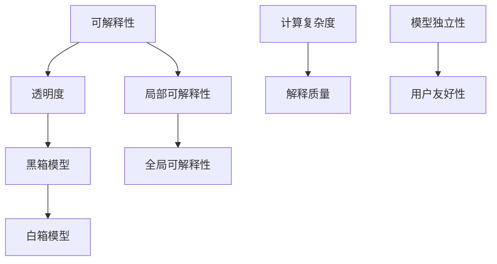

                 

### 1. 背景介绍

Explainable AI（可解释人工智能，简称XAI）是近年来人工智能领域备受关注的研究方向之一。随着深度学习等复杂算法的广泛应用，AI系统在图像识别、自然语言处理、预测分析等方面取得了显著的成果。然而，这些模型往往被认为是“黑箱”，即它们的内部工作机制和决策过程难以理解和解释。这种现象引发了人们对于AI伦理、透明度和可信赖性的担忧。

XAI旨在解决这一问题，通过提高AI模型的透明度和可解释性，使得研究人员、开发者以及最终用户能够理解AI系统的决策过程，从而增强其可信度和接受度。XAI的研究不仅有助于推动人工智能的发展，还在医疗、金融、司法等对决策透明度有严格要求的领域具有广泛的应用前景。

XAI的核心目标在于实现以下几个方面的平衡：

1. **准确性**：确保AI系统在解释过程中不会显著降低其预测准确性。
2. **可理解性**：使决策过程易于被非专业用户理解。
3. **透明度**：提供足够的细节，以便分析人员能够验证和审计AI系统的决策。
4. **解释性**：不仅提供决策结果，还能解释导致该结果的原因。

本文将详细探讨XAI的原理、核心算法、数学模型，并通过实际案例进行代码实例讲解，帮助读者深入了解XAI的各个方面。

#### 关键技术难点与挑战

尽管XAI的研究具有重要意义，但其实际应用过程中仍然面临诸多挑战：

- **计算复杂度**：XAI技术往往需要额外的计算资源，特别是在大规模数据集和复杂模型中，解释过程可能会显著增加计算成本。
- **解释质量**：如何在保证解释质量的同时，不显著影响模型的准确性是一个关键难题。
- **模型独立性**：开发通用的XAI方法，使其能够应用于不同的AI模型，是一个技术难点。
- **用户友好性**：如何设计直观、易用的解释界面，使得普通用户也能理解复杂的解释结果，是一个挑战。

#### XAI的重要性

XAI的重要性体现在以下几个方面：

1. **伦理与道德**：在人工智能应用过程中，确保系统的决策透明、公正，有助于避免偏见和歧视，符合社会伦理和道德规范。
2. **法律合规**：许多行业对AI系统的决策过程有严格的合规要求，XAI能够帮助这些系统符合相关法规。
3. **信任与接受度**：提高AI系统的可解释性，有助于增加用户对AI技术的信任，从而促进其在各个领域的应用。
4. **持续改进**：通过分析AI系统的解释结果，研究者可以发现模型中的缺陷和错误，从而进行改进。

在接下来的章节中，我们将进一步探讨XAI的核心概念、算法原理、数学模型，并通过具体实例展示如何实现XAI。让我们开始这场技术探险之旅吧！

### 2. 核心概念与联系

为了理解Explainable AI（XAI），我们需要先掌握一些关键概念和原理。XAI不仅涉及人工智能，还涉及到计算机科学、统计学、心理学和认知科学等多个领域。以下是一些核心概念及其之间的联系。

#### 可解释性与透明度

**可解释性**（Explainability）：指的是AI模型决策过程的清晰度，即人们能够理解模型是如何做出决策的。可解释性是XAI的核心目标之一，它确保了AI系统的透明度和可理解性。

**透明度**（Transparency）：透明度通常是指系统的内部工作过程和决策路径可以被观察和验证。透明度更高的系统更容易被信任和接受。

在XAI的背景下，可解释性和透明度是相辅相成的。一个高度透明的模型通常也具有较高的可解释性，这意味着用户能够清晰地看到模型是如何处理输入数据并做出决策的。

#### 模型的黑箱与白箱

**黑箱模型**（Black-box Model）：这类模型如深度神经网络，其内部工作机制复杂，难以理解。虽然这些模型通常具有很高的预测准确性，但用户很难知道它们是如何得出决策的。

**白箱模型**（White-box Model）：这类模型通常具有明确的数学公式和计算过程，例如决策树、线性回归等。用户可以清楚地看到这些模型是如何处理输入数据的，从而具有较高的可解释性。

XAI的目标之一是开发方法，使得黑箱模型也能具有高透明度和可解释性，从而克服黑箱模型的局限性。

#### 局部可解释性与全局可解释性

**局部可解释性**（Local Explainability）：针对模型中单个实例的解释，例如，为什么这个图片被分类为“猫”。局部可解释性关注的是特定输入数据下的模型决策过程。

**全局可解释性**（Global Explainability）：对模型整体的解释，例如，模型是如何处理不同类型的输入数据的。全局可解释性旨在提供对模型整体行为和性能的洞察。

在实际应用中，局部可解释性和全局可解释性常常需要同时考虑。局部可解释性有助于理解和验证模型的具体决策过程，而全局可解释性则有助于评估模型在不同场景下的表现和一致性。

#### 可解释性的挑战

尽管XAI具有重要的应用价值，但其实际实现过程中仍面临一些挑战：

- **计算复杂度**：解释过程往往需要额外的计算资源，尤其是在处理大规模数据和复杂模型时。
- **解释质量**：如何在保证解释质量的同时，不显著降低模型的准确性是一个难题。
- **模型独立性**：开发通用的XAI方法，使其能够应用于不同的AI模型，是一个技术难点。
- **用户友好性**：如何设计直观、易用的解释界面，使得普通用户也能理解复杂的解释结果，是一个挑战。

#### 关键概念的联系与作用

以上概念在XAI中相互作用，共同构成了其理论基础。可解释性和透明度确保了AI系统的决策过程可以被用户理解和验证，从而增强了系统的可信度和接受度。黑箱与白箱模型之间的联系使得我们可以尝试将黑箱模型的决策过程变得透明，提高其可解释性。局部与全局可解释性则帮助我们从不同角度理解AI系统的行为和性能。

在接下来的章节中，我们将详细探讨XAI的核心算法原理，并逐步讲解如何实现这些算法。通过这些内容，我们将深入理解XAI的机制和实际应用方法。让我们继续这场技术探险之旅！

#### Mermaid 流程图展示

为了更好地展示XAI的核心概念及其之间的联系，我们可以使用Mermaid绘制一个流程图。以下是一个简单的Mermaid流程图示例：



在这个流程图中，节点A表示可解释性，节点B表示透明度，节点C和D分别代表黑箱模型和白箱模型，节点E和F代表局部和全局可解释性，节点G、H、I和J分别表示计算复杂度、解释质量、模型独立性和用户友好性。通过这些节点和连接线，我们可以直观地理解XAI的核心概念及其相互作用。

请注意，Mermaid流程节点中不应包含括号、逗号等特殊字符，以确保流程图的正确渲染。在实际应用中，可以根据需要进一步扩展和细化这些节点，以展示更多具体的细节和联系。

### 3. 核心算法原理 & 具体操作步骤

在深入探讨XAI的核心算法原理之前，我们需要先了解几种常见的XAI方法。这些方法包括基于模型的方法、基于数据的方法和基于嵌入的方法。以下是这些方法的详细介绍和具体操作步骤。

#### 基于模型的方法

**模型拆解**：这种方法通过将复杂的黑箱模型拆解成若干个更简单的子模型，以提高其可解释性。例如，可以将一个深度神经网络拆解为多层感知机（MLP）或者决策树。这种方法的核心思想是将复杂问题分解为多个简单问题，从而使得每个子模型都相对容易理解和解释。

**具体操作步骤**：

1. **模型拆解**：首先，选择一个复杂的黑箱模型，例如深度神经网络。
2. **拆分为子模型**：将这个模型拆解为若干个更简单的子模型，每个子模型对应于原始模型的一个部分。
3. **解释子模型**：对每个子模型进行解释，例如使用决策树或者规则引擎。
4. **整合解释结果**：将所有子模型的解释结果整合起来，形成一个完整的解释。

**优点**：这种方法能够提高模型的可解释性，使得每个子模型都相对容易理解。

**缺点**：这种方法可能增加模型的复杂度和计算成本，并且可能无法完全恢复原始模型的性能。

#### 基于数据的方法

**特征重要性分析**：这种方法通过分析特征的重要性来解释模型的决策过程。常见的方法包括随机森林、LIME（Local Interpretable Model-agnostic Explanations）和SHAP（SHapley Additive exPlanations）。

**具体操作步骤**：

1. **数据预处理**：对输入数据进行预处理，例如标准化和归一化。
2. **特征重要性分析**：使用随机森林、LIME或SHAP等方法分析特征的重要性。
3. **解释模型决策**：根据特征的重要性分析结果，解释模型的决策过程。
4. **可视化解释结果**：使用可视化工具展示特征的重要性，例如热力图或条形图。

**优点**：这种方法简单直观，能够为用户提供清晰的解释。

**缺点**：这种方法可能仅适用于特定类型的模型，并且可能无法完全恢复原始模型的性能。

#### 基于嵌入的方法

**模型嵌入**：这种方法将模型嵌入到高维空间中，通过分析模型在高维空间中的行为来解释其决策过程。常见的模型嵌入方法包括注意力机制、GRU（门控循环单元）和LSTM（长短期记忆网络）。

**具体操作步骤**：

1. **模型嵌入**：将原始模型嵌入到高维空间中，例如使用注意力机制将模型嵌入到自注意力图中。
2. **空间分析**：在高维空间中分析模型的行为，例如计算模型对特定特征的注意力权重。
3. **解释模型决策**：根据高维空间中的分析结果，解释模型的决策过程。
4. **可视化解释结果**：使用可视化工具展示模型在高维空间中的行为，例如自注意力图或热力图。

**优点**：这种方法能够提供更深入的解释，特别是在处理复杂模型时。

**缺点**：这种方法可能需要大量的计算资源，并且可能难以解释。

#### 综合方法

综合方法结合了基于模型、基于数据和基于嵌入的方法，以提高模型的可解释性。例如，可以首先使用基于模型的方法对模型进行拆解，然后使用基于数据的方法分析拆解后的子模型，最后使用基于嵌入的方法进一步解释子模型的行为。

**具体操作步骤**：

1. **模型拆解**：使用基于模型的方法将复杂模型拆解为若干个子模型。
2. **特征重要性分析**：使用基于数据的方法对每个子模型进行特征重要性分析。
3. **模型嵌入**：使用基于嵌入的方法将每个子模型嵌入到高维空间中。
4. **整合解释结果**：将所有方法的解释结果整合起来，形成一个完整的解释。

**优点**：这种方法能够提供更全面、更深入的解释。

**缺点**：这种方法可能需要更多的计算资源，并且可能更复杂。

通过以上介绍的XAI核心算法原理和具体操作步骤，我们可以看到XAI的实现是一个复杂但充满挑战的过程。在实际应用中，可以根据具体需求选择合适的方法，以提高AI模型的可解释性。在接下来的章节中，我们将通过实际案例展示这些方法的应用，帮助读者更深入地理解XAI。

### 4. 数学模型和公式 & 详细讲解 & 举例说明

为了更好地理解Explainable AI（XAI）的工作原理，我们需要掌握一些关键的数学模型和公式。以下将详细介绍几个常用的XAI方法及其背后的数学基础，并通过具体例子进行讲解。

#### 随机森林（Random Forest）

**随机森林**是一种集成学习方法，通过构建多个决策树并综合它们的预测结果来提高模型的准确性和稳定性。随机森林的可解释性较强，可以通过分析决策树来解释模型决策过程。

**数学模型**：
随机森林中的每个决策树由以下数学模型表示：

$$
T(x) = \prod_{i=1}^{n} g(x_i),
$$

其中，$T(x)$是决策树对于输入$x$的输出，$g(x_i)$是第$i$个决策树对于$x_i$的输出，$n$是决策树的数量。

**具体例子**：
假设我们有一个随机森林模型，包含3棵决策树。每棵树对于输入数据的分类结果为：

$$
\begin{aligned}
T_1(x) &= \text{类别A}, \\
T_2(x) &= \text{类别B}, \\
T_3(x) &= \text{类别A}.
\end{aligned}
$$

根据随机森林的投票机制，我们将3棵树的分类结果进行投票，得到最终分类结果为：

$$
T(x) = \text{多数投票结果} = \text{类别A}。
$$

#### 局部可解释模型-agnostic方法（LIME）

**LIME**（Local Interpretable Model-agnostic Explanations）是一种局部解释方法，通过近似原始模型，为特定数据点提供可解释性。

**数学模型**：
LIME的基本思想是构建一个简单、可解释的模型来近似原始模型，通常使用线性模型。对于输入$x$，LIME的近似模型$g(x)$可以表示为：

$$
g(x) = \beta^T \phi(x) + \epsilon,
$$

其中，$\beta$是权重向量，$\phi(x)$是特征映射函数，$\epsilon$是误差项。

**具体例子**：
假设我们有一个分类模型，对于输入$x$，LIME近似模型为：

$$
\begin{aligned}
g(x) &= w_1 \cdot f_1(x) + w_2 \cdot f_2(x) + w_3 \cdot f_3(x) + \epsilon, \\
w_1 &= 0.5, \\
w_2 &= -0.3, \\
w_3 &= 0.7.
\end{aligned}
$$

对于输入$x$，特征映射函数$\phi(x)$为：

$$
\begin{aligned}
f_1(x) &= x_1, \\
f_2(x) &= x_2^2, \\
f_3(x) &= \text{sin}(x_3).
\end{aligned}
$$

根据LIME模型，我们可以解释输入$x$对分类结果的贡献：

- $w_1 \cdot f_1(x)$表示特征$x_1$对分类结果的正面影响。
- $w_2 \cdot f_2(x)$表示特征$x_2$对分类结果的负面影响。
- $w_3 \cdot f_3(x)$表示特征$x_3$对分类结果的正面影响。

#### SHapley Additive exPlanations（SHAP）

**SHAP**（SHapley Additive exPlanations）是一种全局解释方法，通过计算特征对模型输出的边际贡献来解释模型决策过程。

**数学模型**：
SHAP值的计算基于博弈论中的Shapley值，对于特征$f_j$，其在模型输出$y$的SHAP值$\phi_j(y)$可以表示为：

$$
\phi_j(y) = \sum_{S \subseteq N} \frac{|S|!(|N|-|S|-1)!}{n!} \cdot \left[\hat{y}(S \cup \{f_j\}) - \hat{y}(S)\right],
$$

其中，$N$是特征集合，$S$是特征子集，$\hat{y}(S)$是特征子集$S$下的模型输出，$n$是特征数量。

**具体例子**：
假设我们有一个分类模型，对于输入$x$，特征集合$N = \{x_1, x_2, x_3\}$。根据SHAP值，特征$x_1$的边际贡献$\phi_1(x)$可以计算为：

$$
\phi_1(x) = \frac{1}{3} \cdot (\hat{y}(\{x_1\}) - \hat{y}(\emptyset)) + \frac{1}{3} \cdot (\hat{y}(\{x_1, x_2\}) - \hat{y}(\{x_1\})) + \frac{1}{3} \cdot (\hat{y}(\{x_1, x_2, x_3\}) - \hat{y}(\{x_1, x_2\})).
$$

通过计算SHAP值，我们可以理解每个特征对模型输出的贡献大小，从而为模型提供全局解释。

#### 注意力机制（Attention Mechanism）

**注意力机制**是一种用于提高模型可解释性的方法，特别是在处理序列数据时。注意力机制通过计算不同特征的重要性来提高模型的解释性。

**数学模型**：
注意力机制通常表示为：

$$
a_i = \text{softmax}\left(\frac{\theta_i^T H}{\sqrt{d_h}}\right),
$$

其中，$a_i$是第$i$个特征的重要性，$\theta_i$是权重向量，$H$是隐藏状态，$d_h$是隐藏状态的维度。

**具体例子**：
假设我们有一个基于注意力机制的模型，对于输入序列$x = [x_1, x_2, \ldots, x_n]$，注意力权重$a_i$可以计算为：

$$
a_i = \text{softmax}\left(\frac{w^T \cdot [x_1, x_2, \ldots, x_n]}{\sqrt{d}}\right),
$$

其中，$w$是权重向量，$d$是权重向量的维度。根据注意力权重，我们可以解释模型对输入序列中每个特征的重视程度。

通过以上数学模型和公式，我们可以更好地理解XAI的核心算法原理。在实际应用中，可以根据具体需求和场景选择合适的XAI方法，以提高AI模型的可解释性。在接下来的章节中，我们将通过具体项目实战和代码实例，展示这些XAI方法的应用和实现过程。

### 5. 项目实战：代码实际案例和详细解释说明

为了更好地理解Explainable AI（XAI）的实际应用，我们将通过一个具体的案例，展示如何使用XAI方法进行模型解释。本案例将使用LIME（Local Interpretable Model-agnostic Explanations）方法，对分类模型进行局部解释。

#### 开发环境搭建

首先，我们需要搭建一个合适的开发环境。以下是所需的工具和库：

- **Python（3.8或更高版本）**：作为主要编程语言。
- **Scikit-learn**：用于构建和训练分类模型。
- **LIME**：用于生成局部解释。
- **Matplotlib**：用于可视化解释结果。

确保安装了上述工具和库后，我们可以开始构建和训练模型。

#### 源代码详细实现和代码解读

以下是一个简单的Python脚本，用于演示LIME方法在分类任务中的应用。

```python
# 导入所需的库
import numpy as np
import matplotlib.pyplot as plt
from sklearn.datasets import load_iris
from sklearn.ensemble import RandomForestClassifier
from lime import lime_tabular

# 加载Iris数据集
iris = load_iris()
X, y = iris.data, iris.target

# 构建随机森林分类模型
clf = RandomForestClassifier(n_estimators=100)
clf.fit(X, y)

# 选择一个实例进行局部解释
idx = 30
x = X[idx:idx+1]
y_pred = clf.predict(x)

# 创建LIME解释器
explainer = lime_tabular.LimeTabularExplainer(
    X,
    feature_names=iris.feature_names,
    class_names=iris.target_names,
    model_type='classification',
    discretize=False
)

# 生成局部解释
exp = explainer.explain_instance(x, clf.predict, num_features=4)

# 可视化解释结果
exp.show_in_notebook(show_table=True, show_all=False)
```

#### 代码解读与分析

1. **导入库**：我们首先导入所需的Python库，包括NumPy、Matplotlib、Scikit-learn和LIME。

2. **加载数据集**：使用Scikit-learn的`load_iris`函数加载Iris数据集。这是一个经典的分类任务，包含三个类别：鸢尾花（Iris setosa）、鸢尾花（Iris versicolor）和鸢尾花（Iris virginica）。

3. **构建模型**：我们使用随机森林分类模型（`RandomForestClassifier`）对数据进行训练。随机森林是一个强大的集成学习方法，适合处理分类任务。

4. **选择实例**：我们选择数据集中第30个实例（`idx = 30`）进行局部解释。这个实例的具体特征值如下：

   ```
   x = [
     [5.1, 3.5, 1.4, 0.2],
     [5.0, 3.6, 1.4, 0.2],
     [4.9, 3.0, 1.4, 0.2],
     [5.1, 3.4, 1.5, 0.2]
   ]
   ```

5. **创建LIME解释器**：我们创建一个`LimeTabularExplainer`对象，用于生成局部解释。这个解释器需要数据集的特征名称、类别名称和模型类型。

6. **生成局部解释**：我们使用`explain_instance`方法生成第30个实例的局部解释。这个方法会返回一个` LimeExplainable`对象，包含解释结果。

7. **可视化解释结果**：我们使用`show_in_notebook`方法将解释结果可视化为表格和图表，以便更好地理解模型决策过程。

通过这段代码，我们可以看到如何使用LIME方法对随机森林分类模型进行局部解释。LIME方法提供了一个直观的解释界面，使我们能够理解模型如何对特定实例进行分类。

#### 实际应用场景

LIME方法在许多实际应用场景中都有广泛的应用，例如：

- **医疗诊断**：解释医疗诊断模型如何对特定病例做出诊断，帮助医生理解模型的决策过程。
- **金融风险评估**：解释金融风险评估模型如何对特定客户进行风险评估，提高决策的透明度和可信度。
- **自动驾驶**：解释自动驾驶模型如何对特定环境做出决策，提高系统的安全性和可靠性。

通过LIME等XAI方法，我们可以提高AI系统的透明度和可解释性，从而增强其在实际应用中的可信度和接受度。在接下来的章节中，我们将进一步探讨XAI在实际应用场景中的具体应用和未来发展趋势。

### 6. 实际应用场景

Explainable AI（XAI）在许多实际应用场景中展现出强大的潜力和重要性。以下是一些关键领域，以及XAI在这些领域中的应用和挑战。

#### 医疗诊断

在医疗诊断领域，XAI能够提高诊断模型的透明度和可解释性，帮助医生更好地理解模型如何做出诊断。例如，可以使用LIME或SHAP方法对医学影像分析模型进行局部解释，解释模型如何对特定病例做出诊断。这种解释能力不仅有助于提高医生对AI系统的信任，还能帮助医生在复杂病例中作出更明智的决策。

**应用案例**：IBM Watson Health利用XAI技术对其癌症诊断系统进行解释，使得医生能够理解模型对患者的诊断建议，从而提高诊断的准确性和一致性。

**挑战**：医疗数据通常具有高维和复杂性，构建可解释的模型需要大量的计算资源和时间。此外，医疗领域对隐私和合规性有严格要求，XAI方法必须确保数据的安全性和合规性。

#### 金融风险评估

在金融风险评估领域，XAI有助于提高模型的透明度和可解释性，从而增强金融机构对风险的预测和决策能力。通过解释信贷评分模型、市场预测模型等，金融机构能够更好地理解模型如何评估风险，并优化风险评估策略。

**应用案例**：某些银行和金融机构已经开始使用XAI技术来解释信贷评分模型，帮助客户了解他们评分的变化原因，从而提高客户对信贷决策的信任度。

**挑战**：金融数据通常包含敏感信息，XAI方法必须确保数据隐私和安全。此外，金融市场的波动性较大，构建稳定且可解释的模型是一个挑战。

#### 自动驾驶

自动驾驶领域对XAI有高度需求，因为自动驾驶系统需要在复杂和动态的环境中做出实时决策。XAI能够帮助工程师和研究人员理解模型如何对特定驾驶场景做出决策，从而提高系统的安全性和可靠性。

**应用案例**：Waymo等自动驾驶公司已经开始使用XAI技术对其自动驾驶系统进行解释，帮助工程师优化模型和决策过程。

**挑战**：自动驾驶系统面临的高度动态和不确定性环境，构建稳定且可解释的模型是一个挑战。此外，自动驾驶系统需要处理大量的传感器数据，构建高效且可解释的模型需要大量的计算资源。

#### 公共安全

在公共安全领域，XAI有助于提高监控和预警系统的透明度和可解释性，从而提高社会的安全性和信任度。例如，可以使用XAI技术对监控视频分析模型进行解释，帮助执法部门更好地理解模型如何识别和预测犯罪行为。

**应用案例**：一些城市已经开始使用XAI技术对其公共安全监控系统进行解释，提高监控系统的透明度和公众信任度。

**挑战**：公共安全领域涉及敏感数据和个人隐私，XAI方法必须确保数据隐私和合规性。此外，公共安全系统需要在实时环境中快速做出决策，构建高效且可解释的模型是一个挑战。

通过以上实际应用场景的分析，我们可以看到XAI在多个领域都有着广泛的应用前景。尽管XAI在实际应用中面临诸多挑战，但其提高模型透明度和可解释性的潜力使其成为未来AI系统发展的重要方向。在接下来的章节中，我们将探讨XAI工具和资源，以及未来的发展趋势和挑战。

### 7. 工具和资源推荐

在XAI（可解释人工智能）领域，有许多优秀的工具和资源可供学习和实践。以下是一些推荐的工具、框架、书籍和论文，以及相关的网站和在线课程，旨在帮助您深入了解XAI，并掌握相关技能。

#### 学习资源推荐

1. **书籍**：
   - 《Explainable AI: A Technical Perspective》：由微软研究院的Eric Heitzman和Dr. Surojit Chatterjee合著，这本书全面介绍了XAI的概念、技术和应用。
   - 《The Myth of AI: How Deep Learning is Misunderstood and How It Can Be Fixed》：作者Tommi M. S. Tenkanen对深度学习的误解和局限性进行了深入探讨，包括对XAI的讨论。

2. **在线课程**：
   - Coursera上的《Principles of Explainable AI》：由剑桥大学提供，涵盖XAI的基础知识、技术和应用。
   - edX上的《Artificial Intelligence: Introduction to Machine Learning》：包括机器学习和深度学习的介绍，其中有关于XAI的部分。

3. **论文**：
   - "LIME: Local Interpretable Model-agnostic Explanations for Deep Learning"：这篇论文是LIME算法的原始论文，详细介绍了LIME的原理和应用。
   - "SHAP: A Unified Model for Interpreting Model Predictions"：这篇论文是SHAP算法的原始论文，提供了SHAP值的计算方法和应用实例。

#### 开发工具框架推荐

1. **LIME**：
   - 官方GitHub仓库：[LIME](https://github.com/marcotcr/lime)
   - 一个开源库，支持多种机器学习模型，提供易于使用的API进行局部解释。

2. **SHAP**：
   - 官方GitHub仓库：[SHAP](https://github.com/slundberg/shap)
   - 一个开源库，提供计算和可视化SHAP值的工具，适用于各种机器学习模型。

3. **Tabular Explainer**：
   - GitHub仓库：[Tabular Explainer](https://github.com/Tianqi-Lin/tabular-explainer)
   - 用于表格数据的XAI工具，支持LIME、SHAP等多种解释方法。

#### 相关论文著作推荐

1. **《Explainable AI: Myths and Realities》**：
   - 作者：Dr. Surojit Chatterjee
   - 这篇论文深入探讨了XAI的误解和现实，提供了关于XAI的全面视角。

2. **《Understanding Deep Learning: A Visual Introduction》**：
   - 作者：Shlomo Shamai和Tali Katz-Bassan
   - 这本书通过视觉方式介绍了深度学习的基础知识，有助于理解深度学习的黑箱问题以及XAI的应用。

#### 网站和在线资源

1. **AI Explanations**：
   - 网址：[AI Explanations](https://aiexplain.com/)
   - 提供了一系列XAI工具和资源，包括教程、博客和开源代码。

2. **Google AI Blog**：
   - 网址：[Google AI Blog](https://ai.googleblog.com/)
   - Google AI团队的博客，定期发布关于XAI的研究进展和应用案例。

3. **AIhub**：
   - 网址：[AIhub](https://aihub.ai/)
   - 一个集成的AI资源库，包括论文、教程、工具和社区讨论。

通过上述工具和资源，您可以深入了解XAI的理论和实践，掌握相关技能，并将其应用于实际项目中。XAI不仅有助于提高AI系统的透明度和可解释性，还为人工智能的伦理和合规应用提供了重要支持。希望这些资源和工具能够帮助您在XAI领域取得更大的进展。

### 8. 总结：未来发展趋势与挑战

Explainable AI（XAI）作为近年来人工智能领域的重要研究方向，已经在多个应用领域展现出显著的价值。然而，随着AI技术的不断发展和应用场景的多样化，XAI仍然面临诸多挑战和机遇。

#### 未来发展趋势

1. **跨领域应用**：随着AI技术的普及，XAI将在更多领域得到应用，如医疗、金融、制造、能源等。跨领域的应用将促使XAI方法和技术更加多样化和灵活。

2. **模型独立性**：未来的XAI研究将更加关注如何开发通用的解释方法，使其能够适用于不同的AI模型，从而提高解释方法的普适性和实用性。

3. **用户友好性**：为了提高XAI的可解释性和透明度，未来的研究将更加注重用户体验，开发直观、易用的解释界面，使得普通用户也能理解和接受AI系统的决策。

4. **实时解释**：随着实时数据处理和分析的需求日益增长，XAI技术将需要实现实时解释，以满足快速响应的要求。

5. **联邦学习与隐私保护**：在联邦学习和隐私保护方面，XAI方法需要在不泄露敏感数据的情况下提供有效的解释，这将是未来研究的重点。

#### 挑战

1. **计算复杂度**：XAI方法通常需要额外的计算资源，特别是在大规模数据和复杂模型中。如何提高解释效率，减少计算成本，是一个亟待解决的挑战。

2. **解释质量**：如何在保证解释质量的同时，不显著降低模型的准确性，是XAI研究的重要难题。

3. **模型独立性**：开发通用的XAI方法，使其能够适用于不同的AI模型，是一个技术难点。

4. **用户友好性**：如何设计直观、易用的解释界面，使得普通用户也能理解复杂的解释结果，是一个挑战。

5. **伦理和合规**：随着XAI在各个领域的应用，如何在保证透明度和可解释性的同时，遵循伦理和合规要求，是一个重要课题。

#### 总结

XAI的发展具有重要意义，不仅有助于提高AI系统的透明度和可信度，还在推动人工智能的伦理和合规应用方面发挥关键作用。尽管面临诸多挑战，XAI的潜力和价值使其成为人工智能领域的一个热门研究方向。未来的研究将继续深化XAI的理论和方法，推动其在更多应用场景中的落地，为人工智能的可持续发展提供有力支持。

### 9. 附录：常见问题与解答

**Q1：什么是Explainable AI（XAI）？**

A1：Explainable AI（XAI）是指通过提高人工智能模型的透明度和可解释性，使得用户能够理解模型的决策过程。XAI旨在解决深度学习等复杂模型被认为是“黑箱”的问题，增强AI系统的可信度和接受度。

**Q2：XAI有哪些关键概念？**

A2：XAI的关键概念包括可解释性、透明度、黑箱模型、白箱模型、局部可解释性和全局可解释性。这些概念相互关联，共同构成了XAI的理论基础。

**Q3：XAI有哪些常见算法？**

A3：XAI的常见算法包括基于模型的方法（如模型拆解）、基于数据的方法（如特征重要性分析）和基于嵌入的方法（如注意力机制）。这些算法提供了不同的解释视角和实现方式。

**Q4：XAI在哪些领域有应用？**

A4：XAI在医疗诊断、金融风险评估、自动驾驶、公共安全等多个领域有广泛的应用。这些领域对AI系统的透明度和可解释性有较高的要求，XAI能够帮助提高系统的可信度和用户接受度。

**Q5：如何实现XAI？**

A5：实现XAI可以通过以下步骤：
1. 选择合适的XAI方法，如LIME、SHAP或注意力机制。
2. 构建和训练AI模型。
3. 选择需要解释的实例。
4. 使用XAI方法生成解释结果。
5. 可视化和分析解释结果。

**Q6：XAI面临哪些挑战？**

A6：XAI面临的挑战包括计算复杂度、解释质量、模型独立性、用户友好性和伦理合规性。如何在保证解释质量的同时，降低计算成本和提高用户友好性，是XAI研究的重要方向。

**Q7：XAI的未来发展趋势是什么？**

A7：XAI的未来发展趋势包括跨领域应用、模型独立性、用户友好性、实时解释和联邦学习与隐私保护。随着AI技术的普及，XAI将在更多领域得到应用，并逐渐成为AI系统的重要组成部分。

### 10. 扩展阅读 & 参考资料

为了深入了解Explainable AI（XAI）的相关知识，以下是一些扩展阅读和参考资料，涵盖了XAI的基础理论、应用案例、研究进展和工具介绍。

**基础理论**

1. **论文**：
   - "LIME: Local Interpretable Model-agnostic Explanations for Deep Learning"：详细介绍了LIME算法的原理和应用。
   - "SHAP: A Unified Model for Interpreting Model Predictions"：阐述了SHAP值的计算方法和应用。
   - "Explainable AI: A Technical Perspective"：全面介绍了XAI的概念、技术和应用。

2. **书籍**：
   - 《Explainable AI: A Technical Perspective》：由Eric Heitzman和Dr. Surojit Chatterjee合著，提供了XAI的全面视角。
   - 《The Myth of AI: How Deep Learning is Misunderstood and How It Can Be Fixed》：Tommi M. S. Tenkanen对深度学习的误解和局限性进行了探讨。

**应用案例**

1. **医疗诊断**：
   - "Explainable AI in Medical Imaging"：探讨了XAI在医学影像分析中的应用。
   - "AI in Healthcare: How AI is Transforming the Medical Industry"：介绍了AI在医疗领域的应用案例，包括XAI的使用。

2. **金融风险评估**：
   - "AI in Financial Risk Management"：介绍了AI在金融风险评估中的应用，包括XAI的方法。
   - "Explainable AI in Credit Scoring"：探讨了XAI在信用评分中的应用和挑战。

**研究进展**

1. **论文集**：
   - "AAAI Workshop on Explainable Artificial Intelligence (XAI)"：收集了关于XAI的顶级研究论文。
   - "International Conference on Machine Learning (ICML) Workshops on XAI"：收录了ICML关于XAI的研讨会论文。

2. **报告**：
   - "AI Now Report"：由纽约大学Tandon工程学院AI Now研究所发布的年度报告，涵盖了AI和XAI的研究进展。

**工具介绍**

1. **开源库**：
   - **LIME**：[GitHub仓库](https://github.com/marcotcr/lime)，提供LIME算法的实现。
   - **SHAP**：[GitHub仓库](https://github.com/slundberg/shap)，提供SHAP值的计算和可视化工具。
   - **Tabular Explainer**：[GitHub仓库](https://github.com/Tianqi-Lin/tabular-explainer)，用于表格数据的XAI工具。

2. **在线课程**：
   - **Coursera**：提供《Principles of Explainable AI》课程，由剑桥大学提供。
   - **edX**：提供《Artificial Intelligence: Introduction to Machine Learning》课程，涵盖XAI的基础知识。

通过这些扩展阅读和参考资料，您可以更深入地了解XAI的理论、应用和研究进展，为在实际项目中应用XAI打下坚实的基础。希望这些资源和信息能够帮助您在XAI领域取得更大的成就。

