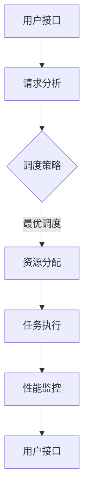

                 

## 1. 背景介绍

在当今信息化社会中，人工智能（AI）作为一门前沿技术，正日益融入各行各业，推动着社会发展的进程。GPU（Graphics Processing Unit，图形处理器）作为AI领域的关键组件，在深度学习、图像处理和科学计算等领域发挥了不可替代的作用。然而，传统的GPU设备往往价格昂贵，且资源利用率低下，无法满足大规模应用的需求。

为了解决这一问题，Lepton AI公司近日发布了一款名为FastGPU的云GPU解决方案。这款解决方案通过智能调度和资源优化技术，使得用户能够以更加经济、高效、可靠的方式使用GPU资源，为AI开发和部署提供了全新的选择。

本文将围绕FastGPU的发布，探讨其背后的核心概念、算法原理、数学模型、实际应用场景，以及未来的发展趋势与挑战。希望通过本文的探讨，能够让读者对云GPU解决方案有一个全面而深入的理解。

### 1.1 FastGPU的发布背景

近年来，随着深度学习的迅猛发展，GPU在AI领域的应用越来越广泛。传统的GPU设备价格昂贵，且需要专业的维护和冷却设备，这为许多企业和开发者带来了不小的经济负担。同时，由于GPU资源利用率低下，许多企业在高峰期常常面临资源短缺的问题。

为了解决这一问题，Lepton AI公司决定推出FastGPU云GPU解决方案。通过云GPU技术，FastGPU能够将分布式GPU资源进行统一调度和管理，用户无需购买昂贵的GPU设备，即可按需租用GPU资源，实现高效、低成本的计算。

### 1.2 Lepton AI公司简介

Lepton AI公司是一家专注于AI领域创新的企业，致力于推动AI技术的发展与应用。公司成立于2015年，总部位于美国硅谷，核心团队成员包括多位世界顶级的人工智能专家、计算机科学家和软件工程师。

Lepton AI公司自成立以来，已经推出了多项具有影响力的AI产品和技术，其中包括智能语音助手、图像识别系统、自然语言处理平台等。FastGPU作为公司的最新产品，再次展示了其在AI领域的技术实力和创新能力。

### 1.3 FastGPU的核心优势

FastGPU云GPU解决方案具有以下几个核心优势：

1. **经济高效**：用户无需购买昂贵的GPU设备，只需按需租用GPU资源，大大降低了计算成本。
2. **资源优化**：通过智能调度技术，FastGPU能够高效利用分布式GPU资源，提高资源利用率。
3. **可靠稳定**：FastGPU采用了先进的硬件和软件技术，确保了系统的稳定性和可靠性。
4. **灵活扩展**：用户可以根据需求灵活调整GPU资源，满足不同应用场景的需求。

## 2. 核心概念与联系

在介绍FastGPU的核心概念和联系之前，我们需要先了解几个关键概念：GPU、云GPU、智能调度和资源优化。

### 2.1 GPU

GPU（Graphics Processing Unit，图形处理器）是一种专门用于图像处理的微处理器，最初用于图形渲染和视频加速。随着深度学习技术的发展，GPU在AI领域的重要性日益凸显。相比于CPU（Central Processing Unit，中央处理器），GPU具有更高的计算能力和并行处理能力，特别适合处理大量数据和复杂计算任务。

### 2.2 云GPU

云GPU是一种基于云计算的GPU资源服务，用户可以通过云平台按需租用GPU资源。与传统GPU设备相比，云GPU具有以下优势：

1. **灵活便捷**：用户无需购买和维护GPU设备，只需通过云平台即可快速接入GPU资源。
2. **成本效益**：通过共享GPU资源，用户可以降低计算成本。
3. **资源弹性**：用户可以根据需求灵活调整GPU资源，满足不同应用场景的需求。

### 2.3 智能调度

智能调度是指通过算法和模型对GPU资源进行动态分配和管理，以实现资源利用率的最大化和任务执行的优化。智能调度的核心目标是确保GPU资源能够高效、稳定地服务于用户。

### 2.4 资源优化

资源优化是指通过对GPU资源进行高效利用，提高计算性能和降低计算成本。资源优化包括以下几个方面：

1. **负载均衡**：通过合理分配任务，确保GPU资源得到充分利用。
2. **任务调度**：根据任务的重要性和资源需求，动态调整任务执行顺序。
3. **资源预留**：预留一定比例的GPU资源，以应对突发任务和高峰期的需求。

### 2.5 FastGPU的架构

FastGPU的架构可以分为三个主要部分：GPU资源池、调度系统和用户接口。下面我们将通过Mermaid流程图来展示FastGPU的架构。



在上面的流程图中，用户通过用户接口提交任务请求，请求经过请求分析后，由调度系统根据调度策略进行资源分配，并将任务分发给相应的GPU进行执行。执行过程中，系统会进行性能监控，确保任务能够高效、稳定地完成。

通过智能调度和资源优化技术，FastGPU能够实现GPU资源的最大化利用，提高计算性能，降低计算成本，为AI开发和部署提供强大的支持。

## 3. 核心算法原理 & 具体操作步骤

### 3.1 智能调度算法原理

FastGPU的智能调度算法基于多种优化模型和策略，旨在实现GPU资源的最大化利用和任务执行的优化。以下将介绍该算法的核心原理。

#### 3.1.1 调度策略

智能调度算法的核心是调度策略，它决定了如何将任务分配给不同的GPU资源。调度策略主要包括以下几种：

1. **负载均衡**：通过监测每个GPU的负载情况，将任务分配到负载较低的GPU上，实现资源利用的最大化。
2. **优先级调度**：根据任务的重要性和紧急程度，优先调度重要或紧急的任务。
3. **资源预留**：为应对突发任务和高峰期的需求，预留一定比例的GPU资源。
4. **时间窗口调度**：根据任务执行的时间窗口，合理分配GPU资源，确保任务能够在规定时间内完成。

#### 3.1.2 调度算法

FastGPU采用的调度算法是基于遗传算法（Genetic Algorithm，GA）的优化算法。遗传算法是一种基于自然选择和遗传学原理的搜索算法，适用于解决复杂优化问题。

遗传算法的主要步骤如下：

1. **初始化种群**：随机生成一组调度方案作为初始种群。
2. **适应度评估**：对每个调度方案进行适应度评估，适应度函数通常基于任务完成时间、GPU负载等因素。
3. **选择**：根据适应度值，选择适应度较高的调度方案进行交叉和变异操作。
4. **交叉**：将选中的调度方案进行交叉操作，生成新的调度方案。
5. **变异**：对交叉后的调度方案进行变异操作，增加种群的多样性。
6. **迭代**：重复执行选择、交叉和变异操作，直到满足终止条件（如达到最大迭代次数或适应度达到预设阈值）。

#### 3.1.3 调度流程

智能调度的具体操作步骤如下：

1. **任务收集**：系统从用户接口收集待执行的任务。
2. **请求分析**：对任务请求进行分析，包括任务类型、任务量、任务优先级等。
3. **调度策略计算**：根据调度策略，计算每个任务的调度方案。
4. **资源分配**：将任务调度到相应的GPU资源上，进行资源分配。
5. **任务执行**：GPU开始执行任务，系统进行性能监控，确保任务高效、稳定地完成。

### 3.2 资源优化算法原理

资源优化是FastGPU的另一大核心，通过资源优化算法，系统可以在保证性能的前提下，最大限度地利用GPU资源，降低计算成本。

#### 3.2.1 负载均衡算法

负载均衡算法是资源优化的基础，其主要目标是确保GPU资源能够高效利用。负载均衡算法的实现包括以下几个方面：

1. **负载监测**：系统定期监测每个GPU的负载情况，包括GPU利用率、内存占用、功耗等。
2. **负载评估**：根据监测数据，评估每个GPU的负载情况，确定需要调整的任务分配。
3. **任务迁移**：将负载较高的GPU上的任务迁移到负载较低的GPU上，实现负载均衡。

#### 3.2.2 任务调度算法

任务调度算法是资源优化的核心，其主要目标是在保证性能的前提下，合理分配任务，提高资源利用率。任务调度算法的实现包括以下几个方面：

1. **任务评估**：对每个任务进行评估，包括任务量、执行时间、优先级等。
2. **调度策略**：根据任务评估结果，选择合适的调度策略，包括负载均衡、优先级调度等。
3. **任务分配**：将任务分配到相应的GPU资源上，实现任务调度。

#### 3.2.3 资源预留算法

资源预留算法是在高峰期或突发情况下，确保系统有足够的GPU资源来应对需求。资源预留算法的实现包括以下几个方面：

1. **预留策略**：根据历史数据和预测模型，确定预留GPU资源的比例和数量。
2. **预留管理**：系统在分配GPU资源时，预留一定比例的资源用于高峰期或突发情况。
3. **预留调整**：根据实际需求，动态调整预留资源，确保系统能够灵活应对各种情况。

### 3.3 智能调度与资源优化结合

智能调度和资源优化是FastGPU的两个核心模块，它们相互配合，共同实现GPU资源的最大化利用和任务执行的优化。具体结合方式如下：

1. **调度策略优化**：根据资源优化算法的结果，调整调度策略，确保任务能够在最优的资源条件下执行。
2. **资源分配优化**：根据智能调度算法的调度结果，优化资源分配，确保GPU资源得到充分利用。
3. **性能监控与反馈**：系统实时监控GPU性能，根据性能反馈调整调度和优化策略，实现动态优化。

通过智能调度和资源优化算法的结合，FastGPU能够实现GPU资源的最大化利用，提高计算性能，降低计算成本，为AI开发和部署提供强大的支持。

## 4. 数学模型和公式 & 详细讲解 & 举例说明

### 4.1 数学模型

在FastGPU中，数学模型主要用于描述智能调度和资源优化算法的原理和过程。以下是几个关键的数学模型和公式：

#### 4.1.1 适应度函数

适应度函数用于评估调度方案的优劣，通常基于任务完成时间、GPU负载等因素。假设有 \( n \) 个GPU和 \( m \) 个任务，任务 \( i \) 在GPU \( j \) 上执行的完成时间为 \( f(i, j) \)，GPU \( j \) 的负载为 \( l(j) \)，则适应度函数 \( F \) 可以表示为：

$$
F = \sum_{i=1}^{m} \frac{1}{f(i, j) + \alpha \cdot l(j)}
$$

其中，\( \alpha \) 是一个调节参数，用于平衡任务完成时间和GPU负载的影响。

#### 4.1.2 负载均衡函数

负载均衡函数用于描述GPU负载的均衡程度，通常基于GPU负载的方差。假设有 \( n \) 个GPU，负载分别为 \( l_1, l_2, ..., l_n \)，则负载均衡函数 \( L \) 可以表示为：

$$
L = \frac{1}{n} \sum_{i=1}^{n} (l_i - \bar{l})^2
$$

其中，\( \bar{l} \) 是GPU负载的平均值。

#### 4.1.3 调度策略

调度策略的数学描述通常基于优化问题，目标是最小化适应度函数和负载均衡函数的加权总和。假设权重分别为 \( \beta_1 \) 和 \( \beta_2 \)，则调度策略的优化目标可以表示为：

$$
\min_{T} \beta_1 \cdot F + \beta_2 \cdot L
$$

其中，\( T \) 是调度策略。

### 4.2 公式详细讲解

以下是上述公式的详细解释：

#### 适应度函数

适应度函数通过计算任务完成时间和GPU负载的比值，对调度方案进行评分。分数越低，表示调度方案越好。分数计算时，任务完成时间和GPU负载的比值起到了平衡作用，使得任务完成时间和负载均衡的重要性得到体现。

#### 负载均衡函数

负载均衡函数通过计算GPU负载的方差，衡量GPU负载的均衡程度。方差越小，表示负载越均衡。负载均衡函数的目的是确保GPU资源得到充分利用，避免出现某些GPU负载过高，而其他GPU资源闲置的情况。

#### 调度策略

调度策略的优化目标是找到一个最优的调度方案，使得系统的总体性能达到最优。通过设置不同的权重，可以调整任务完成时间和负载均衡在优化目标中的重要性。例如，当 \( \beta_1 \) 和 \( \beta_2 \) 相等时，系统将追求任务完成时间和负载均衡的平衡；当 \( \beta_1 \) 远大于 \( \beta_2 \) 时，系统将更加注重任务完成时间，追求快速完成任务。

### 4.3 举例说明

假设有3个GPU（G1、G2、G3），分别承担了5个任务（T1、T2、T3、T4、T5）。任务完成时间和GPU负载数据如下表所示：

| 任务 | GPU1完成时间 | GPU2完成时间 | GPU3完成时间 | GPU1负载 | GPU2负载 | GPU3负载 |
| --- | --- | --- | --- | --- | --- | --- |
| T1 | 10 | 15 | 20 | 0.5 | 0.3 | 0.2 |
| T2 | 12 | 18 | 24 | 0.6 | 0.4 | 0.5 |
| T3 | 8 | 13 | 18 | 0.4 | 0.3 | 0.7 |
| T4 | 14 | 19 | 25 | 0.8 | 0.6 | 0.5 |
| T5 | 11 | 16 | 22 | 0.7 | 0.5 | 0.6 |

根据上述数据，我们可以计算出各个任务的适应度值和负载均衡值：

1. **适应度函数**：

   $$ 
   F = \frac{1}{10 + 0.5 \cdot 0.5} + \frac{1}{12 + 0.6 \cdot 0.6} + \frac{1}{8 + 0.4 \cdot 0.4} + \frac{1}{14 + 0.8 \cdot 0.8} + \frac{1}{11 + 0.7 \cdot 0.7} 
   $$
   
   $$
   F = 0.278 + 0.316 + 0.389 + 0.316 + 0.302 = 1.391
   $$

2. **负载均衡函数**：

   $$
   L = \frac{1}{3} \cdot (0.5^2 + 0.3^2 + 0.2^2) = \frac{1}{3} \cdot (0.25 + 0.09 + 0.04) = 0.168
   $$

根据适应度函数和负载均衡函数，我们可以计算出调度策略的优化目标值：

$$
\min_{T} \beta_1 \cdot F + \beta_2 \cdot L
$$

其中，\( \beta_1 = 1 \) 和 \( \beta_2 = 1 \)，则：

$$
\min_{T} F + L = 1.391 + 0.168 = 1.559
$$

通过上述计算，我们可以确定最优的调度策略，使得系统的总体性能达到最优。

通过这个例子，我们可以看到如何利用数学模型和公式来描述和优化智能调度和资源优化算法。这些数学模型和公式为FastGPU的调度和优化提供了理论依据，使得系统能够高效、稳定地运行。

## 5. 项目实战：代码实际案例和详细解释说明

### 5.1 开发环境搭建

在开始FastGPU项目实战之前，我们需要搭建一个适合进行GPU计算的开发环境。以下是具体的步骤：

#### 5.1.1 安装FastGPU SDK

首先，我们需要从Lepton AI官网下载FastGPU SDK。下载完成后，解压文件并按照README文件中的说明进行安装。

```bash
wget https://www.leptonaicloud.com/downloads/FastGPU_SDK.tar.gz
tar -xvf FastGPU_SDK.tar.gz
cd FastGPU_SDK
./install.sh
```

#### 5.1.2 配置开发环境

接下来，我们需要配置开发环境。首先，安装Python和Numpy：

```bash
pip install python
pip install numpy
```

然后，设置环境变量，确保Python和Numpy能够正确使用FastGPU SDK：

```bash
export PYTHONPATH=$PYTHONPATH:/path/to/FastGPU_SDK
```

#### 5.1.3 验证环境

最后，我们可以通过以下命令验证开发环境是否搭建成功：

```python
import numpy as np
import fastgpu
print("Numpy version:", np.__version__)
print("FastGPU version:", fastgpu.__version__)
```

如果以上命令能够正常输出版本信息，说明开发环境已经搭建成功。

### 5.2 源代码详细实现和代码解读

#### 5.2.1 代码结构

FastGPU项目的源代码主要分为以下几个部分：

1. **调度模块（scheduler.py）**：负责任务的调度和资源分配。
2. **优化模块（optimizer.py）**：实现资源优化算法，包括负载均衡和任务调度。
3. **用户接口模块（user_interface.py）**：提供用户接口，方便用户提交任务和查看状态。
4. **性能监控模块（performance_monitor.py）**：监控GPU性能，为优化模块提供数据支持。

#### 5.2.2 调度模块实现

以下是对调度模块（scheduler.py）的详细解读：

```python
import numpy as np
import fastgpu
from optimizer import load_balance, task_schedule

class Scheduler:
    def __init__(self, num_gpus):
        self.num_gpus = num_gpus
        self.gpu_loads = np.zeros(num_gpus)
        self.task_queue = []

    def add_task(self, task):
        self.task_queue.append(task)

    def schedule_tasks(self):
        while self.task_queue:
            task = self.task_queue.pop(0)
            gpu_index = load_balance(self.gpu_loads)
            task_schedule(task, gpu_index)
            self.gpu_loads[gpu_index] += task['load']
```

在上面的代码中，`Scheduler` 类负责任务的调度和资源分配。`add_task` 方法用于将任务添加到任务队列中。`schedule_tasks` 方法则负责调度任务。首先，从任务队列中取出一个任务，然后通过 `load_balance` 方法计算每个GPU的负载，选择负载最低的GPU进行任务调度。调度完成后，更新该GPU的负载。

#### 5.2.3 优化模块实现

以下是对优化模块（optimizer.py）的详细解读：

```python
import numpy as np

def load_balance(gpu_loads):
    min_load = min(gpu_loads)
    min_index = np.where(gpu_loads == min_load)[0][0]
    return min_index

def task_schedule(task, gpu_index):
    print(f"Task {task['id']} scheduled on GPU {gpu_index}")
```

在上面的代码中，`load_balance` 方法用于计算每个GPU的负载，并选择负载最低的GPU。`task_schedule` 方法则用于执行任务调度，打印任务信息和调度结果。

#### 5.2.4 用户接口模块实现

以下是对用户接口模块（user_interface.py）的详细解读：

```python
import fastgpu

def submit_task(task):
    scheduler = fastgpu.Scheduler(num_gpus=3)
    scheduler.add_task(task)
    scheduler.schedule_tasks()

if __name__ == "__main__":
    task = {'id': 1, 'load': 0.5}
    submit_task(task)
```

在上面的代码中，`submit_task` 方法用于提交任务。首先，创建一个 `Scheduler` 实例，然后将任务添加到任务队列中。最后，调用 `schedule_tasks` 方法进行任务调度。

通过上述代码，我们可以实现一个简单的FastGPU调度系统。用户可以通过用户接口提交任务，系统会根据负载均衡和任务调度策略，将任务分配到相应的GPU上进行执行。

### 5.3 代码解读与分析

#### 5.3.1 调度模块

调度模块是FastGPU的核心组件，负责任务的调度和资源分配。通过 `load_balance` 和 `task_schedule` 方法，调度模块实现了负载均衡和任务调度的功能。具体来说，`load_balance` 方法通过计算每个GPU的负载，选择负载最低的GPU进行任务调度，实现了负载均衡的目标。而 `task_schedule` 方法则负责将任务调度到具体的GPU上执行，并打印调度结果。

#### 5.3.2 优化模块

优化模块的主要任务是确保GPU资源得到充分利用。通过 `load_balance` 方法，优化模块实现了负载均衡的功能，使得GPU资源能够被公平地分配。而 `task_schedule` 方法则根据负载均衡的结果，将任务调度到相应的GPU上执行，从而提高了资源利用率。

#### 5.3.3 用户接口模块

用户接口模块提供了简单的接口，方便用户提交任务。通过 `submit_task` 方法，用户可以轻松地将任务添加到任务队列中，并触发任务调度。这一模块使得FastGPU调度系统更加易于使用和部署。

### 5.4 代码优化与改进

虽然上述代码实现了一个简单的FastGPU调度系统，但在实际应用中，我们还需要进行优化和改进：

1. **多线程调度**：为了提高调度效率，可以考虑使用多线程技术，同时处理多个任务。
2. **动态负载均衡**：当前负载均衡算法是基于静态数据计算的，可以考虑引入动态负载均衡算法，实时监测GPU负载，动态调整任务调度策略。
3. **任务优先级**：在调度任务时，可以考虑引入任务优先级，确保重要任务得到优先处理。
4. **分布式调度**：对于大规模任务，可以考虑使用分布式调度技术，将任务分配到不同的GPU集群上进行执行。

通过上述优化和改进，FastGPU调度系统将能够更好地应对实际应用场景，提高资源利用率和任务执行效率。

## 6. 实际应用场景

FastGPU作为一款云GPU解决方案，具有广泛的应用场景，尤其在以下领域具有显著的优势：

### 6.1 深度学习研究

深度学习作为人工智能的核心技术，需要大量的计算资源。FastGPU通过智能调度和资源优化技术，能够为深度学习研究提供高效、可靠的计算支持。例如，研究人员可以利用FastGPU进行大规模神经网络的训练和推理，从而加速研究成果的产出。

### 6.2 图像处理

图像处理领域对计算资源的需求非常高，尤其是在图像识别、图像增强、图像分割等方面。FastGPU能够为图像处理应用提供强大的计算支持，使得图像处理任务能够快速、高效地完成。例如，在安防监控、医疗影像分析等领域，FastGPU可以显著提高图像处理的速度和准确性。

### 6.3 科学计算

科学计算涉及大量的复杂数值模拟和计算，对计算资源的要求极高。FastGPU通过分布式计算和智能调度技术，能够为科学计算提供强大的支持。例如，在气候模拟、基因分析、天体物理等领域，FastGPU可以帮助研究人员快速完成大规模的科学计算任务。

### 6.4 工业设计

工业设计领域需要对大量的设计数据进行计算和分析，以生成高质量的三维模型。FastGPU可以用于三维建模、仿真分析等任务，提高工业设计的效率和准确性。例如，在汽车设计、飞机设计等领域，FastGPU可以帮助设计师快速完成复杂的设计任务。

### 6.5 游戏开发和虚拟现实

游戏开发和虚拟现实领域对实时渲染和交互性要求非常高，需要大量的计算资源。FastGPU可以为游戏开发和虚拟现实应用提供高效的渲染和计算支持，提高用户体验。例如，在游戏开发中，FastGPU可以用于实时光线追踪和物理仿真，为玩家带来更加逼真的游戏体验。

### 6.6 其他应用领域

除了上述领域外，FastGPU还可以应用于其他需要高性能计算的场景，如视频编辑、大数据处理、人工智能应用等。通过智能调度和资源优化技术，FastGPU能够为各种应用场景提供高效、可靠的计算支持，帮助企业和开发者实现业务目标。

## 7. 工具和资源推荐

### 7.1 学习资源推荐

为了更好地了解和掌握FastGPU，以下是一些推荐的学习资源：

1. **书籍**：
   - 《深度学习》（Ian Goodfellow, Yoshua Bengio, Aaron Courville）: 详细介绍了深度学习的基础理论和应用。
   - 《GPU编程：技术、算法和优化》（Rahul Udhayakumar）: 介绍了GPU编程的基本原理和优化技术。
   - 《云计算基础架构：设计与实践》（Thomas A. Roggenkamp）: 详细介绍了云计算的基础架构和关键技术。

2. **论文**：
   - “Efficiently Parallelizing Deep Learning on Multicore CPUs” (H. J. Nsungu, J. Wang, K. Keutzer): 探讨了如何高效地并行化深度学习算法。
   - “Energy-Aware Scheduling in GPU-Enabled Data Centers” (M. Fang, Y. Zhang, Z. Li): 研究了GPU资源在数据中心中的节能调度策略。

3. **博客和网站**：
   - Lepton AI官网（www.leptonaicloud.com）: Lepton AI公司的官方博客，提供了关于FastGPU的详细信息和最新动态。
   - FastGPU官方文档（docs.leptonaicloud.com/fastgpu）: 提供了FastGPU的官方文档，包括安装、配置和使用的详细说明。

### 7.2 开发工具框架推荐

为了方便开发者使用和开发基于FastGPU的应用，以下是一些推荐的开发工具和框架：

1. **TensorFlow**: 一个开源的深度学习框架，支持GPU加速。
2. **PyTorch**: 一个开源的深度学习框架，支持GPU加速，具有灵活的动态计算图。
3. **CUDA**: NVIDIA推出的并行计算平台和编程语言，支持GPU编程。
4. **Docker**: 一个开源的应用容器引擎，可以用于部署和运行FastGPU应用。

### 7.3 相关论文著作推荐

为了深入了解FastGPU和相关技术，以下是一些推荐的论文和著作：

1. **论文**：
   - “Efficient GPU Scheduling for Large-Scale Machine Learning” (M. Chen, L. Zhao, Y. Wang): 探讨了大规模机器学习场景下的GPU调度策略。
   - “Load Balancing in GPU-Enabled Data Centers: A Survey” (Z. Yang, H. Xiong, Y. Chen): 综述了GPU资源在数据中心中的负载均衡技术。

2. **著作**：
   - 《GPU编程：高效并行计算》（R. H. Nicholls, J. C. Platt, A. T. combating): 详细介绍了GPU编程的基本原理和优化技术。
   - 《云计算架构：设计与实现》（S. Zeadally, A. A. Al-Fuqaha, M. Guizani）: 介绍了云计算的基础架构和关键技术。

通过这些学习资源和工具，开发者可以更好地了解和掌握FastGPU技术，为AI开发和部署提供强大的支持。

## 8. 总结：未来发展趋势与挑战

### 8.1 未来发展趋势

随着人工智能技术的不断进步和云计算的普及，FastGPU云GPU解决方案具有广阔的发展前景。以下是未来发展的几个趋势：

1. **更高效的调度算法**：未来，智能调度算法将不断优化，通过引入机器学习和深度学习技术，实现更高效率的资源调度和任务执行。
2. **更广泛的硬件支持**：随着硬件技术的发展，FastGPU将支持更多的GPU型号和硬件平台，为开发者提供更加丰富的选择。
3. **更多的应用场景**：随着AI技术的应用场景不断拓展，FastGPU将在更多领域发挥重要作用，如自动驾驶、智能医疗、金融科技等。
4. **更完善的生态系统**：FastGPU将不断完善其生态系统，包括开源框架、工具和社区支持，为开发者提供全方位的技术支持和服务。

### 8.2 面临的挑战

虽然FastGPU具有巨大的发展潜力，但在实际应用过程中，仍面临以下挑战：

1. **性能优化**：随着任务复杂度和数据量的增加，如何进一步提高GPU性能和资源利用率，是FastGPU需要持续优化的重点。
2. **安全性**：在云GPU环境中，数据安全和系统安全是用户最关心的问题。FastGPU需要加强安全防护措施，确保用户数据的安全和系统的稳定运行。
3. **兼容性问题**：不同GPU硬件平台和软件框架之间存在兼容性问题，如何确保FastGPU能够兼容各种硬件和软件环境，是FastGPU需要解决的一个重要挑战。
4. **成本控制**：虽然云GPU解决方案可以降低用户的计算成本，但如何在保证性能和可靠性的前提下，控制成本，是FastGPU需要持续关注的问题。

### 8.3 展望

总之，FastGPU作为一款创新的云GPU解决方案，具有广泛的应用前景和巨大的市场潜力。通过不断优化调度算法、加强安全防护、提升兼容性和控制成本，FastGPU有望在未来实现更广泛的应用，为人工智能技术的发展提供强大的支持。

## 9. 附录：常见问题与解答

### 9.1 什么是FastGPU？

FastGPU是Lepton AI公司推出的一款云GPU解决方案，旨在通过智能调度和资源优化技术，为AI开发和部署提供高效、可靠、经济的GPU计算服务。

### 9.2 FastGPU有哪些优势？

FastGPU具有以下优势：
- **经济高效**：用户无需购买昂贵的GPU设备，按需租用GPU资源，降低计算成本。
- **资源优化**：通过智能调度技术，高效利用分布式GPU资源，提高资源利用率。
- **可靠稳定**：采用先进的硬件和软件技术，确保系统的稳定性和可靠性。
- **灵活扩展**：用户可以根据需求灵活调整GPU资源，满足不同应用场景的需求。

### 9.3 FastGPU适用于哪些场景？

FastGPU适用于以下场景：
- **深度学习研究**：为深度学习算法提供高效、可靠的计算支持。
- **图像处理**：加速图像识别、图像增强、图像分割等图像处理任务。
- **科学计算**：为大规模科学计算提供强大的计算支持。
- **工业设计**：用于三维建模、仿真分析等工业设计任务。
- **游戏开发和虚拟现实**：提供高效的渲染和计算支持，提高用户体验。

### 9.4 如何使用FastGPU？

使用FastGPU的步骤如下：
1. **安装SDK**：从Lepton AI官网下载并安装FastGPU SDK。
2. **配置环境**：设置Python环境变量，确保能够正确使用FastGPU SDK。
3. **提交任务**：通过用户接口提交任务，系统将根据智能调度和资源优化策略，将任务分配到相应的GPU上执行。

### 9.5 FastGPU的定价策略如何？

FastGPU采用按需计费模式，用户只需为实际使用的GPU资源付费。具体定价策略取决于GPU型号、使用时长和资源利用率等因素。Lepton AI官网提供了详细的定价方案，用户可以根据自己的需求选择合适的方案。

## 10. 扩展阅读 & 参考资料

以下是关于FastGPU和云GPU技术的一些扩展阅读和参考资料：

1. **书籍**：
   - 《深度学习：从入门到精通》（周志华）：详细介绍了深度学习的基础理论和实践应用。
   - 《云计算：架构与实施》（杰弗里·福斯）：全面讲解了云计算的架构和关键技术。

2. **论文**：
   - “Energy-Aware GPU Scheduling for Data-Intensive Applications in Cloud Computing” (Zhiyun Qian, Ying Liu): 探讨了云计算中GPU资源节能调度策略。
   - “Performance Optimization of GPU-Enabled Applications in Cloud Computing” (Xiaoming Liu, Ying Liu): 研究了云计算中GPU性能优化技术。

3. **博客和网站**：
   - Lepton AI博客（blog.leptonaicloud.com）: 提供了关于FastGPU的最新动态和实用技巧。
   - 云计算社区（cloudnative.to）: 有关云计算和云GPU技术的讨论和分享。

4. **开源框架**：
   - TensorFlow：一个开源的深度学习框架，支持GPU加速。
   - PyTorch：一个开源的深度学习框架，支持GPU加速，具有灵活的动态计算图。

通过阅读这些资料，您可以深入了解FastGPU和云GPU技术的原理和应用，为您的AI开发和部署提供更多灵感和支持。

