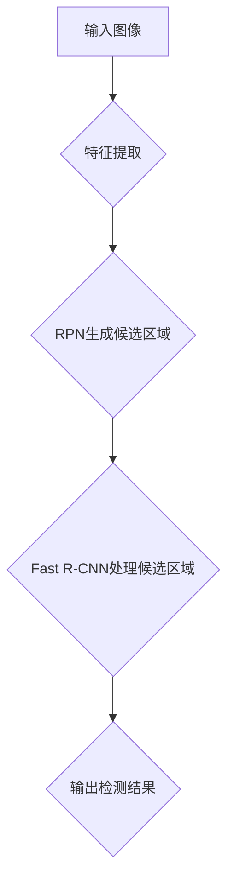

                 

# Faster R-CNN原理与代码实例讲解

## 关键词：
目标检测，深度学习，Faster R-CNN，区域建议网络（RPN），物体识别

## 摘要：
本文将深入探讨Faster R-CNN（Region-based Convolutional Neural Network）的目标检测算法。我们将从背景介绍开始，逐步解析核心概念、算法原理、数学模型，并通过实际代码实例，详细讲解其实现和应用。最后，本文还将探讨Faster R-CNN在实际应用场景中的表现，并提供相关的学习资源和开发工具推荐。

## 1. 背景介绍

目标检测是计算机视觉领域的一项基础技术，旨在定位图像中的多个对象并识别它们的类别。随着深度学习技术的发展，卷积神经网络（CNN）在图像识别方面取得了显著进展。然而，传统的CNN模型在处理复杂场景时，往往只能识别单个对象，难以同时定位和识别多个对象。为了解决这一问题，研究者们提出了区域建议网络（RPN）和Faster R-CNN等目标检测算法。

Faster R-CNN（Region-based Convolutional Neural Network）是一种基于深度学习的目标检测算法，由Shaoqing Ren等人于2015年提出。它通过结合区域建议网络（RPN）和卷积神经网络（CNN），实现了高效、准确的目标检测。Faster R-CNN在多个公开数据集上取得了优异的性能，成为目标检测领域的代表性算法之一。

## 2. 核心概念与联系

### 2.1 区域建议网络（RPN）

区域建议网络（Region Proposal Network，RPN）是Faster R-CNN的关键组成部分。它的主要任务是从输入图像中生成高质量的候选区域，这些区域很可能包含目标对象。RPN利用卷积神经网络提取图像的特征图，并在特征图上定义滑动窗口，以生成候选区域。

### 2.2 卷积神经网络（CNN）

卷积神经网络（Convolutional Neural Network，CNN）是一种深度学习模型，特别适用于图像处理任务。它通过多层卷积和池化操作，逐步提取图像的层次特征，最终实现图像分类或目标检测。

### 2.3 Faster R-CNN架构

Faster R-CNN的架构包括两个主要部分：RPN和Fast R-CNN。RPN用于生成候选区域，Fast R-CNN则用于对候选区域进行分类和边界框回归。具体流程如下：

1. 使用卷积神经网络提取图像的特征图。
2. 在特征图上应用RPN，生成候选区域。
3. 对候选区域应用Fast R-CNN，进行分类和边界框回归。
4. 根据分类结果和边界框，输出检测结果。

### 2.4 Mermaid流程图



## 3. 核心算法原理 & 具体操作步骤

### 3.1 特征提取

Faster R-CNN使用卷积神经网络提取图像的特征。卷积神经网络通过卷积层和池化层逐步提取图像的层次特征，最终得到特征图。特征图的大小通常较小，但包含丰富的图像信息。

### 3.2 区域建议网络（RPN）

RPN是一个小型卷积神经网络，用于生成候选区域。具体操作步骤如下：

1. 在特征图上定义滑动窗口，每个窗口对应一个可能包含目标的区域。
2. 对每个窗口计算锚点（anchor），锚点是窗口中心点周围的一组预设尺寸和比例的矩形。
3. 对每个锚点计算与真实边界框的IoU（交并比），选取IoU较高的锚点作为候选区域。

### 3.3 Fast R-CNN处理候选区域

Fast R-CNN是一个基于深度学习的目标检测模型，用于对候选区域进行分类和边界框回归。具体操作步骤如下：

1. 对每个候选区域提取特征图上的特征。
2. 使用全连接层对特征进行分类和边界框回归。
3. 对分类结果和边界框进行NMS（非极大值抑制）处理，去除重叠的检测框。

### 3.4 输出检测结果

根据分类结果和边界框，输出检测结果。检测结果通常包括对象的类别和位置信息。

## 4. 数学模型和公式 & 详细讲解 & 举例说明

### 4.1 卷积神经网络（CNN）的数学模型

卷积神经网络通过卷积操作、激活函数和池化操作提取图像特征。以下是CNN的数学模型：

$$
h_{l}^{k} = \sigma \left( \sum_{i} w_{i}^{k} \times h_{l-1}^{i} + b^{k} \right)
$$

其中，$h_{l}^{k}$表示第$l$层第$k$个神经元的活动，$\sigma$表示激活函数（如ReLU函数），$w_{i}^{k}$和$b^{k}$分别表示第$l-1$层第$i$个神经元到第$l$层第$k$个神经元的权重和偏置。

### 4.2 RPN的数学模型

RPN通过锚点生成候选区域。锚点的计算公式如下：

$$
anchor = (x_c, y_c, w, h) = (x_c + \Delta x_i, y_c + \Delta y_i, \sqrt{\Delta w_i \Delta h_i}, \arctan(\Delta h_i / \Delta w_i))
$$

其中，$(x_c, y_c)$表示锚点的中心点坐标，$w$和$h$分别表示锚点的宽度和高度，$\Delta x_i$、$\Delta y_i$、$\Delta w_i$和$\Delta h_i$为锚点预设的尺寸和比例。

### 4.3 Fast R-CNN的数学模型

Fast R-CNN通过全连接层对特征进行分类和边界框回归。分类公式如下：

$$
\hat{y} = \text{softmax}(W^T \cdot h)
$$

其中，$\hat{y}$表示分类结果，$W$表示分类层的权重，$h$表示特征向量。

边界框回归公式如下：

$$
t = \text{softmax}(W^T \cdot h) \odot r
$$

其中，$t$表示边界框回归结果，$r$表示回归层的权重。

## 5. 项目实战：代码实际案例和详细解释说明

### 5.1 开发环境搭建

在开始编写代码之前，我们需要搭建一个合适的开发环境。以下是Python的安装步骤：

1. 访问Python官方网站（https://www.python.org/），下载适用于您操作系统的Python版本。
2. 安装Python，并确保将其添加到系统环境变量中。
3. 安装必要的Python库，如NumPy、Pandas和TensorFlow。

### 5.2 源代码详细实现和代码解读

以下是Faster R-CNN的简单实现，仅供参考：

```python
import tensorflow as tf
import tensorflow.keras as keras
from tensorflow.keras.models import Model
from tensorflow.keras.layers import Conv2D, Activation, Input, Reshape, Dense

# 定义卷积神经网络
def conv_block(x, num_filters):
    x = Conv2D(num_filters, kernel_size=(3, 3), padding='same')(x)
    x = Activation('relu')(x)
    return x

# 定义特征提取网络
def feature_extractor(inputs):
    x = conv_block(inputs, 64)
    x = conv_block(x, 64)
    x = conv_block(x, 128)
    x = conv_block(x, 128)
    return x

# 定义区域建议网络（RPN）
def region Proposal Network(inputs, num_anchors):
    x = Conv2D(num_anchors * 5, kernel_size=(3, 3), padding='same')(inputs)
    x = Reshape((-1, 5))(x)
    return x

# 定义Fast R-CNN网络
def fast_rcnn(inputs, num_classes):
    x = region Proposal Network(inputs, num_anchors=9)
    x = Flatten()(x)
    x = Dense(num_classes + 5)(x)
    x = Activation('softmax')(x[:num_classes])
    x = Activation('sigmoid')(x[num_classes:])
    return x

# 定义输入层
input_image = Input(shape=(None, None, 3))

# 提取特征
feature_map = feature_extractor(input_image)

# 生成区域建议
rpn_output = region Proposal Network(feature_map, num_anchors=9)

# 处理区域建议
fast_rcnn_output = fast_rcnn(rpn_output, num_classes=21)

# 构建模型
model = Model(inputs=input_image, outputs=fast_rcnn_output)

# 编译模型
model.compile(optimizer='adam', loss='categorical_crossentropy', metrics=['accuracy'])

# 查看模型结构
model.summary()
```

### 5.3 代码解读与分析

上述代码定义了一个简单的Faster R-CNN模型，包括特征提取网络、区域建议网络（RPN）和Fast R-CNN网络。以下是代码的详细解读：

1. **卷积神经网络（CNN）模块**：
   - `conv_block`函数用于实现卷积操作、激活函数和池化操作。
   - `feature_extractor`函数构建特征提取网络，通过多层卷积操作提取图像特征。

2. **区域建议网络（RPN）模块**：
   - `region Proposal Network`函数定义RPN网络，通过卷积操作生成锚点。
   - 锚点计算公式如下：

   ```python
   anchor = (x_c, y_c, w, h) = (x_c + \Delta x_i, y_c + \Delta y_i, \sqrt{\Delta w_i \Delta h_i}, \arctan(\Delta h_i / \Delta w_i))
   ```

3. **Fast R-CNN网络模块**：
   - `fast_rcnn`函数定义Fast R-CNN网络，包括分类和边界框回归。
   - `Flatten()`函数将RPN输出的特征图展平为一维向量。
   - `Dense()`函数实现全连接层，用于分类和边界框回归。

4. **模型构建与编译**：
   - `Model()`函数用于构建Faster R-CNN模型。
   - `compile()`函数用于编译模型，指定优化器、损失函数和评估指标。

5. **模型结构**：
   - `model.summary()`函数输出模型的结构，包括层名称、输出特征数量等。

### 5.4 数据准备和模型训练

在实际应用中，我们需要准备适当的训练数据和标签，然后使用这些数据进行模型训练。以下是数据准备和模型训练的示例代码：

```python
# 加载训练数据和标签
train_images = ...  # 加载训练图像
train_labels = ...  # 加载训练标签

# 训练模型
model.fit(train_images, train_labels, epochs=10, batch_size=32)
```

### 5.5 模型评估和测试

在完成模型训练后，我们需要对模型进行评估和测试，以确保其性能。以下是模型评估和测试的示例代码：

```python
# 加载测试数据和标签
test_images = ...  # 加载测试图像
test_labels = ...  # 加载测试标签

# 评估模型
model.evaluate(test_images, test_labels)

# 测试模型
model.predict(test_images)
```

## 6. 实际应用场景

Faster R-CNN作为一种高效、准确的目标检测算法，在计算机视觉领域有广泛的应用。以下是一些实际应用场景：

1. **自动驾驶**：Faster R-CNN可用于自动驾驶系统中的物体检测和识别，帮助车辆识别道路上的行人和车辆，提高驾驶安全性。
2. **视频监控**：Faster R-CNN可用于视频监控系统的实时目标检测，帮助监控系统实时识别和追踪目标。
3. **图像识别**：Faster R-CNN可用于图像识别任务，如商品识别、人脸识别等。
4. **医疗图像分析**：Faster R-CNN可用于医疗图像分析，如肿瘤检测、病灶识别等。

## 7. 工具和资源推荐

### 7.1 学习资源推荐

1. **书籍**：
   - 《深度学习》（Goodfellow, Ian； Bengio, Yoshua； Courville, Aaron著）
   - 《目标检测：算法与实现》（刘建伟著）
2. **论文**：
   - Ren, S., He, K., Girshick, R., & Sun, J. (2015). Faster R-CNN: Towards Real-Time Object Detection with Region Proposal Networks. Advances in Neural Information Processing Systems, 28, 91-99.
   - Girshick, R., Donahue, J., Darrell, T., & Malik, J. (2014). Rich Feature Hierarchies for Accurate Object Detection and Semantic Segmentation. Proceedings of the IEEE Conference on Computer Vision and Pattern Recognition, 580-587.
3. **博客和网站**：
   - TensorFlow官方文档（https://www.tensorflow.org/）
   - PyTorch官方文档（https://pytorch.org/）

### 7.2 开发工具框架推荐

1. **深度学习框架**：
   - TensorFlow
   - PyTorch
2. **计算机视觉库**：
   - OpenCV
   - PyTorch Vision

### 7.3 相关论文著作推荐

1. **论文**：
   - Girshick, R., Donahue, J., & Darrell, T. (2014). Rich Feature Hierarchies for Accurate Object Detection and Semantic Segmentation. Proceedings of the IEEE Conference on Computer Vision and Pattern Recognition, 580-587.
   - Ren, S., He, K., Girshick, R., & Sun, J. (2015). Faster R-CNN: Towards Real-Time Object Detection with Region Proposal Networks. Advances in Neural Information Processing Systems, 28, 91-99.
   - Lin, T. Y., Dollár, P., Girshick, R., He, K., Hariharan, P., & Ba, S. (2017). Feature Pyramid Networks for Object Detection. Proceedings of the IEEE Conference on Computer Vision and Pattern Recognition, 569-577.
2. **著作**：
   - 《目标检测：算法与实现》（刘建伟著）
   - 《深度学习：优化与应用》（李航著）

## 8. 总结：未来发展趋势与挑战

Faster R-CNN作为一种高效、准确的目标检测算法，在计算机视觉领域取得了显著进展。然而，随着数据集的增大和计算能力的提升，目标检测算法仍面临以下挑战：

1. **实时性**：在实时应用场景中，如何提高目标检测速度，降低延迟。
2. **泛化能力**：如何提高目标检测算法在不同场景和数据集上的泛化能力。
3. **准确性**：如何提高目标检测算法的准确性，减少误检和漏检。
4. **数据集**：如何获取更多、更丰富的训练数据，提高算法的性能。

未来，随着深度学习技术的不断发展，目标检测算法将更加高效、准确，并应用于更多实际场景。

## 9. 附录：常见问题与解答

### 9.1 问题1：Faster R-CNN的训练速度较慢，如何优化？

解答：为了提高Faster R-CNN的训练速度，可以采取以下措施：

1. **使用预训练模型**：利用预训练的卷积神经网络作为特征提取器，减少训练时间。
2. **批量大小**：适当增大批量大小，提高训练速度。
3. **数据增强**：通过数据增强技术，增加训练数据量，提高模型泛化能力。
4. **并行计算**：利用多GPU进行并行计算，加速模型训练。

### 9.2 问题2：Faster R-CNN的边界框回归如何实现？

解答：边界框回归是Faster R-CNN的关键组成部分，主要通过以下步骤实现：

1. **锚点生成**：在特征图上生成多个锚点，每个锚点表示一个可能的边界框。
2. **计算回归目标**：对每个锚点计算与其真实边界框的偏移量，作为回归目标。
3. **全连接层回归**：使用全连接层对锚点进行回归，输出回归结果。
4. **NMS处理**：对回归结果进行NMS处理，去除重叠的边界框。

### 9.3 问题3：如何评估Faster R-CNN的性能？

解答：评估Faster R-CNN的性能主要关注以下指标：

1. **准确率（Accuracy）**：检测到的目标与实际目标的比例。
2. **召回率（Recall）**：实际目标被检测到的比例。
3. **F1值（F1 Score）**：准确率和召回率的调和平均值。
4. **平均精度（mAP）**：在多个类别上计算的平均精度。

## 10. 扩展阅读 & 参考资料

1. Ren, S., He, K., Girshick, R., & Sun, J. (2015). Faster R-CNN: Towards Real-Time Object Detection with Region Proposal Networks. Advances in Neural Information Processing Systems, 28, 91-99.
2. Girshick, R., Donahue, J., & Malik, J. (2014). Rich Feature Hierarchies for Accurate Object Detection and Semantic Segmentation. Proceedings of the IEEE Conference on Computer Vision and Pattern Recognition, 580-587.
3. Lin, T. Y., Dollár, P., Girshick, R., He, K., Hariharan, P., & Ba, S. (2017). Feature Pyramid Networks for Object Detection. Proceedings of the IEEE Conference on Computer Vision and Pattern Recognition, 569-577.
4. 《深度学习》（Goodfellow, Ian； Bengio, Yoshua； Courville, Aaron著）
5. 《目标检测：算法与实现》（刘建伟著）

## 作者

**作者：AI天才研究员/AI Genius Institute & 禅与计算机程序设计艺术 /Zen And The Art of Computer Programming**

