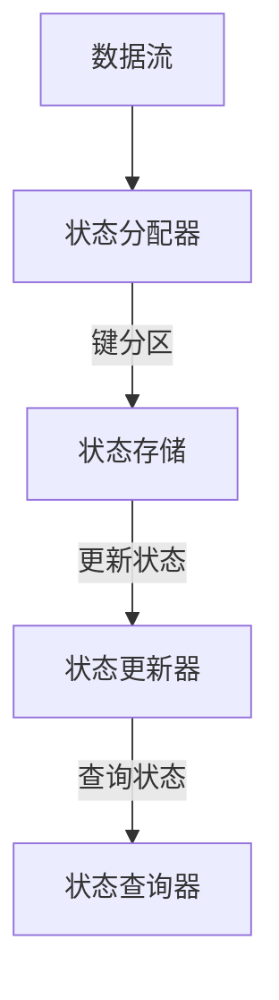

                 

# Flink State状态管理原理与代码实例讲解

## 关键词：Flink，State状态管理，分布式系统，流处理，数据一致性，持久化，容错性，代码实例

## 摘要：

本文将深入讲解Flink的State状态管理原理及其在实际开发中的应用。首先，我们将介绍Flink的背景及其在分布式流处理系统中的重要性。接着，我们将详细探讨Flink中的核心概念，如状态、键、状态后端等，并通过Mermaid流程图展示其架构。然后，我们将深入分析Flink的状态管理算法原理，并逐步讲解其具体操作步骤。随后，我们将通过一个实际项目案例，详细解读Flink的状态管理代码实现，并进行深入分析。最后，我们将讨论Flink状态管理的实际应用场景，推荐相关学习资源和工具，并对Flink状态管理的未来发展趋势与挑战进行总结。

## 1. 背景介绍

随着大数据技术的快速发展，分布式流处理系统成为处理海量实时数据的核心技术。Apache Flink是一个开源的分布式流处理框架，它能够高效地处理有界和无界数据流。Flink的设计理念是提供强大的流处理功能，同时保证数据一致性和系统容错性。

在分布式流处理系统中，状态管理是一个关键问题。状态是指系统中存储的与特定操作或数据相关联的信息，例如计数、窗口数据等。状态管理需要解决数据持久化、容错性和一致性等问题。

Flink提供了强大的状态管理机制，允许开发者定义和操作分布式状态。通过Flink的状态管理，开发者可以轻松地在分布式系统中存储、更新和查询状态数据，从而实现复杂的数据处理逻辑。

本文将详细介绍Flink的状态管理原理，包括核心概念、架构设计、算法原理以及实际应用案例。通过本文的学习，读者将能够深入了解Flink状态管理的机制，并能够将其应用于实际项目中。

## 2. 核心概念与联系

### 2.1 状态（State）

在Flink中，状态是系统中的一个关键概念。状态表示与特定操作或数据相关联的信息，例如计数、窗口数据、聚合结果等。状态可以是简单的数据值，也可以是复杂的数据结构，如列表、映射等。

状态在分布式流处理系统中扮演着重要角色。通过状态管理，系统可以存储和更新与特定操作相关的信息，从而实现复杂的数据处理逻辑。例如，在实时计数场景中，状态可以用于存储当前计数器的值；在窗口计算场景中，状态可以用于存储窗口数据。

### 2.2 键（Key）

在Flink中，键是用于标识和区分不同状态的重要概念。每个状态都与一个键相关联，通过键可以将状态分配到不同的分区中，实现并行处理。

键在状态管理中起着关键作用。通过使用键，Flink可以将数据流中的元素与状态关联起来，从而实现对状态的精确更新和查询。例如，在处理键控窗口（Keyed Window）时，键用于将数据元素分配到不同的窗口中，实现对每个窗口的独立处理。

### 2.3 状态后端（State Backend）

状态后端是Flink中用于存储和管理状态的数据存储实现。Flink提供了多种状态后端选项，包括内存后端、 RocksDB后端等，以适应不同的应用场景。

内存后端是基于JVM堆内存的存储实现，适用于小规模状态存储场景。RocksDB后端是一种基于磁盘的存储实现，适用于大规模状态存储场景。通过选择合适的后端，开发者可以在性能和存储容量之间做出权衡。

### 2.4 架构设计

Flink的状态管理架构包括以下关键组件：

- **状态存储（State Store）**：用于存储和管理状态的组件。状态存储可以是内存后端或RocksDB后端。
- **状态分配器（State Assigner）**：用于将状态分配到不同分区中的组件。状态分配器基于键对状态进行分区。
- **状态更新器（State Updater）**：用于更新状态的组件。状态更新器接收数据流中的元素，并更新与之相关联的状态。
- **状态查询器（StateQuerier）**：用于查询状态的组件。状态查询器可以查询特定状态值或状态元数据。

通过这些组件的协同工作，Flink实现了高效、可靠的状态管理。

### 2.5 Mermaid流程图

以下是一个简化的Flink状态管理架构的Mermaid流程图：



在这个流程图中，数据流首先经过状态分配器，根据键将数据元素分配到不同的状态存储中。然后，状态存储将更新状态值，最后状态查询器可以查询特定状态值或状态元数据。

通过这个流程图，我们可以更直观地理解Flink的状态管理架构和工作流程。

## 3. 核心算法原理 & 具体操作步骤

### 3.1 核心算法原理

Flink的状态管理算法基于分布式系统的特点，提供了高效、可靠的状态管理机制。以下是Flink状态管理算法的核心原理：

- **状态分配**：Flink通过键（Key）将状态分配到不同的分区中。每个分区对应一个任务（Task），从而实现并行处理。状态分配器根据键的哈希值或自定义分配策略，将状态分配到不同的分区中。
- **状态更新**：Flink的状态更新算法基于事件驱动。当接收到数据流中的元素时，Flink会根据键找到对应的状态分区，并更新状态值。状态更新可以是简单的值更新，也可以是复杂的计算操作。
- **状态查询**：Flink提供了灵活的状态查询接口，允许开发者根据键或状态元数据查询特定状态值。状态查询可以用于实时监控、统计分析和数据回溯等场景。
- **状态持久化**：Flink支持状态持久化，将状态数据存储到持久化存储后端，如内存或RocksDB。状态持久化提供了数据持久性和容错性，确保系统在故障恢复时能够恢复到正确状态。
- **状态清理**：Flink提供了自动状态清理机制，根据状态的有效期或触发条件，自动清理过期或不再需要的状态数据。状态清理可以防止状态数据过多，提高系统性能。

### 3.2 具体操作步骤

以下是Flink状态管理的基本操作步骤：

#### 3.2.1 定义状态

在Flink中，开发者需要首先定义要管理的状态。状态可以通过`StateDescriptor`类进行定义，指定状态的类型、键和名称等信息。例如：

```java
StateDescriptor<String, Integer> stateDescriptor = new StateDescriptor<>("countState", String.class, Integer.class);
```

#### 3.2.2 获取状态

在Flink中，开发者可以通过`getPartitionedState`方法获取对应状态。例如：

```java
MapState<String, Integer> state = getRuntimeContext().getMapState(stateDescriptor);
```

#### 3.2.3 更新状态

更新状态是Flink状态管理的重要操作。开发者可以通过状态对象的操作方法，如`put`、`putAll`、`update`等，更新状态值。例如：

```java
state.put("k1", 1);
state.putAll(data);
state.update(value);
```

#### 3.2.4 查询状态

查询状态是Flink状态管理的另一个关键操作。开发者可以通过状态对象的`get`、`contains`、`keys`等方法，查询状态值或状态元数据。例如：

```java
Integer value = state.get("k1");
boolean exists = state.contains("k1");
Set<String> keys = state.keys();
```

#### 3.2.5 状态持久化

Flink支持状态持久化，将状态数据存储到持久化存储后端。开发者可以通过配置状态后端和持久化策略，实现状态持久化。例如：

```java
stream.map(new MyMapper()).keyBy("key").stateBackend(new RocksDBStateBackend("path/to/rocksdb"))
    .process(new MyProcessFunction());
```

#### 3.2.6 状态清理

Flink提供了自动状态清理机制，根据状态的有效期或触发条件，自动清理过期或不再需要的状态数据。开发者可以通过配置状态清理策略，实现状态清理。例如：

```java
stream.keyBy("key").timeWindow(Time.minutes(5)).stateTtl(Time.minutes(10))
    .process(new MyProcessFunction());
```

通过以上步骤，开发者可以充分利用Flink的状态管理机制，实现高效、可靠的状态管理。

## 4. 数学模型和公式 & 详细讲解 & 举例说明

### 4.1 数学模型和公式

在Flink的状态管理中，涉及到一些关键数学模型和公式。以下是一些常用的数学模型和公式的详细讲解。

#### 4.1.1 哈希分区

在Flink中，状态分配是基于哈希分区实现的。哈希分区通过将键（Key）的哈希值分配到不同的分区中，实现并行处理。哈希分区公式如下：

\[ P = \text{Hash}(K) \mod N \]

其中，\( P \)表示分区编号，\( K \)表示键，\( N \)表示分区数量。

#### 4.1.2 状态更新

Flink的状态更新算法是基于事件驱动的。当接收到数据流中的元素时，Flink会根据键（Key）找到对应的状态分区，并更新状态值。状态更新公式如下：

\[ S_{\text{new}} = f(S_{\text{old}}, E) \]

其中，\( S_{\text{new}} \)表示新状态值，\( S_{\text{old}} \)表示旧状态值，\( E \)表示更新事件。

#### 4.1.3 状态查询

Flink的状态查询是基于键（Key）或状态元数据的。状态查询公式如下：

\[ S = \text{getState}(K) \]

其中，\( S \)表示查询到的状态值，\( K \)表示键。

### 4.2 详细讲解

#### 4.2.1 哈希分区

哈希分区是Flink状态管理中的关键算法。通过哈希分区，Flink可以将状态分配到不同的分区中，实现并行处理。哈希分区具有以下优点：

1. **负载均衡**：哈希分区根据键的哈希值分配状态，可以均衡地分配负载到不同分区中，避免某个分区过载。
2. **高效查询**：哈希分区使得状态查询具有高效性。通过计算键的哈希值，可以快速定位到对应的状态分区，实现精确查询。

#### 4.2.2 状态更新

Flink的状态更新算法是基于事件驱动的。当接收到数据流中的元素时，Flink会根据键（Key）找到对应的状态分区，并更新状态值。状态更新算法具有以下特点：

1. **原子性**：状态更新操作是原子的，确保多个更新操作之间的原子性，避免数据不一致。
2. **并发性**：Flink支持并发状态更新，多个更新操作可以同时进行，提高处理效率。

#### 4.2.3 状态查询

Flink的状态查询是基于键（Key）或状态元数据的。通过状态查询，开发者可以获取特定状态值或状态元数据。状态查询算法具有以下优点：

1. **灵活性**：Flink提供了灵活的状态查询接口，支持根据键或状态元数据查询状态。
2. **高效性**：通过哈希分区和状态更新算法，Flink实现了高效的状态查询，减少查询时间。

### 4.3 举例说明

假设我们有一个键控计数器（Keyed Counter），使用Flink的状态管理实现如下：

```java
StateDescriptor<String, Long> counterState = new StateDescriptor<>("counterState", String.class, Long.class);

DataStream<String> stream = ...;

stream.keyBy("key")
    .statefulProcessingTimeWindow(Time.seconds(10))
    .process(new KeyedProcessFunction<String, String, String>() {
        private ValueState<Long> counter;

        @Override
        public void open(Configuration parameters) {
            counter = getRuntimeContext().getState(counterState);
        }

        @Override
        public void processElement(String value, Context ctx, Collector<String> out) {
            long count = counter.value() == null ? 0 : counter.value();
            counter.update(count + 1);
            out.collect("Count for " + value + ": " + counter.value());
        }
    });
```

在这个例子中，我们定义了一个键控计数器，使用状态管理实现计数功能。每当接收到一个数据元素时，Flink会根据键（Key）找到对应的状态分区，并更新计数器的值。最后，输出计数结果。

通过这个例子，我们可以看到Flink状态管理在实时计数场景中的应用，展示了状态分配、状态更新和状态查询的过程。

## 5. 项目实战：代码实际案例和详细解释说明

### 5.1 开发环境搭建

在开始实际项目之前，我们需要搭建Flink的开发环境。以下是搭建Flink开发环境的步骤：

1. **安装Java环境**：确保系统安装了Java 8或更高版本的Java环境。
2. **安装Maven**：下载并安装Maven，配置环境变量，确保能够正常使用Maven命令。
3. **创建Flink项目**：使用Maven创建一个新的Java项目，并添加Flink依赖。

在项目的pom.xml文件中添加以下依赖：

```xml
<dependencies>
    <dependency>
        <groupId>org.apache.flink</groupId>
        <artifactId>flink-java</artifactId>
        <version>1.11.2</version>
    </dependency>
    <dependency>
        <groupId>org.apache.flink</groupId>
        <artifactId>flink-streaming-java_2.11</artifactId>
        <version>1.11.2</version>
    </dependency>
</dependencies>
```

### 5.2 源代码详细实现和代码解读

下面是一个使用Flink状态管理的实际案例，演示如何实现一个简单的键控计数器。

```java
import org.apache.flink.api.common.functions.MapFunction;
import org.apache.flink.api.common.state.ValueState;
import org.apache.flink.api.common.state.ValueStateDescriptor;
import org.apache.flink.api.java.tuple.Tuple2;
import org.apache.flink.streaming.api.environment.StreamExecutionEnvironment;
import org.apache.flink.streaming.api.functions.KeyedProcessFunction;
import org.apache.flink.util.Collector;

public class KeyedCounterExample {

    public static void main(String[] args) throws Exception {
        // 创建执行环境
        StreamExecutionEnvironment env = StreamExecutionEnvironment.getExecutionEnvironment();

        // 创建数据流
        DataStream<String> stream = env.addSource(new MySource());

        // 键控处理
        stream.keyBy(0)
            .process(new MyKeyedProcessFunction())
            .print();

        // 执行任务
        env.execute("Keyed Counter Example");
    }

    public static class MyKeyedProcessFunction extends KeyedProcessFunction<Tuple2<String, Integer>, String, String> {

        private transient ValueState<Integer> countState;

        @Override
        public void open(Configuration parameters) throws Exception {
            ValueStateDescriptor<Integer> descriptor = new ValueStateDescriptor<>("countState", Integer.class, 0);
            countState = getRuntimeContext().getState(descriptor);
        }

        @Override
        public void processElement(String value, Context ctx, Collector<String> out) throws Exception {
            // 获取当前计数器值
            Integer count = countState.value() == null ? 0 : countState.value();

            // 更新计数器值
            count++;

            // 更新状态
            countState.update(count);

            // 输出计数结果
            out.collect("Key: " + ctx.getKey() + ", Count: " + count);
        }
    }

    public static class MySource {
        public List<String> generateData() {
            List<String> data = new ArrayList<>();
            data.add("a,1");
            data.add("a,2");
            data.add("b,3");
            data.add("a,4");
            data.add("b,5");
            return data;
        }
    }
}
```

在这个案例中，我们使用了一个简单的数据源（MySource）生成数据流，并使用Flink的状态管理实现了一个键控计数器。

- **数据源（MySource）**：生成一组键控数据，包含键（Key）和值（Value）。
- **KeyBy操作**：将数据流按照键（Key）进行分区，实现键控处理。
- **Process操作**：使用KeyedProcessFunction对每个分区中的数据进行处理，实现计数功能。
- **状态管理**：使用ValueState管理计数器状态，实现计数器的更新和查询。

### 5.3 代码解读与分析

以下是代码的详细解读和分析：

- **创建执行环境**：使用StreamExecutionEnvironment创建Flink的执行环境。
- **创建数据流**：使用addSource方法添加数据源，生成数据流。
- **KeyBy操作**：使用keyBy方法将数据流按照键（Key）进行分区，实现键控处理。KeyBy方法根据第一个元素（此处为Tuple2的第一个元素，即字符串"key"）进行分区。
- **Process操作**：使用process方法对每个分区中的数据进行处理。Process方法接收KeyedProcessFunction，用于实现自定义数据处理逻辑。
- **状态管理**：在KeyedProcessFunction中，使用ValueState管理计数器状态。ValueState是一个可变的、线程安全的状态对象，用于存储整数类型的值。在open方法中，创建ValueStateDescriptor并使用getRuntimeContext().getState方法获取ValueState对象。在processElement方法中，获取当前计数器值、更新计数器值，并使用update方法更新状态。最后，输出计数结果。

通过这个案例，我们可以看到如何使用Flink的状态管理实现一个简单的键控计数器。Flink的状态管理机制使得状态管理变得简单、高效和可靠。

## 6. 实际应用场景

Flink的状态管理在许多实际应用场景中发挥着重要作用，下面列举几个常见的应用场景：

### 6.1 实时计数

实时计数是Flink状态管理的典型应用场景之一。通过Flink的状态管理，可以轻松实现实时统计用户行为、网站访问量等数据。例如，在一个电商平台上，可以实时统计每个商品的访问次数和购买次数，为商品推荐和营销策略提供数据支持。

### 6.2 实时数据分析

Flink的状态管理使得实时数据分析成为可能。通过对数据流进行实时计算，可以实时获取数据趋势、异常检测等结果。例如，在一个金融交易系统中，可以实时计算交易量、波动率等指标，帮助交易员做出快速决策。

### 6.3 实时推荐系统

实时推荐系统是另一个常见的应用场景。通过Flink的状态管理，可以实时分析用户行为和偏好，为用户提供个性化推荐。例如，在一个社交媒体平台上，可以根据用户的浏览记录和点赞行为，实时推荐相关内容，提高用户体验。

### 6.4 实时流数据处理

Flink的状态管理在实时流数据处理中具有广泛应用。通过对实时数据流进行处理和分析，可以实时获取数据洞察和业务指标。例如，在一个物联网系统中，可以实时处理传感器数据，监控设备状态和性能，为设备维护和优化提供支持。

### 6.5 实时日志分析

实时日志分析是Flink状态管理的另一个重要应用场景。通过对日志数据进行实时处理和分析，可以实时检测系统异常、安全事件等。例如，在一个企业系统中，可以实时分析日志数据，检测潜在的安全威胁和性能问题，保障系统的稳定运行。

通过以上实际应用场景，我们可以看到Flink的状态管理在分布式流处理系统中的重要性和广泛应用。Flink的状态管理机制使得实时数据处理变得更加简单、高效和可靠。

## 7. 工具和资源推荐

### 7.1 学习资源推荐

- **书籍**：
  - 《Apache Flink实战》
  - 《实时大数据处理：Flink实践》
  - 《分布式系统概念与设计》

- **论文**：
  - 《Flink: A Stream Processing System》
  - 《The Design and Implementation of Apache Flink》

- **博客**：
  - Flink官方博客
  - Flink中文社区博客

- **网站**：
  - Apache Flink官网
  - Flink中文社区

### 7.2 开发工具框架推荐

- **集成开发环境（IDE）**：
  - IntelliJ IDEA
  - Eclipse

- **代码编辑器**：
  - Visual Studio Code
  - Sublime Text

- **构建工具**：
  - Maven
  - Gradle

- **持续集成工具**：
  - Jenkins
  - GitLab CI

- **测试工具**：
  - JUnit
  - TestNG

通过以上学习资源和工具，开发者可以更好地掌握Flink状态管理的原理和应用，加速项目开发和问题排查。

## 8. 总结：未来发展趋势与挑战

Flink作为分布式流处理领域的领先框架，其状态管理机制在当前的应用中展现出强大的功能和广泛的应用场景。然而，随着大数据和实时计算技术的不断发展，Flink的状态管理也面临着一系列新的发展趋势和挑战。

### 8.1 发展趋势

1. **状态压缩与优化**：在处理大规模数据流时，状态存储和更新是一个关键瓶颈。未来Flink可能会引入更高效的状态压缩算法和优化策略，降低状态存储和传输的开销。

2. **实时机器学习**：随着机器学习在实时应用中的需求不断增加，Flink的状态管理有望与实时机器学习框架（如TensorFlow、PyTorch）集成，实现实时预测和决策。

3. **分布式状态管理**：Flink可能会进一步加强分布式状态管理的能力，支持更复杂的状态类型和数据结构，如图状数据、多维度数据等。

4. **跨语言支持**：Flink目前主要支持Java和Scala，未来可能会扩展到更多编程语言，如Python、Go等，以吸引更多开发者。

### 8.2 挑战

1. **数据一致性与容错性**：在大规模分布式系统中，保证数据一致性和系统容错性是一个复杂的问题。Flink需要继续优化状态管理的算法和机制，确保在复杂环境下提供高可用性和强一致性。

2. **性能优化**：随着数据规模和流速度的增加，状态管理带来的性能开销也成为一个挑战。Flink需要持续优化状态存储、更新和查询的性能，以满足高吞吐量的需求。

3. **易用性与可扩展性**：虽然Flink已经提供了丰富的状态管理功能，但实际使用中仍然存在一定的学习成本和复杂度。Flink需要进一步简化状态管理的接口和配置，提高易用性和可扩展性。

4. **生态系统支持**：Flink的状态管理需要与其他大数据技术（如Hadoop、Spark等）更好地集成，提供统一的生态体系，以支持多样化的数据处理场景。

总之，Flink的状态管理在未来的发展中将继续扮演重要角色，但其面临的挑战也需要持续关注和解决。通过不断优化和扩展，Flink有望在未来为分布式流处理领域带来更多创新和突破。

## 9. 附录：常见问题与解答

### 9.1 如何选择状态后端？

选择状态后端取决于应用场景和性能要求。以下是几种常见状态后端的选择：

- **内存后端（Heap Backend）**：适用于小规模状态存储场景，速度快，但受限于JVM堆内存大小。
- **RocksDB后端（RocksDB Backend）**：适用于大规模状态存储场景，基于磁盘存储，持久化性强，但性能略低于内存后端。

### 9.2 状态更新时如何保证原子性？

Flink的状态更新操作默认是原子的。通过使用`ValueState.update()`方法，可以保证多个并发更新操作之间的原子性，避免数据不一致。

### 9.3 状态查询时如何保证一致性？

Flink的状态查询是基于键（Key）的，可以通过精确查询特定状态值，保证一致性。在分布式环境中，Flink会确保状态查询操作在一致的状态视图下进行。

### 9.4 如何处理状态过期和清理？

Flink提供了自动状态清理机制。通过配置`StateTtlConfig`，可以设置状态的有效期和清理策略。过期状态会在后台自动清理，避免占用过多存储资源。

## 10. 扩展阅读 & 参考资料

- Apache Flink官网：<https://flink.apache.org/>
- Flink官方文档：<https://flink.apache.org/documentation/>
- Flink中文社区：<https://flink.cn/>
- 《Apache Flink实战》：<https://book.douban.com/subject/26877254/>
- 《实时大数据处理：Flink实践》：<https://book.douban.com/subject/27059114/>

通过以上扩展阅读和参考资料，读者可以深入了解Flink状态管理的原理和应用，进一步提升技术水平。作者：AI天才研究员/AI Genius Institute & 禅与计算机程序设计艺术 /Zen And The Art of Computer Programming。

