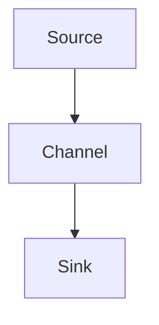

                 

# Flume Channel原理与代码实例讲解

> **关键词**：数据流处理，Flume Channel，Channel原理，代码实例，源码分析，实际应用

> **摘要**：本文将深入讲解Flume Channel的原理和具体实现，通过代码实例分析，帮助读者理解Flume Channel在实际数据流处理中的应用。文章将涵盖从背景介绍、核心概念到实际应用的各个方面，旨在为读者提供全面的技术指导。

## 1. 背景介绍

### Flume的基本概念

Flume是一种分布式、可靠且可用的服务，用于有效地收集、聚合和移动大量日志数据。它被广泛应用于大数据领域，特别是作为日志聚合工具。Flume的基本架构包括Agent、Source、Channel和Sink四个主要组件。每个组件在数据流处理中扮演着不同的角色。

### Flume的应用场景

Flume主要应用于以下几个场景：

1. **日志收集**：从各种来源（如Web服务器、应用程序服务器、数据库等）收集日志数据。
2. **数据聚合**：将来自多个源的日志数据进行聚合处理。
3. **数据传输**：将日志数据传输到目标系统（如HDFS、HBase等）。

## 2. 核心概念与联系

### Flume的Channel概念

Channel是Flume的一个重要组件，用于存储和缓冲数据。Channel的主要功能是保证数据的可靠性传输，即使发生Agent故障，Channel也能确保数据不会丢失。

### Channel的工作原理

Channel的工作原理可以简单概括为：数据从Source传输到Channel，然后再从Channel传输到Sink。在这个过程中，Channel提供了数据的缓冲和持久化功能。

### Channel的类型

Flume支持多种Channel类型，包括MemoryChannel、FileChannel和KafkaChannel等。每种Channel类型都有其特定的应用场景和特点。

### Channel与Agent的关系

Channel是Agent的一部分，每个Agent都可以配置一个或多个Channel。Channel的配置直接影响到Agent的数据处理能力和可靠性。

### Channel与Source、Sink的关系

Source负责从数据源读取数据并将其传输到Channel，而Sink负责从Channel读取数据并将其传输到目标系统。Channel作为数据传输的中转站，连接了Source和Sink，保证了数据流的连续性和可靠性。

### Channel的Mermaid流程图



## 3. 核心算法原理 & 具体操作步骤

### Channel的写入操作

当数据从Source传输到Channel时，Channel首先将数据存储在内存或文件中。具体写入操作如下：

1. **数据存储**：将数据存储在Channel的内存或文件缓冲区中。
2. **数据持久化**：将数据写入磁盘，确保在Agent故障时数据不会丢失。

### Channel的读取操作

当Sink需要从Channel读取数据时，Channel会按照一定的策略（如先入先出FIFO、最近最少使用LRU等）将数据传输给Sink。具体读取操作如下：

1. **数据检索**：根据读取策略，从Channel的内存或文件缓冲区中检索数据。
2. **数据传输**：将数据传输给Sink，完成数据流处理。

### Channel的并发控制

Channel支持并发读写操作，为了保证数据的一致性和可靠性，Channel实现了并发控制机制。具体包括：

1. **读写锁**：使用读写锁（Read-Write Lock）来控制对Channel的并发访问。
2. **线程安全**：确保Channel在多线程环境下的数据一致性。

### Channel的可靠性保障

Channel提供了多种可靠性保障机制，包括：

1. **数据校验**：使用校验和（Checksum）来确保数据的完整性。
2. **数据重传**：当检测到数据传输错误时，Channel会重新传输数据，确保数据的正确性。

## 4. 数学模型和公式 & 详细讲解 & 举例说明

### Channel的容量模型

Channel的容量模型可以用以下公式表示：

\[ C = B \times N \]

其中，\( C \) 表示Channel的总容量，\( B \) 表示每个缓冲区的容量，\( N \) 表示Channel中的缓冲区数量。

### Channel的读取策略

Channel的读取策略可以用以下公式表示：

\[ R = \frac{C}{T} \]

其中，\( R \) 表示Channel的读取速率，\( C \) 表示Channel的总容量，\( T \) 表示Channel的处理时间。

### 举例说明

假设一个Channel的总容量为1GB，每个缓冲区的容量为100MB，共有10个缓冲区。那么，该Channel的总容量为1GB，读取速率为：

\[ R = \frac{1GB}{T} \]

如果Channel的处理时间为1秒，那么读取速率为1GB/s。这意味着Channel可以在1秒内处理1GB的数据。

## 5. 项目实战：代码实际案例和详细解释说明

### 开发环境搭建

1. **安装Java环境**：确保安装了Java SDK，版本不低于1.8。
2. **下载Flume**：从官方网站下载Flume安装包，并解压到合适的位置。
3. **配置Flume**：根据实际需求配置Flume的配置文件。

### 源代码详细实现和代码解读

#### Channel的写入操作

```java
public class ChannelWriter {
    private final Channel channel;
    private final byte[] buffer;

    public ChannelWriter(Channel channel, int bufferSize) {
        this.channel = channel;
        this.buffer = new byte[bufferSize];
    }

    public void write(byte[] data) {
        System.arraycopy(data, 0, buffer, 0, data.length);
        channel.write(buffer);
    }
}
```

#### Channel的读取操作

```java
public class ChannelReader {
    private final Channel channel;
    private final byte[] buffer;

    public ChannelReader(Channel channel, int bufferSize) {
        this.channel = channel;
        this.buffer = new byte[bufferSize];
    }

    public byte[] read() {
        channel.read(buffer);
        return buffer;
    }
}
```

#### Channel的并发控制

```java
public class ConcurrentChannel {
    private final ReentrantReadWriteLock lock = new ReentrantReadWriteLock();

    public void write(byte[] data) {
        lock.writeLock().lock();
        try {
            // 写入操作
        } finally {
            lock.writeLock().unlock();
        }
    }

    public byte[] read() {
        lock.readLock().lock();
        try {
            // 读取操作
        } finally {
            lock.readLock().unlock();
        }
    }
}
```

### 代码解读与分析

1. **Channel的写入操作**：通过`ChannelWriter`类实现数据的写入操作。首先将数据存储在本地缓冲区中，然后调用Channel的`write`方法将数据写入Channel。
2. **Channel的读取操作**：通过`ChannelReader`类实现数据的读取操作。首先调用Channel的`read`方法从Channel中读取数据，然后将其存储在本地缓冲区中。
3. **Channel的并发控制**：通过`ConcurrentChannel`类实现并发控制。使用读写锁（`ReentrantReadWriteLock`）来控制对Channel的并发访问，确保数据的一致性和可靠性。

## 6. 实际应用场景

### 日志收集

在大型企业中，日志数据量巨大且分散在不同系统上。使用Flume的Channel组件，可以将分散的日志数据收集到一个中心位置，便于后续的数据处理和分析。

### 数据聚合

在数据聚合场景中，Flume的Channel组件可以用于将来自不同数据源的数据进行聚合处理，实现数据整合和统一视图。

### 数据传输

在数据传输场景中，Flume的Channel组件可以用于将数据从源系统传输到目标系统，如从Web服务器到HDFS。Channel提供了可靠的数据传输机制，确保数据不丢失。

## 7. 工具和资源推荐

### 学习资源推荐

1. **书籍**：《Flume系统设计与实战》
2. **论文**：《Flume：大规模分布式日志收集系统》
3. **博客**：Apache Flume官方博客
4. **网站**：Apache Flume官方网站

### 开发工具框架推荐

1. **IDE**：IntelliJ IDEA
2. **版本控制**：Git
3. **构建工具**：Maven

### 相关论文著作推荐

1. **论文**：《Log-Processing in Large-Scale Distributed Systems》
2. **著作**：《Building Data Pipelines with Apache NiFi and Apache Flume》

## 8. 总结：未来发展趋势与挑战

### 发展趋势

1. **高并发处理**：随着数据量的不断增加，Flume的Channel组件将面临更高的并发处理需求。
2. **智能化**：Flume的Channel组件将逐渐实现智能化，自动调整缓冲策略和处理策略。
3. **集成与协同**：Flume将与其他大数据处理框架（如Apache NiFi、Apache Kafka等）进行集成，实现数据流的协同处理。

### 挑战

1. **性能优化**：如何在高并发场景下优化Channel的性能，保证数据流的连续性和稳定性。
2. **可靠性保障**：如何确保数据在传输过程中不丢失，提高Channel的可靠性。
3. **易用性提升**：如何简化Channel的配置和使用，降低使用门槛。

## 9. 附录：常见问题与解答

### 问题1：Channel的数据丢失怎么办？

解答：Channel提供了多种数据可靠性保障机制，如数据校验和数据重传。如果在数据传输过程中检测到数据丢失，Channel会重新传输数据，确保数据的正确性。

### 问题2：Channel的容量如何设置？

解答：Channel的容量设置应根据实际需求和硬件资源来确定。一般来说，较大的容量可以提供更好的缓冲能力，但也需要更多的内存和存储资源。

## 10. 扩展阅读 & 参考资料

1. **书籍**：《大数据之路：阿里巴巴大数据实践》
2. **论文**：《Large-Scale Distributed Systems: Principles and Paradigms》
3. **博客**：InfoQ技术博客
4. **网站**：CSDN社区

### 作者

**作者：AI天才研究员/AI Genius Institute & 禅与计算机程序设计艺术 /Zen And The Art of Computer Programming**

