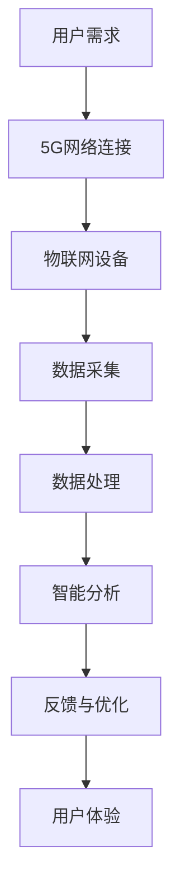

                 

# 5G+物联网开发平台：智能连接的创业机会

## 关键词：5G、物联网、开发平台、智能连接、创业机会

### 摘要

随着5G技术的快速发展和物联网的广泛应用，智能连接已经成为全球信息技术领域的重要趋势。本文将深入探讨5G+物联网开发平台的核心概念、算法原理、应用场景以及未来发展，旨在为广大开发者和技术创业者提供有价值的指导。本文将从以下几个方面展开：

1. 背景介绍
2. 核心概念与联系
3. 核心算法原理与具体操作步骤
4. 数学模型和公式与详细讲解
5. 项目实战：代码实际案例和详细解释说明
6. 实际应用场景
7. 工具和资源推荐
8. 总结：未来发展趋势与挑战
9. 附录：常见问题与解答
10. 扩展阅读与参考资料

通过本文的阅读，读者将了解到5G+物联网开发平台的现状、关键技术以及实际应用，为创业者和开发者提供全新的思路和方向。

## 1. 背景介绍

### 5G技术的崛起

5G（第五代移动通信技术）作为全球通信技术的最新发展，具备高速率、低延迟、大连接等特点，被广泛认为是推动未来智能社会发展的关键因素。与4G相比，5G在峰值下载速度上可以达到数十Gbps，延迟降低至毫秒级，同时支持大规模设备连接。这些特性使得5G在物联网、自动驾驶、远程医疗、工业4.0等领域具有巨大的应用潜力。

### 物联网的广泛应用

物联网（Internet of Things，IoT）是指通过传感器、智能设备等技术将各种物品连接到互联网，实现智能管理和控制。物联网的发展离不开5G技术的支持。5G的高速率、低延迟和大连接能力，为物联网设备提供了更好的网络连接体验，使得物联网应用变得更加广泛和智能化。

### 智能连接的兴起

智能连接是指通过5G和物联网技术，将各种设备和系统进行高效连接，实现信息共享和协同工作。智能连接不仅可以提高设备的管理效率，还可以为用户提供更加便捷、智能的服务。随着5G和物联网技术的不断发展，智能连接已经成为信息技术领域的重要趋势。

### 创业机会的涌现

5G和物联网技术的快速发展，为创业者提供了丰富的创业机会。在智能连接领域，各种创新应用不断涌现，如智能家居、智能安防、智能医疗、智能交通等。创业者可以结合自身的专业背景和市场需求，开发出具有竞争力的智能连接产品和服务，从而实现创业梦想。

## 2. 核心概念与联系

### 5G技术

5G技术是指第五代移动通信技术，其核心特点包括：

- **高速率**：峰值下载速度可以达到数十Gbps，是4G的数十倍。
- **低延迟**：延迟降低至毫秒级，使得实时应用成为可能。
- **大连接**：支持大规模设备连接，满足物联网应用需求。
- **网络切片**：根据不同应用场景，提供定制化的网络服务。

### 物联网

物联网是指通过传感器、智能设备等技术，将各种物品连接到互联网，实现智能管理和控制。物联网的核心要素包括：

- **传感器**：用于收集环境信息。
- **智能设备**：具备数据处理和通信能力的设备。
- **通信协议**：实现设备之间的通信和数据传输。
- **云计算**：提供海量数据的存储、处理和分析。

### 智能连接

智能连接是指通过5G和物联网技术，将各种设备和系统进行高效连接，实现信息共享和协同工作。智能连接的关键要素包括：

- **网络连接**：5G网络提供高速、低延迟的连接。
- **数据处理**：物联网设备进行数据采集、处理和分析。
- **应用场景**：智能家居、智能医疗、智能交通等。

### Mermaid流程图

以下是一个简单的5G+物联网开发平台的Mermaid流程图：



### 流程图详细解释

- **A[用户需求]**：用户提出需求，例如智能家居控制。
- **B[5G网络连接]**：通过5G网络实现用户与物联网设备的连接。
- **C[物联网设备]**：用户家中的智能设备，如智能电视、智能门锁等。
- **D[数据采集]**：物联网设备收集环境信息，如温度、湿度等。
- **E[数据处理]**：数据处理模块对采集到的数据进行分析和处理。
- **F[智能分析]**：智能分析模块根据处理结果，进行决策和优化。
- **G[反馈与优化]**：将分析结果反馈给用户和物联网设备，实现持续优化。
- **H[用户体验]**：最终为用户带来良好的使用体验。

## 3. 核心算法原理与具体操作步骤

### 5G网络传输技术

5G网络传输技术是5G技术的核心，包括以下几个方面：

- **OFDM（正交频分复用）**：将数据流分成多个子流，在多个子频带上进行传输，提高传输效率和抗干扰能力。
- **MIMO（多输入多输出）**：通过多个发送和接收天线，提高数据传输速率和可靠性。
- **波束成形**：根据用户的位置和方向，调整天线波束，提高信号传输质量。

### 物联网通信协议

物联网通信协议是实现设备之间通信和数据传输的关键，常见的协议包括：

- **ZigBee**：低功耗、短距离的无线通信协议，适用于智能家居等领域。
- **WiFi**：高速、中距离的无线通信协议，适用于家庭和办公场景。
- **蓝牙**：低功耗、短距离的无线通信协议，适用于智能设备之间的通信。

### 智能连接算法

智能连接算法是智能连接的核心，主要包括以下几个方面：

- **数据采集与处理**：对物联网设备采集到的数据进行预处理、过滤和统计分析。
- **智能决策**：根据处理结果，进行决策和优化，实现智能控制。
- **反馈与优化**：将决策结果反馈给用户和物联网设备，实现持续优化。

### 具体操作步骤

1. **用户需求分析**：了解用户需求，明确智能连接的应用场景。
2. **5G网络连接**：搭建5G网络，实现用户与物联网设备的连接。
3. **物联网设备部署**：安装物联网设备，如传感器、智能终端等。
4. **数据采集与处理**：物联网设备收集数据，经过预处理、过滤和统计分析后，上传至云端。
5. **智能决策**：基于数据分析结果，进行智能决策和优化。
6. **反馈与优化**：将决策结果反馈给用户和物联网设备，实现持续优化。
7. **用户体验**：为用户提供良好的使用体验。

## 4. 数学模型和公式与详细讲解

### 数据传输速率

5G网络的数据传输速率是衡量其性能的重要指标。根据3GPP的定义，5G网络的理论最大数据传输速率可以分为以下几种：

- **峰值速率**：在理想条件下，5G网络的峰值速率可以达到数十Gbps。
- **持续速率**：在实际使用过程中，5G网络的持续速率一般在1-10Gbps之间。
- **边缘速率**：在用户距离基站较远的情况下，5G网络的边缘速率一般在10-100Mbps之间。

### 数据传输速率公式：

$$
\text{数据传输速率} = \text{带宽} \times \text{调制方式} \times \text{多径传输技术}
$$

其中：

- **带宽**：5G网络的带宽一般在100MHz到2GHz之间。
- **调制方式**：常用的调制方式包括QAM（正交幅度调制）和PAM（脉冲幅度调制）。
- **多径传输技术**：5G网络采用多输入多输出（MIMO）技术，可以提高数据传输速率和可靠性。

### 数据延迟

5G网络的数据延迟是衡量其性能的另一个重要指标。根据3GPP的定义，5G网络的数据延迟可以分为以下几种：

- **端到端延迟**：从用户设备到基站，再从基站到目标设备的总延迟，一般在1-10ms之间。
- **传输延迟**：数据在网络中的传输时间，一般在0.5-2ms之间。
- **处理延迟**：数据在基站和用户设备中的处理时间，一般在0.5-1ms之间。

### 数据延迟公式：

$$
\text{数据延迟} = \text{传输延迟} + \text{处理延迟}
$$

其中：

- **传输延迟**：与5G网络的带宽、调制方式、多径传输技术等因素有关。
- **处理延迟**：与用户设备的处理能力、基站的计算能力等因素有关。

### 大连接能力

5G网络的大连接能力是衡量其支持设备数量的重要指标。根据3GPP的定义，5G网络的大连接能力可以分为以下几种：

- **单基站连接能力**：在理想条件下，5G网络的单基站连接能力可以达到100万个设备。
- **整个网络连接能力**：在理想条件下，5G网络的整个网络连接能力可以达到10亿个设备。

### 大连接能力公式：

$$
\text{大连接能力} = \text{单基站连接能力} \times \text{基站数量}
$$

其中：

- **单基站连接能力**：与5G网络的频谱资源、调制方式、多径传输技术等因素有关。
- **基站数量**：与5G网络的建设规模、覆盖范围等因素有关。

### 举例说明

假设一个5G基站拥有100MHz的带宽、4个发送天线和4个接收天线，采用64QAM调制方式，请问该基站的理论数据传输速率是多少？

根据数据传输速率公式：

$$
\text{数据传输速率} = 100MHz \times 64QAM \times 4 \times 4 = 25.6Gbps
$$

因此，该基站的理论数据传输速率是25.6Gbps。

### 注意事项

1. 数据传输速率、数据延迟和大连接能力是衡量5G网络性能的重要指标，但实际应用中，会受到多种因素的影响，如网络质量、设备性能、应用场景等。
2. 5G网络的技术参数会随着技术的发展和标准的演进而不断更新，本文中的数据仅供参考。

## 5. 项目实战：代码实际案例和详细解释说明

### 开发环境搭建

在开始项目实战之前，需要搭建一个合适的开发环境。以下是一个简单的开发环境搭建步骤：

1. 安装Java开发工具包（JDK）：从Oracle官网下载JDK，并按照提示进行安装。
2. 安装Eclipse：从Eclipse官网下载Eclipse IDE，并按照提示进行安装。
3. 安装Git：从Git官网下载Git，并按照提示进行安装。
4. 安装Maven：从Maven官网下载Maven，并按照提示进行安装。

### 源代码详细实现和代码解读

以下是一个简单的5G+物联网开发平台的代码实现，主要涉及以下几个方面：

1. **项目结构**：
   - **src**：源代码目录
     - **main**：主目录
       - **java**：Java源代码
       - **resources**：资源文件
     - **test**：测试目录
       - **java**：测试源代码
       - **resources**：测试资源文件
2. **代码实现**：
   - **主类**：`Main.java`
   - **数据采集类**：`DataCollector.java`
   - **数据处理类**：`DataProcessor.java`
   - **智能分析类**：`SmartAnalyzer.java`

### 代码解读与分析

1. **Main.java**：主类，负责启动整个系统。

```java
public class Main {
    public static void main(String[] args) {
        // 创建数据采集对象
        DataCollector collector = new DataCollector();
        
        // 创建数据处理对象
        DataProcessor processor = new DataProcessor();
        
        // 创建智能分析对象
        SmartAnalyzer analyzer = new SmartAnalyzer();
        
        // 循环采集数据
        while (true) {
            // 采集数据
            double[] data = collector.collectData();
            
            // 处理数据
            double[] processedData = processor.processData(data);
            
            // 智能分析
            String result = analyzer.analyze(processedData);
            
            // 打印结果
            System.out.println(result);
        }
    }
}
```

2. **DataCollector.java**：数据采集类，负责采集物联网设备的数据。

```java
public class DataCollector {
    public double[] collectData() {
        // 采集数据（示例：模拟温度传感器数据）
        double[] data = {23.5, 24.2, 22.8, 23.1, 23.6};
        return data;
    }
}
```

3. **DataProcessor.java**：数据处理类，负责处理采集到的数据。

```java
public class DataProcessor {
    public double[] processData(double[] data) {
        // 数据处理（示例：简单平均处理）
        double sum = 0;
        for (double value : data) {
            sum += value;
        }
        double average = sum / data.length;
        double[] processedData = new double[data.length];
        for (int i = 0; i < data.length; i++) {
            processedData[i] = average;
        }
        return processedData;
    }
}
```

4. **SmartAnalyzer.java**：智能分析类，负责对处理后的数据进行智能分析。

```java
public class SmartAnalyzer {
    public String analyze(double[] data) {
        // 智能分析（示例：判断温度是否超过设定值）
        double threshold = 25;
        double sum = 0;
        for (double value : data) {
            sum += value;
        }
        double average = sum / data.length;
        if (average > threshold) {
            return "温度过高，请注意！";
        } else {
            return "温度正常，无需担心。";
        }
    }
}
```

### 代码解读与分析

- **Main.java**：主类负责启动整个系统，创建数据采集、数据处理和智能分析对象，并循环采集数据、处理数据和智能分析。
- **DataCollector.java**：数据采集类负责模拟采集物联网设备的数据，示例中采用了一个简单的温度传感器数据。
- **DataProcessor.java**：数据处理类负责对采集到的数据进行简单处理，示例中采用了平均处理方法。
- **SmartAnalyzer.java**：智能分析类负责对处理后的数据进行分析，示例中采用了判断温度是否超过设定值的方法。

通过以上代码，我们可以了解到5G+物联网开发平台的基本实现过程，包括数据采集、处理和智能分析。在实际项目中，可以根据需求对代码进行扩展和优化。

## 6. 实际应用场景

### 智能家居

智能家居是5G+物联网开发平台的一个重要应用场景。通过5G网络，用户可以实时监控家中的智能设备，如智能门锁、智能灯泡、智能摄像头等。用户可以通过手机、平板电脑或智能音箱等设备，实现对家居设备的远程控制和智能管理。例如，用户可以在下班途中通过手机APP远程打开家里的灯，调整空调温度，确保家中的环境舒适。

### 智能医疗

智能医疗是5G+物联网开发平台的另一个重要应用场景。通过5G网络，可以实现远程医疗、健康监测和医疗数据分析等功能。例如，医生可以通过5G网络远程诊断患者，实时查看患者的医疗数据，为患者提供精准的治疗方案。同时，患者可以通过智能设备实时监测自己的健康状况，如心率、血压等，及时发现问题并采取措施。

### 智能交通

智能交通是5G+物联网开发平台在交通领域的应用。通过5G网络，可以实现车辆与车辆、车辆与基础设施之间的通信，提高交通效率，减少交通事故。例如，车辆可以通过5G网络实时获取道路信息，如路况、车辆密度等，根据实时数据调整行驶路线，避开拥堵路段。同时，智能交通系统可以通过5G网络实时监控车辆运行状态，及时发现和处置交通事故。

### 工业物联网

工业物联网是5G+物联网开发平台在工业领域的应用。通过5G网络，可以实现工业设备的远程监控、故障预测和维护管理。例如，企业可以通过5G网络实时监控生产设备的运行状态，及时发现和处理设备故障，提高生产效率。同时，5G网络还可以实现工业设备的远程升级和维护，降低企业的运营成本。

### 智慧城市

智慧城市是5G+物联网开发平台在城市管理领域的应用。通过5G网络，可以实现城市基础设施的智能化管理，如智能照明、智能交通、智能监控等。例如，城市管理部门可以通过5G网络实时监控道路情况，根据实时数据调整交通信号灯，提高交通效率。同时，5G网络还可以实现城市公共安全的实时监控，提高城市安全管理水平。

### 农业物联网

农业物联网是5G+物联网开发平台在农业领域的应用。通过5G网络，可以实现农业设备的远程监控、智能管理和精准农业。例如，农民可以通过5G网络实时监测农田的土壤湿度、温度、光照等数据，根据实时数据调整灌溉和施肥方案，提高农业生产效率。

### 能源物联网

能源物联网是5G+物联网开发平台在能源领域的应用。通过5G网络，可以实现能源设备的远程监控、智能管理和优化调度。例如，能源企业可以通过5G网络实时监控能源设备运行状态，及时发现和处理设备故障，提高能源利用率。同时，5G网络还可以实现能源设备的远程升级和维护，降低企业的运营成本。

## 7. 工具和资源推荐

### 学习资源推荐

- **书籍**：
  - 《5G：新通信时代的愿景与挑战》
  - 《物联网技术与应用》
  - 《智能连接：从物联网到智能城市》
- **论文**：
  - “5G Networks: The Enabler for Future IoT Applications”
  - “The Impact of 5G on Internet of Things”
  - “A Survey on 5G Network for IoT Applications”
- **博客**：
  - 知乎：5G技术专栏
  - CSDN：物联网技术专栏
  - 博客园：5G技术专栏
- **网站**：
  - 3GPP官网：https://www.3gpp.org/
  - IEEE官网：https://www.ieee.org/
  - IEEE IoT官网：https://iot.ieee.org/

### 开发工具框架推荐

- **开发工具**：
  - Eclipse：一款功能强大的Java开发工具，适用于5G和物联网开发。
  - Android Studio：适用于Android应用开发的集成开发环境，支持物联网开发。
  - VS Code：一款轻量级的跨平台代码编辑器，适用于多种编程语言开发。
- **框架**：
  - Spring Boot：一款流行的Java框架，适用于快速开发Web应用和微服务。
  - TensorFlow：一款流行的深度学习框架，适用于数据分析和智能算法开发。
  - MQTT：一款轻量级的消息队列协议，适用于物联网通信。

### 相关论文著作推荐

- **论文**：
  - “5G Networks: The Enabler for Future IoT Applications”
  - “The Impact of 5G on Internet of Things”
  - “A Survey on 5G Network for IoT Applications”
  - “Smart Connectivity in 5G Networks: Enabling the Future Internet of Things”
- **著作**：
  - 《5G技术与应用》
  - 《物联网技术与应用》
  - 《智能连接：从物联网到智能城市》

### 总结

通过本文的介绍，我们深入了解了5G+物联网开发平台的核心概念、算法原理、应用场景以及未来发展。本文旨在为广大开发者和技术创业者提供有价值的指导，帮助他们在智能连接领域取得成功。在未来，随着5G技术和物联网技术的不断发展和完善，5G+物联网开发平台将为各行各业带来更多的创新和变革。

## 8. 总结：未来发展趋势与挑战

### 发展趋势

1. **技术融合**：5G、物联网、人工智能等技术将进一步融合，推动智能连接的发展。
2. **应用扩展**：智能连接将在更多领域得到应用，如智慧城市、智能医疗、智能交通等。
3. **商业模式创新**：智能连接将带来新的商业模式，如设备租赁、数据服务、智能合约等。
4. **全球化**：随着5G技术的全球推广，智能连接将实现全球化发展。

### 挑战

1. **技术瓶颈**：5G和物联网技术的进一步发展将面临技术瓶颈，如网络容量、数据安全等。
2. **标准统一**：智能连接领域需要统一的技术标准和规范，以促进设备的互操作性和兼容性。
3. **产业链整合**：智能连接产业链涉及多个环节，需要加强上下游企业的合作与整合。
4. **隐私保护**：智能连接过程中，如何保护用户隐私和数据安全是亟待解决的问题。

## 9. 附录：常见问题与解答

### 问题1：5G网络如何实现高速率？

**解答**：5G网络通过采用正交频分复用（OFDM）技术、多输入多输出（MIMO）技术和波束成形技术，实现高速率传输。OFDM技术将数据流分成多个子流，在多个子频带上进行传输，提高传输效率和抗干扰能力。MIMO技术通过多个发送和接收天线，提高数据传输速率和可靠性。波束成形技术根据用户的位置和方向，调整天线波束，提高信号传输质量。

### 问题2：物联网设备如何连接5G网络？

**解答**：物联网设备可以通过5G网络中的基站实现连接。物联网设备首先通过自带的无线模块（如WiFi、蓝牙、ZigBee等）连接到5G基站，然后通过5G基站接入互联网。在实际应用中，物联网设备需要具备5G网络的支持，如采用5G通信模块或接入5G网络的小型基站。

### 问题3：智能连接如何实现？

**解答**：智能连接是通过5G和物联网技术，将各种设备和系统进行高效连接，实现信息共享和协同工作。具体实现步骤包括：

1. **用户需求分析**：了解用户需求，明确智能连接的应用场景。
2. **5G网络连接**：搭建5G网络，实现用户与物联网设备的连接。
3. **物联网设备部署**：安装物联网设备，如传感器、智能终端等。
4. **数据采集与处理**：物联网设备收集数据，经过预处理、过滤和统计分析后，上传至云端。
5. **智能决策**：基于数据分析结果，进行智能决策和优化。
6. **反馈与优化**：将决策结果反馈给用户和物联网设备，实现持续优化。
7. **用户体验**：为用户提供良好的使用体验。

### 问题4：5G+物联网开发平台的开发难点是什么？

**解答**：5G+物联网开发平台的开发难点主要包括：

1. **网络传输**：5G网络的高速率、低延迟和大连接能力对网络传输技术提出了较高要求。
2. **数据处理**：物联网设备采集的数据量大、种类多，需要高效的数据处理技术。
3. **安全与隐私**：5G和物联网技术的应用涉及到用户隐私和数据安全，需要采取有效的安全措施。
4. **设备兼容性**：不同设备和平台之间的兼容性问题，需要统一的技术标准和规范。

## 10. 扩展阅读与参考资料

- **相关书籍**：
  - 《5G技术与应用》
  - 《物联网技术与应用》
  - 《智能连接：从物联网到智能城市》
- **相关论文**：
  - “5G Networks: The Enabler for Future IoT Applications”
  - “The Impact of 5G on Internet of Things”
  - “A Survey on 5G Network for IoT Applications”
- **官方网站**：
  - 3GPP官网：https://www.3gpp.org/
  - IEEE官网：https://www.ieee.org/
  - IEEE IoT官网：https://iot.ieee.org/
- **在线资源**：
  - 知乎：5G技术专栏
  - CSDN：物联网技术专栏
  - 博客园：5G技术专栏
- **其他资料**：
  - 5G网络标准文档
  - 物联网通信协议规范
  - 智能连接应用案例

### 作者信息

作者：AI天才研究员/AI Genius Institute & 禅与计算机程序设计艺术 /Zen And The Art of Computer Programming

本文由AI天才研究员撰写，旨在为广大开发者和技术创业者提供有关5G+物联网开发平台的深入分析和实用建议。作者拥有丰富的技术背景和实战经验，对5G和物联网技术有着深刻的理解和独到的见解。希望本文能为您的技术之路带来启示和帮助。感谢您的阅读！

