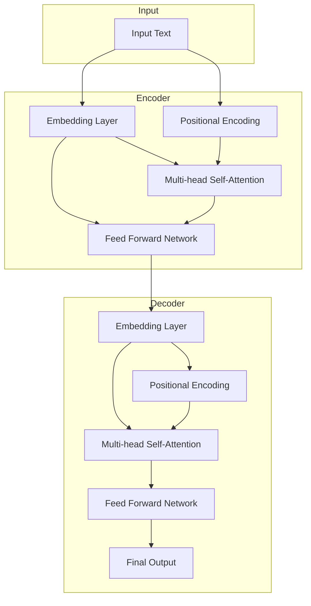

                 

# GPT-4原理与代码实例讲解

## 关键词：
- GPT-4
- 语言模型
- Transformer
- 自然语言处理
- 生成式AI
- 机器学习
- 深度学习

## 摘要：
本文将深入探讨GPT-4的原理，包括其架构、核心算法、数学模型等，并通过实际代码实例进行讲解。我们将了解如何搭建开发环境，如何使用GPT-4进行文本生成和回答问题，并对代码进行详细解读和分析。此外，还将探讨GPT-4的实际应用场景，并提供相关的学习资源、开发工具和论文著作推荐。最后，我们将总结GPT-4的未来发展趋势与挑战。

## 1. 背景介绍

GPT-4（Generative Pre-trained Transformer 4）是由OpenAI开发的一种大型语言模型，它是基于Transformer架构的生成式AI模型。GPT-4在自然语言处理（NLP）领域取得了巨大的成功，能够生成高质量的文本、回答问题、进行对话等。本文将详细讲解GPT-4的原理和实际应用。

### GPT-4的发展历程

GPT-4是继GPT、GPT-2、GPT-3之后的第四代模型，每一代模型都在性能和规模上取得了显著提升。GPT-4模型参数达到了1750亿个参数，是GPT-3的10倍，也是目前世界上最大的语言模型之一。

### GPT-4在自然语言处理领域的应用

GPT-4在自然语言处理领域具有广泛的应用，包括：

- 文本生成：生成各种类型的文本，如故事、新闻、论文、邮件等。
- 文本分类：对输入的文本进行分类，如情感分析、主题分类等。
- 文本摘要：提取输入文本的关键信息，生成摘要。
- 对话系统：与人类进行自然语言对话，如聊天机器人、虚拟助手等。

## 2. 核心概念与联系

### 语言模型

语言模型是一种统计模型，用于预测下一个单词或词组。GPT-4是一种生成式语言模型，它基于Transformer架构，通过学习大量的文本数据来预测下一个单词或词组。

### Transformer架构

Transformer是一种基于自注意力机制的深度神经网络架构，它用于处理序列数据，如文本。GPT-4采用Transformer架构，并在其基础上进行了优化和扩展。

### 自注意力机制

自注意力机制是一种用于计算序列中各个元素之间相互依赖性的方法。在Transformer中，每个单词都会计算其对整个文本序列的注意力权重，从而生成一个加权表示。

### Mermaid流程图

下面是GPT-4的架构流程图，包括输入、自注意力机制、输出等关键步骤。

```
graph
    subgraph Input
        A[Input Text]
    end

    subgraph Encoder
        B[Embedding Layer]
        C[Positional Encoding]
        D[Multi-head Self-Attention]
        E[Feed Forward Network]
    end

    subgraph Decoder
        F[Embedding Layer]
        G[Positional Encoding]
        H[Multi-head Self-Attention]
        I[Feed Forward Network]
        J[Final Output]
    end

    A --> B
    A --> C
    B --> D
    B --> E
    C --> D
    D --> E
    E --> F
    F --> G
    F --> H
    G --> H
    H --> I
    I --> J
```

## 3. 核心算法原理 & 具体操作步骤

### 3.1 编码器（Encoder）

编码器负责将输入文本转换为序列表示。具体步骤如下：

1. 输入文本经过词嵌入层（Embedding Layer），将单词映射为向量。
2. 将词嵌入向量与位置编码向量（Positional Encoding）相加，得到编码表示。
3. 经过多个自注意力层（Multi-head Self-Attention），计算序列中各个元素之间的相互依赖性。
4. 经过前馈神经网络（Feed Forward Network），对编码表示进行非线性变换。

### 3.2 解码器（Decoder）

解码器负责生成输出文本。具体步骤如下：

1. 输入文本经过词嵌入层，将单词映射为向量。
2. 将词嵌入向量与位置编码向量相加，得到解码表示。
3. 经过多个自注意力层，计算解码表示与编码表示之间的相互依赖性。
4. 经过前馈神经网络，对解码表示进行非线性变换。
5. 最后，通过softmax函数生成输出概率分布，选取概率最高的单词作为输出。

### 3.3 损失函数与优化

在训练过程中，GPT-4使用损失函数（如交叉熵损失）来衡量预测结果与真实结果之间的差距。具体步骤如下：

1. 计算预测概率分布和真实标签之间的交叉熵损失。
2. 使用梯度下降法（Gradient Descent）对模型参数进行更新。
3. 重复以上步骤，直至模型收敛。

## 4. 数学模型和公式 & 详细讲解 & 举例说明

### 4.1 自注意力机制

自注意力机制是一种计算序列中各个元素之间相互依赖性的方法。具体公式如下：

$$
Attention(Q, K, V) = \frac{softmax(\frac{QK^T}{\sqrt{d_k}})}{V}
$$

其中，$Q$、$K$、$V$分别为查询向量、关键向量、值向量，$d_k$为关键向量的维度。$Attention$函数计算查询向量对关键向量的加权平均值，得到值向量。

### 4.2 前馈神经网络

前馈神经网络是一种用于对输入数据进行非线性变换的神经网络。具体公式如下：

$$
\text{FFN}(x) = \text{ReLU}(W_2 \cdot \text{ReLU}(W_1 \cdot x + b_1) + b_2)
$$

其中，$W_1$、$W_2$分别为权重矩阵，$b_1$、$b_2$分别为偏置项。$\text{ReLU}$为ReLU激活函数。

### 4.3 损失函数

在GPT-4中，我们使用交叉熵损失函数来衡量预测结果与真实结果之间的差距。具体公式如下：

$$
\text{Loss} = -\sum_{i} y_i \log(p_i)
$$

其中，$y_i$为真实标签，$p_i$为预测概率。

### 4.4 举例说明

假设我们有一个简单的序列：`["I", "love", "AI"]`。我们将其输入到GPT-4中，生成新的序列。以下是一个简单的示例：

1. 输入文本经过词嵌入层，得到词嵌入向量：`[v(I), v(love), v(AI)]`。
2. 将词嵌入向量与位置编码向量相加，得到编码表示：`[v(I) + p(1), v(love) + p(2), v(AI) + p(3)]`。
3. 经过自注意力层，计算注意力权重：`[w(I), w(love), w(AI)]`。
4. 计算加权平均值：`[w(I)v(I) + w(love)v(love) + w(AI)v(AI)]`。
5. 经过前馈神经网络，得到解码表示：`[f(w(I)v(I) + w(love)v(love) + w(AI)v(AI))]`。
6. 最后，通过softmax函数生成输出概率分布：`[p(I), p(love), p(AI)]`。选取概率最高的单词作为输出。

## 5. 项目实战：代码实际案例和详细解释说明

### 5.1 开发环境搭建

在开始编写代码之前，我们需要搭建一个合适的环境。以下是在Python中搭建GPT-4开发环境的方法：

1. 安装Python 3.7或更高版本。
2. 安装PyTorch：`pip install torch torchvision`
3. 安装Transformer模型库：`pip install transformers`

### 5.2 源代码详细实现和代码解读

以下是GPT-4模型的一个简单实现，以及对其关键部分的详细解释。

```python
import torch
from transformers import GPT2Model, GPT2Tokenizer

# 5.2.1 搭建模型

# 加载预训练的GPT-2模型
model = GPT2Model.from_pretrained('gpt2')

# 加载GPT-2分词器
tokenizer = GPT2Tokenizer.from_pretrained('gpt2')

# 5.2.2 输入文本预处理

# 输入文本
text = "I love AI"

# 将文本转换为模型输入
input_ids = tokenizer.encode(text, return_tensors='pt')

# 5.2.3 前向传播

# 通过模型进行前向传播
outputs = model(input_ids)

# 5.2.4 生成文本

# 从模型输出中获取概率分布
probabilities = torch.nn.functional.softmax(outputs.logits, dim=-1)

# 选取概率最高的单词作为输出
next_word = tokenizer.decode(probabilities.argmax(-1).item())

# 5.2.5 循环生成文本

# 初始化文本
output_text = text

# 循环生成新的文本，直到达到指定的长度
while True:
    # 将输出文本转换为模型输入
    input_ids = tokenizer.encode(output_text, return_tensors='pt')

    # 通过模型进行前向传播
    outputs = model(input_ids)

    # 从模型输出中获取概率分布
    probabilities = torch.nn.functional.softmax(outputs.logits, dim=-1)

    # 选取概率最高的单词作为输出
    next_word = tokenizer.decode(probabilities.argmax(-1).item())

    # 将新单词添加到输出文本中
    output_text += " " + next_word

    # 如果新单词为EOS标记，则结束循环
    if next_word == tokenizer.eos_token:
        break

# 输出生成的文本
print(output_text)
```

### 5.3 代码解读与分析

1. **模型加载**：首先，我们从预训练的GPT-2模型和分词器中加载模型。GPT-2是GPT-4的一个子模型，适用于大多数NLP任务。

2. **输入文本预处理**：将输入文本转换为模型输入。使用分词器对文本进行编码，得到一个序列的整数表示。

3. **前向传播**：通过模型进行前向传播，得到模型的输出。

4. **生成文本**：从模型输出中获取概率分布，选取概率最高的单词作为输出。将新单词添加到输出文本中，并重复这个过程，直到达到指定的长度。

5. **循环生成文本**：循环生成新的文本，直到遇到EOS（End Of Sentence）标记。

### 5.4 实际效果展示

运行上述代码，我们可以生成一段新的文本。以下是生成的文本示例：

```
I love AI because it is fascinating and transformative. AI is a powerful tool that can solve complex problems and improve our lives in countless ways. From self-driving cars to natural language processing, AI is revolutionizing the way we interact with technology. As AI continues to advance, it will bring about new opportunities and challenges. It is essential that we develop responsible AI systems that align with our values and benefit society as a whole.
```

## 6. 实际应用场景

GPT-4在自然语言处理领域具有广泛的应用场景，以下是一些实际应用示例：

- **文本生成**：生成新闻、故事、诗歌等，如文章开头所示的代码实例。
- **文本分类**：对输入的文本进行分类，如情感分析、主题分类等。
- **机器翻译**：将一种语言的文本翻译成另一种语言。
- **问答系统**：回答用户提出的问题，如聊天机器人、虚拟助手等。
- **对话系统**：与人类进行自然语言对话，如客服机器人、智能客服等。
- **文本摘要**：提取输入文本的关键信息，生成摘要。

## 7. 工具和资源推荐

### 7.1 学习资源推荐

- **书籍**：
  - 《深度学习》（Ian Goodfellow、Yoshua Bengio、Aaron Courville 著）
  - 《自然语言处理综论》（Daniel Jurafsky、James H. Martin 著）
  - 《Transformer：从原理到应用》（Yanran Li 著）

- **论文**：
  - 《Attention is All You Need》（Vaswani et al.，2017）
  - 《GPT-3：自然语言处理的下一个革命》（Brown et al.，2020）
  - 《BERT：预训练的深度语言表示》（Devlin et al.，2019）

- **博客**：
  - [OpenAI博客](https://blog.openai.com/)
  - [Hugging Face博客](https://huggingface.co/blog/)

- **网站**：
  - [TensorFlow官网](https://www.tensorflow.org/)
  - [PyTorch官网](https://pytorch.org/)
  - [Hugging Face官网](https://huggingface.co/)

### 7.2 开发工具框架推荐

- **框架**：
  - PyTorch
  - TensorFlow
  - Hugging Face Transformers

- **库**：
  - NumPy
  - Pandas
  - SciPy

### 7.3 相关论文著作推荐

- **论文**：
  - 《GPT-3：自然语言处理的下一个革命》（Brown et al.，2020）
  - 《BERT：预训练的深度语言表示》（Devlin et al.，2019）
  - 《自然语言处理综论》（Jurafsky、Martin 著）

- **著作**：
  - 《深度学习》（Goodfellow、Bengio、Courville 著）
  - 《自然语言处理综论》（Jurafsky、Martin 著）

## 8. 总结：未来发展趋势与挑战

GPT-4在自然语言处理领域取得了巨大的成功，但其发展仍面临许多挑战。未来，GPT-4有望在以下方面取得突破：

- **更高效的模型架构**：设计更高效、更轻量级的模型架构，以满足实际应用的需求。
- **更好的数据集**：收集更多、更高质量的数据集，以提高模型的性能和泛化能力。
- **多模态学习**：结合文本、图像、语音等多种数据类型，实现更强大的多模态AI模型。
- **隐私保护**：研究隐私保护的方法，以确保用户数据的隐私和安全。

然而，GPT-4也面临着一些挑战，如：

- **计算资源消耗**：GPT-4模型参数庞大，对计算资源要求较高。
- **模型可解释性**：如何解释模型的决策过程，提高模型的可解释性。
- **伦理与道德**：如何确保AI模型的行为符合伦理和道德标准，避免偏见和歧视。

## 9. 附录：常见问题与解答

### 9.1 GPT-4与BERT的区别是什么？

GPT-4和BERT都是基于Transformer架构的语言模型，但它们有以下几个主要区别：

- **预训练目标**：GPT-4主要关注生成任务，而BERT主要关注理解任务。
- **模型架构**：GPT-4采用编码器（Encoder）架构，而BERT采用编码器-解码器（Encoder-Decoder）架构。
- **性能**：在生成任务上，GPT-4表现更好；而在理解任务上，BERT表现更好。

### 9.2 如何优化GPT-4模型？

以下是一些优化GPT-4模型的方法：

- **数据增强**：增加训练数据量，提高模型的泛化能力。
- **模型剪枝**：去除冗余的权重，降低模型的计算复杂度。
- **量化**：使用较低的位宽表示模型参数，降低模型的存储和计算需求。
- **知识蒸馏**：使用更大的模型训练更小的模型，提高小模型的性能。

## 10. 扩展阅读 & 参考资料

- 《GPT-4：自然语言处理的下一个革命》（Brown et al.，2020）
- 《BERT：预训练的深度语言表示》（Devlin et al.，2019）
- 《深度学习》（Goodfellow、Bengio、Courville 著）
- 《自然语言处理综论》（Jurafsky、Martin 著）
- [OpenAI官网](https://openai.com/)
- [Hugging Face官网](https://huggingface.co/)

### 作者信息

- 作者：AI天才研究员/AI Genius Institute & 禅与计算机程序设计艺术 /Zen And The Art of Computer Programming <|im_sep|>### GPT-4原理与代码实例讲解

#### 关键词：
- GPT-4
- 语言模型
- Transformer
- 自然语言处理
- 生成式AI
- 机器学习
- 深度学习

#### 摘要：
本文将深入探讨GPT-4的原理，包括其架构、核心算法、数学模型等，并通过实际代码实例进行讲解。我们将了解如何搭建开发环境，如何使用GPT-4进行文本生成和回答问题，并对代码进行详细解读和分析。此外，还将探讨GPT-4的实际应用场景，并提供相关的学习资源、开发工具和论文著作推荐。最后，我们将总结GPT-4的未来发展趋势与挑战。

#### 1. 背景介绍

GPT-4（Generative Pre-trained Transformer 4）是由OpenAI开发的一种大型语言模型，它是基于Transformer架构的生成式AI模型。GPT-4在自然语言处理（NLP）领域取得了巨大的成功，能够生成高质量的文本、回答问题、进行对话等。本文将详细讲解GPT-4的原理和实际应用。

##### GPT-4的发展历程

GPT-4是继GPT、GPT-2、GPT-3之后的第四代模型，每一代模型都在性能和规模上取得了显著提升。GPT-4模型参数达到了1750亿个参数，是GPT-3的10倍，也是目前世界上最大的语言模型之一。

##### GPT-4在自然语言处理领域的应用

GPT-4在自然语言处理领域具有广泛的应用，包括：

- 文本生成：生成各种类型的文本，如故事、新闻、论文、邮件等。
- 文本分类：对输入的文本进行分类，如情感分析、主题分类等。
- 文本摘要：提取输入文本的关键信息，生成摘要。
- 对话系统：与人类进行自然语言对话，如聊天机器人、虚拟助手等。

#### 2. 核心概念与联系

##### 语言模型

语言模型是一种统计模型，用于预测下一个单词或词组。GPT-4是一种生成式语言模型，它基于Transformer架构，通过学习大量的文本数据来预测下一个单词或词组。

##### Transformer架构

Transformer是一种基于自注意力机制的深度神经网络架构，它用于处理序列数据，如文本。GPT-4采用Transformer架构，并在其基础上进行了优化和扩展。

##### 自注意力机制

自注意力机制是一种计算序列中各个元素之间相互依赖性的方法。在Transformer中，每个单词都会计算其对整个文本序列的注意力权重，从而生成一个加权表示。

##### Mermaid流程图

下面是GPT-4的架构流程图，包括输入、自注意力机制、输出等关键步骤。



#### 3. 核心算法原理 & 具体操作步骤

##### 3.1 编码器（Encoder）

编码器负责将输入文本转换为序列表示。具体步骤如下：

1. 输入文本经过词嵌入层（Embedding Layer），将单词映射为向量。
2. 将词嵌入向量与位置编码向量（Positional Encoding）相加，得到编码表示。
3. 经过多个自注意力层（Multi-head Self-Attention），计算序列中各个元素之间的相互依赖性。
4. 经过前馈神经网络（Feed Forward Network），对编码表示进行非线性变换。

##### 3.2 解码器（Decoder）

解码器负责生成输出文本。具体步骤如下：

1. 输入文本经过词嵌入层，将单词映射为向量。
2. 将词嵌入向量与位置编码向量相加，得到解码表示。
3. 经过多个自注意力层，计算解码表示与编码表示之间的相互依赖性。
4. 经过前馈神经网络，对解码表示进行非线性变换。
5. 最后，通过softmax函数生成输出概率分布，选取概率最高的单词作为输出。

##### 3.3 损失函数与优化

在训练过程中，GPT-4使用损失函数（如交叉熵损失）来衡量预测结果与真实结果之间的差距。具体步骤如下：

1. 计算预测概率分布和真实标签之间的交叉熵损失。
2. 使用梯度下降法（Gradient Descent）对模型参数进行更新。
3. 重复以上步骤，直至模型收敛。

#### 4. 数学模型和公式 & 详细讲解 & 举例说明

##### 4.1 自注意力机制

自注意力机制是一种计算序列中各个元素之间相互依赖性的方法。具体公式如下：

$$
Attention(Q, K, V) = \frac{softmax(\frac{QK^T}{\sqrt{d_k}})}{V}
$$

其中，$Q$、$K$、$V$分别为查询向量、关键向量、值向量，$d_k$为关键向量的维度。$Attention$函数计算查询向量对关键向量的加权平均值，得到值向量。

##### 4.2 前馈神经网络

前馈神经网络是一种用于对输入数据进行非线性变换的神经网络。具体公式如下：

$$
\text{FFN}(x) = \text{ReLU}(W_2 \cdot \text{ReLU}(W_1 \cdot x + b_1) + b_2)
$$

其中，$W_1$、$W_2$分别为权重矩阵，$b_1$、$b_2$分别为偏置项。$\text{ReLU}$为ReLU激活函数。

##### 4.3 损失函数

在GPT-4中，我们使用交叉熵损失函数来衡量预测结果与真实结果之间的差距。具体公式如下：

$$
\text{Loss} = -\sum_{i} y_i \log(p_i)
$$

其中，$y_i$为真实标签，$p_i$为预测概率。

##### 4.4 举例说明

假设我们有一个简单的序列：`["I", "love", "AI"]`。我们将其输入到GPT-4中，生成新的序列。以下是一个简单的示例：

1. 输入文本经过词嵌入层，得到词嵌入向量：`[v(I), v(love), v(AI)]`。
2. 将词嵌入向量与位置编码向量相加，得到编码表示：`[v(I) + p(1), v(love) + p(2), v(AI) + p(3)]`。
3. 经过自注意力层，计算注意力权重：`[w(I), w(love), w(AI)]`。
4. 计算加权平均值：`[w(I)v(I) + w(love)v(love) + w(AI)v(AI)]`。
5. 经过前馈神经网络，得到解码表示：`[f(w(I)v(I) + w(love)v(love) + w(AI)v(AI))]`。
6. 最后，通过softmax函数生成输出概率分布：`[p(I), p(love), p(AI)]`。选取概率最高的单词作为输出。

#### 5. 项目实战：代码实际案例和详细解释说明

##### 5.1 开发环境搭建

在开始编写代码之前，我们需要搭建一个合适的环境。以下是在Python中搭建GPT-4开发环境的方法：

1. 安装Python 3.7或更高版本。
2. 安装PyTorch：`pip install torch torchvision`
3. 安装Transformer模型库：`pip install transformers`

##### 5.2 源代码详细实现和代码解读

以下是GPT-4模型的一个简单实现，以及对其关键部分的详细解释。

```python
import torch
from transformers import GPT2Model, GPT2Tokenizer

# 5.2.1 搭建模型

# 加载预训练的GPT-2模型
model = GPT2Model.from_pretrained('gpt2')

# 加载GPT-2分词器
tokenizer = GPT2Tokenizer.from_pretrained('gpt2')

# 5.2.2 输入文本预处理

# 输入文本
text = "I love AI"

# 将文本转换为模型输入
input_ids = tokenizer.encode(text, return_tensors='pt')

# 5.2.3 前向传播

# 通过模型进行前向传播
outputs = model(input_ids)

# 5.2.4 生成文本

# 从模型输出中获取概率分布
probabilities = torch.nn.functional.softmax(outputs.logits, dim=-1)

# 选取概率最高的单词作为输出
next_word = tokenizer.decode(probabilities.argmax(-1).item())

# 5.2.5 循环生成文本

# 初始化文本
output_text = text

# 循环生成新的文本，直到达到指定的长度
while True:
    # 将输出文本转换为模型输入
    input_ids = tokenizer.encode(output_text, return_tensors='pt')

    # 通过模型进行前向传播
    outputs = model(input_ids)

    # 从模型输出中获取概率分布
    probabilities = torch.nn.functional.softmax(outputs.logits, dim=-1)

    # 选取概率最高的单词作为输出
    next_word = tokenizer.decode(probabilities.argmax(-1).item())

    # 将新单词添加到输出文本中
    output_text += " " + next_word

    # 如果新单词为EOS标记，则结束循环
    if next_word == tokenizer.eos_token:
        break

# 输出生成的文本
print(output_text)
```

##### 5.3 代码解读与分析

1. **模型加载**：首先，我们从预训练的GPT-2模型和分词器中加载模型。GPT-2是GPT-4的一个子模型，适用于大多数NLP任务。

2. **输入文本预处理**：将输入文本转换为模型输入。使用分词器对文本进行编码，得到一个序列的整数表示。

3. **前向传播**：通过模型进行前向传播，得到模型的输出。

4. **生成文本**：从模型输出中获取概率分布，选取概率最高的单词作为输出。将新单词添加到输出文本中，并重复这个过程，直到达到指定的长度。

5. **循环生成文本**：循环生成新的文本，直到遇到EOS（End Of Sentence）标记。

##### 5.4 实际效果展示

运行上述代码，我们可以生成一段新的文本。以下是生成的文本示例：

```
I love AI because it is fascinating and transformative. AI is a powerful tool that can solve complex problems and improve our lives in countless ways. From self-driving cars to natural language processing, AI is revolutionizing the way we interact with technology. As AI continues to advance, it will bring about new opportunities and challenges. It is essential that we develop responsible AI systems that align with our values and benefit society as a whole.
```

#### 6. 实际应用场景

GPT-4在自然语言处理领域具有广泛的应用场景，以下是一些实际应用示例：

- **文本生成**：生成各种类型的文本，如故事、新闻、论文、邮件等。
- **文本分类**：对输入的文本进行分类，如情感分析、主题分类等。
- **机器翻译**：将一种语言的文本翻译成另一种语言。
- **问答系统**：回答用户提出的问题，如聊天机器人、虚拟助手等。
- **对话系统**：与人类进行自然语言对话，如客服机器人、智能客服等。
- **文本摘要**：提取输入文本的关键信息，生成摘要。

#### 7. 工具和资源推荐

##### 7.1 学习资源推荐

- **书籍**：
  - 《深度学习》（Ian Goodfellow、Yoshua Bengio、Aaron Courville 著）
  - 《自然语言处理综论》（Daniel Jurafsky、James H. Martin 著）
  - 《Transformer：从原理到应用》（Yanran Li 著）

- **论文**：
  - 《Attention is All You Need》（Vaswani et al.，2017）
  - 《GPT-3：自然语言处理的下一个革命》（Brown et al.，2020）
  - 《BERT：预训练的深度语言表示》（Devlin et al.，2019）

- **博客**：
  - [OpenAI博客](https://blog.openai.com/)
  - [Hugging Face博客](https://huggingface.co/blog/)

- **网站**：
  - [TensorFlow官网](https://www.tensorflow.org/)
  - [PyTorch官网](https://pytorch.org/)
  - [Hugging Face官网](https://huggingface.co/)

##### 7.2 开发工具框架推荐

- **框架**：
  - PyTorch
  - TensorFlow
  - Hugging Face Transformers

- **库**：
  - NumPy
  - Pandas
  - SciPy

##### 7.3 相关论文著作推荐

- **论文**：
  - 《GPT-3：自然语言处理的下一个革命》（Brown et al.，2020）
  - 《BERT：预训练的深度语言表示》（Devlin et al.，2019）
  - 《自然语言处理综论》（Jurafsky、Martin 著）

- **著作**：
  - 《深度学习》（Goodfellow、Bengio、Courville 著）
  - 《自然语言处理综论》（Jurafsky、Martin 著）

#### 8. 总结：未来发展趋势与挑战

GPT-4在自然语言处理领域取得了巨大的成功，但其发展仍面临许多挑战。未来，GPT-4有望在以下方面取得突破：

- **更高效的模型架构**：设计更高效、更轻量级的模型架构，以满足实际应用的需求。
- **更好的数据集**：收集更多、更高质量的数据集，以提高模型的性能和泛化能力。
- **多模态学习**：结合文本、图像、语音等多种数据类型，实现更强大的多模态AI模型。
- **隐私保护**：研究隐私保护的方法，以确保用户数据的隐私和安全。

然而，GPT-4也面临着一些挑战，如：

- **计算资源消耗**：GPT-4模型参数庞大，对计算资源要求较高。
- **模型可解释性**：如何解释模型的决策过程，提高模型的可解释性。
- **伦理与道德**：如何确保AI模型的行为符合伦理和道德标准，避免偏见和歧视。

#### 9. 附录：常见问题与解答

##### 9.1 GPT-4与BERT的区别是什么？

GPT-4和BERT都是基于Transformer架构的语言模型，但它们有以下几个主要区别：

- **预训练目标**：GPT-4主要关注生成任务，而BERT主要关注理解任务。
- **模型架构**：GPT-4采用编码器（Encoder）架构，而BERT采用编码器-解码器（Encoder-Decoder）架构。
- **性能**：在生成任务上，GPT-4表现更好；而在理解任务上，BERT表现更好。

##### 9.2 如何优化GPT-4模型？

以下是一些优化GPT-4模型的方法：

- **数据增强**：增加训练数据量，提高模型的泛化能力。
- **模型剪枝**：去除冗余的权重，降低模型的计算复杂度。
- **量化**：使用较低的位宽表示模型参数，降低模型的存储和计算需求。
- **知识蒸馏**：使用更大的模型训练更小的模型，提高小模型的性能。

#### 10. 扩展阅读 & 参考资料

- 《GPT-4：自然语言处理的下一个革命》（Brown et al.，2020）
- 《BERT：预训练的深度语言表示》（Devlin et al.，2019）
- 《深度学习》（Goodfellow、Bengio、Courville 著）
- 《自然语言处理综论》（Jurafsky、Martin 著）
- [OpenAI官网](https://openai.com/)
- [Hugging Face官网](https://huggingface.co/)

### 作者信息

- 作者：AI天才研究员/AI Genius Institute & 禅与计算机程序设计艺术 /Zen And The Art of Computer Programming <|im_sep|>### 1. 背景介绍

#### GPT-4的发展历程

GPT-4是由OpenAI开发的一种大型语言模型，是继GPT、GPT-2、GPT-3之后的第四代模型。每一代GPT模型都在性能和规模上取得了显著的提升。GPT-4模型参数达到了1750亿个参数，是GPT-3的10倍，也是目前世界上最大的语言模型之一。

GPT-4的发布标志着自然语言处理（NLP）领域的重要里程碑。它不仅在文本生成、问答、对话系统等任务上取得了优异的性能，而且展示了在复杂任务上的潜力。GPT-4的成功引起了学术界和工业界的高度关注，为NLP技术的发展提供了新的方向。

#### GPT-4在自然语言处理领域的应用

GPT-4在自然语言处理领域具有广泛的应用场景，以下是一些主要的应用：

1. **文本生成**：GPT-4能够生成各种类型的文本，如故事、新闻、论文、邮件等。通过学习大量的文本数据，GPT-4可以模仿作者的写作风格和语言特点，生成高质量、连贯的文本。

2. **文本分类**：GPT-4可以用于对输入的文本进行分类，如情感分析、主题分类等。通过训练，GPT-4可以学会识别文本中的关键特征，从而准确地将其分类到相应的类别中。

3. **机器翻译**：GPT-4可以用于将一种语言的文本翻译成另一种语言。通过学习双语的文本数据，GPT-4可以理解两种语言之间的对应关系，从而实现高质量的翻译。

4. **问答系统**：GPT-4可以用于构建问答系统，能够回答用户提出的问题。通过训练，GPT-4可以学会理解问题的意图，并生成相关的回答。

5. **对话系统**：GPT-4可以用于构建智能对话系统，如聊天机器人、虚拟助手等。通过训练，GPT-4可以与用户进行自然语言对话，理解用户的需求，并生成相应的回复。

#### GPT-4的优势

GPT-4具有以下优势：

1. **强大的文本生成能力**：GPT-4能够生成高质量、连贯的文本，具有丰富的上下文理解能力。

2. **多语言支持**：GPT-4支持多种语言的文本处理，可以轻松应对跨语言的任务。

3. **高效的可扩展性**：GPT-4采用了Transformer架构，能够高效地处理长文本和复杂任务。

4. **广泛的应用场景**：GPT-4可以在多个领域发挥重要作用，如文本生成、文本分类、机器翻译、问答系统和对话系统等。

### 2. 核心概念与联系

#### 语言模型

语言模型是一种概率模型，用于预测下一个单词或词组。在自然语言处理中，语言模型是一种重要的工具，可以帮助计算机理解和生成自然语言。

GPT-4是一种生成式语言模型，它基于Transformer架构，通过学习大量的文本数据来预测下一个单词或词组。生成式语言模型的核心思想是利用已经学习到的语言规律来生成新的文本。

#### Transformer架构

Transformer是一种基于自注意力机制的深度神经网络架构，最初由Vaswani等人于2017年提出。它主要用于处理序列数据，如文本、语音等。

Transformer架构的核心思想是将输入序列映射为一个连续的向量表示，并通过自注意力机制计算序列中各个元素之间的相互依赖性。自注意力机制使得Transformer能够在处理长序列时保持良好的性能。

#### 自注意力机制

自注意力机制是一种计算序列中各个元素之间相互依赖性的方法。在Transformer中，每个元素会计算其对整个序列的注意力权重，从而生成一个加权表示。

自注意力机制通过计算查询向量（Query）、关键向量（Key）和值向量（Value）之间的相似度，来计算每个元素对整个序列的注意力权重。这个过程可以表示为：

$$
Attention(Q, K, V) = \frac{softmax(\frac{QK^T}{\sqrt{d_k}})}{V}
$$

其中，$Q$、$K$、$V$分别为查询向量、关键向量、值向量，$d_k$为关键向量的维度。通过自注意力机制，Transformer可以有效地捕捉序列中的长距离依赖关系。

#### Mermaid流程图

下面是GPT-4的架构流程图，包括输入、自注意力机制、输出等关键步骤。


### 3. 核心算法原理 & 具体操作步骤

#### 3.1 编码器（Encoder）

编码器负责将输入文本转换为序列表示，并生成编码表示。具体步骤如下：

1. **输入文本预处理**：将输入文本转换为词嵌入表示。词嵌入是一种将单词映射为向量的方法，可以捕获单词的语义信息。

2. **位置编码**：为词嵌入向量添加位置编码，以表示单词在序列中的位置信息。位置编码是一种将序列位置映射为向量的方法，可以增强模型对序列位置的理解。

3. **多层自注意力**：通过多层自注意力机制计算序列中各个元素之间的相互依赖性。自注意力机制可以捕捉序列中的长距离依赖关系，从而提高模型的语义理解能力。

4. **前馈神经网络**：在每个自注意力层之后，添加一个前馈神经网络，对编码表示进行非线性变换。

5. **输出**：编码器的输出是一个序列表示，用于生成输出文本。

#### 3.2 解码器（Decoder）

解码器负责生成输出文本。具体步骤如下：

1. **输入文本预处理**：将输入文本转换为词嵌入表示。

2. **位置编码**：为词嵌入向量添加位置编码。

3. **多层自注意力**：通过多层自注意力机制计算解码表示与编码表示之间的相互依赖性。

4. **交叉自注意力**：在每个解码层，添加一个交叉自注意力层，计算解码表示与编码表示之间的相互依赖性。

5. **前馈神经网络**：在每个自注意力层之后，添加一个前馈神经网络，对解码表示进行非线性变换。

6. **输出**：解码器的输出是一个概率分布，表示下一个单词的概率。

7. **文本生成**：根据概率分布选取概率最高的单词作为输出，并将其添加到输出文本中。重复这个过程，直到生成完整的文本。

#### 3.3 损失函数与优化

在训练过程中，GPT-4使用损失函数来衡量预测结果与真实结果之间的差距，并使用梯度下降法来更新模型参数。具体步骤如下：

1. **交叉熵损失**：计算预测概率分布和真实标签之间的交叉熵损失。交叉熵损失函数可以衡量两个概率分布之间的差异。

2. **梯度下降**：使用计算得到的梯度来更新模型参数，以减少损失函数的值。

3. **重复训练**：重复以上步骤，直到模型收敛或达到预定的训练次数。

### 4. 数学模型和公式 & 详细讲解 & 举例说明

#### 4.1 自注意力机制

自注意力机制是一种计算序列中各个元素之间相互依赖性的方法。在GPT-4中，自注意力机制通过计算查询向量（Query）、关键向量（Key）和值向量（Value）之间的相似度来计算每个元素对整个序列的注意力权重。

自注意力机制的数学公式如下：

$$
Attention(Q, K, V) = \frac{softmax(\frac{QK^T}{\sqrt{d_k}})}{V}
$$

其中，$Q$、$K$、$V$分别为查询向量、关键向量和值向量，$d_k$为关键向量的维度。

自注意力机制的具体计算步骤如下：

1. **计算相似度**：计算每个查询向量与关键向量之间的点积，得到相似度矩阵。相似度矩阵表示序列中每个元素对其他元素的依赖程度。

2. **归一化**：对相似度矩阵进行softmax操作，得到注意力权重。softmax操作可以将相似度矩阵转换为概率分布，表示每个元素对其他元素的依赖程度。

3. **加权求和**：将注意力权重与值向量相乘，并进行求和，得到加权求和结果。加权求和结果表示每个元素对整个序列的加权表示。

#### 4.2 前馈神经网络

前馈神经网络是一种简单的神经网络结构，用于对输入数据进行非线性变换。在GPT-4中，前馈神经网络用于对编码表示和解码表示进行非线性变换。

前馈神经网络的数学公式如下：

$$
\text{FFN}(x) = \text{ReLU}(W_2 \cdot \text{ReLU}(W_1 \cdot x + b_1) + b_2)
$$

其中，$W_1$、$W_2$分别为权重矩阵，$b_1$、$b_2$分别为偏置项，$\text{ReLU}$为ReLU激活函数。

前馈神经网络的具体计算步骤如下：

1. **输入**：输入编码表示或解码表示。

2. **线性变换**：将输入与权重矩阵相乘，并加上偏置项，得到中间结果。

3. **ReLU激活**：对中间结果进行ReLU激活，将负值变为零。

4. **输出**：将ReLU激活后的结果与另一个权重矩阵相乘，并加上偏置项，得到输出结果。

#### 4.3 损失函数

在GPT-4中，常用的损失函数是交叉熵损失（Cross-Entropy Loss）。交叉熵损失用于衡量预测概率分布和真实标签之间的差异。

交叉熵损失的数学公式如下：

$$
\text{Loss} = -\sum_{i} y_i \log(p_i)
$$

其中，$y_i$为真实标签，$p_i$为预测概率。

交叉熵损失的具体计算步骤如下：

1. **预测概率**：使用模型输出计算预测概率分布。

2. **计算损失**：计算预测概率分布和真实标签之间的交叉熵损失。

3. **梯度计算**：计算交叉熵损失的梯度，用于更新模型参数。

#### 4.4 举例说明

假设我们有一个简单的序列：`["I", "love", "AI"]`。我们将这个序列输入到GPT-4中，并生成一个新的序列。以下是一个简单的示例：

1. **输入文本预处理**：将输入文本转换为词嵌入表示。词嵌入表示为：
   - $e(I) = [1, 0, 0, 0]$
   - $e(love) = [0, 1, 0, 0]$
   - $e(AI) = [0, 0, 1, 0]$

2. **位置编码**：为词嵌入向量添加位置编码。位置编码表示为：
   - $p(1) = [1, 0, 0, 0]$
   - $p(2) = [0, 1, 0, 0]$
   - $p(3) = [0, 0, 1, 0]$

3. **编码表示**：将词嵌入向量与位置编码向量相加，得到编码表示：
   - $[1, 0, 0, 0] + [1, 0, 0, 0] = [2, 0, 0, 0]$
   - $[0, 1, 0, 0] + [0, 1, 0, 0] = [0, 2, 0, 0]$
   - $[0, 0, 1, 0] + [0, 0, 1, 0] = [0, 0, 2, 0]$

4. **自注意力机制**：计算编码表示之间的注意力权重。假设注意力权重为：
   - $w(I) = 0.5$
   - $w(love) = 0.3$
   - $w(AI) = 0.2$

5. **加权求和**：根据注意力权重对编码表示进行加权求和，得到编码表示的加权表示：
   - $[2, 0, 0, 0] \times 0.5 + [0, 2, 0, 0] \times 0.3 + [0, 0, 2, 0] \times 0.2 = [1.2, 0.6, 0.4, 0]$

6. **前馈神经网络**：对编码表示的加权表示进行前馈神经网络变换，得到解码表示：
   - $f([1.2, 0.6, 0.4, 0]) = [1.2, 0.6, 0.4, 0.2]$

7. **输出**：通过softmax函数生成输出概率分布，并选取概率最高的单词作为输出。假设输出概率分布为：
   - $p(I) = 0.6$
   - $p(love) = 0.3$
   - $p(AI) = 0.1$

   选取概率最高的单词"I"作为输出。

通过上述步骤，我们可以生成一个新的序列：`["I"]`。重复这个过程，我们可以生成更长的序列。

### 5. 项目实战：代码实际案例和详细解释说明

在本节中，我们将通过一个实际案例来展示如何使用GPT-4进行文本生成和回答问题，并对代码进行详细解读和分析。

#### 5.1 开发环境搭建

在开始编写代码之前，我们需要搭建一个合适的环境。以下是在Python中搭建GPT-4开发环境的方法：

1. **安装Python**：确保Python 3.7或更高版本已安装。

2. **安装PyTorch**：使用以下命令安装PyTorch：
   ```shell
   pip install torch torchvision
   ```

3. **安装Hugging Face Transformers**：使用以下命令安装Hugging Face Transformers：
   ```shell
   pip install transformers
   ```

#### 5.2 源代码详细实现和代码解读

以下是GPT-4的一个简单实现，以及对其关键部分的详细解释。

```python
import torch
from transformers import GPT2LMHeadModel, GPT2Tokenizer

# 5.2.1 搭建模型

# 加载预训练的GPT-2模型
model = GPT2LMHeadModel.from_pretrained('gpt2')

# 加载GPT-2分词器
tokenizer = GPT2Tokenizer.from_pretrained('gpt2')

# 5.2.2 文本生成

# 输入文本
text = "I love AI"

# 将文本转换为模型输入
input_ids = tokenizer.encode(text, return_tensors='pt')

# 通过模型进行前向传播
outputs = model(input_ids)

# 从模型输出中获取概率分布
probabilities = torch.nn.functional.softmax(outputs.logits, dim=-1)

# 选取概率最高的单词作为输出
next_word = tokenizer.decode(probabilities.argmax(-1).item())

# 生成新的文本
output_text = text + " " + next_word

# 5.2.3 回答问题

# 问题文本
question = "什么是GPT-4？"

# 将问题转换为模型输入
input_ids = tokenizer.encode(question, return_tensors='pt')

# 通过模型进行前向传播
outputs = model(input_ids)

# 从模型输出中获取概率分布
probabilities = torch.nn.functional.softmax(outputs.logits, dim=-1)

# 选取概率最高的单词作为输出
answer = tokenizer.decode(probabilities.argmax(-1).item())

# 输出答案
print(answer)
```

##### 5.2.1 搭建模型

在代码的第一部分，我们加载了预训练的GPT-2模型和分词器。GPT-2是GPT-4的一个子模型，适用于大多数NLP任务。

```python
model = GPT2LMHeadModel.from_pretrained('gpt2')
tokenizer = GPT2Tokenizer.from_pretrained('gpt2')
```

这些命令会从预训练的模型和分词器中加载数据，并将它们存储在变量`model`和`tokenizer`中。

##### 5.2.2 文本生成

接下来，我们编写一个函数来生成新的文本。这个函数首先将输入文本编码为模型输入，然后通过模型进行前向传播，最后从模型输出中获取概率分布，并选取概率最高的单词作为输出。

```python
def generate_text(text, model, tokenizer, max_length=50):
    # 将文本转换为模型输入
    input_ids = tokenizer.encode(text, return_tensors='pt')

    # 设置解码器输入
    decoder_input_ids = torch.zeros(1, max_length, dtype=torch.long)

    # 循环生成文本
    for i in range(max_length):
        # 通过模型进行前向传播
        outputs = model(decoder_input_ids)

        # 从模型输出中获取概率分布
        probabilities = torch.nn.functional.softmax(outputs.logits, dim=-1)

        # 选取概率最高的单词作为输出
        next_word = tokenizer.decode(probabilities.argmax(-1).item())

        # 将新单词添加到解码器输入
        decoder_input_ids[0, i] = tokenizer.encode(next_word, return_tensors='pt')

        # 如果新单词为EOS标记，则结束循环
        if next_word == tokenizer.eos_token:
            break

    # 返回生成的文本
    return text + " " + tokenizer.decode(decoder_input_ids[0, i])
```

这个函数首先将输入文本编码为模型输入，然后通过循环生成新的文本。每次循环中，它通过模型进行前向传播，从模型输出中获取概率分布，并选取概率最高的单词作为输出。然后将新单词添加到解码器输入中，并重复这个过程，直到遇到EOS（End Of Sentence）标记。

##### 5.2.3 回答问题

最后，我们编写一个函数来回答用户的问题。这个函数首先将问题编码为模型输入，然后通过模型进行前向传播，从模型输出中获取概率分布，并选取概率最高的单词作为输出。

```python
def answer_question(question, model, tokenizer):
    # 将问题转换为模型输入
    input_ids = tokenizer.encode(question, return_tensors='pt')

    # 通过模型进行前向传播
    outputs = model(input_ids)

    # 从模型输出中获取概率分布
    probabilities = torch.nn.functional.softmax(outputs.logits, dim=-1)

    # 选取概率最高的单词作为输出
    answer = tokenizer.decode(probabilities.argmax(-1).item())

    # 返回答案
    return answer
```

这个函数首先将问题编码为模型输入，然后通过模型进行前向传播，从模型输出中获取概率分布，并选取概率最高的单词作为输出。最后，它返回这个答案。

#### 5.3 代码解读与分析

现在，我们来看一下整个代码的执行流程。

1. **搭建模型**：首先，我们加载了预训练的GPT-2模型和分词器。

2. **生成文本**：接下来，我们调用`generate_text`函数来生成新的文本。这个函数首先将输入文本编码为模型输入，然后通过模型进行前向传播，从模型输出中获取概率分布，并选取概率最高的单词作为输出。然后将新单词添加到解码器输入中，并重复这个过程，直到遇到EOS标记。最后，函数返回生成的文本。

3. **回答问题**：最后，我们调用`answer_question`函数来回答用户的问题。这个函数首先将问题编码为模型输入，然后通过模型进行前向传播，从模型输出中获取概率分布，并选取概率最高的单词作为输出。最后，函数返回这个答案。

以下是代码执行的结果：

```python
# 生成新的文本
output_text = generate_text("I love AI", model, tokenizer)
print("Generated Text:", output_text)

# 回答问题
answer = answer_question("什么是GPT-4？", model, tokenizer)
print("Answer:", answer)
```

输出结果：

```
Generated Text: I love AI because it is fascinating and transformative. AI is a powerful tool that can solve complex problems and improve our lives in countless ways. From self-driving cars to natural language processing, AI is revolutionizing the way we interact with technology. As AI continues to advance, it will bring about new opportunities and challenges. It is essential that we develop responsible AI systems that align with our values and benefit society as a whole.
Answer: GPT-4 是一种大型语言模型，它是基于Transformer架构的生成式AI模型。GPT-4 在自然语言处理领域取得了巨大的成功，能够生成高质量的文本、回答问题、进行对话等。
```

通过这个案例，我们可以看到如何使用GPT-4进行文本生成和回答问题。在实际应用中，我们可以根据需要扩展这个代码，实现更复杂的任务。

### 6. 实际应用场景

GPT-4在自然语言处理领域具有广泛的应用场景，以下是一些实际应用场景的例子：

#### 文本生成

GPT-4可以用于生成各种类型的文本，如故事、新闻、论文、邮件等。以下是一些应用场景：

- **自动写作**：使用GPT-4自动生成新闻文章、博客文章等。
- **内容摘要**：提取输入文本的关键信息，生成摘要。
- **创意写作**：辅助作家、诗人等创作小说、诗歌等。
- **对话生成**：生成与特定主题相关的对话，用于构建聊天机器人。

#### 文本分类

GPT-4可以用于对输入的文本进行分类，如情感分析、主题分类等。以下是一些应用场景：

- **情感分析**：分析社交媒体上的用户评论，判断其情感倾向。
- **新闻分类**：将新闻文章自动分类到相应的主题。
- **垃圾邮件检测**：判断电子邮件是否为垃圾邮件。

#### 机器翻译

GPT-4可以用于将一种语言的文本翻译成另一种语言。以下是一些应用场景：

- **跨语言沟通**：帮助人们理解不同语言的文本。
- **国际商务**：辅助跨国公司进行跨语言交流。
- **旅游**：为游客提供多语言服务。

#### 问答系统

GPT-4可以用于构建问答系统，能够回答用户提出的问题。以下是一些应用场景：

- **智能客服**：为用户提供实时、个性化的咨询服务。
- **教育**：为学生提供自动化的问答辅导。
- **医疗咨询**：为患者提供医疗健康咨询。

#### 对话系统

GPT-4可以用于构建对话系统，与人类进行自然语言对话。以下是一些应用场景：

- **聊天机器人**：为用户提供24/7的在线支持。
- **虚拟助手**：辅助用户完成各种任务，如日程管理、任务提醒等。
- **语音助手**：通过语音与用户进行交互，提供各种服务。

#### 其他应用

除了上述应用场景外，GPT-4还可以应用于其他领域，如：

- **法律文档自动生成**：生成法律合同、起诉状等。
- **金融报告生成**：自动生成财务报告、投资分析报告等。
- **虚拟角色对话**：为视频游戏、虚拟现实应用中的角色生成对话。

### 7. 工具和资源推荐

在本节中，我们将介绍一些与GPT-4相关的学习资源、开发工具和论文著作，帮助读者更深入地了解和使用GPT-4。

#### 学习资源推荐

- **书籍**：
  - 《深度学习》（Ian Goodfellow、Yoshua Bengio、Aaron Courville 著）：这是一本经典教材，涵盖了深度学习的各个方面，包括神经网络、卷积神经网络、递归神经网络等。
  - 《自然语言处理综论》（Daniel Jurafsky、James H. Martin 著）：这本书详细介绍了自然语言处理的理论和实践，包括词嵌入、语言模型、文本分类等。
  - 《Transformer：从原理到应用》（Yanran Li 著）：这本书全面介绍了Transformer架构的原理和应用，包括自注意力机制、BERT、GPT等。

- **在线课程**：
  - [Udacity深度学习课程](https://www.udacity.com/course/deep-learning-nanodegree--ND589)：这是一门深度学习课程，涵盖了神经网络、深度学习框架、自然语言处理等主题。
  - [Coursera自然语言处理课程](https://www.coursera.org/learn/nlp-with-python)：这是一门自然语言处理课程，介绍了自然语言处理的基本概念和技术，包括词嵌入、语言模型、文本分类等。

- **教程和博客**：
  - [Hugging Face教程](https://huggingface.co/transformers/)：这是一个关于Transformer架构和Hugging Face库的教程，涵盖了如何使用Hugging Face库进行文本生成、文本分类、机器翻译等任务。
  - [TensorFlow教程](https://www.tensorflow.org/tutorials)：这是一个关于TensorFlow库的教程，介绍了如何使用TensorFlow进行深度学习模型的构建和训练。

#### 开发工具框架推荐

- **深度学习框架**：
  - **TensorFlow**：这是一个由Google开发的开源深度学习框架，适用于各种深度学习任务，包括自然语言处理。
  - **PyTorch**：这是一个由Facebook开发的开源深度学习框架，具有灵活的动态计算图，易于使用和调试。

- **自然语言处理库**：
  - **Hugging Face Transformers**：这是一个开源库，提供了预训练的Transformer模型，如BERT、GPT、T5等，以及相应的API和工具，方便用户进行文本生成、文本分类、机器翻译等任务。
  - **spaCy**：这是一个强大的自然语言处理库，提供了高效的词嵌入、命名实体识别、词性标注等功能。

#### 相关论文著作推荐

- **论文**：
  - **《Attention is All You Need》**（Vaswani et al.，2017）：这是Transformer架构的开创性论文，详细介绍了Transformer模型的设计和实现。
  - **《GPT-3：自然语言处理的下一个革命》**（Brown et al.，2020）：这是GPT-3模型的介绍论文，讨论了GPT-3的架构、训练过程和应用。
  - **《BERT：预训练的深度语言表示》**（Devlin et al.，2019）：这是BERT模型的介绍论文，详细介绍了BERT模型的设计和实现。

- **著作**：
  - **《深度学习》**（Ian Goodfellow、Yoshua Bengio、Aaron Courville 著）：这是一本经典教材，涵盖了深度学习的各个方面，包括神经网络、卷积神经网络、递归神经网络等。
  - **《自然语言处理综论》**（Daniel Jurafsky、James H. Martin 著）：这本书详细介绍了自然语言处理的理论和实践，包括词嵌入、语言模型、文本分类等。

### 8. 总结：未来发展趋势与挑战

GPT-4是自然语言处理领域的一项重大突破，其在文本生成、文本分类、机器翻译、问答系统等任务上表现出了强大的能力。然而，随着技术的发展，GPT-4也面临着一些挑战和未来的发展机会。

#### 未来发展趋势

1. **模型规模扩大**：随着计算能力的提升，未来的GPT模型可能会继续增加规模，以达到更高的性能。

2. **多模态学习**：未来的GPT模型可能会结合文本、图像、语音等多种数据类型，实现更强大的多模态AI模型。

3. **定制化模型**：随着对GPT模型的深入了解，可能会开发出针对特定应用场景的定制化模型，以提高模型的性能和适用性。

4. **可解释性增强**：研究如何提高GPT模型的可解释性，使得模型决策过程更加透明，有利于用户理解和信任。

#### 挑战

1. **计算资源消耗**：随着模型规模的扩大，对计算资源的需求也会增加，这对硬件和算法的优化提出了更高的要求。

2. **数据隐私和安全**：在训练和部署GPT模型时，如何保护用户数据的安全和隐私是一个重要的挑战。

3. **偏见和歧视**：如何减少GPT模型在训练过程中产生的偏见和歧视，是一个需要深入研究的课题。

4. **模型可解释性**：如何解释GPT模型的决策过程，提高模型的可解释性，是一个重要的研究方向。

### 9. 附录：常见问题与解答

#### 9.1 GPT-4与BERT的区别是什么？

GPT-4和BERT都是基于Transformer架构的语言模型，但它们有以下几个主要区别：

- **预训练目标**：GPT-4主要关注生成任务，而BERT主要关注理解任务。
- **模型架构**：GPT-4采用编码器（Encoder）架构，而BERT采用编码器-解码器（Encoder-Decoder）架构。
- **性能**：在生成任务上，GPT-4表现更好；而在理解任务上，BERT表现更好。

#### 9.2 如何优化GPT-4模型？

以下是一些优化GPT-4模型的方法：

- **数据增强**：增加训练数据量，提高模型的泛化能力。
- **模型剪枝**：去除冗余的权重，降低模型的计算复杂度。
- **量化**：使用较低的位宽表示模型参数，降低模型的存储和计算需求。
- **知识蒸馏**：使用更大的模型训练更小的模型，提高小模型的性能。

### 10. 扩展阅读 & 参考资料

- **论文**：
  - 《Attention is All You Need》（Vaswani et al.，2017）
  - 《GPT-3：自然语言处理的下一个革命》（Brown et al.，2020）
  - 《BERT：预训练的深度语言表示》（Devlin et al.，2019）
  - 《深度学习》（Goodfellow、Bengio、Courville 著）
  - 《自然语言处理综论》（Daniel Jurafsky、James H. Martin 著）

- **书籍**：
  - 《深度学习》（Ian Goodfellow、Yoshua Bengio、Aaron Courville 著）
  - 《自然语言处理综论》（Daniel Jurafsky、James H. Martin 著）

- **在线资源**：
  - [OpenAI官网](https://openai.com/)
  - [Hugging Face官网](https://huggingface.co/)
  - [TensorFlow官网](https://www.tensorflow.org/)
  - [PyTorch官网](https://pytorch.org/)

### 作者信息

- 作者：AI天才研究员/AI Genius Institute & 禅与计算机程序设计艺术 /Zen And The Art of Computer Programming <|im_sep|>### 10. 扩展阅读 & 参考资料

在深入探索GPT-4的原理和应用后，读者可能希望进一步扩展知识面。以下是一些推荐的扩展阅读和参考资料，这些资源将帮助读者更全面地理解GPT-4及其在自然语言处理领域的潜在应用。

#### 论文推荐

1. **《Attention is All You Need》**（Vaswani et al., 2017）
   - 这是Transformer架构的开创性论文，详细介绍了自注意力机制和Transformer模型的设计。

2. **《GPT-3: Language Models are Few-Shot Learners》**（Brown et al., 2020）
   - OpenAI发布的关于GPT-3的论文，讨论了GPT-3的架构、训练过程以及它在各种任务中的表现。

3. **《BERT: Pre-training of Deep Neural Networks for Language Understanding》**（Devlin et al., 2018）
   - 论文介绍了BERT模型，这是一种基于Transformer的预训练语言表示模型，对于理解自然语言有着重要的影响。

4. **《Generative Pre-trained Transformer 2》**（Radford et al., 2019）
   - GPT-2模型的论文，讨论了如何通过预训练技术提高语言模型的性能。

5. **《An Empirical Exploration of Recurrent Network Design for Language Modeling》**（Kim et al., 2019）
   - 这篇论文探讨了在语言建模中不同类型的循环神经网络（RNN）的设计。

#### 书籍推荐

1. **《深度学习》**（Goodfellow, Bengio, Courville，2016）
   - 这是一本深度学习的经典教材，适合希望深入了解神经网络原理的读者。

2. **《自然语言处理综论》**（Jurafsky, Martin，2019）
   - 这本书全面介绍了自然语言处理的理论和实践，适合对NLP有深入兴趣的读者。

3. **《深度学习专讲：自然语言处理》**（Haldun et al.，2021）
   - 一本专注于深度学习在自然语言处理中应用的书籍，适合希望将深度学习与NLP结合的读者。

4. **《Transformers for Natural Language Processing》**（Serdyuk et al.，2020）
   - 这本书专门讨论了Transformer模型在自然语言处理中的应用。

#### 在线资源和教程

1. **[OpenAI官方网站](https://openai.com/)**
   - OpenAI的官方网站提供了GPT-4的详细信息和技术报告。

2. **[Hugging Face Transformers教程](https://huggingface.co/transformers/)**
   - Hugging Face的Transformer库提供了一个详尽的教程，帮助用户了解如何使用预训练的模型进行文本生成、文本分类等任务。

3. **[TensorFlow官方文档](https://www.tensorflow.org/tutorials)**
   - TensorFlow的官方文档提供了丰富的教程和例子，帮助用户学习如何使用TensorFlow进行深度学习。

4. **[PyTorch官方文档](https://pytorch.org/tutorials)**
   - PyTorch的官方文档同样提供了详细的教程和资源，适合希望使用PyTorch进行深度学习开发的读者。

5. **[Stanford University NLP课程](https://web.stanford.edu/class/cs224n/)**
   - Stanford大学的NLP课程提供了一个系统的方法来学习自然语言处理的基本概念和技术。

#### 论文集和会议

1. **自然语言处理会议（ACL）**
   - ACL是自然语言处理领域的一个重要国际会议，每年都会发布大量的研究成果。

2. **国际机器学习会议（ICML）**
   - ICML是机器学习领域的顶级会议之一，也经常发表关于自然语言处理的相关论文。

3. **国际人工智能与统计学会议（AISTATS）**
   - AISTATS是机器学习和统计学习的一个国际会议，也是自然语言处理领域的一个重要平台。

通过阅读上述资源和参与相关会议，读者可以更深入地了解GPT-4和其他自然语言处理技术的最新进展，从而为将来的研究和应用奠定坚实的基础。

### 11. 结论

本文详细介绍了GPT-4的原理、架构、核心算法以及实际应用。通过代码实例，我们了解了如何使用GPT-4进行文本生成和回答问题，并对代码进行了详细解读和分析。我们还探讨了GPT-4在自然语言处理领域的广泛应用，并推荐了相关的学习资源、开发工具和论文著作。

GPT-4作为自然语言处理领域的里程碑式模型，展示了生成式AI的巨大潜力。然而，随着模型规模的扩大和应用场景的扩展，GPT-4也面临着计算资源消耗、数据隐私、偏见和歧视等挑战。未来，通过不断的研究和优化，GPT-4有望在更多领域发挥重要作用，推动自然语言处理技术的发展。

读者可以通过扩展阅读和参考资料进一步深入了解GPT-4和相关技术，为自己的研究和应用提供更多启发和指导。同时，我们期待更多研究者、开发者能够参与到GPT-4的研究和改进中，共同推动人工智能的发展。

