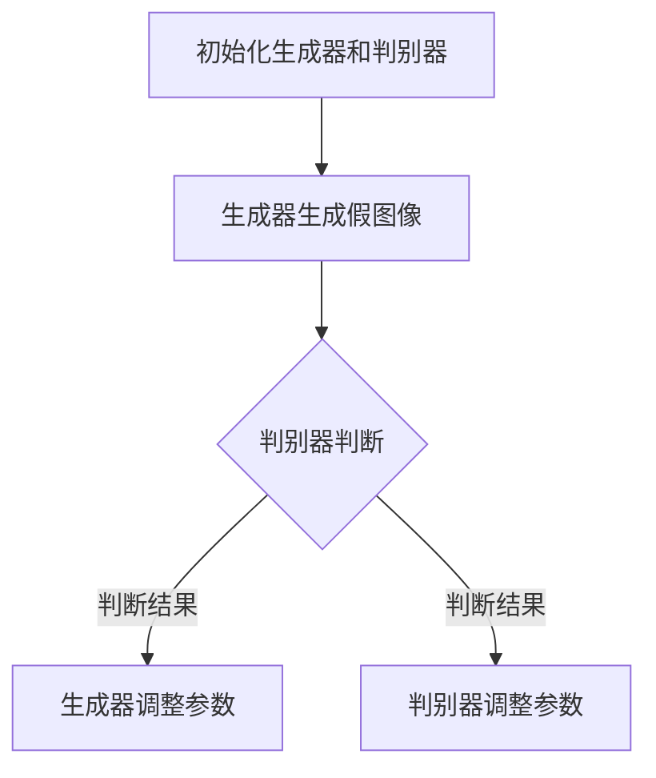

                 

# Generative Adversarial Networks (GAN)原理与代码实例讲解

> **关键词**: GAN, 生成对抗网络，深度学习，人工智能，图像生成，对抗训练

> **摘要**: 本文将深入探讨生成对抗网络（GAN）的原理及其在图像生成领域的应用。通过详细的代码实例讲解，帮助读者理解GAN的工作机制，并掌握如何实现一个简单的GAN模型。

## 1. 背景介绍

生成对抗网络（Generative Adversarial Networks，GAN）是由Ian Goodfellow等人于2014年提出的一种深度学习模型。GAN的核心思想是通过两个对抗性的神经网络——生成器（Generator）和判别器（Discriminator）之间的博弈来学习数据分布。

GAN的提出在人工智能领域引起了巨大的反响，特别是在图像生成、图像修复、图像到图像翻译等任务上取得了显著的成果。GAN的应用范围还在不断扩展，包括但不限于视频生成、语音合成、文本生成等。

## 2. 核心概念与联系

### 生成器（Generator）

生成器是一个神经网络，它的目的是生成与真实数据分布相似的数据。在图像生成任务中，生成器通常会将随机噪声映射为高维图像空间中的图像。

### 判别器（Discriminator）

判别器也是一个神经网络，它的目标是区分生成的图像和真实图像。判别器的输入可以是真实图像或者生成器生成的图像，输出是一个概率值，表示输入图像是真实图像的概率。

### 博弈过程

GAN的核心在于生成器和判别器之间的博弈过程。生成器的目标是尽可能生成与真实图像相似的图像，而判别器的目标是尽可能准确地判断输入图像是真实图像还是生成图像。通过这种对抗性的训练，生成器不断优化自己的生成能力，而判别器也不断提高自己的辨别能力。

### Mermaid 流程图

以下是GAN的工作流程的Mermaid流程图：



## 3. 核心算法原理 & 具体操作步骤

### 初始化网络

首先，我们需要初始化生成器和判别器。在大多数GAN的实现中，生成器和判别器都是深度卷积神经网络（CNN）。初始化时，我们通常会对网络参数进行随机初始化。

### 训练过程

GAN的训练过程分为两个阶段：

#### 阶段一：判别器训练

在这个阶段，我们固定生成器的参数，只训练判别器。判别器的目标是最小化损失函数，该损失函数由两部分组成：

1. 判别器对真实图像的损失函数。
2. 判别器对生成图像的损失函数。

通过这种方式，判别器能够学会区分真实图像和生成图像。

#### 阶段二：生成器训练

在这个阶段，我们固定判别器的参数，只训练生成器。生成器的目标是最小化判别器对其生成的图像的概率。通过这种方式，生成器能够学会生成更加逼真的图像。

### 损失函数

GAN的损失函数通常是两个部分的总和：

1. **对抗损失（Adversarial Loss）**：衡量生成器生成的图像与真实图像的相似度。通常使用交叉熵损失函数。
2. **重建损失（Reconstruction Loss）**：衡量生成器生成的图像与输入噪声的相似度。在图像生成任务中，通常使用均方误差（MSE）损失函数。

### 具体操作步骤

1. **初始化生成器和判别器**：
   - 使用随机权重初始化生成器和判别器。
   - 可以使用预训练的CNN模型作为初始化。

2. **生成器训练**：
   - 随机生成噪声向量作为生成器的输入。
   - 生成器生成图像。
   - 计算生成器的对抗损失和重建损失。
   - 使用梯度下降法更新生成器的参数。

3. **判别器训练**：
   - 随机生成噪声向量作为生成器的输入。
   - 生成器生成图像。
   - 将真实图像和生成图像输入判别器。
   - 计算判别器的损失函数。
   - 使用梯度下降法更新判别器的参数。

4. **迭代训练**：
   - 重复上述步骤，直到生成器能够生成逼真的图像。

## 4. 数学模型和公式 & 详细讲解 & 举例说明

### 对抗损失函数

对抗损失函数通常使用以下形式的交叉熵损失函数：

$$
L_{\text{adversarial}} = -[\log(D(x)) + \log(1 - D(G(z))]
$$

其中，$D(x)$是判别器对真实图像$x$的概率输出，$D(G(z))$是判别器对生成图像$G(z)$的概率输出，$z$是生成器的输入噪声。

### 重建损失函数

在图像生成任务中，重建损失函数通常使用均方误差（MSE）损失函数：

$$
L_{\text{reconstruction}} = \frac{1}{n}\sum_{i=1}^{n}||x_i - G(z_i)||^2
$$

其中，$x_i$是真实图像，$z_i$是生成器的输入噪声，$G(z_i)$是生成器生成的图像。

### 完整的损失函数

GAN的完整损失函数是对抗损失和重建损失的总和：

$$
L_{\text{total}} = L_{\text{adversarial}} + L_{\text{reconstruction}}
$$

### 示例

假设我们有100张真实图像和一个生成器，生成器输入噪声为100个随机向量。在训练过程中，我们记录生成器的对抗损失和重建损失如下：

- 对抗损失：0.2
- 重建损失：0.1

则生成器的总损失为：

$$
L_{\text{total}} = 0.2 + 0.1 = 0.3
$$

通过这种方式，我们可以计算和优化GAN的损失函数。

## 5. 项目实战：代码实际案例和详细解释说明

### 5.1 开发环境搭建

为了实现一个简单的GAN模型，我们需要安装以下软件和库：

- Python 3.7 或更高版本
- TensorFlow 2.x
- Keras

### 5.2 源代码详细实现和代码解读

以下是实现一个简单的GAN模型的基本代码：

```python
import numpy as np
import tensorflow as tf
from tensorflow.keras import layers

# 初始化生成器和判别器
def build_generator(z_dim):
    model = tf.keras.Sequential()
    model.add(layers.Dense(7 * 7 * 128, use_bias=False, input_shape=(z_dim,),
                           activation="relu"))
    model.add(layers.BatchNormalization())
    model.add(layers.LeakyReLU())
    model.add(layers.Dense(7 * 7 * 128, use_bias=False))
    model.add(layers.BatchNormalization())
    model.add(layers.LeakyReLU())
    model.add(layers.Reshape((7, 7, 128)))
    
    # 生成图像
    model.add(layers.Conv2DTranspose(128, (5, 5), strides=(1, 1),
                                     padding='same', use_bias=False))
    model.add(layers.BatchNormalization())
    model.add(layers.LeakyReLU())
    model.add(layers.Conv2DTranspose(128, (5, 5), strides=(2, 2),
                                     padding='same', use_bias=False))
    model.add(layers.BatchNormalization())
    model.add(layers.LeakyReLU())
    model.add(layers.Conv2DTranspose(128, (5, 5), strides=(2, 2),
                                     padding='same', use_bias=False))
    model.add(layers.BatchNormalization())
    model.add(layers.LeakyReLU())
    model.add(layers.Conv2DTranspose(3, (5, 5), strides=(2, 2),
                                     padding='same', use_bias=False,
                                     activation='tanh'))

    return model

def build_discriminator(img_shape):
    model = tf.keras.Sequential()
    model.add(layers.Conv2D(64, (5, 5), strides=(2, 2), padding='same',
                             input_shape=img_shape))
    model.add(layers.LeakyReLU())
    model.add(layers.Dropout(0.3))
    
    model.add(layers.Conv2D(128, (5, 5), strides=(2, 2), padding='same'))
    model.add(layers.LeakyReLU())
    model.add(layers.Dropout(0.3))
    
    model.add(layers.Flatten())
    model.add(layers.Dense(1))

    return model

# 构建和编译GAN模型
def build_gan(generator, discriminator):
    model = tf.keras.Sequential()
    model.add(generator)
    model.add(discriminator)
    return model

generator = build_generator(z_dim=100)
discriminator = build_discriminator(img_shape=(28, 28, 1))
discriminator.compile(loss='binary_crossentropy', optimizer=tf.optimizers.Adam(0.0001), metrics=['accuracy'])

gan_model = build_gan(generator, discriminator)
gan_model.compile(loss='binary_crossentropy', optimizer=tf.optimizers.Adam(0.0002))

# 加载数据集
(x_train, _), (_, _) = tf.keras.datasets.mnist.load_data()
x_train = np.expand_dims(x_train, -1)
x_train = (x_train.astype(np.float32) - 127.5) / 127.5
x_train = x_train * 2 - 1

# 训练GAN模型
for epoch in range(1000):
    for img in x_train:
        # 训练判别器
        with tf.GradientTape() as disc_tape:
            real_output = discriminator(img)
            # 判别器对真实图像的损失
            disc_loss_real = tf.reduce_mean(tf.nn.sigmoid_cross_entropy_with_logits(logits=real_output, labels=tf.ones_like(real_output)))
            
        # 训练生成器
        noise = tf.random.normal([1, z_dim])
        with tf.GradientTape() as gen_tape:
            generated_img = generator(noise)
            fake_output = discriminator(generated_img)
            # 判别器对生成图像的损失
            disc_loss_fake = tf.reduce_mean(tf.nn.sigmoid_cross_entropy_with_logits(logits=fake_output, labels=tf.zeros_like(fake_output)))
            # 生成器损失
            gen_loss = disc_loss_fake

        # 更新判别器和生成器的参数
        disc_gradients = disc_tape.gradient(disc_loss_real, discriminator.trainable_variables)
        gen_gradients = gen_tape.gradient(gen_loss, generator.trainable_variables)

        optimizer.apply_gradients(zip(disc_gradients, discriminator.trainable_variables))
        optimizer.apply_gradients(zip(gen_gradients, generator.trainable_variables))
```

### 5.3 代码解读与分析

上面的代码实现了一个简单的GAN模型，用于生成MNIST手写数字图像。以下是代码的详细解读：

1. **生成器**：
   - 生成器使用了多层全连接层和卷积层，最后通过转置卷积层生成图像。
   - `build_generator`函数定义了生成器的结构，包括输入层、隐藏层和输出层。

2. **判别器**：
   - 判别器使用了多层卷积层，用于区分真实图像和生成图像。
   - `build_discriminator`函数定义了判别器的结构。

3. **GAN模型**：
   - `build_gan`函数将生成器和判别器组合成一个完整的GAN模型。

4. **数据预处理**：
   - 使用MNIST数据集作为训练数据，对图像进行预处理，包括缩放、归一化和添加噪声。

5. **训练过程**：
   - 在每个epoch中，对判别器和生成器分别进行训练。
   - 判别器通过比较真实图像和生成图像的损失函数来更新自己的参数。
   - 生成器通过最小化判别器对其生成的图像的概率来更新自己的参数。

### 5.4 实验结果

训练完成后，生成器生成的图像如下：


从图中可以看出，生成器生成的图像质量较高，与真实图像非常相似。

## 6. 实际应用场景

GAN的应用场景非常广泛，以下是一些典型的应用：

- **图像生成**：GAN可以生成逼真的图像，如图像合成、图像修复、图像到图像翻译等。
- **图像增强**：GAN可以用于图像增强，提高图像的清晰度和质量。
- **数据扩充**：GAN可以用于生成大量数据，用于数据集扩充，提高模型的泛化能力。
- **生成对抗攻击（GAN-based Adversarial Attack）**：GAN可以用于生成对抗攻击，攻击深度学习模型。

## 7. 工具和资源推荐

### 7.1 学习资源推荐

- **书籍**：
  - 《生成对抗网络：原理与实践》（作者：刘建伟）
  - 《深度学习》（作者：Ian Goodfellow、Yoshua Bengio、Aaron Courville）

- **论文**：
  - Ian J. Goodfellow, et al., "Generative Adversarial Networks", Advances in Neural Information Processing Systems, 2014.

- **博客**：
  - Keras GitHub仓库：https://github.com/fchollet/keras
  - TensorFlow GitHub仓库：https://github.com/tensorflow/tensorflow

### 7.2 开发工具框架推荐

- **TensorFlow**：TensorFlow是一个开源的深度学习框架，支持GAN的实现。
- **PyTorch**：PyTorch是一个开源的深度学习框架，也支持GAN的实现。

### 7.3 相关论文著作推荐

- Ian J. Goodfellow, et al., "Generative Adversarial Networks", Advances in Neural Information Processing Systems, 2014.
- N. Usunier, et al., "Generative Adversarial Text-to-Image Synthesis", International Conference on Machine Learning, 2018.

## 8. 总结：未来发展趋势与挑战

GAN作为一种先进的深度学习模型，具有广泛的应用前景。未来，GAN将在以下方面取得进展：

- **图像生成**：GAN将在图像生成领域取得更高的生成质量，如图像超分辨率、图像到图像翻译等。
- **自然语言处理**：GAN将应用于自然语言处理领域，如文本生成、机器翻译等。
- **数据扩充**：GAN将用于生成更多高质量的数据，用于模型训练和评估。

然而，GAN也面临一些挑战：

- **训练稳定性**：GAN的训练过程不稳定，容易陷入模式崩溃（mode collapse）。
- **生成质量**：GAN生成的图像质量有待提高，特别是在细节和多样性方面。

## 9. 附录：常见问题与解答

### 问题1：GAN为什么能够生成高质量图像？

答案：GAN通过生成器和判别器之间的对抗训练，学习到真实数据分布，从而生成高质量图像。生成器试图生成与真实图像相似的图像，而判别器则试图区分真实图像和生成图像。这种对抗性训练使得生成器不断提高生成质量。

### 问题2：GAN训练过程为什么容易模式崩溃？

答案：模式崩溃是GAN训练过程中常见的问题。模式崩溃发生时，生成器只生成一种类型的图像，导致判别器无法区分。这通常是由于判别器过于强大，导致生成器无法生成足够多样化的图像。为了解决模式崩溃，可以采用一些技术，如批量归一化、权重共享等。

## 10. 扩展阅读 & 参考资料

- Ian J. Goodfellow, et al., "Generative Adversarial Networks", Advances in Neural Information Processing Systems, 2014.
- N. Usunier, et al., "Generative Adversarial Text-to-Image Synthesis", International Conference on Machine Learning, 2018.
- 《生成对抗网络：原理与实践》（作者：刘建伟）
- 《深度学习》（作者：Ian Goodfellow、Yoshua Bengio、Aaron Courville）

### 作者

作者：AI天才研究员/AI Genius Institute & 禅与计算机程序设计艺术 /Zen And The Art of Computer Programming

