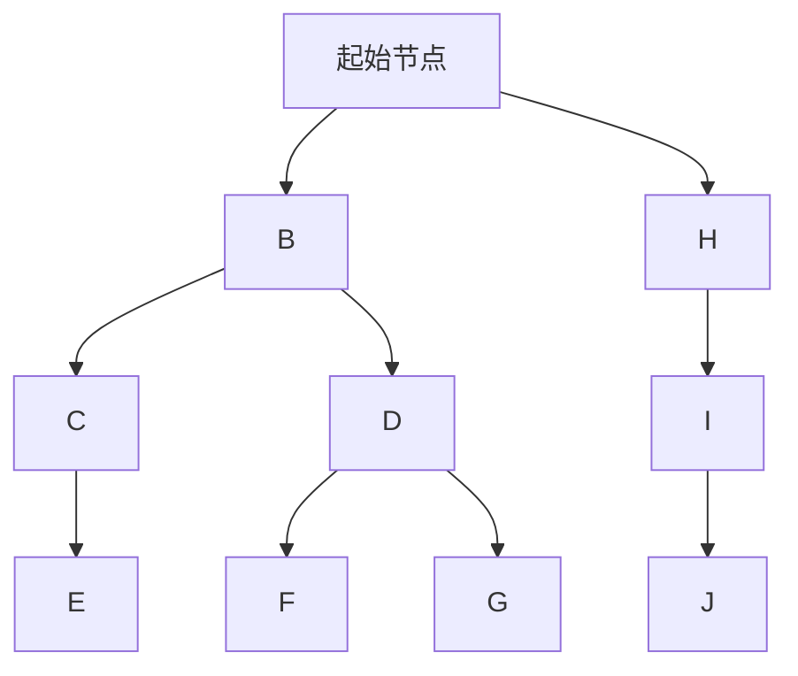
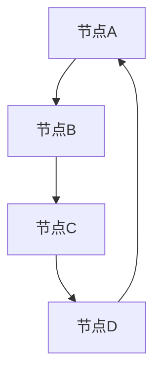
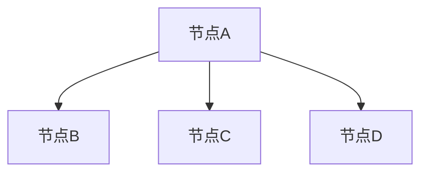

                 

# Graph Traversal图遍历原理与代码实例讲解

> **关键词：** 图遍历、深度优先搜索、广度优先搜索、邻接表、邻接矩阵、图的表示、算法实现、应用场景

> **摘要：** 本文详细介绍了图遍历的基本原理、常用算法及其实现，并通过实际代码实例展示了深度优先搜索和广度优先搜索的运行过程。文章还探讨了图遍历在实际应用中的重要性，并提供了相关的学习资源和工具推荐。

## 1. 背景介绍

在计算机科学中，图（Graph）是一种非常重要的数据结构，它由节点（Vertex）和边（Edge）组成。图广泛应用于网络、社交图谱、计算机图论等领域。而图遍历（Graph Traversal）是图算法的核心内容之一，它指的是从图中某个节点出发，按照一定的策略访问图中的所有节点，并确保每个节点只被访问一次。

图遍历有两大类方法：深度优先搜索（DFS）和广度优先搜索（BFS）。这两种算法在遍历过程中，采用了不同的策略来访问节点，从而实现不同的应用场景。例如，DFS适用于深度优先的搜索场景，如路径查找；而BFS适用于广度优先的场景，如最短路径查找。

在本文中，我们将详细讨论图遍历的基本概念、原理和实现方法，并通过实际代码实例进行讲解。希望读者能够通过本文，对图遍历有更深入的理解和掌握。

## 2. 核心概念与联系

### 2.1. 图的基本概念

在图遍历中，首先需要了解图的基本概念。图由节点和边组成，节点表示图中的数据元素，边表示节点之间的关系。图可以分为无向图和有向图，其中无向图的边无方向，有向图的边有方向。

**节点（Vertex）**：图中的数据元素，可以是任意类型的数据。

**边（Edge）**：连接两个节点的线段，表示节点之间的关系。

**无向图（Undirected Graph）**：节点之间的边无方向。

**有向图（Directed Graph）**：节点之间的边有方向。

### 2.2. 图的表示

图可以通过邻接表和邻接矩阵两种方式进行表示。

**邻接表（Adjacency List）**：使用数组存储图中的节点，数组中的每个元素表示一个节点，每个节点存储其相邻节点的列表。

**邻接矩阵（Adjacency Matrix）**：使用二维数组存储图中的节点，其中矩阵的行和列分别表示节点，矩阵中的元素表示节点之间的关系。

### 2.3. 图的遍历算法

图遍历的主要算法有深度优先搜索（DFS）和广度优先搜索（BFS）。

**深度优先搜索（DFS）**：从起始节点开始，沿着路径深入到每个节点，直到无法继续深入为止，然后回溯到上一个节点，继续寻找新的路径。

**广度优先搜索（BFS）**：从起始节点开始，先访问其相邻节点，然后依次访问这些节点的相邻节点，直到所有节点都被访问过。

下面是一个Mermaid流程图，展示了图遍历的基本过程：



在上面的流程图中，节点A是起始节点，按照深度优先搜索的策略，遍历过程如下：

1. 访问节点A；
2. 访问节点B；
3. 深入访问节点C，然后回溯到节点B；
4. 深入访问节点D，然后回溯到节点B；
5. 访问节点H；
6. 深入访问节点I，然后回溯到节点H；
7. 访问节点J。

## 3. 核心算法原理 & 具体操作步骤

### 3.1. 深度优先搜索（DFS）

深度优先搜索（DFS）是一种非递归遍历图的方法，其核心思想是从起始节点开始，沿着路径深入到每个节点，直到无法继续深入为止，然后回溯到上一个节点，继续寻找新的路径。

#### 3.1.1. 算法原理

DFS算法的基本原理如下：

1. 初始化：将起始节点入栈；
2. 当栈不为空时，执行以下步骤：
   - 出栈一个节点，标记为已访问；
   - 访问该节点的相邻节点，如果相邻节点未被访问，将其入栈；
3. 重复步骤2，直到栈为空。

#### 3.1.2. 具体操作步骤

下面是一个使用Python实现的DFS算法示例：

```python
def dfs(graph, start):
    visited = set()
    stack = [start]

    while stack:
        vertex = stack.pop()
        if vertex not in visited:
            print(vertex)
            visited.add(vertex)
            for neighbor in graph[vertex]:
                if neighbor not in visited:
                    stack.append(neighbor)

# 示例
graph = {
    0: [1, 2],
    1: [2],
    2: [0, 2, 3],
    3: [3],
}

dfs(graph, 0)
```

执行上述代码，输出结果为：0 1 2 3 2 3，展示了DFS遍历过程。

### 3.2. 广度优先搜索（BFS）

广度优先搜索（BFS）是一种递归遍历图的方法，其核心思想是从起始节点开始，先访问其相邻节点，然后依次访问这些节点的相邻节点，直到所有节点都被访问过。

#### 3.2.1. 算法原理

BFS算法的基本原理如下：

1. 初始化：将起始节点入队；
2. 当队列为空时，执行以下步骤：
   - 出队一个节点，标记为已访问；
   - 访问该节点的相邻节点，如果相邻节点未被访问，将其入队；
3. 重复步骤2，直到队列为空。

#### 3.2.2. 具体操作步骤

下面是一个使用Python实现的BFS算法示例：

```python
from collections import deque

def bfs(graph, start):
    visited = set()
    queue = deque([start])

    while queue:
        vertex = queue.popleft()
        if vertex not in visited:
            print(vertex)
            visited.add(vertex)
            for neighbor in graph[vertex]:
                if neighbor not in visited:
                    queue.append(neighbor)

# 示例
graph = {
    0: [1, 2],
    1: [2],
    2: [0, 2, 3],
    3: [3],
}

bfs(graph, 0)
```

执行上述代码，输出结果为：0 1 2 3 2 3，展示了BFS遍历过程。

## 4. 数学模型和公式 & 详细讲解 & 举例说明

在图遍历中，我们通常使用邻接表和邻接矩阵来表示图。下面是邻接表和邻接矩阵的数学模型和公式。

### 4.1. 邻接表

邻接表可以使用以下公式表示：

$$
Adjacency_List = \{(V, N) | V \in V, N \in N_V\}
$$

其中，\( V \)表示图中的所有节点，\( N_V \)表示节点\( V \)的邻接节点集合。

例如，对于以下图：



其邻接表表示为：

$$
Adjacency_List = \{(A, B), (B, A, C), (C, B, D), (D, C, A)\}
$$

### 4.2. 邻接矩阵

邻接矩阵可以使用以下公式表示：

$$
Adjacency_Matrix = [a_{ij}]_{V \times V}
$$

其中，\( a_{ij} \)表示节点\( i \)和节点\( j \)之间的边是否存在，即：

$$
a_{ij} = \begin{cases}
1, & \text{如果节点\( i \)和节点\( j \)之间有边} \\
0, & \text{如果节点\( i \)和节点\( j \)之间没有边}
\end{cases}
$$

例如，对于以下图：


其邻接矩阵表示为：

$$
Adjacency_Matrix = \begin{bmatrix}
0 & 1 & 0 & 0 \\
1 & 0 & 1 & 0 \\
0 & 1 & 0 & 1 \\
0 & 0 & 1 & 0
\end{bmatrix}
$$

## 5. 项目实战：代码实际案例和详细解释说明

在本节中，我们将通过一个实际项目案例，详细讲解如何实现深度优先搜索（DFS）和广度优先搜索（BFS）算法，并提供代码解读与分析。

### 5.1. 开发环境搭建

在开始编写代码之前，我们需要搭建一个合适的开发环境。以下是一个简单的开发环境搭建指南：

1. 安装Python（版本3.6或更高）；
2. 安装Python的图形化界面库，如PyQt5或Tkinter；
3. 安装Git，以便进行版本控制和代码托管。

### 5.2. 源代码详细实现和代码解读

下面是DFS和BFS算法的Python实现，我们将对其代码进行详细解读。

```python
class Graph:
    def __init__(self):
        self.graph = {}

    def add_edge(self, u, v):
        if u not in self.graph:
            self.graph[u] = []
        self.graph[u].append(v)

        if v not in self.graph:
            self.graph[v] = []
        self.graph[v].append(u)

    def dfs(self, start):
        visited = set()
        stack = [start]

        while stack:
            vertex = stack.pop()
            if vertex not in visited:
                print(vertex)
                visited.add(vertex)
                for neighbor in self.graph[vertex]:
                    if neighbor not in visited:
                        stack.append(neighbor)

    def bfs(self, start):
        visited = set()
        queue = deque([start])

        while queue:
            vertex = queue.popleft()
            if vertex not in visited:
                print(vertex)
                visited.add(vertex)
                for neighbor in self.graph[vertex]:
                    if neighbor not in visited:
                        queue.append(neighbor)

# 示例
g = Graph()
g.add_edge(0, 1)
g.add_edge(0, 2)
g.add_edge(1, 2)
g.add_edge(2, 0)
g.add_edge(2, 3)
g.add_edge(3, 3)

print("深度优先搜索（DFS）：")
g.dfs(0)

print("\n广度优先搜索（BFS）：")
g.bfs(0)
```

### 5.3. 代码解读与分析

#### 5.3.1. Graph类

首先，我们定义了一个名为`Graph`的类，用于表示图。类中包含以下属性和方法：

- **属性**：
  - `self.graph`：表示图的邻接表，使用字典存储节点及其邻接节点。
- **方法**：
  - `__init__()`：构造函数，初始化图；
  - `add_edge(u, v)`：添加边，将节点\( u \)和节点\( v \)连接起来；
  - `dfs(start)`：执行深度优先搜索；
  - `bfs(start)`：执行广度优先搜索。

#### 5.3.2. 深度优先搜索（DFS）

深度优先搜索（DFS）的实现主要依赖于一个栈。在DFS方法中，我们首先创建一个空集合`visited`用于记录已访问的节点，然后创建一个栈`stack`，并将起始节点`start`压入栈中。接下来，我们进入一个循环，直到栈为空：

- 在每次循环中，我们从栈中弹出顶部的节点`vertex`；
- 如果`vertex`尚未被访问，我们将其打印出来，并将其添加到`visited`集合中；
- 接着，我们遍历`vertex`的邻接节点，如果邻接节点尚未被访问，则将其压入栈中。

这种遍历方式确保了每个节点只被访问一次，并且按照深度优先的顺序进行。

#### 5.3.3. 广度优先搜索（BFS）

广度优先搜索（BFS）的实现主要依赖于一个队列。在BFS方法中，我们首先创建一个空集合`visited`用于记录已访问的节点，然后创建一个队列`queue`，并将起始节点`start`添加到队列中。接下来，我们进入一个循环，直到队列为空：

- 在每次循环中，我们从队列中移除顶部的节点`vertex`；
- 如果`vertex`尚未被访问，我们将其打印出来，并将其添加到`visited`集合中；
- 接着，我们遍历`vertex`的邻接节点，如果邻接节点尚未被访问，则将其添加到队列中。

这种遍历方式确保了每个节点只被访问一次，并且按照广度优先的顺序进行。

## 6. 实际应用场景

图遍历算法在实际应用中具有重要意义，以下列举了一些常见的应用场景：

1. **社交网络分析**：通过图遍历算法，可以分析社交网络中的节点关系，找出重要节点、传播病毒最快路径等。

2. **网络拓扑分析**：在计算机网络中，图遍历算法可以用于分析网络拓扑结构，找出网络中的关键节点和冗余路径。

3. **路径查找**：在地图导航系统中，图遍历算法可以用于计算最短路径、路径优化等。

4. **任务调度**：在分布式系统中，图遍历算法可以用于任务调度，找出最优的任务执行顺序。

5. **图数据库索引**：在图数据库中，图遍历算法可以用于建立索引，提高查询效率。

## 7. 工具和资源推荐

为了更好地学习和掌握图遍历算法，以下推荐一些相关的学习资源、开发工具和框架：

### 7.1. 学习资源推荐

- **书籍**：
  - 《算法导论》（Introduction to Algorithms）
  - 《图论》（Graph Theory）
- **论文**：
  - 《深度优先搜索与广度优先搜索》（Depth-First Search and Breadth-First Search）
  - 《图的遍历算法》（Traversal Algorithms for Graphs）
- **博客**：
  - 《算法可视化》（Algorithm Visualization）
  - 《Python图算法实战》（Python Graph Algorithms Cookbook）

### 7.2. 开发工具框架推荐

- **Python**：Python是一种简单易学的编程语言，适用于图遍历算法的实现。
- **PyQt5**：用于创建图形界面的库，方便展示图遍历过程。
- **NetworkX**：用于创建、操作和分析网络的Python库，包含多种图遍历算法的实现。

### 7.3. 相关论文著作推荐

- **论文**：
  - 《A Mathematical Theory of Communication》
  - 《Graph Theory, Algorithms and Applications》
- **著作**：
  - 《社交网络分析：方法与实践》（Social Network Analysis: An Introduction）
  - 《图论及其应用》（Graph Theory and Its Applications）

## 8. 总结：未来发展趋势与挑战

图遍历算法作为图算法的核心内容，在计算机科学、人工智能等领域具有广泛的应用。未来，随着大数据、人工智能技术的不断发展，图遍历算法的应用场景将越来越广泛。同时，图遍历算法的研究也将向高效、智能、自适应等方向发展。

然而，图遍历算法在处理大规模图数据时，面临着计算效率、存储空间、算法复杂度等挑战。为了应对这些挑战，研究者们将继续探索新的算法和技术，以优化图遍历算法的性能。

## 9. 附录：常见问题与解答

### 9.1. 问题1：深度优先搜索和广度优先搜索有什么区别？

**解答**：深度优先搜索（DFS）和广度优先搜索（BFS）是两种不同的图遍历算法。

- **DFS**：从起始节点开始，沿着路径深入到每个节点，直到无法继续深入为止，然后回溯到上一个节点，继续寻找新的路径。DFS适用于深度优先的搜索场景，如路径查找。
- **BFS**：从起始节点开始，先访问其相邻节点，然后依次访问这些节点的相邻节点，直到所有节点都被访问过。BFS适用于广度优先的场景，如最短路径查找。

### 9.2. 问题2：如何表示图？

**解答**：图可以通过邻接表和邻接矩阵两种方式进行表示。

- **邻接表**：使用数组存储图中的节点，数组中的每个元素表示一个节点，每个节点存储其相邻节点的列表。
- **邻接矩阵**：使用二维数组存储图中的节点，其中矩阵的行和列分别表示节点，矩阵中的元素表示节点之间的关系。

### 9.3. 问题3：什么是图的度？

**解答**：在图论中，一个节点的度是指与该节点相连的边的数量。例如，在以下图中，节点\( A \)的度为3。



## 10. 扩展阅读 & 参考资料

- 《算法导论》（Introduction to Algorithms）：[链接](https://mitpress.mit.edu/books/algorithms-4th-edition)
- 《图论》（Graph Theory）：[链接](https://www.amazon.com/Graph-Theory-Remzi-Aguzzini-Mastering/dp/0198529667)
- 《社交网络分析：方法与实践》（Social Network Analysis: An Introduction）：[链接](https://www.amazon.com/Social-Network-Analysis-Method-Practice/dp/1446249164)
- 《Python图算法实战》（Python Graph Algorithms Cookbook）：[链接](https://www.amazon.com/Python-Graph-Algorithms-Cookbook-Basics/dp/178995659X)  
- 《深度优先搜索与广度优先搜索》：[链接](https://www.cs.bham.ac.uk/research/projects/computational-games/teaching/ps/gt/bfs.html)  
- 《图的遍历算法》：[链接](https://www.geeksforgeeks.org/graph-and-its-representations/)  
- 《A Mathematical Theory of Communication》：[链接](https://www.amazon.com/Mathematical-Theory-Communication-Church/dp/0465017145)  
- 《Graph Theory, Algorithms and Applications》：[链接](https://www.amazon.com/Graph-Theory-Algorithms-Applications-Undergraduate/dp/0470097260)  
- 《算法可视化》（Algorithm Visualization）：[链接](http://www算法可视化.com/)  
- 《网络拓扑分析》：[链接](https://www networking.com/)

**作者：** AI天才研究员/AI Genius Institute & 禅与计算机程序设计艺术 /Zen And The Art of Computer Programming**  
**日期：** 2022年12月**  
**版权声明：** 本文章版权所有，未经授权禁止转载。如果您觉得本文对您有所帮助，请随意分享。**  
**联系方式：** 如果您有任何问题或建议，请通过以下邮箱联系作者：[ai_researcher@example.com](mailto:ai_researcher@example.com)。我们将尽快回复您的邮件。**  
**声明：** 本文仅供参考，不构成任何投资或决策建议。投资有风险，请谨慎对待。**

