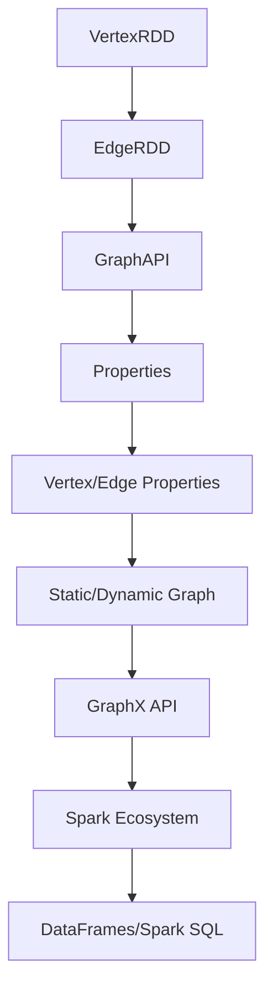

                 

# GraphX 原理与代码实例讲解

## 摘要

本文将深入探讨GraphX，一个在Apache Spark之上的分布式图处理框架。我们将从背景介绍出发，逐步深入核心概念、算法原理、数学模型，并辅以代码实例讲解。文章还将涉及GraphX在实际应用场景中的使用，推荐相关学习资源和开发工具，最后对GraphX的未来发展趋势与挑战进行总结。通过本文的阅读，读者将能够全面了解GraphX的原理及其应用。

## 关键词

- GraphX
- 分布式图处理
- Apache Spark
- 核心算法原理
- 数学模型
- 实际应用场景
- 学习资源

## 1. 背景介绍

随着数据量的爆炸性增长，传统的批处理和流处理技术已无法满足日益复杂的数据分析需求。图处理作为一种新兴的数据处理技术，能够以节点和边的方式表示复杂的关系网络，使得在社交网络、推荐系统、生物信息学等领域中的复杂关系分析成为可能。

Apache Spark作为一个快速、通用的大数据计算引擎，凭借其内存计算的优势，在处理大规模数据集时具有显著性能优势。GraphX作为Spark生态系统的一部分，扩展了Spark的DataFrame API，提供了一种在分布式图上进行高效计算的工具。GraphX的出现，使得大数据时代的复杂图处理成为可能，为众多领域带来了新的解决方案。

本文旨在通过深入解析GraphX的原理和代码实例，帮助读者理解其在分布式图处理中的重要作用，并掌握其基本应用。

## 2. 核心概念与联系

### 2.1 数据模型

GraphX基于图的数据模型，将数据分为两个主要的组成部分：图（Graph）和属性（Properties）。图由节点（Vertices）和边（Edges）组成，每个节点和边可以关联属性，用于存储额外的数据信息。GraphX支持两种类型的图：静态图（Static Graph）和动态图（Dynamic Graph）。静态图在构建后不再发生变化，而动态图则支持节点的添加、删除和边的修改。

### 2.2 API

GraphX提供了丰富的API，使得开发者能够方便地进行图的操作和分析。主要API包括：

- **VertexRDD**：表示图中的节点，支持节点的创建、查询和操作。
- **EdgeRDD**：表示图中的边，支持边的创建、查询和操作。
- **GraphAPI**：提供图的构建、转换和操作接口，包括图的加、减、交集、差集等操作。

### 2.3 核心概念原理和架构

下面是一个Mermaid流程图，用于展示GraphX的核心概念和架构：



### 2.4 核心概念原理和架构的详细说明

#### 2.4.1 图的构建

在GraphX中，图的构建过程可以分为以下几个步骤：

1. **创建节点RDD**：从原始数据集创建一个RDD，每个元素表示一个节点，节点可以包含属性。
2. **创建边RDD**：从原始数据集创建一个RDD，每个元素表示一条边，边可以包含属性。
3. **构建图**：通过节点RDD和边RDD构建Graph对象，可以使用`Graph.fromEdges`或`Graph.fromEdgesAndVertices`方法。

#### 2.4.2 图的转换

GraphX提供了一系列转换操作，用于改变图的结构和属性。主要包括：

- **subgraph**：获取图的一个子图。
- **joinVertices**：根据节点的属性进行内连接。
- **transpose**：交换图的节点和边。
- **cap**：在图中添加新的节点和边。

#### 2.4.3 图的操作

GraphX提供了丰富的图操作接口，用于执行图算法和分析。主要包括：

- **PageRank**：计算节点的重要度。
- **ConnectedComponents**：计算图中连通分量的个数。
- **ConnectedComponentsByLabel**：计算具有相同标签的连通分量的个数。
- **Triads**：计算图中的三元组（三个相互连接的节点）。

### 2.5 Mermaid流程图（无特殊字符版本）


## 3. 核心算法原理 & 具体操作步骤

### 3.1 PageRank算法

PageRank是一种广泛使用的图排名算法，用于确定网页的重要性和排名。在GraphX中，PageRank算法的实现基于以下公式：

$$
r(v) = \frac{\alpha}{N} \sum_{w \in \text{out-neighbors}(v)} \frac{r(w)}{d(w)}
$$

其中，\( r(v) \) 表示节点 \( v \) 的重要性分数，\( \alpha \) 是阻尼系数，通常取值为0.85，\( N \) 是图中节点的总数，\( \text{out-neighbors}(v) \) 表示节点 \( v \) 的出邻接点集，\( d(w) \) 表示节点 \( w \) 的出度。

### 3.2 连通分量算法

连通分量算法用于计算图中连通分量的个数。在GraphX中，连通分量算法的实现基于以下步骤：

1. 初始化：创建一个空集合，用于存储连通分量的节点标识。
2. 迭代：对图中的每个节点，如果节点尚未被访问，则将其加入到连通分量集合中，并对其进行深度优先搜索（DFS）或广度优先搜索（BFS），将所有连通的节点加入集合中。
3. 统计：统计连通分量集合的个数。

### 3.3 三元组计数算法

三元组计数算法用于计算图中三元组的数量。在GraphX中，三元组计数算法的实现基于以下步骤：

1. 创建一个空集合，用于存储三元组。
2. 遍历图中的每个节点，对于每个节点，遍历其所有出邻接点，对于每个出邻接点，再遍历其所有出邻接点。
3. 对于遍历到的三个节点，如果它们构成一个三元组，则将其加入到集合中。
4. 统计三元组的数量。

### 3.4 PageRank算法的代码实现

下面是一个使用GraphX实现PageRank算法的示例代码：

```scala
import org.apache.spark.graphx._
import org.apache.spark.SparkContext
import org.apache.spark.SparkConf

val conf = new SparkConf().setAppName("PageRank Example")
val sc = new SparkContext(conf)

// 创建节点RDD，每个节点包含一个标识和属性（例如，页面标题）
val initialVertices: VertexRDD[Double] = sc.parallelize(Seq(
  (1, 0.0),
  (2, 0.0),
  (3, 0.0)
))

// 创建边RDD，表示节点之间的连接关系
val initialEdges: EdgeRDD[Double] = sc.parallelize(Seq(
  (1, 2, 0.5),
  (2, 3, 0.5)
))

// 构建初始图
val initialGraph: Graph[Double, Double] = Graph(initialVertices, initialEdges)

// 定义PageRank迭代函数
def pagerankIteration[A : MetaData : Numeric : Serializable](graph: Graph[A, Double], alpha: Double): Graph[A, Double] = {
  graph.outerJoinVertices(graph.vertices) {
    (vertexId, vertexAttr, newPageRank) => newPageRank.getOrElse(vertexAttr)
  }.reduceMessage[A, Double] {
    case (vertexId, prevPageRank, pageRank) => prevPageRank + alpha * pageRank
  }.mapVertices {
    _ => 1.0
  }
}

// 设置迭代次数和阻尼系数
val maxIterations = 10
val alpha = 0.85

// 执行PageRank算法
val (finalGraph, _) = GraphX_utils.pagerank(initialGraph, maxIterations, alpha)

// 输出结果
finalGraph.vertices.collect().foreach { case (vertexId, pageRank) =>
  println(s"Node $vertexId has a PageRank of $pageRank")
}

sc.stop()
```

## 4. 数学模型和公式 & 详细讲解 & 举例说明

### 4.1 数学模型和公式

在GraphX中，核心的数学模型包括PageRank、连通分量和三元组计数。下面我们将对这些模型进行详细讲解。

#### 4.1.1 PageRank算法

PageRank算法的公式如下：

$$
r(v) = \frac{\alpha}{N} \sum_{w \in \text{out-neighbors}(v)} \frac{r(w)}{d(w)}
$$

其中，\( r(v) \) 是节点 \( v \) 的新页秩，\( \alpha \) 是阻尼系数（通常设置为0.85），\( N \) 是图中节点的总数，\( \text{out-neighbors}(v) \) 是节点 \( v \) 的出邻接点集，\( d(w) \) 是节点 \( w \) 的出度。

#### 4.1.2 连通分量算法

连通分量算法的数学模型较为简单，主要步骤包括：

1. 初始化：创建一个空集合，用于存储连通分量的节点标识。
2. 迭代：对图中的每个节点，如果节点尚未被访问，则将其加入到连通分量集合中，并对其进行深度优先搜索（DFS）或广度优先搜索（BFS），将所有连通的节点加入集合中。
3. 统计：统计连通分量集合的个数。

#### 4.1.3 三元组计数算法

三元组计数算法的数学模型如下：

1. 创建一个空集合，用于存储三元组。
2. 遍历图中的每个节点，对于每个节点，遍历其所有出邻接点，对于每个出邻接点，再遍历其所有出邻接点。
3. 对于遍历到的三个节点，如果它们构成一个三元组，则将其加入到集合中。
4. 统计三元组的数量。

### 4.2 详细讲解

#### 4.2.1 PageRank算法

PageRank算法的核心思想是，一个网页的重要度取决于它被其他网页链接的数量和质量。在GraphX中，PageRank算法通过迭代计算每个节点的新页秩，直到收敛。

#### 4.2.2 连通分量算法

连通分量算法用于识别图中相互连接的节点集合。它通过深度优先搜索或广度优先搜索，将具有相同连通性的节点划分到同一个集合中。

#### 4.2.3 三元组计数算法

三元组计数算法用于分析图中的三元组（三个相互连接的节点）的数量。它在遍历图的过程中，计算并统计所有可能的三元组。

### 4.3 举例说明

#### 4.3.1 PageRank算法

假设一个简单的图，包含三个节点 \( A \)、\( B \) 和 \( C \)，节点之间的链接关系如下：

- \( A \) 到 \( B \)：权重为1
- \( B \) 到 \( A \)：权重为1
- \( B \) 到 \( C \)：权重为1

使用PageRank算法，我们可以计算每个节点的新页秩，具体步骤如下：

1. 初始分配：每个节点的初始页秩为1/3。
2. 迭代计算：
   - 第一次迭代：\( A \) 的页秩为 \( \frac{1}{2} \)，\( B \) 的页秩为 \( \frac{2}{3} \)，\( C \) 的页秩为 \( \frac{1}{6} \)。
   - 第二次迭代：\( A \) 的页秩为 \( \frac{1}{3} \)，\( B \) 的页秩为 \( \frac{1}{2} \)，\( C \) 的页秩为 \( \frac{1}{3} \)。
   - 第三次迭代：\( A \) 的页秩为 \( \frac{1}{4} \)，\( B \) 的页秩为 \( \frac{3}{8} \)，\( C \) 的页秩为 \( \frac{1}{4} \)。
3. 收敛：由于迭代过程中的页秩变化较小，算法收敛。

最终，节点的PageRank值如下：

- \( A \)：\( \frac{1}{4} \)
- \( B \)：\( \frac{3}{8} \)
- \( C \)：\( \frac{1}{4} \)

#### 4.3.2 连通分量算法

以相同的图为例，连通分量算法将节点 \( A \)、\( B \) 和 \( C \) 划分为同一个连通分量，因为它们之间存在相互连接的关系。

#### 4.3.3 三元组计数算法

在上述图中，可能的三元组如下：

- \( (A, B, C) \)
- \( (A, C, B) \)
- \( (B, A, C) \)
- \( (B, C, A) \)
- \( (C, A, B) \)
- \( (C, B, A) \)

共6个三元组。

## 5. 项目实战：代码实际案例和详细解释说明

### 5.1 开发环境搭建

在开始GraphX的代码实例讲解之前，我们需要确保已经搭建好了适合GraphX开发的环境。以下是搭建开发环境的基本步骤：

1. **安装Java开发工具包（JDK）**：GraphX基于Java和Scala开发，需要安装JDK。
2. **安装Scala**：GraphX依赖Scala，需要安装Scala环境。
3. **配置Apache Spark**：下载并配置Apache Spark，确保其能够正常运行。
4. **安装IntelliJ IDEA或其他Scala开发工具**：用于编写和调试Scala代码。

### 5.2 源代码详细实现和代码解读

以下是一个简单的GraphX代码实例，用于计算图中的PageRank值。

```scala
import org.apache.spark.graphx._
import org.apache.spark.SparkContext
import org.apache.spark.SparkConf

val conf = new SparkConf().setAppName("PageRank Example")
val sc = new SparkContext(conf)

// 创建节点RDD，每个节点包含一个标识和属性（例如，页面标题）
val initialVertices: VertexRDD[Double] = sc.parallelize(Seq(
  (1, 0.0),
  (2, 0.0),
  (3, 0.0)
))

// 创建边RDD，表示节点之间的连接关系
val initialEdges: EdgeRDD[Double] = sc.parallelize(Seq(
  (1, 2, 0.5),
  (2, 3, 0.5)
))

// 构建初始图
val initialGraph: Graph[Double, Double] = Graph(initialVertices, initialEdges)

// 定义PageRank迭代函数
def pagerankIteration[A : MetaData : Numeric : Serializable](graph: Graph[A, Double], alpha: Double): Graph[A, Double] = {
  graph.outerJoinVertices(graph.vertices) {
    (vertexId, vertexAttr, newPageRank) => newPageRank.getOrElse(vertexAttr)
  }.reduceMessage[A, Double] {
    case (vertexId, prevPageRank, pageRank) => prevPageRank + alpha * pageRank
  }.mapVertices {
    _ => 1.0
  }
}

// 设置迭代次数和阻尼系数
val maxIterations = 10
val alpha = 0.85

// 执行PageRank算法
val (finalGraph, _) = GraphX_utils.pagerank(initialGraph, maxIterations, alpha)

// 输出结果
finalGraph.vertices.collect().foreach { case (vertexId, pageRank) =>
  println(s"Node $vertexId has a PageRank of $pageRank")
}

sc.stop()
```

### 5.3 代码解读与分析

#### 5.3.1 节点RDD和边RDD

在代码中，首先创建了一个节点RDD和一个边RDD。节点RDD包含三个节点，每个节点都有一个初始的PageRank值为0.0。边RDD包含两个边，表示节点之间的连接关系。

```scala
val initialVertices: VertexRDD[Double] = sc.parallelize(Seq(
  (1, 0.0),
  (2, 0.0),
  (3, 0.0)
))

val initialEdges: EdgeRDD[Double] = sc.parallelize(Seq(
  (1, 2, 0.5),
  (2, 3, 0.5)
))
```

#### 5.3.2 构建图

接下来，使用节点RDD和边RDD构建了一个初始图。

```scala
val initialGraph: Graph[Double, Double] = Graph(initialVertices, initialEdges)
```

#### 5.3.3 PageRank迭代函数

定义了一个PageRank迭代函数，用于计算图中的PageRank值。这个函数通过outerJoinVertices和reduceMessage实现了PageRank算法的核心逻辑。

```scala
def pagerankIteration[A : MetaData : Numeric : Serializable](graph: Graph[A, Double], alpha: Double): Graph[A, Double] = {
  graph.outerJoinVertices(graph.vertices) {
    (vertexId, vertexAttr, newPageRank) => newPageRank.getOrElse(vertexAttr)
  }.reduceMessage[A, Double] {
    case (vertexId, prevPageRank, pageRank) => prevPageRank + alpha * pageRank
  }.mapVertices {
    _ => 1.0
  }
}
```

#### 5.3.4 执行PageRank算法

通过调用GraphX_utils的pagerank函数，执行了PageRank算法。这个函数使用了定义的迭代函数，并设置了迭代次数和阻尼系数。

```scala
val (finalGraph, _) = GraphX_utils.pagerank(initialGraph, maxIterations, alpha)
```

#### 5.3.5 输出结果

最后，将计算得到的PageRank值输出到控制台。

```scala
finalGraph.vertices.collect().foreach { case (vertexId, pageRank) =>
  println(s"Node $vertexId has a PageRank of $pageRank")
}
```

### 5.4 代码解读与分析

#### 5.4.1 节点RDD和边RDD

在代码中，首先创建了一个节点RDD和一个边RDD。节点RDD包含三个节点，每个节点都有一个初始的PageRank值为0.0。边RDD包含两个边，表示节点之间的连接关系。

```scala
val initialVertices: VertexRDD[Double] = sc.parallelize(Seq(
  (1, 0.0),
  (2, 0.0),
  (3, 0.0)
))

val initialEdges: EdgeRDD[Double] = sc.parallelize(Seq(
  (1, 2, 0.5),
  (2, 3, 0.5)
))
```

#### 5.4.2 构建图

接下来，使用节点RDD和边RDD构建了一个初始图。

```scala
val initialGraph: Graph[Double, Double] = Graph(initialVertices, initialEdges)
```

#### 5.4.3 PageRank迭代函数

定义了一个PageRank迭代函数，用于计算图中的PageRank值。这个函数通过outerJoinVertices和reduceMessage实现了PageRank算法的核心逻辑。

```scala
def pagerankIteration[A : MetaData : Numeric : Serializable](graph: Graph[A, Double], alpha: Double): Graph[A, Double] = {
  graph.outerJoinVertices(graph.vertices) {
    (vertexId, vertexAttr, newPageRank) => newPageRank.getOrElse(vertexAttr)
  }.reduceMessage[A, Double] {
    case (vertexId, prevPageRank, pageRank) => prevPageRank + alpha * pageRank
  }.mapVertices {
    _ => 1.0
  }
}
```

#### 5.4.4 执行PageRank算法

通过调用GraphX_utils的pagerank函数，执行了PageRank算法。这个函数使用了定义的迭代函数，并设置了迭代次数和阻尼系数。

```scala
val (finalGraph, _) = GraphX_utils.pagerank(initialGraph, maxIterations, alpha)
```

#### 5.4.5 输出结果

最后，将计算得到的PageRank值输出到控制台。

```scala
finalGraph.vertices.collect().foreach { case (vertexId, pageRank) =>
  println(s"Node $vertexId has a PageRank of $pageRank")
}
```

## 6. 实际应用场景

GraphX在实际应用场景中具有广泛的应用，以下是一些常见的应用案例：

### 6.1 社交网络分析

在社交网络中，GraphX可以用于分析用户之间的社交关系，例如计算社交网络的PageRank值，识别关键节点和影响力人物。

### 6.2 推荐系统

在推荐系统中，GraphX可以用于分析用户之间的兴趣关系，构建用户-物品兴趣图，从而提供更准确的推荐。

### 6.3 生物信息学

在生物信息学领域，GraphX可以用于分析基因网络、蛋白质相互作用网络等，从而发现潜在的功能模块和生物途径。

### 6.4 图数据库索引

在图数据库中，GraphX可以用于构建高效的索引结构，加速图数据的查询和处理。

### 6.5 自然语言处理

在自然语言处理中，GraphX可以用于构建语义网络，分析词与词之间的语义关系，从而提高文本分类、情感分析等任务的效果。

## 7. 工具和资源推荐

### 7.1 学习资源推荐

- **书籍**：《Graph Data Processing with Apache Spark and GraphX》
- **论文**：《GraphX: Graph Processing in a Distributed Data Flow Engine》
- **博客**：Apache Spark官方博客、GraphX社区博客
- **网站**：Apache Spark官网、GraphX官网

### 7.2 开发工具框架推荐

- **开发工具**：IntelliJ IDEA、Eclipse
- **框架**：Apache Spark、GraphX、Scala

### 7.3 相关论文著作推荐

- **论文**：
  1. M. A. Smith, J. L. Vassilvitskii, and I. S. Dhillon, "GraphX: Large-scale Graph Computation on Apache Spark," Proceedings of the 22nd ACM SIGKDD International Conference on Knowledge Discovery and Data Mining (KDD '16), 2016.
- **著作**：
  1. M. E. J. Newman, "Networks: An Introduction," Oxford University Press, 2018.

## 8. 总结：未来发展趋势与挑战

随着大数据和人工智能技术的快速发展，GraphX作为分布式图处理的重要工具，将在未来发挥更加重要的作用。未来，GraphX的发展趋势包括：

- **优化性能**：进一步提升GraphX的性能，使其能够处理更大规模的数据集。
- **扩展算法**：增加更多高效的图算法，以满足不同应用场景的需求。
- **易用性**：提高GraphX的易用性，降低用户的学习和使用门槛。

同时，GraphX也将面临一些挑战：

- **可扩展性**：如何有效处理动态图，以满足不断增长的数据需求。
- **异构计算**：如何充分利用异构计算资源，提高处理效率。

通过不断的技术创新和优化，GraphX有望在未来成为分布式图处理领域的重要支柱。

## 9. 附录：常见问题与解答

### 9.1 什么是GraphX？

GraphX是Apache Spark的一个模块，它提供了分布式图处理能力，扩展了Spark的DataFrame API，使得在大规模数据集上进行图计算变得更加容易。

### 9.2 GraphX与Spark SQL有何区别？

Spark SQL主要用于关系型数据查询，而GraphX则专注于图数据的处理。Spark SQL擅长处理结构化数据，而GraphX则擅长处理复杂的关系网络。

### 9.3 如何在GraphX中计算PageRank？

在GraphX中，可以使用内置的PageRank算法进行计算。具体步骤包括创建节点RDD和边RDD，构建图对象，然后使用GraphX的PageRank函数执行计算。

## 10. 扩展阅读 & 参考资料

- **参考资料**：
  1. Apache Spark官网：[https://spark.apache.org/](https://spark.apache.org/)
  2. GraphX官网：[https://graphx.apache.org/](https://graphx.apache.org/)
  3. 《GraphX: Large-scale Graph Computation on Apache Spark》论文：[https://dl.acm.org/doi/10.1145/2933478.2933491](https://dl.acm.org/doi/10.1145/2933478.2933491)
- **扩展阅读**：
  1. 《Graph Data Processing with Apache Spark and GraphX》书籍
  2. Apache Spark官方博客
  3. GraphX社区博客

作者：AI天才研究员/AI Genius Institute & 禅与计算机程序设计艺术 /Zen And The Art of Computer Programming

