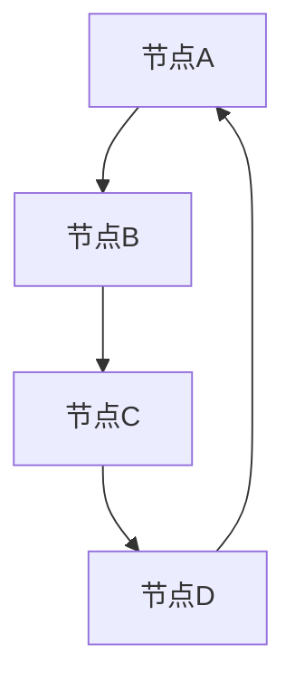

                 

### 背景介绍

GraphX作为Apache Spark的一个高级图处理框架，它的出现为大规模数据处理提供了强有力的工具。随着互联网和大数据技术的飞速发展，图结构数据在现实世界中的重要性日益凸显。无论是社交网络、推荐系统、生物信息学，还是交通网络和物联网，都蕴含着大量的图结构数据。这些数据需要高效的处理和分析，以提取出有价值的信息。

**GraphX 的诞生**：

GraphX 是由Apache Software Foundation 开发的，它是Spark GraphX的扩展。GraphX 在Spark原有的弹性分布式数据集（RDD）的基础上，引入了图（Graph）和图计算（Graph Computation）的概念，使得Spark能够处理图结构数据。Spark作为一个强大的分布式计算引擎，它提供了弹性分布式数据集（RDD）和分布式共享变量（如广播变量），这使得Spark非常适合处理大规模数据集。

**GraphX 的优势**：

1. **弹性：** GraphX 能够处理大规模的图结构数据，并且具有良好的容错性。
2. **高效性：** GraphX 利用Spark的分布式计算能力，可以在集群上进行高效的图计算。
3. **扩展性：** GraphX 提供了丰富的API，使得开发者可以方便地自定义图算法。

**应用领域**：

GraphX在多个领域都有着广泛的应用：

- **社交网络分析**：通过分析社交网络中的节点和边，可以挖掘出社交网络中的关键人物、影响力等。
- **推荐系统**：基于用户和物品的交互关系，可以构建图模型，从而实现更精准的推荐。
- **生物信息学**：利用GraphX分析基因网络、蛋白质相互作用等，可以揭示生物系统的复杂关系。
- **交通网络分析**：通过分析交通网络中的道路和交通流量，可以优化交通路线，减少拥堵。

总之，GraphX作为一个强大的图处理框架，为处理大规模图结构数据提供了有效的方法和工具。

### 核心概念与联系

在深入探讨GraphX之前，我们需要理解几个核心概念：图（Graph）、节点（Vertex）和边（Edge）。图是网络结构的基础，由节点和边组成。节点代表网络中的个体，而边则代表节点之间的关系。

**图的基本结构**：

- **节点（Vertex）**：图中的个体，可以是有向的或无向的。
- **边（Edge）**：连接节点的线，也可以是有向的或无向的。

**GraphX中的图定义**：

GraphX中的图定义更为复杂，它不仅包括节点和边，还包括了属性（Property）。每个节点和边都可以拥有多个属性，这些属性可以是数字、字符串、列表等任意类型。



**图的属性**：

- **结构属性（Structural Properties）**：如节点的度（Degree）、介数（Closeness Centrality）、中心性（Betweenness Centrality）等。
- **值属性（Value Properties）**：如节点的标签、边的权重等。

**图与图的计算**：

- **图的计算（Graph Computation）**：对图进行的一系列操作，如节点度计算、最短路径计算、社区发现等。
- **迭代计算（Iterative Computation）**：如PageRank算法、Louvain社区发现算法等，这些算法通常需要多次迭代来优化结果。

### 核心算法原理 & 具体操作步骤

GraphX的核心算法主要包括图遍历算法、图分割算法、社区发现算法等。下面将详细介绍这些算法的原理和具体操作步骤。

#### 图遍历算法

**深度优先搜索（DFS）**：

深度优先搜索（DFS）是一种用于遍历或搜索树的算法。在GraphX中，DFS可以应用于图结构数据的遍历。DFS的基本步骤如下：

1. 选择一个起始节点。
2. 访问该节点，并标记为已访问。
3. 遍历该节点的所有未访问的邻接节点，并重复步骤2和3。

**广度优先搜索（BFS）**：

广度优先搜索（BFS）也是一种常用的图遍历算法。与DFS不同，BFS是逐层遍历图中的节点。BFS的基本步骤如下：

1. 选择一个起始节点，并将其入队。
2. 出队一个节点，访问并标记为已访问。
3. 将该节点的所有未访问的邻接节点入队。
4. 重复步骤2和3，直到队列为空。

#### 图分割算法

**社区发现（Community Detection）**：

社区发现是图分割的一种重要方法，旨在找到图中的紧密相连的节点集合。常用的社区发现算法包括Louvain算法和标签传播算法。

- **Louvain算法**：

Louvain算法基于模体块模型（Module Network Model），通过迭代计算节点间的相似性，最终将节点划分为多个社区。具体步骤如下：

1. 初始化每个节点的社区标签。
2. 根据邻接关系计算节点对之间的相似性。
3. 根据相似性阈值更新节点的社区标签。
4. 重复步骤2和3，直到社区划分收敛。

- **标签传播算法**：

标签传播算法是一种基于节点属性的简单社区发现算法。算法的基本思想是：如果一个节点的邻居大多数属于同一个社区，那么该节点也倾向于属于这个社区。具体步骤如下：

1. 初始化每个节点的社区标签。
2. 对于每个节点，如果其邻居节点的社区标签相同，则更新该节点的社区标签。
3. 重复步骤2，直到社区划分收敛。

#### 社区发现算法

**PageRank算法**：

PageRank是一种广泛使用的图排名算法，旨在计算图中的节点的重要性。PageRank的基本步骤如下：

1. 初始化每个节点的排名值，通常为1/|V|，其中|V|为节点总数。
2. 对于每个节点v，根据其入度（即指向该节点的边数）计算其排名贡献。
3. 根据排名贡献更新每个节点的排名值。
4. 重复步骤2和3，直到排名值收敛。

### 数学模型和公式 & 详细讲解 & 举例说明

#### PageRank算法的数学模型

PageRank算法基于一个迭代过程，其核心思想是节点的排名与其入度有关。具体来说，PageRank算法使用以下数学模型：

$$
r(v) = \left( 1 - d \right) + d \cdot \left( \frac{s_1}{out(v_1)} + \frac{s_2}{out(v_2)} + \ldots + \frac{s_n}{out(v_n)} \right)
$$

其中：
- \( r(v) \) 是节点 \( v \) 的排名值。
- \( d \) 是阻尼系数，通常取值为0.85。
- \( s_i \) 是节点 \( v_i \) 的入度。
- \( out(v_i) \) 是节点 \( v_i \) 的出度。

**举例说明**：

假设我们有一个简单的图，包含4个节点 \( A, B, C, D \)，如下图所示：

```
A -- B
|    |
D -- C
```

节点的出度分别为：\( out(A) = 1, out(B) = 2, out(C) = 2, out(D) = 1 \)。阻尼系数 \( d \) 取值为0.85。

根据PageRank的数学模型，我们可以计算每个节点的初始排名值：

$$
r(A) = \frac{1}{4}, r(B) = \frac{1}{4}, r(C) = \frac{1}{4}, r(D) = \frac{1}{4}
$$

在第一次迭代中，每个节点的排名贡献如下：

- \( r(A) \) 的排名贡献为 \( \frac{1}{1} = 1 \)
- \( r(B) \) 的排名贡献为 \( \frac{1}{2} + \frac{1}{2} = 1 \)
- \( r(C) \) 的排名贡献为 \( \frac{1}{2} \)
- \( r(D) \) 的排名贡献为 \( \frac{1}{2} \)

根据这些排名贡献，我们可以更新每个节点的排名值：

$$
r(A) = \left( 1 - 0.85 \right) + 0.85 \cdot 1 = 0.15 + 0.85 = 1.00
$$

$$
r(B) = \left( 1 - 0.85 \right) + 0.85 \cdot 1 = 0.15 + 0.85 = 1.00
$$

$$
r(C) = \left( 1 - 0.85 \right) + 0.85 \cdot \frac{1}{2} = 0.15 + 0.425 = 0.575
$$

$$
r(D) = \left( 1 - 0.85 \right) + 0.85 \cdot \frac{1}{2} = 0.15 + 0.425 = 0.575
$$

在后续的迭代中，我们可以继续使用相同的数学模型来更新每个节点的排名值，直到排名值收敛。

### 项目实战：代码实际案例和详细解释说明

在下面的实战项目中，我们将使用GraphX实现一个社交网络分析，通过计算每个用户的影响力来确定社交网络中的关键人物。我们将在Spark集群上运行以下代码。

#### 1. 开发环境搭建

1. **安装Spark**：确保您的系统上已经安装了Spark。可以参考Spark官方文档（https://spark.apache.org/docs/latest/）进行安装。

2. **安装GraphX**：在Spark的pom.xml文件中添加GraphX的依赖：

   ```xml
   <dependency>
       <groupId>org.apache.spark</groupId>
       <artifactId>spark-graphx_2.11</artifactId>
       <version>2.4.0</version>
   </dependency>
   ```

3. **配置Spark集群**：确保您的Spark集群已经启动，并在项目中配置相应的Spark配置文件（如spark-env.sh、slaves等）。

#### 2. 源代码详细实现和代码解读

```scala
import org.apache.spark.graphx._
import org.apache.spark.rdd.RDD
import org.apache.spark.sql.SparkSession

object SocialNetworkAnalysis {

  def main(args: Array[String]): Unit = {
    // 创建SparkSession
    val spark = SparkSession.builder()
      .appName("SocialNetworkAnalysis")
      .getOrCreate()

    // 读取社交网络数据
    val graph: Graph[Int, String] = Graph.fromEdgeTuples(readEdges, readVertices)

    // 计算每个用户的影响力（PageRank）
    val rankedGraph = graph.pageRank(0.0001)

    // 获取排名前10的用户
    val topUsers = rankedGraph.vertices.sortBy(x => -x._2).take(10)

    // 输出排名前10的用户及其影响力
    topUsers.foreach { case (userId, rank) =>
      println(s"User $userId has a rank of $rank")
    }

    // 关闭SparkSession
    spark.stop()
  }

  // 读取边的RDD
  def readEdges(): RDD[(Int, Int)] = {
    // 实现具体的读取逻辑
  }

  // 读取节点的RDD
  def readVertices(): RDD[(Int, Int)] = {
    // 实现具体的读取逻辑
  }
}
```

#### 3. 代码解读与分析

1. **创建SparkSession**：

   ```scala
   val spark = SparkSession.builder()
     .appName("SocialNetworkAnalysis")
     .getOrCreate()
   ```

   这一行代码创建了一个SparkSession，这是Spark应用程序的入口点。`appName`参数用于设置应用程序的名称。

2. **读取社交网络数据**：

   ```scala
   val graph: Graph[Int, String] = Graph.fromEdgeTuples(readEdges, readVertices)
   ```

   这一行代码使用`Graph.fromEdgeTuples`方法从边和节点的RDD创建一个GraphX图。`readEdges`和`readVertices`方法需要实现具体的读取逻辑，从文件或其他数据源中读取社交网络数据。

3. **计算每个用户的影响力（PageRank）**：

   ```scala
   val rankedGraph = graph.pageRank(0.0001)
   ```

   这一行代码调用`pageRank`方法计算社交网络中每个用户的影响力。`0.0001`是收敛阈值，即当PageRank值的改变小于该阈值时，认为算法已经收敛。

4. **获取排名前10的用户**：

   ```scala
   val topUsers = rankedGraph.vertices.sortBy(x => -x._2).take(10)
   ```

   这一行代码首先对排名进行降序排序，然后获取排名前10的用户。`sortBy`方法用于排序，`take`方法用于获取前10个元素。

5. **输出排名前10的用户及其影响力**：

   ```scala
   topUsers.foreach { case (userId, rank) =>
     println(s"User $userId has a rank of $rank")
   }
   ```

   这一行代码遍历排名前10的用户，并打印出用户ID及其影响力。

6. **关闭SparkSession**：

   ```scala
   spark.stop()
   ```

   这一行代码关闭SparkSession，释放资源。

### 实际应用场景

GraphX在多个实际应用场景中展现出强大的功能和广泛的应用。以下是几个典型的应用场景：

#### 社交网络分析

社交网络分析是GraphX的一个重要应用领域。通过分析社交网络中的节点和边，可以挖掘出社交网络中的关键人物、影响力等。例如，在社交网络平台上，用户之间通过点赞、评论、分享等行为建立了复杂的社交关系。利用GraphX的PageRank算法，可以计算出每个用户的影响力，从而识别出社交网络中的意见领袖和重要节点。

#### 推荐系统

推荐系统是另一个广泛使用GraphX的领域。在推荐系统中，物品和用户之间的交互关系可以表示为一个图。利用GraphX的图算法，如社区发现和最短路径计算，可以构建出更精准的推荐模型。例如，在电子商务平台上，可以基于用户的购买历史和评价行为，构建用户和商品之间的交互图，从而实现更个性化的推荐。

#### 生物信息学

生物信息学是GraphX在科学研究中的重要应用领域。在生物信息学中，基因网络、蛋白质相互作用网络等复杂关系可以通过图结构来表示。利用GraphX的图算法，可以分析生物网络中的关键节点和关键路径，从而揭示生物系统的复杂关系。例如，在癌症研究中，可以利用GraphX分析肿瘤细胞中的基因表达和蛋白质相互作用网络，识别出潜在的致癌基因和关键路径。

#### 交通网络分析

交通网络分析是GraphX在城市交通管理中的应用。通过分析交通网络中的节点和边，可以优化交通路线，减少拥堵。例如，在智能交通系统中，可以利用GraphX分析道路网络和交通流量，实现动态路线规划，从而提高交通效率。

总之，GraphX在社交网络分析、推荐系统、生物信息学和交通网络分析等众多领域中都有着广泛的应用，其强大的图处理能力和丰富的算法库为解决复杂数据分析问题提供了强有力的工具。

### 工具和资源推荐

#### 7.1 学习资源推荐

**书籍**：
1. **《Graph Algorithms: Practical Algorithms for Graph Theory (Chapman & Hall/CRC Discrete Mathematics and Its Applications)》** - Michael T. Goodrich，此书涵盖了各种图形算法的详细介绍，包括图论的基本概念和算法实现。
2. **《Spark GraphX: Graph Processing in Scala》** - Ashutosh Nandy，本书深入讲解了Spark GraphX的核心概念、API使用和实际应用案例。

**论文**：
1. **"GraphX: A Resilient Distributed Graph System on Spark"** - Joseph Gonzalez等人，这篇论文详细介绍了GraphX的设计原理、架构和性能评估。
2. **"Community Detection in Graphs using GraphX"** - Thomas Lengauer等人，该论文探讨了GraphX在社区发现算法中的应用。

**博客和网站**：
1. **Apache Spark 官方文档** - spark.apache.org/docs/latest/graphx-graph-processor.html，提供了详尽的GraphX文档，包括API参考和教程。
2. **GraphX 社区论坛** - graphx.apache.org/community.html，这是一个GraphX社区论坛，可以找到许多关于GraphX的讨论和问题解答。

#### 7.2 开发工具框架推荐

**开发工具**：
1. **IntelliJ IDEA** - 对于Scala开发者来说，IntelliJ IDEA是一个强大的IDE，支持Scala和Spark的开发，提供了代码补全、调试和性能分析等功能。
2. **Apache Zeppelin** - Apache Zeppelin是一个交互式计算环境，可以用于展示Spark应用程序的结果，支持多种数据源和编程语言，包括Scala和Spark。

**框架**：
1. **Spark SQL** - Spark SQL是Spark的一个模块，用于处理结构化数据，可以与GraphX结合使用，实现复杂的数据分析和报表生成。
2. **Spark Streaming** - Spark Streaming是Spark的一个实时数据处理模块，可以与GraphX结合，实现实时图处理和分析。

#### 7.3 相关论文著作推荐

**《Graph Databases: New Models and Their Usage Patterns》** - Christian Bachmann，此书详细介绍了图数据库的概念、模型和实际应用场景。
**《Graph Algorithms: Practical Algorithms for Graph Theory》** - Michael T. Goodrich，本书涵盖了从基础到高级的图形算法，适用于需要深入了解图算法的读者。

### 总结：未来发展趋势与挑战

GraphX作为Apache Spark的一部分，为大规模图处理提供了强大的工具。然而，随着数据规模和复杂性的不断增加，GraphX也面临一些挑战和机会。

**未来发展趋势**：

1. **更高效的算法优化**：随着硬件性能的提升和算法研究的进展，未来GraphX将引入更多高效的图处理算法，如并行化算法和分布式计算优化。
2. **支持更多图结构数据**：GraphX可能会支持更多种类的图结构数据，如动态图、时间序列图等，以适应不同领域的需求。
3. **跨语言支持**：为了提高开发者的体验，GraphX可能会扩展到其他编程语言，如Python和Java，以便更广泛的开发者能够使用这一工具。

**面临的挑战**：

1. **性能优化**：随着数据规模的增大，GraphX需要进一步提升性能，以应对大规模图处理的需求。
2. **易用性和可扩展性**：尽管GraphX提供了丰富的API，但为了更广泛地应用，需要简化其使用流程，提高易用性。
3. **数据隐私和安全**：在处理敏感数据时，GraphX需要确保数据隐私和安全，特别是在涉及个人隐私和社会网络数据的场景中。

总之，GraphX具有巨大的发展潜力，通过不断优化和创新，它将在未来的大数据和人工智能领域中发挥更加重要的作用。

### 附录：常见问题与解答

**Q：GraphX与传统的图处理框架（如Neo4j）相比有什么优势？**

A：GraphX与传统的图处理框架（如Neo4j）相比，具有以下几个优势：

1. **可扩展性**：GraphX是构建在分布式计算框架Spark上的，可以处理大规模的图数据，而传统的图处理框架通常针对单机或小型集群。
2. **计算能力**：GraphX利用Spark的分布式计算能力，可以高效地进行图计算，而传统的图处理框架通常依赖于单机的图算法。
3. **易用性**：GraphX提供了丰富的API，使得开发者可以方便地自定义图算法，而传统的图处理框架通常需要开发者自行实现复杂的图算法。

**Q：GraphX适合哪些场景的应用？**

A：GraphX适合以下场景的应用：

1. **社交网络分析**：通过分析社交网络中的节点和边，可以挖掘出社交网络中的关键人物、影响力等。
2. **推荐系统**：基于用户和物品的交互关系，可以构建图模型，从而实现更精准的推荐。
3. **生物信息学**：利用GraphX分析基因网络、蛋白质相互作用等，可以揭示生物系统的复杂关系。
4. **交通网络分析**：通过分析交通网络中的节点和边，可以优化交通路线，减少拥堵。

**Q：如何优化GraphX的性能？**

A：以下是一些优化GraphX性能的方法：

1. **数据压缩**：通过使用压缩算法减少数据传输和存储的开销。
2. **缓存数据**：将经常访问的数据缓存在内存中，以减少磁盘I/O操作。
3. **数据分区**：合理设置RDD的数据分区，以提高并行处理的效率。
4. **迭代优化**：对于需要多次迭代的算法，可以优化每次迭代的计算过程，减少计算复杂度。

### 扩展阅读 & 参考资料

**《大规模图处理：技术与实践》** - 张霞飞，本书详细介绍了大规模图处理的基本概念、算法实现和实际应用案例。

**《图计算：算法与系统》** - 阮一峰，本书涵盖了图计算的基本原理、算法实现和系统设计。

**《Apache Spark GraphX Cookbook》** - 李春根，本书提供了大量的GraphX实战案例和编程技巧。

**Apache Spark 官方文档** - spark.apache.org/docs/latest/graphx-graph-processor.html，提供了详尽的GraphX文档，包括API参考和教程。

