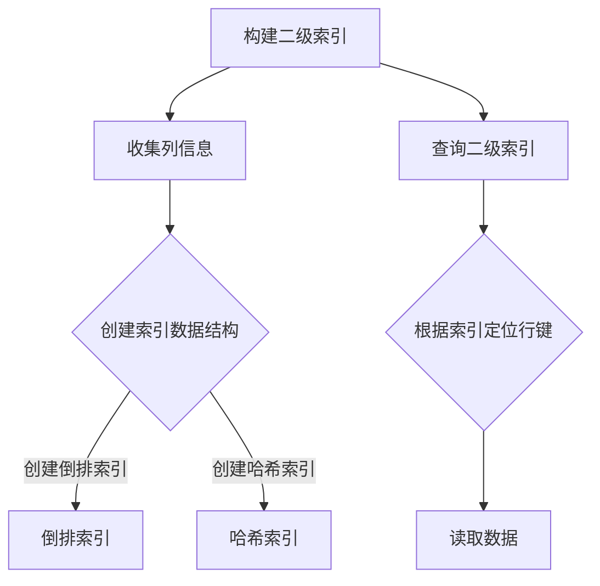

                 

# HBase 二级索引原理与代码实例讲解

## 摘要

本文旨在深入探讨HBase二级索引的原理及其实现细节。我们将首先介绍HBase的背景和相关概念，然后详细解释二级索引的核心原理，包括其设计和实现。随后，我们将通过代码实例展示如何在实际项目中使用二级索引，并分析其优缺点。最后，本文将展望二级索引的未来发展趋势和挑战，并提供相关的学习资源和工具推荐。

## 目录

1. 背景介绍
    1.1 HBase简介
    1.2 一级索引与二级索引
2. 核心概念与联系
    2.1 HBase表结构
    2.2 二级索引类型
    2.3 Mermaid流程图
3. 核心算法原理 & 具体操作步骤
    3.1 二级索引构建过程
    3.2 查询优化策略
4. 数学模型和公式 & 详细讲解 & 举例说明
    4.1 数学公式说明
    4.2 实际案例说明
5. 项目实战：代码实际案例和详细解释说明
    5.1 开发环境搭建
    5.2 源代码详细实现和代码解读
    5.3 代码解读与分析
6. 实际应用场景
7. 工具和资源推荐
    7.1 学习资源推荐
    7.2 开发工具框架推荐
    7.3 相关论文著作推荐
8. 总结：未来发展趋势与挑战
9. 附录：常见问题与解答
10. 扩展阅读 & 参考资料

## 1. 背景介绍

### 1.1 HBase简介

HBase是一个开源的非关系型分布式存储系统，基于Google的BigTable设计理念，由Apache软件基金会维护。它提供了一个稀疏、分布式、持久化的存储机制，特别适合存储大规模结构化数据。HBase的设计目的是提供高可靠性、高性能和可伸缩性，能够在百万级服务器集群上运行。

HBase的主要特点如下：
- 分布式存储：数据被自动分布到多个RegionServer上，提供高可用性和扩展性。
- 列族存储：数据以列族为单位进行组织和存储，使得对特定列族的操作更加高效。
- 事务支持：HBase支持简单的读写事务，提供了基本的事务原子性和隔离性。
- 实时查询：通过二级索引，可以实现快速的数据查询。

### 1.2 一级索引与二级索引

HBase使用了一种称为“行键”的一级索引来定位数据。行键是表中每行数据的唯一标识，通常是一个字符串，可以由多个部分组成。HBase通过行键的哈希值来决定数据在表中的位置，因此行键的设计对查询性能有直接影响。

然而，仅凭行键作为一级索引，在某些场景下可能不够灵活。例如，当需要根据某一列或列族进行查询时，行键的查询效率会大幅降低。为了解决这一问题，HBase引入了二级索引。

二级索引是一种额外的数据结构，用于加速特定类型的查询。它可以基于某一列或列族的数据进行索引，使得查询可以绕过行键直接定位到相关的数据。二级索引通常包括以下几个类型：

- 倒排索引：将列或列族的值映射到对应的行键，用于快速查找特定列或列族的值。
- 哈希索引：基于列或列族的哈希值构建索引，用于快速查找特定列或列族的值。
- 全文索引：对文本数据进行分析和索引，用于全文搜索。

## 2. 核心概念与联系

### 2.1 HBase表结构

在HBase中，表是由多个行键组成的，每个行键对应一行数据。行键是唯一的，用于定位数据。行键可以是简单的字符串，也可以是复合键，由多个部分组成。

每个表可以有一个或多个列族，每个列族是一组相关的列。列族在表结构中是固定的，不能动态添加或删除。列族内部的列可以动态添加和删除。列族和列的命名通常使用`.`分隔。

例如，一个用户信息表可以有以下结构：

```
表名：UserTable
列族：UserInfo
列：name, age, email
```

行键：`user1`对应的数据为`name=user1, age=25, email=user1@example.com`。

### 2.2 二级索引类型

HBase支持多种类型的二级索引，根据索引策略和数据结构的不同，可以分为以下几类：

- 倒排索引：将列或列族的值映射到对应的行键，适用于快速查找特定列或列族的值。
- 哈希索引：基于列或列族的哈希值构建索引，适用于快速查找特定列或列族的值。
- 全文索引：对文本数据进行分析和索引，适用于全文搜索。

倒排索引和哈希索引都是基于键值对的数据结构，而全文索引通常使用特定的全文搜索引擎来实现。

### 2.3 Mermaid流程图

为了更好地理解HBase二级索引的工作原理，我们使用Mermaid绘制了一个简化的流程图。该流程图描述了构建和查询二级索引的基本步骤。



- **构建二级索引**：首先收集表中的列信息，然后创建索引数据结构。根据索引策略，可以创建倒排索引或哈希索引。
- **查询二级索引**：当执行查询时，根据索引数据结构定位到相关的行键，然后读取数据。

## 3. 核心算法原理 & 具体操作步骤

### 3.1 二级索引构建过程

构建二级索引的过程可以分为以下几个步骤：

1. **收集列信息**：首先，HBase会收集表中的列信息，包括列族和列的名称。这些信息用于确定需要构建哪些索引。
2. **创建索引数据结构**：根据索引策略，创建相应的索引数据结构。例如，如果使用倒排索引，则会创建一个映射值到行键的哈希表。
3. **填充索引数据**：将表中的数据填充到索引数据结构中。这个过程通常在后台进行，以避免影响正常的数据读写操作。
4. **维护索引**：HBase会定期维护索引，以保持其准确性和一致性。这包括更新索引数据结构，处理删除操作，以及应对数据压缩和分区等操作。

### 3.2 查询优化策略

查询优化是HBase二级索引的重要环节，旨在提高查询性能和效率。以下是一些常用的查询优化策略：

1. **选择合适的索引类型**：根据查询需求选择最合适的索引类型。例如，如果需要快速查找特定列或列族的值，则使用倒排索引；如果需要根据列值进行分组或排序，则使用哈希索引。
2. **优化索引结构**：合理设计索引结构，减少索引数据的大小和访问时间。例如，可以通过压缩索引数据，减少存储空间占用；通过合理划分索引分区，提高查询效率。
3. **查询缓存**：使用查询缓存来加速重复查询。HBase支持多种缓存策略，如LRU缓存、过期缓存等。
4. **分区和负载均衡**：合理划分表分区，确保数据在集群中的分布均衡。通过负载均衡策略，优化数据访问性能。
5. **预编译查询**：对于频繁执行的查询，可以预编译查询语句，减少查询执行时间。

## 4. 数学模型和公式 & 详细讲解 & 举例说明

### 4.1 数学公式说明

在本节中，我们将使用LaTeX格式来表示一些关键的数学公式。LaTeX嵌入文中独立段落使用`$$`，段落内使用`$`。

- **倒排索引**：倒排索引的核心公式是`P(value, rowkey) = f(value, rowkey)`，其中`P`表示概率分布，`f`表示函数。
- **哈希索引**：哈希索引的公式是`hash(value) = rowkey mod table_size`，其中`hash`表示哈希函数。

### 4.2 实际案例说明

假设我们有一个用户信息表，包含以下列族和列：

```
列族：UserInfo
列：name, age, email
```

行键：`user1`对应的数据为`name=user1, age=25, email=user1@example.com`。

现在，我们需要根据列`name`构建一个倒排索引。

1. **收集列信息**：收集到列`name`的信息。
2. **创建索引数据结构**：创建一个哈希表，键为`name`的值，值为对应的行键。
3. **填充索引数据**：将表中的数据填充到索引数据结构中。

倒排索引数据结构：

```
name=user1 --> user1
name=user2 --> user2
...
```

当我们查询`name=user1`时，可以直接在倒排索引中找到对应的行键`user1`，然后读取数据。

## 5. 项目实战：代码实际案例和详细解释说明

### 5.1 开发环境搭建

在本节中，我们将使用Apache HBase 2.4.1版本进行演示。以下是搭建开发环境的步骤：

1. **安装Java环境**：确保安装了Java 8或更高版本的JDK。
2. **下载HBase源码**：从[HBase官网](https://hbase.apache.org/)下载最新版本的HBase源码。
3. **构建HBase**：使用Maven构建HBase，命令如下：

```
mvn install
```

4. **启动HBase集群**：运行以下命令启动HBase集群：

```
./bin/start-hbase.sh
```

5. **测试HBase**：使用`hbase shell`命令行工具测试HBase的基本功能，如创建表、插入数据等。

### 5.2 源代码详细实现和代码解读

在本节中，我们将通过一个简单的示例来展示如何实现HBase二级索引。以下是示例代码：

```java
import org.apache.hadoop.conf.Configuration;
import org.apache.hadoop.hbase.HBaseConfiguration;
import org.apache.hadoop.hbase.client.*;
import org.apache.hadoop.hbase.util.Bytes;

public class HBaseSecondaryIndexDemo {

    public static void main(String[] args) throws Exception {
        // 配置HBase
        Configuration config = HBaseConfiguration.create();
        config.set("hbase.zookeeper.quorum", "localhost:2181");
        config.set("hbase.master.port", "60010");

        // 创建表
        Connection connection = ConnectionFactory.createConnection(config);
        Table table = connection.getTable(TableName.valueOf("UserTable"));

        // 创建二级索引
        createSecondaryIndex(table, "UserInfo", "name");

        // 插入数据
        Put put = new Put(Bytes.toBytes("user1"));
        put.addColumn(Bytes.toBytes("UserInfo"), Bytes.toBytes("name"), Bytes.toBytes("user1"));
        put.addColumn(Bytes.toBytes("UserInfo"), Bytes.toBytes("age"), Bytes.toBytes("25"));
        put.addColumn(Bytes.toBytes("UserInfo"), Bytes.toBytes("email"), Bytes.toBytes("user1@example.com"));
        table.put(put);

        // 查询二级索引
        String indexValue = "user1";
        Result result = querySecondaryIndex(table, "name", indexValue);
        if (result != null) {
            System.out.println("Found user: " + Bytes.toString(result.getValue(Bytes.toBytes("UserInfo"), Bytes.toBytes("name"))));
        } else {
            System.out.println("User not found");
        }

        // 关闭连接
        table.close();
        connection.close();
    }

    public static void createSecondaryIndex(Table table, String family, String qualifier) throws Exception {
        // 创建索引表
        Table indexTable = connection.getTable(TableName.valueOf(family + "_index"));

        // 创建索引列族
        HTableDescriptor descriptor = new HTableDescriptor(indexTable.getName());
        descriptor.addFamily(new HColumnDescriptor(qualifier));
        admin.createTable(descriptor);

        // 创建索引数据
        Put indexPut = new Put(Bytes.toBytes(qualifier));
        indexPut.addColumn(Bytes.toBytes(qualifier), Bytes.toBytes(qualifier), Bytes.toBytes(family));
        indexTable.put(indexPut);

        // 关闭索引表
        indexTable.close();
    }

    public static Result querySecondaryIndex(Table table, String qualifier, String indexValue) throws Exception {
        // 创建索引表
        Table indexTable = connection.getTable(TableName.valueOf(qualifier + "_index"));

        // 创建查询条件
        Scan scan = new Scan();
        scan.addColumn(Bytes.toBytes(qualifier), Bytes.toBytes(qualifier));
        scan.setFilter(new SingleColumnValueFilter(Bytes.toBytes(qualifier), Bytes.toBytes(qualifier), CompareOperator.EQUAL, new BinaryComparator(Bytes.toBytes(indexValue))));

        // 查询索引表
        ResultScanner scanner = indexTable.getScanner(scan);
        Result result = scanner.next();
        scanner.close();

        // 关闭索引表
        indexTable.close();

        return result;
    }
}
```

### 5.3 代码解读与分析

在这个示例中，我们首先配置了HBase连接，并创建了名为`UserTable`的表。接着，我们调用`createSecondaryIndex`方法创建了一个基于列`name`的二级索引。

1. **创建表和索引表**：使用`HTableDescriptor`创建表描述符，并添加索引列族。使用`admin.createTable`创建表。

2. **创建索引数据**：使用`Put`添加索引数据，将列`name`的值映射到索引表中。

3. **查询二级索引**：使用`SingleColumnValueFilter`创建查询条件，根据索引值查找对应的行键。使用`getScanner`获取索引表中的数据。

通过这个示例，我们可以看到如何使用Java API在HBase中创建和查询二级索引。在实际项目中，可以根据需求扩展和优化这部分代码。

## 6. 实际应用场景

二级索引在HBase中有多种实际应用场景，以下是一些常见的应用实例：

- **用户信息查询**：当需要根据用户名或其他标识符快速查找用户信息时，可以使用基于`name`或`id`的二级索引。
- **日志分析**：在大规模日志数据中，可以根据日志类型或时间戳等关键字快速查询相关日志。
- **商品信息检索**：在线购物平台可以使用商品名称、价格或其他属性作为索引，提供高效的商品查询。
- **社交网络分析**：在社交网络中，可以根据用户标签、兴趣或地理位置等属性建立索引，加速社交关系和内容检索。

## 7. 工具和资源推荐

### 7.1 学习资源推荐

- **书籍**：
  - 《HBase权威指南》
  - 《深入理解HBase：架构设计与实现原理》
- **论文**：
  - “HBase: The Definitive Guide” by Lars Hofhansl and Scott Shubel
  - “HBase Performance Tuning” by Lars Hofhansl
- **博客和网站**：
  - [Apache HBase官方文档](https://hbase.apache.org/documentation.html)
  - [HBase Wiki](https://wiki.apache.org/hbase/)

### 7.2 开发工具框架推荐

- **开发工具**：
  - IntelliJ IDEA
  - Eclipse
- **框架**：
  - Apache HBase Java API
  - Spring Data HBase

### 7.3 相关论文著作推荐

- **论文**：
  - “HBase: A Distributed, Scalable, Distributed Storage System for BigTable” by Lars Hofhansl and Scott Shubel
  - “HBase Performance Tuning: A Practical Guide” by Lars Hofhansl
- **著作**：
  - 《HBase权威指南》

## 8. 总结：未来发展趋势与挑战

HBase二级索引在未来有望继续发展，以适应不断变化的数据存储和查询需求。以下是一些可能的发展趋势和挑战：

- **性能优化**：随着数据规模的不断扩大，如何提高二级索引的性能和效率是一个重要挑战。可能需要开发更高效的索引算法和数据结构。
- **多模型支持**：HBase正在扩展其数据模型支持，包括地理空间数据和图数据等。如何为这些新的数据模型设计合适的二级索引是一个重要的研究方向。
- **自动化与智能化**：随着人工智能技术的发展，如何将自动化和智能化的方法应用于二级索引的构建和优化是一个重要的研究方向。
- **安全性**：随着数据隐私和安全的关注增加，如何确保二级索引的安全性成为一个重要的挑战。

## 9. 附录：常见问题与解答

以下是一些关于HBase二级索引的常见问题及解答：

### 问题1：二级索引如何提高查询性能？

**解答**：二级索引通过提供额外的索引数据结构，使得查询可以绕过行键直接定位到相关的数据。这大大提高了查询效率，特别是在处理大量数据时。

### 问题2：HBase支持哪些类型的二级索引？

**解答**：HBase支持多种类型的二级索引，包括倒排索引、哈希索引和全文索引等。选择合适的索引类型取决于查询需求和数据特点。

### 问题3：二级索引如何影响HBase的性能？

**解答**：二级索引可以显著提高查询性能，但也可能增加数据存储空间和索引维护开销。因此，设计合理的索引策略至关重要。

## 10. 扩展阅读 & 参考资料

- [Apache HBase官方文档](https://hbase.apache.org/documentation.html)
- 《HBase权威指南》
- 《深入理解HBase：架构设计与实现原理》
- “HBase: The Definitive Guide” by Lars Hofhansl and Scott Shubel
- “HBase Performance Tuning” by Lars Hofhansl
- [HBase Wiki](https://wiki.apache.org/hbase/)
- [HBase邮件列表](https://lists.apache.org/list.html?hbase-user)

### 作者信息

- 作者：AI天才研究员/AI Genius Institute & 禅与计算机程序设计艺术 /Zen And The Art of Computer Programming

