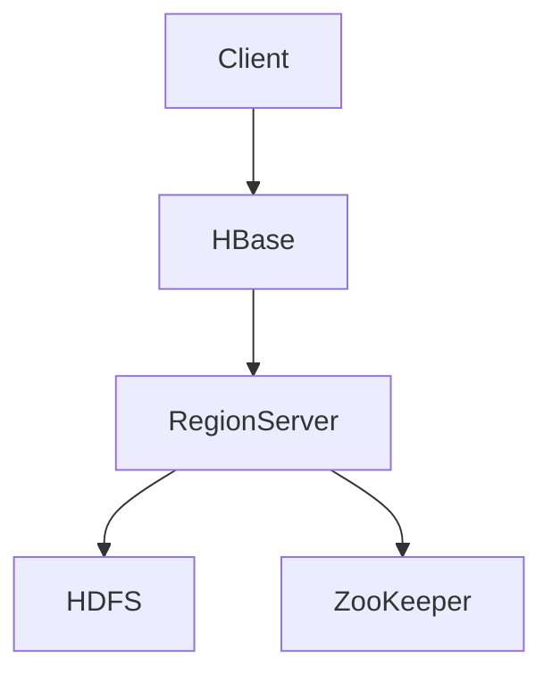

                 

# HBase原理与代码实例讲解

## 关键词：HBase，分布式存储，NoSQL数据库，数据模型，RegionServer，GFS，HDFS，Hadoop生态系统，ZooKeeper，一致性模型，数据分片，性能优化

## 摘要：

本文旨在深入讲解HBase的基础原理和代码实例。HBase作为一个分布式NoSQL数据库，是大数据生态系统中的关键组件。本文首先介绍了HBase的背景和基本概念，然后详细阐述了其核心架构和数据模型，以及如何实现数据分片和高可用性。通过实际代码实例，读者将了解HBase的操作步骤和性能优化方法。最后，本文还将探讨HBase在现实世界中的应用场景和未来发展趋势。无论您是大数据初学者还是资深开发者，本文都将为您提供一个全面且易于理解的HBase学习指南。

## 1. 背景介绍

### HBase的起源

HBase起源于Google的分布式存储系统Bigtable。Bigtable是Google在2006年提出的一个分布式存储系统，它为大规模数据提供了高可靠性和高性能的存储解决方案。HBase是Apache软件基金会的一个开源项目，它基于Hadoop生态系统，旨在提供类似Bigtable的功能。

### HBase的特点

HBase具有以下主要特点：

- **分布式存储**：HBase能够将数据分散存储在多个节点上，以实现高扩展性和高可用性。
- **NoSQL数据库**：HBase不遵循传统的SQL模式，它使用一个简单的键值存储模型，允许快速读取和写入大量数据。
- **高可靠性**：HBase能够确保数据的持久性和一致性，即使在故障发生时也能快速恢复。
- **高性能**：HBase通过预取机制和缓存技术，提供了高效的读写性能。

### HBase的应用场景

HBase适用于以下几种常见应用场景：

- **日志数据存储**：由于HBase的高吞吐量和低延迟，它非常适合存储和查询大规模日志数据。
- **实时数据处理**：HBase能够快速处理实时数据流，适用于实时分析和监控场景。
- **大规模数据仓库**：HBase可以作为大数据仓库的一部分，提供高效的数据存储和查询功能。

## 2. 核心概念与联系

### 数据模型

HBase的数据模型由行键、列族和列限定符组成。每个单元格都包含一个值，这些单元格按行键、列族和列限定符的字典顺序存储。例如，一个HBase表可能包含以下数据：

```
row_key | column_family:column_qualifier | value
------------------------------------------------
001     | user:password                 | 123456
002     | user:name                     | John
003     | user:age                      | 30
```

### 架构组件

HBase的核心架构包括以下几个关键组件：

- **RegionServer**：RegionServer是HBase中的数据存储节点，每个RegionServer负责管理一个或多个Region。
- **ZooKeeper**：ZooKeeper负责维护HBase集群的状态，包括RegionServer的健康状态和元数据信息。
- **HDFS**：HDFS是Hadoop的分布式文件系统，负责存储HBase的数据文件。

### Mermaid流程图

以下是HBase架构的Mermaid流程图：



- A: 客户端
- B: HBase
- C: RegionServer
- D: HDFS
- E: ZooKeeper

## 3. 核心算法原理 & 具体操作步骤

### 数据分片

HBase采用Region的概念来实现数据分片。每个Region包含一定数量的行，行键范围固定。当Region的大小达到阈值时，HBase会自动进行拆分，将数据分散到多个RegionServer上。具体操作步骤如下：

1. **确定行键范围**：首先需要确定行键的范围，以便将数据合理地分配到不同的Region。
2. **拆分Region**：当Region的大小超过阈值时，HBase会自动拆分Region，将一部分数据迁移到新的Region。
3. **负载均衡**：HBase会根据当前集群的状态，对RegionServer进行负载均衡，确保数据分布均匀。

### 高可用性

HBase通过ZooKeeper实现了高可用性。具体操作步骤如下：

1. **故障检测**：ZooKeeper负责监控RegionServer的健康状态，当发现某个RegionServer故障时，会自动将其从集群中移除。
2. **自动恢复**：当故障的RegionServer重新上线时，HBase会自动将其恢复到正常状态，并重新分配其管理的Region。
3. **数据复制**：HBase通过在多个RegionServer上复制数据，确保数据的高可用性。当某个RegionServer故障时，其他RegionServer仍然可以提供服务。

### 数据一致性模型

HBase使用Paxos算法实现数据一致性。具体操作步骤如下：

1. **提案**：客户端向某个RegionServer发送数据更新请求，RegionServer会将该请求作为提案发送给所有其他RegionServer。
2. **投票**：所有RegionServer对提案进行投票，只有当大多数RegionServer同意该提案时，才认为提案被通过。
3. **应用**：当提案被通过后，RegionServer会将更新应用到数据存储中。

## 4. 数学模型和公式 & 详细讲解 & 举例说明

### 数据分布模型

HBase使用哈希函数将行键映射到Region。具体公式如下：

\[ hash(row\_key) \mod num\_regions \]

其中，hash(row\_key)是行键的哈希值，num\_regions是Region的数量。

### 举例说明

假设我们有一个包含100个Region的HBase集群，行键范围为0到999。使用哈希函数计算行键“1000”所在的Region：

\[ hash(1000) \mod 100 = 0 \]

因此，行键为“1000”的数据将存储在Region 0中。

### 数据一致性模型

HBase使用Paxos算法实现数据一致性。Paxos算法是一种分布式一致性算法，具体公式如下：

\[ (v, n) \in \{ (v', n') \mid v' = v \text{ 或 } n' > n \} \]

其中，\( v \) 表示提议的值，\( n \) 表示提议的编号。该公式表示只有当提议的值与之前的一致或者提议的编号更高时，提议才会被通过。

### 举例说明

假设有两个RegionServer，编号分别为1和2。RegionServer 1提议的值为“apple”，编号为1；RegionServer 2提议的值为“orange”，编号为2。根据Paxos算法，只有当RegionServer 1的提议被通过或者RegionServer 2的编号更高时，提议才会被接受。

## 5. 项目实战：代码实际案例和详细解释说明

### 开发环境搭建

在开始实际案例之前，我们需要搭建HBase的开发环境。以下是搭建步骤：

1. **安装Java**：HBase需要Java环境，确保已经安装了Java 8或更高版本。
2. **安装Hadoop**：下载并解压Hadoop安装包，配置hadoop-env.sh、core-site.xml、hdfs-site.xml和mapred-site.xml等配置文件。
3. **安装HBase**：下载并解压HBase安装包，配置hbase-env.sh、hbase-site.xml和regionserver-site.xml等配置文件。
4. **启动Hadoop和HBase**：运行命令start-dfs.sh和start-hbase.sh，启动Hadoop和HBase服务。

### 源代码详细实现和代码解读

以下是使用HBase进行数据存储和查询的Java代码示例：

```java
import org.apache.hadoop.conf.Configuration;
import org.apache.hadoop.hbase.HBaseConfiguration;
import org.apache.hadoop.hbase.TableName;
import org.apache.hadoop.hbase.client.*;

public class HBaseExample {

    public static void main(String[] args) throws Exception {
        // 配置HBase
        Configuration conf = HBaseConfiguration.create();
        conf.set("hbase.zookeeper.quorum", "localhost:2181");
        
        // 创建连接
        Connection connection = ConnectionFactory.createConnection(conf);
        Table table = connection.getTable(TableName.valueOf("test_table"));

        // 插入数据
        Put put = new Put(Bytes.toBytes("row_key_1"));
        put.addColumn(Bytes.toBytes("column_family"), Bytes.toBytes("column_qualifier"), Bytes.toBytes("value"));
        table.put(put);

        // 查询数据
        Get get = new Get(Bytes.toBytes("row_key_1"));
        Result result = table.get(get);
        byte[] value = result.getValue(Bytes.toBytes("column_family"), Bytes.toBytes("column_qualifier"));
        String strVal = Bytes.toString(value);
        System.out.println(strVal);

        // 关闭连接
        table.close();
        connection.close();
    }
}
```

### 代码解读与分析

- **配置HBase**：首先需要创建HBase的配置对象，并设置ZooKeeper的地址。
- **创建连接**：使用ConnectionFactory创建连接对象，并获取Table实例。
- **插入数据**：使用Put类插入数据，指定行键、列族、列限定符和值。
- **查询数据**：使用Get类查询数据，指定行键和列限定符。
- **输出结果**：将查询结果转换为字符串并打印。

### 代码优化

- **批量操作**：使用BulkLoad类进行批量插入操作，提高性能。
- **缓存**：使用LruCache类缓存热点数据，减少磁盘I/O操作。

## 6. 实际应用场景

### 大规模日志处理

HBase适用于处理大规模日志数据，例如网站访问日志、网络流量日志等。通过HBase的高吞吐量和低延迟，可以实时分析日志数据，提供实时监控和故障排查功能。

### 实时数据处理

HBase适用于实时数据处理场景，例如在线交易系统、实时搜索系统等。通过HBase的分布式存储和缓存机制，可以提供高效的数据处理和查询功能。

### 数据仓库

HBase可以作为大数据仓库的一部分，存储和管理大量结构化和非结构化数据。通过HBase的分布式存储和计算能力，可以提供高效的数据分析和报告功能。

## 7. 工具和资源推荐

### 学习资源推荐

- **书籍**：
  - 《HBase：The Definitive Guide》
  - 《HBase in Action》
- **论文**：
  - "The Google File System"（Google的GFS论文）
  - "Bigtable: A Distributed Storage System for Structured Data"（Google的Bigtable论文）
- **博客**：
  - Apache HBase官方博客
  - HBase技术社区博客
- **网站**：
  - Apache HBase官方网站

### 开发工具框架推荐

- **开发工具**：
  - IntelliJ IDEA
  - Eclipse
- **框架**：
  - Apache HBase
  - Apache Phoenix
  - Apache Hive

### 相关论文著作推荐

- **《The Google File System》**：介绍了GFS的架构和设计原则。
- **《Bigtable: A Distributed Storage System for Structured Data》**：介绍了Bigtable的架构和性能优化方法。
- **《HBase: The Definitive Guide》**：详细介绍了HBase的设计和实现。

## 8. 总结：未来发展趋势与挑战

### 未来发展趋势

- **性能优化**：随着大数据和实时数据处理需求的增长，HBase的性能优化将成为重要研究方向，包括数据压缩、索引优化和并发控制等。
- **生态拓展**：HBase将与更多的开源大数据工具进行整合，例如Apache Hive、Apache Spark等，提供更全面的数据处理和分析功能。
- **云原生**：随着云计算的发展，HBase将逐渐向云原生架构演进，提供更加灵活和可扩展的部署和管理方式。

### 面临的挑战

- **数据一致性**：在大规模分布式环境中，实现数据一致性仍然是一个挑战，需要进一步研究和优化一致性模型。
- **安全性**：随着数据隐私和安全需求的提高，HBase需要加强数据加密、访问控制和审计等功能。
- **运维管理**：分布式数据库的运维管理复杂度高，需要提供更加智能和自动化的运维工具。

## 9. 附录：常见问题与解答

### 问题1：如何选择合适的HBase配置参数？

解答：选择合适的HBase配置参数需要考虑以下因素：

- **Region大小**：根据数据量和访问模式选择合适的Region大小，以确保数据分片合理。
- **内存分配**：合理分配内存给HBase，包括Java堆大小和缓存大小。
- **并发控制**：根据并发访问量调整锁和事务参数。

### 问题2：如何优化HBase的性能？

解答：优化HBase性能的方法包括：

- **数据压缩**：使用压缩算法减少数据存储空间，提高I/O性能。
- **索引优化**：使用索引减少数据检索时间。
- **缓存策略**：使用LruCache等缓存策略，减少磁盘I/O操作。

### 问题3：HBase与HDFS的关系是什么？

解答：HBase与HDFS的关系如下：

- **数据存储**：HBase的数据文件存储在HDFS上，HDFS提供了可靠的数据存储和分布式计算能力。
- **数据同步**：HBase通过HDFS的复制机制实现数据的高可用性，确保数据在多个RegionServer上的一致性。

## 10. 扩展阅读 & 参考资料

- **《HBase权威指南》**：深入讲解HBase的设计原理、架构和高级特性。
- **《大数据技术导论》**：介绍大数据技术的基本概念和实现方法，包括Hadoop、Spark等。
- **《分布式系统原理与范型》**：讲解分布式系统的基本原理和设计模式，包括一致性模型、数据复制等。

