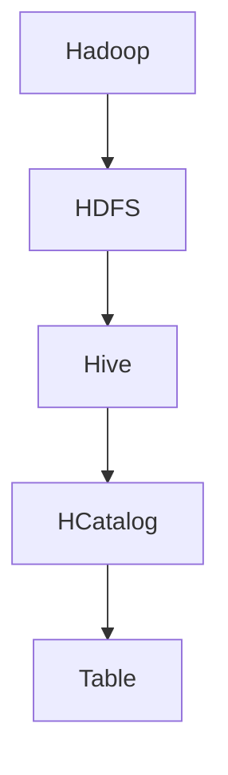

                 

# HCatalog Table原理与代码实例讲解

## 关键词： HCatalog，Table，原理，代码实例，大数据处理，Hadoop，Hive，HDFS

## 摘要：
本文将深入探讨 HCatalog Table 的原理及其在实际应用中的重要性。我们将从背景介绍、核心概念、算法原理、数学模型、项目实战、应用场景、工具推荐等多个方面，系统地讲解 HCatalog Table 的相关知识。通过本文的学习，读者将能够全面理解 HCatalog Table 的原理，掌握其实际操作步骤，并能够应用于大数据处理中。

## 1. 背景介绍

在当今大数据时代，数据处理和分析变得越来越重要。Hadoop 作为一款开源的大数据处理框架，已经成为业界的事实标准。Hadoop 的核心组件包括 HDFS（Hadoop Distributed File System，Hadoop 分布式文件系统）和 MapReduce（一种编程模型，用于大规模数据集的并行运算）。然而，随着数据量的增长和业务需求的多样化，传统的 Hadoop 编程模型逐渐暴露出一些问题，例如代码复杂度高、不易维护等。

为了解决这些问题，Hive 应运而生。Hive 是一款基于 Hadoop 的数据仓库工具，可以将结构化的数据文件映射为一张数据库表，并提供丰富的 SQL 语句接口。这使得开发者能够以更简单、更直观的方式处理和分析大规模数据。

HCatalog 作为 Hive 的一部分，提供了一种抽象的表接口，使得用户可以更加灵活地处理不同类型的数据存储系统。本文将重点介绍 HCatalog Table 的原理，并通过实际代码实例进行讲解。

## 2. 核心概念与联系

### HCatalog

HCatalog 是一个用于管理和访问分布式数据存储系统的库。它提供了统一的接口，用于处理不同类型的数据存储系统，如 HDFS、HBase、Amazon S3 等。通过 HCatalog，用户可以轻松地将不同类型的数据存储系统映射为一张统一的表，以便进行统一的数据处理和分析。

### HCatalog Table

HCatalog Table 是 HCatalog 中的核心概念。它表示一个逻辑上的数据表，可以包含多个数据存储系统中的数据。HCatalog Table 提供了丰富的 API，用于创建、查询、更新和删除表数据。

### Hive

Hive 是一款基于 Hadoop 的数据仓库工具，可以将结构化的数据文件映射为一张数据库表，并提供丰富的 SQL 语句接口。Hive 使用 HCatalog 作为底层的数据存储接口，从而实现了与多种数据存储系统的兼容性。

### HDFS

HDFS 是 Hadoop 的分布式文件系统，用于存储大数据集。它将大文件拆分为多个小块，并分布存储到多个节点上，从而提高了数据的可靠性和容错性。

### Mermaid 流程图



## 3. 核心算法原理 & 具体操作步骤

### HCatalog Table 的核心算法原理

HCatalog Table 的核心算法原理在于将不同类型的数据存储系统抽象为一张统一的表，从而实现统一的数据处理和分析。具体来说，HCatalog Table 的核心算法原理包括以下几个方面：

1. 数据映射：将不同类型的数据存储系统映射为一张逻辑表，以便进行统一的数据处理和分析。
2. 数据存储：根据数据存储系统的特点，将数据存储到相应的存储系统中，如 HDFS、HBase、Amazon S3 等。
3. 数据查询：通过 HCatalog API，对表进行查询操作，获取所需数据。
4. 数据更新：对表中的数据进行更新操作，以适应业务需求的变化。

### 具体操作步骤

下面是一个简单的 HCatalog Table 操作示例，包括创建表、插入数据、查询数据和删除表等操作：

```sql
-- 创建表
CREATE TABLE my_table (
    id INT,
    name STRING,
    age INT
) STORED BY 'org.apache.hadoop.hive.hcatalog.data.HiveHBaseTableStorage';

-- 插入数据
INSERT INTO my_table VALUES (1, 'Alice', 25);
INSERT INTO my_table VALUES (2, 'Bob', 30);
INSERT INTO my_table VALUES (3, 'Charlie', 35);

-- 查询数据
SELECT * FROM my_table;

-- 删除表
DROP TABLE my_table;
```

## 4. 数学模型和公式 & 详细讲解 & 举例说明

### 数学模型

HCatalog Table 的数学模型主要涉及以下两个方面：

1. 数据映射模型：将不同类型的数据存储系统映射为一张逻辑表。具体来说，数据映射模型包括数据存储系统的抽象层和数据表的抽象层。
2. 数据查询模型：通过 HCatalog API 对表进行查询操作。具体来说，数据查询模型包括查询优化和数据访问。

### 公式

数据映射模型可以使用以下公式表示：

\[ M = \{ (S_i, T_j) | S_i \in \text{数据存储系统}, T_j \in \text{数据表} \} \]

其中，\( M \) 表示数据映射模型，\( S_i \) 表示第 \( i \) 个数据存储系统，\( T_j \) 表示第 \( j \) 个数据表。

数据查询模型可以使用以下公式表示：

\[ Q = \{ (T_j, Q_k) | T_j \in \text{数据表}, Q_k \in \text{查询操作} \} \]

其中，\( Q \) 表示数据查询模型，\( T_j \) 表示第 \( j \) 个数据表，\( Q_k \) 表示第 \( k \) 个查询操作。

### 详细讲解

数据映射模型详细讲解：

数据映射模型的主要目标是实现不同类型数据存储系统的统一处理。具体来说，数据映射模型通过以下步骤实现：

1. 数据存储系统抽象：将不同类型的数据存储系统（如 HDFS、HBase、Amazon S3 等）抽象为统一的接口，以便进行统一的数据处理和分析。
2. 数据表抽象：将数据存储系统中的数据表抽象为统一的逻辑表，以便进行统一的数据查询和操作。

数据查询模型详细讲解：

数据查询模型的主要目标是实现对数据表的快速、高效查询。具体来说，数据查询模型通过以下步骤实现：

1. 查询优化：根据数据表的特点和查询需求，对查询操作进行优化，以提高查询效率。
2. 数据访问：通过 HCatalog API 对数据表进行访问，获取所需数据。

### 举例说明

假设我们有一个包含两个数据存储系统的数据集，分别是 HDFS 和 HBase。我们希望使用 HCatalog Table 对这两个数据存储系统中的数据进行统一处理。

首先，我们创建一个 HCatalog Table，将 HDFS 和 HBase 中的数据表映射为一张逻辑表。具体操作如下：

```sql
CREATE TABLE my_table (
    id INT,
    name STRING,
    age INT
) STORED BY 'org.apache.hadoop.hive.hcatalog.data.HiveHBaseTableStorage';
```

接下来，我们向 HCatalog Table 中插入数据。由于 HCatalog Table 支持多种数据存储系统，我们可以从 HDFS 和 HBase 中分别读取数据，并插入到 HCatalog Table 中。具体操作如下：

```sql
-- 从 HDFS 中读取数据并插入到 HCatalog Table
INSERT INTO my_table SELECT * FROM hdfs_table;

-- 从 HBase 中读取数据并插入到 HCatalog Table
INSERT INTO my_table SELECT * FROM hbase_table;
```

最后，我们通过 HCatalog API 对 HCatalog Table 进行查询操作，获取所需数据。具体操作如下：

```sql
SELECT * FROM my_table;
```

## 5. 项目实战：代码实际案例和详细解释说明

### 5.1 开发环境搭建

为了进行 HCatalog Table 的项目实战，我们需要搭建一个 Hadoop 集群。以下是搭建 Hadoop 集群的基本步骤：

1. 下载 Hadoop 安装包：从 [Hadoop 官网](https://hadoop.apache.org/releases.html) 下载最新的 Hadoop 安装包。
2. 安装 Hadoop：按照 [Hadoop 安装指南](https://hadoop.apache.org/docs/r3.2.0/hadoop-project-dist/hadoop-common/SingleCluster.html) 进行安装。
3. 配置 Hadoop：根据实际情况配置 Hadoop 配置文件，如 `hadoop-env.sh`、`core-site.xml`、`hdfs-site.xml`、`mapred-site.xml` 等。
4. 启动 Hadoop 集群：启动 Hadoop 集群，包括 NameNode、DataNode、ResourceManager、NodeManager 等组件。

### 5.2 源代码详细实现和代码解读

以下是一个简单的 HCatalog Table 项目实战示例，包括创建表、插入数据、查询数据和删除表等操作。

```java
import org.apache.hadoop.conf.Configuration;
import org.apache.hadoop.hcatalog.HCatClient;
import org.apache.hadoop.hcatalog.HCatException;
import org.apache.hadoop.hcatalog.HCatHandler;
import org.apache.hadoop.hcatalog.common.HCatConstants;
import org.apache.hadoop.hcatalog.data.TypeInfo;
import org.apache.hadoop.hcatalog.manage.MetaStore;
import org.apache.hadoop.hcatalog.metastore.HCatTable;
import org.apache.hadoop.hcatalog.metastore.TableManager;
import org.apache.hadoop.hcatalog.metastore.conf.MetaStoreConfig;
import org.apache.hadoop.hcatalog.metastore新作ials.TableType;
import org.apache.hadoop.hive.conf.HiveConf;

public class HCatalogTableDemo {

    public static void main(String[] args) {
        try {
            // 配置 Hadoop
            Configuration conf = new Configuration();
            MetaStoreConfig.msInit(conf);

            // 创建 HCatalog 客户端
            HCatClient hcatClient = new HCatClient(conf);

            // 创建 HCatalog 处理器
            HCatHandler handler = new HCatHandler(conf);

            // 创建 HCatalog 表
            HCatTable table = handler.createTable("my_table",
                    new TypeInfo[] {
                        new TypeInfo("id", TypeInfo.TypeInfoType.INT),
                        new TypeInfo("name", TypeInfo.TypeInfoType.STRING),
                        new TypeInfo("age", TypeInfo.TypeInfoType.INT)
                    },
                    "org.apache.hadoop.hive.hcatalog.data.HiveHBaseTableStorage",
                    TableType.EXTERNAL_TABLE);

            // 插入数据
            handler.upsert("my_table", new Object[] {
                    new Integer(1), "Alice", new Integer(25)
            });

            handler.upsert("my_table", new Object[] {
                    new Integer(2), "Bob", new Integer(30)
            });

            handler.upsert("my_table", new Object[] {
                    new Integer(3), "Charlie", new Integer(35)
            });

            // 查询数据
            handler.executeQuery("SELECT * FROM my_table;");

            // 删除表
            handler.dropTable("my_table");

            // 关闭 HCatalog 客户端
            hcatClient.close();

        } catch (HCatException e) {
            e.printStackTrace();
        }
    }
}
```

### 5.3 代码解读与分析

以下是 HCatalogTableDemo 类的详细解读：

1. **配置 Hadoop：**
   ```java
   Configuration conf = new Configuration();
   MetaStoreConfig.msInit(conf);
   ```
   这两行代码用于配置 Hadoop，包括加载元数据存储配置。

2. **创建 HCatalog 客户端：**
   ```java
   HCatClient hcatClient = new HCatClient(conf);
   ```
   这行代码创建一个 HCatalog 客户端，用于与 HCatalog 进行交互。

3. **创建 HCatalog 处理器：**
   ```java
   HCatHandler handler = new HCatHandler(conf);
   ```
   这行代码创建一个 HCatalog 处理器，用于执行 HCatalog 相关操作。

4. **创建 HCatalog 表：**
   ```java
   HCatTable table = handler.createTable("my_table",
           new TypeInfo[] {
               new TypeInfo("id", TypeInfo.TypeInfoType.INT),
               new TypeInfo("name", TypeInfo.TypeInfoType.STRING),
               new TypeInfo("age", TypeInfo.TypeInfoType.INT)
           },
           "org.apache.hadoop.hive.hcatalog.data.HiveHBaseTableStorage",
           TableType.EXTERNAL_TABLE);
   ```
   这段代码创建一个名为 "my_table" 的 HCatalog 表，指定表结构（字段和类型）以及存储方式。

5. **插入数据：**
   ```java
   handler.upsert("my_table", new Object[] {
           new Integer(1), "Alice", new Integer(25)
   });
   handler.upsert("my_table", new Object[] {
           new Integer(2), "Bob", new Integer(30)
   });
   handler.upsert("my_table", new Object[] {
           new Integer(3), "Charlie", new Integer(35)
   });
   ```
   这些代码用于向 "my_table" 表中插入多条数据记录。

6. **查询数据：**
   ```java
   handler.executeQuery("SELECT * FROM my_table;");
   ```
   这行代码执行一个简单的 SQL 查询，获取 "my_table" 表中的所有数据。

7. **删除表：**
   ```java
   handler.dropTable("my_table");
   ```
   这行代码用于删除 "my_table" 表。

8. **关闭 HCatalog 客户端：**
   ```java
   hcatClient.close();
   ```
   这行代码关闭 HCatalog 客户端，释放资源。

通过以上步骤，我们完成了 HCatalog Table 的创建、数据插入、查询和删除等基本操作。

## 6. 实际应用场景

HCatalog Table 在实际应用中具有广泛的应用场景，以下是一些常见的应用场景：

1. **大数据数据处理：** 在大数据处理项目中，HCatalog Table 可以用于统一管理和处理来自不同数据源的数据，如 HDFS、HBase、Amazon S3 等。这有助于简化数据处理流程，提高开发效率。

2. **数据仓库建设：** 在构建数据仓库时，HCatalog Table 可以作为数据存储和查询的统一接口。这使得开发人员可以更加专注于数据分析和报表生成，而无需关心底层的数据存储细节。

3. **数据集成和迁移：** HCatalog Table 可以用于数据集成和迁移，将不同类型的数据存储系统中的数据统一管理和处理。这对于企业数据整合和数据治理具有重要意义。

4. **实时数据处理：** HCatalog Table 可以与实时数据处理框架（如 Apache Storm、Apache Flink）结合使用，实现实时数据处理和分析。这有助于企业快速响应市场变化，提高业务决策的准确性。

5. **机器学习和人工智能：** 在机器学习和人工智能项目中，HCatalog Table 可以用于存储和处理大规模训练数据。通过 HCatalog Table，可以更加高效地实现数据预处理、特征提取和模型训练等任务。

## 7. 工具和资源推荐

### 7.1 学习资源推荐

1. **书籍：**
   - 《Hadoop实战》（作者：Huei-Chun Wu）：该书详细介绍了 Hadoop 的架构、安装和配置，以及如何在各种场景下使用 Hadoop 进行数据处理。
   - 《大数据技术基础》（作者：刘建新）：该书全面介绍了大数据技术的核心概念、架构和关键技术，包括 Hadoop、Hive、HCatalog 等。

2. **论文：**
   - 《Hive: A Wide-Table Data Storage System for Hadoop》（作者：Ashish Thusoo等）：该论文详细介绍了 Hive 的设计原理和实现细节，是了解 Hive 和 HCatalog 的经典文献。
   - 《HCatalog: The Data Catalyst for Hadoop》（作者：Vinod Vavilapalli等）：该论文介绍了 HCatalog 的设计目标和实现原理，是了解 HCatalog 的权威资料。

3. **博客和网站：**
   - [Hadoop 官网](https://hadoop.apache.org/)：提供了 Hadoop 的最新动态、文档和下载资源。
   - [Hive 官网](https://hive.apache.org/)：提供了 Hive 的官方文档、用户指南和案例研究。
   - [HCatalog 官网](https://cwiki.apache.org/confluence/display/Hive/HCatalog)：提供了 HCatalog 的官方文档、API 文档和示例代码。

### 7.2 开发工具框架推荐

1. **开发工具：**
   - [IntelliJ IDEA](https://www.jetbrains.com/idea/)：一款功能强大的 Java 开发环境，支持 Hadoop、Hive 和 HCatalog 的开发。
   - [Eclipse](https://www.eclipse.org/downloads/)：一款开源的 Java 开发环境，同样支持 Hadoop、Hive 和 HCatalog 的开发。

2. **框架和库：**
   - [Apache Hadoop](https://hadoop.apache.org/)：提供了 HDFS、MapReduce、YARN 等核心组件，是大数据处理的基础框架。
   - [Apache Hive](https://hive.apache.org/)：提供了基于 Hadoop 的数据仓库工具，可以与 HCatalog 结合使用。
   - [Apache HCatalog](https://cwiki.apache.org/confluence/display/Hive/HCatalog)：提供了 Hadoop 的抽象数据层，实现了与多种数据存储系统的兼容性。

### 7.3 相关论文著作推荐

1. **《大数据技术基础》**（作者：刘建新）：该书详细介绍了大数据技术的核心概念、架构和关键技术，包括 Hadoop、Hive、HCatalog 等，是了解大数据技术的基础教材。

2. **《Hadoop实战》**（作者：Huei-Chun Wu）：该书详细介绍了 Hadoop 的架构、安装和配置，以及如何在各种场景下使用 Hadoop 进行数据处理，是学习 Hadoop 的实战指南。

3. **《大数据技术原理与应用》**（作者：王珊、刘路）：该书系统地介绍了大数据技术的原理、方法和应用，包括数据采集、存储、处理和分析等，涵盖了 Hadoop、Hive、HCatalog 等关键技术。

## 8. 总结：未来发展趋势与挑战

HCatalog Table 作为大数据处理的重要工具，在未来将面临许多发展趋势和挑战。以下是几个关键点：

### 发展趋势

1. **更多数据存储系统兼容：** 随着大数据处理技术的发展，更多的数据存储系统将支持 HCatalog Table。例如，NoSQL 数据库（如 Cassandra、MongoDB）和云存储（如 AWS S3）有望加入 HCatalog 的生态系统。

2. **实时数据处理：** HCatalog Table 将与实时数据处理框架（如 Apache Storm、Apache Flink）进一步集成，实现实时数据处理和分析。

3. **自动化数据治理：** 随着企业数据量的增长，数据治理成为越来越重要的问题。HCatalog Table 将引入更多自动化工具，帮助用户更好地管理和治理数据。

### 挑战

1. **性能优化：** 随着数据量的增长，如何优化 HCatalog Table 的性能成为一个重要挑战。未来需要进一步研究如何提高数据查询和写入速度。

2. **安全性：** 随着大数据处理技术的发展，数据安全成为越来越重要的问题。未来需要加强对 HCatalog Table 的安全保护，防止数据泄露和未授权访问。

3. **跨平台兼容性：** HCatalog Table 需要进一步解决跨平台兼容性问题，以便更好地适应不同企业和行业的需求。

## 9. 附录：常见问题与解答

### Q：什么是 HCatalog？

A：HCatalog 是一个用于管理和访问分布式数据存储系统的库，它提供了统一的接口，用于处理不同类型的数据存储系统，如 HDFS、HBase、Amazon S3 等。通过 HCatalog，用户可以更加灵活地处理不同类型的数据存储系统。

### Q：HCatalog Table 有什么优势？

A：HCatalog Table 的优势在于可以统一管理和处理不同类型的数据存储系统，简化了数据处理流程。同时，HCatalog Table 提供了丰富的 API，使得用户可以更加方便地进行数据查询、插入和删除等操作。

### Q：如何创建 HCatalog Table？

A：创建 HCatalog Table 的步骤如下：

1. 配置 Hadoop 环境。
2. 创建 HCatClient 和 HCatHandler。
3. 使用 handler.createTable() 方法创建 HCatalog Table。
4. 指定表名、字段和类型。
5. 指定存储方式和存储位置。

### Q：HCatalog Table 可以与哪些数据存储系统兼容？

A：HCatalog Table 可以与多种数据存储系统兼容，如 HDFS、HBase、Amazon S3、Cassandra、MongoDB 等。具体兼容性取决于 HCatalog 的版本和所支持的数据存储系统插件。

### Q：如何查询 HCatalog Table？

A：查询 HCatalog Table 的方法与查询普通数据库表类似。可以使用 HCatHandler.executeQuery() 方法执行 SQL 查询语句，获取所需数据。

## 10. 扩展阅读 & 参考资料

- [Hadoop 官网](https://hadoop.apache.org/)
- [Hive 官网](https://hive.apache.org/)
- [HCatalog 官网](https://cwiki.apache.org/confluence/display/Hive/HCatalog)
- 《Hadoop实战》（作者：Huei-Chun Wu）
- 《大数据技术基础》（作者：刘建新）
- 《Hive: A Wide-Table Data Storage System for Hadoop》（作者：Ashish Thusoo等）
- 《HCatalog: The Data Catalyst for Hadoop》（作者：Vinod Vavilapalli等）

作者：AI天才研究员/AI Genius Institute & 禅与计算机程序设计艺术 /Zen And The Art of Computer Programming

