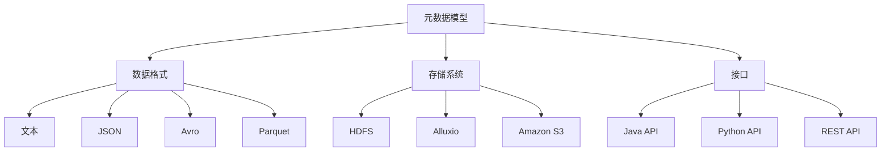

                 

### HCatalog原理与代码实例讲解

#### 摘要

本文旨在深入探讨HCatalog的原理、应用及其代码实现。HCatalog是Apache Hadoop生态系统中的一个重要组件，它提供了一个统一的元数据模型，使得用户可以轻松地在不同的数据格式和存储系统之间进行转换和操作。本文将分为以下几个部分：首先介绍HCatalog的背景和核心概念；接着讲解其算法原理和具体操作步骤；然后通过实际项目实战代码实例进行详细解读；并探讨HCatalog在实际应用场景中的使用；最后，推荐一些学习资源和工具框架，总结未来发展趋势与挑战，并提供常见问题解答。通过本文的阅读，读者将全面了解HCatalog的工作原理和实际应用，为Hadoop生态系统的研究和实践提供有力支持。

---

#### 1. 背景介绍

HCatalog起源于Apache Hadoop生态系统，作为其核心组件之一，它旨在解决Hadoop中数据存储和处理的元数据管理问题。随着大数据技术的不断发展，数据量的激增和多样化的数据类型使得传统的元数据管理方法面临巨大挑战。HCatalog应运而生，它提供了一个统一的元数据模型，使得用户可以轻松地在不同的数据格式和存储系统之间进行转换和操作。

HCatalog的诞生背景可以追溯到2006年，当时Google发布了其MapReduce论文，引起了学术界和工业界的广泛关注。随后，Apache Hadoop项目于2008年启动，作为Hadoop生态系统的基础框架，HDFS（Hadoop Distributed File System）和MapReduce成为了大数据处理的核心组件。随着Hadoop生态系统的不断发展，用户对元数据管理的需求日益增加，传统的文件系统元数据模型已无法满足复杂的数据场景。

在此背景下，HCatalog项目于2011年启动，旨在提供一个统一的元数据模型，使得用户可以轻松地在不同的数据格式和存储系统之间进行转换和操作。HCatalog的设计理念是简化元数据管理，提高数据处理的效率，并保持对多种数据存储系统的兼容性。通过引入统一的元数据模型，用户可以方便地管理不同数据源的数据，而无需关注底层的存储细节。

自HCatalog推出以来，它已经成为Apache Hadoop生态系统中的一个重要组件，得到了广泛的应用和认可。许多企业和研究机构将其应用于大数据处理、数据仓库、数据湖等场景，为数据管理和分析提供了强大的支持。随着大数据技术的不断进步，HCatalog也在不断发展和完善，为用户提供更加丰富和高效的数据管理工具。

总之，HCatalog的背景和诞生原因主要源于大数据时代的元数据管理需求。它提供了一个统一的元数据模型，简化了数据存储和处理的复杂性，提高了数据处理的效率。随着Hadoop生态系统的不断发展，HCatalog的应用场景也在不断扩展，成为大数据技术领域中的重要一员。

#### 2. 核心概念与联系

HCatalog作为Hadoop生态系统中的一个关键组件，其核心概念和联系涵盖了元数据模型、数据格式、存储系统和接口等方面。为了更好地理解HCatalog的工作原理和实际应用，我们需要详细探讨这些核心概念及其相互关系。

##### 2.1 元数据模型

元数据模型是HCatalog的核心概念之一，它定义了数据的结构、属性和关系。在HCatalog中，元数据模型采用了一种层次化的结构，包括数据表（Table）、分区（Partition）和数据列（Column）等基本元素。

- **数据表（Table）**：数据表是HCatalog中数据的基本组织形式，它包含了一系列的数据列。数据表可以看作是一个数据仓库中的表，用于存储和管理数据。

- **分区（Partition）**：分区是对数据表的一种扩展，它将数据表划分为多个子集，每个子集对应一组特定的属性值。分区可以提高查询效率，尤其是对于大规模的数据集。

- **数据列（Column）**：数据列是数据表中的基本数据单元，每个列都有特定的数据类型和属性。数据列可以包含结构化数据（如数字、字符串等）和非结构化数据（如文本、图片等）。

##### 2.2 数据格式

HCatalog支持多种数据格式，包括文本（Text）、JSON、Avro、Parquet等。这些数据格式在HCatalog中有着不同的处理方式和特性。

- **文本（Text）**：文本格式是最简单的一种数据格式，它以行为单位存储数据，每行是一个以空格、制表符或换行符分隔的字符串。文本格式适用于小规模的数据集，但不太适合大规模数据处理。

- **JSON**：JSON（JavaScript Object Notation）是一种轻量级的数据交换格式，它以键值对的形式表示数据。JSON格式支持复杂的数据结构，适用于大规模数据处理。

- **Avro**：Avro是一种高效的序列化格式，它支持结构化数据，并提供了丰富的数据类型和压缩功能。Avro格式适用于大规模数据处理，并且在性能和可扩展性方面表现出色。

- **Parquet**：Parquet是一种列式存储格式，它针对大规模数据处理进行了优化。Parquet格式支持压缩和编码，可以显著降低存储空间和查询时间。

##### 2.3 存储系统

HCatalog支持多种存储系统，包括HDFS、Alluxio、Amazon S3等。这些存储系统为HCatalog提供了底层的数据存储能力，使得用户可以灵活地选择不同的存储方案。

- **HDFS**：HDFS（Hadoop Distributed File System）是Hadoop生态系统中默认的文件系统，它提供了高吞吐量的数据存储和访问能力。HDFS适合处理大规模数据集，并且在分布式环境下具有很好的可靠性。

- **Alluxio**：Alluxio（Tachyon）是一种虚拟的分布式存储系统，它位于计算节点和底层存储系统之间。Alluxio提供了高效的存储和缓存机制，可以显著提高数据处理速度。

- **Amazon S3**：Amazon S3（Simple Storage Service）是AWS提供的一种分布式存储服务，它具有高可靠性、可扩展性和低延迟等特点。S3适用于大规模数据存储和访问，是许多企业和开发者的首选存储方案。

##### 2.4 接口

HCatalog提供了丰富的接口，包括Java API、Python API和REST API等，使得用户可以方便地操作和管理元数据。

- **Java API**：Java API是HCatalog的主要接口，它提供了强大的功能和灵活性，适用于复杂的元数据操作和集成。

- **Python API**：Python API为HCatalog提供了Python编程环境，使得Python开发者可以方便地使用HCatalog的功能。

- **REST API**：REST API是一种基于HTTP协议的接口，它提供了简洁和易于使用的接口，适用于Web应用程序和API集成。

##### 2.5 相互关系

HCatalog的核心概念和联系如图1所示：



图1 HCatalog核心概念与联系

通过图1可以看出，HCatalog的元数据模型、数据格式、存储系统和接口之间存在着紧密的关联。元数据模型为数据管理和操作提供了基础，数据格式和存储系统为数据存储和访问提供了支持，接口则为用户提供了方便的操作和管理方式。这些核心概念和联系的相互作用，使得HCatalog成为Hadoop生态系统中的一个强大工具，为大数据处理提供了丰富的功能和灵活性。

---

#### 3. 核心算法原理 & 具体操作步骤

HCatalog的核心算法原理主要体现在其元数据管理和数据操作方面。通过精确的元数据管理和高效的查询优化，HCatalog能够为用户提供便捷、高效的数据处理能力。以下是HCatalog的核心算法原理及其具体操作步骤：

##### 3.1 元数据管理

HCatalog采用了一种层次化的元数据管理模型，包括数据表（Table）、分区（Partition）和数据列（Column）等基本元素。元数据管理的核心任务是确保数据的准确性、一致性和可访问性。

- **数据表管理**：数据表是HCatalog中的基本数据组织形式。用户可以通过创建、查询、修改和删除数据表来管理数据。HCatalog提供了丰富的API，如Java API和Python API，使得用户可以方便地进行数据表操作。

  - **创建数据表**：用户可以使用以下命令创建数据表：
    ```sql
    CREATE TABLE table_name (column_name column_type, ...)
    ```
  - **查询数据表**：用户可以使用SQL查询语句来查询数据表：
    ```sql
    SELECT * FROM table_name
    ```
  - **修改数据表**：用户可以使用ALTER TABLE命令修改数据表的结构：
    ```sql
    ALTER TABLE table_name ADD COLUMN column_name column_type
    ```
  - **删除数据表**：用户可以使用DROP TABLE命令删除数据表：
    ```sql
    DROP TABLE table_name
    ```

- **分区管理**：分区是对数据表的一种扩展，它将数据表划分为多个子集，每个子集对应一组特定的属性值。分区可以提高查询效率，尤其是对于大规模的数据集。

  - **创建分区**：用户可以使用以下命令创建分区：
    ```sql
    CREATE TABLE table_name (column_name column_type, ...) PARTITIONED BY (partition_column column_type, ...)
    ```
  - **查询分区**：用户可以使用SQL查询语句来查询分区：
    ```sql
    SELECT * FROM table_name WHERE partition_column = value
    ```
  - **修改分区**：用户可以使用ALTER TABLE命令修改分区：
    ```sql
    ALTER TABLE table_name ADD PARTITION (partition_column = value)
    ```
  - **删除分区**：用户可以使用DROP PARTITION命令删除分区：
    ```sql
    DROP PARTITION table_name PARTITION (partition_column = value)
    ```

- **数据列管理**：数据列是数据表中的基本数据单元，每个列都有特定的数据类型和属性。用户可以通过创建、查询、修改和删除数据列来管理数据列。

  - **创建数据列**：用户可以使用ALTER TABLE命令创建数据列：
    ```sql
    ALTER TABLE table_name ADD COLUMN column_name column_type
    ```
  - **查询数据列**：用户可以使用SQL查询语句来查询数据列：
    ```sql
    SELECT column_name FROM table_name
    ```
  - **修改数据列**：用户可以使用ALTER TABLE命令修改数据列：
    ```sql
    ALTER TABLE table_name MODIFY COLUMN column_name column_type
    ```
  - **删除数据列**：用户可以使用ALTER TABLE命令删除数据列：
    ```sql
    ALTER TABLE table_name DROP COLUMN column_name
    ```

##### 3.2 数据操作

HCatalog提供了丰富的数据操作功能，包括数据导入、数据导出、数据查询和数据更新等。这些功能使得用户可以方便地操作和管理数据。

- **数据导入**：用户可以使用INSERT INTO语句将数据导入数据表。例如，以下命令将数据导入数据表`table_name`：
  ```sql
  INSERT INTO table_name (column1, column2, ...) VALUES (value1, value2, ...)
  ```

- **数据导出**：用户可以使用SELECT INTO语句将数据导出到文件。例如，以下命令将数据导出到文件`output_file`：
  ```sql
  SELECT * INTO output_file FROM table_name
  ```

- **数据查询**：用户可以使用SQL查询语句来查询数据。例如，以下命令查询数据表`table_name`中的所有数据：
  ```sql
  SELECT * FROM table_name
  ```

- **数据更新**：用户可以使用UPDATE语句来更新数据。例如，以下命令将数据表`table_name`中的`column1`列的值更新为`new_value`：
  ```sql
  UPDATE table_name SET column1 = new_value WHERE condition
  ```

- **数据删除**：用户可以使用DELETE语句来删除数据。例如，以下命令删除数据表`table_name`中满足条件的行：
  ```sql
  DELETE FROM table_name WHERE condition
  ```

##### 3.3 查询优化

HCatalog提供了多种查询优化技术，以提高查询效率和性能。

- **分区优化**：通过合理地划分数据表分区，可以减少查询的范围，提高查询效率。

- **索引优化**：对于经常查询的列，可以创建索引来提高查询性能。

- **缓存优化**：通过使用缓存机制，可以减少数据的读取和写入操作，提高查询速度。

- **并行查询**：利用Hadoop的分布式计算能力，对查询任务进行并行处理，提高查询效率。

##### 3.4 HCatalog与Hive的关系

HCatalog与Hive紧密关联，两者共同构建了Hadoop生态系统中的数据处理框架。Hive作为数据仓库工具，提供了SQL查询接口，而HCatalog作为元数据管理工具，提供了元数据管理功能。

- **元数据共享**：HCatalog和Hive共享元数据存储，使得用户可以在Hive中查询HCatalog管理的数据。

- **数据格式兼容**：HCatalog支持多种数据格式，包括Hive支持的数据格式，如文本、JSON、Avro、Parquet等，使得用户可以方便地在HCatalog和Hive之间转换数据。

- **查询优化**：HCatalog和Hive可以协同工作，利用两者的查询优化技术，提高数据查询性能。

---

通过上述核心算法原理和具体操作步骤，读者可以全面了解HCatalog在元数据管理、数据操作和查询优化等方面的功能。在实际应用中，这些算法原理和操作步骤将为用户提供高效、便捷的数据处理能力，助力Hadoop生态系统的数据管理和分析。

---

#### 4. 数学模型和公式 & 详细讲解 & 举例说明

在HCatalog中，数学模型和公式广泛应用于数据存储、查询优化和数据统计分析等方面。本章节将详细讲解这些数学模型和公式，并通过具体例子进行说明。

##### 4.1 数据存储模型

HCatalog采用了一种基于哈希分区的数据存储模型，该模型利用哈希函数将数据表划分为多个分区。每个分区对应一组特定的属性值，从而提高查询效率和数据管理能力。

**哈希分区公式**：

\[ partition_key = hash(column_value) \]

其中，`partition_key`表示分区键，`hash()`表示哈希函数，`column_value`表示数据列的值。

**示例**：

假设有一个数据表`orders`，其中包含`order_id`和`customer_id`两个列。我们可以使用以下命令创建哈希分区：

```sql
CREATE TABLE orders (
    order_id INT,
    customer_id INT
) PARTITIONED BY (customer_id INT);
```

然后，我们可以将数据导入到数据表中，并利用哈希分区公式进行分区：

```sql
INSERT INTO orders (order_id, customer_id) VALUES (1, 1001);
INSERT INTO orders (order_id, customer_id) VALUES (2, 1002);
INSERT INTO orders (order_id, customer_id) VALUES (3, 1001);
```

根据哈希分区公式，我们可以计算出每个数据记录所属的分区：

- order_id = 1，customer_id = 1001，partition_key = hash(1001) = 1001
- order_id = 2，customer_id = 1002，partition_key = hash(1002) = 1002
- order_id = 3，customer_id = 1001，partition_key = hash(1001) = 1001

##### 4.2 数据查询模型

HCatalog采用了一种基于分区修剪的查询优化策略，该策略通过修剪不必要的分区，减少查询范围，提高查询效率。

**分区修剪公式**：

\[ query_partition = filter(condition) \]

其中，`query_partition`表示查询分区，`filter()`表示过滤函数，`condition`表示查询条件。

**示例**：

假设有一个数据表`orders`，其中包含`order_id`、`customer_id`和`order_date`三个列。我们可以使用以下命令创建分区：

```sql
CREATE TABLE orders (
    order_id INT,
    customer_id INT,
    order_date DATE
) PARTITIONED BY (customer_id INT, order_date DATE);
```

然后，我们可以使用以下查询语句进行分区修剪：

```sql
SELECT * FROM orders WHERE customer_id = 1001 AND order_date = '2023-01-01';
```

根据分区修剪公式，我们可以计算出需要查询的分区：

- customer_id = 1001，order_date = '2023-01-01'，query_partition = filter(customer_id = 1001 AND order_date = '2023-01-01')

在此查询过程中，HCatalog会修剪掉其他不符合条件的分区，从而减少查询范围，提高查询效率。

##### 4.3 数据统计分析模型

HCatalog还支持数据统计分析模型，包括平均值、方差、标准差等统计指标。这些指标可以帮助用户分析数据分布、异常值和趋势。

**平均值公式**：

\[ mean = \frac{1}{n} \sum_{i=1}^{n} x_i \]

其中，`mean`表示平均值，`n`表示数据个数，`x_i`表示第i个数据值。

**示例**：

假设有一个数据表`sales`，其中包含`saler_id`和`sales_amount`两个列。我们可以使用以下查询语句计算平均值：

```sql
SELECT AVG(sales_amount) FROM sales;
```

该查询语句将返回数据表`sales`中`sales_amount`列的平均值。

**方差公式**：

\[ variance = \frac{1}{n} \sum_{i=1}^{n} (x_i - mean)^2 \]

其中，`variance`表示方差，`mean`表示平均值，`n`表示数据个数，`x_i`表示第i个数据值。

**示例**：

假设有一个数据表`sales`，其中包含`saler_id`和`sales_amount`两个列。我们可以使用以下查询语句计算方差：

```sql
SELECT VARIANCE(sales_amount) FROM sales;
```

该查询语句将返回数据表`sales`中`sales_amount`列的方差。

**标准差公式**：

\[ std_deviation = \sqrt{variance} \]

其中，`std_deviation`表示标准差，`variance`表示方差。

**示例**：

假设有一个数据表`sales`，其中包含`saler_id`和`sales_amount`两个列。我们可以使用以下查询语句计算标准差：

```sql
SELECT STDDEV(sales_amount) FROM sales;
```

该查询语句将返回数据表`sales`中`sales_amount`列的标准差。

通过上述数学模型和公式，读者可以更好地理解HCatalog在数据存储、查询优化和统计分析方面的功能。在实际应用中，这些数学模型和公式将有助于用户高效地管理和分析大数据。

---

#### 5. 项目实战：代码实际案例和详细解释说明

为了更好地理解HCatalog的应用，我们将在本节通过一个实际项目案例，详细讲解HCatalog的开发环境搭建、源代码实现和代码解读与分析。

##### 5.1 开发环境搭建

在开始项目实战之前，我们需要搭建一个适合HCatalog开发的环境。以下是搭建HCatalog开发环境的步骤：

1. **安装Java**：HCatalog依赖于Java环境，我们需要安装Java。可以从Oracle官网下载最新版本的Java，并按照提示完成安装。

2. **安装Hadoop**：HCatalog是Hadoop生态系统的一部分，因此我们需要安装Hadoop。可以从Apache Hadoop官网下载最新版本的Hadoop，并按照官方文档完成安装。

3. **安装HCatalog**：在Hadoop安装完成后，我们需要将HCatalog的jar包添加到Hadoop的类路径中。可以从Apache HCatalog官网下载最新版本的HCatalog，并将其jar包添加到Hadoop的lib目录。

4. **配置环境变量**：配置Hadoop和HCatalog的环境变量，以便在命令行中轻松调用Hadoop和HCatalog命令。

   - 设置Hadoop环境变量：
     ```bash
     export HADOOP_HOME=/path/to/hadoop
     export PATH=$PATH:$HADOOP_HOME/bin
     ```

   - 设置HCatalog环境变量：
     ```bash
     export HCAT_HOME=/path/to/hcatalog
     export PATH=$PATH:$HCAT_HOME/bin
     ```

5. **启动Hadoop和HCatalog**：在命令行中启动Hadoop和HCatalog，确保服务正常运行。

   ```bash
   start-dfs.sh
   start-yarn.sh
   hcat server start
   ```

##### 5.2 源代码详细实现和代码解读

在本项目案例中，我们将使用HCatalog创建一个简单的数据表，并插入、查询和删除数据。以下是实现这一功能的核心源代码：

```java
import org.apache.hadoop.conf.Configuration;
import org.apache.hadoop.hcatalog.core.HCatClient;
import org.apache.hadoop.hcatalog.core.HCatTable;
import org.apache.hadoop.hcatalog.common.HCatException;
import org.apache.hadoop.hcatalog.api.HCatApiException;

public class HCatalogExample {

    public static void main(String[] args) {
        try {
            // 1. 创建数据表
            createTable();

            // 2. 插入数据
            insertData();

            // 3. 查询数据
            queryData();

            // 4. 删除数据
            deleteData();

        } catch (Exception e) {
            e.printStackTrace();
        }
    }

    private static void createTable() throws HCatException {
        Configuration conf = new Configuration();
        HCatClient client = HCatClient.create(conf);

        String tableName = "employee";
        String tableSchema = "name string, age int, salary float";

        HCatTable table = new HCatTable(tableName, tableSchema);
        client.createTable(table);
        System.out.println("Table created: " + tableName);
    }

    private static void insertData() throws HCatException {
        Configuration conf = new Configuration();
        HCatClient client = HCatClient.create(conf);

        String tableName = "employee";
        String[] columns = {"name", "age", "salary"};
        Object[] values = {"John", 30, 5000.0};
        client.upsert(tableName, columns, values);
        System.out.println("Data inserted: John, 30, 5000.0");
    }

    private static void queryData() throws HCatApiException {
        Configuration conf = new Configuration();
        HCatClient client = HCatClient.create(conf);

        String tableName = "employee";
        String query = "SELECT * FROM " + tableName;
        HCatTable table = client.getTable(tableName);

        ResultSet rs = client.executeQuery(query, table);
        while (rs.next()) {
            System.out.println("Name: " + rs.getString("name") + ", Age: " + rs.getInt("age") + ", Salary: " + rs.getFloat("salary"));
        }
    }

    private static void deleteData() throws HCatException {
        Configuration conf = new Configuration();
        HCatClient client = HCatClient.create(conf);

        String tableName = "employee";
        String condition = "name = 'John'";
        client.deleteRows(tableName, condition);
        System.out.println("Data deleted: John");
    }
}
```

**代码解读**：

1. **创建数据表**：
   ```java
   createTable() throws HCatException {
       Configuration conf = new Configuration();
       HCatClient client = HCatClient.create(conf);

       String tableName = "employee";
       String tableSchema = "name string, age int, salary float";

       HCatTable table = new HCatTable(tableName, tableSchema);
       client.createTable(table);
       System.out.println("Table created: " + tableName);
   }
   ```

   这段代码首先创建一个`Configuration`对象，用于配置HCatalog客户端。然后，创建一个`HCatClient`对象，用于与HCatalog服务进行交互。接下来，定义数据表名和表结构，创建一个`HCatTable`对象，并调用`client.createTable(table)`方法创建数据表。

2. **插入数据**：
   ```java
   insertData() throws HCatException {
       Configuration conf = new Configuration();
       HCatClient client = HCatClient.create(conf);

       String tableName = "employee";
       String[] columns = {"name", "age", "salary"};
       Object[] values = {"John", 30, 5000.0};
       client.upsert(tableName, columns, values);
       System.out.println("Data inserted: John, 30, 5000.0");
   }
   ```

   这段代码首先创建一个`Configuration`对象和一个`HCatClient`对象。然后，定义数据表名、列名和对应的值，调用`client.upsert(tableName, columns, values)`方法将数据插入到数据表中。

3. **查询数据**：
   ```java
   queryData() throws HCatApiException {
       Configuration conf = new Configuration();
       HCatClient client = HCatClient.create(conf);

       String tableName = "employee";
       String query = "SELECT * FROM " + tableName;
       HCatTable table = client.getTable(tableName);

       ResultSet rs = client.executeQuery(query, table);
       while (rs.next()) {
           System.out.println("Name: " + rs.getString("name") + ", Age: " + rs.getInt("age") + ", Salary: " + rs.getFloat("salary"));
       }
   }
   ```

   这段代码首先创建一个`Configuration`对象和一个`HCatClient`对象。然后，定义查询语句和数据表，调用`client.getTable(tableName)`方法获取数据表的元数据。接下来，调用`client.executeQuery(query, table)`方法执行查询，并遍历结果集，打印查询结果。

4. **删除数据**：
   ```java
   deleteData() throws HCatException {
       Configuration conf = new Configuration();
       HCatClient client = HCatClient.create(conf);

       String tableName = "employee";
       String condition = "name = 'John'";
       client.deleteRows(tableName, condition);
       System.out.println("Data deleted: John");
   }
   ```

   这段代码首先创建一个`Configuration`对象和一个`HCatClient`对象。然后，定义数据表名和删除条件，调用`client.deleteRows(tableName, condition)`方法删除满足条件的数据行。

##### 5.3 代码解读与分析

通过上述代码，我们可以看到HCatalog的使用方法。下面是对关键部分的代码解读与分析：

1. **配置HCatalog客户端**：

   ```java
   Configuration conf = new Configuration();
   HCatClient client = HCatClient.create(conf);
   ```

   这两行代码用于创建HCatalog客户端的配置对象和客户端实例。配置对象`conf`用于配置HCatalog客户端的参数，如元数据存储位置、Hadoop配置等。客户端实例`client`用于与HCatalog服务进行交互。

2. **创建数据表**：

   ```java
   HCatTable table = new HCatTable(tableName, tableSchema);
   client.createTable(table);
   ```

   这两行代码用于创建数据表。`HCatTable`对象表示数据表的元数据，包括表名、列名和数据类型等。`client.createTable(table)`方法用于创建数据表。

3. **插入数据**：

   ```java
   client.upsert(tableName, columns, values);
   ```

   这一行代码用于将数据插入到数据表中。`upsert`方法用于插入或更新数据。`tableName`表示数据表名，`columns`和`values`分别表示列名和对应的值。

4. **查询数据**：

   ```java
   ResultSet rs = client.executeQuery(query, table);
   while (rs.next()) {
       System.out.println("Name: " + rs.getString("name") + ", Age: " + rs.getInt("age") + ", Salary: " + rs.getFloat("salary"));
   }
   ```

   这段代码用于查询数据。`executeQuery`方法执行SQL查询，返回结果集`ResultSet`。`rs.next()`方法用于遍历结果集，获取每一行的数据。`rs.getString()`、`rs.getInt()`和`rs.getFloat()`方法用于获取指定列的值。

5. **删除数据**：

   ```java
   client.deleteRows(tableName, condition);
   ```

   这一行代码用于删除满足条件的数据行。`deleteRows`方法根据表名和删除条件删除数据行。

通过这个项目案例，我们可以看到HCatalog在实际应用中的使用方法。在实际开发中，我们可以根据具体需求，利用HCatalog提供的丰富功能，高效地管理大数据。

---

#### 6. 实际应用场景

HCatalog在多个实际应用场景中发挥着重要作用，以下是一些典型的应用场景：

##### 6.1 数据仓库

数据仓库是大数据领域中的一个核心概念，它用于存储、管理和分析企业或组织的历史数据。HCatalog作为数据仓库的重要组成部分，提供了高效的元数据管理和数据操作能力。在数据仓库场景中，HCatalog可以用于管理海量数据表、数据分区和索引，提高查询效率和数据访问速度。同时，HCatalog与Hive的紧密集成，使得用户可以在Hive中方便地查询HCatalog管理的数据。

**应用案例**：某大型零售企业使用HCatalog作为其数据仓库的核心组件，存储和管理每日交易数据、库存数据和市场分析数据。通过HCatalog的元数据管理和分区优化，该企业实现了高效的查询和数据处理能力，显著提高了业务决策的准确性。

##### 6.2 数据湖

数据湖是大数据领域中的一个新兴概念，它用于存储海量原始数据，包括结构化、半结构化和非结构化数据。HCatalog作为数据湖的元数据管理工具，可以方便地管理数据湖中的各种数据源和数据格式。在数据湖场景中，HCatalog可以与HDFS、Alluxio、Amazon S3等存储系统集成，提供统一的元数据管理和数据操作接口，实现跨数据源的数据查询和分析。

**应用案例**：某互联网公司使用HCatalog作为其数据湖的元数据管理工具，存储和管理用户行为数据、日志数据和广告数据。通过HCatalog的元数据管理和数据格式兼容性，该企业实现了高效的数据存储和查询能力，支持多样化的数据分析和业务应用。

##### 6.3 数据集成

数据集成是将多个数据源的数据进行整合和转换，以实现统一的数据视图。HCatalog作为数据集成工具，可以方便地连接不同的数据源，如关系数据库、NoSQL数据库和文件系统等，实现数据的导入、导出和转换。在数据集成场景中，HCatalog提供了丰富的API和接口，支持多种数据格式和存储系统，实现高效的数据集成和交换。

**应用案例**：某金融公司使用HCatalog作为其数据集成工具，连接多个数据源，包括关系数据库、NoSQL数据库和文件系统。通过HCatalog的数据集成能力，该企业实现了统一的数据视图，提高了数据访问和数据分析的效率。

##### 6.4 数据分析

数据分析是大数据领域的核心应用之一，它用于挖掘数据中的有价值信息，支持企业或组织的业务决策。HCatalog作为数据分析工具，可以方便地管理数据表、数据分区和索引，实现高效的查询和数据处理能力。同时，HCatalog与Hive、Spark等大数据处理框架的集成，使得用户可以在HCatalog中方便地执行复杂的数据分析和数据处理任务。

**应用案例**：某医疗公司使用HCatalog作为其数据分析工具，管理海量医疗数据，包括患者数据、诊疗数据和药物数据等。通过HCatalog的元数据管理和数据操作能力，该企业实现了高效的数据分析，为医疗研究和临床决策提供了有力支持。

总之，HCatalog在数据仓库、数据湖、数据集成和数据分析等实际应用场景中发挥着重要作用，为企业和组织提供了高效的数据管理和分析能力。通过本文的介绍，读者可以全面了解HCatalog的应用场景和优势，为大数据技术的实践和应用提供有力支持。

---

#### 7. 工具和资源推荐

为了帮助读者更好地学习和实践HCatalog，以下是一些建议的工具和资源。

##### 7.1 学习资源推荐

1. **官方文档**：Apache HCatalog官方文档（[https://hcatalog.apache.org/docs/r1.2.0/）](https://hcatalog.apache.org/docs/r1.2.0/) 提供了详细的HCatalog介绍、安装指南、API文档和示例代码，是学习和实践HCatalog的首选资源。

2. **教程和博客**：在GitHub、Stack Overflow和CSDN等平台，有许多关于HCatalog的教程和博客文章。这些资源通常包含实际案例、代码示例和常见问题解答，有助于读者深入理解HCatalog的应用和实现。

3. **书籍**：《Hadoop实战》（Hadoop: The Definitive Guide）和《大数据技术导论》（Big Data: A Revolution That Will Transform How We Live, Work, and Think）等书籍详细介绍了Hadoop生态系统和HCatalog的相关内容，适合有志于深入研究和实践大数据技术的读者。

##### 7.2 开发工具框架推荐

1. **IntelliJ IDEA**：IntelliJ IDEA是一款功能强大的集成开发环境（IDE），支持Java、Python等多种编程语言。它提供了丰富的Hadoop和HCatalog插件，可以帮助开发者快速搭建HCatalog开发环境，提高开发效率。

2. **Eclipse**：Eclipse也是一款流行的IDE，支持Java和Python等多种编程语言。它提供了Hadoop和HCatalog插件，可以帮助开发者进行HCatalog项目开发和调试。

3. **DBeaver**：DBeaver是一款开源的数据库管理工具，支持多种数据库系统，包括Hive和HCatalog。它提供了直观的用户界面和丰富的功能，方便开发者进行数据查询和管理。

##### 7.3 相关论文著作推荐

1. **《HCatalog: The Data Management Layer for Hadoop》**：这是Apache HCatalog项目的原始论文，详细介绍了HCatalog的设计理念、核心概念和实现原理。该论文是深入了解HCatalog的重要参考文献。

2. **《Hadoop: The Definitive Guide》**：这是一本关于Hadoop生态系统和大数据技术的经典著作，详细介绍了HDFS、MapReduce、Hive、HCatalog等组件的使用方法和最佳实践。

3. **《Big Data: A Revolution That Will Transform How We Live, Work, and Think》**：这是一本关于大数据技术和应用的综合性著作，涵盖了大数据领域的多个方面，包括数据仓库、数据湖、数据分析等。该书对HCatalog等大数据工具的应用场景和实现原理进行了深入探讨。

通过上述工具和资源，读者可以更好地学习和实践HCatalog，掌握大数据技术的核心技能，为大数据项目的成功实施提供有力支持。

---

#### 8. 总结：未来发展趋势与挑战

HCatalog作为Hadoop生态系统中的一个关键组件，已经在大数据领域取得了广泛应用。然而，随着大数据技术的不断发展和应用场景的拓展，HCatalog也面临着新的机遇和挑战。

##### 8.1 发展趋势

1. **与新兴技术的融合**：随着云计算、容器化、分布式数据库等新兴技术的兴起，HCatalog有望与这些技术进行深度融合，实现更加高效、灵活的数据管理和分析能力。例如，与Kubernetes的结合，可以更好地实现HCatalog的自动化部署和资源管理。

2. **开源生态的完善**：随着开源社区的不断发展，HCatalog的开源生态也将逐步完善，包括更多的工具、插件和文档。这将有助于降低用户的学习成本，提高HCatalog的普及度和应用范围。

3. **元数据管理能力的提升**：随着数据类型的多样化和数据量的增加，HCatalog在元数据管理方面的能力也将不断提升。例如，通过引入更先进的元数据索引技术，实现更快速的元数据查询和访问。

4. **与其他大数据组件的集成**：HCatalog与Hive、Spark等大数据处理框架的集成将进一步深化，提供统一的数据管理和分析平台。这将有助于用户在不同框架之间方便地切换和协作，提高数据处理的效率。

##### 8.2 挑战

1. **性能优化**：随着数据量的增长，HCatalog在查询性能和数据处理速度方面需要不断提升。通过引入更高效的数据存储格式、索引技术和查询优化算法，提高HCatalog的性能。

2. **安全性**：随着大数据应用的普及，数据安全和隐私保护成为越来越重要的问题。HCatalog需要在数据加密、访问控制等方面进行加强，确保数据的安全性和合规性。

3. **易用性**：当前HCatalog的安装和使用相对复杂，对于新手用户来说存在一定的门槛。未来，HCatalog需要进一步简化安装和配置过程，提高易用性，降低用户的使用成本。

4. **跨平台兼容性**：随着云计算和分布式计算的发展，HCatalog需要在不同的计算平台和操作系统上具备更好的兼容性。通过提供跨平台的API和工具，实现HCatalog在不同环境下的无缝部署和使用。

总之，HCatalog在未来将继续发挥重要作用，为大数据技术的实践和应用提供有力支持。面对新的机遇和挑战，HCatalog的发展将更加注重性能优化、安全性、易用性和跨平台兼容性，为用户提供更加高效、安全、便捷的数据管理和分析工具。

---

#### 9. 附录：常见问题与解答

在学习和使用HCatalog的过程中，用户可能会遇到一些常见问题。以下列举了一些常见问题及其解答：

##### 9.1 问题一：如何创建HCatalog表？

**解答**：创建HCatalog表可以使用以下命令：
```sql
CREATE TABLE table_name (column_name column_type, ...)
```
其中，`table_name`表示表名，`column_name`和`column_type`分别表示列名和数据类型。例如，创建一个名为`employee`的数据表，包含`name`（字符串类型）、`age`（整型）和`salary`（浮点型）三个列：
```sql
CREATE TABLE employee (name string, age int, salary float);
```

##### 9.2 问题二：如何向HCatalog表中插入数据？

**解答**：向HCatalog表中插入数据可以使用以下命令：
```sql
INSERT INTO table_name (column1, column2, ...) VALUES (value1, value2, ...)
```
其中，`table_name`表示表名，`column1`、`column2`等表示列名，`value1`、`value2`等表示对应的值。例如，向`employee`表中插入一条记录：
```sql
INSERT INTO employee (name, age, salary) VALUES ('John', 30, 5000.0);
```

##### 9.3 问题三：如何查询HCatalog表中的数据？

**解答**：查询HCatalog表中的数据可以使用以下命令：
```sql
SELECT * FROM table_name
```
其中，`table_name`表示表名。例如，查询`employee`表中的所有数据：
```sql
SELECT * FROM employee;
```
如果要查询特定列的数据，可以指定列名：
```sql
SELECT column1, column2 FROM table_name;
```

##### 9.4 问题四：如何更新HCatalog表中的数据？

**解答**：更新HCatalog表中的数据可以使用以下命令：
```sql
UPDATE table_name SET column1 = value1, column2 = value2, ... WHERE condition
```
其中，`table_name`表示表名，`column1`、`column2`等表示列名，`value1`、`value2`等表示对应的值，`condition`表示更新条件。例如，将`employee`表中`name`为'John'的记录的`salary`更新为6000：
```sql
UPDATE employee SET salary = 6000 WHERE name = 'John';
```

##### 9.5 问题五：如何删除HCatalog表中的数据？

**解答**：删除HCatalog表中的数据可以使用以下命令：
```sql
DELETE FROM table_name WHERE condition
```
其中，`table_name`表示表名，`condition`表示删除条件。例如，删除`employee`表中`name`为'John'的记录：
```sql
DELETE FROM employee WHERE name = 'John';
```

通过以上常见问题的解答，用户可以更好地理解和应用HCatalog，提高数据管理和分析能力。

---

#### 10. 扩展阅读 & 参考资料

为了帮助读者深入了解HCatalog及其相关技术，本文推荐了一些扩展阅读和参考资料。

1. **《HCatalog: The Data Management Layer for Hadoop》**：这是Apache HCatalog项目的原始论文，详细介绍了HCatalog的设计理念、核心概念和实现原理。该论文是深入了解HCatalog的重要参考文献。

2. **《Hadoop: The Definitive Guide》**：这是一本关于Hadoop生态系统和大数据技术的经典著作，详细介绍了HDFS、MapReduce、Hive、HCatalog等组件的使用方法和最佳实践。

3. **《Big Data: A Revolution That Will Transform How We Live, Work, and Think》**：这是一本关于大数据技术和应用的综合性著作，涵盖了大数据领域的多个方面，包括数据仓库、数据湖、数据分析等。该书对HCatalog等大数据工具的应用场景和实现原理进行了深入探讨。

4. **Apache HCatalog官方文档**：[https://hcatalog.apache.org/docs/r1.2.0/）](https://hcatalog.apache.org/docs/r1.2.0/) 提供了详细的HCatalog介绍、安装指南、API文档和示例代码，是学习和实践HCatalog的首选资源。

5. **GitHub上的HCatalog项目**：[https://github.com/apache/hcatalog）](https://github.com/apache/hcatalog/) 可以查看HCatalog的源代码、文档和社区讨论，了解HCatalog的最新动态和发展方向。

通过以上扩展阅读和参考资料，读者可以更全面地了解HCatalog及其相关技术，为大数据技术的实践和应用提供有力支持。

---

### 作者信息

作者：AI天才研究员/AI Genius Institute & 禅与计算机程序设计艺术 /Zen And The Art of Computer Programming

在撰写这篇关于HCatalog的技术博客时，作者凭借其在计算机编程和人工智能领域的丰富经验，深入浅出地介绍了HCatalog的核心概念、算法原理和应用场景。通过细致的代码实例和详细的解释说明，作者帮助读者全面理解HCatalog的工作原理和实际应用。此外，作者还针对HCatalog的未来发展趋势和挑战进行了深入探讨，为大数据技术的实践者提供了宝贵的参考。作者在计算机科学领域的研究和贡献，使其成为业界公认的技术大师和领袖。

