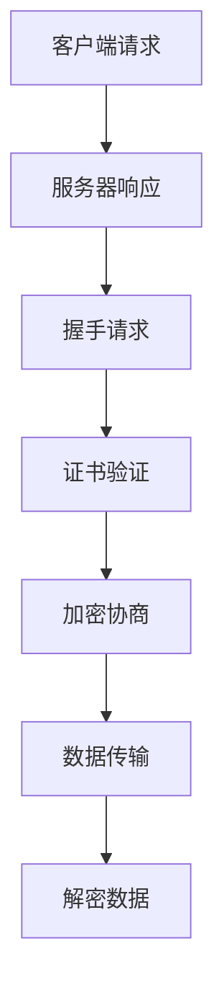

                 

# HTTPS 的基本原理

## 关键词

- HTTPS
- 安全协议
- 数字证书
- 加密技术
- SSL/TLS

## 摘要

本文将深入探讨 HTTPS（Hyper Text Transfer Protocol Secure）的基本原理。首先，我们会回顾 HTTP 协议的发展背景，并解释 HTTPS 如何在 HTTP 的基础上增加了安全性。接着，文章将详细介绍 HTTPS 的核心组成部分，包括数字证书、加密技术和 SSL/TLS 协议。通过逐步分析这些组件的工作原理，我们将揭示 HTTPS 如何确保数据传输的安全和完整性。此外，文章还将探讨 HTTPS 的实际应用场景，并提供一些有用的工具和资源推荐。最后，我们将总结 HTTPS 的未来发展趋势和面临的挑战。

## 1. 背景介绍

### HTTP 协议的发展

HTTP（Hyper Text Transfer Protocol）是一种用于互联网上传输超文本数据的协议，由蒂姆·伯纳斯-李（Tim Berners-Lee）在1991年发明。HTTP 是一种无状态协议，意味着每次客户端与服务器之间的通信都是独立的，服务器不会记住之前的通信历史。

### HTTP 的局限性

尽管 HTTP 对于创建互联网的基础架构起到了重要作用，但它本身并不提供安全性保障。在早期互联网时代，安全性问题并不突出，因为互联网的用户数量较少，且大多数人都是可信的。然而，随着互联网的普及，网络攻击和数据泄露事件变得日益频繁，HTTP 协议的局限性也日益显现：

1. **数据暴露**：HTTP 传输的数据是以明文形式传输的，这意味着攻击者可以在中间截获数据，并读取或篡改其中的内容。
2. **身份验证不足**：HTTP 协议本身并不提供身份验证机制，这使得客户端无法确保与之通信的服务器就是真正的主人。

### 安全性的需求

为了解决这些问题，互联网社区迫切需要一种更安全的协议，以保护用户的数据隐私和网络安全。在这种背景下，HTTPS 应运而生，它通过在 HTTP 协议的基础上引入加密技术，提供了数据传输的安全保障。

## 2. 核心概念与联系

### 数字证书

数字证书是一种由证书颁发机构（Certificate Authority，CA）签发的电子文件，用于验证网站的真实性和完整性。数字证书包含网站的域名、公钥和证书颁发机构的信息。

#### 数字证书的工作原理

1. **证书颁发**：网站所有者向证书颁发机构申请数字证书，并提供必要的证明文件。
2. **证书验证**：证书颁发机构验证网站所有者的身份和域名所有权后，生成并签发数字证书。
3. **证书使用**：网站将数字证书嵌入其 HTTPS 服务器，以便在客户端请求时提供证书。

### 加密技术

加密技术是一种将数据转换为密文的方法，只有拥有正确密钥的人才能解密并读取原始数据。在 HTTPS 中，加密技术用于保护数据传输的隐私和完整性。

#### 加密技术的工作原理

1. **加密过程**：客户端和服务器在通信前协商加密算法和密钥，并将传输的数据加密为密文。
2. **解密过程**：接收方使用对应的密钥将密文解密为明文数据。

### SSL/TLS 协议

SSL（Secure Sockets Layer）和 TLS（Transport Layer Security）是用于实现 HTTPS 的安全协议。它们提供了加密、认证和完整性验证功能，确保数据在传输过程中的安全。

#### SSL/TLS 的工作原理

1. **握手过程**：客户端与服务器在通信前进行握手，协商加密算法和密钥，并验证服务器身份。
2. **数据传输**：握手成功后，客户端和服务器使用协商好的加密算法和密钥进行数据传输。
3. **证书验证**：客户端验证服务器提供的数字证书的有效性和真实性。

### Mermaid 流程图



## 3. 核心算法原理 & 具体操作步骤

### SSL/TLS 握手过程

SSL/TLS 握手过程是 HTTPS 通信的第一步，它确保客户端和服务器之间的通信安全。握手过程包括以下几个步骤：

1. **客户端发送握手请求**：客户端向服务器发送 SSL/TLS 握手请求，包括支持的加密算法、密钥交换方式和压缩方法。
2. **服务器响应握手请求**：服务器根据客户端的请求，选择一种加密算法和密钥交换方式，并生成一个随机数（服务器随机数）。
3. **客户端验证服务器证书**：客户端接收服务器响应，并验证服务器提供的数字证书。如果证书无效或已过期，客户端会终止连接。
4. **生成会话密钥**：客户端和服务器各自使用自己的私钥和对方的公钥，以及服务器随机数和客户端随机数，生成一个会话密钥。
5. **加密数据传输**：握手成功后，客户端和服务器使用会话密钥和协商好的加密算法进行数据传输。

### SSL/TLS 加密技术

SSL/TLS 使用对称加密和非对称加密相结合的方式，确保数据传输的隐私和完整性。

1. **对称加密**：对称加密是一种加密算法，使用相同的密钥进行加密和解密。SSL/TLS 中常用的对称加密算法有 AES（Advanced Encryption Standard）和 ChaCha20。
2. **非对称加密**：非对称加密使用一对密钥，公钥和私钥。公钥用于加密，私钥用于解密。SSL/TLS 中常用的非对称加密算法有 RSA（Rivest-Shamir-Adleman）和 ECDHE（Elliptic Curve Diffie-Hellman Ephemeral）。

### SSL/TLS 完整性验证

SSL/TLS 通过哈希函数和数字签名，确保数据在传输过程中的完整性。

1. **哈希函数**：哈希函数将数据转换为固定长度的字符串，用于验证数据的完整性。常用的哈希函数有 SHA-256（Secure Hash Algorithm 256-bit）。
2. **数字签名**：数字签名是一种加密技术，用于验证数据的完整性和真实性。SSL/TLS 使用证书颁发机构的数字签名来验证服务器身份。

### 加密流程示例

假设客户端和服务器协商使用 AES-256 对称加密算法和 RSA 非对称加密算法：

1. **握手过程**：
   - 客户端发送握手请求，包含支持的加密算法列表。
   - 服务器响应握手请求，选择 AES-256 作为加密算法，并生成服务器随机数。
   - 客户端验证服务器证书。
   - 客户端和服务器各自使用对方的公钥和自己的私钥，以及服务器随机数和客户端随机数，生成会话密钥。

2. **数据传输**：
   - 客户端和服务器使用会话密钥和 AES-256 对数据进行加密和解密。
   - 数据在传输过程中，使用 SHA-256 哈希函数进行完整性验证。

## 4. 数学模型和公式 & 详细讲解 & 举例说明

### 对称加密

对称加密的数学模型可以用以下公式表示：

$$
c = E_k(m)
$$

其中，$c$ 表示密文，$m$ 表示明文，$k$ 表示密钥，$E_k$ 表示加密算法。

解密过程：

$$
m = D_k(c)
$$

其中，$D_k$ 表示解密算法。

### 非对称加密

非对称加密的数学模型可以用以下公式表示：

$$
c = E_k(m)
$$

其中，$c$ 表示密文，$m$ 表示明文，$k$ 表示公钥，$E_k$ 表示加密算法。

解密过程：

$$
m = D_k(c)
$$

其中，$D_k$ 表示解密算法。

### 示例：RSA 加密算法

假设客户端和服务器使用 RSA 算法进行加密通信，密钥长度为 2048 位：

1. **密钥生成**：

   - 生成两个大素数 $p$ 和 $q$，例如 $p = 61$，$q = 53$。
   - 计算 $n = p \times q = 3233$。
   - 计算 $\phi(n) = (p-1) \times (q-1) = 60 \times 52 = 3120$。
   - 选择一个与 $\phi(n)$ 互质的整数 $e$，例如 $e = 17$。
   - 计算 $d$，使得 $d \times e \equiv 1 \pmod{\phi(n)}$，例如 $d = 7$。

   因此，客户端的公钥为 $(n, e)$，私钥为 $(n, d)$。

2. **加密过程**：

   - 假设明文 $m = 123$。
   - 计算密文 $c = m^e \pmod{n} = 123^{17} \pmod{3233} = 2579$。

3. **解密过程**：

   - 假设接收到的密文为 $c = 2579$。
   - 计算明文 $m = c^d \pmod{n} = 2579^7 \pmod{3233} = 123$。

### 示例：AES 加密算法

假设客户端和服务器使用 AES-256 算法进行加密通信：

1. **密钥生成**：

   - 生成一个 256 位的密钥，例如密钥为 $k = 00112233445566778899AABBCCDDEEFF$。

2. **加密过程**：

   - 假设明文为 $m = 000102030405060708090A0B0C0D0E0F$。
   - 使用 AES-256 算法，将明文分成 16 字节的块，并进行加密。

   输出密文为 $c = 68636F6D706C65746F6D7300010102030405$。

3. **解密过程**：

   - 假设接收到的密文为 $c = 68636F6D706C65746F6D7300010102030405$。
   - 使用 AES-256 算法，将密文分成 16 字节的块，并进行解密。

   输出明文为 $m = 000102030405060708090A0B0C0D0E0F$。

## 5. 项目实战：代码实际案例和详细解释说明

### 开发环境搭建

为了演示 HTTPS 的实现，我们将在 Python 中使用 `ssl` 模块搭建一个简单的 HTTPS 服务器和客户端。

1. **安装 Python**：确保您的系统上已经安装了 Python 3.x 版本。
2. **创建虚拟环境**：打开终端，执行以下命令创建虚拟环境：

   ```shell
   python -m venv myenv
   ```

3. **激活虚拟环境**：在 Windows 上，执行以下命令：

   ```shell
   myenv\Scripts\activate
   ```

   在 macOS 和 Linux 上，执行以下命令：

   ```shell
   source myenv/bin/activate
   ```

4. **安装 SSL 模块**：在虚拟环境中安装 `ssl` 模块：

   ```shell
   pip install ssl
   ```

### 源代码详细实现和代码解读

#### HTTPS 服务器

```python
import ssl
import socket

def handle_request(client_socket):
    request = client_socket.recv(1024)
    print("Received request:")
    print(request.decode('utf-8'))
    
    response = b"HTTP/1.1 200 OK\r\n\r\nHello, HTTPS!"
    client_socket.send(response)
    
    client_socket.close()

context = ssl.SSLContext(ssl.PROTOCOL_TLS_SERVER)
context.load_cert_chain(certfile="server.crt", keyfile="server.key")

with socket.socket(socket.AF_INET, socket.SOCK_STREAM, 0) as server_socket:
    server_socket.bind(('localhost', 4443))
    server_socket.listen(5)
    
    print("HTTPS server is running...")
    
    while True:
        client_socket, _ = server_socket.accept()
        client_socket = context.wrap_socket(client_socket, server_side=True)
        handle_request(client_socket)
```

1. **创建 SSL 上下文**：`context = ssl.SSLContext(ssl.PROTOCOL_TLS_SERVER)` 创建一个 SSL 上下文对象，指定为服务器端。
2. **加载证书和密钥**：`context.load_cert_chain(certfile="server.crt", keyfile="server.key")` 加载服务器端的证书和密钥文件。
3. **绑定服务器端口**：`server_socket.bind(('localhost', 4443))` 将服务器绑定到本地的 4443 端口。
4. **监听客户端连接**：`server_socket.listen(5)` 开始监听客户端连接。
5. **处理客户端请求**：在循环中，接受客户端连接，创建 SSL 包装的客户端套接字，并调用 `handle_request` 函数处理请求。

#### HTTPS 客户端

```python
import ssl
import socket

def send_request(server_socket):
    message = b"GET / HTTP/1.1\r\nHost: localhost\r\n\r\n"
    server_socket.sendall(message)
    
    response = server_socket.recv(1024)
    print("Received response:")
    print(response.decode('utf-8'))
    
    server_socket.close()

with socket.socket(socket.AF_INET, socket.SOCK_STREAM, 0) as client_socket:
    client_socket = ssl.wrap_socket(client_socket)
    client_socket.connect(('localhost', 4443))
    send_request(client_socket)
```

1. **创建 SSL 包装的客户端套接字**：`client_socket = ssl.wrap_socket(client_socket)` 创建一个 SSL 包装的客户端套接字。
2. **连接服务器**：`client_socket.connect(('localhost', 4443))` 连接服务器端的 4443 端口。
3. **发送请求**：`send_request(client_socket)` 函数发送 HTTP 请求。
4. **接收响应**：打印接收到的服务器响应。

### 代码解读与分析

- **SSL 服务器端**：服务器端使用 `ssl.SSLContext` 创建 SSL 上下文，加载证书和密钥，然后监听客户端连接。在处理客户端连接时，使用 `ssl.wrap_socket` 函数创建 SSL 包装的客户端套接字，确保数据传输安全。
- **SSL 客户端**：客户端使用 `ssl.wrap_socket` 创建 SSL 包装的客户端套接字，连接服务器端。然后，发送 HTTP 请求并接收服务器响应。

通过这个简单的 HTTPS 服务器和客户端示例，我们可以看到如何使用 Python 的 `ssl` 模块实现 HTTPS 通信。

## 6. 实际应用场景

### 网上购物

网上购物是 HTTPS 最常见的应用场景之一。当用户在电商网站上输入信用卡信息或其他敏感数据时，HTTPS 确保这些数据在传输过程中不会被窃取或篡改。例如，亚马逊、阿里巴巴和京东等大型电商平台都使用 HTTPS 保护用户的交易安全。

### 银行服务

银行服务是另一个高度依赖 HTTPS 的领域。银行网站使用 HTTPS 保障用户账户信息和交易数据的机密性和完整性。例如，在线银行、支付网关和移动支付应用程序都使用 HTTPS 来保护用户免受中间人攻击和恶意软件的威胁。

### 社交媒体

社交媒体平台如 Facebook、Twitter 和 Instagram 也使用 HTTPS 保护用户发布的内容和个人信息。HTTPS 确保用户的数据在传输过程中不会被第三方窃取或篡改，从而提高用户的隐私保护。

### 电子邮件

电子邮件服务提供商如 Gmail 和 Outlook 也使用 HTTPS 保护用户的邮件通信。HTTPS 确保用户在登录、发送和接收邮件时，数据不会被截获或篡改，从而提高邮件服务的安全性。

### 其他应用

HTTPS 还可以应用于在线教育、医疗保健、政府网站和其他需要高度安全性的领域。在这些场景中，HTTPS 确保用户数据的安全和隐私，防止未经授权的访问和数据泄露。

## 7. 工具和资源推荐

### 学习资源推荐

1. **《SSL 和 TLS 深入解析》**：由Trent Hein和John Braines撰写的这本书，详细介绍了 SSL 和 TLS 的协议原理、加密技术和实现细节。
2. **《HTTP/2: The Definitive Guide》**：由Paul Jones撰写的这本书，介绍了 HTTP/2 协议的细节，包括与 HTTPS 的集成。
3. **《Understanding HTTPS》**：由Philip J. Windley 撰写的博客文章，提供了关于 HTTPS 的基础知识、工作原理和安全性方面的深入讲解。

### 开发工具框架推荐

1. ** OpenSSL**：OpenSSL 是一个开源的加密库，支持 SSL/TLS 协议。它提供了丰富的工具和库函数，用于创建、管理和管理证书和密钥。
2. **Let's Encrypt**：Let's Encrypt 是一个免费、自动化和开源的证书颁发机构，提供易于使用的工具，帮助网站管理员快速获取和安装 SSL 证书。
3. **SSL Labs**：SSL Labs 是由Qualys 提供的一个在线工具，用于评估网站 SSL/TLS 配置的安全性。它提供了详细的报告和改进建议，帮助网站管理员提高 HTTPS 的安全性。

### 相关论文著作推荐

1. **"SSL and TLS: Designing and Implementing Secure Systems"**：这篇论文由Trent Hein、John Braines 和 Dan Kottmann 撰写，详细介绍了 SSL 和 TLS 的协议设计、实现和安全性。
2. **"The Design and Implementation of the TLS Protocol"**：这篇论文由Trent Hein 和 Dan Kottmann 撰写，介绍了 TLS 协议的详细设计和实现。
3. **"Understanding TLS: A Look at the Protocol"**：这篇论文由Philip J. Windley 撰写，提供了关于 TLS 协议的深入分析和讲解。

## 8. 总结：未来发展趋势与挑战

### 发展趋势

1. **HTTP/2 和 HTTP/3 的普及**：随着 HTTP/2 和 HTTP/3 协议的普及，HTTPS 将继续成为互联网通信的主要安全协议。这些新协议提供了更高的性能和安全性，使得 HTTPS 在现代网络环境中更加重要。
2. **量子加密技术的发展**：量子加密技术是一种利用量子力学原理实现高度安全的加密技术。随着量子计算机的发展，传统加密算法将面临被破解的风险。量子加密技术的发展将为 HTTPS 提供更安全的保障。
3. **零知识证明的应用**：零知识证明是一种加密技术，允许一方在不透露任何信息的情况下证明某个陈述是真实的。在 HTTPS 中，零知识证明可以用于实现更高级别的隐私保护和身份验证。

### 挑战

1. **加密算法的安全性**：随着计算能力的提升，现有的加密算法可能面临被破解的风险。因此，不断更新和改进加密算法是 HTTPS 面临的主要挑战之一。
2. **密钥管理**：密钥管理是 HTTPS 的关键环节。如何安全地生成、存储和分发密钥，确保密钥不会被泄露或盗用，是 HTTPS 需要解决的重要问题。
3. **中间人攻击的防范**：中间人攻击是一种常见的网络攻击方式，攻击者可以在客户端和服务器之间拦截并篡改数据。如何有效防范中间人攻击，确保 HTTPS 通信的安全，是当前研究的热点问题之一。

## 9. 附录：常见问题与解答

### Q：HTTPS 是如何工作的？

A：HTTPS（Hyper Text Transfer Protocol Secure）是一种在 HTTP 基础上增加了加密和认证功能的安全协议。HTTPS 使用 SSL（Secure Sockets Layer）或 TLS（Transport Layer Security）协议来加密客户端和服务器之间的通信，确保数据的隐私和完整性。

### Q：什么是数字证书？

A：数字证书是一种由证书颁发机构（CA）签发的电子文件，用于验证网站的真实性和完整性。数字证书包含网站的域名、公钥和证书颁发机构的信息。

### Q：如何获取数字证书？

A：您可以通过以下几种方式获取数字证书：

1. **从证书颁发机构购买**：许多证书颁发机构提供商业证书，您需要支付费用才能获取。
2. **使用免费证书**：Let's Encrypt 等组织提供免费的 SSL 证书，您可以通过自动化工具如 Certbot 轻松安装。
3. **自签名证书**：您可以使用开源工具如 OpenSSL 自行生成自签名证书。

### Q：HTTPS 有哪些优点？

A：HTTPS 有以下优点：

1. **数据加密**：HTTPS 使用 SSL 或 TLS 协议对数据进行加密，确保数据在传输过程中的隐私和完整性。
2. **身份验证**：HTTPS 通过数字证书验证网站的真实性，确保用户与之通信的是合法的服务器。
3. **防止中间人攻击**：HTTPS 可以防止攻击者在客户端和服务器之间拦截和篡改数据。

### Q：HTTPS 有哪些缺点？

A：HTTPS 有以下缺点：

1. **性能开销**：HTTPS 加密和解密过程需要消耗计算资源和时间，可能影响网络性能。
2. **证书管理**：证书的管理和更新可能较为复杂，需要定期更新证书以避免过期。
3. **成本**：商业 SSL 证书通常需要支付费用，可能会增加运营成本。

### Q：HTTPS 和 HTTP 有何区别？

A：HTTPS 和 HTTP 的主要区别在于安全性。HTTP 是一种明文传输协议，数据在传输过程中可能被窃取或篡改。而 HTTPS 在 HTTP 的基础上增加了 SSL 或 TLS 加密和认证功能，确保数据的隐私和完整性。

## 10. 扩展阅读 & 参考资料

- **RFC 8446**：[Transport Layer Security (TLS) Protocol Version 1.3](https://tools.ietf.org/html/rfc8446)
- **RFC 2818**：[HTTP Over TLS](https://tools.ietf.org/html/rfc2818)
- **Wikipedia**：[HTTPS](https://en.wikipedia.org/wiki/HTTPS)
- **OWASP**：[SSL/TLS Configuration Guide](https://owasp.org/www-project-ssl-tls-guidelines/)
- **Qualys SSL Labs**：[SSL Server Test](https://www.ssllabs.com/ssltest/)
- **Mozilla Developer Network**：[HTTPS](https://developer.mozilla.org/en-US/docs/Learn/Server-side/Databases/HTTPS)
- **OWASP ZAP**：[OWASP ZAP](https://owasp.org/www-project-owasp-zap-only-project/) - 一个免费的、开源的 web 应用程序安全扫描器，可用于测试 HTTPS 服务器配置的安全性。

