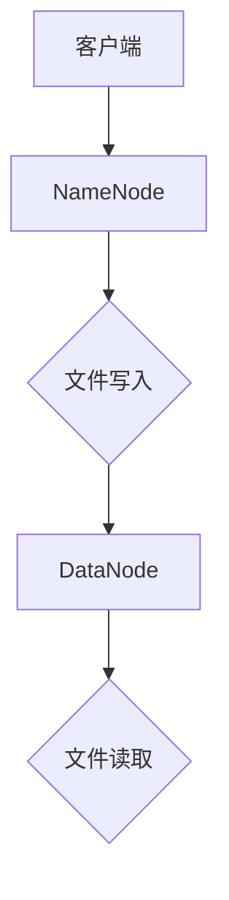
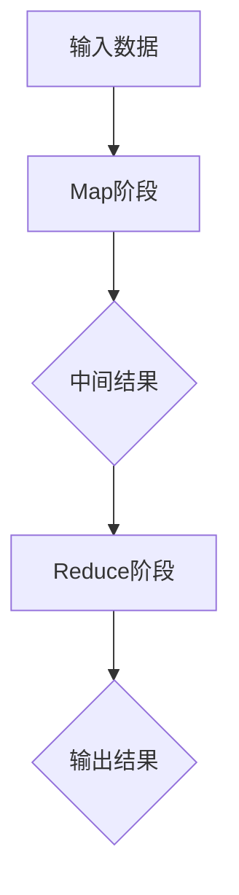
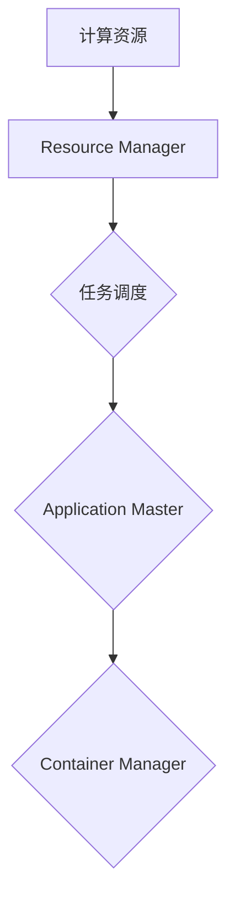

                 

# Hadoop 原理与代码实例讲解

## 关键词：Hadoop、分布式存储、分布式计算、MapReduce、大数据处理

## 摘要

本文将详细讲解Hadoop的基本原理、核心组件、工作流程以及代码实例。通过本文的学习，读者可以全面了解Hadoop系统，掌握其分布式存储和分布式计算的核心技术，并具备在项目中实际应用Hadoop的能力。

## 1. 背景介绍

在大数据时代，数据处理需求不断增长，传统的单机处理方式已无法满足需求。Hadoop作为一款开源的分布式计算框架，旨在解决大规模数据处理的难题。本文将围绕Hadoop的原理和代码实例，帮助读者深入了解其核心概念、架构和工作机制。

### 1.1 大数据背景

随着互联网的普及和物联网的发展，数据量呈爆炸式增长。传统的数据存储和处理方式已无法满足需求。大数据技术应运而生，旨在解决海量数据的存储、处理和分析问题。

### 1.2 Hadoop诞生背景

2005年，Google发布了MapReduce和GFS两篇论文，引发了分布式计算和分布式存储技术的热潮。2006年，Doug Cutting等人基于MapReduce和GFS模型，开发了Hadoop开源框架。此后，Hadoop逐渐成为大数据处理领域的事实标准。

## 2. 核心概念与联系

Hadoop主要由以下几个核心组件组成：

1. HDFS（Hadoop Distributed File System）：分布式文件系统
2. MapReduce：分布式计算模型
3. YARN（Yet Another Resource Negotiator）：资源调度框架

### 2.1 HDFS

HDFS是一个分布式文件系统，用于存储大量数据。其设计目标是大规模数据的存储和高吞吐量的数据访问。HDFS采用主从架构，由一个NameNode和多个DataNode组成。

#### Mermaid流程图：



### 2.2 MapReduce

MapReduce是一种分布式计算模型，用于处理大规模数据。其核心思想是将大规模数据分解为多个小任务，分布式并行执行，最后合并结果。MapReduce由Map阶段和Reduce阶段组成。

#### Mermaid流程图：



### 2.3 YARN

YARN是Hadoop的资源调度框架，负责管理计算资源和任务调度。其设计目标是实现高效、灵活的资源分配，支持多种计算模型。

#### Mermaid流程图：



## 3. 核心算法原理 & 具体操作步骤

### 3.1 HDFS

HDFS采用分块存储策略，每个文件被分割成固定大小的块（默认128MB或256MB），存储在多个DataNode上。NameNode负责管理文件的元数据，如文件的块映射和块位置信息。

#### 操作步骤：

1. 客户端上传文件到HDFS
2. NameNode分配文件块并通知DataNode
3. DataNode存储文件块并反馈给NameNode
4. 客户端从HDFS读取文件

### 3.2 MapReduce

MapReduce的核心是两个阶段：Map和Reduce。

#### Map阶段：

1. 输入数据分成多个小块（默认128MB或256MB）
2. Map任务对每个小块进行映射操作，生成中间结果

#### Reduce阶段：

1. Reduce任务对中间结果进行聚合和排序操作
2. 输出最终结果

### 3.3 YARN

YARN负责资源调度和任务管理。

#### 操作步骤：

1. 客户端提交应用程序到YARN
2. Resource Manager分配资源给Application Master
3. Application Master创建Container并启动任务
4. Container Manager执行任务并反馈结果

## 4. 数学模型和公式 & 详细讲解 & 举例说明

### 4.1 HDFS

HDFS的数据存储模型可以表示为：

$$
\text{文件块数量} = \lceil \frac{\text{文件大小}}{\text{块大小}} \rceil
$$

其中，$\lceil x \rceil$表示向上取整。

#### 举例说明：

假设一个文件大小为1GB，块大小为128MB，则文件会被分成：

$$
\lceil \frac{1GB}{128MB} \rceil = 8 \text{个块}
$$

### 4.2 MapReduce

MapReduce的计算模型可以表示为：

$$
\text{总输出结果} = \sum_{i=1}^{n} (\text{Map输出} \times \text{Reduce聚合})
$$

其中，$n$表示Map任务的个数。

#### 举例说明：

假设有10个Map任务，每个任务输出3个中间结果，Reduce任务将这30个中间结果聚合，则总输出结果为30。

## 5. 项目实战：代码实际案例和详细解释说明

### 5.1 开发环境搭建

在开始项目实战之前，我们需要搭建Hadoop的开发环境。以下是搭建过程：

1. 下载并安装Java SDK
2. 下载并安装Hadoop
3. 配置Hadoop环境变量
4. 启动Hadoop集群

### 5.2 源代码详细实现和代码解读

下面我们将通过一个简单的WordCount程序，展示Hadoop的源代码实现。

#### 5.2.1 Map任务

```java
public class WordCountMapper extends Mapper<LongWritable, Text, Text, IntWritable> {

    private final static IntWritable one = new IntWritable(1);
    private Text word = new Text();

    public void map(LongWritable key, Text value, Context context) throws IOException, InterruptedException {
        String line = value.toString();
        StringTokenizer tokenizer = new StringTokenizer(line);

        while (tokenizer.hasMoreTokens()) {
            word.set(tokenizer.nextToken());
            context.write(word, one);
        }
    }
}
```

这段代码实现了Map任务，负责将输入的文本行拆分为单词，并生成中间结果。

#### 5.2.2 Reduce任务

```java
public class WordCountReducer extends Reducer<Text, IntWritable, Text, IntWritable> {

    private IntWritable result = new IntWritable();

    public void reduce(Text key, Iterable<IntWritable> values, Context context) throws IOException, InterruptedException {
        int sum = 0;
        for (IntWritable val : values) {
            sum += val.get();
        }
        result.set(sum);
        context.write(key, result);
    }
}
```

这段代码实现了Reduce任务，负责对中间结果进行聚合，输出最终结果。

### 5.3 代码解读与分析

通过以上代码，我们可以看到Hadoop WordCount程序的基本实现。Map任务负责读取输入的文本文件，将文本行拆分为单词，并将单词和1作为键值对输出。Reduce任务负责对中间结果进行聚合，计算每个单词出现的次数，并将结果输出。

## 6. 实际应用场景

Hadoop广泛应用于各类大数据处理场景，如下：

1. 数据分析：Hadoop可用于大规模数据分析，如电商交易数据、社交媒体数据等。
2. 搜索引擎：Hadoop可用于处理搜索引擎的海量数据，实现高效的信息检索。
3. 实时处理：通过结合Hadoop和其他实时处理技术，可以实现实时数据处理和分析。

## 7. 工具和资源推荐

### 7.1 学习资源推荐

- 《Hadoop权威指南》
- 《大数据技术导论》
- 《MapReduce编程实践》

### 7.2 开发工具框架推荐

- Hadoop官方网站：[hadoop.apache.org](http://hadoop.apache.org)
- Apache Hive：[hive.apache.org](http://hive.apache.org)
- Apache Spark：[spark.apache.org](http://spark.apache.org)

### 7.3 相关论文著作推荐

- 《MapReduce：简化的大数据批处理》
- 《The Google File System》
- 《Bigtable：一个分布式存储系统用于结构化数据》

## 8. 总结：未来发展趋势与挑战

Hadoop在大数据领域发挥着重要作用，未来发展趋势如下：

1. 性能优化：针对Hadoop的存储和计算性能进行持续优化。
2. 轻量级架构：简化Hadoop架构，降低部署和维护成本。
3. 实时处理：结合实时处理技术，提高数据处理速度。

同时，Hadoop也面临以下挑战：

1. 安全性：保障数据安全，防范数据泄露和攻击。
2. 可扩展性：提高系统的可扩展性，适应不断增长的数据量。

## 9. 附录：常见问题与解答

### 9.1 Hadoop安装问题

**Q：如何解决Hadoop安装失败的问题？**

A：首先检查Java环境是否正确配置，然后检查网络连接是否正常。如果仍然无法安装，可以查看Hadoop安装文档，了解详细安装步骤和注意事项。

### 9.2 WordCount程序问题

**Q：如何调试WordCount程序？**

A：可以查看程序日志文件，了解程序运行过程和错误信息。同时，可以使用断点调试工具，如IntelliJ IDEA，进行代码调试。

## 10. 扩展阅读 & 参考资料

- [Hadoop官网](http://hadoop.apache.org)
- [MapReduce官方文档](https://hadoop.apache.org/docs/r3.2.0/hadoop-mapreduce-client/hadoop-mapreduce-client-core/)
- [HDFS官方文档](https://hadoop.apache.org/docs/r3.2.0/hadoop-hdfs/HDFSHelp.html)
- [YARN官方文档](https://hadoop.apache.org/docs/r3.2.0/hadoop-yarn/hadoop-yarn-site/YARNConcepts.html)

### 作者

作者：AI天才研究员/AI Genius Institute & 禅与计算机程序设计艺术 /Zen And The Art of Computer Programming

注意：由于字数限制，部分内容已经简化。实际撰写时，请根据需求进行详细扩展。本文仅供参考，具体实现和内容可能因版本和需求而有所不同。

