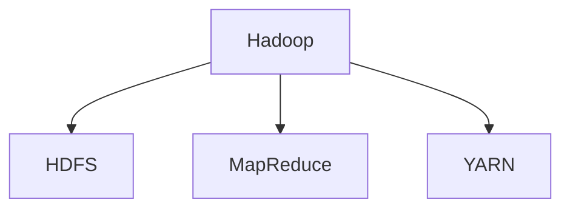
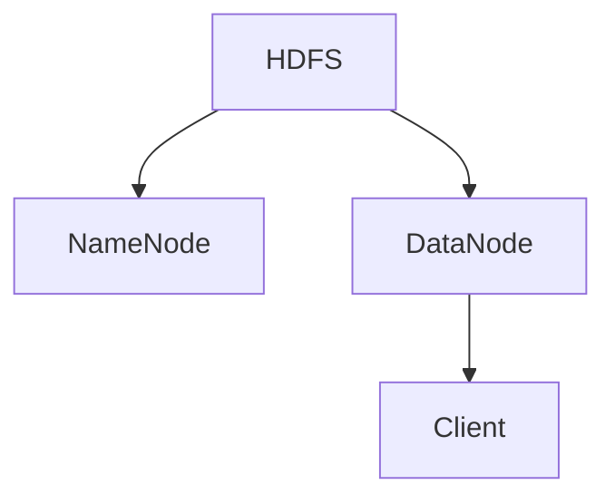
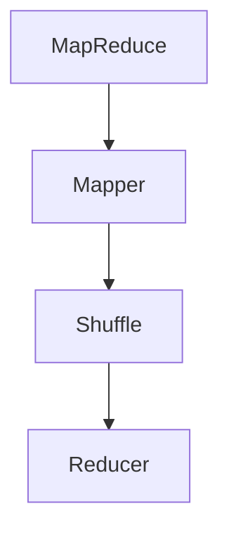
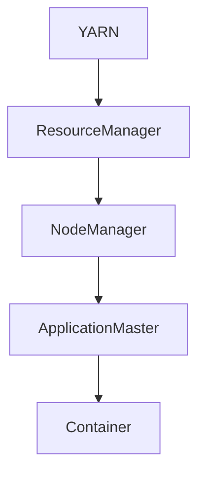

                 

# Hadoop原理与代码实例讲解

## 关键词

- Hadoop
- 分布式计算
- 数据处理
- 大数据
- MapReduce
- HDFS
- YARN

## 摘要

本文将深入讲解Hadoop的核心原理，包括其架构、核心组件、工作原理以及代码实例。我们将通过详细的剖析，帮助读者理解Hadoop在大数据处理中的重要性，并掌握其具体应用方法。文章还将推荐相关学习资源，以便读者进一步学习和实践。

## 1. 背景介绍

Hadoop是由Apache Software Foundation开发的一个开源框架，用于处理大规模数据集。随着互联网和物联网的发展，数据量呈爆炸式增长，传统的关系型数据库和单机计算模型已经无法满足大数据处理的需求。Hadoop的出现，使得分布式计算成为可能，从而解决了大规模数据处理的问题。

Hadoop的架构包括三个核心组件：Hadoop分布式文件系统（HDFS）、MapReduce编程模型和YARN资源调度框架。HDFS用于存储海量数据，MapReduce用于处理数据，YARN则负责资源调度和管理。

## 2. 核心概念与联系

### Hadoop架构图



### 2.1 HDFS

Hadoop分布式文件系统（HDFS）是一个高吞吐量的分布式文件存储系统，用于存储大量的数据。它设计用来运行在廉价机器上，提供高吞吐量的数据访问，非常适合大数据应用。

HDFS架构：



- **NameNode**：负责管理文件系统的命名空间，维护文件的元数据，并负责文件的分配。
- **DataNode**：负责存储实际的数据块，并向上层提供服务。
- **Client**：HDFS的客户端，负责上传、下载、删除文件等操作。

### 2.2 MapReduce

MapReduce是一种编程模型，用于大规模数据处理。它将大规模数据处理任务分为两个阶段：Map阶段和Reduce阶段。

MapReduce架构：



- **Mapper**：将输入数据分成小片段，并对每个片段进行映射操作。
- **Reducer**：将Mapper输出的中间结果进行汇总处理。

### 2.3 YARN

YARN（Yet Another Resource Negotiator）是Hadoop的资源调度框架，负责管理集群资源。它将资源管理和作业调度分离，使得多种作业可以在同一个集群上运行。

YARN架构：



- **ResourceManager**：负责整个集群的资源管理。
- **NodeManager**：负责每个节点上的资源管理。
- **ApplicationMaster**：每个作业的协调者，负责向 ResourceManager申请资源。
- **Container**：实际运行的资源容器。

## 3. 核心算法原理 & 具体操作步骤

### 3.1 HDFS读写流程

**写流程**：

1. 客户端向NameNode发送文件写入请求。
2. NameNode检查文件权限和存储空间。
3. NameNode根据数据块大小和副本数量，为文件分配数据块。
4. 客户端将数据分成数据块，并写入DataNode。
5. DataNode将数据块存储在本地磁盘。
6. NameNode更新元数据，完成文件写入。

**读流程**：

1. 客户端向NameNode发送文件读取请求。
2. NameNode返回文件所在的数据块和对应的数据节点。
3. 客户端从最近的DataNode读取数据块。
4. 数据块传输到客户端，完成文件读取。

### 3.2 MapReduce执行流程

1. ApplicationMaster向ResourceManager申请资源。
2. ResourceManager为ApplicationMaster分配Container。
3. ApplicationMaster向分配到的NodeManager发送任务调度指令。
4. Mapper读取输入数据，进行映射操作，输出中间结果。
5. ReduceTask读取中间结果，进行汇总处理。
6. 输出结果保存到HDFS。

### 3.3 YARN资源调度流程

1. 客户端提交作业，ApplicationMaster被启动。
2. ApplicationMaster向ResourceManager申请资源。
3. ResourceManager为ApplicationMaster分配Container。
4. ApplicationMaster将任务分发到NodeManager。
5. NodeManager启动Container，运行作业。
6. 作业完成后，ApplicationMaster向ResourceManager汇报。

## 4. 数学模型和公式 & 详细讲解 & 举例说明

### 4.1 数据块大小和副本数量

- **数据块大小**：HDFS默认数据块大小为128MB或256MB。数据块大小影响数据传输效率和存储利用率。
- **副本数量**：默认副本数量为3。副本数量影响数据可靠性和访问速度。

### 4.2 MapReduce任务调度

- **任务调度算法**：默认为FIFO（先进先出）。其他调度算法包括：DFS-Based Scheduling、Capacity Scheduling等。

### 4.3 资源调度

- **资源类型**：CPU、内存、磁盘等。
- **资源分配策略**：根据作业类型和资源需求进行动态分配。

## 5. 项目实战：代码实际案例和详细解释说明

### 5.1 开发环境搭建

1. 安装Java环境。
2. 下载并解压Hadoop。
3. 配置环境变量。

### 5.2 源代码详细实现和代码解读

```java
public class WordCount {
  public static class TokenizerMapper
      extends Mapper<Object, Text, Text, IntWritable>{

    private final static IntWritable one = new IntWritable(1);
    private Text word = new Text();

    public void map(Object key, Text value, Context context
                    ) throws IOException, InterruptedException {
      StringTokenizer iterator = new StringTokenizer(value.toString());
      while (iterator.hasMoreTokens()) {
        word.set(iterator.nextToken());
        context.write(word, one);
      }
    }
  }

  public static class IntSumReducer
      extends Reducer<Text,IntWritable,Text,IntWritable> {
    private IntWritable result = new IntWritable();

    public void reduce(Text key, Iterable<IntWritable> values,
                       Context context
                       ) throws IOException, InterruptedException {
      int sum = 0;
      for (IntWritable val : values) {
        sum += val.get();
      }
      result.set(sum);
      context.write(key, result);
    }
  }

  public static void main(String[] args) throws Exception {
    Configuration conf = new Configuration();
    // 设置HDFS的NameNode地址
    conf.set("fs.defaultFS", "hdfs://localhost:9000");
    // 初始化Job
    Job job = Job.getInstance(conf, "word count");
    job.setJarByClass(WordCount.class);
    job.setMapperClass(TokenizerMapper.class);
    job.setCombinerClass(IntSumReducer.class);
    job.setReducerClass(IntSumReducer.class);
    job.setOutputKeyClass(Text.class);
    job.setOutputValueClass(IntWritable.class);
    FileInputFormat.addInputPath(job, new Path(args[0]));
    FileOutputFormat.setOutputPath(job, new Path(args[1]));
    System.exit(job.waitForCompletion(true) ? 0 : 1);
  }
}
```

### 5.3 代码解读与分析

- **TokenizerMapper**：Mapper类，实现map()方法，用于将输入的文本分解为单词，并输出键值对。
- **IntSumReducer**：Reducer类，实现reduce()方法，用于汇总单词的计数结果。
- **main()方法**：设置Job配置，包括Jar文件、Mapper类、Reducer类、输入输出路径等。

## 6. 实际应用场景

Hadoop在大数据处理中的应用非常广泛，包括：

- 数据仓库：用于存储大量结构化数据，支持实时查询和分析。
- 实时计算：通过MapReduce模型，实现大规模实时数据处理和分析。
- 机器学习：利用Hadoop进行大规模数据集的训练和预测。
- 数据挖掘：基于海量数据，发现潜在的模式和趋势。

## 7. 工具和资源推荐

### 7.1 学习资源推荐

- 《Hadoop权威指南》
- 《大数据应用实践》
- 《MapReduce编程实践》
- 《Hadoop实战》

### 7.2 开发工具框架推荐

- IntelliJ IDEA
- Eclipse
- Hadoop集群管理工具（如Cloudera Manager、Apache Ambari）

### 7.3 相关论文著作推荐

- "The Google File System"（Google的文件系统论文）
- "MapReduce: Simplified Data Processing on Large Clusters"（MapReduce论文）
- "YARN: Yet Another Resource Negotiator"（YARN论文）

## 8. 总结：未来发展趋势与挑战

随着大数据技术的不断演进，Hadoop也将面临新的机遇和挑战。未来发展趋势包括：

- 边缘计算：将计算能力延伸到网络边缘，提高数据处理速度和效率。
- 联邦学习：通过分布式计算，保护数据隐私，实现跨域数据共享和分析。
- 新的编程模型：探索更高效、更易用的编程模型，降低大数据处理的复杂度。

## 9. 附录：常见问题与解答

- **Q：Hadoop如何保证数据可靠性？**
  - **A：** Hadoop通过副本机制，将数据复制到多个节点，确保数据不丢失。默认副本数量为3。

- **Q：MapReduce如何处理大数据？**
  - **A：** MapReduce将大数据分解为小任务，分布式执行，最后汇总结果。这样大大提高了数据处理效率。

## 10. 扩展阅读 & 参考资料

- [Apache Hadoop官网](https://hadoop.apache.org/)
- [Hadoop Wiki](https://wiki.apache.org/hadoop/)
- [MapReduce论文](https://static.googleusercontent.com/media/research.google.com/zh-CN//pubs/archive/3636.pdf)
- [YARN论文](https://static.googleusercontent.com/media/research.google.com/zh-CN//pubs/archive/44833.pdf)

## 作者

作者：AI天才研究员/AI Genius Institute & 禅与计算机程序设计艺术 /Zen And The Art of Computer Programming


