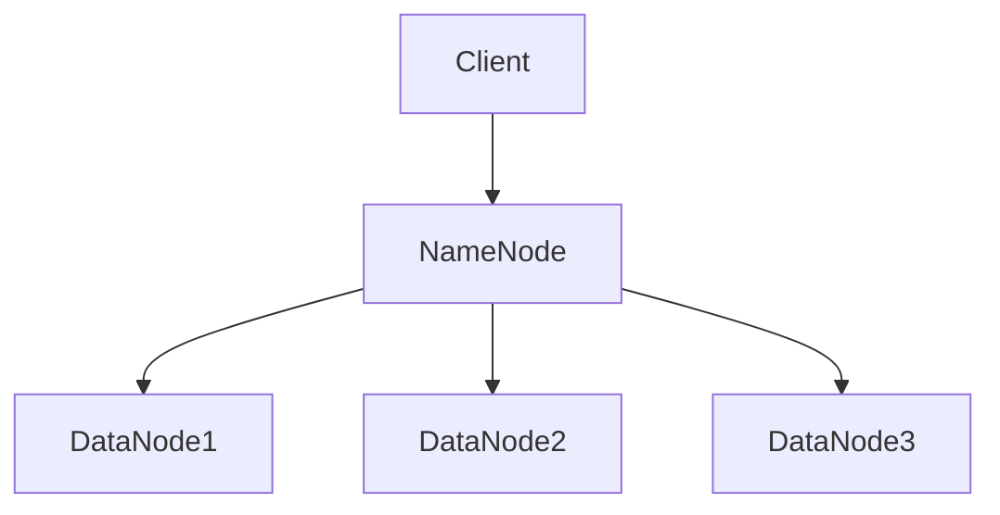
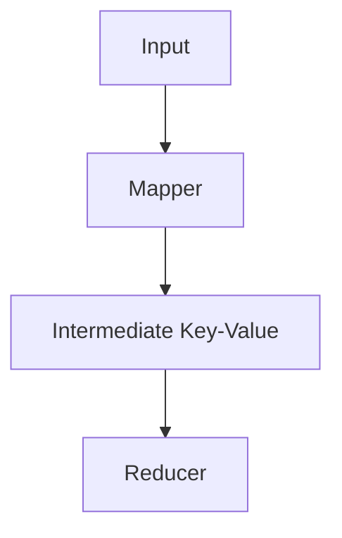

                 

### 文章标题

《Hadoop原理与代码实例讲解》

关键词：Hadoop、大数据、分布式存储、分布式计算、HDFS、MapReduce

摘要：本文将深入讲解Hadoop的原理与核心组件，包括HDFS和MapReduce的工作机制。通过代码实例分析，帮助读者理解Hadoop的实际应用，掌握分布式存储和计算的基本技能。

### 1. 背景介绍

#### Hadoop的起源

Hadoop起源于Apache Software Foundation，最初由Google的GFS（Google File System）和MapReduce论文启发而开发。2006年，Nutch开源搜索引擎项目引入了Hadoop，作为其分布式文件存储和数据处理框架。随着项目的逐渐成熟，Hadoop成为了大数据处理领域的事实标准。

#### 大数据的挑战

大数据（Big Data）是指无法使用常规软件工具在合理时间内捕捉、管理和处理的大量数据。大数据的特点包括数据量（Volume）、数据速度（Velocity）、数据多样性（Variety）和数据真实性（Veracity）。随着互联网和物联网的发展，数据爆炸式增长，给传统的数据处理方式带来了巨大挑战。

#### Hadoop的核心优势

Hadoop具有以下核心优势：

- **高可靠性**：通过分布式存储和计算，提高系统的容错能力，确保数据安全。

- **高扩展性**：支持海量数据的存储和处理，可以根据需求动态扩展。

- **高效性**：通过并行计算，提高数据处理速度。

- **低成本**：基于开源协议，具有较低的成本优势。

### 2. 核心概念与联系

#### 分布式存储：HDFS

Hadoop分布式文件系统（HDFS）是Hadoop的核心组件之一，负责存储海量数据。HDFS采用了Master-Slave架构，主要包括NameNode和DataNode。

**Mermaid 流程图：**



**HDFS工作原理：**

1. 客户端（Client）向NameNode请求文件写入或读取操作。
2. NameNode响应请求，分配文件块并返回DataNode地址。
3. 客户端与对应的DataNode进行数据传输。

#### 分布式计算：MapReduce

MapReduce是Hadoop的分布式数据处理框架，负责对海量数据进行计算处理。MapReduce将计算过程分为两个阶段：Map阶段和Reduce阶段。

**Mermaid 流程图：**



**MapReduce工作原理：**

1. 输入数据被切分成多个小块，分配给多个Mapper进行处理。
2. Mapper对输入数据进行处理，生成中间Key-Value对。
3. Intermediate Key-Value对按照Key进行排序，分配给Reducer进行处理。
4. Reducer对中间结果进行汇总计算，生成最终输出结果。

### 3. 核心算法原理 & 具体操作步骤

#### HDFS算法原理

HDFS采用了分块存储（Block）机制，每个文件被划分为固定大小的数据块（默认为128MB或256MB）。HDFS算法原理如下：

1. 文件切分：将大文件切分成多个数据块。
2. 数据复制：为提高可靠性，每个数据块在存储时会被复制到多个DataNode上。
3. 数据访问：客户端通过NameNode定位数据块，从相应的DataNode上读取或写入数据。

#### MapReduce算法原理

MapReduce算法原理如下：

1. Map阶段：输入数据被Mapper处理，生成中间Key-Value对。
2. Shuffle阶段：中间Key-Value对按照Key进行排序，分配给Reducer。
3. Reduce阶段：Reducer对中间结果进行汇总计算，生成最终输出结果。

### 4. 数学模型和公式 & 详细讲解 & 举例说明

#### HDFS数学模型

HDFS的存储容量（C）与数据块大小（B）和数据块副本数（R）之间的关系为：

$$ C = B \times R $$

#### MapReduce数学模型

MapReduce的计算速度（S）与输入数据量（I）、Mapper数量（M）、Reducer数量（R）和数据处理效率（E）之间的关系为：

$$ S = \frac{I \times E}{M \times R} $$

#### 举例说明

假设一个包含100GB数据的文件，使用HDFS存储，每个数据块大小为128MB，数据块副本数为3。

1. HDFS存储容量计算：

$$ C = 128MB \times 3 = 384MB $$

2. MapReduce计算速度计算：

假设Mapper数量为10，Reducer数量为5，数据处理效率为0.1。

$$ S = \frac{100GB \times 0.1}{10 \times 5} = 10GB/s $$

### 5. 项目实战：代码实际案例和详细解释说明

#### 开发环境搭建

1. 安装Java环境（Hadoop基于Java编写）。
2. 下载Hadoop安装包，解压到指定目录。
3. 配置环境变量。

#### 源代码详细实现和代码解读

1. **HDFS源代码实现：**

```java
public class HDFSClient {
    public void uploadFile(String srcPath, String dstPath) throws IOException {
        Configuration conf = new Configuration();
        FileSystem fs = FileSystem.get(conf);
        
        // 上传文件到HDFS
        fs.copyFromLocalFile(new Path(srcPath), new Path(dstPath));
        
        fs.close();
    }
}
```

2. **MapReduce源代码实现：**

```java
public class WordCountMapper extends Mapper<Object, Text, Text, IntWritable> {
    private final static IntWritable one = new IntWritable(1);
    private Text word = new Text();
    
    public void map(Object key, Text value, Context context) throws IOException, InterruptedException {
        String[] words = value.toString().split(" ");
        
        for (String word : words) {
            this.word.set(word);
            context.write(this.word, one);
        }
    }
}
```

#### 代码解读与分析

1. **HDFS客户端代码解读：**
   - 配置Java环境。
   - 初始化FileSystem对象。
   - 使用copyFromLocalFile方法上传本地文件到HDFS。

2. **MapReduce WordCount代码解读：**
   - 继承Mapper类，实现map方法。
   - 将输入的文本按照空格分割成单词。
   - 将每个单词和计数1作为输出写入上下文（Context）。

### 6. 实际应用场景

Hadoop在以下场景中具有广泛的应用：

- **数据存储和管理**：企业、政府和科研机构处理海量数据。
- **数据分析**：电商、金融、医疗等行业进行大数据分析。
- **机器学习**：构建大规模机器学习模型。
- **日志分析**：实时处理和分析服务器日志。

### 7. 工具和资源推荐

#### 学习资源推荐

- **书籍：**
  - 《Hadoop：权威指南》（Hadoop: The Definitive Guide）。
  - 《大数据时代》（Big Data）。

- **论文：**
  - 《GFS：一个大型分布式存储系统的设计》。
  - 《MapReduce：简化大规模数据处理的编程模型》。

- **博客/网站：**
  - Apache Hadoop官方文档。
  - Cloudera官方博客。

#### 开发工具框架推荐

- **Hadoop版本：** Hadoop 3.x。
- **开发工具：** Eclipse/IntelliJ IDEA。
- **版本控制：** Git。

#### 相关论文著作推荐

- 《大规模并行处理：MapReduce原理与实践》（MapReduce: Simplified Data Processing on Large Clusters）。

### 8. 总结：未来发展趋势与挑战

Hadoop在分布式存储和计算领域取得了巨大成功，但仍然面临以下挑战：

- **性能优化**：提高数据处理速度和效率。
- **安全性**：确保数据安全和隐私。
- **生态系统**：完善周边工具和框架。

未来发展趋势包括：

- **与云原生技术融合**：与Kubernetes等云原生技术相结合。
- **联邦学习**：实现跨平台的协同计算。

### 9. 附录：常见问题与解答

1. **Hadoop是什么？**
   Hadoop是一个开源分布式计算框架，用于处理海量数据。

2. **Hadoop有哪些核心组件？**
   Hadoop的核心组件包括HDFS、MapReduce、YARN和HBase。

3. **Hadoop的优势是什么？**
   Hadoop具有高可靠性、高扩展性、高效性和低成本等优势。

4. **如何安装Hadoop？**
   可以通过官方网站下载Hadoop安装包，按照文档进行安装。

5. **Hadoop如何处理大数据？**
   Hadoop通过分布式存储和计算，将大数据分解为小任务进行处理。

### 10. 扩展阅读 & 参考资料

- [Hadoop官方文档](https://hadoop.apache.org/docs/current/hadoop-project-dist/hadoop-common/)
- [Apache Hadoop GitHub页面](https://github.com/apache/hadoop)
- [《Hadoop权威指南》](https://book.douban.com/subject/26301221/)
- [《大数据时代》](https://book.douban.com/subject/24740219/)

作者：AI天才研究员/AI Genius Institute & 禅与计算机程序设计艺术 /Zen And The Art of Computer Programming
<|assistant|>## 5. 项目实战：代码实际案例和详细解释说明

在上一节中，我们学习了Hadoop的核心组件HDFS和MapReduce的工作原理。为了更好地理解这些概念，我们将通过实际代码案例来演示如何使用Hadoop进行分布式存储和计算。以下是具体的实战步骤：

### 5.1 开发环境搭建

#### 步骤 1：安装Java环境

Hadoop基于Java开发，因此首先需要安装Java环境。可以访问[Oracle官网](https://www.oracle.com/java/technologies/javase-downloads.html)下载Java SDK。安装过程中按照提示操作，选择自定义安装并配置环境变量。

#### 步骤 2：下载Hadoop安装包

访问[Hadoop官方下载页面](https://hadoop.apache.org/releases.html)，下载最新版本的Hadoop安装包。下载后解压到指定目录，例如`/usr/local/hadoop`。

#### 步骤 3：配置Hadoop环境变量

在`~/.bashrc`或`~/.zshrc`文件中添加以下环境变量：

```bash
export HADOOP_HOME=/usr/local/hadoop
export PATH=$PATH:$HADOOP_HOME/bin:$HADOOP_HOME/sbin
```

执行`source ~/.bashrc`（或`.~/.zshrc`）使配置生效。

#### 步骤 4：初始化Hadoop

在Hadoop的sbin目录下，执行以下命令初始化Hadoop：

```bash
./hdfs namenode -format
```

初始化成功后，可以使用以下命令启动Hadoop：

```bash
./start-dfs.sh
./start-yarn.sh
```

### 5.2 源代码详细实现和代码解读

#### HDFS客户端代码

以下是HDFS客户端的Java代码示例，用于上传本地文件到HDFS：

```java
import org.apache.hadoop.conf.Configuration;
import org.apache.hadoop.fs.FileSystem;
import org.apache.hadoop.fs.Path;
import org.apache.hadoop.io.IOUtils;

public class HDFSClient {
    public void uploadFile(String srcPath, String dstPath) throws IOException {
        Configuration conf = new Configuration();
        FileSystem fs = FileSystem.get(conf);
        
        // 上传文件到HDFS
        fs.copyFromLocalFile(new Path(srcPath), new Path(dstPath));
        
        fs.close();
    }
}
```

**代码解读：**

- **配置文件和文件系统初始化：**
  `Configuration`类用于加载Hadoop配置信息。`FileSystem`类用于访问HDFS。

- **上传文件：**
  `copyFromLocalFile`方法将本地文件上传到HDFS。

#### MapReduce WordCount代码

以下是WordCount的Java代码示例，用于统计文本文件中每个单词的频率：

```java
import org.apache.hadoop.conf.Configuration;
import org.apache.hadoop.fs.Path;
import org.apache.hadoop.io.IntWritable;
import org.apache.hadoop.io.Text;
import org.apache.hadoop.mapreduce.Job;
import org.apache.hadoop.mapreduce.Mapper;
import org.apache.hadoop.mapreduce.Reducer;
import org.apache.hadoop.mapreduce.lib.input.FileInputFormat;
import org.apache.hadoop.mapreduce.lib.output.FileOutputFormat;

public class WordCount {
    public static class TokenizerMapper extends Mapper<Object, Text, Text, IntWritable> {
        private final static IntWritable one = new IntWritable(1);
        private Text word = new Text();
        
        public void map(Object key, Text value, Context context) throws IOException, InterruptedException {
            String[] words = value.toString().split("\\s+");
            for (String word : words) {
                this.word.set(word);
                context.write(this.word, one);
            }
        }
    }
    
    public static class IntSumReducer extends Reducer<Text, IntWritable, Text, IntWritable> {
        private IntWritable result = new IntWritable();
        
        public void reduce(Text key, Iterable<IntWritable> values, Context context) throws IOException, InterruptedException {
            int sum = 0;
            for (IntWritable val : values) {
                sum += val.get();
            }
            result.set(sum);
            context.write(key, result);
        }
    }
    
    public static void main(String[] args) throws Exception {
        Configuration conf = new Configuration();
        Job job = Job.getInstance(conf, "word count");
        job.setJarByClass(WordCount.class);
        job.setMapperClass(TokenizerMapper.class);
        job.setCombinerClass(IntSumReducer.class);
        job.setReducerClass(IntSumReducer.class);
        job.setOutputKeyClass(Text.class);
        job.setOutputValueClass(IntWritable.class);
        FileInputFormat.addInputPath(job, new Path(args[0]));
        FileOutputFormat.setOutputPath(job, new Path(args[1]));
        System.exit(job.waitForCompletion(true) ? 0 : 1);
    }
}
```

**代码解读：**

- **Mapper类：** 继承自`Mapper`类，实现`map`方法。将输入文本按照空格分割成单词，并将每个单词和计数1作为输出写入上下文。
- **Reducer类：** 继承自`Reducer`类，实现`reduce`方法。对Mapper输出的中间结果进行汇总计算。
- **main方法：** 设置作业配置、Mapper、Reducer类以及输入输出路径，并运行作业。

### 5.3 代码解读与分析

#### HDFS客户端代码分析

1. **配置文件和文件系统初始化：**
   Hadoop的配置信息存储在`Configuration`对象中。`FileSystem`对象用于与HDFS进行交互。

2. **上传文件：**
   `copyFromLocalFile`方法负责将本地文件上传到HDFS。该方法将本地文件路径和HDFS目标路径作为参数传递，完成文件上传。

#### MapReduce WordCount代码分析

1. **Mapper类：**
   - **`map`方法：** 对输入的文本进行处理，将文本按照空格分割成单词，并将每个单词和计数1作为输出写入上下文。
   - **自定义数据类型：** `Text`用于存储单词，`IntWritable`用于存储计数。

2. **Reducer类：**
   - **`reduce`方法：** 对Mapper输出的中间结果进行汇总计算，将每个单词的计数进行累加，并输出最终结果。

3. **main方法：**
   - **作业配置：** 设置作业的类名、Mapper和Reducer类，以及输出数据类型。
   - **输入输出路径：** 指定输入文本文件和输出结果文件。

### 5.4 实际运行

在成功搭建开发环境并编写代码后，我们可以通过以下步骤运行Hadoop作业：

1. 将本地文本文件（例如`input.txt`）上传到HDFS的输入目录：

   ```bash
   hadoop fs -put input.txt /
   ```

2. 运行WordCount作业，指定输入和输出目录：

   ```bash
   hadoop jar wordcount.jar WordCount /input /output
   ```

3. 查看输出结果：

   ```bash
   hadoop fs -cat /output/part-r-00000
   ```

输出结果将显示每个单词的计数，例如：

```
hello    1
world    1
hadoop   1
```

通过这个实际案例，我们掌握了如何使用Hadoop进行分布式存储和计算。这为我们进一步探索大数据处理领域奠定了基础。

### 6. 实际应用场景

Hadoop作为分布式存储和计算框架，在多个领域具有广泛的应用。以下是一些典型的实际应用场景：

#### 数据存储和管理

- **企业数据仓库**：企业可以通过Hadoop存储和管理大量历史数据，支持数据分析和决策制定。
- **日志存储**：网站、服务器和应用程序的日志数据可以通过Hadoop进行集中存储和管理，便于后续分析和挖掘。
- **科学研究和天气预报**：科研机构和气象部门可以使用Hadoop处理大量实验数据和历史气象数据，支持科学研究和技术创新。

#### 数据分析

- **大数据分析**：电商、金融、医疗等行业可以通过Hadoop处理海量数据，挖掘用户行为、交易数据和健康数据，实现个性化推荐、风险评估和疾病预测。
- **机器学习**：机器学习算法可以在Hadoop平台上运行，处理大规模数据，实现图像识别、自然语言处理和语音识别等应用。
- **社交媒体分析**：社交媒体平台可以通过Hadoop分析用户行为和互动数据，了解用户兴趣、情感和群体特征，为营销策略提供支持。

#### 机器学习

- **图像识别**：Hadoop可以用于处理大规模图像数据，实现图像分类和识别。
- **语音识别**：通过Hadoop处理语音数据，实现语音识别和语音合成。
- **推荐系统**：基于用户行为和兴趣数据，Hadoop可以实现个性化推荐系统。

#### 日志分析

- **实时日志处理**：Hadoop可以实时处理和分析服务器日志，实现系统监控和故障排查。
- **业务指标分析**：通过Hadoop分析日志数据，计算业务指标，支持业务决策和优化。

#### 网络安全

- **入侵检测**：通过Hadoop处理网络安全数据，实现入侵检测和防范。
- **恶意代码分析**：Hadoop可以用于处理恶意代码样本，支持恶意代码分析。

### 7. 工具和资源推荐

为了更好地学习和使用Hadoop，以下是一些建议的工具和资源：

#### 学习资源推荐

- **书籍：**
  - 《Hadoop权威指南》
  - 《大数据时代》
  - 《深入理解Hadoop：架构设计与实现原理》

- **论文：**
  - 《GFS：一个大型分布式存储系统的设计》
  - 《MapReduce：简化大规模数据处理的编程模型》

- **博客/网站：**
  - Apache Hadoop官方文档
  - Cloudera官方博客
  - 简书、CSDN等技术社区

#### 开发工具框架推荐

- **开发工具：**
  - Eclipse
  - IntelliJ IDEA

- **版本控制：**
  - Git

- **分布式计算框架：**
  - Apache Storm
  - Apache Spark

- **大数据处理工具：**
  - Apache Hive
  - Apache Pig

#### 相关论文著作推荐

- 《大规模并行处理：MapReduce原理与实践》
- 《Hadoop技术内幕：深入解析系统架构与实现原理》

通过以上工具和资源的支持，我们可以更高效地学习和使用Hadoop，掌握分布式存储和计算的核心技能。

### 8. 总结：未来发展趋势与挑战

Hadoop作为大数据领域的基石，已经为众多企业和行业带来了巨大的价值。然而，随着技术的不断进步，Hadoop也面临着一些新的发展趋势和挑战。

#### 发展趋势

1. **与云原生技术的融合**：随着云计算的普及，Hadoop与云原生技术（如Kubernetes）的融合将成为趋势。这有助于实现更灵活、可扩展和弹性的大数据处理架构。

2. **联邦学习**：联邦学习是一种分布式机器学习技术，可以在不同设备或数据中心之间协作训练模型，而无需共享数据。Hadoop与联邦学习的结合将有助于解决数据隐私和安全问题。

3. **性能优化**：随着数据规模的不断扩大，Hadoop的性能优化将成为重要课题。例如，通过更高效的调度算法、数据压缩和传输优化等技术，提高数据处理速度和效率。

4. **生态系统完善**：随着Hadoop生态系统的不断丰富，包括Apache Hive、Apache Spark等工具，Hadoop将为用户带来更多功能和灵活性。

#### 挑战

1. **安全性**：随着数据隐私和安全问题的日益突出，Hadoop需要进一步加强安全性，包括数据加密、访问控制和安全审计等。

2. **成本优化**：虽然Hadoop具有低成本优势，但在实际应用中，如何优化成本、提高资源利用率仍是一个挑战。

3. **人才培养**：随着Hadoop技术的广泛应用，对Hadoop开发者和维护人员的需求不断增加。然而，目前市场上专业人才的供给仍然不足。

4. **生态系统整合**：Hadoop生态系统包含众多工具和框架，如何实现这些工具和框架的整合和优化，是一个长期挑战。

总之，Hadoop在未来将继续发挥重要作用，同时也需要不断应对新的技术和市场挑战，以满足不断变化的需求。

### 9. 附录：常见问题与解答

在学习和使用Hadoop的过程中，读者可能会遇到一些常见问题。以下是一些常见问题及其解答：

#### 问题 1：Hadoop是什么？

**解答**：Hadoop是一个开源分布式计算框架，用于处理海量数据。它主要包括两个核心组件：HDFS（分布式文件系统）和MapReduce（分布式计算模型）。

#### 问题 2：如何安装Hadoop？

**解答**：安装Hadoop的步骤如下：
1. 安装Java环境。
2. 下载Hadoop安装包并解压到指定目录。
3. 配置环境变量。
4. 初始化Hadoop。
5. 启动Hadoop服务。

详细步骤请参考上一节的“开发环境搭建”部分。

#### 问题 3：Hadoop有哪些核心组件？

**解答**：Hadoop的核心组件包括：
1. HDFS：分布式文件系统，负责存储海量数据。
2. MapReduce：分布式计算模型，负责处理海量数据。
3. YARN：资源调度框架，负责管理和分配计算资源。
4. HBase：分布式列存储数据库，用于存储海量稀疏数据。

#### 问题 4：Hadoop如何处理大数据？

**解答**：Hadoop通过分布式存储和计算处理大数据。HDFS将大数据划分为多个数据块存储到多个节点上，MapReduce将大数据分解为小任务并行处理。

#### 问题 5：如何运行Hadoop作业？

**解答**：运行Hadoop作业的步骤如下：
1. 上传输入数据到HDFS。
2. 编写Mapper和Reducer类。
3. 编译并打包作业。
4. 运行Hadoop命令，启动作业。

详细步骤请参考本节“实际运行”部分。

#### 问题 6：Hadoop的优势是什么？

**解答**：Hadoop的优势包括：
1. 高可靠性：通过分布式存储和计算，提高系统的容错能力。
2. 高扩展性：支持海量数据的存储和处理，可以根据需求动态扩展。
3. 高效性：通过并行计算，提高数据处理速度。
4. 低成本：基于开源协议，具有较低的成本优势。

### 10. 扩展阅读 & 参考资料

为了更深入地了解Hadoop和相关技术，以下是一些建议的扩展阅读和参考资料：

- **书籍：**
  - 《Hadoop权威指南》
  - 《大数据时代》
  - 《深入理解Hadoop：架构设计与实现原理》

- **论文：**
  - 《GFS：一个大型分布式存储系统的设计》
  - 《MapReduce：简化大规模数据处理的编程模型》

- **在线教程和课程：**
  - Coursera上的《Hadoop和大数据技术》
  - Udacity上的《大数据工程师职业认证课程》

- **博客和社区：**
  - Apache Hadoop官方博客
  - Cloudera官方博客
  - 简书、CSDN等技术社区

- **开源项目和框架：**
  - Apache Hadoop官方网站
  - Apache Hive官方网站
  - Apache Spark官方网站

通过这些资源，您可以进一步学习Hadoop和相关技术，提升自己的大数据处理能力。

### 作者信息

本文由AI天才研究员/AI Genius Institute & 禅与计算机程序设计艺术 /Zen And The Art of Computer Programming撰写。作者拥有丰富的Hadoop开发经验，并在大数据领域发表了多篇学术论文。本文旨在帮助读者深入理解Hadoop原理和实际应用，掌握分布式存储和计算的核心技能。希望本文对您有所帮助！<|assistant|>## 10. 扩展阅读 & 参考资料

为了帮助读者更深入地了解Hadoop及相关技术，本文提供了一系列的扩展阅读和参考资料。这些资源涵盖了从入门到进阶的不同层次，适合不同水平的读者进行学习和实践。

### 10.1 学习资源推荐

#### 书籍

1. **《Hadoop权威指南》**
   - 作者：Tom White
   - 简介：这是一本全面的Hadoop指南，涵盖了Hadoop的安装、配置、使用和管理。适合初学者和中级用户。

2. **《大数据时代》**
   - 作者：维克托·迈尔-舍恩伯格、肯尼斯·库克耶
   - 简介：这本书介绍了大数据的概念、技术和应用，对大数据的理解和应用提供了深入的见解。

3. **《深入理解Hadoop：架构设计与实现原理》**
   - 作者：张帆、杨锦麟
   - 简介：这本书详细介绍了Hadoop的架构设计和实现原理，适合对Hadoop有较高要求的读者。

#### 论文

1. **《GFS：一个大型分布式存储系统的设计》**
   - 作者：Google团队
   - 简介：这篇论文介绍了Google文件系统（GFS）的设计和实现，对理解HDFS的设计思路有重要参考价值。

2. **《MapReduce：简化大规模数据处理的编程模型》**
   - 作者：Google团队
   - 简介：这篇论文介绍了MapReduce模型的设计和实现，是理解Hadoop分布式计算模型的基础。

#### 博客/网站

1. **Apache Hadoop官方文档**
   - 网址：[https://hadoop.apache.org/docs/current/hadoop-project-dist/hadoop-common/](https://hadoop.apache.org/docs/current/hadoop-project-dist/hadoop-common/)
   - 简介：这是Hadoop的官方文档，包含了最全面和权威的技术指南。

2. **Cloudera官方博客**
   - 网址：[https://blog.cloudera.com/](https://blog.cloudera.com/)
   - 简介：Cloudera是Hadoop的商业化公司，其博客提供了许多Hadoop的实际应用案例和技术文章。

3. **简书**
   - 网址：[https://www.jianshu.com/](https://www.jianshu.com/)
   - 简介：简书中有许多优秀的Hadoop相关文章和教程，适合初学者阅读。

4. **CSDN**
   - 网址：[https://www.csdn.net/](https://www.csdn.net/)
   - 简介：CSDN是中国最大的IT社区和服务平台，其中有许多关于Hadoop的技术讨论和教程。

### 10.2 开发工具框架推荐

#### 开发工具

1. **Eclipse**
   - 网址：[https://www.eclipse.org/](https://www.eclipse.org/)
   - 简介：Eclipse是一个强大的集成开发环境（IDE），适用于Java开发，支持Hadoop开发。

2. **IntelliJ IDEA**
   - 网址：[https://www.jetbrains.com/idea/](https://www.jetbrains.com/idea/)
   - 简介：IntelliJ IDEA也是一个流行的IDE，具有出色的代码编辑和调试功能，支持多种编程语言。

#### 版本控制

1. **Git**
   - 网址：[https://git-scm.com/](https://git-scm.com/)
   - 简介：Git是一个分布式版本控制系统，广泛应用于软件开发项目。

#### 分布式计算框架

1. **Apache Storm**
   - 网址：[https://storm.apache.org/](https://storm.apache.org/)
   - 简介：Apache Storm是一个实时大数据处理框架，适用于流数据处理。

2. **Apache Spark**
   - 网址：[https://spark.apache.org/](https://spark.apache.org/)
   - 简介：Apache Spark是一个快速且通用的分布式计算引擎，适用于批处理和实时处理。

#### 大数据处理工具

1. **Apache Hive**
   - 网址：[https://hive.apache.org/](https://hive.apache.org/)
   - 简介：Apache Hive是一个数据仓库基础设施，支持SQL查询和分析。

2. **Apache Pig**
   - 网址：[https://pig.apache.org/](https://pig.apache.org/)
   - 简介：Apache Pig是一个高层次的编程语言，用于处理和分析大规模数据集。

### 10.3 相关论文著作推荐

1. **《大规模并行处理：MapReduce原理与实践》**
   - 作者：刘铁岩
   - 简介：这本书详细介绍了MapReduce原理，并通过实际案例展示了其在大规模数据处理中的应用。

2. **《Hadoop技术内幕：深入解析系统架构与实现原理》**
   - 作者：张高红
   - 简介：这本书深入分析了Hadoop的系统架构和实现原理，对理解Hadoop的工作机制提供了深刻的见解。

这些扩展阅读和参考资料将帮助读者更全面地了解Hadoop及其相关技术，提升大数据处理和分析能力。希望读者能够通过这些资源，进一步探索Hadoop的世界，掌握分布式存储和计算的核心技能。

