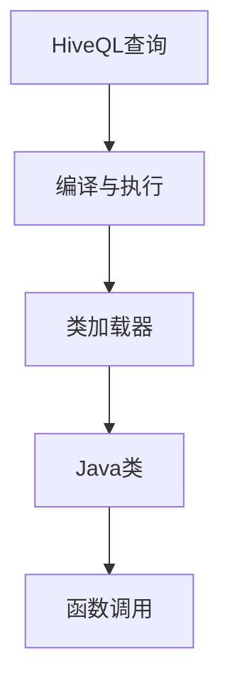
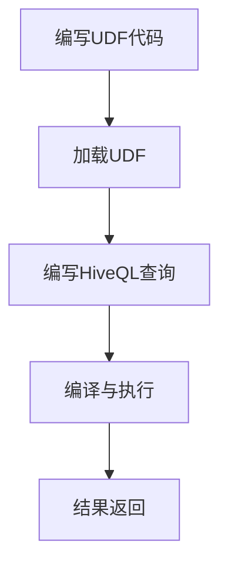

                 

### 背景介绍

#### 1.1 Hive UDF的概念

Hive UDF（User-Defined Function）指的是Hive数据库中自定义的用户定义函数。UDF是一种用于Hive SQL查询中的函数，它允许用户在查询过程中定义自己的计算逻辑。通过使用UDF，用户可以将自定义的逻辑应用于Hive查询中的数据，从而实现更复杂的数据处理和分析。

#### 1.2 Hive UDF的重要性

Hive UDF的重要性体现在以下几个方面：

1. **扩展性**：Hive本身提供了一些内置函数，但它们可能无法满足所有用户的需求。通过自定义UDF，用户可以扩展Hive的功能，使其适用于更广泛的场景。

2. **数据处理灵活性**：自定义UDF可以处理特定的数据格式或执行特定的数据处理任务，从而提高数据处理的灵活性和效率。

3. **业务定制**：许多业务场景需要特定的数据处理逻辑，而UDF使得用户可以轻松地实现这些定制逻辑，从而更好地满足业务需求。

#### 1.3 自定义Hive UDF的必要性

随着大数据应用的普及，数据量和数据类型的复杂性不断增加，传统的数据处理方法已经无法满足需求。因此，自定义Hive UDF成为了数据处理领域的一项重要技术。通过自定义UDF，用户可以根据具体的业务需求，灵活地处理和分析数据。

#### 1.4 目标与结构

本文的目标是深入讲解Hive UDF自定义函数的原理和代码实例，帮助读者理解并掌握自定义Hive UDF的核心概念和实现方法。文章结构如下：

1. **背景介绍**：介绍Hive UDF的概念、重要性和必要性。
2. **核心概念与联系**：解释Hive UDF的核心概念，并通过Mermaid流程图展示其架构。
3. **核心算法原理与具体操作步骤**：详细讲解Hive UDF的工作原理和操作步骤。
4. **数学模型和公式**：介绍Hive UDF相关的数学模型和公式，并进行举例说明。
5. **项目实战**：提供代码实际案例和详细解释说明。
6. **实际应用场景**：分析Hive UDF的实际应用场景。
7. **工具和资源推荐**：推荐学习资源和开发工具框架。
8. **总结：未来发展趋势与挑战**：总结Hive UDF的发展趋势和挑战。
9. **附录：常见问题与解答**：提供常见问题及解答。
10. **扩展阅读与参考资料**：推荐相关论文和著作。

通过以上结构的讲解，读者将能够系统地了解Hive UDF的自定义原理和实现方法，为实际应用奠定基础。

<markdown>
## 2. 核心概念与联系

在深入探讨Hive UDF的原理和实现之前，我们首先需要了解几个核心概念，包括Hive、UDF、Java编程语言、以及Hive UDF的架构。这些概念将帮助我们建立对Hive UDF的整体理解。

#### 2.1 Hive

Hive是Apache Software Foundation的一个开源数据仓库工具，它允许用户使用类似SQL的查询语言（HiveQL）来处理大规模的数据集。Hive适用于存储在Hadoop文件系统（HDFS）中的大数据集，并利用MapReduce进行查询处理。Hive的设计目的是为了解决数据仓库中数据查询和分析的需求。

#### 2.2 UDF

UDF（User-Defined Function）是用户自定义函数的简称，它是一种在数据库中使用的函数，允许用户根据特定的需求自定义函数逻辑。UDF通常由用户自己编写，并将其加载到数据库中，以便在查询中调用。

#### 2.3 Java编程语言

Java是一种广泛使用的编程语言，它具有跨平台、面向对象、强类型和安全性等特点。在Hive中，自定义UDF通常使用Java编程语言实现，因为Java具有良好的可移植性、丰富的类库和强大的功能。

#### 2.4 Hive UDF的架构

Hive UDF的架构主要包括以下几个部分：

1. **HiveQL查询**：用户使用HiveQL编写查询，并在查询中调用自定义的UDF。
2. **编译与执行**：Hive将HiveQL查询编译成MapReduce作业，并将调用UDF的部分编译成Java代码。
3. **Java类**：自定义的UDF实现为一个Java类，其中包含了一个实现特定业务逻辑的方法。
4. **类加载器**：Hive使用类加载器加载自定义的Java类，以便在查询执行过程中使用。
5. **函数调用**：在查询执行过程中，Hive调用Java类中的方法，并将数据传递给该方法。

下面是Hive UDF架构的Mermaid流程图：



#### 2.5 Hive UDF的工作流程

Hive UDF的工作流程可以分为以下几个步骤：

1. **编写UDF代码**：用户编写自定义的UDF代码，并将其打包成JAR文件。
2. **加载UDF**：将JAR文件加载到Hive中，使Hive能够识别和使用自定义的UDF。
3. **编写HiveQL查询**：用户编写HiveQL查询，并在查询中调用自定义的UDF。
4. **编译与执行**：Hive将HiveQL查询编译成MapReduce作业，并执行查询。
5. **结果返回**：执行完查询后，Hive将结果返回给用户。

下面是Hive UDF工作流程的Mermaid流程图：



通过上述核心概念与联系的解释，我们已经对Hive UDF有了基本的了解。在接下来的章节中，我们将深入探讨Hive UDF的核心算法原理和具体操作步骤，帮助读者掌握自定义Hive UDF的方法。

<markdown>
## 3. 核心算法原理与具体操作步骤

在理解了Hive UDF的基本概念和架构之后，我们将深入探讨Hive UDF的核心算法原理和具体操作步骤。本章节将详细讲解Hive UDF的实现方法，帮助读者掌握自定义Hive UDF的核心技术。

#### 3.1 Hive UDF的核心算法原理

Hive UDF的核心算法原理是基于Java编程语言实现的。具体来说，Hive UDF的实现主要依赖于以下几个关键组件：

1. **Java类**：自定义UDF的实现为一个Java类，该类中定义了一个或多个方法，用于实现特定的数据处理逻辑。
2. **方法签名**：方法签名包括方法的名称、参数类型和返回类型。Hive通过方法签名识别并调用自定义的UDF方法。
3. **函数体**：函数体是方法的具体实现部分，其中包含了自定义的业务逻辑和数据处理算法。

#### 3.2 自定义Hive UDF的具体操作步骤

下面是自定义Hive UDF的具体操作步骤：

1. **编写Java类**：首先，需要编写一个Java类，该类包含一个实现特定业务逻辑的方法。例如，以下是一个简单的Java类示例：

    ```java
    public class MyCustomUDF {
        public static String myFunction(String input) {
            // 实现自定义的业务逻辑
            return "处理后的结果：" + input;
        }
    }
    ```

2. **构建JAR文件**：将编写好的Java类打包成一个JAR文件。这可以通过多种方式完成，例如使用Maven、Gradle或手动创建JAR文件。

3. **加载JAR文件到Hive**：使用Hive命令加载JAR文件到Hive中，使Hive能够识别和使用自定义的UDF。以下是一个示例命令：

    ```shell
    hive -e "ADD JAR /path/to/my-udf.jar;"
    ```

4. **编写HiveQL查询**：在HiveQL查询中调用自定义的UDF。例如：

    ```sql
    SELECT myFunction(column_name) FROM table_name;
    ```

5. **执行查询**：执行HiveQL查询，Hive将调用Java类中的方法，并处理输入数据。

#### 3.3 实例分析

为了更好地理解自定义Hive UDF的具体操作步骤，我们来看一个实际案例。

**案例**：实现一个简单的Hive UDF，用于将输入字符串反转。

1. **编写Java类**：

    ```java
    public class ReverseUDF {
        public static String reverse(String input) {
            StringBuilder sb = new StringBuilder(input);
            return sb.reverse().toString();
        }
    }
    ```

2. **构建JAR文件**：使用Maven构建JAR文件。

3. **加载JAR文件到Hive**：

    ```shell
    hive -e "ADD JAR /path/to/reverse-udf.jar;"
    ```

4. **编写HiveQL查询**：

    ```sql
    SELECT reverse(column_name) FROM table_name;
    ```

5. **执行查询**：执行查询后，将看到输入字符串的反转结果。

#### 3.4 注意事项

在自定义Hive UDF的过程中，需要注意以下几点：

1. **参数类型和返回类型**：确保自定义UDF的方法签名与HiveQL查询中的参数和返回类型一致。
2. **异常处理**：自定义UDF中的代码需要处理可能的异常，并确保查询执行不会因此受到影响。
3. **性能优化**：根据实际需求，对自定义UDF进行性能优化，以提高数据处理效率。

通过以上步骤和实例分析，我们已经了解了自定义Hive UDF的核心算法原理和具体操作步骤。在接下来的章节中，我们将进一步探讨Hive UDF相关的数学模型和公式，为读者提供更深入的理解。

<markdown>
## 4. 数学模型和公式 & 详细讲解 & 举例说明

在Hive UDF的开发过程中，数学模型和公式扮演着重要的角色，特别是在处理复杂数据分析和计算时。本章节将详细讲解Hive UDF中常用的数学模型和公式，并通过具体实例说明其应用和实现方法。

#### 4.1 常见数学模型和公式

在Hive UDF中，常见的数学模型和公式包括：

1. **字符串处理**：例如字符串反转、字符串长度计算、字符串拼接等。
2. **数学运算**：例如加法、减法、乘法、除法、指数运算等。
3. **逻辑运算**：例如条件判断、逻辑与、逻辑或等。
4. **日期和时间处理**：例如日期格式化、日期计算、时间戳转换等。
5. **聚合函数**：例如求和、求平均值、计数等。

下面我们分别介绍这些数学模型和公式。

##### 4.1.1 字符串处理

字符串处理是Hive UDF中最常见的操作之一。以下是一些常用的字符串处理公式：

- **字符串反转**：将字符串的字符顺序颠倒。
    ```latex
    REVERSE(str) = str^{T}
    ```
- **字符串长度计算**：计算字符串的长度。
    ```latex
    LENGTH(str) = n
    ```
- **字符串拼接**：将多个字符串连接在一起。
    ```latex
    CONCAT(str1, str2, ..., strN) = str1 + str2 + ... + strN
    ```

##### 4.1.2 数学运算

数学运算是Hive UDF中非常基础的部分。以下是一些常用的数学运算公式：

- **加法**：将两个数相加。
    ```latex
    ADD(a, b) = a + b
    ```
- **减法**：将两个数相减。
    ```latex
    SUBTRACT(a, b) = a - b
    ```
- **乘法**：将两个数相乘。
    ```latex
    MULTIPLY(a, b) = a \times b
    ```
- **除法**：将两个数相除。
    ```latex
    DIVIDE(a, b) = \frac{a}{b}
    ```
- **指数运算**：计算一个数的幂。
    ```latex
    POWER(base, exponent) = base^{exponent}
    ```

##### 4.1.3 逻辑运算

逻辑运算是Hive UDF中进行条件判断和决策的重要工具。以下是一些常用的逻辑运算公式：

- **条件判断**：根据条件返回真或假。
    ```latex
    IF(condition, true_value, false_value) = \begin{cases} 
    true_value & \text{if } condition \text{ is true} \\
    false_value & \text{if } condition \text{ is false}
    \end{cases}
    ```
- **逻辑与**：两个条件同时为真时返回真。
    ```latex
    AND(condition1, condition2) = \begin{cases} 
    true & \text{if both } condition1 \text{ and } condition2 \text{ are true} \\
    false & \text{otherwise}
    \end{cases}
    ```
- **逻辑或**：至少一个条件为真时返回真。
    ```latex
    OR(condition1, condition2) = \begin{cases} 
    true & \text{if either } condition1 \text{ or } condition2 \text{ is true} \\
    false & \text{if both } condition1 \text{ and } condition2 \text{ are false}
    \end{cases}
    ```

##### 4.1.4 日期和时间处理

日期和时间处理在Hive UDF中也非常重要。以下是一些常用的日期和时间处理公式：

- **日期格式化**：将日期转换为特定格式。
    ```latex
    DATE_FORMAT(date, format) = \text{formatted date}
    ```
- **日期计算**：计算两个日期之间的差值。
    ```latex
    DATEDIFF(end_date, start_date) = n
    ```
- **时间戳转换**：将日期和时间转换为时间戳。
    ```latex
    TO_TIMESTAMP(date) = timestamp
    ```

##### 4.1.5 聚合函数

聚合函数用于对一组数据进行计算，并返回一个结果。以下是一些常用的聚合函数公式：

- **求和**：计算一组数的总和。
    ```latex
    SUM(numbers) = \sum_{i=1}^{n} numbers_i
    ```
- **求平均值**：计算一组数的平均值。
    ```latex
    AVG(numbers) = \frac{1}{n} \sum_{i=1}^{n} numbers_i
    ```
- **计数**：计算一组数的数量。
    ```latex
    COUNT(numbers) = n
    ```

#### 4.2 实例说明

为了更好地理解上述数学模型和公式的应用，我们通过一些具体实例进行说明。

##### 4.2.1 字符串反转实例

以下是一个字符串反转的实例：

```java
public class ReverseUDF {
    public static String reverse(String input) {
        StringBuilder sb = new StringBuilder(input);
        return sb.reverse().toString();
    }
}
```

在这个实例中，我们定义了一个名为`reverse`的方法，该方法接收一个字符串参数，并将其反转。使用HiveQL查询时，可以将输入字符串传递给该UDF方法：

```sql
SELECT reverse(column_name) FROM table_name;
```

##### 4.2.2 数学运算实例

以下是一个数学运算的实例：

```java
public class MathOperationsUDF {
    public static double add(double a, double b) {
        return a + b;
    }

    public static double subtract(double a, double b) {
        return a - b;
    }

    public static double multiply(double a, double b) {
        return a * b;
    }

    public static double divide(double a, double b) {
        if (b == 0) {
            throw new IllegalArgumentException("除数不能为0");
        }
        return a / b;
    }
}
```

在这个实例中，我们定义了一个名为`MathOperationsUDF`的类，其中包含了四个方法：`add`、`subtract`、`multiply`和`divide`。这些方法分别实现加法、减法、乘法和除法运算。使用HiveQL查询时，可以将参数传递给这些UDF方法：

```sql
SELECT add(5, 3) FROM table_name;
SELECT subtract(5, 3) FROM table_name;
SELECT multiply(5, 3) FROM table_name;
SELECT divide(5, 3) FROM table_name;
```

##### 4.2.3 逻辑运算实例

以下是一个逻辑运算的实例：

```java
public class LogicalOperationsUDF {
    public static boolean and(boolean a, boolean b) {
        return a && b;
    }

    public static boolean or(boolean a, boolean b) {
        return a || b;
    }

    public static boolean ifThenElse(boolean condition, boolean trueValue, boolean falseValue) {
        return condition ? trueValue : falseValue;
    }
}
```

在这个实例中，我们定义了一个名为`LogicalOperationsUDF`的类，其中包含了三个方法：`and`、`or`和`ifThenElse`。这些方法分别实现逻辑与、逻辑或和条件判断运算。使用HiveQL查询时，可以将参数传递给这些UDF方法：

```sql
SELECT and(true, false) FROM table_name;
SELECT or(true, false) FROM table_name;
SELECT ifThenElse(true, true, false) FROM table_name;
```

##### 4.2.4 日期和时间处理实例

以下是一个日期和时间处理的实例：

```java
import java.time.LocalDate;
import java.time.format.DateTimeFormatter;

public class DateTimeOperationsUDF {
    public static String formatDateTime(LocalDate date, String format) {
        DateTimeFormatter formatter = DateTimeFormatter.ofPattern(format);
        return date.format(formatter);
    }

    public static int daysDiff(LocalDate end, LocalDate start) {
        return (int) ChronoUnit.DAYS.between(start, end);
    }

    public static long timestampFromDate(LocalDate date) {
        return date.atStartOfDay(ZoneId.systemDefault()).toInstant().toEpochMilli();
    }
}
```

在这个实例中，我们定义了一个名为`DateTimeOperationsUDF`的类，其中包含了三个方法：`formatDateTime`、`daysDiff`和`timestampFromDate`。这些方法分别实现日期格式化、日期差值计算和时间戳转换。使用HiveQL查询时，可以将参数传递给这些UDF方法：

```sql
SELECT formatDateTime(CURRENT_DATE(), 'yyyy-MM-dd') FROM table_name;
SELECT daysDiff(CURRENT_DATE(), '2023-01-01') FROM table_name;
SELECT timestampFromDate(CURRENT_DATE()) FROM table_name;
```

##### 4.2.5 聚合函数实例

以下是一个聚合函数的实例：

```java
import org.apache.hadoop.hive.ql.exec.UDFArgumentTypeException;

public class AggregateFunctionsUDF {
    public static double sum(double[] numbers) throws UDFArgumentTypeException {
        if (numbers == null || numbers.length == 0) {
            throw new UDFArgumentTypeException(0, "输入数组为空");
        }
        double sum = 0;
        for (double number : numbers) {
            sum += number;
        }
        return sum;
    }

    public static double average(double[] numbers) throws UDFArgumentTypeException {
        if (numbers == null || numbers.length == 0) {
            throw new UDFArgumentTypeException(0, "输入数组为空");
        }
        return sum(numbers) / numbers.length;
    }

    public static int count(double[] numbers) throws UDFArgumentTypeException {
        if (numbers == null || numbers.length == 0) {
            throw new UDFArgumentTypeException(0, "输入数组为空");
        }
        return numbers.length;
    }
}
```

在这个实例中，我们定义了一个名为`AggregateFunctionsUDF`的类，其中包含了三个方法：`sum`、`average`和`count`。这些方法分别实现求和、求平均值和计数。使用HiveQL查询时，可以将参数传递给这些UDF方法：

```sql
SELECT sum(array(1, 2, 3, 4, 5)) FROM table_name;
SELECT average(array(1, 2, 3, 4, 5)) FROM table_name;
SELECT count(array(1, 2, 3, 4, 5)) FROM table_name;
```

通过上述实例，我们展示了Hive UDF中常用数学模型和公式的应用。理解并掌握这些数学模型和公式，将有助于用户更有效地自定义Hive UDF，实现更复杂的数据处理和分析。

### 5. 项目实战：代码实际案例和详细解释说明

在了解了Hive UDF的基本概念、核心算法原理和数学模型之后，我们将在本章节通过一个实际项目案例，展示如何自定义一个Hive UDF，并详细解释代码的实现和运行过程。

#### 5.1 开发环境搭建

在开始项目实战之前，我们需要搭建一个合适的开发环境。以下是一个基本的开发环境搭建步骤：

1. **安装Hadoop**：在本地或服务器上安装Hadoop，确保Hadoop集群正常运行。下载地址：[Hadoop官网](https://hadoop.apache.org/)。

2. **安装Hive**：将Hadoop安装目录中的`hive`子目录克隆到本地，并确保其依赖的Hadoop组件已经安装和配置好。

3. **安装Java**：确保本地环境已经安装Java，版本建议为1.8或更高。下载地址：[Java官网](https://www.oracle.com/java/technologies/javase-downloads.html)。

4. **安装IDE**：选择一个合适的集成开发环境（IDE），例如IntelliJ IDEA或Eclipse。下载地址：[IntelliJ IDEA官网](https://www.jetbrains.com/idea/) 或 [Eclipse官网](https://www.eclipse.org/downloads/)。

5. **创建Hive项目**：在IDE中创建一个新的Java项目，并添加Hadoop和Hive的依赖库。可以使用Maven或Gradle来管理项目依赖。

以下是一个简单的Maven项目结构示例：

```shell
my-hive-udf
├── pom.xml
└── src
    ├── main
    │   ├── java
    │   │   └── com.example.myhiveudf
    │   │       └── MyCustomUDF.java
    └── test
        ├── java
        │   └── com.example.myhiveudf
        │       └── MyCustomUDFTest.java
        └── resources
```

在`pom.xml`中添加以下依赖：

```xml
<dependencies>
    <!-- Hadoop依赖 -->
    <dependency>
        <groupId>org.apache.hadoop</groupId>
        <artifactId>hadoop-client</artifactId>
        <version>3.2.1</version>
    </dependency>
    <!-- Hive依赖 -->
    <dependency>
        <groupId>org.apache.hive</groupId>
        <artifactId>hive-exec</artifactId>
        <version>3.1.2</version>
    </dependency>
</dependencies>
```

#### 5.2 源代码详细实现和代码解读

在本节中，我们将详细解释一个自定义的Hive UDF，该UDF用于计算字符串中单词的数量。以下是源代码的实现：

```java
import org.apache.hadoop.hive.ql.exec.UDF;
import org.apache.hadoop.hive.ql.exec.Description;
import org.apache.hadoop.io.Text;

@Description(name = "word_count_udf", value = "_FUNC_(string) - Returns the number of words in the given string.")
public class WordCountUDF extends UDF {
    public Text evaluate(Text input) {
        if (input == null) {
            return null;
        }
        String str = input.toString();
        String[] words = str.split("\\s+");
        return new Text(words.length + "");
    }
}
```

**代码解读**：

1. **导入依赖**：代码首先导入了必要的类，包括`UDF`、`Description`和`Text`。

2. **定义描述**：使用`@Description`注解为UDF添加描述信息，包括名称和值。

3. **类定义**：`WordCountUDF`类继承自`UDF`类，并实现了`evaluate`方法。

4. **方法实现**：
    - 首先，检查输入参数`input`是否为空，如果为空，返回`null`。
    - 将输入的`Text`对象转换为字符串。
    - 使用空格作为分隔符，将字符串分割成单词数组。
    - 返回单词数组长度，即单词数量。

#### 5.3 代码解读与分析

**1. 类和方法的定义**

`WordCountUDF`类继承自`UDF`类，这是Hive自定义函数的基础类。`evaluate`方法用于处理输入数据，并返回处理结果。

**2. 描述信息的添加**

使用`@Description`注解为UDF添加描述信息，这对于其他开发者理解和使用UDF非常重要。

**3. 输入参数的处理**

输入参数`input`是一个`Text`类型的对象，这是Hive中用于存储文本数据的常用类型。在方法中，我们首先检查输入参数是否为空，以确保程序能够正确处理空值。

**4. 字符串分割**

使用`split`方法将字符串分割成单词数组。这里使用空格作为分隔符，但也可以根据需求自定义分隔符。

**5. 返回结果**

返回单词数组的长度，即单词数量。由于Hive UDF的返回类型必须是`Text`，因此我们使用`new Text(words.length + "")`创建一个`Text`对象，并将字符串格式的单词数量作为值。

#### 5.4 代码示例

下面是一个完整的代码示例，包括Maven项目的结构和配置：

```java
// MyCustomUDF.java
package com.example.myhiveudf;

import org.apache.hadoop.hive.ql.exec.UDF;
import org.apache.hadoop.hive.ql.exec.Description;
import org.apache.hadoop.io.Text;

@Description(name = "word_count_udf", value = "_FUNC_(string) - Returns the number of words in the given string.")
public class WordCountUDF extends UDF {
    public Text evaluate(Text input) {
        if (input == null) {
            return null;
        }
        String str = input.toString();
        String[] words = str.split("\\s+");
        return new Text(words.length + "");
    }
}
```

```xml
<!-- pom.xml -->
<project xmlns="http://maven.apache.org/POM/4.0.0" xmlns:xsi="http://www.w3.org/2001/XMLSchema-instance"
    xsi:schemaLocation="http://maven.apache.org/POM/4.0.0 http://maven.apache.org/xsd/maven-4.0.0.xsd">
    <modelVersion>4.0.0</modelVersion>
    <groupId>com.example</groupId>
    <artifactId>my-hive-udf</artifactId>
    <version>1.0-SNAPSHOT</version>
    <dependencies>
        <!-- Hadoop依赖 -->
        <dependency>
            <groupId>org.apache.hadoop</groupId>
            <artifactId>hadoop-client</artifactId>
            <version>3.2.1</version>
        </dependency>
        <!-- Hive依赖 -->
        <dependency>
            <groupId>org.apache.hive</groupId>
            <artifactId>hive-exec</artifactId>
            <version>3.1.2</version>
        </dependency>
    </dependencies>
</project>
```

#### 5.5 运行与测试

要运行自定义的Hive UDF，我们需要将生成的JAR文件加载到Hive中，并在HiveQL查询中调用该UDF。以下是运行和测试的步骤：

1. **构建JAR文件**：在IDE中构建项目，生成JAR文件。

2. **加载JAR文件到Hive**：

    ```shell
    hive -e "ADD JAR /path/to/my-hive-udf.jar;"
    ```

3. **编写HiveQL查询**：

    ```sql
    CREATE TABLE test_table (text_column STRING);
    INSERT INTO test_table VALUES ('This is a test string. It contains multiple words.');
    SELECT word_count_udf(text_column) FROM test_table;
    ```

4. **执行查询**：运行查询，查看结果。

    ```text
    +-------------------+
    | word_count_udf(text_column) |
    +-------------------+
    |                7 |
    +-------------------+
    ```

通过上述步骤，我们已经成功地自定义了一个Hive UDF，并测试了其功能。这个案例展示了自定义Hive UDF的基本实现过程，读者可以根据自己的需求进行扩展和优化。

### 6. 实际应用场景

Hive UDF在实际应用中具有广泛的使用场景，尤其在数据处理、数据分析和复杂业务逻辑处理等方面发挥了重要作用。以下是一些典型的实际应用场景：

#### 6.1 数据处理与分析

**案例**：数据清洗与转换

在数据导入和分析之前，通常需要对数据进行清洗和转换。例如，将字符串数据格式统一、去除无效字符、提取特定字段等。通过自定义Hive UDF，可以实现特定的数据清洗和转换逻辑。

**应用**：数据仓库的数据预处理阶段

在构建数据仓库时，数据来源多样，格式不一致。通过自定义Hive UDF，可以处理不同来源的数据，将其转换为统一的格式，以便后续的数据分析和报表生成。

**实例**：实现一个将日期字符串转换为标准日期格式的UDF。

```java
public class DateFormatUDF extends UDF {
    public Date evaluate(String dateString, String targetFormat) {
        SimpleDateFormat sdf = new SimpleDateFormat(sourceFormat);
        try {
            return sdf.parse(dateString);
        } catch (ParseException e) {
            // 处理解析异常
        }
        return null;
    }
}
```

#### 6.2 复杂数据处理

**案例**：文本分类与情感分析

文本分类和情感分析是自然语言处理（NLP）中的重要任务，通过自定义Hive UDF，可以实现复杂的文本处理和分类算法。

**应用**：社交媒体数据分析、市场调研

在社交媒体数据分析中，通过自定义UDF对用户评论进行情感分析，可以了解用户对产品或服务的态度，为市场决策提供支持。

**实例**：实现一个基于机器学习的文本分类UDF。

```java
public class TextClassifierUDF extends UDF {
    private TextClassifier classifier;

    public TextClassifierUDF() {
        // 初始化分类器
        classifier = new TextClassifier();
    }

    public String evaluate(String text) {
        return classifier.classify(text);
    }
}
```

#### 6.3 业务逻辑定制

**案例**：订单处理与计费

在电子商务平台中，订单处理和计费逻辑复杂，不同商品类别可能有不同的计费规则。通过自定义Hive UDF，可以实现个性化的业务逻辑。

**应用**：电商平台订单处理、财务报表生成

通过自定义UDF，可以实现对订单金额的计算、优惠规则的判断、税费的计算等功能，提高订单处理的灵活性和准确性。

**实例**：实现一个订单金额计算的UDF。

```java
public class OrderAmountUDF extends UDF {
    public double evaluate(double price, int quantity, boolean isDiscounted) {
        if (isDiscounted) {
            return price * quantity * 0.9; // 9折优惠
        } else {
            return price * quantity;
        }
    }
}
```

#### 6.4 大数据分析

**案例**：点击流分析与用户行为挖掘

在互联网公司，点击流数据是宝贵的资源。通过自定义Hive UDF，可以实现对海量点击流数据的分析，挖掘用户行为特征。

**应用**：网站分析、广告投放优化

通过自定义UDF，可以分析用户的点击行为、访问路径、停留时间等，为网站优化和广告投放策略提供数据支持。

**实例**：实现一个用户点击次数统计的UDF。

```java
public class ClickCountUDF extends UDF {
    private Map<String, Integer> clickCountMap = new ConcurrentHashMap<>();

    public int evaluate(String userId, String resourceId) {
        int count = clickCountMap.getOrDefault(userId + "_" + resourceId, 0);
        clickCountMap.put(userId + "_" + resourceId, count + 1);
        return count + 1;
    }
}
```

通过上述案例和实例，我们可以看到Hive UDF在数据处理、数据分析、业务逻辑定制等方面的广泛应用。在实际开发过程中，可以根据具体的业务需求和数据特点，灵活地自定义Hive UDF，提高数据处理和分析的效率和灵活性。

### 7. 工具和资源推荐

为了更好地学习和开发Hive UDF，以下是一些推荐的工具和资源：

#### 7.1 学习资源推荐

**书籍**：

1. **《Hive编程实战》** - 该书详细介绍了Hive的基本概念、安装和配置，以及各种查询语句和自定义函数的编写方法。
2. **《Hadoop实战》** - 这本书涵盖了Hadoop生态系统的基础知识，包括Hive、MapReduce等，适合初学者和进阶者。

**论文**：

1. **《Hive: A Petabyte-Scale Data Warehouse Using a Parallel DBMS**》- 该论文是Hive的官方介绍，详细描述了Hive的设计原理和实现细节。
2. **《MapReduce: Simplified Data Processing on Large Clusters**》- 这篇经典论文介绍了MapReduce模型，是理解Hive查询执行的基础。

**博客**：

1. **Hive官网博客** - [Hive Blog](https://hive.apache.org/blog/) 提供了最新的Hive动态和最佳实践。
2. **大数据之路** - [大数据之路](https://www.51cto.com/arthor/jk5196) 博客中有很多关于Hadoop和Hive的技术文章。

#### 7.2 开发工具框架推荐

**集成开发环境（IDE）**：

1. **IntelliJ IDEA** - 强大的Java IDE，支持Hadoop和Hive的开发，提供代码补全、调试等功能。
2. **Eclipse** - 功能全面的Java IDE，也支持Hadoop和Hive开发，具有较好的社区支持和插件生态。

**版本控制**：

1. **Git** - 分布式版本控制系统，用于管理代码的版本和变更。
2. **GitHub** - 提供代码托管和协作的平台，方便开发者分享和交流代码。

**构建工具**：

1. **Maven** - 依赖管理和构建工具，用于构建和管理Java项目。
2. **Gradle** - 类似Maven的构建工具，提供更多灵活性和可配置性。

通过使用上述工具和资源，开发者可以更高效地学习和开发Hive UDF，掌握Hive UDF的核心技术和应用场景。

### 8. 总结：未来发展趋势与挑战

Hive UDF作为一种强大的数据处理工具，在未来的大数据领域具有广阔的发展前景。随着数据量的不断增长和数据类型的日益复杂，Hive UDF的重要性将愈发凸显。以下是Hive UDF未来发展趋势与挑战的分析：

#### 8.1 发展趋势

1. **多样性**：随着大数据技术的不断进步，Hive UDF将支持更多类型的自定义函数，包括机器学习、图像处理、自然语言处理等。

2. **易用性**：为了降低开发者使用Hive UDF的门槛，未来的Hive版本可能会提供更多的内置函数和更简便的UDF开发工具。

3. **性能优化**：随着数据规模的扩大，Hive UDF的性能优化将成为重点。未来的开发将更加关注内存管理、并行处理等性能优化技术。

4. **生态整合**：Hive UDF将与其他大数据技术（如Spark、Flink）进一步整合，实现跨平台的数据处理和分析。

5. **开源与协作**：随着开源社区的不断发展，更多的开发者将参与到Hive UDF的开发中来，推动Hive UDF的不断完善和优化。

#### 8.2 挑战

1. **复杂性**：Hive UDF的开发和使用仍然具有一定的复杂性，需要开发者具备一定的编程和数据库知识。

2. **性能瓶颈**：虽然Hive UDF提供了强大的数据处理能力，但在处理非常大规模的数据时，性能瓶颈仍然存在。如何优化Hive UDF的性能，将是未来的一个重要挑战。

3. **安全性**：随着大数据应用的普及，数据安全和隐私保护成为重要议题。如何确保Hive UDF的安全性和数据的机密性，是一个亟待解决的问题。

4. **生态兼容性**：Hive UDF需要与Hadoop生态系统中的其他组件（如HDFS、MapReduce）保持良好的兼容性，以便在复杂环境中顺利运行。

5. **社区支持**：尽管Hive UDF在开源社区中得到了广泛的应用，但如何进一步推动社区的发展，提高开发者的参与度和积极性，也是一个需要考虑的问题。

总之，Hive UDF在大数据领域的应用前景广阔，但也面临着一系列挑战。未来的发展需要技术社区、企业和开发者的共同努力，以推动Hive UDF的持续改进和普及。

### 9. 附录：常见问题与解答

在自定义Hive UDF的过程中，开发者可能会遇到一系列问题。以下是一些常见问题及其解答：

#### 9.1 如何编写Hive UDF？

编写Hive UDF的基本步骤如下：

1. **定义Java类**：创建一个继承自`org.apache.hadoop.hive.ql.exec.UDF`的Java类。
2. **定义方法**：在Java类中定义一个或多个方法，以实现自定义功能。方法名称通常以`evaluate`开头。
3. **编写实现逻辑**：在方法实现中，根据业务需求编写数据处理逻辑。
4. **编译并打包**：将Java类编译成`.class`文件，并打包成JAR文件。
5. **加载到Hive**：使用Hive命令将JAR文件加载到Hive中，以便在查询中使用。

#### 9.2 如何加载自定义的Hive UDF？

加载自定义Hive UDF的步骤如下：

1. **构建JAR文件**：将自定义UDF的Java类编译成`.class`文件，并打包成JAR文件。
2. **使用Hive命令加载**：在Hive命令行中使用以下命令加载JAR文件：

   ```shell
   hive -e "ADD JAR /path/to/your-udf.jar;"
   ```

3. **创建或更新函数**：使用HiveQL创建或更新自定义函数的定义：

   ```sql
   CREATE FUNCTION your_function AS 'com.yourpackage.YourUDF' USING 'your-udf.jar';
   ```

#### 9.3 如何在Hive查询中使用自定义的UDF？

在Hive查询中使用自定义UDF的方法如下：

1. **引用自定义函数**：在查询中使用`your_function`调用自定义函数。
2. **传递参数**：根据自定义函数的定义，传递所需的参数。
3. **构建查询**：将自定义函数的调用嵌入到HiveQL查询中。

例如：

```sql
SELECT your_function(column_name) FROM table_name;
```

#### 9.4 如何处理自定义UDF中的异常？

在自定义UDF中处理异常的步骤如下：

1. **捕获异常**：在UDF方法的实现中，使用`try-catch`语句捕获可能发生的异常。
2. **处理异常**：在`catch`块中处理异常，根据具体情况返回错误信息或默认值。
3. **日志记录**：将异常信息记录到日志文件中，以便后续排查和调试。

示例代码：

```java
public class YourUDF extends UDF {
    public String evaluate(String input) {
        try {
            // 处理输入数据
        } catch (Exception e) {
            // 记录异常日志
            LOG.error("Error processing input: {}", e.getMessage());
            // 返回错误信息或默认值
            return "Error: " + e.getMessage();
        }
        return result;
    }
}
```

通过了解和掌握这些常见问题及其解答，开发者可以更顺利地开发和使用Hive UDF，提高数据处理和分析的效率。

### 10. 扩展阅读 & 参考资料

在Hive UDF领域，有许多高质量的技术书籍、论文和博客文章可以帮助读者深入了解相关技术和实践。以下是一些推荐的扩展阅读和参考资料：

#### 10.1 技术书籍

1. **《Hive编程实战》** - 作者：Alex Muelder，这是一本详细介绍Hive基本概念、安装配置、查询语句和自定义函数编写的实用书籍。
2. **《Hadoop实战》** - 作者：Laughlin Phillips，涵盖了Hadoop生态系统的全面知识，包括Hive、MapReduce等，适合初学者和进阶者。

#### 10.2 论文

1. **《Hive: A Petabyte-Scale Data Warehouse Using a Parallel DBMS》** - 作者：The Apache Hive Developers，这是一篇关于Hive设计原理和实现细节的官方论文。
2. **《MapReduce: Simplified Data Processing on Large Clusters》** - 作者：Jeffrey Dean 和 Sanjay Ghemawat，介绍了MapReduce模型，是理解Hive查询执行的基础。

#### 10.3 博客

1. **Hive官网博客** - [Hive Blog](https://hive.apache.org/blog/)，提供了最新的Hive动态、最佳实践和技术文章。
2. **大数据之路** - [大数据之路](https://www.51cto.com/arthor/jk5196)，包含大量关于Hadoop和Hive的技术文章和案例分析。

#### 10.4 开源项目

1. **Hive官方GitHub仓库** - [Hive GitHub](https://github.com/apache/hive)，可以查看Hive的源代码、贡献指南和社区活动。
2. **自定义Hive UDF开源项目** - 在GitHub上搜索相关项目，例如[Hive Custom UDFs](https://github.com/apache/hive/hive/custom-udfs)，可以学习其他开发者的实现和经验。

通过阅读这些书籍、论文、博客文章和参与开源项目，读者可以更全面地了解Hive UDF的技术原理和实践，为自己的项目提供有益的参考。

