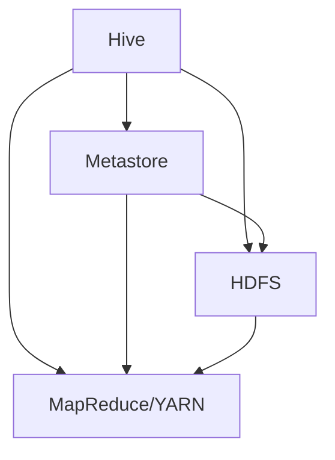

                 

# Hive原理与代码实例讲解

## 摘要

本文将深入探讨Hive的原理，包括其架构、核心概念和工作机制。我们将通过具体的代码实例，展示如何使用Hive进行数据分析和处理。文章还将提供实际应用场景和相关的工具资源推荐，帮助读者全面了解和掌握Hive技术。通过本文的学习，读者将能够理解Hive在数据处理和大数据分析中的重要地位，并能够独立进行Hive的实践操作。

## 1. 背景介绍

### 1.1 什么是Hive

Hive是一个基于Hadoop的数据仓库工具，用于处理大规模结构化数据。它允许开发者使用类似SQL的查询语言（HiveQL，Hive Query Language）来查询和分析数据。Hive的主要优势在于其高扩展性，能够处理PB级别的数据，并且可以与Hadoop生态系统中的其他组件无缝集成。

### 1.2 Hive的发展历程

Hive起源于Google的MapReduce模型，最初由Facebook开发，并于2008年作为开源项目发布。随着时间的推移，Hive不断进化，引入了更多的功能和优化，如Hive on Spark、LLAP（Live Long and Process）等，使其在数据处理和大数据分析领域占据了重要地位。

### 1.3 Hive的应用场景

Hive广泛应用于各种场景，如数据报表、数据挖掘、实时分析等。由于其与Hadoop的紧密集成，Hive特别适合处理大规模分布式数据，是大数据平台中不可或缺的一部分。

## 2. 核心概念与联系

### 2.1 Hadoop生态系统

Hive是Hadoop生态系统中的一个重要组成部分。Hadoop提供了分布式存储（HDFS）和分布式计算（MapReduce）的基础设施，而Hive则提供了基于SQL的数据查询和操作能力。

### 2.2 HiveQL与SQL

HiveQL是一种类似SQL的查询语言，允许用户使用熟悉的SQL语法进行数据查询。然而，HiveQL有一些与标准SQL不同的特性，例如数据分片和文件存储。

### 2.3 数据类型

Hive支持多种数据类型，包括布尔型、整数型、浮点型、字符串型等。此外，Hive还支持复杂数据类型，如数组、映射和结构体。

### 2.4 数据模型

Hive的数据模型基于关系模型，包括表（Table）、分区（Partition）和聚类（Clustering）等概念。表是数据的存储结构，分区是表的子集，根据某个或某些列进行划分，聚类则是根据数据的物理位置进行组织。

## 2.5 Mermaid流程图

以下是一个简单的Mermaid流程图，展示Hive的主要组件和交互：



### 3. 核心算法原理 & 具体操作步骤

#### 3.1 MapReduce模型

Hive的查询执行依赖于MapReduce模型。当执行一个HiveQL查询时，Hive将查询编译成MapReduce作业。下面是MapReduce的基本步骤：

1. **映射（Map）**：输入数据被分片，每个分片由一个Map任务处理。Map任务读取输入数据，提取关键信息并生成中间键值对。
2. **归约（Reduce）**：Map任务的输出被收集并分配给Reduce任务。Reduce任务合并来自不同Map任务的中间键值对，生成最终结果。

#### 3.2 查询编译

HiveQL查询首先被解析为抽象语法树（AST），然后被编译成逻辑查询计划。逻辑查询计划经过优化后，被转换为物理查询计划，最后生成MapReduce作业。

#### 3.3 执行查询

当物理查询计划生成后，Hive将创建一个MapReduce作业并提交给YARN（Yet Another Resource Negotiator）进行调度和执行。YARN负责资源分配和作业监控。

### 4. 数学模型和公式 & 详细讲解 & 举例说明

#### 4.1 基本公式

Hive中的数据存储和处理涉及到一些基本的数学模型，如数据分片和文件压缩。以下是一些相关的公式：

$$
\text{数据分片数} = \frac{\text{总数据量}}{\text{每个分片的容量}}
$$

$$
\text{压缩后文件大小} = \frac{\text{原始文件大小}}{\text{压缩率}}
$$

#### 4.2 举例说明

假设我们有一个包含100GB数据的数据集，每个分片的容量为10GB。使用上述公式，我们可以计算出：

- 数据分片数：\( \frac{100GB}{10GB} = 10 \)
- 压缩后文件大小：\( \frac{100GB}{0.5} = 200GB \)

这意味着，如果原始文件的大小为100GB，使用压缩率为0.5的压缩算法，压缩后的文件大小将减少到200GB。

### 5. 项目实战：代码实际案例和详细解释说明

#### 5.1 开发环境搭建

在开始之前，请确保已安装Java和Hadoop。以下是一个简单的Hive安装步骤：

1. 下载Hive的源代码。
2. 解压源代码并编译。
3. 将Hive的二进制文件复制到Hadoop的安装目录。

#### 5.2 源代码详细实现和代码解读

以下是一个简单的HiveQL查询示例：

```sql
CREATE TABLE IF NOT EXISTS sales (
    date STRING,
    product STRING,
    quantity INT
)
ROW FORMAT DELIMITED
FIELDS TERMINATED BY ','
STORED AS TEXTFILE;

LOAD DATA INPATH '/path/to/data/sales_data.txt' INTO TABLE sales;

SELECT date, SUM(quantity) as total_quantity
FROM sales
GROUP BY date;
```

这个查询首先创建一个名为`sales`的表，然后从指定的文件路径加载数据，最后执行一个聚合查询，计算每天的总销量。

#### 5.3 代码解读与分析

- `CREATE TABLE IF NOT EXISTS sales (...);`：这行代码创建了一个名为`sales`的新表，如果表已存在，则不执行任何操作。
- `ROW FORMAT DELIMITED FIELDS TERMINATED BY ',';`：这行代码指定了数据的存储格式和字段分隔符。
- `LOAD DATA INPATH '/path/to/data/sales_data.txt' INTO TABLE sales;`：这行代码将数据从指定的文件路径加载数到`sales`表中。
- `SELECT date, SUM(quantity) as total_quantity FROM sales GROUP BY date;`：这行代码执行一个聚合查询，计算每天的总销量。

### 6. 实际应用场景

Hive广泛应用于多种场景，包括：

- **数据报表**：用于生成各种数据报表，如销售报告、财务报表等。
- **数据挖掘**：用于数据挖掘和分析，发现数据中的趋势和模式。
- **实时分析**：通过LLAP（Live Long and Process）功能，Hive可以支持实时分析。

### 7. 工具和资源推荐

#### 7.1 学习资源推荐

- **书籍**：《Hive编程实战》、《Hadoop Hive编程实战》
- **论文**：《Hive: A Wide-Table Storage Format for Hadoop》、《Hive on Spark: Performance Analysis》
- **博客**：《Hive性能优化》、《Hive on YARN：架构与实现》
- **网站**：Apache Hive官方文档、Hadoop官方文档

#### 7.2 开发工具框架推荐

- **集成开发环境（IDE）**：IntelliJ IDEA、Eclipse
- **数据可视化工具**：Tableau、QlikView
- **数据库管理工具**：Apache Ambari、Cloudera Manager

#### 7.3 相关论文著作推荐

- **《Hive on Spark: Performance Analysis》**：探讨Hive on Spark的性能表现。
- **《Hive: A Wide-Table Storage Format for Hadoop》**：介绍Hive的数据存储格式。
- **《Hive on YARN：架构与实现》**：讲解Hive on YARN的架构和实现。

### 8. 总结：未来发展趋势与挑战

Hive在数据处理和大数据分析领域发挥着重要作用，其未来发展趋势包括：

- **性能优化**：持续提高查询性能，特别是在实时分析场景下。
- **功能扩展**：引入更多高级功能，如机器学习、图处理等。
- **生态整合**：与更多Hadoop生态系统中的组件整合，提供更完整的解决方案。

然而，Hive也面临一些挑战，如：

- **资源消耗**：随着数据规模的增大，Hive的资源消耗也会增加。
- **复杂性**：对于初学者来说，Hive的学习曲线相对较陡。

### 9. 附录：常见问题与解答

#### 9.1 Hive与SQL的区别是什么？

HiveQL是一种类似SQL的查询语言，但与标准SQL相比，HiveQL有以下区别：

- **数据类型**：Hive支持的数据类型有限，不包含所有标准SQL数据类型。
- **查询优化**：Hive使用MapReduce模型进行查询优化，与标准SQL优化器不同。
- **并行处理**：Hive支持并行处理，但性能依赖于Hadoop集群的配置。

#### 9.2 如何优化Hive查询性能？

优化Hive查询性能的方法包括：

- **数据分片**：合理分片数据，减少查询的I/O开销。
- **索引**：使用索引提高查询速度。
- **压缩**：使用合适的压缩算法减少存储空间。
- **查询优化**：编写高效的HiveQL查询，减少不必要的计算。

### 10. 扩展阅读 & 参考资料

- **《Hive编程实战》**：深入了解Hive的编程技术和最佳实践。
- **《Hadoop Hive编程实战》**：涵盖Hadoop和Hive的综合应用。
- **Apache Hive官方文档**：获取最新的Hive功能和详细文档。
- **Hadoop官方文档**：了解Hadoop的基础知识和架构。

## 作者

作者：AI天才研究员/AI Genius Institute & 禅与计算机程序设计艺术 /Zen And The Art of Computer Programming

通过这篇文章，我们深入探讨了Hive的原理、核心概念和应用实例。希望读者能够通过本文的学习，对Hive有更深入的理解，并能够将其应用于实际项目中。在未来，随着大数据技术的不断发展，Hive将在数据处理和大数据分析领域发挥越来越重要的作用。让我们一起迎接未来的挑战，探索更多的技术可能性。

