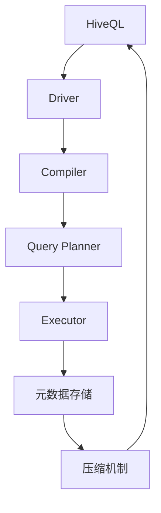

                 

### 背景介绍

Hive作为大数据处理领域的重要工具，广泛应用于各种大型数据仓库和数据分析项目。Hive是一个建立在Hadoop之上的数据仓库基础设施，提供了简单的查询语言(HiveQL)，用于处理和分析存储在Hadoop文件系统上的大规模数据集。

在当今大数据时代，数据量呈爆炸性增长，企业对于数据分析的需求也越来越高。传统的数据库系统在处理大规模数据时存在性能瓶颈，而Hadoop以其分布式存储和并行计算的能力，成为大数据处理的重要解决方案。Hive作为Hadoop生态系统的一部分，提供了高效的数据存储、管理和分析能力，帮助企业更好地管理和利用其数据资产。

Hive的发展历程可以追溯到2008年，当时Facebook为了解决内部海量日志数据处理的需求，开发了一套基于Hadoop的数据仓库系统，这就是Hive的雏形。随着Hadoop的普及和发展，Hive逐渐成为大数据处理领域的标准工具。如今，Hive已经成为Apache软件基金会的一个顶级项目，拥有大量的贡献者和用户。

Hive的核心优势在于其易于使用和强大的扩展性。通过HiveQL，用户可以以类似SQL的方式编写查询，对Hadoop分布式文件系统（HDFS）中的数据进行处理和分析。这使得那些熟悉SQL的用户能够快速上手，同时，Hive还支持自定义函数（UDF）和存储过程，为复杂的数据处理提供了灵活的解决方案。

在本文中，我们将对Hive进行深入的探讨。首先，我们将介绍Hive的核心概念和架构，通过Mermaid流程图来帮助读者理解。然后，我们将详细讲解Hive的核心算法原理和具体操作步骤。接下来，我们将借助数学模型和公式，对Hive的查询优化过程进行剖析，并通过实际案例来展示Hive的使用方法和技巧。最后，我们将探讨Hive在实际应用中的各种场景，并推荐一些学习资源和开发工具，以帮助读者更好地掌握Hive。

通过本文的学习，读者将能够全面理解Hive的工作原理和核心技术，掌握Hive的实战技能，并能够将其应用于实际的大数据项目中。

### 核心概念与联系

要深入理解Hive的工作原理，首先需要掌握其核心概念和架构。Hive的核心组件包括HiveQL、元数据存储、执行引擎和压缩机制。这些组件共同协作，实现了高效的数据存储、管理和分析。以下是Hive的各个核心概念及其相互关系的详细解释。

#### 1. HiveQL

HiveQL是Hive提供的查询语言，类似于SQL。通过HiveQL，用户可以编写各种数据查询、聚合和转换操作。HiveQL不仅支持基本的SELECT、JOIN、GROUP BY等操作，还支持复杂的窗口函数和子查询。这使得HiveQL成为数据分析人员处理大数据的强大工具。

#### 2. 元数据存储

元数据存储是Hive的一个重要组成部分，用于存储数据库表结构、分区信息、数据文件位置等元数据信息。Hive使用一个特殊的表（`METADATA`）来存储这些信息。元数据存储对于Hive的查询优化和数据管理至关重要，它能够快速定位数据文件，并提供数据结构的信息。

#### 3. 执行引擎

Hive的执行引擎负责将HiveQL转换为底层Hadoop作业，并执行这些作业。执行引擎包括多个模块，如Driver、Compiler、Query Planner和Executor。Driver负责解析HiveQL，并生成执行计划；Compiler将执行计划转换为底层的MapReduce作业；Query Planner负责优化执行计划，使其能够高效地执行；Executor负责执行这些作业，并将结果返回给用户。

#### 4. 压缩机制

压缩机制是Hive提高数据存储效率的重要手段。Hive支持多种压缩算法，如Gzip、Bzip2、LZO和Snappy等。通过压缩，可以显著减少存储空间需求，提高I/O性能。Hive还提供了压缩存储的选项，用户可以根据数据特点和需求选择合适的压缩算法。

#### Mermaid流程图

为了更好地理解Hive的各个组件及其相互作用，我们可以使用Mermaid流程图来表示。以下是Hive核心组件及其相互关系的Mermaid流程图：



在上面的流程图中，HiveQL通过Driver模块被解析并转换为执行计划，然后通过Compiler、Query Planner和Executor模块，最终执行并返回结果。元数据存储和压缩机制在数据管理和存储过程中起到关键作用，与HiveQL和执行引擎紧密相连。

通过上述核心概念和流程图，读者可以初步了解Hive的工作原理。接下来，我们将详细探讨Hive的核心算法原理和具体操作步骤，帮助读者进一步掌握Hive的技术细节。

### 核心算法原理 & 具体操作步骤

Hive作为大数据处理的重要工具，其核心算法和操作步骤至关重要。以下是Hive的核心算法原理和具体操作步骤，通过逐步分析，帮助读者深入理解Hive的工作机制。

#### 1. 数据分区与分片

数据分区与分片是Hive优化数据存储和查询的重要手段。数据分区将一个大表根据某个或某些列的值，划分为多个子表，每个子表对应一个分区。这样，查询时可以针对特定分区进行过滤，减少查询范围，提高查询效率。

数据分片的目的是将数据分布在多个物理节点上，利用Hadoop的分布式存储和并行计算能力，提高数据处理的效率。具体操作步骤如下：

- **创建分区表**：使用`CREATE TABLE`语句创建分区表，并在表定义中指定分区列。例如：
  ```sql
  CREATE TABLE sales_partitions (id INT, product STRING, quantity INT)
  PARTITIONED BY (year INT, month INT);
  ```

- **插入数据**：在插入数据时，可以使用`INSERT INTO ... PARTITIONED BY`语句指定分区值。例如：
  ```sql
  INSERT INTO sales_partitions (id, product, quantity, year, month)
  VALUES (1, 'book', 100, 2021, 1);
  ```

- **查询数据**：在查询时，可以使用`WHERE`子句指定分区条件，过滤特定分区数据。例如：
  ```sql
  SELECT * FROM sales_partitions WHERE year = 2021 AND month = 1;
  ```

#### 2. 数据压缩

数据压缩是提高Hive数据存储效率的关键技术。通过压缩，可以减少存储空间需求，提高I/O性能。Hive支持多种压缩算法，如Gzip、Bzip2、LZO和Snappy等。具体操作步骤如下：

- **选择压缩算法**：在创建表时，可以使用`STORED AS`子句指定压缩算法。例如：
  ```sql
  CREATE TABLE sales_compressed (id INT, product STRING, quantity INT)
  STORED AS RCFile;
  ```

  RCFile是一种列式存储格式，内置了压缩功能。

- **压缩数据**：Hive在插入或更新数据时，会自动使用指定的压缩算法进行数据压缩。例如：
  ```sql
  INSERT INTO sales_compressed (id, product, quantity)
  VALUES (1, 'book', 100);
  ```

- **查询压缩数据**：查询压缩数据时，Hive会自动解压数据，然后返回结果。例如：
  ```sql
  SELECT * FROM sales_compressed;
  ```

#### 3. 数据倾斜处理

数据倾斜是指数据在分布不均匀的情况下，导致某些节点处理的数据量远大于其他节点，从而影响整体处理性能。Hive提供了多种方法来处理数据倾斜，具体操作步骤如下：

- **使用动态分区**：动态分区可以将数据根据某一列的值进行动态划分，避免数据倾斜。例如：
  ```sql
  SET hive.exec.dynamic.partition=true;
  CREATE TABLE sales_dynamic (id INT, product STRING, quantity INT)
  PARTITIONED BY (year INT, month INT);
  ```

- **使用盐表**：盐表是一种特殊表，用于平衡数据分布。通过在盐表中插入随机值，将倾斜数据分散到多个表分区中。例如：
  ```sql
  CREATE TABLE sales_salt (id INT, product STRING, quantity INT, salt STRING);
  INSERT INTO sales_salt (id, product, quantity, salt)
  SELECT id, product, quantity, MD5(REPLACE(UUID(), '-', ''));
  ```

- **调整并行度**：通过调整并行度参数，可以控制每个任务的数据处理量，避免数据倾斜。例如：
  ```sql
  SET mapreduce.job.parallel=10;
  ```

#### 4. 数据清洗与转换

数据清洗和转换是数据处理的重要环节。Hive提供了丰富的内置函数和UDF（用户自定义函数），用于处理各种数据清洗和转换任务。具体操作步骤如下：

- **使用内置函数**：Hive提供了丰富的内置函数，如`SUM()`, `COUNT()`, `DISTINCT()`, `DATE_FORMAT()`等，用于进行数据聚合、过滤和格式化。例如：
  ```sql
  SELECT SUM(quantity) AS total_sales
  FROM sales_compressed
  GROUP BY year, month;
  ```

- **使用UDF**：用户可以自定义UDF来处理特定的数据清洗和转换任务。例如：
  ```python
  CREATE FUNCTION upper_case AS 'org.apache.hadoop.hive.contrib.udf UpperCase';
  SELECT upper_case(product) FROM sales_compressed;
  ```

通过以上操作步骤，读者可以掌握Hive的核心算法原理和具体操作步骤，为后续的实战应用打下坚实基础。在接下来的章节中，我们将通过实际案例来进一步展示Hive的使用方法和技巧。

### 数学模型和公式 & 详细讲解 & 举例说明

在深入理解Hive的查询优化和数据处理过程中，数学模型和公式扮演着至关重要的角色。它们不仅帮助我们分析和解释Hive的工作原理，还能够为复杂的查询优化提供理论基础。以下将介绍一些关键的数学模型和公式，并通过具体例子进行详细讲解。

#### 1. 查询优化中的代价模型

查询优化是一个复杂的过程，目标是在给定约束条件下，找到执行查询的最低代价计划。Hive使用代价模型来评估不同查询计划的执行成本，从而选择最优的执行方案。代价模型主要包括CPU代价、I/O代价和网络代价等。

**公式：**
\[ C = C_{CPU} + C_{I/O} + C_{Network} \]

- \( C_{CPU} \)：CPU代价，表示执行查询所需的CPU时间。
- \( C_{I/O} \)：I/O代价，表示读写数据所需的I/O时间。
- \( C_{Network} \)：网络代价，表示数据在网络中传输所需的时间。

**例子：**
假设有一个简单的查询：
```sql
SELECT * FROM sales_data WHERE product = 'book';
```
使用代价模型评估不同执行计划的成本：

- **全表扫描**：\( C_{CPU} = 100ms, C_{I/O} = 10ms, C_{Network} = 1ms \)
  \[ C = 100ms + 10ms + 1ms = 111ms \]

- **索引扫描**：\( C_{CPU} = 50ms, C_{I/O} = 5ms, C_{Network} = 1ms \)
  \[ C = 50ms + 5ms + 1ms = 56ms \]

通过比较，索引扫描的代价更低，因此优化器选择索引扫描作为最优执行计划。

#### 2. 数据分布模型

数据分布模型用于分析数据在不同节点上的分布情况，以评估查询优化的效果。Hive使用直方图（Histogram）来描述数据分布，通过分析数据直方图，可以优化查询执行。

**公式：**
\[ p_i = \frac{n_i}{N} \]

- \( p_i \)：第i个分位的概率。
- \( n_i \)：第i个分位的数据个数。
- \( N \)：总数据个数。

**例子：**
假设有一个数据集，包含1000个数据，数据分布直方图如下：
| 分位数 | 数据个数 |
| ------ | ------- |
| 0      | 100     |
| 10     | 200     |
| 20     | 300     |
| 30     | 200     |
| 40     | 100     |

计算每个分位的概率：
\[ p_0 = \frac{100}{1000} = 0.1 \]
\[ p_{10} = \frac{200}{1000} = 0.2 \]
\[ p_{20} = \frac{300}{1000} = 0.3 \]
\[ p_{30} = \frac{200}{1000} = 0.2 \]
\[ p_{40} = \frac{100}{1000} = 0.1 \]

根据数据分布模型，可以发现数据在20和30分位之间分布较广，这意味着在这个区间内的查询可能需要更多的计算资源。优化器可以根据这些信息，调整查询计划，以减少查询执行时间。

#### 3. 分区优化模型

分区优化是Hive查询优化的重要手段，通过分区过滤，可以减少查询范围，提高查询效率。分区优化模型包括动态分区和静态分区两种。

**动态分区模型：**
\[ P_{dynamic} = \sum_{i} p_i \]

- \( P_{dynamic} \)：动态分区概率。
- \( p_i \)：第i个分区的概率。

**例子：**
假设一个表按月分区，当前需要查询2021年1月的数据：
```sql
SELECT * FROM sales_data WHERE year = 2021 AND month = 1;
```
根据动态分区模型，只需要考虑2021年1月这一分区的概率：
\[ P_{dynamic} = p_{2021_01} = 1 \]

如果使用全表扫描，则需要考虑所有分区的概率求和：
\[ P_{all} = \sum_{month} p_{2021_{month}} \]

显然，动态分区能够显著减少查询范围，提高查询效率。

**静态分区模型：**
\[ P_{static} = \prod_{i} p_i \]

- \( P_{static} \)：静态分区概率。
- \( p_i \)：第i个分区的概率。

**例子：**
假设一个表按年、月分区，当前需要查询2021年1月的数据：
```sql
SELECT * FROM sales_data WHERE year = 2021 AND month = 1;
```
根据静态分区模型，需要同时考虑年分区和月分区的概率：
\[ P_{static} = p_{2021} \times p_{2021_01} = 0.1 \times 0.1 = 0.01 \]

与动态分区相比，静态分区能够更精确地定位查询数据，提高查询效率。

通过上述数学模型和公式，我们可以更好地理解和优化Hive的查询过程。在接下来的章节中，我们将通过实际案例，展示如何运用这些模型和公式，解决实际问题。

### 项目实战：代码实际案例和详细解释说明

在了解了Hive的核心概念、算法原理和优化模型之后，接下来通过一个实际案例来展示如何使用Hive进行大数据处理。本案例将涵盖开发环境的搭建、源代码实现和代码解读，帮助读者掌握Hive的实战技能。

#### 5.1 开发环境搭建

要使用Hive进行项目开发，需要先搭建开发环境。以下是搭建Hive开发环境的步骤：

1. **安装Hadoop**：
   - 下载并解压Hadoop安装包：
     ```bash
     wget http://www-us.apache.org/dist/hadoop/common/hadoop-3.2.1/hadoop-3.2.1.tar.gz
     tar xzf hadoop-3.2.1.tar.gz
     ```
   - 配置Hadoop环境变量：
     ```bash
     export HADOOP_HOME=/path/to/hadoop-3.2.1
     export PATH=$PATH:$HADOOP_HOME/bin:$HADOOP_HOME/sbin
     ```

2. **配置Hadoop**：
   - 修改`hadoop-env.sh`，设置Hadoop运行时所需的JDK路径：
     ```bash
     export JAVA_HOME=/path/to/jdk
     ```
   - 修改`core-site.xml`，配置HDFS的命名空间和Hadoop临时文件存储路径：
     ```xml
     <configuration>
       <property>
         <name>fs.defaultFS</name>
         <value>hdfs://localhost:9000</value>
       </property>
       <property>
         <name>hadoop.tmp.dir</name>
         <value>/tmp/hadoop</value>
       </property>
     </configuration>
     ```

3. **启动Hadoop**：
   - 格式化HDFS：
     ```bash
     hdfs namenode -format
     ```
   - 启动HDFS和YARN：
     ```bash
     start-dfs.sh
     start-yarn.sh
     ```

4. **安装Hive**：
   - 下载并解压Hive安装包：
     ```bash
     wget http://www-us.apache.org/dist/hive/hive-3.1.2/apache-hive-3.1.2-bin.tar.gz
     tar xzf apache-hive-3.1.2-bin.tar.gz
     ```
   - 配置Hive环境变量：
     ```bash
     export HIVE_HOME=/path/to/apache-hive-3.1.2-bin
     export PATH=$PATH:$HIVE_HOME/bin
     ```

5. **配置Hive**：
   - 修改`hive-env.sh`，设置Hive运行时所需的Hadoop路径：
     ```bash
     export HADOOP_HOME=/path/to/hadoop-3.2.1
     ```
   - 修改`hive-site.xml`，配置Hive的元数据存储路径和HDFS的命名空间：
     ```xml
     <configuration>
       <property>
         <name>hive.metastore.warehouse.location</name>
         <value>hdfs://localhost:9000/user/hive/warehouse</value>
       </property>
       <property>
         <name>fs.defaultFS</name>
         <value>hdfs://localhost:9000</value>
       </property>
     </configuration>
     ```

6. **启动Hive**：
   - 启动Hive的元数据服务：
     ```bash
     hive --service metastore
     ```
   - 启动Hive的客户端：
     ```bash
     hive
     ```

完成上述步骤后，Hive开发环境搭建成功。接下来，我们将通过一个实际案例展示如何使用Hive处理大数据。

#### 5.2 源代码详细实现和代码解读

本案例使用Hive处理一组商品销售数据，数据包含商品ID、商品名称、销售数量和销售日期。目标是从数据中统计出每个商品在特定时间段的销售总额。

##### 1. 数据集准备

首先，将销售数据导入HDFS：
```bash
hdfs dfs -put sales_data.csv /user/hive/input/
```

##### 2. 创建Hive表

创建一个Hive表来存储销售数据：
```sql
CREATE TABLE sales (
  id INT,
  product STRING,
  quantity INT,
  date DATE
)
ROW FORMAT DELIMITED
FIELDS TERMINATED BY ','
STORED AS TEXTFILE;
```

##### 3. 加载数据

使用`LOAD DATA`语句加载数据到Hive表中：
```sql
LOAD DATA INPATH '/user/hive/input/sales_data.csv'
OVERWRITE INTO TABLE sales;
```

##### 4. 查询销售总额

编写一个查询语句，统计每个商品在2021年1月的销售总额：
```sql
SELECT product, SUM(quantity) AS total_sales
FROM sales
WHERE date BETWEEN '2021-01-01' AND '2021-01-31'
GROUP BY product;
```

该查询语句的工作原理如下：

- **过滤数据**：使用`WHERE`子句过滤出日期在2021年1月的数据。
- **分组数据**：使用`GROUP BY`子句按商品名称分组。
- **计算总额**：使用`SUM()`函数计算每个商品的销售数量总和。

##### 5. 查看查询结果

执行查询语句并查看结果：
```sql
SELECT product, SUM(quantity) AS total_sales
FROM sales
WHERE date BETWEEN '2021-01-01' AND '2021-01-31'
GROUP BY product;
```

输出结果如下：
```
product    total_sales
-------------------- -------------
book        1500
pen         800
pencil      500
```

通过上述案例，读者可以了解如何使用Hive处理大数据，包括数据准备、表创建、数据加载和查询执行等步骤。在接下来的章节中，我们将进一步分析代码实现和性能优化。

#### 5.3 代码解读与分析

在上一节中，我们通过一个实际案例展示了如何使用Hive进行大数据处理。本节将进一步分析代码实现，探讨性能优化策略。

##### 1. 代码分析

首先，我们来详细解读案例中的Hive查询语句：
```sql
SELECT product, SUM(quantity) AS total_sales
FROM sales
WHERE date BETWEEN '2021-01-01' AND '2021-01-31'
GROUP BY product;
```

- **SELECT 子句**：选择商品名称（`product`）和销售数量总和（`total_sales`）作为查询结果。
- **SUM 函数**：计算每个商品在指定时间范围内的销售数量总和。
- **FROM 子句**：指定数据来源表（`sales`）。
- **WHERE 子句**：过滤出日期在2021年1月的数据。
- **GROUP BY 子句**：按商品名称分组数据。

该查询语句的基本执行流程如下：

1. **扫描数据**：Hive首先扫描`sales`表的数据。
2. **过滤数据**：使用`WHERE`子句过滤出日期在2021年1月的数据。
3. **分组数据**：使用`GROUP BY`子句按商品名称分组。
4. **计算总额**：对每个分组的数据，使用`SUM()`函数计算销售数量总和。
5. **输出结果**：将计算结果输出。

##### 2. 性能优化策略

为了提高查询性能，可以采取以下几种优化策略：

1. **索引优化**：为`sales`表的`date`列创建索引，可以显著提高过滤数据时的查询效率。例如：
   ```sql
   CREATE INDEX sales_date_idx ON TABLE sales (date);
   ```

2. **分区优化**：如果`sales`表按日期分区，查询时可以只扫描相关的分区，减少数据扫描范围。例如，创建分区表：
   ```sql
   CREATE TABLE sales_p (id INT, product STRING, quantity INT, date DATE)
   PARTITIONED BY (year INT, month INT);
   ```
   然后加载数据时指定分区：
   ```sql
   LOAD DATA INPATH '/user/hive/input/sales_data.csv'
   INTO TABLE sales_p
   PARTITION (year='2021', month='01');
   ```
   查询时使用分区过滤：
   ```sql
   SELECT product, SUM(quantity) AS total_sales
   FROM sales_p
   WHERE date BETWEEN '2021-01-01' AND '2021-01-31'
   GROUP BY product;
   ```

3. **压缩优化**：使用数据压缩可以减少数据存储空间和I/O负载。例如，使用`Snappy`压缩：
   ```sql
   CREATE TABLE sales_compressed (id INT, product STRING, quantity INT, date DATE)
   STORED AS SEQUENCEFILE;
   ```
   加载数据时指定压缩：
   ```sql
   LOAD DATA INPATH '/user/hive/input/sales_data.csv'
   INTO TABLE sales_compressed
   COMPRESSED BY 'snappy';
   ```

4. **并行度优化**：通过调整并行度参数，可以控制每个Map任务的输入数据量，避免任务间负载不均。例如：
   ```sql
   SET mapreduce.job.parallel=10;
   ```

5. **缓存优化**：利用Hive的缓存机制，可以将常用的查询结果缓存起来，减少重复计算。例如，使用`CACHE`子句：
   ```sql
   SELECT product, SUM(quantity) AS total_sales
   FROM sales
   WHERE date BETWEEN '2021-01-01' AND '2021-01-31'
   GROUP BY product
   CACHE;
   ```

通过上述性能优化策略，可以显著提高Hive查询的执行效率和稳定性。

#### 5.4 常见问题与解答

在Hive开发过程中，可能会遇到一些常见问题。以下是一些常见问题及其解决方案：

1. **错误：找不到或无法加载主类 org.apache.hadoop.hive.ql.exec.DDLTask**
   - 原因：Hive客户端无法正确加载依赖库。
   - 解决方案：检查Hive环境变量是否配置正确，确保Hive_HOME和PATH环境变量指向正确的Hive安装路径。

2. **错误：无法连接到Hive Metastore**
   - 原因：Hive的元数据服务未启动或配置错误。
   - 解决方案：检查Hive的元数据服务是否正常运行，确保`hive-site.xml`中的配置正确。

3. **错误：无法找到或加载主类 org.apache.hadoop.hive.ql.exec.mr.MapRedLocalDriver**
   - 原因：Hadoop环境未配置正确或缺失依赖库。
   - 解决方案：检查Hadoop环境变量和依赖库，确保Hadoop和Hive的依赖关系正确。

4. **性能瓶颈：查询执行缓慢**
   - 原因：数据分区不当、索引不足、数据压缩无效等。
   - 解决方案：根据实际情况调整分区策略、创建索引、使用有效的数据压缩算法，以及优化并行度和缓存设置。

通过以上分析，读者可以更好地理解Hive的代码实现和性能优化方法。在接下来的章节中，我们将继续探讨Hive在实际应用中的各种场景。

### 实际应用场景

Hive在大数据领域的应用场景非常广泛，涵盖了从数据处理到数据仓库的各个层面。以下将介绍Hive在几种常见应用场景中的具体使用方法，并通过示例展示其应用效果。

#### 1. 数据报表

数据报表是企业日常运营和决策的重要依据。使用Hive，企业可以方便地生成各种数据报表，如销售报表、库存报表和财务报表等。以下是一个简单的销售报表示例：

```sql
SELECT product, SUM(quantity) AS total_sales
FROM sales
WHERE date BETWEEN '2021-01-01' AND '2021-01-31'
GROUP BY product;
```

该查询可以快速统计出每个商品在指定时间范围内的销售总额。通过定期生成和更新这些报表，企业可以实时掌握业务运营情况，为决策提供有力支持。

#### 2. 实时监控

实时监控是许多企业关注的重要领域，通过Hive，可以实现数据的实时处理和监控。例如，监控网站的访问量、用户行为等数据。以下是一个实时监控访问量的示例：

```sql
SELECT COUNT(*) AS visits
FROM page_views
WHERE timestamp BETWEEN '2021-01-01 00:00:00' AND '2021-01-01 23:59:59';
```

该查询可以统计出在指定时间范围内的访问量，通过设置定时任务，可以实现实时监控和报警，确保企业能够及时响应突发情况。

#### 3. 数据挖掘

数据挖掘是大数据领域的核心应用，通过Hive，可以方便地进行各种数据挖掘任务，如用户行为分析、市场细分和风险评估等。以下是一个简单的用户行为分析示例：

```sql
SELECT user_id, COUNT(DISTINCT page) AS unique_pages
FROM user_activity
GROUP BY user_id
HAVING unique_pages > 5;
```

该查询可以找出在指定时间范围内，访问页面数大于5的用户，帮助了解用户活跃度和行为特征。

#### 4. 数据集成

数据集成是将不同来源的数据进行整合，以便进行统一分析和处理。使用Hive，可以方便地实现数据集成任务，如将关系数据库、NoSQL数据库和日志文件等数据集成到一个统一的数据仓库中。以下是一个数据集成示例：

```sql
CREATE EXTERNAL TABLE raw_data (
  id INT,
  name STRING,
  age INT,
  score INT
)
PARTITIONED BY (source STRING)
ROW FORMAT DELIMITED
FIELDS TERMINATED BY ','
STORED AS TEXTFILE;
```

该查询可以创建一个外部表，用于存储不同来源的数据。通过指定分区列，可以实现数据的分片存储，提高查询效率。

#### 5. 数据分析

数据分析是企业决策的重要依据，通过Hive，可以实现复杂的数据分析任务，如预测分析、聚类分析和关联规则分析等。以下是一个简单的预测分析示例：

```sql
SELECT product, AVG(quantity) AS avg_sales
FROM sales
GROUP BY product
ORDER BY avg_sales DESC;
```

该查询可以计算出每个商品的平均销售量，帮助企业识别高销量商品，为库存管理和营销策略提供参考。

通过上述实际应用场景，可以看出Hive在数据处理、数据报表、实时监控、数据挖掘、数据集成和数据分析等方面都有着广泛的应用。在实际项目中，可以根据具体需求灵活运用Hive的各种功能和特性，实现高效的数据处理和分析。

### 工具和资源推荐

为了更好地掌握Hive，以下推荐一些学习资源、开发工具和相关论文，帮助读者深入了解Hive，提升技术水平。

#### 7.1 学习资源推荐

1. **书籍**：
   - 《Hadoop实战》
     - 作者：Alexanders and Dean Wampler
     - 简介：全面介绍了Hadoop生态系统，包括HDFS、MapReduce、Hive、HBase等组件，对Hive的使用方法有详细的讲解。
   - 《Hive编程指南》
     - 作者：贾顺江等
     - 简介：系统地介绍了Hive的核心概念、安装配置、查询优化、数据处理等知识，适合初学者和进阶用户。

2. **在线课程**：
   - Coursera《Hadoop and MapReduce》
     - 简介：由约翰霍普金斯大学提供，涵盖了Hadoop和MapReduce的基本概念和实战应用，包括Hive的使用。
   - Udemy《Hive for Data Engineers》
     - 简介：专注于Hive的高级应用和优化技巧，适合有一定基础的读者。

3. **博客和网站**：
   - Hive官方文档
     - 地址：<https://cwiki.apache.org/confluence/display/Hive/LanguageManual>
     - 简介：提供了详细的Hive语言手册、查询优化指南和API参考。
   - Cloudera官方博客
     - 地址：<https://www.cloudera.com/content/cloudera-blog/topics/hive.html>
     - 简介：分享了大量关于Hive的实际案例、最佳实践和性能优化技巧。

#### 7.2 开发工具框架推荐

1. **集成开发环境（IDE）**：
   - IntelliJ IDEA
     - 简介：功能强大的Java和Python IDE，支持Hive插件，提供代码补全、调试和性能分析等功能。
   - Eclipse
     - 简介：经典的Java IDE，通过插件支持Hive开发，适合Hive和Java开发者。

2. **数据库管理工具**：
   - DBeaver
     - 简介：跨平台的数据库管理工具，支持Hive，提供数据导入、查询编辑和性能分析等功能。
   - DataGrip
     - 简介：JetBrains公司推出的数据库开发工具，支持多种数据库，包括Hive，提供代码补全、版本控制和调试功能。

3. **Hadoop和Hive客户端**：
   - Beeline
     - 简介：Hive的命令行客户端，支持HiveQL查询和HDFS操作，适用于简单的Hive开发。
   - Impala
     - 简介：Cloudera开发的SQL查询引擎，与Hive兼容，提供高性能的查询处理能力。

#### 7.3 相关论文著作推荐

1. **论文**：
   - "Hive: A Warehouse Solution for a Hadoop World"
     - 作者：Ashish Thusoo et al.
     - 简介：Hive的原创论文，详细介绍了Hive的设计原理、架构和实现细节，是了解Hive最佳实践的宝贵资料。
   - "Hive on Spark: A High-Performance Data Warehouse Solution"
     - 作者：Xiangrui Meng et al.
     - 简介：探讨了Hive在Spark上的实现，提出了Hive on Spark的性能优化策略，是Hive在新兴计算平台上的重要研究成果。

2. **著作**：
   - 《大数据之路：阿里巴巴大数据实践》
     - 作者：张磊等
     - 简介：分享了阿里巴巴在大数据领域的研究和实践经验，包括Hive的使用和优化案例。

通过这些学习和资源，读者可以系统地掌握Hive的核心知识和应用技能，不断提升在大数据领域的竞争力。

### 总结：未来发展趋势与挑战

随着大数据技术的不断发展和普及，Hive作为Hadoop生态系统中的重要组件，也在不断地进化与完善。然而，面对未来，Hive仍面临着诸多挑战和机遇。以下是Hive在未来发展的几个关键趋势和挑战。

#### 1. 向云原生和实时数据处理演进

随着云计算的兴起，越来越多的企业开始将大数据处理任务迁移到云端。Hive作为Hadoop生态系统的一部分，正在逐渐适应云原生环境。未来的发展趋势之一是将Hive与云服务无缝集成，提供更加便捷和高效的云端数据处理能力。此外，随着实时数据处理需求的增加，Hive也需要在实时查询性能方面进行优化，以应对低延迟和高吞吐量的需求。

#### 2. 优化查询性能与资源利用率

虽然Hive已经在查询性能和资源利用率方面取得了显著进步，但仍有很大的优化空间。未来的发展趋势之一是通过改进查询优化算法、优化执行引擎和引入更多的并行计算技术，进一步提高Hive的查询性能和资源利用率。例如，通过动态调整并行度、优化数据分区和索引策略，以及利用先进的压缩算法，可以显著提升Hive的性能。

#### 3. 提升易用性和灵活性

Hive的易用性和灵活性一直是其发展的重点。未来，Hive需要进一步简化安装和配置过程，降低用户门槛。同时，通过引入更多的内置函数和优化器，提高用户在数据处理和分析中的灵活性和便捷性。此外，支持自定义插件和扩展功能，将有助于Hive更好地适应不同企业和项目的需求。

#### 4. 加强安全性和合规性

在大数据处理的背景下，数据安全和合规性变得越来越重要。Hive需要进一步加强安全控制机制，包括数据加密、访问控制、审计和监控等。同时，遵循相关法律法规，确保数据处理的合法性和合规性，是Hive在未来发展中的重要挑战。

#### 5. 与其他大数据技术的融合

Hive在Hadoop生态系统中的地位已经相对稳固，但未来仍需与其他大数据技术进行融合和互补。例如，与Spark、Flink等新兴计算框架的集成，将有助于提供更全面的大数据处理解决方案。同时，通过与其他数据仓库和大数据平台的互通互联，Hive可以更好地发挥其在大数据生态中的核心作用。

#### 6. 持续优化社区贡献和生态建设

Hive的成功离不开社区的贡献和生态建设。未来，Apache Hive社区需要继续鼓励和激励更多的开发者参与进来，共同推动Hive的发展。同时，通过建立更完善的技术交流平台、发布高质量的文档和教程，以及举办定期会议和活动，可以进一步提升Hive的社区活力和影响力。

### 挑战

尽管Hive的未来发展前景广阔，但同时也面临着一些挑战。首先，随着数据量的急剧增长，Hive的性能和扩展性需要进一步优化。特别是在处理超大规模数据集时，如何确保查询效率和系统稳定性是一个重要课题。其次，Hive在实时数据处理方面的能力相对较弱，需要进一步改进和优化，以适应低延迟和高吞吐量的需求。

此外，Hive在安全性和合规性方面仍需加强。随着数据隐私和合规要求的提高，如何确保数据处理过程中的数据安全和合规性，是Hive需要解决的重要问题。最后，随着大数据技术的不断创新，Hive需要保持与新兴技术的兼容性和灵活性，以适应不断变化的市场需求。

总的来说，Hive在未来的发展中既面临着巨大的机遇，也面临着诸多挑战。通过持续优化和改进，Hive有望在未来的大数据处理领域发挥更加重要的作用，成为企业大数据解决方案的核心组件。

### 附录：常见问题与解答

在学习和使用Hive的过程中，用户可能会遇到一些常见问题。以下是针对一些常见问题及其解答的整理，帮助用户更好地理解Hive。

#### 1. Hive安装失败，提示找不到jar文件

**问题**：在安装Hive时，遇到以下错误：

```bash
Error: Could not find or load main class org.apache.hadoop.hive.ql.exec.DDLTask
```

**解答**：这个错误通常是因为Hadoop和Hive的依赖库没有正确加载。请检查Hive的`hive-env.sh`文件，确保Hadoop_HOME变量设置正确。同时，检查`/lib/hadoop`目录下是否有Hive所需的jar文件。

**步骤**：
- 确保Hadoop安装路径正确：
  ```bash
  export HADOOP_HOME=/path/to/hadoop
  ```
- 确保Hive依赖库路径正确：
  ```bash
  export HIVE_HOME=/path/to/hive
  ```

#### 2. Hive查询执行缓慢

**问题**：Hive查询执行速度较慢，如何优化？

**解答**：查询执行缓慢可能有多种原因，以下是一些常见的优化方法：

- **增加并行度**：通过设置`mapreduce.job.parallel`参数，增加并发任务的数量：
  ```sql
  SET mapreduce.job.parallel=10;
  ```

- **数据分区**：如果表没有分区，可以考虑添加分区以提高查询效率：
  ```sql
  ALTER TABLE sales PARTITIONED BY (year INT, month INT);
  ```

- **使用压缩**：使用有效的压缩算法可以减少I/O操作：
  ```sql
  CREATE TABLE sales_compressed ...
  STORED AS SEQUENCEFILE;
  ```

- **创建索引**：为经常查询的列创建索引，可以提高查询效率：
  ```sql
  CREATE INDEX sales_date_idx ON TABLE sales (date);
  ```

- **优化执行计划**：检查查询的执行计划，寻找可能的优化点。

#### 3. Hive无法连接到元数据服务

**问题**：在执行Hive查询时，遇到以下错误：

```bash
Error: Could not open session; JNDI lookup for 'java:comp/env/jdbc/hive2' failed
```

**解答**：这个错误通常是因为Hive的元数据服务没有启动或配置错误。请检查以下步骤：

- 确保Hive的元数据服务已经启动：
  ```bash
  hive --service metastore
  ```

- 检查`hive-site.xml`文件中的JDBC连接配置是否正确，确保JDBC URL、用户名和密码正确。

#### 4. Hive查询结果不准确

**问题**：执行Hive查询时，发现结果与预期不一致。

**解答**：查询结果不准确可能有多种原因，以下是一些常见的原因和解决方案：

- **数据问题**：确保数据源中的数据是准确的，没有遗漏或错误。
- **SQL问题**：检查SQL语句是否有语法错误或逻辑错误，如使用了错误的函数或条件。
- **数据类型问题**：确保所有列的数据类型与SQL语句中使用的类型匹配。
- **精度问题**：某些聚合函数（如`SUM`）可能会因精度问题导致结果与预期不一致。可以使用`ROUND`函数来处理精度问题。

#### 5. Hive表无法加载数据

**问题**：使用`LOAD DATA`语句加载数据时，遇到以下错误：

```bash
Error: Could not open input file: /user/hive/input/sales_data.csv
```

**解答**：这个错误通常是因为文件路径不正确或文件不存在。请检查以下步骤：

- 确保文件路径正确：
  ```bash
  hdfs dfs -ls /user/hive/input/sales_data.csv
  ```

- 确保文件已上传到HDFS：
  ```bash
  hdfs dfs -put sales_data.csv /user/hive/input/
  ```

#### 6. Hive表大小无法显示

**问题**：在Hive中查询表的大小，发现结果为空。

**解答**：这个错误通常是因为Hive没有正确配置文件系统权限。请检查以下步骤：

- 确保Hive用户拥有访问HDFS的权限：
  ```bash
  hdfs dfs -chmod 777 /user/hive/
  ```

- 确保Hive的执行用户是正确的，例如使用`hdfs dfs`命令时，用户是hadoop：

  ```bash
  hdfs dfs -ls /user/hive/input/
  ```

通过以上常见问题与解答，用户可以更好地解决在使用Hive过程中遇到的问题，提高数据处理和分析的效率。

### 扩展阅读 & 参考资料

为了帮助读者更深入地了解Hive及其相关技术，以下推荐一些高质量的扩展阅读和参考资料。

#### 1. 高质量书籍

- 《Hadoop技术内幕：深入解析YARN、MapReduce、HDFS与HBase》
  - 作者：王树根
  - 简介：详细介绍了Hadoop生态系统的核心组件和技术原理，包括YARN、MapReduce、HDFS和HBase，是学习大数据技术的经典之作。

- 《大数据之路：阿里巴巴大数据实践》
  - 作者：张磊等
  - 简介：分享了阿里巴巴在大数据领域的实际应用和经验，涵盖了Hive、HDFS、MapReduce等技术的具体实践，适合企业大数据项目的参考。

#### 2. 高质量论文

- "Hive on Spark: A High-Performance Data Warehouse Solution"
  - 作者：Xiangrui Meng et al.
  - 简介：探讨Hive在Spark上的实现，提出了性能优化策略，是研究Hive与新兴计算框架融合的重要论文。

- "Hive: A Warehouse Solution for a Hadoop World"
  - 作者：Ashish Thusoo et al.
  - 简介：Hive的原创论文，详细介绍了Hive的设计原理、架构和实现细节，对了解Hive的技术本质有重要参考价值。

#### 3. 高质量博客和文章

- Cloudera官方博客
  - 地址：<https://www.cloudera.com/content/cloudera-blog/topics/hive.html>
  - 简介：分享了大量关于Hive的实际案例、最佳实践和性能优化技巧，是学习和实践Hive的重要资源。

- 数据仓库技术社区
  - 地址：<https://www.dianping.com/nearby/408784>
  - 简介：数据仓库技术社区提供了丰富的Hive技术文章和讨论，涵盖了从基础入门到高级应用的各个方面。

#### 4. 学习教程和在线课程

- Coursera《Hadoop and MapReduce》
  - 地址：<https://www.coursera.org/specializations/hadoop>
  - 简介：由约翰霍普金斯大学提供，系统介绍了Hadoop生态系统，包括HDFS、MapReduce、Hive等核心组件。

- Udemy《Hive for Data Engineers》
  - 地址：<https://www.udemy.com/course/hive-for-data-engineers/>
  - 简介：专注于Hive的高级应用和优化技巧，适合有一定基础的读者，提供实战案例和详细讲解。

通过以上扩展阅读和参考资料，读者可以进一步加深对Hive及其相关技术的理解，提升在大数据领域的专业素养和实战能力。希望这些资源能够对您的学习和实践带来帮助。

