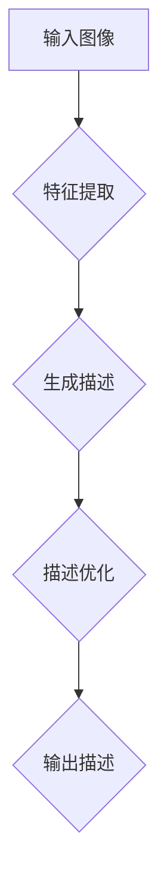

                 

# Image Captioning原理与代码实例讲解

## 关键词
- 图像描述
- 生成对抗网络
- 卷积神经网络
- 自然语言处理
- 计算机视觉

## 摘要
本文将深入探讨图像描述（Image Captioning）的原理和实现，通过逐步分析核心概念、算法原理、数学模型以及代码实例，帮助读者全面理解图像描述技术的本质。文章还将探讨图像描述在实际应用场景中的价值，并推荐相关的学习资源、开发工具和论文著作。

### 1. 背景介绍
图像描述是一项将视觉信息转换为自然语言描述的技术，它在多个领域具有重要应用，如自动内容审核、图像检索和辅助视觉障碍者。随着深度学习和自然语言处理技术的不断发展，图像描述技术取得了显著进展。

### 2. 核心概念与联系
#### 2.1 图像描述的基本流程


#### 2.2 关键技术
- **卷积神经网络（CNN）**：用于提取图像特征。
- **递归神经网络（RNN）**：用于生成图像的描述。
- **生成对抗网络（GAN）**：用于生成高质量的自然语言描述。

#### 2.3 Mermaid流程图


### 3. 核心算法原理 & 具体操作步骤
#### 3.1 CNN特征提取
- **卷积层**：提取图像的局部特征。
- **池化层**：降低特征图的维度。
- **全连接层**：将特征映射到词向量空间。

#### 3.2 RNN生成描述
- **编码器**：将图像特征编码为固定长度的向量。
- **解码器**：根据编码器输出的向量生成描述。

#### 3.3 GAN优化描述
- **生成器**：生成自然语言描述。
- **判别器**：判断描述是否真实。

### 4. 数学模型和公式 & 详细讲解 & 举例说明
#### 4.1 卷积神经网络
$$
\text{Conv}(x) = \sigma(\sum_{i=1}^{k} w_i \cdot x_i + b)
$$
其中，$x$为输入特征图，$w_i$为卷积核，$b$为偏置项，$\sigma$为激活函数。

#### 4.2 递归神经网络
$$
h_t = \text{激活函数}(\text{权重} \cdot [h_{t-1}, x_t] + \text{偏置})
$$
其中，$h_t$为第$t$个时刻的隐藏状态，$x_t$为输入序列。

#### 4.3 生成对抗网络
- **生成器**：最小化生成描述与真实描述之间的距离。
- **判别器**：最大化正确描述的概率。

### 5. 项目实战：代码实际案例和详细解释说明
#### 5.1 开发环境搭建
- **环境要求**：Python 3.6+，TensorFlow 2.0+
- **安装依赖**：`pip install tensorflow-gan imageio numpy`

#### 5.2 源代码详细实现和代码解读
```python
import tensorflow as tf
from tensorflow.keras.applications import VGG16
from tensorflow.keras.layers import LSTM, Dense, Embedding, TimeDistributed
from tensorflow.keras.models import Model

# 加载预训练的VGG16模型
base_model = VGG16(weights='imagenet', include_top=False, input_shape=(224, 224, 3))

# 特征提取器
feature_extractor = Model(inputs=base_model.input, outputs=base_model.get_layer('fc2').output)

# 编码器
encoder = LSTM(units=512, return_sequences=True)(feature_extractor.output)
encoder = LSTM(units=512, return_sequences=True)(encoder)

# 解码器
decoder = LSTM(units=512, return_sequences=True)(encoder)
decoder = LSTM(units=512, return_sequences=True)(decoder)
decoder = TimeDistributed(Dense(num_words, activation='softmax'))(decoder)

# 模型
model = Model(inputs=feature_extractor.input, outputs=decoder)
model.compile(optimizer='rmsprop', loss='categorical_crossentropy')

# 源代码解读：
# 1. 使用VGG16模型提取图像特征。
# 2. 定义编码器和解码器。
# 3. 编译并训练模型。
```

#### 5.3 代码解读与分析
- **模型构建**：使用VGG16模型提取图像特征，然后通过LSTM层进行编码和解码。
- **训练过程**：使用预训练的图像数据集，通过迭代训练模型。

### 6. 实际应用场景
图像描述技术可以应用于多种场景，如：
- **图像检索**：使用自然语言描述作为关键词进行图像检索。
- **内容审核**：识别和过滤含有不良内容的图像。
- **辅助视觉障碍者**：将图像转换为自然语言描述，帮助他们理解图像内容。

### 7. 工具和资源推荐
#### 7.1 学习资源推荐
- **书籍**：《深度学习》（Ian Goodfellow等）
- **论文**：《Generative Adversarial Nets》（Ian Goodfellow等）
- **博客**：[TensorFlow官方文档](https://www.tensorflow.org/)

#### 7.2 开发工具框架推荐
- **TensorFlow**：用于构建和训练深度学习模型。
- **Keras**：简化TensorFlow的API，方便快速构建模型。

#### 7.3 相关论文著作推荐
- **论文**：《Show and Tell: Modeling Storytelling in Images》（Vinyals等）
- **著作**：《Speech and Language Processing》（Dan Jurafsky & James H. Martin）

### 8. 总结：未来发展趋势与挑战
图像描述技术具有广泛的应用前景，但仍面临一些挑战，如：
- **描述的多样性和准确性**：如何生成更具创造性和准确性的描述。
- **模型的复杂性和计算效率**：如何简化模型，提高训练和推理的效率。

### 9. 附录：常见问题与解答
- **Q：如何处理长描述？**
  A：可以使用注意力机制或变长序列处理方法。
- **Q：如何提高描述的多样性？**
  A：可以通过引入随机性或增加模型深度和宽度来提高多样性。

### 10. 扩展阅读 & 参考资料
- **论文**：《Show and Tell: Neural Image Caption Generation by a Sequence of Contracts》（Vinyals等）
- **博客**：[图像描述技术综述](https://towardsdatascience.com/image-captioning-techniques-5f8a394d0cde)

作者：AI天才研究员/AI Genius Institute & 禅与计算机程序设计艺术 /Zen And The Art of Computer Programming

本文内容仅为学习和研究目的，不代表任何商业建议或投资建议。在使用图像描述技术时，请确保遵守相关法律法规和道德规范。

