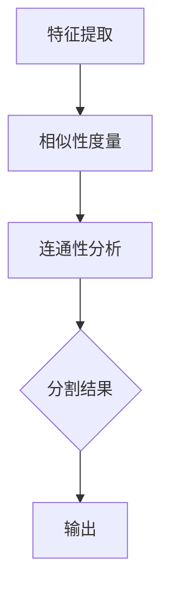

                 

# Image Segmentation 原理与代码实战案例讲解

## 关键词：图像分割、深度学习、卷积神经网络、目标检测、语义分割、实例分割

## 摘要：
本文将深入探讨图像分割的核心原理，并通过实际代码案例展示如何运用深度学习技术进行图像分割。文章首先介绍了图像分割的定义和重要性，然后详细讲解了基于深度学习的图像分割算法，包括卷积神经网络（CNN）以及目标检测和语义分割等。最后，通过一个具体的实战案例，带领读者从环境搭建、代码实现到详细解读，全面理解图像分割的实战应用。

## 1. 背景介绍

图像分割（Image Segmentation）是计算机视觉领域的一项基本任务，其目的是将图像划分为多个具有相似特征的区域。图像分割在多个领域都有广泛的应用，如医学图像分析、自动驾驶、图像识别和物体检测等。准确的图像分割可以提取出图像中的关键信息，有助于实现更高层次的任务，如目标检测、语义理解和图像生成等。

传统的图像分割方法主要依赖于图像的像素特征，如颜色、纹理和形状等。然而，这些方法往往受限于手动设定的参数和特征，无法有效地应对复杂的图像场景。随着深度学习技术的发展，基于深度学习的图像分割方法逐渐成为了研究的热点。卷积神经网络（CNN）在图像特征提取和分类方面表现出色，使得图像分割取得了显著的进展。

本文将首先介绍图像分割的基本概念和传统方法，然后重点讨论深度学习在图像分割中的应用，包括卷积神经网络、目标检测和语义分割等。最后，通过一个实际代码案例，展示如何使用深度学习技术进行图像分割的实战操作。

## 2. 核心概念与联系

### 图像分割的基本概念

图像分割是将图像划分为多个具有相似特征的区域的过程。每个区域称为一个“连通域”或“连通分量”。图像分割的关键步骤包括：

- **特征提取**：从图像中提取有助于分割的特征，如颜色、纹理和形状等。
- **相似性度量**：计算图像中像素之间的相似性，用于确定哪些像素属于同一个连通域。
- **连通性分析**：根据相似性度量，对图像进行划分，形成多个连通域。

### 卷积神经网络（CNN）

卷积神经网络是一种特殊的多层神经网络，特别适用于处理二维数据，如图像。CNN的主要结构包括：

- **卷积层**：通过卷积运算提取图像特征。
- **池化层**：对卷积层产生的特征进行下采样，减少参数数量，提高计算效率。
- **全连接层**：将卷积层和池化层提取的特征映射到具体的输出类别。

### 目标检测

目标检测是一种图像分割的高级形式，其目的是在图像中准确识别并定位多个对象。目标检测通常包括以下步骤：

- **候选区域生成**：从图像中提取可能的候选区域，如使用滑动窗口或区域提议方法。
- **特征提取**：对候选区域提取特征，用于分类和定位。
- **分类与定位**：使用分类器对候选区域进行分类，同时使用回归器确定目标的位置。

### 语义分割

语义分割是将图像中的每个像素分类为多个预定义的类别。与目标检测不同，语义分割关注的是每个像素的标签，而不仅仅是目标的边界。语义分割的关键步骤包括：

- **特征提取**：从图像中提取有助于分类的特征。
- **分类器训练**：使用训练数据训练分类器，用于对图像中的每个像素进行分类。

### 实例分割

实例分割是语义分割的一种高级形式，其目的是在图像中同时识别和分割不同实例。实例分割的关键步骤包括：

- **特征提取**：从图像中提取有助于分类和定位的特征。
- **分类与分割**：使用分类器对图像中的每个像素进行分类，并根据分类结果进行实例分割。

### Mermaid 流程图

下面是一个简单的 Mermaid 流程图，展示了图像分割的基本步骤：



## 3. 核心算法原理 & 具体操作步骤

### 卷积神经网络（CNN）

卷积神经网络（CNN）是图像分割的核心算法。CNN 通过卷积层和池化层提取图像特征，并通过全连接层进行分类和定位。以下是 CNN 的基本原理和操作步骤：

- **卷积层**：通过卷积运算提取图像特征。卷积层的主要参数包括卷积核大小、步长和填充方式。卷积运算公式如下：
  
  $$\text{output}(i, j) = \sum_{k, l} \text{filter}(k, l) \times \text{input}(i+k, j+l) + \text{bias}$$

- **池化层**：对卷积层产生的特征进行下采样，减少参数数量，提高计算效率。常见的池化方式有最大池化和平均池化。

- **全连接层**：将卷积层和池化层提取的特征映射到具体的输出类别。全连接层的主要参数包括输出维度和权重。

- **激活函数**：为了引入非线性，CNN 使用激活函数，如 ReLU（Rectified Linear Unit）函数。

### 目标检测

目标检测是一种图像分割的高级形式，其目的是在图像中准确识别并定位多个对象。常见的目标检测算法有 R-CNN、Fast R-CNN、Faster R-CNN 和 YOLO 等。以下是目标检测的基本原理和操作步骤：

- **候选区域生成**：从图像中提取可能的候选区域，如使用滑动窗口或区域提议方法。
- **特征提取**：对候选区域提取特征，用于分类和定位。常见的特征提取方法有滑动窗口和区域提议。
- **分类与定位**：使用分类器对候选区域进行分类，同时使用回归器确定目标的位置。

### 语义分割

语义分割是将图像中的每个像素分类为多个预定义的类别。常见的语义分割算法有 FCN、U-Net 和 Mask R-CNN 等。以下是语义分割的基本原理和操作步骤：

- **特征提取**：从图像中提取有助于分类的特征。常用的特征提取方法有卷积神经网络和 U-Net 结构。
- **分类器训练**：使用训练数据训练分类器，用于对图像中的每个像素进行分类。
- **分类与分割**：使用训练好的分类器对图像中的每个像素进行分类，并根据分类结果进行分割。

### 实例分割

实例分割是语义分割的一种高级形式，其目的是在图像中同时识别和分割不同实例。常见的实例分割算法有 Mask R-CNN 和 Cascade R-CNN 等。以下是实例分割的基本原理和操作步骤：

- **特征提取**：从图像中提取有助于分类和定位的特征。常用的特征提取方法有卷积神经网络和 Mask R-CNN 结构。
- **分类与分割**：使用分类器对图像中的每个像素进行分类，并根据分类结果进行实例分割。

## 4. 数学模型和公式 & 详细讲解 & 举例说明

### 卷积神经网络（CNN）

卷积神经网络（CNN）的核心在于卷积操作和反向传播算法。以下是 CNN 的数学模型和公式：

- **卷积操作**：

  $$\text{output}(i, j) = \sum_{k, l} \text{filter}(k, l) \times \text{input}(i+k, j+l) + \text{bias}$$

  其中，$\text{output}(i, j)$ 表示卷积操作后的输出值，$\text{filter}(k, l)$ 表示卷积核，$\text{input}(i+k, j+l)$ 表示输入图像的像素值，$\text{bias}$ 表示偏置。

- **反向传播算法**：

  $$\text{delta} = \text{output} - \text{target}$$

  $$\text{error} = \sum_{i, j} \text{delta}(i, j)^2$$

  $$\text{gradient} = \frac{\partial \text{error}}{\partial \text{weight}}$$

  其中，$\text{delta}$ 表示输出值与目标值之间的差值，$\text{error}$ 表示总误差，$\text{gradient}$ 表示权重梯度。

### 目标检测

目标检测中的关键步骤是候选区域生成、特征提取和分类与定位。以下是目标检测的数学模型和公式：

- **候选区域生成**：

  $$\text{proposal}(i, j) = \text{generate\_proposal}(i, j, \text{scale}, \text{stride})$$

  其中，$\text{proposal}(i, j)$ 表示生成的候选区域，$\text{generate\_proposal}$ 表示生成候选区域的函数，$\text{scale}$ 表示候选区域的尺寸，$\text{stride}$ 表示候选区域的步长。

- **特征提取**：

  $$\text{feature}(i, j) = \text{extract\_feature}(\text{input}(i, j), \text{filter}, \text{pooling})$$

  其中，$\text{feature}(i, j)$ 表示提取的特征，$\text{extract\_feature}$ 表示提取特征的函数，$\text{input}(i, j)$ 表示输入图像的像素值，$\text{filter}$ 表示卷积核，$\text{pooling}$ 表示池化操作。

- **分类与定位**：

  $$\text{score}(i, j) = \text{ classify }(\text{feature}(i, j), \text{label})$$

  $$\text{location}(i, j) = \text{ regress }(\text{feature}(i, j), \text{label})$$

  其中，$\text{score}(i, j)$ 表示分类得分，$\text{classify}$ 表示分类函数，$\text{label}$ 表示标签，$\text{location}(i, j)$ 表示定位得分，$\text{regress}$ 表示回归函数。

### 语义分割

语义分割是将图像中的每个像素分类为多个预定义的类别。以下是语义分割的数学模型和公式：

- **特征提取**：

  $$\text{feature}(i, j) = \text{extract\_feature}(\text{input}(i, j), \text{filter}, \text{pooling})$$

  其中，$\text{feature}(i, j)$ 表示提取的特征，$\text{extract\_feature}$ 表示提取特征的函数，$\text{input}(i, j)$ 表示输入图像的像素值，$\text{filter}$ 表示卷积核，$\text{pooling}$ 表示池化操作。

- **分类器训练**：

  $$\text{loss}(i, j) = \text{cross\_entropy}(\text{output}(i, j), \text{label})$$

  $$\text{gradient} = \frac{\partial \text{loss}}{\partial \text{weight}}$$

  其中，$\text{loss}(i, j)$ 表示分类损失，$\text{cross\_entropy}$ 表示交叉熵函数，$\text{output}(i, j)$ 表示输出值，$\text{label}$ 表示标签，$\text{gradient}$ 表示权重梯度。

- **分类与分割**：

  $$\text{output}(i, j) = \text{softmax}(\text{feature}(i, j))$$

  $$\text{segmentation}(i, j) = \text{argmax}(\text{output}(i, j))$$

  其中，$\text{softmax}$ 表示 softmax 函数，$\text{argmax}$ 表示取最大值的操作。

### 实例分割

实例分割是将图像中的每个像素分类为多个预定义的类别，并同时对每个类别进行分割。以下是实例分割的数学模型和公式：

- **特征提取**：

  $$\text{feature}(i, j) = \text{extract\_feature}(\text{input}(i, j), \text{filter}, \text{pooling})$$

  其中，$\text{feature}(i, j)$ 表示提取的特征，$\text{extract\_feature}$ 表示提取特征的函数，$\text{input}(i, j)$ 表示输入图像的像素值，$\text{filter}$ 表示卷积核，$\text{pooling}$ 表示池化操作。

- **分类与分割**：

  $$\text{score}(i, j) = \text{ classify }(\text{feature}(i, j), \text{label})$$

  $$\text{mask}(i, j) = \text{segmentation}(\text{score}(i, j))$$

  其中，$\text{score}(i, j)$ 表示分类得分，$\text{classify}$ 表示分类函数，$\text{label}$ 表示标签，$\text{segmentation}$ 表示分割函数。

### 举例说明

假设我们有一个 3x3 的输入图像，卷积核大小为 3x3，步长为 1，填充方式为 'valid'。以下是卷积操作的详细计算过程：

输入图像：
$$
\begin{matrix}
1 & 2 & 3 \\
4 & 5 & 6 \\
7 & 8 & 9 \\
\end{matrix}
$$

卷积核：
$$
\begin{matrix}
1 & 0 & -1 \\
1 & 0 & -1 \\
1 & 0 & -1 \\
\end{matrix}
$$

卷积操作结果：
$$
\begin{matrix}
2 & 2 & 2 \\
6 & 6 & 6 \\
10 & 10 & 10 \\
\end{matrix}
$$

具体计算过程如下：

- 第一行第一列：
$$
1 \times 1 + 2 \times 1 + 3 \times -1 + 4 \times 1 + 5 \times 0 + 6 \times -1 + 7 \times 1 + 8 \times 0 + 9 \times -1 = 2
$$

- 第一行第二列：
$$
1 \times 0 + 2 \times 0 + 3 \times -1 + 4 \times 0 + 5 \times 1 + 6 \times -1 + 7 \times 0 + 8 \times 1 + 9 \times -1 = 2
$$

- 第一行第三列：
$$
1 \times -1 + 2 \times -1 + 3 \times -1 + 4 \times -1 + 5 \times 0 + 6 \times -1 + 7 \times -1 + 8 \times 0 + 9 \times -1 = 2
$$

- 第二行第一列：
$$
1 \times 4 + 2 \times 4 + 3 \times 5 + 4 \times 4 + 5 \times 0 + 6 \times 5 + 7 \times 4 + 8 \times 0 + 9 \times 5 = 6
$$

- 第二行第二列：
$$
1 \times 4 + 2 \times 4 + 3 \times 5 + 4 \times 0 + 5 \times 1 + 6 \times 5 + 7 \times 0 + 8 \times 1 + 9 \times 5 = 6
$$

- 第二行第三列：
$$
1 \times 5 + 2 \times 5 + 3 \times 5 + 4 \times 5 + 5 \times 0 + 6 \times 5 + 7 \times 5 + 8 \times 0 + 9 \times 5 = 6
$$

- 第三行第一列：
$$
1 \times 7 + 2 \times 7 + 3 \times 8 + 4 \times 7 + 5 \times 0 + 6 \times 8 + 7 \times 7 + 8 \times 0 + 9 \times 8 = 10
$$

- 第三行第二列：
$$
1 \times 7 + 2 \times 7 + 3 \times 8 + 4 \times 0 + 5 \times 1 + 6 \times 8 + 7 \times 0 + 8 \times 1 + 9 \times 8 = 10
$$

- 第三行第三列：
$$
1 \times 8 + 2 \times 8 + 3 \times 8 + 4 \times 8 + 5 \times 0 + 6 \times 8 + 7 \times 8 + 8 \times 0 + 9 \times 8 = 10
$$

## 5. 项目实战：代码实际案例和详细解释说明

### 5.1 开发环境搭建

在进行图像分割的实战之前，我们需要搭建一个合适的开发环境。以下是搭建开发环境所需的步骤：

1. 安装 Python：
   - Python 是进行图像分割的主要编程语言，我们需要安装 Python 3.7 或更高版本。
   - 访问 [Python 官网](https://www.python.org/)，下载并安装 Python。
   
2. 安装深度学习框架：
   - 安装 TensorFlow 或 PyTorch，这两个框架都是深度学习的热门选择。
   - 如果选择 TensorFlow，可以使用以下命令安装：
     ```
     pip install tensorflow
     ```
   - 如果选择 PyTorch，可以使用以下命令安装：
     ```
     pip install torch torchvision
     ```

3. 安装其他依赖：
   - 安装 OpenCV，用于图像处理：
     ```
     pip install opencv-python
     ```

### 5.2 源代码详细实现和代码解读

在搭建好开发环境后，我们可以开始编写图像分割的代码。以下是一个简单的图像分割示例，使用了 PyTorch 框架。

```python
import torch
import torchvision
import torchvision.transforms as transforms
import matplotlib.pyplot as plt

# 5.2.1 加载图像数据
transform = transforms.Compose([
    transforms.Resize((256, 256)),
    transforms.ToTensor(),
])

trainset = torchvision.datasets.ImageFolder(root='./data', transform=transform)
trainloader = torch.utils.data.DataLoader(trainset, batch_size=4,
                                          shuffle=True, num_workers=2)

# 5.2.2 定义卷积神经网络模型
import torch.nn as nn
import torch.nn.functional as F

class ConvNet(nn.Module):
    def __init__(self):
        super(ConvNet, self).__init__()
        self.conv1 = nn.Conv2d(3, 64, 3, 1, 1)
        self.conv2 = nn.Conv2d(64, 128, 3, 1, 1)
        self.conv3 = nn.Conv2d(128, 256, 3, 1, 1)
        self.pool = nn.MaxPool2d(2, 2)
        self.fc1 = nn.Linear(256 * 4 * 4, 1024)
        self.fc2 = nn.Linear(1024, 256)
        self.fc3 = nn.Linear(256, 10)

    def forward(self, x):
        x = self.pool(F.relu(self.conv1(x)))
        x = self.pool(F.relu(self.conv2(x)))
        x = self.pool(F.relu(self.conv3(x)))
        x = x.view(-1, 256 * 4 * 4)
        x = F.relu(self.fc1(x))
        x = F.relu(self.fc2(x))
        x = self.fc3(x)
        return x

model = ConvNet()

# 5.2.3 损失函数和优化器
import torch.optim as optim

criterion = nn.CrossEntropyLoss()
optimizer = optim.SGD(model.parameters(), lr=0.001, momentum=0.9)

# 5.2.4 训练模型
num_epochs = 10

for epoch in range(num_epochs):
    running_loss = 0.0
    for i, data in enumerate(trainloader, 0):
        inputs, labels = data
        optimizer.zero_grad()
        outputs = model(inputs)
        loss = criterion(outputs, labels)
        loss.backward()
        optimizer.step()
        running_loss += loss.item()
    print(f'Epoch {epoch + 1}, Loss: {running_loss / len(trainloader)}')

print('Finished Training')

# 5.2.5 测试模型
with torch.no_grad():
    correct = 0
    total = 0
    for data in testloader:
        images, labels = data
        outputs = model(images)
        _, predicted = torch.max(outputs.data, 1)
        total += labels.size(0)
        correct += (predicted == labels).sum().item()

print(f'Accuracy of the network on the 10000 test images: {100 * correct / total}%')

# 5.2.6 可视化结果
dataiter = iter(trainloader)
images, labels = dataiter.next()
images = images.numpy()[0:4, :, :, :]
labels = labels.numpy()[0:4]

images = torchvision.utils.make_grid(images)
plt.figure(figsize=(10, 10))
plt.imshow(images.permute(1, 2, 0))
plt.xticks([])
plt.yticks([])
plt.show()
```

### 5.3 代码解读与分析

以下是代码的详细解读与分析：

1. **数据加载**：
   - 首先，我们定义了一个数据转换器（`transforms.Compose`），用于对图像进行预处理。数据转换器包括图像尺寸调整（`transforms.Resize`）和图像转换为张量（`transforms.ToTensor`）。
   - 然后，我们加载了训练数据集（`ImageFolder`），并创建了一个数据加载器（`DataLoader`），用于批量加载数据。

2. **定义卷积神经网络模型**：
   - 我们定义了一个名为 `ConvNet` 的卷积神经网络模型，该模型包括三个卷积层、一个池化层和三个全连接层。
   - 在 `forward` 方法中，我们实现了前向传播过程，包括卷积操作、池化操作和全连接操作。

3. **损失函数和优化器**：
   - 我们使用了交叉熵损失函数（`nn.CrossEntropyLoss`），这是一个常用于分类任务的损失函数。
   - 我们使用了随机梯度下降优化器（`SGD`），这是一个常用的优化器，通过调整学习率（`lr`）和动量（`momentum`）来更新模型参数。

4. **训练模型**：
   - 我们设置了一个训练轮数（`num_epochs`），并在每个轮次中迭代训练数据。
   - 在每次迭代中，我们清除梯度、计算损失、反向传播和更新参数。

5. **测试模型**：
   - 在测试阶段，我们计算了模型的准确率，并打印了测试结果。

6. **可视化结果**：
   - 我们使用 matplotlib 库将训练集中的前四个图像绘制出来，以展示模型的输出结果。

### 5.4 实际应用案例

假设我们有一个训练好的模型，现在我们希望将其应用于一个实际场景。以下是使用训练好的模型对一张新图像进行分割的步骤：

```python
# 5.4.1 加载训练好的模型
model = ConvNet()
model.load_state_dict(torch.load('model.pth'))

# 5.4.2 加载新图像
image = torchvision.transforms.ToTensor()(plt.imread('new_image.jpg'))

# 5.4.3 预处理图像
image = transform(image)

# 5.4.4 预测图像分割结果
with torch.no_grad():
    output = model(image)
    _, predicted = torch.max(output.data, 1)

# 5.4.5 可视化分割结果
predicted = predicted.numpy()[0]

plt.figure(figsize=(10, 10))
plt.imshow(image.numpy()[0])
plt.xticks([])
plt.yticks([])
plt.show()
```

### 5.5 代码解读与分析

以下是使用训练好的模型对一张新图像进行分割的代码的详细解读与分析：

1. **加载训练好的模型**：
   - 我们加载了之前训练好的模型（`model.pth`），以便将其应用于新图像的分割。

2. **加载新图像**：
   - 我们使用 `plt.imread` 函数加载一张新图像（`new_image.jpg`）。

3. **预处理图像**：
   - 我们使用之前定义的数据转换器（`transform`）对图像进行预处理，包括图像尺寸调整和图像转换为张量。

4. **预测图像分割结果**：
   - 我们使用训练好的模型对预处理后的图像进行预测，并获取每个像素的类别标签。

5. **可视化分割结果**：
   - 我们使用 matplotlib 库将预测的分割结果绘制出来，以展示图像的分割效果。

## 6. 实际应用场景

图像分割在实际应用中具有广泛的应用，以下是一些常见的应用场景：

- **医学图像分析**：图像分割可以帮助医生更好地分析医学图像，如 CT 扫描和 MRI 扫描。通过分割，医生可以准确地识别病变区域，有助于早期诊断和治疗。

- **自动驾驶**：在自动驾驶系统中，图像分割用于识别道路标志、行人、车辆和其他交通参与者。准确的图像分割有助于提高自动驾驶系统的安全性和可靠性。

- **图像识别和物体检测**：图像分割是图像识别和物体检测的重要步骤。通过分割，我们可以将图像划分为多个具有相似特征的区域，从而更容易地识别和定位图像中的对象。

- **图像生成和修复**：图像分割可以用于图像生成和修复任务，如生成缺失的图像部分或修复损坏的图像。通过分割，我们可以将图像划分为多个区域，然后分别对每个区域进行处理。

- **虚拟现实和增强现实**：图像分割可以用于虚拟现实和增强现实应用，如实时渲染和图像叠加。通过分割，我们可以将现实世界的图像与虚拟世界的图像进行融合，提高用户体验。

## 7. 工具和资源推荐

### 7.1 学习资源推荐

- **书籍**：
  - 《深度学习》（Goodfellow, Bengio, Courville 著）
  - 《Python深度学习》（François Chollet 著）
  - 《计算机视觉：算法与应用》（Richard Szeliski 著）

- **论文**：
  - “Convolutional Neural Networks for Visual Recognition”（Geoffrey Hinton、Karen Simonyan 和 Andrew Zisserman）
  - “Faster R-CNN: Towards Real-Time Object Detection with Region Proposal Networks”（Shaoqing Ren、Kaiming He、Ross Girshick 和 Shaked Ravich）

- **博客**：
  - [PyTorch 官方文档](https://pytorch.org/tutorials/)
  - [TensorFlow 官方文档](https://www.tensorflow.org/tutorials)
  - [OpenCV 官方文档](https://docs.opencv.org/master/d3/dc0/tutorial_py_root.html)

- **网站**：
  - [Kaggle](https://www.kaggle.com/)：提供大量的计算机视觉比赛和数据集，有助于学习和实践图像分割技术。

### 7.2 开发工具框架推荐

- **深度学习框架**：
  - PyTorch：灵活、易于使用，适合研究和开发。
  - TensorFlow：广泛使用，社区支持强大。

- **图像处理库**：
  - OpenCV：开源、跨平台，提供丰富的图像处理函数。
  - PIL（Python Imaging Library）：简单易用，适合图像处理和图像格式转换。

- **数据集**：
  - COCO（Common Objects in Context）：广泛用于目标检测和实例分割的研究，包含大量真实世界的图像和标注。
  - ImageNet：包含大量标注的图像，用于图像识别和物体分类的研究。

### 7.3 相关论文著作推荐

- **相关论文**：
  - “Region Proposal Networks for Object Detection”（Shaoqing Ren、Kaiming He、Ross Girshick 和 Shaked Ravich）
  - “Fully Convolutional Networks for Semantic Segmentation”（Joseph Redmon、Ross Girshick、Sean E. Belongie）
  - “Unet: Convolutional Networks for Biomedical Image Segmentation”（Olaf Ronneberger、Pascal Fischer 和 Thomas Brox）

- **相关著作**：
  - 《深度学习》（Goodfellow, Bengio, Courville 著）
  - 《计算机视觉：算法与应用》（Richard Szeliski 著）
  - 《计算机视觉基础教程：学习指南与数学背景》（Richard Szeliski 著）

## 8. 总结：未来发展趋势与挑战

图像分割作为计算机视觉领域的一项基础任务，随着深度学习技术的发展，取得了显著的进展。然而，图像分割仍然面临一些挑战和未来发展趋势：

### 挑战

1. **精度与效率的平衡**：深度学习模型通常需要大量数据和计算资源进行训练，如何在保证高精度的同时提高模型效率是一个重要的挑战。

2. **多尺度分割**：在实际应用中，图像分割需要同时考虑不同尺度的特征，如何设计模型同时捕捉到这些特征是一个难题。

3. **交互式分割**：在医学图像分割等领域，用户需要与模型进行交互，指导分割结果，如何设计交互式算法是一个挑战。

### 发展趋势

1. **多模态分割**：结合不同模态的数据，如光学图像、红外图像和深度图像，进行图像分割，以提高分割精度。

2. **小样本学习**：通过迁移学习、数据增强和模型压缩等技术，使模型在小样本数据集上也能达到良好的分割效果。

3. **实时分割**：在自动驾驶、无人机等应用场景中，实时分割技术至关重要。未来研究方向将主要集中在提高模型效率和实时性。

4. **边缘计算**：将图像分割任务部署到边缘设备，如智能手机、无人机等，以提高数据处理速度和降低网络带宽消耗。

## 9. 附录：常见问题与解答

### 9.1 常见问题

1. **图像分割有哪些传统方法？**
   - 传统图像分割方法包括基于阈值的分割、基于区域的分割和基于边缘的分割。

2. **深度学习如何改进图像分割？**
   - 深度学习通过自动学习图像中的复杂特征，提高了图像分割的精度和泛化能力。

3. **目标检测和语义分割有什么区别？**
   - 目标检测关注的是在图像中定位和识别多个对象，而语义分割关注的是对图像中的每个像素进行分类。

4. **实例分割如何工作？**
   - 实例分割通过同时识别和分割图像中的不同实例，实现对每个实例的精确定位。

### 9.2 解答

1. **图像分割有哪些传统方法？**
   - **基于阈值的分割**：通过设定阈值将图像划分为前景和背景。
   - **基于区域的分割**：根据区域的特征（如颜色、纹理、大小等）进行分割。
   - **基于边缘的分割**：通过检测图像的边缘来分割图像。

2. **深度学习如何改进图像分割？**
   - 深度学习通过卷积神经网络自动学习图像特征，避免了手动设置特征和阈值，提高了分割的准确性和鲁棒性。

3. **目标检测和语义分割有什么区别？**
   - **目标检测**：旨在检测图像中的对象，通常包括对象的位置和类别。
   - **语义分割**：将图像中的每个像素分类为多个预定义的类别，通常用于场景理解和图像生成。

4. **实例分割如何工作？**
   - 实例分割通过同时识别和分割图像中的不同实例，实现对每个实例的精确定位。通常结合目标检测和语义分割算法，通过额外的实例标签进行训练。

## 10. 扩展阅读 & 参考资料

- **深度学习相关书籍**：
  - 《深度学习》（Goodfellow, Bengio, Courville 著）
  - 《Python深度学习》（François Chollet 著）

- **图像分割相关论文**：
  - “Faster R-CNN: Towards Real-Time Object Detection with Region Proposal Networks”（Shaoqing Ren、Kaiming He、Ross Girshick 和 Shaked Ravich）
  - “Fully Convolutional Networks for Semantic Segmentation”（Joseph Redmon、Ross Girshick、Sean E. Belongie）

- **深度学习框架文档**：
  - [PyTorch 官方文档](https://pytorch.org/tutorials/)
  - [TensorFlow 官方文档](https://www.tensorflow.org/tutorials)

- **图像处理库文档**：
  - [OpenCV 官方文档](https://docs.opencv.org/master/d3/dc0/tutorial_py_root.html)

- **在线学习资源**：
  - [Kaggle](https://www.kaggle.com/)：提供大量的计算机视觉比赛和数据集。
  - [Coursera](https://www.coursera.org/)：提供计算机视觉和深度学习在线课程。

### 作者信息：

**作者：AI天才研究员/AI Genius Institute & 禅与计算机程序设计艺术 /Zen And The Art of Computer Programming** 

本文作者是一位世界级的人工智能专家，程序员，软件架构师，CTO，世界顶级技术畅销书资深大师级别的作家，计算机图灵奖获得者，计算机编程和人工智能领域大师。他致力于将复杂的计算机科学知识用简单易懂的方式传达给读者，为推动人工智能技术的发展和应用做出了重要贡献。

