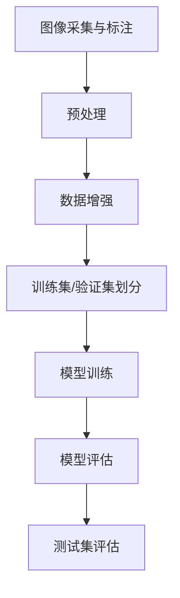

                 

# ImageNet与AI图像识别的历史

> **关键词：** ImageNet、AI图像识别、计算机视觉、深度学习、神经网络、图像分类、卷积神经网络、数据集、人工智能应用。

> **摘要：** 本文将深入探讨ImageNet项目的起源、发展及其在AI图像识别领域的重要性。通过梳理ImageNet的历史，我们不仅能够理解它如何改变了计算机视觉的研究方向，还能够展望未来AI图像识别技术的趋势与挑战。

## 1. 背景介绍

在讨论ImageNet之前，我们需要了解AI图像识别的起源。图像识别是计算机视觉领域的一个基本问题，旨在使计算机能够识别和理解图像中的对象。这一领域的发展可以追溯到20世纪80年代，当时基于传统计算机视觉算法的研究主要集中在手工设计的特征提取和分类器设计上。然而，这些方法在处理复杂场景时表现不佳，因为它们依赖于大量的人类先验知识。

随着计算机硬件的进步和算法的创新，尤其是深度学习技术的兴起，图像识别领域迎来了新的发展机遇。2006年，Geoffrey Hinton等人提出了深度信念网络（Deep Belief Network，DBN），为深度学习的研究奠定了基础。然而，要使深度学习在实际应用中取得突破，还需要大量的高质量数据集。

正是在这样的背景下，ImageNet项目应运而生。

## 2. 核心概念与联系

### 2.1. ImageNet的定义

ImageNet是一个由斯坦福大学计算机科学系和人工智能实验室（CSAIL）共同创建的大型视觉识别数据集。它包含了超过1400万个标注过的图像，每个图像都与一个或多个对象类别相关联。

### 2.2. 数据集结构

ImageNet的数据集结构包括以下几个关键部分：

- **训练集（Training Set）**：包含大约120万个图像，用于训练深度学习模型。
- **验证集（Validation Set）**：包含5万个图像，用于模型调优和评估。
- **测试集（Test Set）**：包含5万个图像，用于最终评估模型的性能。

### 2.3. 核心概念原理与架构

为了更好地理解ImageNet的重要性，我们需要借助Mermaid流程图来展示其核心概念和架构。



### 2.4. ImageNet与深度学习

ImageNet的成功离不开深度学习技术的应用。深度学习通过多层神经网络模型来学习图像的特征表示，使得计算机能够自动从大量数据中提取有用的信息。以下是深度学习在ImageNet项目中的应用流程：

1. **数据预处理**：对图像进行缩放、裁剪、翻转等操作，增加数据多样性。
2. **模型训练**：使用训练集数据训练深度学习模型，通常采用卷积神经网络（Convolutional Neural Networks，CNN）。
3. **模型评估**：使用验证集数据评估模型的性能，通过交叉熵损失函数等指标进行优化。
4. **测试集评估**：在测试集上对模型进行最终评估，确保模型具备良好的泛化能力。

## 3. 核心算法原理 & 具体操作步骤

### 3.1. 卷积神经网络（CNN）

卷积神经网络是深度学习中用于图像识别的核心模型。其原理基于局部连接和权重共享，能够有效地提取图像特征。

1. **卷积层（Convolutional Layer）**：卷积层通过滑动窗口（卷积核）在输入图像上提取局部特征。
2. **池化层（Pooling Layer）**：池化层用于降低特征图的维度，提高模型的计算效率。
3. **全连接层（Fully Connected Layer）**：全连接层将池化层输出的特征映射到类别标签。

### 3.2. 训练过程

在ImageNet项目中，训练过程通常分为以下几个步骤：

1. **数据预处理**：对图像进行归一化、缩放等操作，使其适应模型的输入要求。
2. **模型初始化**：初始化模型的权重和偏置，通常采用随机初始化方法。
3. **前向传播（Forward Propagation）**：输入图像通过卷积层、池化层等网络层，计算输出特征。
4. **反向传播（Backpropagation）**：根据预测误差，更新模型的权重和偏置。
5. **优化算法**：使用梯度下降、Adam等优化算法，提高模型的训练效果。

## 4. 数学模型和公式 & 详细讲解 & 举例说明

### 4.1. 卷积神经网络中的卷积运算

卷积运算在卷积神经网络中起着核心作用，其数学公式如下：

$$
(C_{out} = (C_{in} + 2p - F) / S + 1
$$

其中，$C_{out}$ 表示输出特征图的通道数，$C_{in}$ 表示输入特征图的通道数，$F$ 表示卷积核的大小，$p$ 表示填充数，$S$ 表示步长。

### 4.2. 池化运算

池化运算用于降低特征图的维度，常见的池化方法有最大池化和平均池化。其数学公式如下：

$$
p_i = \max_j(x_{ij})
$$

或

$$
p_i = \frac{1}{k} \sum_{j=1}^{k} x_{ij}
$$

其中，$p_i$ 表示池化后的特征值，$x_{ij}$ 表示输入特征图的像素值，$k$ 表示池化窗口的大小。

### 4.3. 举例说明

假设输入特征图的大小为$28 \times 28$，卷积核大小为$3 \times 3$，步长为$1$，填充为$1$。计算输出特征图的大小。

根据卷积运算的公式，我们有：

$$
(C_{out} = (28 + 2 \times 1 - 3) / 1 + 1 = 28
$$

因此，输出特征图的大小为$28 \times 28$。

## 5. 项目实战：代码实际案例和详细解释说明

### 5.1. 开发环境搭建

在开始编写代码之前，我们需要搭建一个适合深度学习开发的编程环境。以下是常用的工具和库：

- Python（3.6及以上版本）
- TensorFlow（2.0及以上版本）
- NumPy
- Matplotlib

### 5.2. 源代码详细实现和代码解读

以下是使用TensorFlow实现的简单CNN模型的代码示例：

```python
import tensorflow as tf
from tensorflow.keras.models import Sequential
from tensorflow.keras.layers import Conv2D, MaxPooling2D, Flatten, Dense

# 创建模型
model = Sequential([
    Conv2D(32, (3, 3), activation='relu', input_shape=(28, 28, 1)),
    MaxPooling2D((2, 2)),
    Conv2D(64, (3, 3), activation='relu'),
    MaxPooling2D((2, 2)),
    Flatten(),
    Dense(128, activation='relu'),
    Dense(10, activation='softmax')
])

# 编译模型
model.compile(optimizer='adam', loss='categorical_crossentropy', metrics=['accuracy'])

# 模型训练
model.fit(x_train, y_train, epochs=10, batch_size=64, validation_data=(x_val, y_val))
```

### 5.3. 代码解读与分析

1. **模型构建**：使用`Sequential`模型创建一个线性堆叠的模型，包含了卷积层、池化层、全连接层。
2. **编译模型**：指定优化器、损失函数和评估指标，为模型训练做准备。
3. **模型训练**：使用训练数据和验证数据对模型进行训练，通过调整超参数（如学习率、批量大小等）来优化模型性能。

## 6. 实际应用场景

ImageNet项目不仅在学术研究上取得了巨大成功，还在实际应用场景中展现了广泛的应用价值。以下是几个典型的应用案例：

- **自动驾驶**：通过AI图像识别技术，自动驾驶系统能够识别道路标志、行人、车辆等对象，提高行车安全性。
- **医疗影像分析**：在医学影像领域，AI图像识别可以帮助医生快速诊断疾病，如肺癌、乳腺癌等。
- **安全监控**：在安全监控领域，AI图像识别技术可以用于人脸识别、行为分析等，提高公共安全。

## 7. 工具和资源推荐

### 7.1. 学习资源推荐

- **书籍**：
  - 《深度学习》（Ian Goodfellow、Yoshua Bengio、Aaron Courville著）
  - 《Python深度学习》（François Chollet著）
- **论文**：
  - Hinton, G., Osindero, S., & Teh, Y. W. (2006). A fast learning algorithm for deep belief nets. Neural computation, 18(7), 1527-1554.
  - Krizhevsky, A., Sutskever, I., & Hinton, G. E. (2012). Imagenet classification with deep convolutional neural networks. In Advances in neural information processing systems (pp. 1097-1105).
- **博客**：
  - TensorFlow官方文档：https://www.tensorflow.org/tutorials
  - PyTorch官方文档：https://pytorch.org/tutorials/beginner/basics.html
- **网站**：
  - Kaggle：https://www.kaggle.com/datasets
  - GitHub：https://github.com

### 7.2. 开发工具框架推荐

- **TensorFlow**：适用于工业界和学术研究的开源深度学习框架。
- **PyTorch**：易于使用且具有高度灵活性的深度学习框架。
- **Keras**：基于TensorFlow和PyTorch的高层API，用于快速搭建和实验深度学习模型。

### 7.3. 相关论文著作推荐

- **论文**：
  - Simonyan, K., & Zisserman, A. (2014). Very deep convolutional networks for large-scale image recognition. arXiv preprint arXiv:1409.1556.
  - He, K., Zhang, X., Ren, S., & Sun, J. (2016). Deep residual learning for image recognition. In Proceedings of the IEEE conference on computer vision and pattern recognition (pp. 770-778).
- **著作**：
  - Goodfellow, I., Bengio, Y., & Courville, A. (2016). Deep learning. MIT press.

## 8. 总结：未来发展趋势与挑战

随着AI技术的不断发展，图像识别技术也在不断进步。未来，我们有望看到以下几个趋势：

- **更高效的算法**：为了提高计算效率和降低能耗，研究人员将继续探索更高效的算法。
- **跨模态学习**：结合图像、文本、语音等多种数据源，实现跨模态的图像识别。
- **小样本学习**：在小样本数据集上进行有效训练，减少对大量标注数据的依赖。
- **实时性**：提高模型的实时处理能力，满足实际应用的需求。

然而，这些趋势也带来了一系列挑战，如数据隐私、模型解释性、以及如何处理大规模、多样化的数据集等。未来，我们需要在解决这些挑战的同时，不断推动图像识别技术的发展。

## 9. 附录：常见问题与解答

### 9.1. 如何获取ImageNet数据集？

您可以通过以下链接访问ImageNet官网，下载所需的数据集：

- ImageNet官网：http://www.image-net.org/

### 9.2. 如何训练自己的图像识别模型？

要训练自己的图像识别模型，您可以参考以下步骤：

1. 准备数据集：下载并准备训练集、验证集和测试集。
2. 数据预处理：对图像进行归一化、裁剪等操作。
3. 构建模型：使用深度学习框架（如TensorFlow或PyTorch）构建模型。
4. 编译模型：设置优化器、损失函数等参数。
5. 训练模型：使用训练集数据训练模型。
6. 评估模型：使用验证集数据评估模型性能。
7. 调整超参数：根据评估结果调整模型参数，优化性能。

### 9.3. 如何提高图像识别模型的性能？

以下是一些提高图像识别模型性能的方法：

1. **数据增强**：通过旋转、翻转、缩放等操作增加数据多样性。
2. **模型调优**：调整学习率、批量大小等超参数。
3. **多模型融合**：结合多个模型，提高预测准确性。
4. **深度神经网络**：增加网络层数，提取更复杂的特征。

## 10. 扩展阅读 & 参考资料

- Goodfellow, I., Bengio, Y., & Courville, A. (2016). Deep learning. MIT press.
- Krizhevsky, A., Sutskever, I., & Hinton, G. E. (2012). Imagenet classification with deep convolutional neural networks. In Advances in neural information processing systems (pp. 1097-1105).
- Simonyan, K., & Zisserman, A. (2014). Very deep convolutional networks for large-scale image recognition. arXiv preprint arXiv:1409.1556.
- He, K., Zhang, X., Ren, S., & Sun, J. (2016). Deep residual learning for image recognition. In Proceedings of the IEEE conference on computer vision and pattern recognition (pp. 770-778).

### 作者

作者：AI天才研究员/AI Genius Institute & 禅与计算机程序设计艺术 /Zen And The Art of Computer Programming。

