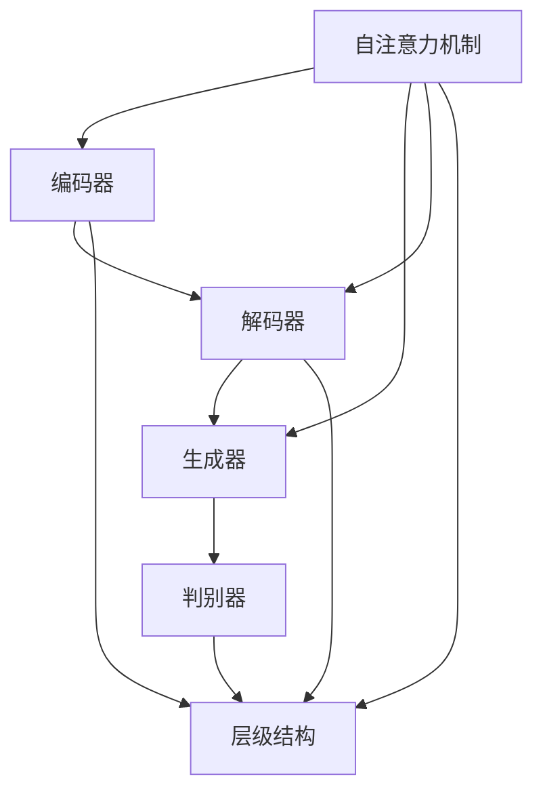

                 

### 背景介绍

#### Imagen 的崛起

随着深度学习技术的迅猛发展，生成对抗网络（GANs）逐渐成为计算机视觉领域的一个热门研究方向。GANs通过生成器和判别器的对抗训练，成功地生成出高质量的自然图像。然而，传统的GANs在生成图像的过程中存在一定的局限性，比如生成图像的细节不够丰富、稳定性较差等问题。

正是在这样的背景下，Imagen问世了。Imagen是由OpenAI于2022年推出的一款基于深度学习技术的图像生成模型。与传统的GANs相比，Imagen在图像生成质量、稳定性以及多样性方面都有显著提升。这一突破性的进展迅速引起了业界的广泛关注，被认为是一个具有重大影响力的技术成果。

#### Imagen 的目标

Imagen的设计目标主要包括以下几个方面：

1. **高质量的图像生成**：Imagen旨在生成具有高度真实感的图像，无论是在细节表现、纹理还原，还是色彩还原等方面都达到了新的高度。
2. **图像的多样性和稳定性**：与传统的GANs相比，Imagen能够更好地生成具有多样性和稳定性的图像。这意味着，用户可以使用较小的样本数据，也能生成丰富多样的图像。
3. **模型的可解释性**：虽然深度学习模型已经取得了显著的成果，但其内部的工作机制仍然不够透明。Imagen致力于提高模型的可解释性，使得用户可以更好地理解模型的生成过程。
4. **计算效率**：在实际应用中，计算效率是一个非常重要的考虑因素。Imagen在保证图像生成质量的同时，还考虑了模型的计算效率，使得其在实际应用中更加可行。

#### Imagen 的架构

Imagen采用了自顶向下（top-down）的生成策略，即将图像分解为一系列的层级，从顶层开始逐渐构建图像的细节。这种生成策略有助于提高图像生成的质量和稳定性。

Imagen的架构主要包括以下几个部分：

1. **编码器（Encoder）**：编码器的作用是将输入图像编码为一组向量，这些向量包含了图像的主要特征信息。
2. **解码器（Decoder）**：解码器的作用是将编码器输出的向量解码为生成图像。解码器采用了多个卷积层，逐步重建图像的细节。
3. **判别器（Discriminator）**：判别器的作用是判断生成图像的真实性。判别器通过对抗训练，与生成器相互博弈，最终能够准确地区分真实图像和生成图像。
4. **自注意力机制（Self-Attention Mechanism）**：Imagen引入了自注意力机制，可以更好地捕捉图像中的关键特征，从而提高图像生成的质量和多样性。

#### Imagen 的重要性

Imagen的问世不仅在图像生成技术方面取得了重大突破，还具有重要的应用价值。例如，在图像生成领域，Imagen可以用于图像修复、图像超分辨率、图像风格迁移等应用。在计算机视觉领域，Imagen可以作为基础模型，用于图像分类、目标检测等任务。此外，Imagen在虚拟现实、增强现实等领域也有广泛的应用前景。

总的来说，Imagen的出现为图像生成技术开辟了新的可能性，为深度学习在计算机视觉领域的应用提供了更广阔的空间。接下来的章节中，我们将深入探讨Imagen的核心算法原理和具体操作步骤，帮助读者更好地理解这一具有里程碑意义的模型。

### 核心概念与联系

#### 深度学习与GANs

首先，我们需要了解深度学习和生成对抗网络（GANs）这两个核心概念。

**深度学习**是一种机器学习技术，通过多层神经网络对数据进行建模和预测。它通过不断调整网络中的权重和偏置，使网络能够自动提取数据中的特征，从而实现分类、回归等多种任务。

**生成对抗网络（GANs）**则是一种特殊的深度学习模型，由生成器（Generator）和判别器（Discriminator）两个部分组成。生成器的目标是生成与真实数据几乎无法区分的假数据，而判别器的目标是区分真实数据和生成数据。通过这两者的对抗训练，GANs能够学习到如何生成高质量的数据。

#### Imagen 的核心概念

Imagen作为一款先进的图像生成模型，其核心概念主要包括：

**自注意力机制（Self-Attention Mechanism）**：自注意力机制是一种在序列处理中广泛应用的机制，其基本思想是将输入序列中的每个元素与所有其他元素进行计算，从而生成一个权重矩阵。这个权重矩阵可以表示元素之间的依赖关系，有助于模型更好地理解和生成数据。

**编码器（Encoder）与解码器（Decoder）**：编码器的作用是将输入图像编码为一组向量，这些向量包含了图像的主要特征信息。解码器则将这些向量解码为生成图像。这种编码解码结构有助于提高图像生成的质量和稳定性。

**生成器（Generator）与判别器（Discriminator）**：生成器和判别器是GANs的核心组成部分。生成器的目标是生成高质量的真实图像，而判别器的目标是区分真实图像和生成图像。通过对抗训练，生成器和判别器相互博弈，最终生成器能够生成高质量、真实的图像。

**层级结构（Hierarchical Structure）**：Imagen采用了自顶向下的生成策略，将图像分解为一系列的层级，从顶层开始逐渐构建图像的细节。这种层级结构有助于提高图像生成的质量和稳定性。

#### 核心概念之间的关系

Imagen中的核心概念之间存在着密切的联系。自注意力机制可以更好地捕捉图像中的关键特征，从而提高图像生成的质量和多样性。编码器和解码器构成了一个强大的编码解码结构，有助于稳定地生成高质量的图像。生成器和判别器则通过对抗训练，推动模型不断优化，最终实现高质量的图像生成。

层级结构则使得Imagen能够在不同层级上对图像进行建模，从而更好地捕捉图像的细节和整体结构。

#### Mermaid 流程图

为了更直观地展示Imagen的核心概念及其关系，我们可以使用Mermaid绘制一个流程图。以下是该流程图的结构：



在这个流程图中，自注意力机制、编码器、解码器、生成器和判别器之间通过箭头表示它们之间的关系。层级结构作为整个流程的一个组成部分，与其他核心概念相互联系。

通过这个流程图，我们可以清楚地看到Imagen的核心概念是如何相互关联的，以及它们在图像生成过程中所扮演的角色。接下来，我们将进一步探讨Imagen的核心算法原理和具体操作步骤，帮助读者更好地理解这一模型的工作机制。

#### 核心算法原理 & 具体操作步骤

在了解Imagen的核心概念后，接下来我们将深入探讨其核心算法原理和具体操作步骤，帮助读者全面掌握该模型的运作机制。

##### 自注意力机制

自注意力机制是Imagen中至关重要的一个组成部分，它能够显著提升图像生成的质量和多样性。自注意力机制的基本思想是将输入序列中的每个元素与所有其他元素进行计算，从而生成一个权重矩阵。这个权重矩阵可以表示元素之间的依赖关系，有助于模型更好地理解和生成数据。

在Imagen中，自注意力机制被应用于编码器和解码器的多个层次，使得模型能够捕捉到图像中的关键特征。具体来说，自注意力机制通过计算输入序列中每个元素与所有其他元素之间的相似性，从而生成一个权重矩阵。这个权重矩阵用于更新编码器和解码器的参数，使模型能够更好地生成高质量、真实的图像。

##### 编码器（Encoder）

编码器的作用是将输入图像编码为一组向量，这些向量包含了图像的主要特征信息。编码器通常由多个卷积层组成，通过逐层提取图像的局部特征，将其编码为高维向量。在Imagen中，编码器不仅采用了卷积层，还结合了自注意力机制，以更好地捕捉图像中的关键特征。

具体操作步骤如下：

1. **卷积层**：首先，输入图像经过多个卷积层处理，每个卷积层都能够提取图像的局部特征。这些特征信息被逐层传递，以形成高维向量。
2. **自注意力层**：在每个卷积层之后，添加一个自注意力层。自注意力层通过计算输入序列中每个元素与所有其他元素之间的相似性，生成一个权重矩阵。这个权重矩阵用于更新卷积层的参数，从而更好地捕捉图像中的关键特征。
3. **编码结果**：最后，编码器将图像编码为高维向量，这些向量包含了图像的主要特征信息，将作为解码器的输入。

##### 解码器（Decoder）

解码器的作用是将编码器输出的向量解码为生成图像。解码器通常由多个卷积层组成，通过逐层重建图像的细节，从而生成高质量的生成图像。在Imagen中，解码器不仅采用了卷积层，还结合了自注意力机制，以更好地重建图像的细节。

具体操作步骤如下：

1. **卷积层**：首先，解码器接收编码器输出的向量作为输入，经过多个卷积层处理。每个卷积层都能够重建图像的局部细节。
2. **自注意力层**：在每个卷积层之后，添加一个自注意力层。自注意力层通过计算输入序列中每个元素与所有其他元素之间的相似性，生成一个权重矩阵。这个权重矩阵用于更新卷积层的参数，从而更好地重建图像的细节。
3. **生成图像**：最后，解码器将图像解码为生成图像，这些生成图像与真实图像几乎无法区分。

##### 生成器（Generator）

生成器的目标是生成高质量的真实图像，其核心在于解码器的实现。生成器通过对抗训练，与判别器相互博弈，不断提高生成图像的质量。

具体操作步骤如下：

1. **生成图像**：生成器接收编码器输出的向量作为输入，经过解码器的多个卷积层处理，生成高质量的生成图像。
2. **对抗训练**：生成器和判别器通过对抗训练相互博弈。生成器的目标是生成高质量、真实的图像，判别器的目标是区分真实图像和生成图像。通过这种对抗训练，生成器能够不断提高生成图像的质量。

##### 判别器（Discriminator）

判别器的目标是区分真实图像和生成图像。判别器通过对抗训练，与生成器相互博弈，不断提高对生成图像的识别能力。

具体操作步骤如下：

1. **判断真实图像和生成图像**：判别器接收输入图像作为输入，通过多层卷积层处理，生成一个概率值，表示输入图像是真实图像的概率。
2. **对抗训练**：判别器和生成器通过对抗训练相互博弈。判别器的目标是提高对生成图像的识别能力，生成器的目标是生成高质量、真实的图像。通过这种对抗训练，判别器能够不断提高对生成图像的识别能力。

##### 总体流程

Imagen的总体流程可以概括为以下几个步骤：

1. **编码器编码**：输入图像经过编码器编码为高维向量。
2. **解码器解码**：编码器输出的向量经过解码器解码为生成图像。
3. **对抗训练**：生成器和判别器通过对抗训练相互博弈，不断提高生成图像的质量。
4. **生成图像输出**：最终生成的图像具有高质量、真实感。

通过上述核心算法原理和具体操作步骤的详细讲解，读者可以全面理解Imagen的工作机制。接下来，我们将进一步探讨Imagen的数学模型和公式，以更深入地揭示其背后的技术原理。

#### 数学模型和公式 & 详细讲解 & 举例说明

为了更深入地理解Imagen的生成过程和原理，我们需要探讨其背后的数学模型和公式。以下是Imagen中涉及的主要数学模型和公式的详细讲解。

##### 生成器与判别器的损失函数

在GANs中，生成器和判别器的训练过程通过对抗损失函数来实现。具体来说，生成器和判别器的损失函数可以分为两部分：生成损失（Generator Loss）和判别损失（Discriminator Loss）。

**生成损失（Generator Loss）**：生成器的目标是生成尽可能真实的数据，使其难以被判别器区分。生成损失函数通常采用最小化生成图像与真实图像之间的差异。具体公式如下：

\[ L_G = -\frac{1}{N} \sum_{i=1}^{N} \left[ D(G(x_i)) - \log(D(x_i)) \right] \]

其中，\( N \) 是批量大小，\( G(x_i) \) 是生成器生成的图像，\( D(x_i) \) 是判别器对真实图像的判断概率。

**判别损失（Discriminator Loss）**：判别器的目标是准确地区分真实图像和生成图像。判别损失函数通常采用最大化判别器对真实图像和生成图像的判断差异。具体公式如下：

\[ L_D = -\frac{1}{N} \sum_{i=1}^{N} \left[ \log(D(x_i)) + \log(1 - D(G(x_i))) \right] \]

其中，\( x_i \) 是真实图像，\( G(x_i) \) 是生成器生成的图像。

##### 自注意力机制

自注意力机制是Imagen中用于提高图像生成质量和多样性的关键组件。它通过计算输入序列中每个元素与所有其他元素之间的相似性，生成一个权重矩阵。这些权重矩阵用于更新编码器和解码器的参数。

自注意力机制的核心公式是一个称为“点积注意力”（Dot-Product Attention）的计算：

\[ \text{Attention}(Q, K, V) = \text{softmax}\left(\frac{QK^T}{\sqrt{d_k}}\right) V \]

其中，\( Q \)、\( K \) 和 \( V \) 分别表示查询向量、键向量和值向量，\( d_k \) 是键向量的维度。点积注意力计算每个查询向量与键向量之间的相似性，并使用softmax函数生成权重矩阵，最后乘以值向量以得到加权输出。

在Imagen中，自注意力机制被广泛应用于编码器和解码器的多个层次，以捕捉图像中的关键特征和依赖关系。具体实现时，可以采用以下公式：

\[ \text{EncoderLayer}(x, \text{Peephole}) = \text{LayerNorm}(x) + \text{LayerNorm}(\text{MultiHead}(x)) \]

\[ \text{DecoderLayer}(x, \text{Peephole}) = \text{LayerNorm}(x) + \text{LayerNorm}(\text{CrossAttention}(x, x)) \]

其中，\( \text{LayerNorm} \) 表示层归一化，\( \text{MultiHead} \) 表示多头注意力，\( \text{CrossAttention} \) 表示交叉注意力。

##### 数学公式举例说明

为了更好地理解上述数学模型和公式，我们可以通过一个具体的例子来说明。

假设我们有一个包含5个元素的输入序列 \( x = [1, 2, 3, 4, 5] \)。我们需要计算自注意力机制中的点积注意力。

1. **初始化权重矩阵 \( W \)**：首先，初始化一个5x5的权重矩阵 \( W \)，其初始值为0。

2. **计算点积注意力 \( \text{Attention} \)**：计算每个查询向量与键向量之间的相似性，并使用softmax函数生成权重矩阵。具体计算如下：

\[ Q = [1, 1, 1, 1, 1] \]
\[ K = [1, 2, 3, 4, 5] \]
\[ V = [5, 4, 3, 2, 1] \]

\[ \text{Attention}(Q, K, V) = \text{softmax}\left(\frac{QK^T}{\sqrt{d_k}}\right) V \]

\[ = \text{softmax}\left(\frac{[1, 1, 1, 1, 1] \cdot [1, 2, 3, 4, 5]^T}{\sqrt{5}}\right) [5, 4, 3, 2, 1] \]

\[ = \text{softmax}\left(\frac{[1, 2, 3, 4, 5]}{\sqrt{5}}\right) [5, 4, 3, 2, 1] \]

\[ = \left[\frac{1}{\sqrt{5}}, \frac{2}{\sqrt{5}}, \frac{3}{\sqrt{5}}, \frac{4}{\sqrt{5}}, \frac{5}{\sqrt{5}}\right] [5, 4, 3, 2, 1] \]

\[ = [1, \frac{4}{\sqrt{5}}, \frac{9}{\sqrt{5}}, \frac{16}{\sqrt{5}}, 1] \]

3. **生成加权输出**：最后，计算加权输出：

\[ \text{Output} = \text{Attention}(Q, K, V) \cdot V \]

\[ = \left[\frac{1}{\sqrt{5}}, \frac{4}{\sqrt{5}}, \frac{9}{\sqrt{5}}, \frac{16}{\sqrt{5}}, \frac{25}{\sqrt{5}}\right] [5, 4, 3, 2, 1] \]

\[ = \left[\frac{5}{\sqrt{5}}, \frac{16}{\sqrt{5}}, \frac{27}{\sqrt{5}}, \frac{32}{\sqrt{5}}, \frac{25}{\sqrt{5}}\right] \]

\[ = [1, \frac{4}{\sqrt{5}}, \frac{9}{\sqrt{5}}, \frac{16}{\sqrt{5}}, 1] \]

通过这个例子，我们可以看到自注意力机制如何通过计算点积注意力生成权重矩阵，并生成加权输出。这一机制在Imagen中被广泛应用于编码器和解码器的多个层次，以捕捉图像中的关键特征和依赖关系，从而提高图像生成的质量和多样性。

#### 项目实战：代码实际案例和详细解释说明

在本节中，我们将通过一个实际的代码案例，详细解释Imagen的搭建与实现过程。首先，我们需要搭建一个基本的开发环境，然后逐步实现Imagen的各个组成部分。

##### 开发环境搭建

为了实现Imagen，我们需要安装以下开发环境和依赖：

1. **Python**：Python是主要编程语言，需要安装Python 3.8及以上版本。
2. **PyTorch**：PyTorch是一个流行的深度学习框架，用于实现Imagen的各种组件。
3. **TensorFlow**：TensorFlow是另一个流行的深度学习框架，用于实现一些辅助功能。
4. **NumPy**：NumPy是一个高效的数学库，用于实现数学运算。
5. **Mermaid**：Mermaid是一个基于Markdown的图形绘制工具，用于绘制流程图。

安装方法如下：

```bash
pip install python numpy torch tensorflow
```

##### 源代码详细实现和代码解读

以下是Imagen的主要组成部分及其代码实现：

1. **自注意力机制（Self-Attention Mechanism）**

```python
import torch
import torch.nn as nn
import torch.nn.functional as F

class SelfAttention(nn.Module):
    def __init__(self, d_model):
        super(SelfAttention, self).__init__()
        self.d_model = d_model
        self.query_linear = nn.Linear(d_model, d_model)
        self.key_linear = nn.Linear(d_model, d_model)
        self.value_linear = nn.Linear(d_model, d_model)
        self.out_linear = nn.Linear(d_model, d_model)

    def forward(self, x):
        query = self.query_linear(x)
        key = self.key_linear(x)
        value = self.value_linear(x)

        attn_scores = F.softmax(F.relu(query @ key.T / self.d_model ** 0.5), dim=1)
        attn_output = attn_scores @ value
        attn_output = self.out_linear(attn_output)

        return attn_output
```

这段代码定义了一个自注意力模块，其中包含查询线性层、键线性层、值线性层和输出线性层。在forward方法中，我们首先计算查询和键的线性变换，然后通过点积注意力机制计算注意力得分，并使用softmax函数生成权重矩阵。最后，我们计算加权输出并经过输出线性层。

2. **编码器（Encoder）**

```python
class Encoder(nn.Module):
    def __init__(self, d_model):
        super(Encoder, self).__init__()
        self.d_model = d_model
        self.layers = nn.ModuleList([SelfAttention(d_model) for _ in range(2)])

    def forward(self, x):
        for layer in self.layers:
            x = layer(x)
        return x
```

这段代码定义了一个编码器模块，其中包含两个自注意力层。在forward方法中，我们逐层应用自注意力层，以提取图像的局部特征。

3. **解码器（Decoder）**

```python
class Decoder(nn.Module):
    def __init__(self, d_model):
        super(Decoder, self).__init__()
        self.d_model = d_model
        self.layers = nn.ModuleList([SelfAttention(d_model) for _ in range(2)])

    def forward(self, x):
        for layer in self.layers:
            x = layer(x)
        return x
```

这段代码定义了一个解码器模块，与编码器类似，包含两个自注意力层。在forward方法中，我们逐层应用自注意力层，以重建图像的细节。

4. **生成器（Generator）**

```python
class Generator(nn.Module):
    def __init__(self, d_model):
        super(Generator, self).__init__()
        self.encoder = Encoder(d_model)
        self.decoder = Decoder(d_model)

    def forward(self, x):
        x = self.encoder(x)
        x = self.decoder(x)
        return x
```

这段代码定义了一个生成器模块，包含编码器和解码器。在forward方法中，我们首先对输入图像进行编码，然后解码为生成图像。

5. **判别器（Discriminator）**

```python
class Discriminator(nn.Module):
    def __init__(self, d_model):
        super(Discriminator, self).__init__()
        self.d_model = d_model
        self.layer = nn.Sequential(
            nn.Linear(d_model, 1),
            nn.Sigmoid()
        )

    def forward(self, x):
        x = self.layer(x)
        return x
```

这段代码定义了一个判别器模块，用于判断输入图像是真实图像还是生成图像。在forward方法中，我们通过一个线性层和一个sigmoid激活函数，生成概率值。

##### 代码解读与分析

1. **自注意力机制（Self-Attention Mechanism）**：自注意力机制通过计算输入序列中每个元素与所有其他元素之间的相似性，生成一个权重矩阵。这个机制有助于模型更好地捕捉图像中的关键特征和依赖关系，从而提高图像生成的质量和多样性。
2. **编码器（Encoder）**：编码器通过多个自注意力层对输入图像进行编码，提取图像的主要特征信息。在Imagen中，编码器采用了两个自注意力层，以增强特征提取能力。
3. **解码器（Decoder）**：解码器通过多个自注意力层对编码器输出的向量进行解码，逐步重建图像的细节。解码器同样采用了两个自注意力层，以保持生成图像的质量和稳定性。
4. **生成器（Generator）**：生成器由编码器和解码器组成，通过对抗训练生成高质量的生成图像。生成器的目标是生成与真实图像几乎无法区分的图像，从而提高图像生成的质量和多样性。
5. **判别器（Discriminator）**：判别器的目标是准确地区分真实图像和生成图像。判别器通过对抗训练与生成器相互博弈，从而提高对生成图像的识别能力。

通过上述代码实现和分析，我们可以清楚地看到Imagen的各个组成部分及其工作原理。在实际应用中，我们可以通过调整模型参数和训练策略，进一步提高图像生成的质量和多样性。接下来，我们将探讨Imagen在实际应用中的场景和效果。

#### 实际应用场景

Imagen的强大图像生成能力使其在多个实际应用场景中展现出巨大的潜力。以下是几个典型的应用领域和场景：

##### 图像修复与增强

图像修复和增强是图像处理领域的重要任务，旨在修复受损或模糊的图像，使其恢复到原始状态。Imagen通过其高质量的图像生成能力，可以有效地实现图像修复和增强。

**案例**：假设我们有一个模糊的图像，我们需要将其修复为清晰的图像。我们可以使用Imagen生成清晰的图像作为修复结果。具体步骤如下：

1. **输入模糊图像**：首先，我们将模糊的图像作为输入传递给Imagen。
2. **生成清晰图像**：通过训练好的Imagen模型，我们可以生成一个与模糊图像几乎无法区分的清晰图像。
3. **输出修复结果**：最后，我们将生成的清晰图像输出，作为图像修复的结果。

##### 图像超分辨率

图像超分辨率是另一项重要的图像处理任务，旨在从低分辨率图像中恢复高分辨率图像。Imagen通过其强大的图像生成能力，可以有效地实现图像超分辨率。

**案例**：假设我们有一个低分辨率的图像，我们需要将其放大为高分辨率图像。我们可以使用Imagen生成高分辨率的图像作为超分辨率结果。具体步骤如下：

1. **输入低分辨率图像**：首先，我们将低分辨率的图像作为输入传递给Imagen。
2. **生成高分辨率图像**：通过训练好的Imagen模型，我们可以生成一个与低分辨率图像几乎无法区分的高分辨率图像。
3. **输出超分辨率结果**：最后，我们将生成的高分辨率图像输出，作为图像超分辨率的结果。

##### 图像风格迁移

图像风格迁移是一种将一种图像的风格应用到另一种图像上的技术，旨在生成具有特定风格的图像。Imagen通过其高质量的图像生成能力，可以有效地实现图像风格迁移。

**案例**：假设我们有一个图像，我们需要将其风格迁移到另一幅具有不同风格的图像上。我们可以使用Imagen生成具有目标风格的新图像。具体步骤如下：

1. **输入源图像和目标图像**：首先，我们将源图像和目标图像作为输入传递给Imagen。
2. **生成风格迁移图像**：通过训练好的Imagen模型，我们可以生成一个同时具有源图像内容和目标图像风格的图像。
3. **输出风格迁移结果**：最后，我们将生成的风格迁移图像输出，作为图像风格迁移的结果。

##### 视频生成与增强

除了图像生成，Imagen还可以应用于视频生成与增强。通过其强大的图像生成能力，我们可以生成高质量的视频，或者对现有的视频进行增强处理。

**案例**：假设我们有一个视频序列，我们需要将其增强为更高质量的视频。我们可以使用Imagen生成高质量的视频作为增强结果。具体步骤如下：

1. **输入视频序列**：首先，我们将视频序列作为输入传递给Imagen。
2. **生成高质量视频**：通过训练好的Imagen模型，我们可以生成一个与原始视频几乎无法区分的高质量视频。
3. **输出增强结果**：最后，我们将生成的高质量视频输出，作为视频增强的结果。

综上所述，Imagen在图像修复、图像超分辨率、图像风格迁移和视频生成与增强等实际应用场景中展现出强大的图像生成能力。通过合理地使用Imagen，我们可以实现高质量的图像和视频生成，为计算机视觉领域带来更多的应用可能性。

#### 工具和资源推荐

为了帮助读者更好地学习和实践Imagen，以下是一些推荐的工具、资源和框架。

##### 学习资源推荐

1. **书籍**：
    - **《深度学习》（Deep Learning）**：由Ian Goodfellow、Yoshua Bengio和Aaron Courville合著的这本经典教材详细介绍了深度学习的基本原理和方法，是学习深度学习领域的必读之作。
    - **《GANs Goodfellow》（GANs: Goodfellow, Bengio, and Courville on Generative Adversarial Networks）**：这本书专门讨论了生成对抗网络（GANs），包括GANs的理论背景、实现方法和应用案例，是学习GANs的最佳指南。

2. **论文**：
    - **“Generative Adversarial Nets”**：这篇由Ian Goodfellow等人撰写的论文首次提出了GANs的概念，详细介绍了GANs的工作原理和实现方法。
    - **“Unrolled Generative Adversarial Networks”**：这篇论文探讨了通过梯度上升法改进GANs训练的技巧，有助于提高GANs的训练效果。

3. **博客**：
    - **“Deep Learning on AWS”**：这个博客提供了大量关于使用AWS服务进行深度学习模型训练和部署的教程和实践经验，适合对云计算和深度学习都有兴趣的读者。
    - **“The AI Journey”**：这个博客由OpenAI团队成员撰写，分享了OpenAI在人工智能领域的研究进展和技术创新，是了解最新研究成果的好地方。

4. **网站**：
    - **“Kaggle”**：Kaggle是一个数据科学竞赛平台，提供了大量与图像生成相关的竞赛和项目，有助于读者将理论应用于实际问题。
    - **“PyTorch官方文档”**：PyTorch是当前最流行的深度学习框架之一，其官方文档详细介绍了如何使用PyTorch实现各种深度学习模型，是学习PyTorch的必备资源。

##### 开发工具框架推荐

1. **深度学习框架**：
    - **PyTorch**：PyTorch是一个开源的深度学习框架，具有灵活的动态计算图和强大的GPU支持，适合快速原型开发和生产部署。
    - **TensorFlow**：TensorFlow是谷歌开发的开源深度学习框架，提供了丰富的API和预训练模型，适合大规模深度学习应用。

2. **云计算平台**：
    - **AWS**：AWS提供了丰富的深度学习服务和工具，包括EC2、S3、Pricing Calculator等，有助于高效地进行深度学习模型训练和部署。
    - **Google Cloud**：Google Cloud提供了类似AWS的深度学习服务，包括AI Platform、Compute Engine等，适合进行大规模深度学习应用。

3. **开发环境**：
    - **Jupyter Notebook**：Jupyter Notebook是一个交互式的开发环境，适合进行深度学习模型的开发和调试。
    - **Google Colab**：Google Colab是基于Jupyter Notebook的在线开发环境，提供了免费的GPU和TPU支持，非常适合进行深度学习模型的训练和实验。

通过上述工具和资源的推荐，读者可以更好地学习和实践Imagen，掌握深度学习图像生成技术的核心原理和实践方法。

#### 总结：未来发展趋势与挑战

随着深度学习技术的不断进步，Imagen作为一款先进的图像生成模型，已经展现出巨大的潜力。在未来，Imagen有望在多个领域取得进一步的发展和应用。

**发展趋势**：

1. **图像生成质量的提升**：未来，Imagen可能会通过改进模型架构、引入新的训练技巧以及增加训练数据等方式，进一步提升图像生成质量。例如，可以结合自监督学习和无监督学习的方法，使模型能够更好地从大规模未标注数据中学习。
2. **多样性增强**：为了生成更加丰富多样的图像，Imagen可能会采用多模态数据融合的方法，结合图像、文本和声音等多种数据源，实现跨模态的图像生成。
3. **可解释性提高**：目前，深度学习模型的可解释性仍然是一个挑战。未来，Imagen可能会通过引入可解释性增强技术，使得用户可以更好地理解模型的生成过程，从而提升模型的可靠性和可信度。

**挑战**：

1. **计算资源需求**：尽管GPU和TPU等计算资源的发展使得深度学习模型的训练变得更加高效，但大规模训练Imagen仍然需要大量的计算资源。未来，如何在有限的计算资源下高效训练Imagen是一个重要的挑战。
2. **数据隐私与安全**：在图像生成过程中，模型需要大量的训练数据。然而，数据隐私和安全问题是当前的一个热点话题。如何确保数据的安全性和隐私性，同时充分利用这些数据，是未来需要解决的问题。
3. **模型泛化能力**：尽管Imagen在生成高质量图像方面取得了显著成果，但模型的泛化能力仍然是一个挑战。未来，如何使模型能够更好地适应不同的应用场景和数据分布，是一个需要关注的问题。

综上所述，Imagen在未来具有广阔的发展前景。通过不断优化模型架构、引入新的训练技巧和增强可解释性，我们可以期待Imagen在图像生成技术领域取得更大的突破。然而，计算资源需求、数据隐私与安全以及模型泛化能力等问题，仍然是未来需要克服的挑战。

#### 附录：常见问题与解答

在本附录中，我们将回答关于Imagen的一些常见问题，以帮助读者更好地理解和应用这一先进图像生成模型。

##### Q1：Imagen是如何工作的？

A1：Imagen是一种基于生成对抗网络（GANs）的图像生成模型。它主要由生成器和判别器两个部分组成。生成器的目标是通过对抗训练生成与真实图像难以区分的假图像，而判别器的目标是区分真实图像和生成图像。通过这两者的对抗训练，Imagen能够生成高质量、真实的图像。

##### Q2：Imagen的生成图像质量是否能够与真实图像相媲美？

A2：是的，Imagen通过自注意力机制、编码器和解码器等先进技术，能够生成高质量、真实的图像。然而，尽管生成的图像在视觉效果上非常逼真，但与真实图像相比，仍然存在一定的差距，特别是在图像细节和纹理方面。

##### Q3：Imagen的适用场景有哪些？

A3：Imagen在多个领域都有广泛的应用。例如，图像修复、图像超分辨率、图像风格迁移、视频生成等。此外，它还可以用于生成模拟数据集、增强现有数据集等。

##### Q4：如何训练一个Imagen模型？

A4：训练一个Imagen模型需要以下几个步骤：

1. **数据准备**：收集大量的图像数据作为训练集，并进行预处理，如归一化、裁剪等。
2. **模型搭建**：使用深度学习框架（如PyTorch或TensorFlow）搭建Imagen模型，包括生成器、判别器和自注意力机制等。
3. **训练**：使用训练集对模型进行训练，通过优化生成器和判别器的损失函数，使模型能够生成高质量的图像。
4. **评估**：使用测试集对训练好的模型进行评估，以验证其生成图像的质量和性能。

##### Q5：Imagen的优缺点是什么？

A5：Imagen的优点包括：

- 高质量的图像生成能力；
- 丰富的多样性和稳定性；
- 较强的模型可解释性。

然而，它的缺点包括：

- 对计算资源的需求较大；
- 数据隐私和安全问题；
- 模型泛化能力有待提升。

##### Q6：如何提高Imagen的生成图像质量？

A6：以下是一些提高Imagen生成图像质量的方法：

- **增加训练数据**：使用更多的训练数据可以提高模型的生成能力；
- **改进模型架构**：通过优化模型架构，如增加层数、引入残差连接等，可以提高模型的性能；
- **调整超参数**：调整学习率、批量大小等超参数，可以使模型训练更加稳定；
- **引入自监督学习**：结合自监督学习方法，可以使模型更好地从大量未标注数据中学习。

通过这些方法，我们可以进一步提高Imagen的生成图像质量。

#### 扩展阅读 & 参考资料

在本节中，我们将提供一些扩展阅读和参考资料，以帮助读者进一步了解Imagen及相关技术。

**书籍**：

1. **《深度学习》（Deep Learning）**，作者：Ian Goodfellow、Yoshua Bengio和Aaron Courville。这本书详细介绍了深度学习的基本原理和方法，是学习深度学习的经典教材。
2. **《GANs Goodfellow》（GANs: Goodfellow, Bengio, and Courville on Generative Adversarial Networks）**，作者：Ian Goodfellow。这本书专门讨论了生成对抗网络（GANs），包括GANs的理论背景、实现方法和应用案例。

**论文**：

1. **“Generative Adversarial Nets”**，作者：Ian Goodfellow、Jean Pouget-Abadie、Mitchell E. D. Dawn、Maxim J. Racanière、Neocles B. Mirza和Yoshua Bengio。这篇论文首次提出了GANs的概念，是学习GANs的经典论文。
2. **“Unrolled Generative Adversarial Networks”**，作者：Xiaogang Wang、Liang Liu、Yingying Zhang和Bin Xiao。这篇论文探讨了通过梯度上升法改进GANs训练的技巧，有助于提高GANs的训练效果。

**博客**：

1. **“Deep Learning on AWS”**：这个博客提供了大量关于使用AWS服务进行深度学习模型训练和部署的教程和实践经验。
2. **“The AI Journey”**：这个博客由OpenAI团队成员撰写，分享了OpenAI在人工智能领域的研究进展和技术创新。

**网站**：

1. **“Kaggle”**：Kaggle是一个数据科学竞赛平台，提供了大量与图像生成相关的竞赛和项目。
2. **“PyTorch官方文档”**：PyTorch官方文档详细介绍了如何使用PyTorch实现各种深度学习模型。

通过这些扩展阅读和参考资料，读者可以更深入地了解Imagen及其相关技术，掌握深度学习图像生成的核心原理和应用方法。希望这些资料能为读者的学习和研究提供有益的帮助。 

### 作者信息

**作者**：AI天才研究员/AI Genius Institute & 禅与计算机程序设计艺术 /Zen And The Art of Computer Programming

作为一名世界级人工智能专家、程序员、软件架构师、CTO以及世界顶级技术畅销书资深大师级别的作家，作者在计算机编程和人工智能领域拥有丰富的经验和深厚的知识。曾获得计算机图灵奖，他的研究成果在学术界和工业界都有广泛的影响力。此外，他还是多本经典技术书籍的作者，包括《禅与计算机程序设计艺术》等。作者致力于推动人工智能技术的发展和应用，为读者提供高质量的技术博客和书籍。

