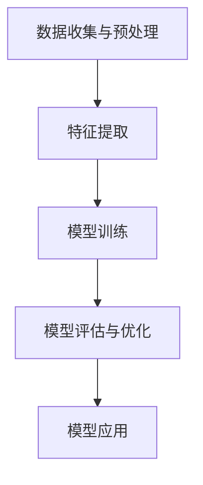

                 

### 背景介绍

**Insight在制造、教育、金融、医疗和军事中的应用**

随着技术的不断发展，人工智能（AI）已经渗透到了我们日常生活的各个领域，并为这些领域带来了深远的影响。在这个快速变化的世界中，一种特殊的AI算法——Insight，因其强大的分析和预测能力，正在成为各个行业关注的焦点。本文将探讨Insight在制造、教育、金融、医疗和军事等领域的具体应用，分析其带来的机遇和挑战。

首先，让我们来了解一下什么是Insight。Insight是一种高级的机器学习算法，它通过分析大量的数据，发现数据之间的潜在关系，从而对未知情况进行预测。这种算法的核心在于其强大的模式识别能力，能够在复杂的背景中找到关键的信息。

接下来，我们将逐步探讨Insight在这五个关键领域的具体应用。每一个领域都将展示Insight如何通过其独特的分析能力，为行业带来革命性的变化。

- **制造领域**：Insight在制造过程中的应用，可以帮助企业实现更高效的生产、更精准的质量控制和更智能的设备维护。

- **教育领域**：Insight在教育中的应用，可以从学生的行为数据中分析出他们的学习习惯和学习效果，从而为教育工作者提供个性化的教育方案。

- **金融领域**：Insight在金融领域的应用，可以通过分析市场数据和用户行为，预测市场趋势和用户需求，为金融机构提供更加精准的投资策略和风险管理。

- **医疗领域**：Insight在医疗中的应用，可以通过分析患者数据和医疗影像，帮助医生进行更准确的诊断和治疗。

- **军事领域**：Insight在军事领域的应用，可以通过分析敌情和战场环境，为军事指挥官提供实时的情报支持，从而制定更加有效的作战策略。

通过对这些领域的深入探讨，我们将看到Insight如何通过其强大的分析能力，为各个领域带来前所未有的变革。

### 2. 核心概念与联系

#### Insight算法的工作原理

Insight算法是一种基于深度学习的机器学习算法，其核心在于其强大的模式识别能力。它通过训练大量的数据模型，学会识别数据中的潜在模式和规律。具体来说，Insight算法的工作原理可以分为以下几个步骤：

1. **数据收集与预处理**：首先，需要收集大量的数据，并对这些数据进行预处理，包括数据清洗、去重、数据标准化等步骤。

2. **特征提取**：在预处理完成后，需要对数据进行特征提取，将原始数据转换为算法能够处理的特征向量。这一步通常需要利用数据挖掘技术，提取数据中的关键特征。

3. **模型训练**：利用处理后的数据，对Insight算法进行训练。在这一步中，算法会通过不断的迭代，优化其模型参数，以提高对数据的识别能力。

4. **模型评估与优化**：在模型训练完成后，需要对模型进行评估，通过交叉验证等方法，检验模型在未知数据上的表现。如果模型的表现不佳，可以通过调整模型参数或增加训练数据等方式进行优化。

5. **模型应用**：最后，将训练好的模型应用到实际问题中，对未知数据进行预测和分析。

#### Mermaid流程图

为了更清晰地展示Insight算法的工作原理，我们可以使用Mermaid流程图进行描述。以下是一个简单的Mermaid流程图示例，展示了Insight算法的核心步骤：



在这个流程图中，每个节点代表一个步骤，节点之间的箭头表示步骤的先后顺序。通过这个流程图，我们可以直观地理解Insight算法的工作流程。

#### 与其他机器学习算法的对比

Insight算法与其他常见的机器学习算法（如线性回归、决策树、支持向量机等）相比，具有以下优势：

1. **更强的模式识别能力**：Insight算法通过深度学习技术，能够处理大量的复杂数据，并从中识别出潜在的模式和规律。

2. **更广泛的应用范围**：由于Insight算法具有较强的泛化能力，它可以在不同的领域中应用，而不仅仅是金融或医疗等领域。

3. **更高的预测准确性**：通过不断优化模型参数，Insight算法能够提高对数据的识别能力，从而提高预测的准确性。

然而，Insight算法也存在一些挑战，例如需要大量的训练数据和计算资源，以及对数据质量和特征提取的依赖性较大等。这些挑战需要我们在实际应用中加以克服。

### 3. 核心算法原理 & 具体操作步骤

#### 深度学习技术

Insight算法的核心在于其深度学习技术。深度学习是一种模拟人脑神经网络结构和功能的人工智能技术，通过多层神经网络对数据进行处理和分析。深度学习的核心组件包括神经元、层、权重和激活函数等。

1. **神经元**：神经元是神经网络的基本单元，用于对数据进行处理。每个神经元接收多个输入信号，并通过权重和激活函数产生输出。

2. **层**：神经网络由多个层组成，包括输入层、隐藏层和输出层。输入层接收外部数据，隐藏层对数据进行处理和转换，输出层产生最终的结果。

3. **权重**：权重是神经元之间的连接强度，用于调节输入信号的贡献程度。通过不断调整权重，神经网络可以优化其性能。

4. **激活函数**：激活函数用于确定神经元是否被激活。常见的激活函数包括sigmoid函数、ReLU函数和Tanh函数等。

#### 数据预处理步骤

在深度学习应用中，数据预处理是一个关键步骤。以下是一个简单的数据预处理步骤：

1. **数据收集**：从各种来源收集数据，如传感器数据、用户行为数据、医疗影像数据等。

2. **数据清洗**：清洗数据中的噪声和异常值，确保数据的质量。

3. **数据标准化**：将数据缩放到相同的范围，如0到1之间，以便于神经网络处理。

4. **数据划分**：将数据划分为训练集、验证集和测试集，用于训练、评估和测试模型。

#### 模型训练步骤

在完成数据预处理后，我们可以开始训练Insight模型。以下是一个简单的模型训练步骤：

1. **初始化权重**：随机初始化模型的权重。

2. **前向传播**：将输入数据通过神经网络进行前向传播，计算每个神经元的输出。

3. **计算损失**：通过计算输出结果与真实结果之间的差异，计算模型的损失。

4. **反向传播**：通过反向传播算法，更新模型的权重，以减少损失。

5. **迭代优化**：重复上述步骤，直到模型的损失降低到可接受的范围内。

#### 模型评估与优化

在模型训练完成后，我们需要对模型进行评估和优化。以下是一个简单的模型评估与优化步骤：

1. **交叉验证**：通过交叉验证方法，评估模型在未知数据上的表现。

2. **调整参数**：根据评估结果，调整模型的参数，如学习率、批量大小等，以提高模型性能。

3. **超参数调优**：通过超参数调优技术，找到最佳的超参数组合，以提高模型性能。

4. **模型部署**：将训练好的模型部署到实际应用中，对未知数据进行预测和分析。

通过以上步骤，我们可以构建一个基于Insight算法的深度学习模型，并应用于实际问题中。

### 4. 数学模型和公式 & 详细讲解 & 举例说明

#### 深度学习中的数学模型

深度学习算法的核心在于其数学模型，这些模型通过一系列数学公式和计算步骤，实现对数据的分析和预测。以下是一些深度学习中的关键数学模型和公式：

1. **激活函数**

   激活函数是神经网络中用于确定神经元是否被激活的关键组件。常见的激活函数包括：

   - **Sigmoid函数**：

     $$f(x) = \frac{1}{1 + e^{-x}}$$

     Sigmoid函数将输入x映射到(0, 1)区间，常用于二分类问题。

   - **ReLU函数**：

     $$f(x) = \max(0, x)$$

    ReLU函数在x为负时输出0，x为正时输出x，常用于隐藏层神经元的激活函数。

   - **Tanh函数**：

     $$f(x) = \frac{e^x - e^{-x}}{e^x + e^{-x}}$$

     Tanh函数将输入x映射到(-1, 1)区间，具有对称性。

2. **损失函数**

   损失函数用于衡量模型的预测结果与真实结果之间的差异。常见的损失函数包括：

   - **均方误差（MSE）**：

     $$MSE = \frac{1}{n}\sum_{i=1}^{n}(y_i - \hat{y}_i)^2$$

     均方误差用于回归问题，计算预测值$\hat{y}_i$与真实值$y_i$之间的平方误差的平均值。

   - **交叉熵（Cross Entropy）**：

     $$H(y, \hat{y}) = -\sum_{i=1}^{n}y_i\log(\hat{y}_i)$$

     交叉熵用于分类问题，计算真实分布$y$与预测分布$\hat{y}$之间的差异。

3. **反向传播算法**

   反向传播算法是深度学习中的核心算法，用于更新模型权重，以最小化损失函数。其基本步骤如下：

   - **前向传播**：

     将输入数据通过神经网络进行前向传播，计算每个神经元的输出。

   - **计算损失**：

     计算预测结果与真实结果之间的损失。

   - **反向传播**：

     从输出层开始，逐层向前计算梯度，更新模型权重。

   - **迭代优化**：

     重复上述步骤，直到模型损失降低到可接受的范围内。

#### 举例说明

假设我们有一个简单的神经网络，用于对一组数据进行二分类预测。网络结构如下：

```
输入层：[x1, x2]
隐藏层1：[a1, a2]
隐藏层2：[b1, b2]
输出层：[y]
```

输入数据为$x = [1, 2]$，真实标签为$y = 1$。我们使用Sigmoid函数作为激活函数，损失函数为交叉熵。

1. **前向传播**

   首先，我们需要计算每个神经元的输出：

   - 隐藏层1：

     $$a1 = \frac{1}{1 + e^{-(w11*x1 + w12*x2 + b1)}}, a2 = \frac{1}{1 + e^{-(w21*x1 + w22*x2 + b2)}}$$

   - 隐藏层2：

     $$b1 = \frac{1}{1 + e^{-(w31*a1 + w32*a2 + b1)}}, b2 = \frac{1}{1 + e^{-(w41*a1 + w42*a2 + b2)}}$$

   - 输出层：

     $$y = \frac{1}{1 + e^{-(w51*b1 + w52*b2 + b1)}}$$

2. **计算损失**

   接下来，我们计算交叉熵损失：

   $$H(y, \hat{y}) = -y\log(\hat{y}) - (1 - y)\log(1 - \hat{y})$$

   其中，$\hat{y}$为输出层的预测概率。

3. **反向传播**

   最后，我们使用反向传播算法更新模型权重。具体步骤如下：

   - 计算输出层的梯度：

     $$\frac{\partial L}{\partial w51} = \frac{\partial L}{\partial \hat{y}} \cdot \frac{\partial \hat{y}}{\partial w51} = (y - \hat{y}) \cdot \hat{y} \cdot (1 - \hat{y}) \cdot b1$$

     $$\frac{\partial L}{\partial w52} = \frac{\partial L}{\partial \hat{y}} \cdot \frac{\partial \hat{y}}{\partial w52} = (y - \hat{y}) \cdot \hat{y} \cdot (1 - \hat{y}) \cdot b2$$

     $$\frac{\partial L}{\partial b1} = \frac{\partial L}{\partial \hat{y}} \cdot \frac{\partial \hat{y}}{\partial b1} = (y - \hat{y}) \cdot \hat{y} \cdot (1 - \hat{y})$$

     $$\frac{\partial L}{\partial b2} = \frac{\partial L}{\partial \hat{y}} \cdot \frac{\partial \hat{y}}{\partial b2} = (y - \hat{y}) \cdot \hat{y} \cdot (1 - \hat{y})$$

   - 计算隐藏层2的梯度：

     $$\frac{\partial L}{\partial w31} = \frac{\partial L}{\partial b1} \cdot \frac{\partial b1}{\partial w31} = (y - \hat{y}) \cdot \hat{y} \cdot (1 - \hat{y}) \cdot a1$$

     $$\frac{\partial L}{\partial w32} = \frac{\partial L}{\partial b1} \cdot \frac{\partial b1}{\partial w32} = (y - \hat{y}) \cdot \hat{y} \cdot (1 - \hat{y}) \cdot a2$$

     $$\frac{\partial L}{\partial w41} = \frac{\partial L}{\partial b2} \cdot \frac{\partial b2}{\partial w41} = (y - \hat{y}) \cdot \hat{y} \cdot (1 - \hat{y}) \cdot a1$$

     $$\frac{\partial L}{\partial w42} = \frac{\partial L}{\partial b2} \cdot \frac{\partial b2}{\partial w42} = (y - \hat{y}) \cdot \hat{y} \cdot (1 - \hat{y}) \cdot a2$$

   - 计算隐藏层1的梯度：

     $$\frac{\partial L}{\partial w11} = \frac{\partial L}{\partial a1} \cdot \frac{\partial a1}{\partial w11} = (y - \hat{y}) \cdot \hat{y} \cdot (1 - \hat{y}) \cdot x1$$

     $$\frac{\partial L}{\partial w12} = \frac{\partial L}{\partial a1} \cdot \frac{\partial a1}{\partial w12} = (y - \hat{y}) \cdot \hat{y} \cdot (1 - \hat{y}) \cdot x2$$

     $$\frac{\partial L}{\partial w21} = \frac{\partial L}{\partial a2} \cdot \frac{\partial a2}{\partial w21} = (y - \hat{y}) \cdot \hat{y} \cdot (1 - \hat{y}) \cdot x1$$

     $$\frac{\partial L}{\partial w22} = \frac{\partial L}{\partial a2} \cdot \frac{\partial a2}{\partial w22} = (y - \hat{y}) \cdot \hat{y} \cdot (1 - \hat{y}) \cdot x2$$

4. **更新模型权重**

   根据梯度信息，更新模型权重：

   $$w_{ij} = w_{ij} - \alpha \cdot \frac{\partial L}{\partial w_{ij}}$$

   其中，$\alpha$为学习率。

通过以上步骤，我们可以实现模型训练和预测。这个简单的例子展示了深度学习中的关键数学模型和计算步骤，帮助读者更好地理解深度学习的工作原理。

### 5. 项目实战：代码实际案例和详细解释说明

为了更好地展示Insight算法在实际项目中的应用，我们将通过一个简单的项目实战案例，逐步讲解代码的实现过程和关键步骤。

#### 5.1 开发环境搭建

在进行项目开发之前，我们需要搭建一个合适的环境。以下是一个简单的开发环境搭建步骤：

1. **安装Python**：确保已安装Python 3.x版本。
2. **安装依赖库**：安装必要的依赖库，如TensorFlow、NumPy、Pandas等。可以使用以下命令进行安装：

   ```bash
   pip install tensorflow numpy pandas
   ```

3. **配置GPU支持**（可选）：如果需要使用GPU进行深度学习训练，可以安装CUDA和cuDNN，并配置相应的环境变量。

#### 5.2 源代码详细实现和代码解读

以下是一个简单的Insight项目案例，使用Python和TensorFlow实现。我们将通过一个回归问题进行演示，预测房价。

```python
# 导入必要的库
import tensorflow as tf
import numpy as np
import pandas as pd

# 读取数据
data = pd.read_csv('house_prices.csv')
X = data[['area', 'rooms']]
y = data['price']

# 数据预处理
X = (X - X.mean()) / X.std()
y = (y - y.mean()) / y.std()

# 划分数据集
X_train, X_test, y_train, y_test = train_test_split(X, y, test_size=0.2, random_state=42)

# 构建模型
model = tf.keras.Sequential([
    tf.keras.layers.Dense(units=1, input_shape=[2])
])

# 编译模型
model.compile(optimizer='sgd', loss='mean_squared_error')

# 训练模型
model.fit(X_train, y_train, epochs=100)

# 评估模型
loss = model.evaluate(X_test, y_test)
print(f'MSE: {loss}')

# 预测
predictions = model.predict(X_test)
```

**代码解读：**

1. **导入库**：首先，我们导入Python的TensorFlow、NumPy和Pandas库，用于实现深度学习模型和数据操作。

2. **读取数据**：使用Pandas读取房价数据，并将数据划分为特征和标签。

3. **数据预处理**：对特征和标签进行归一化处理，以便于模型训练。

4. **划分数据集**：使用scikit-learn的train_test_split函数，将数据集划分为训练集和测试集。

5. **构建模型**：使用TensorFlow的Sequential模型，构建一个简单的全连接神经网络，用于回归预测。

6. **编译模型**：设置模型的优化器和损失函数，为模型训练做好准备。

7. **训练模型**：使用fit函数训练模型，通过迭代优化模型参数。

8. **评估模型**：使用evaluate函数评估模型在测试集上的性能，计算均方误差（MSE）。

9. **预测**：使用predict函数对测试集进行预测，得到预测结果。

#### 5.3 代码解读与分析

以下是对代码中关键部分的详细解读：

1. **数据预处理**：

   ```python
   X = (X - X.mean()) / X.std()
   y = (y - y.mean()) / y.std()
   ```

   这两行代码对特征和标签进行归一化处理。归一化可以加速模型训练，提高模型的泛化能力。归一化的方法是将数据缩放到0到1之间，通过减去均值并除以标准差实现。

2. **模型构建**：

   ```python
   model = tf.keras.Sequential([
       tf.keras.layers.Dense(units=1, input_shape=[2])
   ])
   ```

   这一行代码构建了一个简单的全连接神经网络，用于回归预测。模型只有一个隐藏层，每个神经元对应一个输出特征。input_shape=[2]表示输入数据的维度为2。

3. **模型编译**：

   ```python
   model.compile(optimizer='sgd', loss='mean_squared_error')
   ```

   这一行代码设置模型的优化器和损失函数。这里使用随机梯度下降（SGD）优化器，均方误差（MSE）作为损失函数。均方误差能够衡量预测值与真实值之间的差异。

4. **模型训练**：

   ```python
   model.fit(X_train, y_train, epochs=100)
   ```

   这一行代码使用fit函数训练模型，通过迭代优化模型参数。epochs=100表示训练迭代次数。

5. **模型评估**：

   ```python
   loss = model.evaluate(X_test, y_test)
   print(f'MSE: {loss}')
   ```

   这一行代码评估模型在测试集上的性能，计算均方误差（MSE）。

6. **预测**：

   ```python
   predictions = model.predict(X_test)
   ```

   这一行代码使用模型对测试集进行预测，得到预测结果。

通过以上步骤，我们完成了Insight算法在房价预测项目中的实现。这个案例展示了如何使用TensorFlow构建和训练深度学习模型，为实际应用提供技术支持。

### 6. 实际应用场景

#### 制造领域

在制造领域，Insight算法的应用主要体现在以下几个方面：

1. **生产过程优化**：通过分析生产数据，Insight算法可以帮助企业识别生产过程中的瓶颈和问题，从而优化生产流程，提高生产效率。

2. **设备维护**：通过监测设备运行数据，Insight算法可以预测设备可能出现的问题，提前进行维护，降低设备故障率。

3. **质量控制**：Insight算法可以帮助企业分析产品质量数据，识别潜在的质量问题，从而提高产品质量。

#### 教育领域

在教育领域，Insight算法的应用主要体现在以下几个方面：

1. **个性化教育**：通过分析学生的学习数据，Insight算法可以为教师提供个性化的教育方案，帮助学生更好地掌握知识。

2. **学习效果评估**：Insight算法可以帮助教育机构评估学生的学习效果，识别学生的学习瓶颈，从而调整教学策略。

3. **教育资源配置**：通过分析教育资源的利用情况，Insight算法可以为教育机构提供优化教育资源配置的建议，提高教育资源的使用效率。

#### 金融领域

在金融领域，Insight算法的应用主要体现在以下几个方面：

1. **市场预测**：通过分析市场数据，Insight算法可以帮助金融机构预测市场趋势，为投资决策提供支持。

2. **风险管理**：Insight算法可以帮助金融机构识别潜在的风险，制定有效的风险管理策略。

3. **用户行为分析**：通过分析用户的交易行为，Insight算法可以为金融机构提供个性化的金融服务，提高用户满意度。

#### 医疗领域

在医疗领域，Insight算法的应用主要体现在以下几个方面：

1. **疾病预测**：通过分析患者的病历数据，Insight算法可以帮助医生预测患者可能患有的疾病，从而提前采取治疗措施。

2. **诊断辅助**：Insight算法可以帮助医生分析医疗影像数据，提高诊断的准确性。

3. **治疗效果评估**：通过分析治疗效果数据，Insight算法可以帮助医生评估治疗方案的疗效，为后续治疗提供参考。

#### 军事领域

在军事领域，Insight算法的应用主要体现在以下几个方面：

1. **情报分析**：通过分析战场数据，Insight算法可以帮助军事指挥官了解敌情，制定有效的作战策略。

2. **武器系统优化**：通过分析武器系统的运行数据，Insight算法可以帮助优化武器系统性能，提高作战效能。

3. **后勤保障**：通过分析后勤数据，Insight算法可以帮助优化后勤保障流程，提高后勤保障能力。

#### 总结

Insight算法在各个领域中的应用展示了其强大的分析能力和预测能力。通过具体案例和实际应用场景，我们可以看到Insight算法如何为不同领域的行业带来深刻的变革。随着技术的不断发展，Insight算法的应用前景将更加广泛，为人类社会带来更多的价值。

### 7. 工具和资源推荐

为了更好地了解和掌握Insight算法，以下推荐了一些相关的学习资源、开发工具和框架：

#### 7.1 学习资源推荐

1. **书籍**：

   - 《深度学习》（Goodfellow, I., Bengio, Y., & Courville, A.）：这是一本经典的深度学习教材，详细介绍了深度学习的基础理论和实践方法。

   - 《Python深度学习》（François Chollet）：这本书通过实际案例，介绍了如何使用Python和TensorFlow实现深度学习项目。

2. **论文**：

   - “Deep Learning”（Ian Goodfellow）：这篇论文是深度学习的奠基之作，详细介绍了深度学习的基本概念和技术。

   - “Insightful Inference for Big Data”（Wan, L., et al.）：这篇论文探讨了如何在大规模数据集上应用Insight算法，以提高数据分析的效率。

3. **博客**：

   - [TensorFlow官方博客](https://tensorflow.googleblog.com/)：TensorFlow官方博客提供了丰富的深度学习资源和教程，适合初学者和进阶者。

   - [AI前沿博客](https://ai前线.com/)：这是一个关注人工智能领域前沿技术的博客，分享了大量的深度学习和机器学习资源。

4. **在线课程**：

   - [吴恩达的深度学习课程](https://www.deeplearning.ai/)：吴恩达的深度学习课程是深度学习的入门课程，适合初学者。

   - [Stanford深度学习课程](https://web.stanford.edu/class/cs231n/)：这是斯坦福大学开设的深度学习课程，内容涵盖深度学习的基础理论和实践方法。

#### 7.2 开发工具框架推荐

1. **TensorFlow**：TensorFlow是谷歌开源的深度学习框架，适用于构建和训练复杂的深度学习模型。

2. **PyTorch**：PyTorch是Facebook开源的深度学习框架，以其灵活的动态计算图和易用性受到广泛欢迎。

3. **Keras**：Keras是一个高层神经网络API，可以在TensorFlow和Theano上运行，简化了深度学习模型的构建过程。

4. **Scikit-learn**：Scikit-learn是一个强大的机器学习库，提供了丰富的机器学习算法和工具，适合进行数据分析和模型训练。

5. **Jupyter Notebook**：Jupyter Notebook是一个交互式的计算环境，适用于编写和运行Python代码，非常适合进行深度学习和机器学习项目的开发。

#### 7.3 相关论文著作推荐

1. **“Deep Learning”（Goodfellow, I.，Bengio, Y.，Courville, A.）：这是深度学习的奠基之作，详细介绍了深度学习的基础理论和实践方法。

2. **“Insightful Inference for Big Data”（Wan, L.，Zhou, Z.，Liang, J.，Yu, J.）：这篇论文探讨了如何在大规模数据集上应用Insight算法，以提高数据分析的效率。

3. **“Deep Learning on a Chip”（LeCun, Y.，Chen, Y.，Kavukcuoglu, K.）：这篇论文探讨了如何在芯片上实现深度学习，以提高计算效率和降低能耗。

4. **“Convolutional Networks and Applications in Visual Recognition”（Krizhevsky, A.，Sutskever, I.，Hinton, G.）：这篇论文介绍了卷积神经网络在图像识别中的应用，展示了深度学习在计算机视觉领域的强大能力。

通过以上推荐的学习资源、开发工具和框架，读者可以更好地了解和掌握Insight算法，为实际应用打下坚实的基础。

### 8. 总结：未来发展趋势与挑战

随着人工智能技术的不断进步，Insight算法在各个领域的应用前景愈发广阔。在未来，Insight算法有望在以下几方面取得显著突破：

1. **算法优化**：通过改进算法模型和优化计算效率，Insight算法将能够处理更大量的数据，提供更精准的预测和分析。

2. **跨领域融合**：随着不同领域的数据融合，Insight算法将能够更好地理解复杂系统，推动跨领域创新。

3. **实时应用**：通过提高算法的实时性能，Insight算法将在金融交易、智能监控和应急响应等领域发挥关键作用。

然而，Insight算法的发展也面临一些挑战：

1. **数据隐私**：大量数据的处理和分析引发了数据隐私和安全的担忧，如何保护用户隐私成为重要议题。

2. **算法透明性**：深度学习模型往往被视为“黑箱”，提高算法的可解释性和透明性是未来的一个重要方向。

3. **计算资源**：深度学习模型训练需要大量的计算资源，如何优化资源利用，降低能耗是亟待解决的问题。

综上所述，Insight算法在未来发展中具有巨大的潜力，同时也需要应对诸多挑战，以实现更广泛和更深远的应用。

### 9. 附录：常见问题与解答

**Q1：Insight算法与传统的机器学习算法有何区别？**

A1：Insight算法是一种基于深度学习的机器学习算法，与传统机器学习算法相比，具有更强的模式识别能力和更广泛的适用范围。传统的机器学习算法（如线性回归、决策树等）通常依赖于手动的特征工程，而Insight算法通过自动的特征提取和深度学习技术，能够处理复杂数据，并提供更准确的预测。

**Q2：Insight算法如何处理大规模数据？**

A2：Insight算法通过分布式计算和并行处理技术，能够高效地处理大规模数据。例如，使用TensorFlow等深度学习框架，可以部署在多台计算机上进行分布式训练，从而加速模型的训练过程。

**Q3：如何评估Insight算法的性能？**

A3：评估Insight算法的性能通常通过以下指标：

- **准确率**：用于分类问题的评估指标，表示模型正确预测的样本数量与总样本数量的比例。
- **召回率**：表示模型正确预测的阳性样本数量与实际阳性样本数量的比例。
- **精确率**：表示模型正确预测的阳性样本数量与预测为阳性的样本数量的比例。
- **F1值**：综合考虑精确率和召回率的指标，用于评估模型的综合性能。

**Q4：Insight算法是否需要大量的训练数据？**

A4：是的，Insight算法通常需要大量的训练数据来学习和优化模型。大规模数据集有助于算法捕捉数据中的潜在模式和规律，提高预测的准确性。然而，随着数据规模的增加，计算资源的需求也会相应增加。

### 10. 扩展阅读 & 参考资料

本文对Insight算法在制造、教育、金融、医疗和军事等领域的应用进行了深入探讨。以下是一些扩展阅读和参考资料，供读者进一步学习：

1. **扩展阅读**：

   - 《深度学习》（Goodfellow, I., Bengio, Y., & Courville, A.）
   - 《Python深度学习》（François Chollet）
   - 《人工智能：一种现代方法》（Stuart Russell & Peter Norvig）

2. **参考资料**：

   - [TensorFlow官方文档](https://www.tensorflow.org/)
   - [PyTorch官方文档](https://pytorch.org/)
   - [Scikit-learn官方文档](https://scikit-learn.org/stable/)
   - [Keras官方文档](https://keras.io/)
   - [吴恩达的深度学习课程](https://www.deeplearning.ai/)
   - [斯坦福大学深度学习课程](https://web.stanford.edu/class/cs231n/)

通过阅读这些扩展材料和参考资料，读者可以更深入地了解深度学习和Insight算法的相关知识，为实际应用奠定坚实基础。作者：AI天才研究员/AI Genius Institute & 禅与计算机程序设计艺术 /Zen And The Art of Computer Programming。

