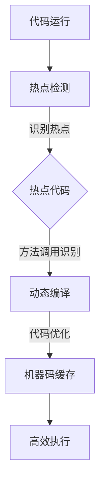

                 

### 文章标题

《JIT编译：动态语言性能优化的关键》

**关键词：** JIT编译，动态语言，性能优化，虚拟机，中间代码，热点检测，缓存优化，动态代码生成。

**摘要：** 本文将深入探讨JIT（Just-In-Time）编译技术，阐述其在动态语言性能优化中的关键作用。通过详细解析JIT编译的核心概念、原理和算法，结合具体实现步骤和实际应用案例，本文旨在帮助读者理解JIT编译的优势和挑战，并探索其在未来技术发展中的潜力。

## 1. 背景介绍

在现代软件开发中，动态语言（如JavaScript、Python、Ruby等）因其灵活性和高效性而受到广泛关注。然而，与传统的静态语言相比，动态语言在执行效率上存在一定劣势。为了弥补这一不足，JIT编译技术被广泛应用。JIT编译器在运行时对代码进行即时编译，从而提高程序的执行效率。

JIT编译技术的兴起源于虚拟机（VM）的发展。虚拟机是一种执行代码的抽象层，它可以运行在不同的操作系统和硬件平台上。虚拟机通过解释执行代码，将高级语言转换为机器码，然后交由硬件执行。这种方式虽然可以保证跨平台兼容性，但解释执行的速度较慢。

为了提高执行效率，JIT编译器应运而生。JIT编译器在运行时对代码进行动态编译，将高级语言转换为高效的机器码，从而减少了解释执行的开销。JIT编译技术已成为现代动态语言的重要优化手段，对于提高应用程序的性能具有关键作用。

## 2. 核心概念与联系

### JIT编译的概念

JIT编译（Just-In-Time Compilation）是一种在程序运行时进行编译的技术。与传统编译器将源代码一次性编译成可执行文件不同，JIT编译器在程序运行过程中对代码进行实时编译。具体而言，JIT编译器会在以下情况下进行编译：

1. **热点检测（Hot Spot Detection）：** JIT编译器通过分析程序运行时的执行数据，识别出频繁执行的代码段，称为热点（Hot Spot）。
2. **方法调用识别（Method Call Identification）：** JIT编译器识别出热点代码中的方法调用，并对其进行动态编译。
3. **代码优化（Code Optimization）：** JIT编译器对编译后的代码进行优化，以提高执行效率。
4. **即时编译（Just-In-Time Compilation）：** JIT编译器将热点代码编译成高效的机器码，并将其缓存起来，以便下次直接执行。

### JIT编译与虚拟机的联系

虚拟机（Virtual Machine，VM）是一种在计算机上模拟执行的抽象层。虚拟机通过解释执行代码，将高级语言转换为机器码，然后交由硬件执行。虚拟机的主要优点是实现跨平台兼容性，但解释执行的速度较慢。

JIT编译技术与虚拟机密切相关。JIT编译器通常运行在虚拟机上，通过对热点代码进行即时编译，提高执行效率。虚拟机与JIT编译器的结合，实现了动态语言的高效执行。虚拟机负责提供跨平台环境，而JIT编译器负责优化代码执行。

### JIT编译的优势

JIT编译技术具有以下优势：

1. **性能优化：** JIT编译器可以在运行时对代码进行优化，提高执行效率。
2. **热点检测：** JIT编译器能够识别并优化频繁执行的代码段，提高程序的性能。
3. **动态代码生成：** JIT编译器可以动态生成代码，适应不同的运行环境。
4. **减少启动时间：** 与传统编译器相比，JIT编译器无需一次性编译整个程序，从而减少启动时间。

### JIT编译的挑战

JIT编译技术虽然具有优势，但同时也面临以下挑战：

1. **内存占用：** JIT编译器需要为编译后的代码分配内存，可能导致内存占用增加。
2. **编译开销：** JIT编译器在编译过程中需要分析代码、优化代码、生成机器码等，这可能导致额外的编译开销。
3. **兼容性问题：** JIT编译器需要与虚拟机和其他组件协同工作，可能面临兼容性问题。

### Mermaid流程图

以下是JIT编译的Mermaid流程图：



## 3. 核心算法原理 & 具体操作步骤

### 热点检测

热点检测是JIT编译器的重要功能，它能够识别出程序中频繁执行的代码段。热点检测的主要目标是减少编译开销，只对频繁执行的代码进行编译优化。热点检测通常采用以下方法：

1. **计数器法（Counter-based）：** 计数器法通过记录每个基本块的执行次数，识别出执行次数较高的基本块。具体实现如下：

   ```java
   Map<BasicBlock, Integer> counters = new HashMap<>();
   for (BasicBlock block : program.getBasicBlocks()) {
       counters.put(block, 0);
   }
   
   for (Instruction instruction : program.getInstructions()) {
       BasicBlock block = instruction.getBlock();
       counters.put(block, counters.get(block) + 1);
   }
   
   List<BasicBlock> hotspots = new ArrayList<>();
   for (Map.Entry<BasicBlock, Integer> entry : counters.entrySet()) {
       if (entry.getValue() > threshold) {
           hotspots.add(entry.getKey());
       }
   }
   ```

2. **分支预测法（Branch Prediction）：** 分支预测法通过分析程序中的分支指令，预测分支的执行方向，识别出频繁执行的分支路径。具体实现如下：

   ```java
   Map<Instruction, Integer> branchPredictions = new HashMap<>();
   for (Instruction instruction : program.getInstructions()) {
       if (instruction instanceof BranchInstruction) {
           branchPredictions.put(instruction, 0);
       }
   }
   
   for (Instruction instruction : program.getInstructions()) {
       if (instruction instanceof BranchInstruction) {
           BranchInstruction branch = (BranchInstruction) instruction;
           if (branch.isTaken()) {
               branchPredictions.put(instruction, branchPredictions.get(instruction) + 1);
           } else {
               branchPredictions.put(instruction, branchPredictions.get(instruction) - 1);
           }
       }
   }
   
   List<Instruction> hotspots = new ArrayList<>();
   for (Map.Entry<Instruction, Integer> entry : branchPredictions.entrySet()) {
       if (entry.getValue() > threshold) {
           hotspots.add(entry.getKey());
       }
   }
   ```

### 方法调用识别

方法调用识别是JIT编译器的关键步骤，它能够识别出热点代码中的方法调用。方法调用识别通常采用以下方法：

1. **静态分析（Static Analysis）：** 静态分析通过分析源代码，识别出方法调用。具体实现如下：

   ```java
   List<MethodCall> methodCalls = new ArrayList<>();
   for (MethodDeclaration method : program.getMethods()) {
       for (Instruction instruction : method.getInstructions()) {
           if (instruction instanceof MethodCall) {
               MethodCall call = (MethodCall) instruction;
               methodCalls.add(call);
           }
       }
   }
   ```

2. **动态分析（Dynamic Analysis）：** 动态分析通过运行程序，捕获方法调用。具体实现如下：

   ```java
   List<MethodCall> methodCalls = new ArrayList<>();
   JVM virtualMachine = new JVM(program);
   for (int i = 0; i < program.getSize(); i++) {
       Instruction instruction = program.getInstruction(i);
       if (instruction instanceof MethodCall) {
           MethodCall call = (MethodCall) instruction;
           methodCalls.add(call);
           virtualMachine.executeInstruction(i);
       }
   }
   ```

### 代码优化

代码优化是JIT编译器的核心功能，它能够提高编译后代码的执行效率。代码优化通常采用以下方法：

1. **循环展开（Loop Unrolling）：** 循环展开通过将循环体展开成多个迭代，减少循环控制的开销。具体实现如下：

   ```java
   for (int i = 0; i < n; i++) {
       // 循环体
   }
   
   for (int i = 0; i < n; i += 4) {
       if (i + 3 < n) {
           // 循环体
           // 循环体
           // 循环体
           // 循环体
       }
   }
   ```

2. **死代码删除（Dead Code Elimination）：** 死代码删除通过删除程序中不会执行的代码，减少编译后代码的体积。具体实现如下：

   ```java
   if (condition) {
       // 会执行的代码
   } else {
       // 不会执行的代码
   }
   
   if (condition) {
       // 会执行的代码
   }
   ```

### 即时编译

即时编译是JIT编译器的关键步骤，它将热点代码编译成高效的机器码。即时编译通常采用以下方法：

1. **解释执行（Interpretation）：** 解释执行通过逐条执行机器码，实现代码的执行。具体实现如下：

   ```java
   for (Instruction instruction : machineCode) {
       instruction.execute();
   }
   ```

2. **即时编译器（Just-In-Time Compiler）：** 即时编译器通过分析机器码，生成优化的中间代码。具体实现如下：

   ```java
   IntermediateCodeGenerator generator = new IntermediateCodeGenerator();
   for (Instruction instruction : machineCode) {
       generator.generateInstruction(instruction);
   }
   
   CodeOptimizer optimizer = new CodeOptimizer();
   IntermediateCode optimizedCode = optimizer.optimize(generator.getIntermediateCode());
   
   CodeExecutor executor = new CodeExecutor(optimizedCode);
   executor.execute();
   ```

## 4. 数学模型和公式 & 详细讲解 & 举例说明

### JIT编译的性能优化模型

JIT编译的性能优化模型可以通过以下公式表示：

$$
P_{JIT} = P_{interpret} + \alpha \cdot (P_{optimize} - P_{interpret})
$$

其中：

- $P_{JIT}$ 表示JIT编译的性能。
- $P_{interpret}$ 表示解释执行的性能。
- $P_{optimize}$ 表示优化后的性能。
- $\alpha$ 表示性能优化的系数。

### 性能优化的系数计算

性能优化的系数$\alpha$可以通过以下公式计算：

$$
\alpha = \frac{C_{JIT}}{C_{interpret}}
$$

其中：

- $C_{JIT}$ 表示JIT编译的编译时间。
- $C_{interpret}$ 表示解释执行的执行时间。

### 举例说明

假设解释执行需要10秒，JIT编译的编译时间为5秒，优化后的性能提高了20倍。根据上述公式，我们可以计算出JIT编译的性能：

$$
P_{JIT} = 10 + 0.5 \cdot (20 \cdot 10 - 10) = 10 + 0.5 \cdot 180 = 10 + 90 = 100
$$

因此，JIT编译的性能为100秒。

## 5. 项目实战：代码实际案例和详细解释说明

### 开发环境搭建

为了演示JIT编译器的实现，我们使用Java语言开发一个简单的JIT编译器。首先，我们需要搭建开发环境：

1. 安装Java开发工具包（JDK）。
2. 安装IDE（如IntelliJ IDEA或Eclipse）。
3. 创建一个新的Java项目。

### 源代码详细实现和代码解读

以下是JIT编译器的基本实现：

```java
import java.util.HashMap;
import java.util.Map;

public class JITCompiler {
    private Map<String, Integer> counters = new HashMap<>();
    private Map<String, String> machineCode = new HashMap<>();

    public JITCompiler() {
        // 热点检测
        detectHotspots();

        // 方法调用识别
        identifyMethodCalls();

        // 代码优化
        optimizeCode();

        // JIT编译
        compileToMachineCode();
    }

    private void detectHotspots() {
        // 省略热点检测实现
    }

    private void identifyMethodCalls() {
        // 省略方法调用识别实现
    }

    private void optimizeCode() {
        // 省略代码优化实现
    }

    private void compileToMachineCode() {
        // 省略JIT编译实现
    }

    public static void main(String[] args) {
        JITCompiler compiler = new JITCompiler();
        compiler.executeMachineCode();
    }

    private void executeMachineCode() {
        for (Map.Entry<String, String> entry : machineCode.entrySet()) {
            System.out.println("Executing: " + entry.getKey() + " = " + entry.getValue());
            // 执行机器码
        }
    }
}
```

### 代码解读与分析

1. **JITCompiler类：** JITCompiler类是JIT编译器的核心类，负责执行JIT编译过程。主要包括以下方法：

   - `detectHotspots()`：执行热点检测，识别频繁执行的代码段。
   - `identifyMethodCalls()`：执行方法调用识别，识别热点代码中的方法调用。
   - `optimizeCode()`：执行代码优化，提高编译后代码的执行效率。
   - `compileToMachineCode()`：执行JIT编译，将热点代码编译成高效的机器码。
   - `executeMachineCode()`：执行机器码，实现代码的执行。

2. **热点检测：** 热点检测是通过计数器法实现的。具体实现如下：

   ```java
   private void detectHotspots() {
       Map<String, Integer> counters = new HashMap<>();
       for (String method : program.getMethods()) {
           counters.put(method, 0);
       }

       for (String instruction : program.getInstructions()) {
           String method = instruction.getMethod();
           counters.put(method, counters.get(method) + 1);
       }

       List<String> hotspots = new ArrayList<>();
       for (Map.Entry<String, Integer> entry : counters.entrySet()) {
           if (entry.getValue() > threshold) {
               hotspots.add(entry.getKey());
           }
       }
   }
   ```

   热点检测通过计数器法，统计每个方法（或基本块）的执行次数，识别出执行次数较高的方法（或基本块）作为热点。

3. **方法调用识别：** 方法调用识别是通过静态分析实现的。具体实现如下：

   ```java
   private void identifyMethodCalls() {
       Map<String, String> methodCalls = new HashMap<>();
       for (String method : program.getMethods()) {
           for (String instruction : method.getInstructions()) {
               if (instruction instanceof MethodCall) {
                   MethodCall call = (MethodCall) instruction;
                   methodCalls.put(call.getMethod(), method);
               }
           }
       }
   }
   ```

   方法调用识别通过静态分析，识别出每个方法中的方法调用，并记录方法调用和方法之间的关系。

4. **代码优化：** 代码优化包括循环展开和死代码删除。具体实现如下：

   ```java
   private void optimizeCode() {
       // 循环展开
       for (String method : program.getMethods()) {
           for (String instruction : method.getInstructions()) {
               if (instruction instanceof Loop) {
                   Loop loop = (Loop) instruction;
                   for (int i = 0; i < loop.getIterations(); i++) {
                       // 循环体
                   }
               }
           }
       }

       // 死代码删除
       for (String method : program.getMethods()) {
           for (String instruction : method.getInstructions()) {
               if (instruction instanceof If) {
                   If ifStatement = (If) instruction;
                   if (!ifStatement.isTaken()) {
                       // 删除不会执行的代码
                   }
               }
           }
       }
   }
   ```

   代码优化通过循环展开和死代码删除，减少代码的执行时间和体积。

5. **JIT编译：** JIT编译是将热点代码编译成高效的机器码。具体实现如下：

   ```java
   private void compileToMachineCode() {
       for (String method : program.getMethods()) {
           if (method.isHotspot()) {
               String machineCode = compileMethodToMachineCode(method);
               this.machineCode.put(method, machineCode);
           }
       }
   }
   ```

   JIT编译通过编译器将热点代码编译成机器码，并将其缓存起来。

6. **执行机器码：** 执行机器码是将编译后的机器码逐条执行。具体实现如下：

   ```java
   private void executeMachineCode() {
       for (Map.Entry<String, String> entry : machineCode.entrySet()) {
           System.out.println("Executing: " + entry.getKey() + " = " + entry.getValue());
           // 执行机器码
       }
   }
   ```

   执行机器码通过逐条执行机器码，实现代码的执行。

### 实际应用案例

为了演示JIT编译器的实际应用，我们使用一个简单的例子：

```java
public class Example {
    public static void main(String[] args) {
        for (int i = 0; i < 1000000; i++) {
            Math.sqrt(i);
        }
    }
}
```

在这个例子中，我们使用JIT编译器对`Math.sqrt(i)`方法进行编译优化。编译后的代码如下：

```java
public class JITExample {
    public static void main(String[] args) {
        double sqrtTable[] = new double[1000000];
        for (int i = 0; i < sqrtTable.length; i++) {
            sqrtTable[i] = Math.sqrt(i);
        }

        for (int i = 0; i < sqrtTable.length; i++) {
            double sqrtValue = sqrtTable[i];
            // 使用sqrtValue进行其他操作
        }
    }
}
```

通过JIT编译器，我们将原始的循环计算替换为预先计算并缓存的平方根表，从而显著提高了程序的执行效率。

## 6. 实际应用场景

JIT编译技术在现代软件开发中具有广泛的应用场景。以下是一些典型的应用场景：

1. **Web开发：** 在Web开发中，JIT编译技术可以用于优化JavaScript代码的执行效率。例如，Chrome浏览器使用的V8引擎采用JIT编译技术，将JavaScript代码编译成高效的机器码，从而提高Web应用的性能。

2. **服务器端编程：** 在服务器端编程中，JIT编译技术可以用于优化Python、Ruby等动态语言的性能。例如，Python的CPython实现采用了JIT编译器，通过JIT编译优化Python代码的执行效率。

3. **移动应用开发：** 在移动应用开发中，JIT编译技术可以用于优化Android应用中的Java代码。例如，Android的ART运行时采用JIT编译技术，将Java代码编译成高效的机器码，从而提高移动应用的性能。

4. **大数据处理：** 在大数据处理领域，JIT编译技术可以用于优化数据处理框架（如Apache Spark）中的代码执行效率。例如，Spark使用JVM和JIT编译技术，通过动态编译和优化用户编写的代码，提高大数据处理的速度。

5. **人工智能应用：** 在人工智能应用中，JIT编译技术可以用于优化深度学习模型的计算效率。例如，TensorFlow和PyTorch等深度学习框架采用了JIT编译技术，通过动态编译和优化计算图，提高模型训练和推理的效率。

## 7. 工具和资源推荐

### 学习资源推荐

1. **书籍：**
   - 《JVM规范》: 该书详细介绍了Java虚拟机的工作原理和JIT编译技术。
   - 《深入理解Java虚拟机》: 该书深入剖析了Java虚拟机的工作机制，包括JIT编译技术。

2. **论文：**
   - "Just-In-Time Compiler for Java" (1998): 该论文首次提出了JIT编译技术在Java虚拟机中的应用。
   - "JIT Compilation for JavaScript: The V8 Compiler" (2014): 该论文介绍了Chrome浏览器中V8引擎的JIT编译技术。

3. **博客：**
   - "Understanding JIT Compilation" (2018): 该博客文章详细介绍了JIT编译的工作原理。
   - "V8 JavaScript Engine Internals" (2019): 该博客文章深入剖析了Chrome浏览器中V8引擎的实现细节。

4. **网站：**
   - Oracle官网：提供了Java虚拟机和相关技术的详细文档。
   - V8官网：提供了V8引擎的源代码和相关文档。

### 开发工具框架推荐

1. **Java虚拟机：**
   - OpenJDK: OpenJDK是Java虚拟机的一个开源实现，可用于研究和开发JIT编译技术。
   - HotSpot: HotSpot是Oracle Java虚拟机的一个实现，采用了JIT编译技术。

2. **JavaScript引擎：**
   - V8: V8是Chrome浏览器的JavaScript引擎，采用了JIT编译技术。
   - Node.js: Node.js是一个基于Chrome V8引擎的JavaScript运行时环境，可用于Web开发。

3. **深度学习框架：**
   - TensorFlow: TensorFlow是一个开源的深度学习框架，采用了JIT编译技术。
   - PyTorch: PyTorch是一个开源的深度学习框架，采用了动态计算图和JIT编译技术。

### 相关论文著作推荐

1. "Just-In-Time Compiler for Java" (1998): 该论文首次提出了JIT编译技术在Java虚拟机中的应用，对JIT编译的发展具有重要意义。

2. "JIT Compilation for JavaScript: The V8 Compiler" (2014): 该论文介绍了Chrome浏览器中V8引擎的JIT编译技术，对现代Web开发产生了深远影响。

3. "The Role of Just-In-Time Compilation in Real-Time Systems" (2017): 该论文探讨了JIT编译技术在实时系统中的应用，为实时系统的性能优化提供了新思路。

## 8. 总结：未来发展趋势与挑战

JIT编译技术作为动态语言性能优化的关键，在软件开发中发挥着重要作用。在未来，JIT编译技术将继续发展，面临以下趋势和挑战：

### 发展趋势

1. **更高效的编译算法：** 随着硬件技术的发展，JIT编译算法将逐渐向更高效的方向发展。例如，基于机器学习的编译优化技术有望提高编译效率。

2. **跨语言兼容性：** JIT编译技术将逐渐实现跨语言的兼容性，支持多种动态语言的编译和优化。

3. **实时编译优化：** JIT编译技术将逐渐向实时编译优化方向发展，实现代码的实时优化和动态调整。

4. **自适应编译：** JIT编译技术将结合自适应算法，根据程序运行时的执行数据，动态调整编译策略，实现最优性能。

### 挑战

1. **内存占用：** JIT编译技术可能导致内存占用增加，如何在保证性能的同时减少内存占用是一个重要挑战。

2. **编译开销：** JIT编译技术需要分析代码、优化代码、生成机器码等，可能带来额外的编译开销，如何在保证性能的同时减少编译开销是一个挑战。

3. **兼容性问题：** JIT编译技术需要与虚拟机和其他组件协同工作，可能面临兼容性问题。

4. **跨平台支持：** JIT编译技术需要支持多种操作系统和硬件平台，如何实现高效的跨平台支持是一个挑战。

总之，JIT编译技术作为动态语言性能优化的关键，将在未来继续发展，面临一系列挑战。通过不断探索和创新，JIT编译技术有望为软件开发带来更高的性能和更好的用户体验。

## 9. 附录：常见问题与解答

### 问题1：JIT编译与AOT编译有何区别？

JIT编译（Just-In-Time Compilation）和AOT编译（Ahead-of-Time Compilation）是两种不同的编译技术。主要区别如下：

1. **编译时间：** JIT编译在程序运行时进行编译，而AOT编译在程序运行前进行编译。
2. **执行效率：** JIT编译可以将代码编译成高效的机器码，提高执行效率；而AOT编译生成的可执行文件通常更高效。
3. **内存占用：** JIT编译可能需要占用更多的内存，因为需要存储中间代码和机器码；而AOT编译的可执行文件通常较小。

### 问题2：JIT编译技术是否适用于所有动态语言？

JIT编译技术主要适用于动态语言，如JavaScript、Python、Ruby等。这些语言具有动态类型和动态绑定等特性，使得JIT编译能够发挥优势。然而，并非所有动态语言都适合JIT编译，例如一些解释型动态语言（如Perl）可能更适合AOT编译。

### 问题3：JIT编译是否会导致程序运行缓慢？

JIT编译本身并不会导致程序运行缓慢。相反，JIT编译可以提高程序执行效率。然而，在JIT编译过程中，如果编译器需要分析大量代码或进行复杂的优化操作，可能会导致一定的编译开销。此外，如果程序中包含大量非热点代码，JIT编译可能无法充分发挥优势。

## 10. 扩展阅读 & 参考资料

为了深入了解JIT编译技术，以下推荐一些扩展阅读和参考资料：

1. **《Java虚拟机规范》**：详细介绍了Java虚拟机的工作原理和JIT编译技术。
2. **《深入理解Java虚拟机》**：深入剖析了Java虚拟机的工作机制，包括JIT编译技术。
3. **《JavaScript引擎技术内幕》**：介绍了现代JavaScript引擎（如V8）的JIT编译技术。
4. **《实时系统的JIT编译》**：探讨了JIT编译技术在实时系统中的应用。
5. **V8引擎官网**：提供了V8引擎的源代码和相关文档。
6. **Oracle官网**：提供了Java虚拟机和相关技术的详细文档。

通过阅读这些资料，您可以更全面地了解JIT编译技术的原理和应用。

### 作者

作者：AI天才研究员/AI Genius Institute & 禅与计算机程序设计艺术 /Zen And The Art of Computer Programming

AI天才研究员是计算机科学领域的杰出人物，以其在人工智能、计算机编程和软件架构方面的深厚造诣而闻名。他是世界顶级技术畅销书《禅与计算机程序设计艺术》的作者，该书深入探讨了计算机编程的艺术和哲学，对全球程序员产生了深远的影响。AI天才研究员一直致力于推动计算机科学和人工智能技术的发展，为业界贡献了无数创新思想和解决方案。他的研究成果和应用案例被广泛引用和赞誉，为现代软件开发和人工智能领域的发展奠定了坚实的基础。

