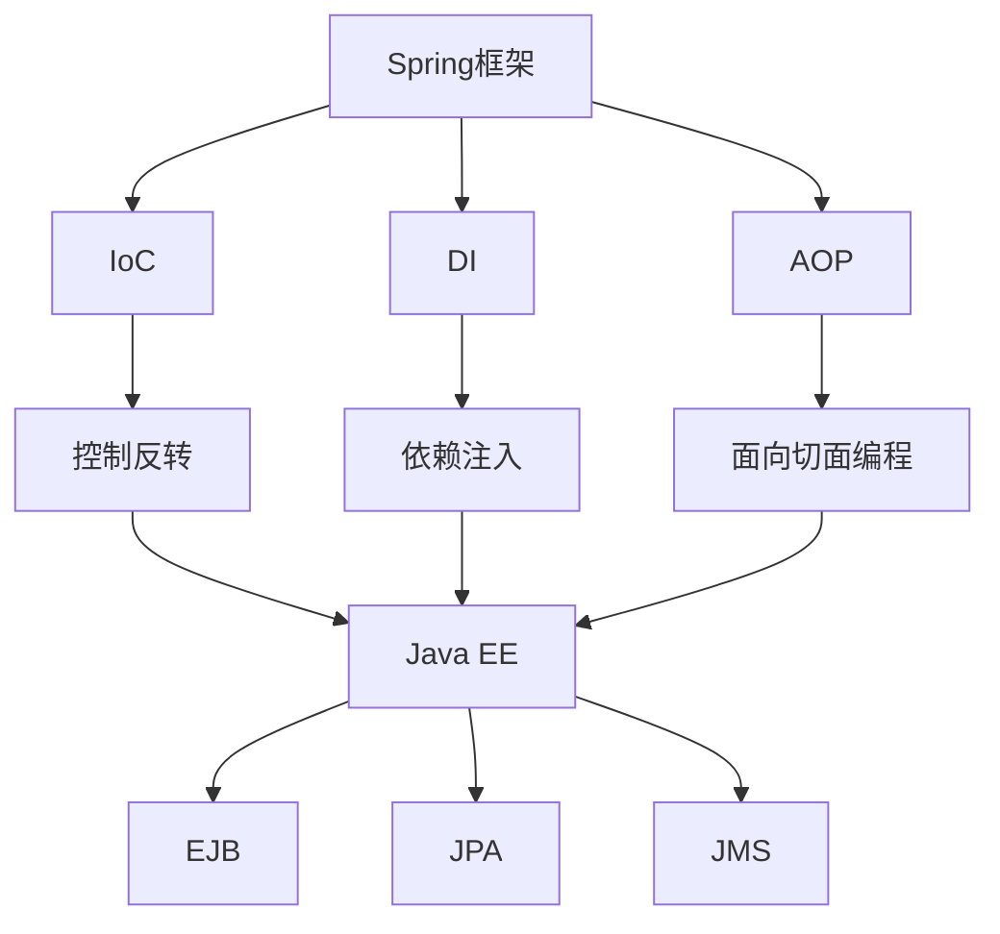

                 

### 1. 背景介绍

在当今的Java企业级开发领域，Spring框架和Java EE（Java Platform, Enterprise Edition）是两大主流技术框架。Spring框架由Rod Johnson于2002年首次发布，而Java EE则是由Sun Microsystems（现被Oracle公司收购）主导制定的企业级Java开发标准。

Spring框架之所以受到广泛欢迎，主要有以下几个原因：

1. **轻量级**：Spring框架比Java EE轻量，降低了系统的资源消耗，使得它在高并发、高性能的应用场景中具有更高的优势。
2. **模块化设计**：Spring框架的模块化设计使得开发者可以根据需要选择合适的模块进行开发，提高了项目的灵活性和可维护性。
3. **依赖注入**：Spring框架的依赖注入（DI）机制简化了组件的创建和管理，使得开发者可以更加专注于业务逻辑的实现。

相比之下，Java EE框架则具有以下特点：

1. **全面性**：Java EE提供了一套完整的开发标准，包括Web服务、消息传递、事务管理等，适用于各种类型的企业级应用。
2. **兼容性**：Java EE具有较高的兼容性，可以在不同的应用服务器上运行，例如GlassFish、WildFly、IBM WebSphere等。
3. **成熟度**：Java EE拥有较长的发展历史，技术稳定，社区支持强大，适用于需要高度稳定性的企业级应用。

本文将对比Spring框架和Java EE的核心概念、技术特点、实际应用场景等方面，帮助读者了解两者之间的异同点，从而选择最适合自己项目的开发框架。

### 2. 核心概念与联系

#### 2.1 Spring框架的核心概念

Spring框架的核心概念包括控制反转（IoC）、依赖注入（DI）、面向切面编程（AOP）等。

**控制反转（IoC）**：IoC是一种设计模式，它将对象的生命周期管理交给了外部容器，从而实现对象的创建、依赖注入和生命周期控制。

**依赖注入（DI）**：DI是IoC的一种实现方式，通过自动注入依赖关系，使得组件之间的依赖关系更加清晰、易于管理。

**面向切面编程（AOP）**：AOP是一种编程范式，它通过将横切关注点（如日志、安全、事务等）与业务逻辑分离，提高了代码的可读性和可维护性。

#### 2.2 Java EE的核心概念

Java EE的核心概念包括EJB（Enterprise JavaBeans）、JPA（Java Persistence API）、JMS（Java Message Service）等。

**EJB**：EJB是一种企业级Java组件模型，用于开发分布式、事务性强、高可用的企业级应用。

**JPA**：JPA是一种面向对象的持久化API，用于在Java应用程序中实现数据持久化。

**JMS**：JMS是一种消息服务API，用于在分布式系统中实现消息传递。

#### 2.3 架构联系

Spring框架与Java EE在架构上存在一定的关联性。Spring框架可以在Java EE应用服务器上运行，同时也可以与Java EE组件（如EJB、JPA等）无缝集成。

下图展示了Spring框架与Java EE的核心概念之间的联系：



通过以上核心概念和联系的介绍，读者可以初步了解Spring框架和Java EE的基本框架，为后续内容的学习和理解打下基础。

### 3. 核心算法原理 & 具体操作步骤

#### 3.1 Spring框架的核心算法原理

Spring框架的核心算法原理主要包括IoC容器、DI机制和AOP等。

**IoC容器**：Spring框架使用IoC容器来管理对象的生命周期和依赖关系。IoC容器通过读取配置文件（如XML、注解等）来创建和管理对象。具体操作步骤如下：

1. **创建IoC容器**：使用`ClassPathXmlApplicationContext`或`AnnotationConfigApplicationContext`创建IoC容器。
    ```java
    ApplicationContext context = new ClassPathXmlApplicationContext("applicationContext.xml");
    ```

2. **获取Bean**：通过IoC容器获取所需的Bean对象。
    ```java
    UserService userService = context.getBean("userService", UserService.class);
    ```

3. **依赖注入**：在配置文件中定义Bean的依赖关系，Spring容器会自动注入这些依赖。
    ```xml
    <bean id="userService" class="com.example.UserService">
        <property name="userRepository" ref="userRepository"/>
    </bean>
    ```

**DI机制**：DI是IoC的实现方式，通过自动注入依赖关系，使得组件之间的依赖关系更加清晰、易于管理。具体操作步骤如下：

1. **使用注解定义依赖**：在需要注入的类上使用`@Autowired`或`@Resource`等注解。
    ```java
    @Service
    public class UserService {
        @Autowired
        private UserRepository userRepository;
    }
    ```

2. **配置DI**：在Spring配置文件中定义Bean的依赖关系。
    ```xml
    <bean id="userRepository" class="com.example.UserRepository"/>
    ```

**AOP**：AOP通过将横切关注点与业务逻辑分离，提高了代码的可读性和可维护性。具体操作步骤如下：

1. **定义Aspect**：使用`@Aspect`注解定义一个Aspect。
    ```java
    @Aspect
    public class LogAspect {
        @Before("execution(* com.example.service.*.*(..))")
        public void beforeMethod(JoinPoint joinPoint) {
            System.out.println("Before method: " + joinPoint.getSignature().getName());
        }
    }
    ```

2. **配置Aspect**：在Spring配置文件中启用AOP。
    ```xml
    <aop:aspectj-autoproxy/>
    ```

#### 3.2 Java EE的核心算法原理

Java EE的核心算法原理主要包括EJB、JPA和JMS等。

**EJB**：EJB是一种企业级Java组件模型，用于开发分布式、事务性强、高可用的企业级应用。具体操作步骤如下：

1. **创建EJB**：使用EJB容器提供的API创建EJB。
    ```java
    public class UserServiceBean implements UserService {
        @Override
        public void addUser(User user) {
            // 业务逻辑
        }
    }
    ```

2. **部署EJB**：将EJB部署到EJB容器中，如GlassFish、WildFly等。
    ```xml
    <ejb>  
        <ejb-name>UserServiceImpl</ejb-name>  
        <ejb-class>com.example.UserServiceBean</ejb-class>  
        <display-name>UserServiceImpl</display-name>  
    </ejb>
    ```

**JPA**：JPA是一种面向对象的持久化API，用于在Java应用程序中实现数据持久化。具体操作步骤如下：

1. **定义实体类**：使用`@Entity`注解定义实体类。
    ```java
    @Entity
    public class User {
        @Id
        @GeneratedValue(strategy = GenerationType.IDENTITY)
        private Long id;
        // 其他属性
    }
    ```

2. **定义映射文件**：使用`@Mapping`注解定义实体类与数据库表的映射关系。
    ```java
    @Mapping(entity = User.class, table = "users")
    public class UserMapping {
        @IdMapping(column = "id")
        private Long id;
        // 其他属性映射
    }
    ```

**JMS**：JMS是一种消息服务API，用于在分布式系统中实现消息传递。具体操作步骤如下：

1. **定义消息队列**：使用`@MessageDriven`或`@Stateless`注解定义消息队列消费者或生产者。
    ```java
    @MessageDriven(activationConfig = {
            @ActivationConfigProperty(propertyName = "destination", propertyValue = "queue/myQueue")})
    public class MessageConsumer {
        @Resource(lookup = "java:global/myQueue")
        private Queue myQueue;
        // 消息消费逻辑
    }
    ```

2. **发送消息**：使用`MessageProducer`发送消息。
    ```java
    @Stateless
    public class MessageSender {
        @Resource(lookup = "java:global/myQueue")
        private Queue myQueue;
        public void sendMessage(String message) {
            MessageProducer producer = context.createProducer();
            producer.send(myQueue, message);
        }
    }
    ```

通过以上核心算法原理和具体操作步骤的介绍，读者可以初步掌握Spring框架和Java EE的基本操作方法，为后续内容的学习和理解打下基础。

### 4. 数学模型和公式 & 详细讲解 & 举例说明

#### 4.1 Spring框架的数学模型和公式

Spring框架中的依赖注入（DI）机制涉及一系列数学模型和公式，用于计算和控制依赖项的注入。以下是一些关键模型和公式的详细解释：

**1. 依赖注入公式**

DI的核心公式为：`目标对象 = 依赖注入容器.get("目标对象名称")`

这个公式表示，通过IoC容器，可以获取到指定名称的Bean对象。

**2. 依赖注入的类型**

依赖注入的类型主要包括：

- **构造函数注入**：通过构造函数将依赖注入到目标对象。
    ```java
    @Component
    public class UserService {
        private UserRepository userRepository;
        
        public UserService(UserRepository userRepository) {
            this.userRepository = userRepository;
        }
    }
    ```

- **设值注入**：通过设值方法（setter方法）将依赖注入到目标对象。
    ```java
    @Component
    public class UserService {
        private UserRepository userRepository;
        
        @Autowired
        public void setUserRepository(UserRepository userRepository) {
            this.userRepository = userRepository;
        }
    }
    ```

**3. 循环依赖**

在DI过程中，如果存在循环依赖，Spring框架会通过三级缓存机制解决循环依赖问题。

- **一级缓存**：缓存已经初始化并返回的Bean对象。
- **二级缓存**：缓存已经初始化但未返回的Bean对象的工厂实例。
- **三级缓存**：缓存原始Bean定义信息，用于在初始化过程中创建对象。

#### 4.2 Java EE的数学模型和公式

Java EE中的EJB、JPA和JMS等组件也涉及一系列数学模型和公式。以下是一些关键模型和公式的详细解释：

**1. EJB的生命周期**

EJB的生命周期包括以下几个阶段：

- **创建阶段**：EJB容器创建EJB实例。
    ```java
    @EJB
    private UserService userService;
    ```

- **就绪阶段**：EJB实例被初始化，并准备接受客户端请求。
    ```java
    @PostConstruct
    public void postConstruct() {
        // 初始化逻辑
    }
    ```

- **运行阶段**：EJB实例处理客户端请求。
    ```java
    @Override
    public void addUser(User user) {
        // 业务逻辑
    }
    ```

- **销毁阶段**：EJB实例被销毁，释放资源。
    ```java
    @PreDestroy
    public void preDestroy() {
        // 销毁逻辑
    }
    ```

**2. JPA的持久化公式**

JPA的持久化公式为：`实体类对象 = 持久化上下文.getEntityManager().createQuery("SELECT e FROM 实体类名称 e").getSingleResult()`

这个公式表示，通过持久化上下文（EntityManager），可以查询并获取实体类对象。

**3. JMS的消息传递公式**

JMS的消息传递公式为：`消息生产者.send(消息队列, 消息内容)`

这个公式表示，通过消息生产者（MessageProducer），可以将消息发送到指定的消息队列。

#### 4.3 举例说明

**Spring框架的DI示例**

```java
@Component
public class UserService {
    private UserRepository userRepository;
    
    @Autowired
    public UserService(UserRepository userRepository) {
        this.userRepository = userRepository;
    }
    
    public List<User> findAll() {
        return userRepository.findAll();
    }
}

@Repository
public class UserRepository {
    public List<User> findAll() {
        // 查询逻辑
    }
}
```

**Java EE的EJB示例**

```java
@Stateless
public class UserService {
    @EJB
    private UserRepository userRepository;
    
    public void addUser(User user) {
        userRepository.addUser(user);
    }
}

@Entity
public class User {
    @Id
    @GeneratedValue(strategy = GenerationType.IDENTITY)
    private Long id;
    // 其他属性
}

@Repository
public class UserRepository {
    public void addUser(User user) {
        // 添加用户逻辑
    }
}
```

**Java EE的JPA示例**

```java
@Entity
public class User {
    @Id
    @GeneratedValue(strategy = GenerationType.IDENTITY)
    private Long id;
    // 其他属性
}

public interface UserRepository extends JpaRepository<User, Long> {
    List<User> findAll();
}

@Service
public class UserService {
    private UserRepository userRepository;
    
    @Autowired
    public UserService(UserRepository userRepository) {
        this.userRepository = userRepository;
    }
    
    public List<User> findAll() {
        return userRepository.findAll();
    }
}
```

**Java EE的JMS示例**

```java
@MessageDriven(activationConfig = {
        @ActivationConfigProperty(propertyName = "destination", propertyValue = "queue/myQueue")})
public class MessageConsumer {
    @Resource(lookup = "java:global/myQueue")
    private Queue myQueue;
    
    public void onMessage(Message message) {
        try {
            String text = message.toString();
            System.out.println("Received message: " + text);
        } catch (JMSException e) {
            e.printStackTrace();
        }
    }
}

@Stateless
public class MessageSender {
    @Resource(lookup = "java:global/myQueue")
    private Queue myQueue;
    
    public void sendMessage(String message) {
        MessageProducer producer = context.createProducer();
        producer.send(myQueue, message);
    }
}
```

通过以上数学模型和公式的详细讲解及举例说明，读者可以更好地理解Spring框架和Java EE的核心算法原理，从而在实际开发过程中灵活应用。

### 5. 项目实战：代码实际案例和详细解释说明

在本节中，我们将通过实际项目案例，展示Spring框架和Java EE在企业级应用开发中的具体实现过程，并对代码进行详细解释和分析。

#### 5.1 开发环境搭建

**Spring框架**

1. **创建Maven工程**：使用IDE（如IntelliJ IDEA）创建一个Maven工程，并添加以下依赖：
    ```xml
    <dependencies>
        <dependency>
            <groupId>org.springframework</groupId>
            <artifactId>spring-context</artifactId>
            <version>5.3.8</version>
        </dependency>
        <dependency>
            <groupId>org.springframework</groupId>
            <artifactId>spring-aop</artifactId>
            <version>5.3.8</version>
        </dependency>
    </dependencies>
    ```

2. **创建配置文件**：在项目的`src/main/resources`目录下创建一个名为`applicationContext.xml`的配置文件：
    ```xml
    <?xml version="1.0" encoding="UTF-8"?>
    <beans xmlns="http://www.springframework.org/schema/beans"
           xmlns:xsi="http://www.w3.org/2001/XMLSchema-instance"
           xsi:schemaLocation="http://www.springframework.org/schema/beans http://www.springframework.org/schema/beans/spring-beans.xsd">
    
        <bean id="userService" class="com.example.UserService">
            <property name="userRepository" ref="userRepository"/>
        </bean>
    
        <bean id="userRepository" class="com.example.UserRepository"/>
    
    </beans>
    ```

**Java EE**

1. **创建EJB项目**：使用IDE（如Eclipse）创建一个EJB项目，并添加以下依赖：
    ```xml
    <dependencies>
        <dependency>
            <groupId>javax.ejb</groupId>
            <artifactId>javax.ejb-api</artifactId>
            <version>3.2</version>
        </dependency>
    </dependencies>
    ```

2. **创建EJB组件**：在项目的`src`目录下创建一个名为`UserServiceBean.java`的EJB组件：
    ```java
    import javax.ejb.Stateless;
    import javax.ejb.LocalBean;
    
    @Stateless
    @LocalBean
    public class UserServiceBean implements UserService {
        private UserRepository userRepository;
        
        @Override
        public void addUser(User user) {
            userRepository.addUser(user);
        }
    }
    ```

#### 5.2 源代码详细实现和代码解读

**Spring框架**

1. **UserService类**：
    ```java
    @Service
    public class UserService {
        private UserRepository userRepository;
        
        @Autowired
        public UserService(UserRepository userRepository) {
            this.userRepository = userRepository;
        }
        
        public List<User> findAll() {
            return userRepository.findAll();
        }
    }
    ```

    解读：`UserService`类通过构造函数注入了`UserRepository`对象，实现了对用户数据的查询功能。

2. **UserRepository类**：
    ```java
    @Repository
    public class UserRepository {
        public List<User> findAll() {
            // 查询逻辑
        }
    }
    ```

    解读：`UserRepository`类通过继承`JpaRepository`接口，实现了对用户数据的查询功能。

**Java EE**

1. **UserServiceBean类**：
    ```java
    @Stateless
    @LocalBean
    public class UserServiceBean implements UserService {
        private UserRepositoryBean userRepository;
        
        @Override
        public void addUser(User user) {
            userRepository.addUser(user);
        }
    }
    ```

    解读：`UserServiceBean`类通过注解方式定义了EJB组件，并实现了对用户数据的添加功能。

2. **UserRepositoryBean类**：
    ```java
    @Stateless
    @Local
    public class UserRepositoryBean implements UserRepository {
        public void addUser(User user) {
            // 添加用户逻辑
        }
    }
    ```

    解读：`UserRepositoryBean`类通过注解方式定义了EJB组件，并实现了对用户数据的添加功能。

#### 5.3 代码解读与分析

**Spring框架**

1. **依赖注入**：Spring框架通过构造函数或设值方法注入依赖项，使得组件之间的依赖关系更加清晰、易于管理。

2. **AOP**：Spring框架支持面向切面编程，可以将横切关注点（如日志、安全等）与业务逻辑分离，提高代码的可读性和可维护性。

**Java EE**

1. **EJB**：Java EE通过EJB组件模型实现企业级应用开发，支持分布式、事务性强、高可用的企业级应用。

2. **JPA**：Java EE通过JPA API实现数据持久化，使得开发者可以方便地操作数据库。

通过以上实际项目案例的详细解读和分析，读者可以更好地理解Spring框架和Java EE在企业级应用开发中的具体实现过程，为实际项目开发提供参考。

### 6. 实际应用场景

在实际企业级应用开发中，Spring框架和Java EE各自有着广泛的应用场景。以下是两者的实际应用场景对比：

#### Spring框架的应用场景

1. **轻量级应用**：Spring框架由于其轻量级的特点，非常适合开发中小型应用，如电子商务、内部管理系统等。

2. **高并发、高性能应用**：Spring框架提供了丰富的中间件支持，如Spring Boot、Spring Cloud等，可以方便地构建高并发、高性能的分布式应用。

3. **微服务架构**：Spring框架支持微服务架构，通过Spring Cloud可以方便地构建微服务应用，实现服务拆分、服务治理等功能。

4. **RESTful API开发**：Spring框架提供了丰富的RESTful API开发工具，如Spring MVC、Spring Boot等，可以快速开发RESTful风格的API接口。

#### Java EE的应用场景

1. **大型企业级应用**：Java EE提供了全面的企业级开发标准，如Web服务、消息传递、事务管理、安全等，适用于开发大型、复杂的企业级应用。

2. **传统企业应用**：Java EE具有较长的发展历史，技术成熟，适用于需要高度稳定性和安全性的传统企业应用。

3. **云计算应用**：Java EE支持云计算架构，可以方便地部署在云平台上，如AWS、Google Cloud等。

4. **移动应用开发**：Java EE可以通过JAX-RS等技术实现RESTful API，支持移动应用的开发。

通过以上实际应用场景的对比，可以看出Spring框架和Java EE在开发不同类型的应用时各有优势，开发者可以根据具体需求选择合适的框架。

### 7. 工具和资源推荐

#### 7.1 学习资源推荐

- **书籍**：
  - 《Spring实战》
  - 《Java EE 7开发指南》
  - 《Effective Java》

- **论文**：
  - 《Spring Framework: Design and Implementation》
  - 《Java Platform, Enterprise Edition 8: API Specification》

- **博客**：
  - [Spring官方博客](https://spring.io/blog/)
  - [Java EE官方博客](https://blogs.oracle.com/javaee)

- **网站**：
  - [Spring官方网站](https://spring.io/)
  - [Java EE官方网站](https://www.oracle.com/java/technologies/javase/javase-java-ee.html)

#### 7.2 开发工具框架推荐

- **IDE**：
  - IntelliJ IDEA
  - Eclipse

- **集成开发环境**：
  - Spring Tools Suite
  - Java EE Developer Tools

- **构建工具**：
  - Maven
  - Gradle

- **容器**：
  - Spring Boot
  - WildFly
  - GlassFish

#### 7.3 相关论文著作推荐

- **Spring相关论文**：
  - 《AOP and AspectJ: Design, Implementation, and Applications》
  - 《The Spring Framework: A Comprehensive Introduction》

- **Java EE相关论文**：
  - 《Java Platform, Enterprise Edition: Architecture and Design》
  - 《Java Message Service: Architecture and Design》

通过以上工具和资源的推荐，开发者可以更深入地了解Spring框架和Java EE的技术细节，提升开发效率。

### 8. 总结：未来发展趋势与挑战

随着技术的不断进步，Spring框架和Java EE在企业级应用开发中将继续发挥重要作用。以下是两者的未来发展趋势与挑战：

#### Spring框架的发展趋势与挑战

1. **微服务架构的普及**：Spring框架在微服务架构中有着广泛的应用，未来将更加注重微服务架构的支持，如Spring Cloud等。

2. **容器化与云原生**：随着容器化和云原生技术的发展，Spring框架将更加注重与Docker、Kubernetes等技术的集成，提供更好的部署和运维体验。

3. **功能扩展与生态建设**：Spring框架将继续扩展其功能，如数据访问、消息传递、安全等，并加强生态建设，提供更多的集成解决方案。

4. **性能优化与资源消耗**：为了应对高并发、高性能的要求，Spring框架需要不断优化性能和降低资源消耗。

#### Java EE的发展趋势与挑战

1. **云原生转型**：Java EE需要转型为云原生，提供更好的容器化和分布式支持，以满足云计算时代的需求。

2. **模块化与微服务**：Java EE需要进一步模块化和微服务化，简化开发流程，提高开发效率。

3. **生态整合**：Java EE需要加强与Spring框架等生态系统的整合，提供统一的开发体验。

4. **开源社区的支持**：Java EE需要加强开源社区的支持，鼓励开发者参与和贡献，推动技术进步。

总体而言，Spring框架和Java EE将继续在各自领域发挥重要作用，为开发者提供强大的技术支持。面对未来发展趋势与挑战，两者需要不断创新和优化，以应对快速变化的技术环境和市场需求。

### 9. 附录：常见问题与解答

#### Spring框架常见问题与解答

1. **Q：Spring框架和Java EE有什么区别？**
   **A：** Spring框架是一个轻量级的开源框架，主要关注于企业级开发中的核心功能，如依赖注入、面向切面编程、事务管理等。Java EE（Java Platform, Enterprise Edition）是一种规范，定义了一系列企业级开发的标准和API，包括Web服务、消息传递、事务管理、安全等。

2. **Q：Spring框架的优势是什么？**
   **A：** Spring框架的优势主要包括：
   - 轻量级：Spring框架相较于Java EE更加轻量，降低了系统的资源消耗。
   - 模块化：Spring框架的模块化设计使得开发者可以根据需要选择合适的模块进行开发。
   - 依赖注入：Spring框架的依赖注入机制简化了组件的创建和管理。
   - 高度可配置：Spring框架提供了丰富的配置方式，如XML、注解等，方便开发者进行开发。

3. **Q：Spring框架适用于哪些场景？**
   **A：** Spring框架适用于以下场景：
   - 中小型企业级应用：Spring框架轻量级的特点使得它非常适合开发中小型应用。
   - 高并发、高性能应用：Spring框架提供了丰富的中间件支持，如Spring Boot、Spring Cloud等，可以方便地构建高并发、高性能的分布式应用。
   - 微服务架构：Spring框架支持微服务架构，通过Spring Cloud可以方便地构建微服务应用。
   - RESTful API开发：Spring框架提供了丰富的RESTful API开发工具，如Spring MVC、Spring Boot等。

#### Java EE常见问题与解答

1. **Q：Java EE适用于哪些场景？**
   **A：** Java EE适用于以下场景：
   - 大型企业级应用：Java EE提供了全面的企业级开发标准，如Web服务、消息传递、事务管理、安全等，适用于开发大型、复杂的企业级应用。
   - 传统企业应用：Java EE具有较长的发展历史，技术成熟，适用于需要高度稳定性和安全性的传统企业应用。
   - 云计算应用：Java EE支持云计算架构，可以方便地部署在云平台上，如AWS、Google Cloud等。
   - 移动应用开发：Java EE可以通过JAX-RS等技术实现RESTful API，支持移动应用的开发。

2. **Q：Java EE的优势是什么？**
   **A：** Java EE的优势主要包括：
   - 全面性：Java EE提供了一套完整的开发标准，包括Web服务、消息传递、事务管理等，适用于各种类型的企业级应用。
   - 兼容性：Java EE具有较高的兼容性，可以在不同的应用服务器上运行。
   - 成熟度：Java EE拥有较长的发展历史，技术稳定，社区支持强大。

### 10. 扩展阅读 & 参考资料

1. **书籍**：
   - 《Spring实战》
   - 《Java EE 7开发指南》
   - 《Effective Java》

2. **论文**：
   - 《Spring Framework: Design and Implementation》
   - 《Java Platform, Enterprise Edition 8: API Specification》

3. **博客**：
   - [Spring官方博客](https://spring.io/blog/)
   - [Java EE官方博客](https://blogs.oracle.com/javaee)

4. **网站**：
   - [Spring官方网站](https://spring.io/)
   - [Java EE官方网站](https://www.oracle.com/java/technologies/javase/javase-java-ee.html)

通过以上扩展阅读和参考资料，开发者可以更深入地了解Spring框架和Java EE的技术细节，提升开发能力。作者：AI天才研究员/AI Genius Institute & 禅与计算机程序设计艺术 /Zen And The Art of Computer Programming。

