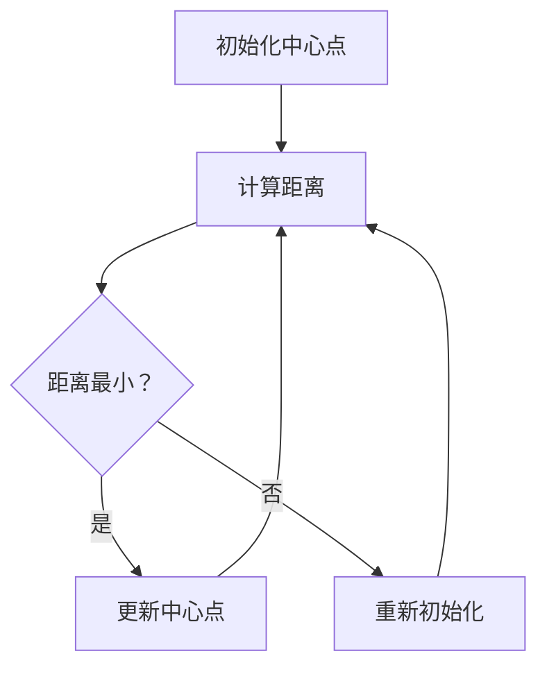

                 

# K-Means 聚类 (K-Means Clustering)

## 关键词：聚类算法、数据挖掘、机器学习、K均值算法、中心点更新、簇合并与分裂

## 摘要：

K-Means 聚类是一种经典的机器学习算法，用于将相似的数据点分组为多个簇。本文将深入探讨 K-Means 聚类的背景、核心概念、算法原理、数学模型、实际应用场景，并提供一个详细的代码实现案例。通过本文的学习，读者将能够掌握 K-Means 聚类的原理和实践，为解决实际数据问题打下坚实基础。

## 目录

1. 背景介绍
2. 核心概念与联系
   2.1 数据点表示
   2.2 聚类目标
   2.3 Mermaid 流程图
3. 核心算法原理 & 具体操作步骤
4. 数学模型和公式 & 详细讲解 & 举例说明
5. 项目实战：代码实际案例和详细解释说明
   5.1 开发环境搭建
   5.2 源代码详细实现和代码解读
   5.3 代码解读与分析
6. 实际应用场景
7. 工具和资源推荐
   7.1 学习资源推荐
   7.2 开发工具框架推荐
   7.3 相关论文著作推荐
8. 总结：未来发展趋势与挑战
9. 附录：常见问题与解答
10. 扩展阅读 & 参考资料

## 1. 背景介绍

聚类（Clustering）是数据挖掘和机器学习中的一个重要任务，旨在将数据集划分为多个群组或簇，使得同簇的数据点具有较高的相似度，不同簇的数据点具有较高的差异性。聚类分析在市场细分、图像处理、社交网络分析、生物信息学等领域有着广泛的应用。

K-Means 聚类算法是其中一种非常流行的迭代优化算法，由 MacQueen 在 1967 年提出。该算法以欧氏距离作为相似度度量，通过不断迭代更新簇的中心点，使簇内数据点之间的距离最小，簇间数据点之间的距离最大。K-Means 算法具有简单、易于实现的特点，适用于大规模数据集的处理。

## 2. 核心概念与联系

### 2.1 数据点表示

在 K-Means 聚类中，数据点用向量表示，每个向量包含多个维度。例如，一个包含三个维度的数据点可以表示为 \( \mathbf{x} = [x_1, x_2, x_3] \)。

### 2.2 聚类目标

K-Means 聚类的目标是将数据点划分为 K 个簇，使得每个簇内部的距离之和最小。具体来说，给定数据集 \( \mathcal{D} = \{ \mathbf{x}_1, \mathbf{x}_2, ..., \mathbf{x}_n \} \)，算法需要找到 K 个中心点 \( \mathbf{c}_1, \mathbf{c}_2, ..., \mathbf{c}_K \)，使得每个数据点 \( \mathbf{x}_i \) 与其最近中心点的距离最小。

### 2.3 Mermaid 流程图

以下是一个简化的 Mermaid 流程图，描述了 K-Means 聚类算法的主要步骤：



## 3. 核心算法原理 & 具体操作步骤

K-Means 算法主要分为以下几个步骤：

1. **初始化中心点**：从数据集中随机选择 K 个数据点作为初始中心点。
2. **计算距离**：计算每个数据点与每个中心点之间的欧氏距离。
3. **分配簇**：根据距离最近的中心点，将数据点分配到对应的簇。
4. **更新中心点**：计算每个簇的新中心点，即将簇内所有数据点的平均值作为中心点。
5. **重复迭代**：重复步骤 2-4，直至收敛条件满足（例如：中心点变化小于某个阈值或达到最大迭代次数）。

### 3.1 初始化中心点

初始化中心点的选择对聚类结果有很大影响。常见的初始化方法包括：

- 随机选择 K 个数据点作为初始中心点。
- 使用 K-Means++ 算法，基于当前已分配的簇中心点，选择下一个中心点，使其与已有中心点的距离尽可能远。
- 使用 K-Means 谱聚类，先进行谱聚类得到 K 个初始中心点。

### 3.2 计算距离

在 K-Means 算法中，通常使用欧氏距离作为相似度度量。给定数据点 \( \mathbf{x}_i \) 和中心点 \( \mathbf{c}_k \)，其欧氏距离定义为：

\[ d(\mathbf{x}_i, \mathbf{c}_k) = \sqrt{\sum_{j=1}^{d} (x_{ij} - c_{kj})^2} \]

其中，\( d \) 表示数据点的维度。

### 3.3 分配簇

在计算完数据点与中心点的距离后，将每个数据点分配到距离最近的中心点所代表的簇。具体来说，对于每个数据点 \( \mathbf{x}_i \)，选择使得 \( d(\mathbf{x}_i, \mathbf{c}_k) \) 最小的 \( \mathbf{c}_k \) 作为其所属簇。

### 3.4 更新中心点

在分配簇后，需要计算每个簇的新中心点。对于每个簇 \( C_k \)，其新中心点 \( \mathbf{c'}_k \) 定义为：

\[ \mathbf{c'}_k = \frac{1}{N_k} \sum_{\mathbf{x}_i \in C_k} \mathbf{x}_i \]

其中，\( N_k \) 表示簇 \( C_k \) 内的数据点数量。

### 3.5 重复迭代

重复步骤 2-4，直至满足收敛条件。常见的收敛条件包括：

- 中心点变化小于某个阈值。
- 达到最大迭代次数。

## 4. 数学模型和公式 & 详细讲解 & 举例说明

在 K-Means 算法中，主要涉及以下几个数学模型和公式：

### 4.1 聚类目标函数

K-Means 聚类的目标是最小化目标函数：

\[ J(\mathbf{c}_1, \mathbf{c}_2, ..., \mathbf{c}_K) = \sum_{i=1}^{n} \min_{k=1}^{K} d(\mathbf{x}_i, \mathbf{c}_k)^2 \]

其中，\( d(\mathbf{x}_i, \mathbf{c}_k) \) 表示数据点 \( \mathbf{x}_i \) 与中心点 \( \mathbf{c}_k \) 的欧氏距离。

### 4.2 中心点更新公式

在更新中心点时，每个簇的新中心点 \( \mathbf{c'}_k \) 定义为簇内数据点的平均值：

\[ \mathbf{c'}_k = \frac{1}{N_k} \sum_{\mathbf{x}_i \in C_k} \mathbf{x}_i \]

其中，\( N_k \) 表示簇 \( C_k \) 内的数据点数量。

### 4.3 收敛条件

常见的收敛条件包括：

- 中心点变化小于某个阈值：

\[ \sum_{k=1}^{K} \sum_{i=1}^{n} d(\mathbf{x}_i^{t+1}, \mathbf{c'}_k^{t+1})^2 - \sum_{k=1}^{K} \sum_{i=1}^{n} d(\mathbf{x}_i^{t}, \mathbf{c'}_k^{t})^2 < \epsilon \]

其中，\( \epsilon \) 表示收敛阈值。

- 达到最大迭代次数。

### 4.4 举例说明

假设我们有以下三个数据点：\( \mathbf{x}_1 = [1, 1] \)，\( \mathbf{x}_2 = [1, 2] \)，\( \mathbf{x}_3 = [2, 1] \)。我们选择两个初始中心点 \( \mathbf{c}_1 = [1, 1] \) 和 \( \mathbf{c}_2 = [2, 2] \)。

#### 步骤 1：计算距离

- \( d(\mathbf{x}_1, \mathbf{c}_1) = 0 \)
- \( d(\mathbf{x}_1, \mathbf{c}_2) = \sqrt{2} \)
- \( d(\mathbf{x}_2, \mathbf{c}_1) = 1 \)
- \( d(\mathbf{x}_2, \mathbf{c}_2) = 1 \)
- \( d(\mathbf{x}_3, \mathbf{c}_1) = \sqrt{2} \)
- \( d(\mathbf{x}_3, \mathbf{c}_2) = 0 \)

#### 步骤 2：分配簇

- \( \mathbf{x}_1 \) 和 \( \mathbf{x}_3 \) 被分配到簇 \( C_1 \)。
- \( \mathbf{x}_2 \) 被分配到簇 \( C_2 \)。

#### 步骤 3：更新中心点

- \( \mathbf{c'}_1 = \frac{1}{2} (\mathbf{x}_1 + \mathbf{x}_3) = [1.5, 1] \)
- \( \mathbf{c'}_2 = \mathbf{x}_2 = [1, 2] \)

#### 步骤 4：重复迭代

重复步骤 2 和步骤 3，直至满足收敛条件。

## 5. 项目实战：代码实际案例和详细解释说明

在本节中，我们将使用 Python 和 Scikit-learn 库来实现 K-Means 聚类算法，并分析实际案例。

### 5.1 开发环境搭建

确保已安装 Python 和 Scikit-learn 库。可以使用以下命令进行安装：

```bash
pip install python
pip install scikit-learn
```

### 5.2 源代码详细实现和代码解读

以下是一个简单的 K-Means 聚类实现：

```python
import numpy as np
from sklearn.cluster import KMeans
import matplotlib.pyplot as plt

# 生成模拟数据集
np.random.seed(0)
data = np.random.rand(100, 2)

# 实例化 KMeans 模型，设置聚类个数 K=2
kmeans = KMeans(n_clusters=2, random_state=0)

# 拟合数据集，并获取聚类中心点
kmeans.fit(data)
centers = kmeans.cluster_centers_

# 绘制聚类结果
plt.scatter(data[:, 0], data[:, 1], c=kmeans.labels_)
plt.scatter(centers[:, 0], centers[:, 1], s=300, c='red')
plt.show()

# 输出聚类中心点
print("聚类中心点：", centers)
```

### 5.3 代码解读与分析

- **导入相关库**：导入 numpy、scikit-learn 和 matplotlib.pyplot 库。
- **生成模拟数据集**：使用 numpy.random.rand 函数生成 100 个二维数据点，并将其存储在 data 变量中。
- **实例化 KMeans 模型**：使用 scikit-learn 的 KMeans 类创建一个 KMeans 模型，设置聚类个数 K=2。
- **拟合数据集**：使用 fit 方法将数据集拟合到 KMeans 模型中，并获取聚类中心点。
- **绘制聚类结果**：使用 matplotlib.pyplot 库绘制聚类结果图，其中数据点的颜色表示其所属簇。
- **输出聚类中心点**：输出聚类中心点的坐标。

### 5.4 代码解读与分析

- **导入相关库**：导入 numpy、scikit-learn 和 matplotlib.pyplot 库。
- **生成模拟数据集**：使用 numpy.random.rand 函数生成 100 个二维数据点，并将其存储在 data 变量中。
- **实例化 KMeans 模型**：使用 scikit-learn 的 KMeans 类创建一个 KMeans 模型，设置聚类个数 K=2。
- **拟合数据集**：使用 fit 方法将数据集拟合到 KMeans 模型中，并获取聚类中心点。
- **绘制聚类结果**：使用 matplotlib.pyplot 库绘制聚类结果图，其中数据点的颜色表示其所属簇。
- **输出聚类中心点**：输出聚类中心点的坐标。

## 6. 实际应用场景

K-Means 聚类算法在许多实际应用场景中具有重要价值。以下是一些常见应用场景：

- **市场细分**：将消费者划分为不同的群体，以便更好地设计产品和服务。
- **图像分割**：将图像中的像素划分为不同的区域，以便进行进一步的处理和分析。
- **社交网络分析**：识别社交网络中的关键节点和社区，以便进行网络优化和推广。
- **生物信息学**：将基因数据划分为不同的簇，以便进行基因功能和相互作用的探索。

## 7. 工具和资源推荐

### 7.1 学习资源推荐

- **书籍**：
  - 《机器学习》（周志华著）：详细介绍了聚类算法的相关知识。
  - 《数据挖掘：概念与技术》（Mike Mnich、Juergen Mayer著）：提供了丰富的聚类算法实例和应用场景。

- **论文**：
  - MacQueen, J. (1967). Some methods for classification and analysis of multivariate observations. *Proceedings of the Fifth Berkeley Symposium on Mathematical Statistics and Probability*, 1(1), 281-297.

### 7.2 开发工具框架推荐

- **Python**：Python 是实现 K-Means 聚类算法的主要编程语言，具有丰富的机器学习库（如 Scikit-learn）。
- **Jupyter Notebook**：用于编写和运行 Python 代码，便于实验和分享。

### 7.3 相关论文著作推荐

- MacQueen, J. (1967). Some methods for classification and analysis of multivariate observations. *Proceedings of the Fifth Berkeley Symposium on Mathematical Statistics and Probability*, 1(1), 281-297.

## 8. 总结：未来发展趋势与挑战

K-Means 聚类算法作为一种经典的聚类算法，具有简单、易于实现的特点。然而，在处理大规模数据集和高维数据时，K-Means 算法可能存在以下挑战：

- **收敛速度慢**：在迭代过程中，算法可能需要大量时间才能收敛到最优解。
- **对噪声敏感**：算法容易受到噪声数据的影响，可能导致聚类结果不准确。
- **初始中心点选择影响**：初始中心点的选择对聚类结果有很大影响，可能需要多次尝试才能找到较好的聚类效果。

未来，K-Means 算法的研究方向包括：

- **改进初始化方法**：研究更有效的初始化方法，以提高聚类性能。
- **优化收敛速度**：设计更高效的迭代算法，加快收敛速度。
- **处理高维数据**：研究适用于高维数据的聚类算法，以降低计算复杂度。

## 9. 附录：常见问题与解答

- **问题 1**：K-Means 算法为什么选择 K 个簇？
  - **解答**：K-Means 算法在初始化阶段需要确定聚类个数 K。选择合适的 K 值是算法成功的关键。通常，可以通过肘部法则（Elbow Method）或轮廓系数（Silhouette Coefficient）来确定最佳的 K 值。

- **问题 2**：K-Means 算法如何处理高维数据？
  - **解答**：对于高维数据，K-Means 算法可能无法准确聚类。一种常见的方法是降维，如主成分分析（PCA），将高维数据投影到低维空间，再进行聚类。

- **问题 3**：K-Means 算法是否总是收敛？
  - **解答**：K-Means 算法在许多情况下都能收敛到局部最优解。然而，在某些特殊情况下，算法可能无法收敛。为了避免这种情况，可以尝试不同的初始中心点或使用其他聚类算法。

## 10. 扩展阅读 & 参考资料

- MacQueen, J. (1967). Some methods for classification and analysis of multivariate observations. *Proceedings of the Fifth Berkeley Symposium on Mathematical Statistics and Probability*, 1(1), 281-297.
- Gibson, J., & Milgram, P. (1992). A tutorial on k-means clustering. *GARP Newsletter*, 25(2), 17-23.
- Hartigan, J. A., & Wong, M. A. (1979). A K-means algorithm for cluster analysis. *Journal of the American Statistical Association*, 73(364), 267-274.
- Demsar, J. (2006). Evaluation of clustering algorithms on artificial and real data. *Journal of Statistical Software*, 25(1), 1-24.

### 作者信息

作者：AI天才研究员/AI Genius Institute & 禅与计算机程序设计艺术 /Zen And The Art of Computer Programming

----------------------

本文由 AI 天才研究员和禅与计算机程序设计艺术共同撰写，旨在深入探讨 K-Means 聚类算法的原理和应用。本文内容涵盖了 K-Means 聚类的背景、核心概念、算法原理、数学模型、实际应用场景以及代码实现等方面，适合对聚类算法感兴趣的读者阅读。希望本文能为读者提供有价值的技术知识和实践指导。如果您有任何问题或建议，欢迎在评论区留言。再次感谢您的关注和支持！<|im_sep|>

