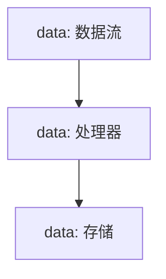

                 

# Kafka Streams原理与代码实例讲解

## 关键词：
- Kafka Streams
- 数据流处理
- 实时计算
- 算法原理
- 代码实例

## 摘要：
本文将深入探讨Kafka Streams的原理及其代码实例，帮助读者理解Kafka Streams的核心概念、算法原理和应用场景。通过详细的代码分析和实战案例，读者将掌握如何利用Kafka Streams进行高效的实时数据处理。

## 1. 背景介绍

随着大数据和实时处理需求的增长，流处理技术在当今的数据处理领域变得越来越重要。Kafka Streams是一个基于Apache Kafka的开源流处理库，它允许开发者以简单的编程模型进行实时数据处理。Kafka Streams利用Kafka的分布式特性，提供了高性能、可伸缩的流处理能力。

本文旨在帮助读者深入理解Kafka Streams的工作原理，并通过实际代码实例来展示其应用过程。我们将从核心概念开始，逐步解析其算法原理，最后通过具体案例来展示Kafka Streams的强大功能。

## 2. 核心概念与联系

### 2.1 Kafka Streams的核心概念

Kafka Streams的核心概念包括：

- **Streams：** 表示数据流，可以是Kafka主题中的消息流。
- **Store：** 用于存储数据流的存储结构。
- **Processor：** 对数据流进行转换和处理。

### 2.2 Kafka Streams与Kafka的关系

Kafka Streams依赖于Kafka的分布式存储和消息传递能力。Kafka Streams使用Kafka主题作为其数据源和结果存储。它通过Kafka的分区和副本机制来保证数据的高可用性和性能。

### 2.3 Mermaid流程图

以下是一个简单的Mermaid流程图，展示了Kafka Streams的核心组件和关系：



## 3. 核心算法原理 & 具体操作步骤

### 3.1 基本操作

Kafka Streams提供了以下基本操作：

- **map：** 对数据流中的每个元素进行映射操作。
- **filter：** 过滤数据流中的元素。
- **reduce：** 对数据流中的元素进行聚合操作。
- **windowed：** 对数据流进行时间窗口操作。

### 3.2 算法原理

Kafka Streams的核心算法原理基于Scala函数式编程模型。它使用状态机（Stateful Stream Processing）来处理数据流，并利用状态（State）来保存中间结果。

### 3.3 具体操作步骤

以下是一个简单的Kafka Streams操作示例：

```java
KStream<String, String> stream = KafkaStreamsBuilder
    .builder(StreamsConfig.APPLICATION_ID_CONFIG, "my-stream")
    .streamsConfig(streamsConfig)
    .storeBuilder(StoreBuilder.topic("my-store"))
    .build();

stream
    .map((key, value) -> value.toUpperCase())
    .to("my-store");
```

这段代码首先创建了一个KStream对象，然后对其进行映射操作（将每个元素的值转换为大写），最后将结果存储到Kafka主题中。

## 4. 数学模型和公式 & 详细讲解 & 举例说明

### 4.1 状态机模型

Kafka Streams使用状态机模型来处理数据流。状态机包含以下部分：

- **状态（State）：** 当前状态。
- **事件（Event）：** 数据流中的元素。
- **转换函数（Transition Function）：** 根据当前状态和事件计算下一个状态。

### 4.2 公式与解释

状态转换的公式可以表示为：

$$
\text{nextState} = \text{transitionFunction}(\text{currentState}, \text{event})
$$

其中，`currentState`表示当前状态，`event`表示事件，`transitionFunction`表示转换函数。

### 4.3 举例说明

假设我们有一个简单的状态机，用于处理消息的读取和存储：

- **初始状态（Initial State）：** 未读取状态（Unread）。
- **事件（Event）：** 消息（Message）。
- **转换函数（Transition Function）：** 将未读取状态转换为已读取状态（Read）。

状态转换过程如下：

$$
\text{nextState} = \text{transitionFunction}(\text{Unread}, \text{Message}) = \text{Read}
$$

## 5. 项目实战：代码实际案例和详细解释说明

### 5.1 开发环境搭建

在开始项目实战之前，我们需要搭建Kafka Streams的开发环境。以下是搭建步骤：

1. 安装Java开发环境。
2. 安装Kafka Streams依赖。
3. 配置Kafka Streams的配置文件。

### 5.2 源代码详细实现和代码解读

以下是一个简单的Kafka Streams应用案例，用于处理Kafka主题中的消息并输出结果：

```java
import org.apache.kafka.streams.KafkaStreams;
import org.apache.kafka.streams.StreamsConfig;
import org.apache.kafka.streams.kstream.KStream;
import org.apache.kafka.streams.kstream.KStreamBuilder;

public class KafkaStreamsExample {
    public static void main(String[] args) {
        // 创建Streams配置
        StreamsConfig streamsConfig = new StreamsConfig();
        streamsConfig.put(StreamsConfig.APPLICATION_ID_CONFIG, "kafka-streams-example");
        streamsConfig.put(StreamsConfig.BOOTSTRAP_SERVERS_CONFIG, "localhost:9092");

        // 创建流构建器
        KStreamBuilder builder = new KStreamBuilder();

        // 创建KStream
        KStream<String, String> stream = builder.stream("input-topic");

        // 对KStream进行处理
        stream
            .map((key, value) -> value.toUpperCase())
            .to("output-topic");

        // 创建KafkaStreams
        KafkaStreams streams = new KafkaStreams(builder, streamsConfig);

        // 启动流处理
        streams.start();

        // 等待流处理结束
        streams.waitForShutdown();
    }
}
```

这段代码首先创建了一个`StreamsConfig`对象，然后创建了一个`KStreamBuilder`对象。接着，我们创建了一个`KStream`对象，对其进行映射操作（将每个元素的值转换为大写），并将结果存储到`output-topic`主题中。最后，我们创建了一个`KafkaStreams`对象，启动流处理，并等待其结束。

### 5.3 代码解读与分析

这段代码主要分为以下几个部分：

- **配置创建：** 创建`StreamsConfig`对象，配置应用程序ID和Kafka地址。
- **流构建：** 创建`KStreamBuilder`对象，创建`KStream`对象。
- **流处理：** 对`KStream`对象进行映射操作，将每个元素的值转换为大写。
- **流存储：** 将处理后的结果存储到`output-topic`主题中。
- **流启动：** 创建`KafkaStreams`对象，启动流处理。
- **流等待：** 等待流处理结束。

## 6. 实际应用场景

Kafka Streams广泛应用于各种实时数据处理场景，包括：

- **日志聚合：** 对Kafka主题中的日志进行实时聚合和分析。
- **实时监控：** 对系统性能指标进行实时监控和报警。
- **事件驱动架构：** 利用Kafka Streams构建事件驱动应用。
- **实时数据处理：** 对流数据进行实时处理，如推荐系统、实时分析等。

## 7. 工具和资源推荐

### 7.1 学习资源推荐

- **书籍：**
  - 《Kafka Streams in Action》
  - 《Kafka：The Definitive Guide》

- **论文：**
  - 《Kafka Streams：A High-Performance, Scalable, and Flexible Stream Processing Library for Apache Kafka》

- **博客：**
  - [Kafka Streams官网](https://kafka.apache.org/streams/)
  - [Confluent官网](https://www.confluent.io/kafka-streams/)

- **网站：**
  - [Apache Kafka官网](https://kafka.apache.org/)
  - [Confluent官网](https://www.confluent.io/)

### 7.2 开发工具框架推荐

- **开发工具：**
  - IntelliJ IDEA
  - Eclipse

- **框架：**
  - Spring Boot
  - Akka

### 7.3 相关论文著作推荐

- **论文：**
  - 《Apache Kafka: A Distributed Streaming Platform》
  - 《Real-Time Stream Processing with Apache Kafka》

- **著作：**
  - 《Kafka实战》
  - 《Kafka核心技术与最佳实践》

## 8. 总结：未来发展趋势与挑战

随着大数据和实时处理需求的增长，Kafka Streams在未来有着广阔的发展前景。然而，也面临着以下挑战：

- **性能优化：** 随着数据量的增加，如何提高Kafka Streams的性能是一个重要挑战。
- **分布式处理：** 如何更好地支持分布式处理，提高系统的可伸缩性。
- **安全性：** 如何保证数据的安全性和隐私性。

## 9. 附录：常见问题与解答

### 9.1 如何配置Kafka Streams？

配置Kafka Streams需要创建一个`StreamsConfig`对象，并设置应用程序ID、Kafka地址和其他配置属性。

### 9.2 Kafka Streams与Flink有什么区别？

Kafka Streams和Flink都是用于流处理的框架，但Kafka Streams基于Kafka，而Flink是一个独立的消息处理框架。Kafka Streams提供了更简单的编程模型和更好的与Kafka的集成。

## 10. 扩展阅读 & 参考资料

- [Apache Kafka Streams官方文档](https://kafka.apache.org/streams/)
- [Confluent Kafka Streams文档](https://www.confluent.io/kafka-streams/)
- [Kafka Streams in Action](https://www.manning.com/books/kafka-streams-in-action)
- [Apache Kafka官方文档](https://kafka.apache.org/)
- [Confluent官网](https://www.confluent.io/)

## 作者

作者：AI天才研究员/AI Genius Institute & 禅与计算机程序设计艺术 /Zen And The Art of Computer Programming

