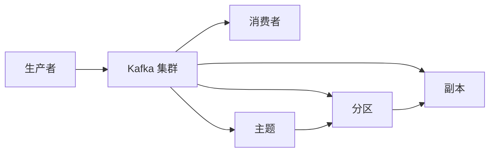

                 

# Kafka 原理与代码实例讲解

> **关键词：** Kafka, 消息队列，分布式系统，实时数据流，Zookeeper，分区，副本，消费者，生产者，监控，可靠性

> **摘要：** 本文将深入探讨 Kafka 的原理、架构设计、核心算法以及具体操作步骤。通过代码实例讲解，帮助读者全面了解 Kafka 的运作机制，掌握其在分布式系统中的应用。同时，文章还将介绍 Kafka 的实际应用场景、推荐学习资源和开发工具框架，总结未来发展趋势与挑战。

## 1. 背景介绍

Kafka 是由 LinkedIn 开发并开源的分布式流处理平台，主要用于构建实时数据流和流处理应用。Kafka 基于分布式系统设计，具有高吞吐量、高性能、可扩展性和高可用性等特点。在金融、电商、物联网、社交媒体等领域，Kafka 广泛应用于日志收集、实时数据处理、应用集成等场景。

Kafka 的主要组件包括：

- **生产者（Producer）**：负责将消息发送到 Kafka 集群。
- **消费者（Consumer）**：从 Kafka 集群中消费消息。
- **主题（Topic）**：消息的分类标签，类似于数据库中的表。
- **分区（Partition）**：将主题划分为多个分区，实现负载均衡和并发处理。
- **副本（Replica）**：为了提高可靠性和可用性，Kafka 为每个分区维护多个副本。

## 2. 核心概念与联系

### 2.1 Kafka 架构



### 2.2 Kafka 工作原理

- **生产者发送消息**：生产者将消息发送到 Kafka 集群，消息会被存储在某个分区的副本中。
- **消费者消费消息**：消费者从 Kafka 集群中消费消息，每个消费者可以消费一个或多个分区的消息。
- **分区与副本**：Kafka 通过分区实现负载均衡和并发处理，通过副本实现数据的可靠性和高可用性。

## 3. 核心算法原理 & 具体操作步骤

### 3.1 生产者发送消息

- **分区策略**：Kafka 支持自定义分区策略，默认采用轮询策略。
- **消息发送**：生产者将消息发送到 Kafka 集群，Kafka 集群会将消息存储在对应分区的副本中。
- **副本同步**：Kafka 集群中的副本会同步数据，确保数据的一致性。

### 3.2 消费者消费消息

- **消费模式**：Kafka 支持两种消费模式：推模式（Push）和拉模式（Pull）。
- **消费位置**：消费者从 Kafka 集群中获取消息，并保存消费位置，以便后续消费。
- **消费偏移量**：每个消息都有一个唯一的偏移量，用于标识消息的位置。

### 3.3 分区与副本管理

- **分区分配**：Kafka 集群会根据分区数和副本数，自动分配分区和副本。
- **副本同步**：副本之间会定期同步数据，确保数据的一致性。
- **副本选举**：当主副本故障时，Kafka 集群会自动选举新的主副本。

## 4. 数学模型和公式 & 详细讲解 & 举例说明

### 4.1 分区策略

- **轮询策略**：每个生产者依次发送消息到不同的分区。

```latex
P(n) = \frac{n}{N}
```

其中，`P(n)` 表示第 `n` 个消息发送到的分区，`N` 表示分区数。

### 4.2 消费者消费模式

- **推模式**：消费者被动接收消息。

```latex
Push(M) = Consumer \, receives \, message \, M
```

- **拉模式**：消费者主动请求消息。

```latex
Pull(M) = Consumer \, requests \, message \, M
```

### 4.3 分区与副本管理

- **副本同步**：副本之间采用拉模式同步数据。

```latex
Replica\_Sync(R1, R2) = R1 \, sends \, data \, to \, R2
```

其中，`R1` 和 `R2` 分别表示两个副本。

## 5. 项目实战：代码实际案例和详细解释说明

### 5.1 开发环境搭建

在本文中，我们使用 Kafka 2.8.0 版本，Java 11 作为开发语言。首先，需要在本地搭建 Kafka 集群。

1. 下载 Kafka 二进制包：[Kafka 下载地址](https://kafka.apache.org/downloads)
2. 解压 Kafka 二进制包，进入 `bin` 目录，运行以下命令启动 Kafka 集群：

```bash
./kafka-server-start.sh config/server.properties
```

### 5.2 源代码详细实现和代码解读

在本节中，我们将分别实现 Kafka 的生产者和消费者，并解释相关代码。

#### 5.2.1 生产者代码解读

```java
Properties props = new Properties();
props.put("bootstrap.servers", "localhost:9092");
props.put("key.serializer", "org.apache.kafka.common.serialization.StringSerializer");
props.put("value.serializer", "org.apache.kafka.common.serialization.StringSerializer");

Producer<String, String> producer = new KafkaProducer<>(props);

for (int i = 0; i < 10; i++) {
    producer.send(new ProducerRecord<>("test_topic", Integer.toString(i), "message " + i));
}

producer.close();
```

- **配置参数**：指定 Kafka 集群的地址、序列化器等参数。
- **生产消息**：使用 `ProducerRecord` 类发送消息。

#### 5.2.2 消费者代码解读

```java
Properties props = new Properties();
props.put("bootstrap.servers", "localhost:9092");
props.put("group.id", "test_group");
props.put("key.deserializer", "org.apache.kafka.common.serialization.StringDeserializer");
props.put("value.deserializer", "org.apache.kafka.common.serialization.StringDeserializer");

Consumer<String, String> consumer = new KafkaConsumer<>(props);

consumer.subscribe(Arrays.asList(new TopicPartition("test_topic", 0)));

while (true) {
    ConsumerRecords<String, String> records = consumer.poll(Duration.ofMillis(100));
    for (ConsumerRecord<String, String> record : records) {
        System.out.printf("offset = %d, key = %s, value = %s\n", record.offset(), record.key(), record.value());
    }
}

consumer.close();
```

- **配置参数**：指定 Kafka 集群的地址、消费者组、序列化器等参数。
- **订阅主题**：消费者订阅主题分区。
- **消费消息**：消费者从 Kafka 集群中消费消息。

### 5.3 代码解读与分析

- **生产者与消费者**：生产者和消费者分别负责发送和接收消息。
- **分区与副本**：生产者根据分区策略将消息发送到 Kafka 集群，消费者从 Kafka 集群中消费消息。
- **消息传递**：Kafka 集群负责处理消息传递和分区副本管理。

## 6. 实际应用场景

### 6.1 日志收集

Kafka 被广泛应用于日志收集场景，如日志聚合、实时监控、异常检测等。

### 6.2 实时数据处理

Kafka 可以为实时数据处理提供高效的消息传输通道，如流计算、实时数据分析、推荐系统等。

### 6.3 应用集成

Kafka 可以为不同应用之间提供数据交换通道，如消息队列、事件驱动架构、微服务等。

## 7. 工具和资源推荐

### 7.1 学习资源推荐

- **书籍**：
  - 《Kafka：核心设计与实践》
  - 《Kafka 技术内幕》
- **论文**：
  - 《Kafka: A Distributed Streaming Platform》
- **博客**：
  - [Kafka 官方文档](https://kafka.apache.org/Documentation/)
  - [Kafka 实践指南](https://kafka.guru/)
- **网站**：
  - [Apache Kafka](https://kafka.apache.org/)

### 7.2 开发工具框架推荐

- **开发工具**：
  - IntelliJ IDEA
  - Eclipse
- **框架**：
  - Spring Kafka
  - Kafka Streams

### 7.3 相关论文著作推荐

- **论文**：
  - 《Kafka: A Distributed Streaming Platform》
  - 《The Design of the Eclipse Kafka Client》
- **著作**：
  - 《Kafka：核心设计与实践》
  - 《Kafka 技术内幕》

## 8. 总结：未来发展趋势与挑战

### 8.1 发展趋势

- **功能增强**：Kafka 将继续优化和增强其功能，如流计算、实时数据处理、数据流分析等。
- **生态拓展**：Kafka 将与其他开源技术和框架进行整合，拓展其应用场景和生态。
- **性能提升**：Kafka 将通过优化算法、架构设计等手段，提升其性能和可扩展性。

### 8.2 挑战

- **数据安全**：随着数据隐私和安全需求的提升，Kafka 需要加强对数据安全的保护。
- **可靠性保障**：在高可用性方面，Kafka 需要解决故障转移、副本同步等问题。
- **性能优化**：Kafka 需要针对不同应用场景进行性能优化，以满足多样化的需求。

## 9. 附录：常见问题与解答

### 9.1 Kafka 集群搭建问题

**Q：如何搭建 Kafka 集群？**

A：参考上文 5.1 节，下载 Kafka 二进制包并运行 Kafka 集群启动命令。

### 9.2 代码问题

**Q：如何实现 Kafka 生产者和消费者的多线程操作？**

A：参考上文 5.2 节，使用线程池或并发库（如 Java 的 `ExecutorService`）来实现生产者和消费者的多线程操作。

## 10. 扩展阅读 & 参考资料

- **参考资料**：
  - [Kafka 官方文档](https://kafka.apache.org/Documentation/)
  - [Kafka 实践指南](https://kafka.guru/)
  - [Apache Kafka](https://kafka.apache.org/)

## 作者

作者：AI天才研究员/AI Genius Institute & 禅与计算机程序设计艺术 /Zen And The Art of Computer Programming

备注：本文内容仅供参考，具体实现和应用请根据实际需求和场景进行调整。

