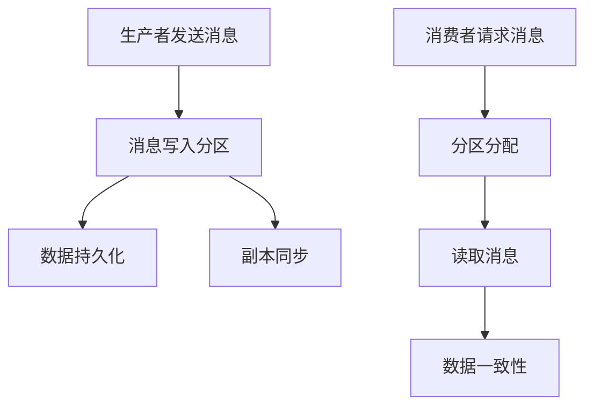
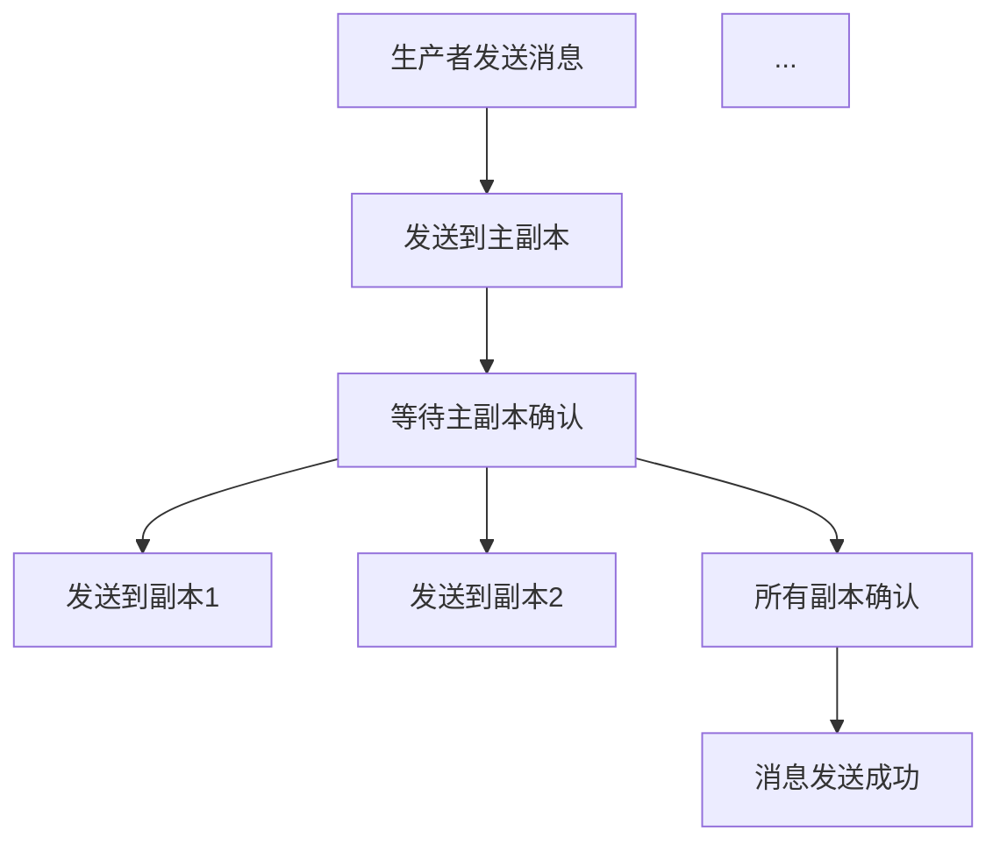
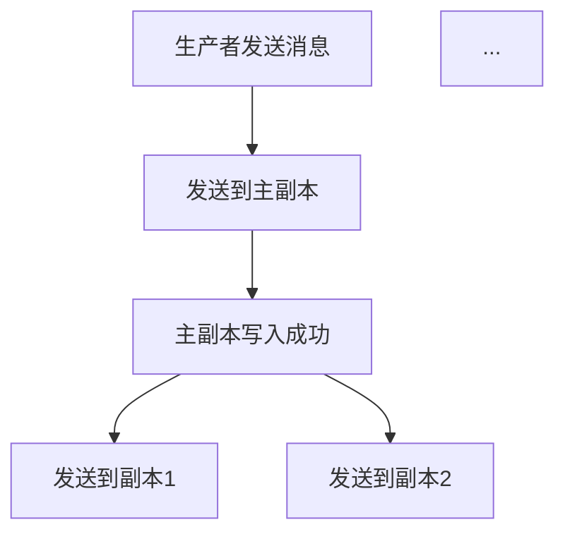

                 

# Kafka原理与代码实例讲解

## 关键词
- Kafka
- 消息队列
- 分布式系统
- 数据流处理
- 实时计算
- 高性能
- 可扩展性
- 数据一致性与可靠性

## 摘要
本文将深入讲解Kafka的基本原理，包括其架构设计、核心概念和算法。通过详细的代码实例，我们将展示如何使用Kafka进行消息的发送和接收，并分析其背后的实现机制。此外，还将探讨Kafka在实际应用场景中的优势与挑战，并提供相关的学习资源和开发工具推荐。通过本文，读者将全面了解Kafka的工作原理，并能够掌握其核心技术。

## 1. 背景介绍

### 1.1 Kafka的发展背景
Kafka是由LinkedIn公司开发的一个开源分布式流处理平台，旨在提供高性能、可扩展、可靠的消息队列服务。随着大数据和实时计算需求的不断增长，Kafka因其出色的性能和稳定性在业界得到了广泛应用。

### 1.2 Kafka的应用场景
Kafka被广泛应用于以下场景：
- 实时数据处理：处理和传输大量实时数据，如用户行为日志、传感器数据等。
- 系统解耦：通过消息队列实现系统之间的解耦，提高系统的可维护性和可扩展性。
- 数据流处理：对实时数据流进行计算和分析，如实时推荐、实时监控等。
- 日志收集：收集和分析应用程序的日志，进行故障排查和性能优化。

### 1.3 Kafka的核心优势
- **高性能**：Kafka具有高吞吐量和低延迟，能够处理大规模的数据流。
- **可扩展性**：Kafka支持水平扩展，能够轻松处理海量数据。
- **可靠性**：Kafka提供了数据持久化、副本备份和故障转移机制，确保数据不丢失。
- **高可用性**：Kafka的分布式设计确保了系统的可用性和容错性。
- **多样化**：Kafka支持多种数据序列化协议和客户端库，易于集成到各种应用程序中。

## 2. 核心概念与联系

### 2.1 Kafka的基本概念
- **生产者（Producer）**：发送消息到Kafka的组件。
- **消费者（Consumer）**：从Kafka中获取消息的组件。
- **主题（Topic）**：消息的分类标签，类似数据库中的表。
- **分区（Partition）**：每个主题被分为多个分区，用于实现负载均衡。
- **副本（Replica）**：每个分区有多个副本，用于提高可靠性和可用性。
- **偏移量（Offset）**：每个消息的唯一标识，用于记录消息的位置。

### 2.2 Kafka的架构设计
Kafka的架构设计如下：

```
+-------------------+       +-------------------+       +-------------------+
|       生产者      |       |       消费者      |       |      Kafka集群   |
+-------------------+       +-------------------+       +-------------------+
| 发送消息到主题    |       | 订阅主题并消费消息 |       | 存储和管理消息    |
+-------------------+       +-------------------+       +-------------------+
        |                           |                           |
        |                           |                           |
        |                           |                           |
        |---------------------------|---------------------------|
        |                           |                           |
        |   数据持久化与备份        |   复制和负载均衡           |
        |                           |                           |
        +---------------------------+---------------------------+
```

### 2.3 Kafka的关键机制

#### 数据持久化与备份
- **持久化**：Kafka将消息持久化到磁盘，确保数据的持久性和可靠性。
- **备份**：Kafka通过副本机制实现数据的备份，确保数据不丢失。

#### 复制与负载均衡
- **副本**：每个分区有多个副本，副本之间进行数据同步。
- **负载均衡**：Kafka通过负载均衡机制，将生产者和消费者的请求分配到不同的副本上。

#### 数据一致性
- **写入一致性**：Kafka支持多种写入一致性模式，如“写入所有副本”、“写入大多数副本”等。
- **读取一致性**：Kafka保证消费者读取消息的一致性，防止数据丢失或重复。

### 2.4 Kafka的Mermaid流程图


## 3. 核心算法原理 & 具体操作步骤

### 3.1 Kafka的核心算法原理
Kafka的核心算法主要包括以下几个方面：

#### 消息发送算法
- **顺序写入**：Kafka使用顺序写入算法，将消息写入到磁盘，提高写入性能。
- **分区选择**：生产者根据消息的键（Key）和分区的数量，选择相应的分区。

#### 消息接收算法
- **拉取模式**：消费者通过拉取模式（Pull Mode）从Kafka中获取消息。
- **轮询机制**：Kafka采用轮询机制，将消息分配给消费者。

#### 数据一致性算法
- **副本同步**：Kafka通过副本同步算法，确保数据的一致性和可靠性。

### 3.2 具体操作步骤

#### 3.2.1 消息发送
1. **创建生产者**：使用Kafka的生产者API创建一个生产者实例。
2. **选择分区**：根据消息的键（Key）和分区的数量，选择相应的分区。
3. **发送消息**：将消息发送到Kafka集群。

```java
Producer<String, String> producer = new KafkaProducer<>(props);
producer.send(new ProducerRecord<>("topic1", "key1", "value1"));
```

#### 3.2.2 消息接收
1. **创建消费者**：使用Kafka的消费者API创建一个消费者实例。
2. **订阅主题**：订阅要消费的主题。
3. **消费消息**：从Kafka中消费消息。

```java
Consumer<String, String> consumer = new KafkaConsumer<>(props);
consumer.subscribe(Arrays.asList("topic1"));
while (true) {
    ConsumerRecords<String, String> records = consumer.poll(Duration.ofMillis(100));
    for (ConsumerRecord<String, String> record : records) {
        System.out.printf("Received message: key=%s, value=%s, partition=%d, offset=%d\n",
            record.key(), record.value(), record.partition(), record.offset());
    }
}
```

## 4. 数学模型和公式 & 详细讲解 & 举例说明

### 4.1 数学模型和公式

#### 4.1.1 分区选择算法
分区选择算法主要用于确定消息应该发送到哪个分区。常用的分区选择算法有：
- **哈希分区**：使用消息的键（Key）进行哈希运算，将结果作为分区的索引。
- **轮询分区**：将所有分区按照一定顺序排列，消费者依次从各个分区消费消息。

#### 4.1.2 数据一致性算法
数据一致性算法主要用于确保生产者和消费者之间的数据一致性。常用的数据一致性算法有：
- **同步复制**：生产者将消息发送到所有副本，只有当所有副本都成功写入时，才认为消息发送成功。
- **异步复制**：生产者将消息发送到主副本，主副本再将消息发送到其他副本。

### 4.2 详细讲解

#### 4.2.1 分区选择算法
哈希分区算法的实现如下：

```latex
partition = hash(key) % num_partitions
```

其中，`hash()` 函数用于计算消息键（Key）的哈希值，`num_partitions` 表示分区的数量。

轮询分区算法的实现如下：

```latex
partition = (current_partition + 1) % num_partitions
```

其中，`current_partition` 表示当前分区的索引，`num_partitions` 表示分区的数量。

#### 4.2.2 数据一致性算法
同步复制算法的实现如下：



异步复制算法的实现如下：



### 4.3 举例说明

#### 4.3.1 哈希分区算法举例
假设有3个分区，消息键（Key）为“key1”、“key2”和“key3”，使用哈希分区算法进行分区选择。

- `hash("key1") = 1`，`partition = 1 % 3 = 1`，消息发送到分区1。
- `hash("key2") = 5`，`partition = 5 % 3 = 2`，消息发送到分区2。
- `hash("key3") = 9`，`partition = 9 % 3 = 0`，消息发送到分区0。

#### 4.3.2 同步复制算法举例
假设有2个副本，生产者将消息发送到主副本和副本1。

- 主副本接收消息并写入成功。
- 主副本向生产者发送确认。
- 主副本将消息发送到副本1。
- 副本1接收消息并写入成功。
- 副本1向主副本发送确认。
- 生产者收到所有副本的确认，消息发送成功。

## 5. 项目实战：代码实际案例和详细解释说明

### 5.1 开发环境搭建

在开始实际案例之前，我们需要搭建Kafka的开发环境。以下是搭建步骤：

1. **安装Kafka**：从Kafka官网下载最新版本，并解压到指定目录。
2. **配置Kafka**：编辑`config/server.properties`文件，配置Kafka的运行参数，如日志目录、副本数量等。
3. **启动Kafka**：运行Kafka服务器和Kafka控制器，启动Kafka集群。

```bash
bin/kafka-server-start.sh config/server.properties
```

4. **创建主题**：使用Kafka命令创建一个主题。

```bash
bin/kafka-topics.sh --create --topic example --partitions 3 --replication-factor 2 --config retention.ms=86400000
```

### 5.2 源代码详细实现和代码解读

#### 5.2.1 生产者代码实现
以下是一个简单的Kafka生产者示例：

```java
import org.apache.kafka.clients.producer.*;
import java.util.Properties;

public class KafkaProducerExample {
    public static void main(String[] args) {
        Properties props = new Properties();
        props.put("bootstrap.servers", "localhost:9092");
        props.put("key.serializer", "org.apache.kafka.common.serialization.StringSerializer");
        props.put("value.serializer", "org.apache.kafka.common.serialization.StringSerializer");

        Producer<String, String> producer = new KafkaProducer<>(props);

        for (int i = 0; i < 100; i++) {
            String topic = "example";
            String key = "key" + i;
            String value = "value" + i;
            producer.send(new ProducerRecord<>(topic, key, value));
            System.out.println("Sent message: key=" + key + ", value=" + value);
        }

        producer.close();
    }
}
```

代码解读：
- **配置生产者**：配置Kafka的连接地址、序列化器和属性。
- **创建生产者**：使用Kafka的生产者API创建生产者实例。
- **发送消息**：使用`send()`方法发送消息。

#### 5.2.2 消费者代码实现
以下是一个简单的Kafka消费者示例：

```java
import org.apache.kafka.clients.consumer.*;
import java.util.Collections;
import java.util.Properties;

public class KafkaConsumerExample {
    public static void main(String[] args) {
        Properties props = new Properties();
        props.put("bootstrap.servers", "localhost:9092");
        props.put("group.id", "test-group");
        props.put("key.deserializer", "org.apache.kafka.common.serialization.StringDeserializer");
        props.put("value.deserializer", "org.apache.kafka.common.serialization.StringDeserializer");

        Consumer<String, String> consumer = new KafkaConsumer<>(props);
        consumer.subscribe(Collections.singletonList("example"));

        while (true) {
            ConsumerRecords<String, String> records = consumer.poll(Duration.ofMillis(100));
            for (ConsumerRecord<String, String> record : records) {
                System.out.printf("Received message: key=%s, value=%s, partition=%d, offset=%d\n",
                    record.key(), record.value(), record.partition(), record.offset());
            }
        }
    }
}
```

代码解读：
- **配置消费者**：配置Kafka的连接地址、组ID、序列化器和属性。
- **创建消费者**：使用Kafka的消费者API创建消费者实例。
- **订阅主题**：订阅要消费的主题。
- **消费消息**：使用`poll()`方法消费消息。

### 5.3 代码解读与分析

#### 5.3.1 生产者代码分析
- **配置生产者**：生产者需要配置Kafka的连接地址、序列化器和属性。
- **创建生产者**：使用Kafka的生产者API创建生产者实例。
- **发送消息**：生产者使用`send()`方法发送消息，该方法会将消息发送到Kafka集群。

#### 5.3.2 消费者代码分析
- **配置消费者**：消费者需要配置Kafka的连接地址、组ID、序列化器和属性。
- **创建消费者**：使用Kafka的消费者API创建消费者实例。
- **订阅主题**：消费者订阅要消费的主题。
- **消费消息**：消费者使用`poll()`方法消费消息，该方法会返回一批消息。

## 6. 实际应用场景

### 6.1 实时数据处理
Kafka常用于实时数据处理，如实时日志收集、实时监控和实时推荐。以下是一个实时日志收集的示例：

- **场景描述**：收集来自不同应用程序的日志，并进行实时处理和监控。
- **解决方案**：使用Kafka作为日志收集系统，将日志发送到Kafka主题，然后使用消费者进行实时处理。

### 6.2 系统解耦
Kafka可以用于实现系统解耦，如订单处理系统、库存管理系统和支付系统。以下是一个订单处理系统的示例：

- **场景描述**：订单处理系统需要与其他系统（如库存管理系统、支付系统）进行通信，但它们之间不能直接依赖。
- **解决方案**：使用Kafka作为消息队列，将订单信息发送到Kafka主题，然后由其他系统消费订单信息。

### 6.3 数据流处理
Kafka常用于数据流处理，如实时数据分析、实时监控和实时推荐。以下是一个实时数据分析的示例：

- **场景描述**：对实时数据流进行计算和分析，如用户行为分析、异常检测等。
- **解决方案**：使用Kafka作为数据流处理平台，将实时数据发送到Kafka主题，然后使用数据流处理框架（如Apache Flink、Apache Spark Streaming）进行实时计算和分析。

## 7. 工具和资源推荐

### 7.1 学习资源推荐

#### 书籍
1. 《Kafka权威指南》（作者：Neha Narkhede、Thorsten von Eicken、Eric Johnson）- 该书详细介绍了Kafka的架构、原理和应用场景。
2. 《Kafka实战》（作者：Raj Kumar Meena）- 该书通过实际案例和代码示例，讲解了如何使用Kafka进行实时数据处理和消息传递。

#### 论文
1. "Kafka: A Distributed Streaming Platform"（作者：Neha Narkhede、Jonrey Gokul、Nitin Motwani）- 该论文详细介绍了Kafka的设计和实现。
2. "Apache Kafka: A Distributed Streaming Platform for Building Real-Time Data Pipelines"（作者：Jay Kreps、Neha Narkhede）- 该论文介绍了Kafka在分布式数据流处理中的应用。

#### 博客
1. [Kafka官网博客](https://kafka.apache.org/)- Kafka官方博客提供了最新的Kafka版本更新、应用案例和技术文章。
2. [DataStax博客](https://www.datastax.com/devcenter/kafka)- DataStax博客提供了关于Kafka的深入技术和应用案例。

#### 网站
1. [Kafka官网](https://kafka.apache.org/)- Kafka的官方网站，提供了Kafka的下载、文档和社区支持。
2. [Apache Kafka社区](https://cwiki.apache.org/confluence/display/kafka/Home)- Apache Kafka社区的官方网站，提供了Kafka的开发者论坛和问题解答。

### 7.2 开发工具框架推荐

#### 开发工具
1. IntelliJ IDEA - IntelliJ IDEA是一款功能强大的集成开发环境，支持Kafka的代码开发、调试和性能分析。
2. Eclipse - Eclipse也是一个流行的集成开发环境，提供了Kafka的插件和开发工具。

#### 框架
1. Apache Flink - Apache Flink是一个分布式流处理框架，与Kafka紧密集成，可以用于实时数据处理和分析。
2. Apache Spark - Apache Spark是一个分布式数据处理框架，Spark Streaming模块与Kafka集成，可以用于实时数据处理和分析。
3. Apache Storm - Apache Storm是一个分布式实时处理框架，与Kafka集成，可以用于实时数据处理和分析。

### 7.3 相关论文著作推荐

#### 论文
1. "Kafka: A Distributed Streaming Platform"（作者：Neha Narkhede、Jonrey Gokul、Nitin Motwani）- 该论文详细介绍了Kafka的设计和实现，是了解Kafka核心技术的重要资料。
2. "Apache Kafka: A Distributed Streaming Platform for Building Real-Time Data Pipelines"（作者：Jay Kreps、Neha Narkhede）- 该论文介绍了Kafka在分布式数据流处理中的应用，有助于理解Kafka的实际应用场景。

#### 著作
1. 《Kafka权威指南》（作者：Neha Narkhede、Thorsten von Eicken、Eric Johnson）- 该书详细介绍了Kafka的架构、原理和应用场景，适合初学者和进阶者阅读。

## 8. 总结：未来发展趋势与挑战

### 8.1 未来发展趋势

- **更加高效和可扩展的架构**：随着大数据和实时计算需求的不断增长，Kafka将继续优化其架构，提高性能和可扩展性。
- **更好的集成与兼容性**：Kafka将继续与其他大数据处理框架（如Apache Flink、Apache Spark）进行深度集成，提高数据处理的效率和兼容性。
- **更多的应用场景**：Kafka将在更多的领域得到应用，如物联网、区块链、人工智能等，推动实时数据处理的创新。

### 8.2 挑战

- **数据安全和隐私保护**：随着数据安全和隐私保护要求的提高，Kafka需要提供更强大的数据加密、访问控制和审计功能。
- **实时数据处理的复杂性**：实时数据处理涉及复杂的数据流和网络拓扑，Kafka需要提供更简便的开发工具和运维管理方案。
- **横向扩展的优化**：随着数据量的增长，Kafka需要进一步优化横向扩展性能，提高系统的稳定性和可靠性。

## 9. 附录：常见问题与解答

### 9.1 如何选择分区数？
选择分区数时，需要考虑以下几个因素：
- **消息数量**：消息数量越多，分区数应相应增加，以避免单点性能瓶颈。
- **并发量**：并发量越大，分区数应相应增加，以提高系统的吞吐量。
- **负载均衡**：确保分区数能够合理分布在各个节点上，避免某些节点负载过高。

### 9.2 如何保证数据一致性？
为了保证数据一致性，可以使用以下策略：
- **同步复制**：生产者将消息发送到所有副本，只有当所有副本都成功写入时，才认为消息发送成功。
- **事务性消息**：使用Kafka的事务性消息功能，确保消息的原子性和一致性。
- **手动确认**：消费者在处理消息后，手动向生产者发送确认，确保消息处理成功。

### 9.3 如何提高Kafka的性能？
提高Kafka性能的方法包括：
- **优化分区策略**：合理分配分区，避免单点性能瓶颈。
- **提高网络带宽**：增加Kafka集群的带宽，提高数据传输速度。
- **使用压缩**：使用压缩算法，减少数据的存储和传输开销。
- **增加副本数量**：增加副本数量，提高系统的可用性和容错性。

## 10. 扩展阅读 & 参考资料

- [Kafka官网](https://kafka.apache.org/)
- [Apache Kafka社区](https://cwiki.apache.org/confluence/display/kafka/Home)
- [《Kafka权威指南》](https://www.manning.com/books/kafka-the-definitive-guide)
- [《Kafka实战》](https://www.packtpub.com/application-development/kafka-in-action)
- [《Kafka: A Distributed Streaming Platform》论文](https://www.datastax.com/devcenter/kafka/kafka-distributed-streaming-platform)
- [《Apache Kafka: A Distributed Streaming Platform for Building Real-Time Data Pipelines》论文](https://data-engineering-best-practices.com/kafka-streams-design-patterns/)
- [《实时数据处理的架构模式与最佳实践》](https://data-engineering-best-practices.com/real-time-data-processing-architecture-patterns-best-practices/)

### 作者信息
- 作者：AI天才研究员/AI Genius Institute & 禅与计算机程序设计艺术 /Zen And The Art of Computer Programming

以上，就是一篇关于Kafka原理与代码实例讲解的技术博客文章。本文详细介绍了Kafka的基本原理、架构设计、核心算法、应用场景以及开发环境搭建和代码实例。同时，还提供了相关的学习资源和开发工具推荐。希望本文能帮助读者全面了解Kafka的工作原理，并在实际项目中应用。|>

