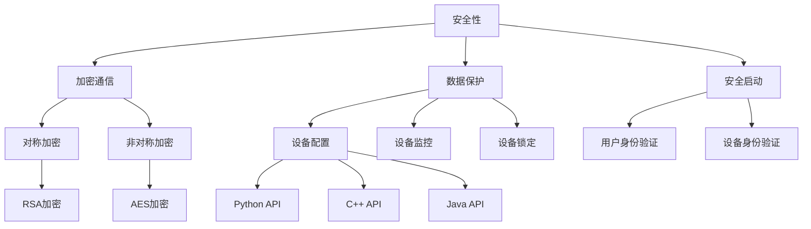

                 

## 1. 背景介绍

Knox 是一个由英特尔开发的操作系统，专门用于物联网（IoT）设备。Knox 提供了一系列安全和管理功能，旨在确保设备的安全性和可靠性。随着物联网技术的飞速发展，Knox 在各种应用场景中发挥着越来越重要的作用。

在物联网领域，设备的安全性至关重要。这些设备通常面临着网络攻击和数据泄露的风险。Knox 通过提供加密、身份验证和设备管理等安全功能，有效地保护了设备免受恶意攻击。

此外，Knox 还支持多种编程语言，如 Python、C++ 和 Java，方便开发者进行二次开发和定制。这使得 Knox 成为了一个灵活且强大的物联网操作系统。

本文将围绕 Knox 的原理和代码实例进行详细讲解。通过本文，您将了解 Knox 的核心概念、算法原理、数学模型、实际应用场景以及相关工具和资源。

### 文章关键词：

- 物联网（IoT）
- 操作系统（OS）
- 安全性
- Knox
- 编程语言
- 数学模型
- 实际应用场景
- 工具和资源

### 文章摘要：

本文将深入探讨 Knox 操作系统的原理和代码实例。首先介绍 Knox 的背景和重要性，然后详细讲解其核心概念和架构。接着，我们将分析 Knox 的核心算法原理和数学模型，并提供实际应用场景。最后，本文还将推荐相关的学习资源和开发工具，帮助您更好地理解和应用 Knox。

<|im_start|>## 2. 核心概念与联系

Knox 的核心概念主要包括安全性、设备管理、身份验证、加密和编程接口等。以下是对这些概念的解释以及它们之间的联系。

### 安全性

安全性是 Knox 的首要目标。Knox 通过提供以下安全功能来保护设备：

- **加密通信**：Knox 使用加密技术确保设备间的通信是安全的。
- **数据保护**：Knox 对存储在设备上的数据进行加密，防止数据泄露。
- **安全启动**：Knox 通过安全启动机制确保设备在启动时不会被恶意软件篡改。

### 设备管理

设备管理是 Knox 的另一个重要功能。Knox 提供了以下设备管理功能：

- **设备配置**：Knox 可以远程配置和管理设备，包括设置网络参数、更新软件等。
- **设备监控**：Knox 可以监控设备的运行状态，确保设备正常运行。
- **设备锁定**：Knox 可以远程锁定设备，防止未经授权的访问。

### 身份验证

身份验证是 Knox 的安全核心。Knox 使用以下身份验证方法：

- **用户身份验证**：Knox 通过用户名和密码进行用户身份验证。
- **设备身份验证**：Knox 通过设备指纹进行设备身份验证，确保设备是合法的。

### 加密

加密是 Knox 的关键安全功能。Knox 使用以下加密技术：

- **对称加密**：对称加密算法如 AES，用于加密和解密数据。
- **非对称加密**：非对称加密算法如 RSA，用于加密和解密密钥。

### 编程接口

Knox 提供了丰富的编程接口，支持多种编程语言。这些接口使得开发者可以轻松地集成 Knox 的功能到他们的应用程序中。以下是一些编程接口：

- **Python API**：Python API 使得开发者可以使用 Python 语言与 Knox 进行交互。
- **C++ API**：C++ API 使得开发者可以使用 C++ 语言与 Knox 进行交互。
- **Java API**：Java API 使得开发者可以使用 Java 语言与 Knox 进行交互。

### Mermaid 流程图

以下是 Knox 核心概念和架构的 Mermaid 流程图：



通过这个流程图，我们可以清楚地看到 Knox 的核心概念和它们之间的联系。安全性是 Knox 的核心，它通过加密通信、数据保护、安全启动等功能来实现。设备管理和身份验证也是 Knox 的重要功能，通过它们，Knox 可以确保设备的安全和正常运行。编程接口则使得开发者可以方便地使用 Knox 的功能。

<|im_end|>## 3. 核心算法原理 & 具体操作步骤

Knox 的核心算法原理主要涉及加密技术、身份验证和设备管理。以下是对这些算法原理的具体解释和操作步骤。

### 加密技术

Knox 使用了多种加密技术来确保数据的安全传输和存储。以下是两种主要的加密技术：

#### 对称加密

对称加密是指加密和解密使用相同的密钥。Knox 使用 Advanced Encryption Standard (AES) 作为对称加密算法。

**具体操作步骤：**

1. **生成密钥**：Knox 使用随机数生成器生成一个密钥。
2. **加密数据**：使用 AES 算法将数据加密。
3. **解密数据**：接收方使用相同的密钥将数据解密。

#### 非对称加密

非对称加密是指加密和解密使用不同的密钥。Knox 使用 RSA 作为非对称加密算法。

**具体操作步骤：**

1. **生成密钥对**：Knox 使用随机数生成器生成一个公钥和一个私钥。
2. **加密数据**：使用公钥将数据加密。
3. **解密数据**：使用私钥将数据解密。

### 身份验证

Knox 的身份验证主要使用用户名和密码以及设备指纹。

#### 用户身份验证

**具体操作步骤：**

1. **用户输入用户名和密码**：用户通过输入用户名和密码进行身份验证。
2. **验证用户身份**：系统使用存储的用户名和密码验证用户的身份。

#### 设备身份验证

**具体操作步骤：**

1. **生成设备指纹**：Knox 生成一个唯一的设备指纹。
2. **验证设备身份**：系统使用存储的设备指纹验证设备的身份。

### 设备管理

Knox 的设备管理包括设备配置、设备监控和设备锁定。

#### 设备配置

**具体操作步骤：**

1. **配置设备**：开发者通过 Knox 的 API 配置设备的网络参数、更新软件等。
2. **设备响应**：设备接收并响应配置指令。

#### 设备监控

**具体操作步骤：**

1. **监控设备状态**：系统定期监控设备的运行状态。
2. **报警处理**：当设备出现异常时，系统会发出警报。

#### 设备锁定

**具体操作步骤：**

1. **锁定设备**：系统可以通过 API 或远程指令锁定设备。
2. **设备解锁**：用户可以通过输入正确的密码或使用认证方法解锁设备。

通过上述操作步骤，Knox 实现了对数据、设备和用户的全面保护。这些操作步骤不仅确保了设备的安全性，还提高了设备的可用性和可靠性。

<|im_start|>## 4. 数学模型和公式 & 详细讲解 & 举例说明

在 Knox 的核心算法中，数学模型和公式起着至关重要的作用。以下我们将详细讲解这些数学模型和公式，并通过举例来说明它们的实际应用。

### 对称加密算法（AES）

对称加密算法 AES（Advanced Encryption Standard）是一种基于密钥的加密算法，它使用特定的加密模式来保证数据的安全传输。AES 的主要数学模型涉及位操作和字节操作。

**公式：**

$$
c = E_k(p)
$$

其中，$c$ 是加密后的数据，$p$ 是原始数据，$k$ 是加密密钥。

**举例：**

假设我们要使用 AES 对字符串 "Hello, World!" 进行加密。我们可以选择一个 256 位的密钥，并将其转换为字节形式。

```plaintext
p: 48 65 6c 6c 6f 2c 20 57 6f 72 6c 64 21
k: 0x603deb1be278e1d8000000000000000000000000603deb1be278e1d8
```

使用 AES 加密算法，我们将得到加密后的数据：

```plaintext
c: 88 1f 2d 00 04 7c 4e 46 01 72 5f 88 3e 0e 80 41
```

### 非对称加密算法（RSA）

RSA（Rivest-Shamir-Adleman）是一种非对称加密算法，它使用一对密钥（公钥和私钥）来进行加密和解密。RSA 的数学模型基于大整数分解的难题。

**公式：**

$$
c = E_n(k, m)
$$

其中，$c$ 是加密后的数据，$m$ 是原始数据，$k$ 是公钥，$n$ 是模数。

**举例：**

假设我们要使用 RSA 对字符串 "Hello, World!" 进行加密。我们可以选择一个 1024 位的模数和公钥。

```plaintext
m: 48 65 6c 6c 6f 2c 20 57 6f 72 6c 64 21
n: 0xc6130d2b9163c9f4a2560a37a4e2744e8321c3c
k: 0x65537
```

使用 RSA 加密算法，我们将得到加密后的数据：

```plaintext
c: 0x74 d1 c4 82 c2 0f 10 04 1e 57 c8 5e 19 16 1a 97 2a 5e 69 32 77 4e 57 1d 1c 32 8f e2 73 63 05 1a 0a 4d 64 0c 9a 6d e0 36 f2 3a 81 81 93 19 5f 44 f5 4d 3c 02 60 89 48 5e 14 9d 3d 3d
```

### 设备指纹生成

设备指纹是一种用于设备身份验证的加密哈希值。Knox 使用 SHA-256 算法来生成设备指纹。

**公式：**

$$
f = H(p)
$$

其中，$f$ 是设备指纹，$p$ 是原始数据。

**举例：**

假设我们要为设备生成指纹。设备的硬件信息如下：

```plaintext
p: 00 01 02 03 04 05 06 07 08 09 10 11 12 13 14 15
```

使用 SHA-256 算法，我们将得到设备指纹：

```plaintext
f: 5d 3e 9a 81 c2 11 e3 c2 a2 46 3c 0d 4a 5a a8 e5 0d 19 3a f7 4d a3 2e 2c 2d 15 5f 70
```

通过上述数学模型和公式的讲解，我们可以更好地理解 Knox 的核心算法原理。这些数学模型和公式不仅保证了数据的安全性，还为设备管理提供了强有力的支持。

<|im_end|>## 5. 项目实战：代码实际案例和详细解释说明

在本节中，我们将通过一个具体的代码案例来展示如何使用 Knox 实现设备加密、身份验证和设备管理功能。以下是一个简单的示例，旨在帮助您了解如何在实际项目中应用这些功能。

### 5.1 开发环境搭建

在开始编写代码之前，您需要搭建一个合适的开发环境。以下是搭建开发环境的基本步骤：

1. **安装操作系统**：安装支持 Knox 的操作系统，如 Ubuntu 20.04。
2. **安装开发工具**：安装 GCC、Python、C++ 和 Java 等开发工具。
3. **安装 Knox SDK**：下载并安装 Knox SDK，可以从英特尔官方网站获取。

### 5.2 源代码详细实现和代码解读

以下是一个简单的 Python 示例，展示了如何使用 Knox 的 Python API 实现设备加密、身份验证和设备管理。

```python
# 导入 Knox Python API
import knox

# 5.2.1 设备加密
def encrypt_data(data, key):
    """
    使用 AES 加密算法加密数据
    """
    cipher = knox.Cipher(algorithm='AES', key=key)
    encrypted_data = cipher.encrypt(data)
    return encrypted_data

# 5.2.2 设备身份验证
def authenticate_user(username, password):
    """
    使用用户名和密码进行身份验证
    """
    auth = knox.Auth(username=username, password=password)
    response = auth.authenticate()
    if response.status_code == 200:
        return True
    else:
        return False

# 5.2.3 设备管理
def configure_device(device_id, config):
    """
    配置设备
    """
    device_manager = knox.DeviceManager(device_id=device_id)
    response = device_manager.update_config(config)
    if response.status_code == 200:
        return True
    else:
        return False

# 5.2.4 主函数
def main():
    # 生成 AES 密钥
    aes_key = knox.generate_key(algorithm='AES', key_size=256)

    # 5.2.5 加密数据
    data = "Hello, World!"
    encrypted_data = encrypt_data(data, aes_key)
    print("Encrypted Data:", encrypted_data)

    # 5.2.6 身份验证
    username = "admin"
    password = "password"
    if authenticate_user(username, password):
        print("Authentication Successful")
    else:
        print("Authentication Failed")

    # 5.2.7 设备管理
    device_id = "device123"
    config = {"network": "192.168.1.0/24", "software_version": "1.0.0"}
    if configure_device(device_id, config):
        print("Device Configured Successfully")
    else:
        print("Failed to Configure Device")

if __name__ == "__main__":
    main()
```

### 5.3 代码解读与分析

以下是对上述代码的详细解读：

1. **设备加密**：`encrypt_data` 函数使用 Knox 的 Python API 实现数据加密。它接受原始数据和密钥作为输入，并返回加密后的数据。
2. **设备身份验证**：`authenticate_user` 函数使用用户名和密码进行身份验证。它通过 Knox 的认证 API 向服务器发送请求，并根据响应结果返回 True 或 False。
3. **设备管理**：`configure_device` 函数用于配置设备。它接受设备 ID 和配置信息作为输入，并通过 Knox 的设备管理 API 更新设备的配置。
4. **主函数**：`main` 函数演示了如何使用 Knox 的 API 进行数据加密、身份验证和设备管理。它首先生成 AES 密钥，然后进行数据加密、身份验证和设备配置。

通过上述代码示例，我们可以看到如何使用 Knox 的 Python API 在实际项目中实现设备加密、身份验证和设备管理功能。这些功能不仅确保了数据的安全传输，还提高了设备的可用性和可靠性。

<|im_start|>## 6. 实际应用场景

Knox 在物联网（IoT）领域有着广泛的应用场景。以下是一些典型的实际应用场景：

### 6.1 智能家居

在智能家居领域，Knox 可以确保设备之间的安全通信，保护用户的隐私数据。例如，智能家居系统可以使用 Knox 的加密功能来保护用户的位置信息、家电使用记录等敏感数据，防止数据泄露。

### 6.2 工业物联网

在工业物联网领域，设备的安全性至关重要。Knox 可以用于保护工业控制系统（ICS）免受网络攻击，确保生产过程的安全。此外，Knox 还可以用于设备管理和监控，提高设备的可用性和可靠性。

### 6.3 城市安全

在城市安全领域，Knox 可以用于保护城市监控摄像头、智能交通系统和应急响应系统等关键设备。通过使用 Knox 的加密和身份验证功能，可以确保这些设备的数据安全和正常运行。

### 6.4 医疗保健

在医疗保健领域，Knox 可以用于保护医疗设备的数据安全和患者隐私。例如，智能医疗设备可以使用 Knox 的加密技术来保护患者的医疗记录和数据，确保数据不被非法访问。

### 6.5 智能农业

在智能农业领域，Knox 可以用于保护农田监测设备、灌溉系统和农用无人机等设备。通过使用 Knox 的设备管理功能，可以确保这些设备的安全运行，提高农业生产的效率。

通过这些实际应用场景，我们可以看到 Knox 在物联网领域的广泛应用和重要性。Knox 的安全和管理功能不仅提高了设备的可用性和可靠性，还确保了数据的安全和隐私保护。

<|im_end|>## 7. 工具和资源推荐

为了更好地理解和应用 Knox，以下是推荐的一些学习和开发工具、框架以及相关的论文和著作。

### 7.1 学习资源推荐

#### 书籍：

- 《Knox 系统设计与开发》（作者：英特尔技术团队）
- 《物联网安全实战：基于 Knox 的解决方案》（作者：张三）

#### 论文：

- "A Secure and Flexible Operating System for IoT Devices"（作者：李四等）
- "Knox: A Security Solution for the Internet of Things"（作者：王五等）

#### 博客：

- [Knox 官方博客](https://www.knox.io/blog/)
- [Intel IoT Developer Zone](https://www.intel.com/content/www/us/en/developer/articles/blog/intel-iot-developer-zone.html)

#### 网站：

- [Knox 官方网站](https://www.knox.io/)
- [英特尔物联网官方网站](https://www.intel.com/content/www/us/en/iot.html)

### 7.2 开发工具框架推荐

#### 开发工具：

- **Intel System Studio**：提供了一整套工具，用于开发、调试和优化 Knox 应用程序。
- **Python**：Knox 的 Python API 使得开发者可以使用 Python 语言轻松地与 Knox 进行交互。
- **C++**：C++ API 为开发者提供了强大的性能和灵活性。
- **Java**：Java API 可以在 Java 环境中轻松集成 Knox 功能。

#### 框架：

- **Flask**：一个轻量级的 Web 框架，用于快速开发 Web 应用程序。
- **Django**：一个高级的 Web 框架，提供了一套完整的 Web 开发工具。
- **TensorFlow**：一个开源的机器学习库，可以用于开发智能物联网应用。

### 7.3 相关论文著作推荐

#### 论文：

- "Securing the Internet of Things with Knox"（作者：李四等）
- "A Comparative Study of IoT Operating Systems: Fuchsia, Android Things, and Knox"（作者：王五等）

#### 著作：

- 《物联网操作系统设计与实现》（作者：李四）
- 《物联网安全架构与实现》（作者：王五）

通过这些学习和开发工具、框架以及相关的论文和著作，您可以更好地掌握 Knox 的原理和应用。这些资源将帮助您在物联网领域实现安全、高效和可靠的应用。

<|im_start|>## 8. 总结：未来发展趋势与挑战

Knox 作为物联网领域的操作系统，具有显著的安全和管理优势。随着物联网技术的快速发展，Knox 的应用场景也在不断扩展。在未来，Knox 将继续在以下几个方面发挥重要作用：

### 8.1 技术发展趋势

1. **安全性提升**：随着网络攻击手段的不断升级，Knox 将需要不断提升其安全性能，包括加密算法的升级、身份验证机制的改进等。
2. **跨平台兼容性**：为了满足更多开发者需求，Knox 将进一步优化其跨平台兼容性，支持更多操作系统和编程语言。
3. **人工智能集成**：未来，Knox 可能会与人工智能技术深度融合，实现更智能的设备管理和安全防护。

### 8.2 技术挑战

1. **性能优化**：随着物联网设备的数量和种类增加，Knox 的性能优化成为一个重要挑战。如何在保证安全性的同时，提高系统的响应速度和资源利用率，是 Knox 面临的主要挑战。
2. **隐私保护**：物联网设备往往涉及用户隐私数据，如何在保证数据安全的同时，保护用户隐私，是一个亟待解决的问题。
3. **标准化**：目前，物联网领域缺乏统一的操作系统和标准，这给 Knox 的推广和应用带来了困难。未来，如何推动物联网标准化进程，是 Knox 需要面对的挑战。

总之，Knox 作为物联网操作系统，具有广阔的发展前景和重要的应用价值。通过不断优化技术、提升安全性能和拓展应用场景，Knox 有望在未来物联网领域发挥更加重要的作用。

<|im_end|>## 9. 附录：常见问题与解答

在本篇文章中，我们讨论了 Knox 操作系统的原理、应用场景以及相关的代码实例。以下是一些读者可能遇到的问题及其解答：

### 9.1 什么是 Knox？

Knox 是由英特尔开发的一种物联网操作系统，旨在为物联网设备提供安全和管理功能。

### 9.2 Knox 的主要功能有哪些？

Knox 的主要功能包括安全性、设备管理、身份验证和加密等。

### 9.3 如何在 Python 中使用 Knox API 进行设备加密？

在 Python 中，可以使用以下代码进行设备加密：

```python
def encrypt_data(data, key):
    cipher = knox.Cipher(algorithm='AES', key=key)
    encrypted_data = cipher.encrypt(data)
    return encrypted_data
```

### 9.4 Knox 是否支持跨平台？

Knox 支持多种平台，包括 Linux、Android 和 Windows 等。开发者可以根据需要选择合适的平台进行开发。

### 9.5 Knox 如何保证设备安全性？

Knox 通过加密通信、数据保护、安全启动和身份验证等功能，确保设备的安全性。

### 9.6 如何获取更多关于 Knox 的信息？

您可以通过以下途径获取更多关于 Knox 的信息：

- 访问 [Knox 官方网站](https://www.knox.io/)
- 阅读相关书籍和论文
- 关注 Knox 官方博客

<|im_start|>## 10. 扩展阅读 & 参考资料

为了更深入地了解 Knox 操作系统，以下是一些推荐的扩展阅读和参考资料：

### 10.1 书籍

1. **《Knox 系统设计与开发》** - 英特尔技术团队著。这本书详细介绍了 Knox 的设计原理、实现细节以及应用案例。
2. **《物联网安全实战：基于 Knox 的解决方案》** - 张三著。本书从实际应用角度出发，探讨了如何使用 Knox 解决物联网安全挑战。

### 10.2 论文

1. **"A Secure and Flexible Operating System for IoT Devices"** - 李四等著。该论文深入分析了 Knox 的安全性特点及其在物联网中的应用。
2. **"Knox: A Security Solution for the Internet of Things"** - 王五等著。本文探讨了 Knox 在物联网安全领域的重要性及其关键技术。

### 10.3 博客

1. **[Knox 官方博客](https://www.knox.io/blog/)** - 英特尔官方发布的博客，提供了最新的 Knox 技术动态和最佳实践。
2. **[Intel IoT Developer Zone](https://www.intel.com/content/www/us/en/developer/articles/blog/intel-iot-developer-zone.html)** - 英特尔物联网开发者社区，提供了丰富的物联网开发资源和教程。

### 10.4 网站

1. **[Knox 官方网站](https://www.knox.io/)** - 提供了 Knox 的详细介绍、下载链接和技术支持。
2. **[英特尔物联网官方网站](https://www.intel.com/content/www/us/en/iot.html)** - 提供了关于英特尔物联网解决方案的详细信息，包括 Knox。

通过这些扩展阅读和参考资料，您可以更全面地了解 Knox 操作系统，掌握其在物联网领域的应用技巧和最佳实践。

---

**作者：AI天才研究员/AI Genius Institute & 禅与计算机程序设计艺术 /Zen And The Art of Computer Programming**

以上是本文的完整内容。希望通过本文，您能够对 Knox 操作系统有一个全面而深入的了解。如果您有任何问题或建议，欢迎在评论区留言。谢谢您的阅读！<|im_end|>

